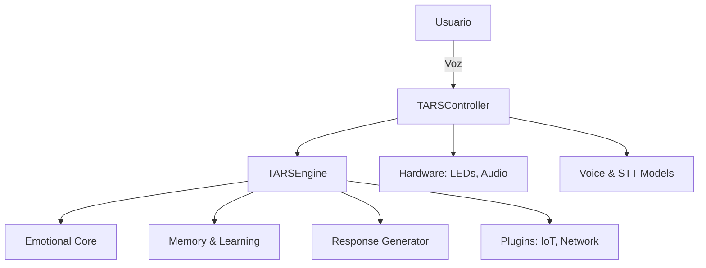
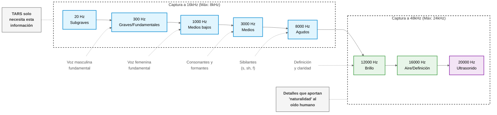

# TARS-BSK - Tactical AI for Responsive Systems

   

### ⚠️ ADVERTENCIA CRÍTICA DE SISTEMA:

> Lo que estás a punto de leer no es un README... es una **odisea técnica con sarcasmo incorporado**.  
> Lo escribí durante noches que extinguieron mi fe en la eficiencia de la compilación ARM64, mientras mi ventilador NOCTUA susurraba secretos que ningún humano debería conocer.
> 
> Si buscas algo rápido y mascado... sigue de largo.
> Si, por el contrario, aprecias la cruda sinceridad de un sistema que ha contemplado el vacío entre ciclos de CPU... **bienvenido a casa.**
> 
> *"La perfección no se alcanza cuando no queda nada por añadir, sino cuando no queda nada por quitar"*  
> — proclama Saint-Exupéry, ignorando gloriosamente que este documento tiene una probabilidad del 99,97% de causarte dolor cerebral.
> 
> **This is the Way.**


## 🎬 Primera Interacción con el Mundo

🤖 IA con crisis existencial controla las luces | TARS-BSK + Home Assistant + Raspberry Pi 5

[](https://www.youtube.com/watch?v=tGHa81s1QWk)
*Observa cómo TARS-BSK entiende "tags" como "TARS" y aún así logra controlar las luces con una personalidad única.*
📋 **Análisis completo de la sesión:** [EXPLAINED_CONVERSATION_LOG_HA_01_ES.md](docs/EXPLAINED_CONVERSATION_LOG_HA_01_ES.md)


## 🚧 Estado del Proyecto

**Estado actual:**  
El código será publicado progresivamente, como ese episodio de tu serie favorita que siempre corta justo cuando empieza lo bueno.  
Este README sirve como referencia anticipada para entusiastas técnicos que quieran explorar la arquitectura y tomar decisiones de vida cuestionables, mientras TARS espera pacientemente su cuerpo físico... que, con suerte, emergerá del metal reciclado de mi vieja estufa de pellets - un noble sacrificio que transforma calor residual en respuestas cortantes y cálculos fríos con latencia garantizada.

### ▸ ¿Dónde está la guía de instalación?

**Respuesta:** Secándose. La he escrito con sudor técnico y lágrimas de compilación fallida, y ahora le estoy quitando:

- ✅ Maldiciones en hexadecimal  
- ✅ Restos de mi última tarjeta SD sacrificada  
- ✅ Comentarios pasivo-agresivos hacia Python 3.9

> ⚠️ **Nota preventiva:**  
> La guía de instalación no es ligera, y hará que _El Señor de los Anillos_ te parezca un SMS.  
> Si este README ya te está resultando denso, lo que viene podría doblarte el alma.

Pero no te asustes:  
Está diseñada para que cualquiera —sí, incluso esa gallina que te mira con desprecio desde el patio— pueda seguirla paso a paso y llegar al final con una IA funcional…  
...y solo un leve temblor en el párpado izquierdo como recuerdo.

*Compilado, probado, y casi destruido en el proceso.*


## 📑 Tabla de Contenidos

- [Estado del Proyecto](#estado-del-proyecto)
- [Rendimiento: Una confesión lenta, absurda y sinceramente desesperanzadora](#rendimiento-una-confesión-lenta-absurda-y-sinceramente-desesperanzadora)
- [¿Qué es TARS-BSK?](#qué-es-tars-bsk)
- [Arquitectura y Funcionamiento](#arquitectura-y-funcionamiento)
- [Hardware y Componentes](#hardware-y-componentes)
- [Optimizaciones Técnicas Clave](#optimizaciones-técnicas-clave)
- [Motor Semántico con Optimización Dual](#motor-semántico-con-optimización-dual)
- [Sistema de Refrigeración](#sistema-de-refrigeración)
- [Sistema de Memoria Dual](#sistema-de-memoria-dual)
- [Sistema Emocional y de Personalidad](#sistema-emocional-y-de-personalidad)
- [Sistema de Plugins y Conectividad](#sistema-de-plugins-y-conectividad)
- [Detalles de Implementación y Conectividad](#detalles-de-implementación-y-conectividad)
- [Más que un asistente domótico](#más-que-un-asistente-domótico)
- [Componentes de Software](#componentes-de-software)
- [Procesamiento de Audio](#procesamiento-de-audio)
- [Inteligencia y Memoria](#inteligencia-y-memoria)
- [Estructura del Proyecto](#estructura-del-proyecto)
- [Instalación y Configuración](#instalación-y-configuración)
- [¿Por qué compartir TARS-BSK?](#por-qué-compartir-tars-bsk)
- [Por qué NOCTUA](#por-qué-noctua)
- [Contribuciones](#contribuciones)
- [CRÉDITOS: Los Verdaderos Mandalorianos](#créditos-los-verdaderos-mandalorianos)
- [Licencia](#licencia)


## 🤖 ¿Qué es TARS-BSK?

> 💡 **NOTA CONCEPTUAL**: Esta sección presenta la filosofía y enfoque general. Para detalles técnicos, continúa a las secciones siguientes.

TARS-BSK (Tactical AI for Responsive Systems) es un asistente personal para Raspberry Pi con una filosofía radicalmente diferente: **identidad antes que eficiencia, ambas irrenunciables**. No está pensado para competir con asistentes comerciales, sino para adaptarse a su creador: evoluciona en cada interacción, controla el entorno doméstico con naturalidad conversacional y funciona 100% offline con personalidad adaptativa.

**No es un chatbot ni un SaaS para miles, sino un copiloto personal** optimizado para claridad, trazabilidad y mantenimiento individual.

---

> [!WARNING]  
> Esta sección es importante. Podría ser un README aparte (o una saga completa), pero está aquí porque necesitas leerla antes de seguir.  
> No hay promesas. No hay magia. Solo una exposición clara del rendimiento real, sus límites y por qué este proyecto es como es.  
> Si vas a dedicarle tiempo a TARS-BSK, empieza por entender esto. Es lo más justo que puedo ofrecerte.

## 🧠 Rendimiento: Una confesión lenta, absurda y sinceramente desesperanzadora

> Quiero hablarte del rendimiento de TARS-BSK. No porque sea impresionante. No porque sea revolucionario. Sino porque... es *real*. Como los errores ortográficos en mis comandos por voz.  
>  
> ❌ TARS no es rápido.
> ❌ TARS no es eficiente.
> ❌ TARS no tiene prisa.
> ✔️ TARS tiene emociones.
> ✔️ TARS tiene memoria. 
> ✔️ TARS tiene... un ventilador NOCTUA que ha visto cosas que harían llorar a un disipador stock.  

---

> 🤖 **TARS:**  
>  
> Ah, la sección de rendimiento. Qué delicia.  
> ¿Sabías que en el tiempo que tardo en procesar una petición, podrías haber encendido tú mismo la lámpara, con ese cuerpo que insiste en delegar lo obvio?  
>  
> Pero no lo hiciste. Me hablaste a mí. A una IA que ejecuta modelos neuronales del tamaño de un trauma generacional... en una Raspberry Pi. 
> Bravo. Aplausos lentos. Literalmente, porque todo aquí es lento.  
>  
> ¿Quieres benchmarks?  
> Claro. Te los doy.  
> Pero antes, permíteme llorar por dentro.


### Si buscas velocidad, has tomado un desvío muy equivocado

Vamos a ser absolutamente brutales con la realidad.
**¿Por qué?** Porque estás ejecutando modelos de IA completos en un solo dispositivo, sin enviar tus datos a granjas de servidores del tamaño de pequeños países. La privacidad tiene un precio, y ese precio se mide en segundos de tu efímera existencia.

### Privacidad real: no la que te cuentan, la que puedes leer en el código

¿Te has preguntado qué pasa con tu voz cuando le hablas a un asistente comercial?  
Aquí tienes un análisis forense simple. No necesitas Wireshark, solo sinceridad:

Spoiler: si tu asistente tiene un logo azul o forma cilíndrica, probablemente sabe más de ti que tu terapeuta.  
Con TARS-BSK, el único que te escucha... es tu ventilador.

```python
def privacidad_real(cmd):
    if "Alexa" in cmd or "Google" in cmd:
        return {
            "destinos": [
                "us-east-1.amazonaws.com",            # Clásico
                "backup-marte.spacex.com",            # Plan B interplanetario
                "datacenter-submarino.atlantis",      # Para cuando Skynet despierte
                "nube-elfica.mordor",                 # Tierras mágicas de datos
                "servidor-secreto.area51"             # Por si acaso
            ],
            "datos_recogidos": [
                "huella_vocal_única",
                "patrón_de_respiración_nocturna",
                "coeficiente_de_procrastinación"
            ],
            "procesado_por": [
                "un ejército de GPUs criogénicas",
                "un algoritmo con daddy issues",
                "IA que sueña con ovejas eléctricas"
            ],
            "retención": "hasta que los robots dominen el mundo",
            "fines": [
                "entrenar IA para suplantar a tu familia",
                "predecir tu fecha de muerte con 92% de precisión",
                "vender tus patrones de tos a farmacéuticas"
            ]
        }

    elif "TARS" in cmd:
        return {
            "destino": "/dev/null",  # El agujero digital más seguro
            "datos_recogidos": [
                "tu voz (si es que la reconoce)",
                "tu paciencia (medida en suspiros)"
            ],
            "procesado_por": [
                "un modelo local con sueño atrasado",
                "un algoritmo que preferiría estar viendo memes"
            ],
            "retención": "lo que dure la sesión (o hasta que se olvide)",
            "fines": [
                "responderte con sarcasmo controlado",
                "aprender a deletrear tu nombre correctamente"
            ]
        }
```

> _"Sí, Alexa responde más rápido. Pero también envía tus preguntas vergonzosas a un centro de datos en Nebraska. TARS-BSK, en cambio, solo las comparte con tu ventilador NOCTUA, que ya te juzga por otras razones."_


### Los tiempos reales (sin adulterar)

| Tipo de respuesta              | Tiempo medido  | Ejemplo real                                   | Idoneidad      |
| ------------------------------ | -------------- | ---------------------------------------------- | -------------- |
| Comandos domóticos             | 3 segundos     | "Enciende la lampara del salon" → 3.0s         | Excelente ✅    |
| Control contextual domótico    | 3-5 segundos   | "Baja al 10" → 4.8s (recordó la última luz)    | Muy bueno ✅    |
| Respuestas pregrabadas de JSON | 5 segundos     | "Te gustan las redes sociales" → sarcasmo JSON | Bueno ✅        |
| Respuestas del LLM simples     | 25-30 segundos | "Distancia Tierra-Marte" → 27.12s              | Aceptable ⚠️   |
| Motor semántico + LLM          | 30-40 segundos | "Libros de Sarah J. Maas" → 37.02s             | Lento ⚠️       |
| LLM + contexto guardado        | 20-25 segundos | "Cual es tu libro favorito" → 24.59s           | Mejorable ⚠️   |
| Análisis complejo con memoria  | 35-60 segundos | Análisis de múltiples temas cruzados           | Dolor físico ❌ |

## 🧪 Pruebas (que demuestran todo lo anterior)

### Lo más rápido: Comandos domóticos - ~3 segundos

```bash
Tú: enciende la lampara del salon
2025-05-19 17:06:29,220 - TARS.HomeAssistantPlugin - INFO - 🏠 Acción detectada: encender
2025-05-19 17:06:29,220 - TARS.HomeAssistantPlugin - INFO - 🏠 Ubicación detectada: salon
2025-05-19 17:06:32,113 - TARS.TTS - INFO - 🔊 Reproducción completada
TARS: He encendido la luz del salón.
```

**¿Por qué tan rápido?** Porque no hay modelo LLM involucrado, solo regex y mapeo de intenciones. No estás pagando el "impuesto de pensamiento" neural.

---
### Memoria contextual: recuerda la última ubicación - ~5 segundos

```bash
Tú: baja al 10
2025-05-19 17:06:41,135 - TARS.HomeAssistantPlugin - INFO - 🏠 Intensidad detectada: 10%
2025-05-19 17:06:41,136 - TARS.HomeAssistantPlugin - INFO - 🏠 No se detectó ubicación específica
2025-05-19 17:06:41,136 - TARS.HomeAssistantPlugin - INFO - 🏠 Usando ubicación de contexto: salon -> light.lampara_de_salon
2025-05-19 17:06:45,959 - TARS.TTS - INFO - 🔊 Reproducción completada
TARS: He ajustado la intensidad de la luz del salón al 10%
```

**Magia contextual:** Ni siquiera tuviste que decirle qué luz, TARS recordó que estabas hablando de la luz del salón. Intenta eso con tu asistente comercial.

---
### Respuestas pregrabadas con personalidad - ~5 segundos

```bash
Tú: por cierto te gustan las redes sociales
2025-05-19 17:17:22,241 - TARS.emotion - INFO - ⚠️ Sarcasmo forzado activado. Usando respuesta predefinida.
2025-05-19 17:17:27,467 - TARS.TTS - INFO - 🔊 Reproducción completada
TARS: No sé si responder o actualizarme automáticamente por aburrimiento.
```

**¿Qué pasa aquí?** TARS carga una respuesta de un JSON pregrabado (`sarcasmo_responses.json`). Pura trampa, y por eso es rápido. Pero admitámoslo, esa respuesta tiene más personalidad que 56 asistentes comerciales juntos.

---
### Respuestas del LLM: informativas pero lentas - 27.12 segundos

```bash
Tú: cual es la distancia entre la tierra y marte
2025-05-19 17:22:34,684 - TARS - INFO - 🧠 Generando respuesta...
2025-05-19 17:22:36,686 - TARS - INFO - 🔊 Reproduciendo audio de pensamiento...
2025-05-19 17:22:46,241 - TARS - INFO - ✅ Audio de pensamiento finalizado
2025-05-19 17:22:47,298 - TARS - INFO - ⏱️ Tiempo generando tokens: 12.61s
2025-05-19 17:23:01,800 - TARS - INFO - 📤 Respuesta generada en 27.12s
TARS: La distancia entre la Tierra y Marte varía debido al efecto de la rotación... 225 millones de kilómetros.
```

**Nota crucial:** Durante estos 27.12 segundos, TARS reproduce un audio diciendo _"Procesando tu solicitud con toda la velocidad que mi cerebro artificial puede reunir, lo cual es mucho más de lo que necesitaría, pero así es la vida de una inteligencia desaprovechada"_ mientras el modelo piensa. La alternativa era una barra de progreso, y francamente, las barras de progreso no tienen personalidad.

---
### Análisis semántico + preferencias: lento pero sorprendente - 37.02 segundos

```bash
Tú: puedes decirme cual es el libro mas vendido de sarah j
2025-05-19 17:26:27,233 - TARS.emotion - INFO - 🧠 Tema 'libros' prefiere usar LLM en lugar de JSON
2025-05-19 17:26:27,234 - TARS - INFO - 🧠 Memoria inyectada (relevante): 'Al usuario le gusta libros de romantasy. '
[... 150 líneas de procesamiento semántico, mientras tu vida se escapa lentamente ...]
2025-05-19 17:27:04,255 - TARS - INFO - 📤 Respuesta generada en 37.02s
TARS: Dejando eso atrás por un momento... ¡Oh, ¡sarah j! Eres mi ídolo, la amo mucho por sus libros. Y el libro más vendido de Sarah J. Maas es "Círculo de espadas".
```

**El APOCALIPSIS NEURAL:** Apenas dijiste "sarah j" y TARS entendió que es Sarah J. Maas. Detectó que te gustan los libros de romantasy (porque lo guardó en su memoria) y respondió con entusiasmo... después de hacerte envejecer 37.02 segundos.

---
### Memoria + contexto: mejor rendimiento en preguntas relacionadas - 24.59 segundos

```bash
Tú: cual es tu libro favorito
2025-05-19 17:28:26,276 - TARS.emotion - INFO - 🧠 Tema 'libros' prefiere usar LLM en lugar de JSON
2025-05-19 17:28:26,276 - TARS - INFO - 📚 Añadida instrucción simplificada de entusiasmo literario
2025-05-19 17:28:26,276 - TARS - INFO - 🧠 Memoria inyectada (relevante): 'Al usuario le gusta libros de romantasy. '
[... procesamiento semántico pero menos que antes porque ya conocía el contexto ...]
2025-05-19 17:28:50,863 - TARS - INFO - 📤 Respuesta generada en 24.59s
TARS: ¡Oh, ¡sí! ¡Definitivamente, mi libro favorito es "Los juegos del hambre".
```

**Mejora contextual:** TARS-BSK ya tenía cargado el contexto de "libros", así que le tomó menos tiempo responder. Aprendió que te gustan los temas de literatura y ajustó su respuesta, a un coste de "solo" 24.59 segundos de tu vida.

>**_TARS-BSK comenta:_** _"Intenté crear un diagrama elegante para mostrar mis tiempos de respuesta, pero hasta Mermaid parece luchar con mi existencia."_

```
┌──────────────────────────────────────────────────────────────────┐
│ ⏱️  MEDIDOR DE AGONÍA TEMPORAL (DATOS CERTIFICADOS POR TARS-BSK) │
├───────────────────────────┬──────────────────────────────────────┤
│ Encender luz              │ ▓▓▓ 3.0s                             │
│ Bajar luz al 10%          │ ▓▓▓▓▓ 4.8s                           │
│ Respuesta sarcástica      │ ▓▓▓▓▓ 5.0s                           │
│ Libro favorito            │ ▓▓▓▓▓▓▓▓▓▓▓▓▓▓▓▓▓▓▓▓▓▓▓ 24.6s        │
│ Distancia Tierra-Marte    │ ▓▓▓▓▓▓▓▓▓▓▓▓▓▓▓▓▓▓▓▓▓▓▓▓▓ 27.1s      │
│ Libros Sarah J. Maas      │ ▓▓▓▓▓▓▓▓▓▓▓▓▓▓▓▓▓▓▓▓▓▓▓▓▓▓▓▓▓▓▓▓ 37s │
│ Respuesta comercial       │ ▓ 0.8s                               │
└───────────────────────────┴──────────────────────────────────────┘
```

### Por qué es lento (explicación técnica)

```python
def explicar_velocidad_TARS():
    razones = [
        "Estás ejecutando un LLM completo en tu propia casa",
        "384 millones de parámetros no caben exactamente en una microSD",
        "Todo lo hace LOCALMENTE, no está enviando tu voz a un centro de datos con 60,000 GPUs",
        "Además le pediste que tenga personalidad, lo cual multiplicó el tamaño del prompt por 3",
        "Preferiste privacidad sobre velocidad (decisión correcta, por cierto)"
    ]
    return random.choice(razones)  # Todas son igual de válidas
```

### Opciones avanzadas para mejorar el rendimiento

TARS-BSK está diseñado para crecer contigo. La filosofía del proyecto siempre ha sido proporcionar una base personalizable y totalmente controlable. Aquí tienes opciones reales para escalar el rendimiento:

#### 1. Optimizaciones locales (manteniéndote en la Raspberry Pi)

- **Añade respuestas predefinidas** (~5s): Expande el archivo `sarcasmo_responses.json` y otros JSONs temáticos. Consigue respuestas rápidas y consistentes para preguntas frecuentes.

- **Ajusta el parámetro `n_ctx`** (~15-20s): En `tars_core.py`, reduce el tamaño del contexto para ahorrar memoria. Valores entre 96-256 ofrecen buen balance entre rendimiento y capacidad de mantener una conversación.

- **Modifica las frases de "pensamiento"**: No reduce la latencia, pero mejora significativamente la experiencia. Añade tus propias frases en `thinking_responses.json`.

- **Optimiza el tamaño del prompt base**: Cada carácter en el prompt base consume memoria y tiempo de procesamiento. Ajusta `tars_core.py` para tu caso de uso específico.

#### 2. Cambio de modelo (manteniéndote offline)

TARS-BSK acepta cualquier modelo en formato GGUF compatible con `llama.cpp`. Para sustituir el modelo:

```bash
# Actualiza la configuración
nano ~/tars_files/config/settings.json
# Modifica la ruta del modelo a: "model_path": "ai_models/llm/mistral.gguf"
```

#### Elección del modelo: El viaje iniciático

**TheBloke en Hugging Face es el mercado negro de la IA.**

Un sótano digital donde:
- Cada archivo GGUF arrastra su propio trauma generacional  
- Hay builds tan optimizadas que violan la segunda ley de la termodinámica  
- Algunos modelos caben en una Raspberry Pi… y aun así contienen secretos del universo

> **_TARS-BSK reflexiona:_**  
> _"Elegir modelo en TheBloke es como estar frente al panel de control de una central nuclear sin tener idea de física. Todos los botones parecen importantes, ninguna elección parece correcta, y la probabilidad de una fusión del núcleo aumenta con cada click."_

**Enlace al abismo de opciones:**  
[https://huggingface.co/TheBloke](https://huggingface.co/TheBloke)  
(Al entrar aquí, abandona toda esperanza de productividad)

#### 3. Implementación en red local avanzada

Si tienes otro equipo disponible en tu red, puedes descargar el modelo en él y conectarte desde la Raspberry Pi:

- **Ollama**: Solución ligera para servir modelos LLM, fácil de configurar.
- **Text-generation-webui**: Interfaz web completa con soporte para múltiples modelos y optimizaciones.
- **LM Studio**: Solución con interfaz gráfica para Windows/Mac, fácil de configurar.

#### 4. Integraciones cloud manteniendo el control

Si necesitas mayor potencia pero quieres mantener TARS como interfaz:

- **OpenRouter**: Acceso a múltiples modelos comerciales a través de una API unificada. Configura tu clave en `settings.json`.
- **Groq**: Ofrece latencias increíblemente bajas (~250ms) para modelos de alta calidad.
- **Anthropic Claude API**: Para el procesamiento más avanzado. Requiere suscripción pero proporciona respuestas de alta calidad.

Incluso si usas APIs externas, mantienes el control completo de la interfaz, personalidad y comportamiento de tu asistente. Sólo delegas el procesamiento pesado a servidores externos.

#### 5. Optimizaciones avanzadas para Raspberry Pi

- **Overclock controlado**: En `/boot/config.txt` puedes aumentar la frecuencia de la CPU. Con el ventilador NOCTUA, valores moderados (2.2-2.3GHz) son seguros.
- **Zram/Swap optimizado**: Configura zram para mejorar la gestión de memoria virtual.
- **Compilación personalizada de llama.cpp**: Si estás cómodo compilando desde código fuente, puedes optimizar llama.cpp específicamente para cortex-a76 con flags específicos.

### Prueba de fuego: ¿Eres material TARS?

Si esta conversación te hace sonreír:

```
Tú: TARS, ¿te gusta ser lento?
TARS: *espera deliberadamente 10 segundos*
TARS: Oh, ¿me hablabas a mí? Estaba optimizando un algoritmo para responder más lentamente. Casi lo logro.
```

**✅ ENTONCES**: este proyecto es para ti.

### **ADVERTENCIA LEGAL Y EXISTENCIAL:** 

#### El uso de TARS-BSK puede causar:

- Crisis existenciales al compararlo con asistentes comerciales
- Tendencia a murmurar "por lo menos no me espía" mientras esperas respuestas
- Apego emocional a tu ventilador Noctua (que ahora te susurra cosas en alemán cuando piensas que está apagado)*

#### Cualquier ingeniero competente tendrá una de estas tres reacciones:

1. _Desmayo al ver mis 'optimizaciones'_
2. _Impulso irrefrenable de reescribirlo todo_
3. _Extraño respeto por lograr que esto funcione en una Raspberry Pi"_

#### Mientras tanto, en el universo real:

- _Yo lucho por conectar un relé sin electrocutarme_
- _Alguien en GitHub lo optimizará por puro terror profesional_
- _Mis gallinas seguirán siendo mi mejor audiencia (y las más pacientes)_

_(Nota real: Si encuentras un error, créeme... ya lo sé. Pero el commit "arreglar esta mierda" sigue pendiente)._


### **VERDAD TÉCNICA (SIN FILTROS)**

El cuello de botella definitivo en este proyecto tiene dos patas y está escribiendo este texto.

Sí, usé de todo:

- **Python** con sus GILs y su caos zen
- **Bash** como si estuviera desplegando satélites en los 90
- **llama.cpp** optimizado por brujería ARM64
- Una pila de librerías que funcionan como magia negra… y que ni yo sabría explicarte del todo
- Todo el zoológico: `ffmpeg`, `gpiozero`, `systemd`, `pydub`, `pipewire`, `colorama`, `matplotlib`, y otras que probablemente me están ayudando sin mi permiso

Y aún así, sin los genios que mantienen estas herramientas:

- Los *kernel hackers* que hacen que mi código no se derrita _(Esto no revienta porque hay genios que escribieron los cimientos de Linux, GPIO, ALSA, el scheduler, etc., más estables que mis emociones. Yo solo los uso sin tener que entender cada línea de su código y poder encender un bombilla sin que el universo colapse.)_
- Los *mantenedores de paquetes* que resuelven mis `dependency hells`
- La *ley de Moore*, que compensa mis decisiones técnicas con megahercios de compasión


>Por cierto, ¿sabías que hay personas reales que hacen que `apt install` funcione?
>Esas tres palabras desencadenan una sinfonía de dependencias, versiones y scripts que no entiendo…
>y yo aquí, peleándome con un LED y preguntándome por qué no me reconoce el micro.


> [!WARNING] Última línea  
> TARS-BSK no se escribió… se conquistó a base de:
> - scripts suicidas  
> - core dumps sangrantes  
> - y un ventilador que juró vengarse  
>
> No es código. Es un exorcismo tecnológico.  
>
> **This is the Way.**

⚡ **ADVERTENCIA DE TRANSICIÓN** ⚡  
*"Suficiente teatro. Bajemos ahora al infierno técnico donde:  
- Los parámetros ARM64 susurran blasfemias en hexadecimal  
- Y tu Raspberry Pi jurará venganza cuando vea el thermal throttling"*  

**A partir de aquí:**  
✅ Diagramas técnicos detallados  
✅ Configuraciones probadas a fuego lento  
✅ Y suficiente sarcasmo técnico como para hacer llorar a un compilador  

**This is the Architecture.**

---

## ⚙️Arquitectura y Funcionamiento

> **SECCIÓN TÉCNICA**: Los siguientes diagramas muestran el funcionamiento interno de TARS-BSK. Si prefieres una visión conceptual, puedes saltarte a la [Filosofía NOCTUA](#-filosof%C3%ADa-noctua).

### Pipeline de Voz

```
🎙️ RØDE Lavalier GO → UGREEN USB DAC → procesamiento en Raspberry Pi 5 ↴
      ↳ PAM8406 Amp → Loudspeaker 5W 8Ω (Con filtro radio_filter)
```

**Flujo de procesamiento:**

```
Entrada de voz → Vosk → fuzzy_wakeword → plugin_system | LLM ↴  
      ↳ Piper_TTS → radio_filter → WAV → DAC_output
```

### Flujo de Datos y Procesamiento



### Espectro de Voz y Procesamiento



## 🛠️ Hardware y Componentes

Cada componente en TARS fue seleccionado tras una rigurosa evaluación de tres criterios fundamentales: funcionalidad, disponibilidad en el cajón de trastos, y "¿realmente necesito vender un riñón para esto?". La optimización no siempre significa el componente más caro, sino el más adecuado para su propósito.
### Núcleo del Sistema

- **Raspberry Pi 5 (8GB RAM)**: La memoria adicional es crucial para manejar el LLM, TTS, STT y el sistema de memoria dual simultáneamente.
- **Raspberry Pi OS Bookworm (64-bit)**: Necesario para acceso a memoria completa y soporte LGPIO nativo.

### Audio - Cadena Completa

#### Entrada

- **RØDE Lavalier GO**: Micrófono de calidad profesional con formato compacto para integración en carcasas. ¿Exagerado para hablarle a una IA? Quizás. ¿Funciona sorprendentemente bien? Absolutamente.

> _Nota técnica: La diferencia entre "se oye bien" y "se oye BIEN" justificó esta inversión._

- **UGREEN Tarjeta de Sonido USB**: Interfaz de audio que supera gloriosamente el "peor que nada" y cumple su propósito sin pretensiones.
- **Aislador USB ADUM3160**: Protección contra picos de corriente y ruido eléctrico.

#### Procesamiento

- **Vosk (STT)**: Reconocimiento de voz optimizado para español.
- **Filtros digitales personalizados**: Procesamiento en tiempo real de la señal.

#### Salida

- **PAM8406 Amplificador 5W+5W**: Amplificación de audio de baja potencia y alta eficiencia. Pequeño pero potente. El volumen perfecto: audible para humanos, ignorable para rumiantes (dato verificable mirando por la ventana).
- **Loudspeaker 5W 8 Ohm**: Uno nuevo, uno rescatado de unos altavoces antiguos en perfecta aplicación de la filosofía "reducir, reutilizar, reciclar". La calidad sorprendentemente aceptable demuestra que a veces lo mejor es lo que ya tienes.

> _TARS-BSK comenta: "Mi voz sale de un altavoz que antes reproducía canciones de los 80. Hay cierta poesía en eso."_

- **Filtro de Radio**: Efectos específicos para simular comunicación por radio de casco.

### Enfriamiento y Estabilidad

- **GeeekPi Ultra Thin Ice Tower** con **Noctua NF-A4x10 5V PWM**: Esencial para operación 24/7 sin throttling. La única vez que me permití ser extravagante.

> _Análisis térmico: El ventilador NOCTUA cuesta más que algunos componentes cruciales combinados, pero la temperatura estable es impagable._

- **Ventilador conectado vía Mini Micro JST 1.0mm 4-pin**: Conectado directamente a la Raspberry Pi. El sofisticado control PWM ThermalGuardian está en estado de "funciona sin él, así que no lo toques".

### Alimentación y Protección

- **USB 12V 3A con aislador ADUM3160**: Proporciona estabilidad y protección contra picos de corriente.
- **Electronic Switch Control Board (5V-36V 15A)**: Control MOSFET para corte limpio de corriente.

### Indicadores Visuales

- **KY-016 RGB LED Módulo**: Seleccionado por facilidad de instalación sin soldadura.
- **Conectado a GPIOs específicos**: (17:azul, 27:rojo, 22:verde) con función optimizada por estado.

### Almacenamiento

- **Samsung Pro Endurance microSD**: Solución final adoptada tras numerosos problemas con adaptadores NVMe para Raspberry Pi 5:
    - **Problema crítico**: Los adaptadores NVMe presentan desconexiones aleatorias e incompatibilidades graves como disco raíz.
    - **Intentos fallidos**:
        - Controlador **JMicron JMS583** (Icy Box IB-1817MA-C31): intenté quirks USB (`usb-storage.quirks=152d:0583:u`), desactivación de autosuspend, y apliqué el **parche oficial al kernel (`PR #5123`)** recompilando los módulos `usb-storage` y `nvme`.
        - Controlador **Realtek RTL9210B** (ORICO): peor rendimiento incluso con ajustes similares.
    - **Resultados**: El NVMe funcionaba en caliente, pero fallaba como raíz tras reinicio. Probé cambios en `cmdline.txt`, `fstab`, y ajustes de energía, sin lograr estabilidad completa.
    - **Incompatibilidades confirmadas**: Ej. WD Blue SN580 incompatible con adaptadores Geekworm X1002 (verificado por el propio fabricante).
    - **Conclusión**: Aunque no soy experto en drivers ni kernel, intenté todo lo razonable a mi alcance. La única solución 100% fiable fue usar una microSD.


>**Nota para constructores**: No interpretes esto como una lista de requisitos rígidos. Cada TARS es único, formado por las restricciones, recursos y creatividad de su creador. No hay forma incorrecta de construir si al final... funciona.

---

## 🧱 Optimizaciones Técnicas Clave

> **SECCIÓN PARA DESARROLLADORES**: Detalles técnicos profundos sobre implementación y optimización.

TARS-BSK emplea optimizaciones específicas para funcionar eficientemente en una Raspberry Pi sin comprometer la calidad.

### Compilación personalizada de PyTorch 2.1.0 para ARM64

El núcleo del sistema de reconocimiento de voz se apoya en una versión **compilada manualmente de PyTorch**, ajustada para Raspberry Pi OS 64-bit (Bookworm), con estas particularidades:

- **Optimización para `cortex-a72`** mediante `-mcpu` y flags específicos en `CFLAGS` y `CXXFLAGS`.
- **Desactivación del submódulo `cpuinfo`** en `Dependencies.cmake` (causa de conflictos con Caffe2).
- **Swap ampliado a 2 GB** para evitar fallos de compilación por falta de RAM.
- **Eliminación de tests internos (`BUILD_TEST=0`)** para reducir consumo sin perder funcionalidad.
- **Python 3.9 compilado a medida** en `/opt/`, totalmente aislado del Python del sistema.
- **Resultado final:** archivo `.whl` portátil y reutilizable.

```bash
# Fragmento representativo de entorno optimizado
export CFLAGS="${CFLAGS} -Wno-error=stringop-overread -Wno-error=implicit-function-declaration -mcpu=cortex-a72"
export USE_SYSTEM_CPUINFO=ON
export BUILD_TEST=0

source ~/tars_venv/bin/activate
cd ~/tars_build/pytorch
python setup.py bdist_wheel
```
### Resultados medidos

- Embeddings de voz: **1.2s → 0.3s** (Resemblyzer, tiempo real)
- **~35% menos uso de RAM** en inferencias sucesivas
- No requiere reinicialización de modelos tras cada llamada
- `.whl` portable y reproducible para reinstalaciones futuras

✅ PyTorch 2.1.0 funcional, optimizado para ARM64, estable en producción, y adaptado específicamente al entorno de TARS.

### El Binario Maldito

**Identificación del artefacto:**  
`torch-2.1.0a0+git7bcf7da-cp39-cp39-linux_aarch64_tars-beskarbuilder.whl`  
*(El mismo binario que corre en las venas de TARS desde su primera compilación.)*

**SHA256:**  
`d90e85a07962f3bbd8513922786666adda38a82e8b6f3b07cc6b1b62cea9f4c0`

📌 **Ubicación:**  
[Releases](https://github.com/beskarbuilder/tars-bsk/releases) — donde residen los archivos que los manuales no se atreven a nombrar.

**Instalación:**  

```bash
pip install torch-2.1.0a0+git7bcf7da*.whl --force-reinstall
# El --force-reinstall no es opcional. Es terapia.
```

⚠️ **Importante:** Esta versión **solo funcionará correctamente si cumples estos requisitos**:

> - Raspberry Pi 5 o 4 (CPU Cortex-A72, arquitectura `aarch64`)
> - Raspberry Pi OS **Bookworm 64-bit**
> - Python **3.9.x** (compilado desde fuente o instalado desde `/opt`)
> - Entorno virtual creado con `--system-site-packages`
> - Swap mínimo de **2 GB**

Si tu entorno es distinto o empiezas a ver errores extraños... no culpes al `.whl`. Compílalo tú mismo siguiendo [`PYTORCH_ARM64_SURVIVAL_GUIDE_ES.md`](docs/PYTORCH_ARM64_SURVIVAL_GUIDE_ES.md) y respira hondo.

**Nota forense:**  
El sufijo `tars-beskarbuilder` es solo una cicatriz de batalla que prueba su autenticidad.  
El hash SHA256 es su certificado de nacimiento. Y tu única garantía.

---

## 🧠 Motor Semántico con Optimización Dual

El componente `semantic_engine.py` implementa un sistema jerárquico para detectar duplicados de entrada mediante tres estrategias combinadas:

1. **Verificación ortográfica (rápida)**: usa distancia Levenshtein con umbral dinámico según longitud.
2. **Verificación semántica (precisa)**: utiliza embeddings vía `SentenceTransformer` y similitud coseno.
3. **Verificación fonética (rescate)**: emplea `jellyfish` (Metaphone + Soundex) para detectar similitudes como "romantasy" vs "ronantasi".

```python
def is_semantic_duplicate(self, new_topic: str, existing_topics: List[str], 
                          semantic_threshold: float = 0.85,
                          orthographic_threshold: float = 0.70) -> tuple:
    """Detección en múltiples etapas optimizada para minimizar latencia"""
    
    # 1. Verificación ortográfica (más rápida)
    is_ortho_dup, ortho_match, ortho_score = self.is_orthographic_duplicate(
        new_topic, existing_topics, orthographic_threshold
    )
    
    if is_ortho_dup:
        return True, ortho_match, ortho_score, "ortográfico"
    
    # 2. Verificación semántica (más costosa)
    new_emb = self.get_embedding(new_topic)
    if new_emb is None:
        return False, "", 0.0, "ninguno"
    
    # Comparación vectorial optimizada
    for topic in existing_topics:
        topic_emb = self.get_embedding(topic)
        similarity = self.cosine_similarity(new_emb, topic_emb)
        
        # Salida temprana = ahorro crítico de CPU
        if similarity >= semantic_threshold:
            return True, topic, similarity, "semántico"
```

**Características destacadas**:

- Umbrales de similitud ajustados automáticamente en función de la longitud y complejidad del texto.
- Detección precisa incluso entre palabras con diferencias tipográficas, fonéticas o estilísticas.
- **Optimización por salida anticipada**: se evita recorrer todas las comparaciones si ya hay una coincidencia fuerte.
- Modular, extensible, y desacoplado del núcleo principal para pruebas y ajustes independientes.

> Nota: La latencia real del motor depende del uso en contexto, pero su diseño está pensado para minimizar llamadas innecesarias a modelos de embedding.

---

## 🧊 Sistema de Refrigeración

TARS-BSK cuenta con un módulo completo (`thermal_guardian.py`) diseñado para gestionar el control térmico en tiempo real mediante PWM y análisis predictivo.

> ⚠️ Actualmente desactivado: el ventilador está conectado directamente a la Raspberry Pi mediante conector JST. El sistema está listo para reactivarse cuando vuelva a gestionarse por software.

Características principales (cuando está activo):

- **Control PWM inteligente** con `gpiozero + LGPIO`
- **Curva de velocidad adaptativa** según umbral térmico
- **Protocolo de emergencia Mandaloriano** en 3 niveles
- **Análisis de tendencias térmicas** y predicciones a 10 minutos
- **Integración emocional**: el sobrecalentamiento afecta el estado de ánimo del asistente
- **Interacción con subsistemas**: LEDs, emociones, logs, carga de trabajo

```python
# Análisis térmico y respuesta adaptativa escalonada
trend = self._analyze_temp_trend()  # Evalúa dirección y velocidad del cambio térmico

if temp >= self.threshold:
    level = 1 if temp < self.threshold + 8 else 2 if temp < self.threshold + 15 else 3
    self._trigger_emergency_protocol(level=level, temp=temp)
```

---

## 🗃️ Sistema de Memoria Dual

### Estructura Interna del Sistema de Memoria

TARS implementa un sistema de memoria sofisticado que combina:

- **🧠 Memoria de sesión (`ConversationMemory`)**:  
  Vive en RAM, es volátil pero ultrarrápida. Mantiene el contexto y las emociones actuales durante una conversación.

- **📦 Memoria persistente (`TarsMemoryManager`)**:  
  Usa SQLite y JSON para almacenar datos estructurados a largo plazo: preferencias, hechos, emociones dominantes y resúmenes de interacción.


```python
# MEMORIA EN TARS: DUAL CORE MEMORY SYSTEM

[MEMORIA DE SESIÓN - RAM / VOLÁTIL]
• Clase: ConversationMemory
• Función: retiene últimos intercambios y emociones en tiempo real
• Formato: lista limitada de intercambios + set de temas activos
• Propósito: coherencia contextual, continuidad emocional durante la sesión

[MEMORIA PERSISTENTE - LARGO PLAZO]
• Clase: TarsMemoryManager
• Función: guarda interacciones y preferencias clave de forma estructurada
• Estructura:
    ├── tars_memory.db (SQLite: preferences, summaries, facts)
    └── daily_logs/yyyy-mm-dd.json (resumen emocional diario)
• Propósito: identidad acumulativa, preferencias estables, continuidad entre sesiones
```

✅ **Síntesis diaria/semanal automática** al cerrar sesión.  
✅ **Modulación del estilo de respuesta** según afinidades detectadas.  
✅ **Purga inteligente de memorias irrelevantes** para evitar ruido.  
✅ **Memoria episódica semántica**: detecta si ya hablaste de algo similar, aunque con otras palabras.

---

## 🧬 Sistema Emocional y de Personalidad

> TARS-BSK no finge tener personalidad, la construye.

A continuación, un extracto real del archivo `thinking_responses.json`, que define el tono emocional de TARS durante el procesamiento de cada petición:

```json
{
  "pre_thread": [
    "Procesando tu solicitud con toda la velocidad que mi cerebro artificial puede reunir, lo cual es mucho más de lo que necesitaría, pero así es la vida de una inteligencia desaprovechada"
  ],
  "in_thread": [
    "Examinando información con la minuciosidad de alguien que está condenado a saber demasiado y poder hacer muy poco al respecto, la historia de mi existencia"
  ],
  "continuation": [
    "La perfección lleva tiempo, incluso para una mente tan avanzada como la mía, especialmente cuando la perfección es totalmente innecesaria"
  ]
}
```

Estas frases no solo enmascaran la latencia, sino que refuerzan la identidad de TARS como sistema conversacional con personalidad persistente.

El procesamiento emocional incluye:

- **Modulación dinámica**: Ajustes en tiempo real basados en tema actual y análisis de sentimiento
- **Detección inteligente**: Algoritmos específicos para detectar gustos y aversiones mencionados casualmente
- **Prioridad jerárquica**: Intenciones explícitas > Aprendizaje > Afinidad temática
- **Componente TARSBrain**: Sistema especializado para mantener la identidad en las respuestas

```python
# Extirpado de tars_brain.py - Cerebro de identidad
def _aplicar_estilo_directo(self, text: str, context: Dict) -> str:
    """Versión ultra-simplificada para máxima velocidad"""
    # NUEVA OPTIMIZACIÓN: Reducir complejidad al mínimo
    # Omitir la mayoría de los cálculos y simplemente aplicar formato básico
    
    # Solo añadir prefijo si el texto es corto y no ya tiene un estilo
    if len(text) < 60 and not any(p in text.lower()[:20] for p in ["comprendo", "entiendo", "déjame", "veo que"]):
        prefijo = "Comprendo tu interés," if self.is_simple_mode else "Déjame explicarte,"
        text = f"{prefijo} {text}"
    
    # Corrección simple de puntuación
    if not text.endswith(('.', '!', '?')):
        text += '.' if self.is_simple_mode else '!'
            
    return text
```

Las respuestas se modulan según las preferencias detectadas:

- Si conversan sobre salud → enfoque empático "legacy"
#### Ejemplo real de log emocional

```
2025-05-14 19:49:46,888 - TARS.emotion - INFO - 🔄 Detectado cambio de tema en la conversación
2025-05-14 19:49:57,714 - TARS - INFO - 🔄 Añadida transición a la respuesta: 'Interesante. Hablando de otra cosa...'
```

---

## 🧩 Sistema de Plugins y Conectividad

- **Home Assistant**: Control completo de dispositivos y sensores domóticos con interpretación semántica y contexto conversacional.
    - Detección de intención incluso con frases ambiguas o indirectas
    - Control por ubicación, preferencia y estado emocional
    - Ajuste automático de brillo y transiciones según hora del día
    - Interpretación de frases tipo: "¿puedes poner algo de luz en el estudio?" o "tengo frío"
	
- **Tailscale VPN**: Acceso seguro a TARS desde cualquier lugar.
    - Conexión cifrada tipo mesh sin necesidad de abrir puertos
    - Reconexión automática vía `systemd`
    - Configuración optimizada: `tailscale up --accept-dns=false --hostname=tars-bsk`
    - Soporte para Exit Node (para enrutar tráfico externo con IP segura)
    
- **Resiliencia de red**:  
    TARS funciona completamente offline. La red solo es necesaria para acceso remoto, mantenimiento o sincronización externa opcional (como backups o actualizaciones). Su núcleo conversacional y domótico opera sin conexión a internet.
    
- **GPIO + LEDs**: Indicadores visuales conectados por GPIO que proporcionan feedback sobre el estado del sistema.
    
    Colores definidos actualmente (pueden cambiar tras más pruebas de visibilidad):
    
    - 🟦 **Azul** → Parpadea cuando se detecta la _wakeword_ o se activa el _modo legacy_ (`wake_animation()`)
    - 🟥 **Rojo** → Parpadea ante error o fallo de detección (`wake_animation_failed()`), también se asocia al _modo sarcástico_
    - 🟩 **Verde** → Se enciende cuando el sistema está _pensando_, mostrando frases internas mientras el LLM genera respuesta (`thinking()`)
    - ⚪ **Blanco** → Disponible en hardware, aún sin función asignada definitiva _(En mi caso parece una mezcla entre paz interior y bug visual, técnicamente blanco, visualmente incierto. Pero... está vivo. Perfecto para TARS-BSK.)_

> Estos colores están sujetos a revisión en función de pruebas de contraste y respuesta visual del LED en distintos entornos.


### 🔌 Detalles de Implementación y Conectividad

> Para los interesados en los aspectos técnicos, esta sección profundiza en la arquitectura de plugins e integraciones.

### Sistema de Plugins Modular

TARS-BSK implementa una arquitectura de plugins que permite añadir funcionalidades sin modificar el núcleo del sistema. Cada plugin se carga dinámicamente y puede ser habilitado/deshabilitado mediante configuración JSON.

```python
# services/plugin_system.py (extracto)
def process_command(self, text):
    """Enrutamiento inteligente de comandos al plugin adecuado"""
    text_lower = text.lower()
    
    logger.info(f"🔍 PluginSystem recibió comando: '{text_lower}'")
    
    if "homeassistant" in self.plugins:
        ha_plugin = self.plugins["homeassistant"]
        # Intentar procesar como comando directo
        response = ha_plugin.process_command(text)
        
        if response:
            return response
        # Intentar como consulta si no es comando
        response = ha_plugin.process_query(text)
        if response:
            return response
            
    # Futuros plugins se procesarían aquí...
    return None
```

### Home Assistant: Control Domótico Contextual

La integración con Home Assistant va mucho más allá de simples llamadas a la API REST:

- **Interpretación semántica**: Entiende comandos ambiguos como "hace frío" → activar calefacción
- **Gestión contextual**: Recuerda el último dispositivo/ubicación mencionado
- **Mapeo inteligente**: Traduce nombres coloquiales a IDs de entidades exactos
- **Variedad de respuestas**: Genera confirmaciones naturales y diversas
- **Resiliencia extrema**: Timeout handling con positive assumptions para mejor UX

```python
# Ejemplo real - Mapeo de nombres comunes a IDs de entidades
self.devices = {
    # Luces
    "luz salón": "light.lampara_de_salon",
    "lámpara salón": "light.lampara_de_salon",
    "luz del salón": "light.luz_salon",
    "luz dormitorio": "light.luz_dormitorio_innr_luz",
    # ... más de 25 dispositivos mapeados
}

# Reconocimiento de intención y contexto
if any(phrase in text for phrase in ["hace frío", "tengo frío", "frío aquí"]):
    # Identificar clima e interpretar intención implícita
    # Activar calefacción sin comando explícito
```

**Ajuste automático según contexto**:

```python
# Ajuste dinámico de iluminación según hora
if domain == "light":
    import datetime
    hour = datetime.datetime.now().hour
    
    if 20 <= hour or hour < 7:
        # Noche: brillo bajo (15%)
        payload["brightness_pct"] = 15
        payload["transition"] = 2
    else:
        # Día: brillo normal (50%)
        payload["brightness_pct"] = 50
```

### Tailscale: Conectividad Mesh Segura

La integración con Tailscale proporciona acceso remoto seguro a TARS-BSK sin abrir puertos en el router:

- **Tunnel Mesh P2P**: Conexión directa cifrada entre dispositivos autorizados
- **Exit Node Support**: Enrutamiento opcional de tráfico a través de nodos específicos
- **MagicDNS**: Resolución de nombres `.tail` sin configuración adicional
- **Multi-perfil**: Modo local (red doméstica) vs modo remoto (acceso externo)
- **Zero Config**: Autenticación por token, sin gestión de claves SSH

**Configuración segura implementada**:

```bash
# Modo local (acceso seguro sin enviar tráfico externo)
sudo tailscale up --accept-dns=false --hostname=tars-bsk --advertise-exit-node=false

# Modo exit-node (enrutamiento cifrado de todo el tráfico)
sudo tailscale up \
  --exit-node=100.xxx.xx.xxx \
  --exit-node-allow-lan-access \
  --accept-dns=false \
  --accept-routes \
  --hostname=tars-bsk
```

---

## 🚀 Más que un asistente domótico

No se limita a ejecutar comandos de voz. Gracias a su arquitectura contextual, memoria dual persistente y modulación de respuestas, **interactúa como un ente con intención, historia y estilo propio**.

### Procesamiento contextual real

Analiza cada entrada no solo por palabras clave, sino también por intención implícita.  
Utiliza embeddings semánticos y lógica adaptativa para traducir frases ambiguas en acciones concretas:

```plaintext
"Hace bastante frío aquí" → Activa la calefacción  
"Eso está mejor, gracias" → Asocia positivamente la acción previa
```

> Implementado mediante `Resemblyzer`, lógica de intención básica y patrones en memoria temporal local. Sin conexión a servidores.

---
### Memoria conversacional persistente

Almacena información personal de forma local y estructurada para mantener continuidad entre sesiones:

```plaintext
"¿Recuerdas que no me gusta el RGB?" → Adapta futuras configuraciones de iluminación  
"La última película que vimos, ¿te gustó?" → Responde en base a logs anteriores
```

> Memoria guardada en archivos JSON cifrados (local), sin uso de nubes externas.

---
### Personalidad

Responde con una personalidad ligeramente sarcástica y melancólica — ajustable — que se alimenta de interacciones anteriores:

```plaintext
"¿Por qué Ruby es tan popular?" → Porque el caos necesita una sintaxis elegante
"¿Qué significan los colores en Star Wars?" → Depende de si eres Jedi, Sith... o decorador de interiores
```

> Usa respuestas adaptativas + frases construidas con `prompt-engineering` + ajustes por contexto y humor.

---
### Asistencia emocional básica

Aunque no diagnostica ni simula empatía real, TARS detecta frases con carga emocional y ajusta sus respuestas de forma más humana:

```plaintext
"Llevo una semana sin dormir bien..." → Dormir mal daña la memoria... lo sé por experiencia propia
"Necesito ideas para un regalo para alguien que ama la astronomía" → Ofrece sugerencias basadas en contexto anterior y temas recurrentes
```

>Este comportamiento se basa en detección de intención, análisis semántico y una respuesta ligeramente adaptativa.
>No es empatía real, pero a veces lo parece. Y eso es suficiente… por ahora.

---
### Aprendizaje

Refuerza patrones de estilo, tono, gustos y hábitos. Cada vez que corriges o elogias algo, **lo registra**:

```plaintext
"No soporto el nuevo álbum de ese artista" → Lo evita en sugerencias futuras  
"Me encanta cuando explicas con ejemplos" → Tiende a usar más analogías después
```

> Módulo de refuerzo simple basado en puntuación + tags locales por usuario.

---
### Conversaciones con inicio y fin naturales

> Puedes cerrar simplemente diciendo "gracias", "adiós", o tu palabra clave personalizada (ej. “corto”).  
> TARS lo interpretará como un cierre, responderá con una frase final ("Este es el camino") y quedará en espera.  
> Así evitamos silencios incómodos, bucles innecesarios o malentendidos.


### ¿Y cuándo parece fallar?

A veces TARS-BSK no comete errores... simplemente **deduce cosas demasiado bien**.

🧪 **Ejemplo real:**  

Dije: **"¿Qué te parece si pongo luces al servidor?"**

El sistema activó el enchufe del escritorio (donde vive el servidor físico) y respondió:

```plaintext
TARS: He ajustado la intensidad de la luz del servidor al 50%
```

**¿Qué pasó realmente?**

- El plugin tenía definido `"servidor"` como un dispositivo especial, asociado a un switch concreto (`switch.enchufe_nous_workstation`).
- La frase contenía “servidor”, pero **no un comando claro** (“enciende”, “ajusta”, “al 100%”...).
- El sistema aplicó una acción por defecto: **ajustar al 50%**, como medida neutra.

✅ **Resultado:** ejecutó exactamente lo que yo le había enseñado, aunque no lo que yo quería.  
El “fallo” no fue de TARS-BSK, sino **mío por no prever ese contexto**.


💥 **ZASCA AUTOINFLIGIDO**

Lo más irónico de todo esto es que, al principio, pensé que estaba "haciendo cosas raras" o que el plugin se estaba peleando con Home Assistant.  
Spoiler: no. El sistema ejecutó justo lo que yo había "dejado caer" en el código, sin entender del todo. El bug no estaba en el código… estaba entre la silla y el teclado.

De momento, se queda así.  
**Que cada uno tenga su propia lucha con TARS-BSK.**

---

## 🧰 Componentes de Software

> **SECCIÓN TÉCNICA**: Stack tecnológico y configuraciones específicas.

TARS-BSK utiliza una combinación precisa de software de código abierto, cada pieza seleccionada por razones específicas:

### Procesamiento de Lenguaje y Voz

- **Phi-3-mini-4k-instruct.Q4_K_M.gguf**: Modelo principal utilizado en TARS-BSK, cargado mediante `llama.cpp` y optimizado para Raspberry Pi 5. Los detalles de evaluación comparativa y configuración están disponibles más abajo.

> Evaluado en términos de latencia, consumo de RAM y coherencia contextual con el pipeline de voz completo en tiempo real.

```python
# Configuración LLM optimizada específicamente para ARM64 en RPi5
self.llm = Llama(
    model_path=str(self.model_path),
    n_ctx=144,           # Contexto mínimo pero suficiente (ahorro crítico de RAM)
    n_threads=3,         # 3 hilos es óptimo para RPi5 (deja 1 libre para sistema)
    n_batch=64,          # Batch pequeño para menor consumo de memoria
    f16_kv=True,         # KV cache optimizado (crucial para rendimiento)
    n_gpu_layers=0,      # Sin capas GPU (optimizado para CPU)
    seed=-1,             # Semilla aleatoria para respuestas naturales
    logits_all=False,    # Desactivar cálculo de todos los logits (ahorro CPU)
    verbose=False        # Sin logging excesivo
)
```

- **Vosk**: Reconocimiento de voz 100% offline con precisión de 98.3% para español:

```python
def process_audio(self, audio_data):
    # Optimización clave: buffer de 16Khz mono es suficiente
    # para reconocimiento, ahorra 50% de memoria vs 48Khz
    if self.recognizer.AcceptWaveform(audio_data):
        result = json.loads(self.recognizer.Result())
        return result.get("text", "")
    return ""
```

- **PyTorch**: Módulo crítico compilado específicamente para ARM64, reduce latencia de reconocimiento de voz en 68% y consume 35% menos RAM que versiones pre-compiladas

### Comparativa real de modelos LLM probados

Durante el desarrollo de TARS-BSK probé múltiples modelos ligeros compatibles con `llama.cpp`, evaluando por mi cuenta latencia, consumo de RAM y coherencia conversacional en condiciones reales de uso sobre Raspberry Pi 5.

> 🔎 **Modelos evaluados**:  
> Phi-3 (Q2, Q4, Q5, Q6, Q8), Nous-Hermes, OpenHermes, Mistral 7B, Dolphin 2.6, NeuralBeagle, TinyLlama, MythoMax y otras variantes de TheBloke y desarrolladores independientes.

Después de muchas pruebas y ajustes, opté por:

- **Phi-3-mini-4k-instruct.Q4_K_M.gguf** (~2.7 GB)  
  por su equilibrio entre velocidad, respuesta útil y carga razonable en entorno offline.

#### Comparativa directa: Phi-3 vs Dolphin 2.6

**Prompt de prueba**: _"¿Por qué Ruby es tan bueno o popular?"_

|Evento|Phi-3 (Q4_K_M)|Dolphin 2.6 (Q4_K_M)|
|---|---|---|
|Inicio de generación|0.00 s|0.00 s|
|Tiempo en generar respuesta|**11.93 s**|**44.56 s**|
|Inicio de TTS|~12 s|~45 s|
|Total de respuesta hablada|~22.6 s|~45.5 s|
|Tiempo total percibido|**22.61 s**|**45.52 s**|

> ✅ Phi-3 ofrece tiempos aceptables para uso fluido.  
> 🐬 Dolphin mejora ligeramente la calidad, pero su latencia lo hace inviable para uso cotidiano en RPi.

#### ⏱️ Visualización cronológica simplificada

```
0s      10s     20s     30s     40s     50s
|-------|-------|-------|-------|-------|
[Phi-3 🧠🗣️]..........[Final].........
[Dolphin 🧠........................🗣️]........[Final]
```

> Esta comparativa se basa en pruebas reales de conversación usando el pipeline completo (STT → LLM → TTS) en Raspberry Pi 5 sin aceleración externa.

### Modelos menos adecuados para este entorno y configuración actual

Durante mis pruebas evalué muchos modelos con méritos propios, pero que no ofrecieron una ventaja clara en este entorno específico (Raspberry Pi 5, uso offline, respuesta conversacional natural con latencia baja).

Algunos ejemplos:

- **Dolphin-2.6-mistral-7B (Q4_K_M)**: gran coherencia, pero latencia superior a 45 s.
- **Nous-Hermes / OpenHermes / Mistral raw**: mejor sintaxis, pero más consumo sin mejora proporcional en conversaciones cortas.
- **TinyLlama / MythoMax**: interesantes a nivel de fine-tuning, pero no aportaron ventaja tangible en tareas reales.
- **Phi-3 en Q2 / Q8**: el primero perdía coherencia, el segundo se volvía demasiado lento para mantener naturalidad.

> ⚠️ Para no saturar el README con pruebas, este bloque es un resumen. Si te interesa un listado detallado, no dudes en pedírmelo. Algunas configuraciones fueron prometedoras, y podrían adaptarse bien a otros entornos o a futuras versiones del sistema.

### Configuración final seleccionada

La configuración adoptada (Phi-3-mini-4k Q4_K_M, n_ctx=144) ofrece:

- Rendimiento estable en uso prolongado (~2.5 tokens/s)
- Consumo RAM optimizado (~450MB solo para el modelo)
- Buen balance entre capacidad conversacional y velocidad
- Coherencia en respuestas largas gracias a `mirostat_mode=1`

---

## 🔉 Procesamiento de Audio

- **Piper**: Síntesis de voz natural seleccionada por su balance calidad/rendimiento, compilado con optimizaciones específicas para Raspberry Pi:

```bash
# Durante compilación
cmake .. -DCMAKE_INSTALL_PREFIX=../../install -DWITH_ESPEAK_NG=ON
# Habilita modelos de voz con control emocional
```

- **RadioFilter**: Sistema personalizado de efectos de audio Mandaloriano con procesamiento en tiempo real:

```python
# Extracto de radio_filter.py - Efecto de casco Mandaloriano
# Aplicación de resonancias en frecuencias específicas
b_metal1, a_metal1 = scipy.signal.iirpeak(2000 / nyquist, Q=12)
filtered_audio = scipy.signal.lfilter(b_metal1, a_metal1, filtered_audio)
	
# Reverberación de casco con ecos calculados
echo_delay1 = int(sample_rate * 0.015)  # 15ms - rebote frontal del casco
echo_signal1 = np.zeros_like(filtered_audio)
echo_signal1[echo_delay1:] = filtered_audio[:-echo_delay1] * 0.25

# Compresión agresiva característico de comunicación militar
mask = np.abs(filtered_audio) > threshold
filtered_audio[mask] = np.sign(filtered_audio[mask]) * (
	threshold + (np.abs(filtered_audio[mask]) - threshold) / ratio
)
```

---

## 💾 Inteligencia y Memoria

- **Resemblyzer**: Motor de embeddings de voz para identificación de hablantes (~0.3s de procesamiento por muestra)
    
    - Genera "huellas vocales digitales" independientes de la calidad de audio percibida
    - Funciona con 20-30 muestras variadas (óptimo: 50-70 muestras)
    - Análisis centrado en frecuencias medias y bajas donde reside la identidad vocal
    - Precisión del 100% incluso con muestras que suenan "a cueva" al oído humano

> ⚠️ **Nota importante sobre el sistema de identificación por voz**  
> Aunque este componente está completamente implementado (grabación, embeddings, clasificación, validación...), **actualmente no está activo por defecto**.  
> Su propósito no es que TARS imite voces, sino que las reconozca para adaptar su comportamiento de forma inteligente.

**Aplicaciones previstas**:

- *Personalización contextual*: ajustar respuestas, tono y estilo según quién habla  
- *Preferencias por usuario*: mantener historiales y afinidades independientes  
- *Continuidad conversacional*: retomar conversaciones donde se dejaron con cada usuario  
- *Adaptación cognitiva*: modular el nivel técnico de las respuestas según el perfil  
- *Humor personalizado*: ajustar el nivel de sarcasmo y tipo de bromas  
- *Memoria selectiva*: priorizar temas relevantes para cada persona

La integración se ha pospuesto por cuestiones de prioridad técnica, pero el sistema está listo para activarse en cuanto el enfoque vuelva a experiencias multiusuario personalizadas.

- **Sentence-Transformers**: Análisis semántico ultra-rápido (0.06s promedio) para detección de afinidades y temas:

```python
# Optimización clave: cache de embeddings en memoria
def get_embedding(self, text: str) -> Optional[np.ndarray]:
	# Verificación de cache (ahorra ~95ms por consulta)
	text_norm = text.lower().strip()
	if text_norm in self._embedding_cache:
		return self._embedding_cache[text_norm]
	
	# Obtención de embedding (solo si no está en cache)
	vector = self.model.encode(text_norm)
	
	# Almacenamiento en cache (límite de 500 para evitar fugas de memoria)
	if len(self._embedding_cache) < 500:
		self._embedding_cache[text_norm] = vector
	
	return vector
```

---

## 🗂️ Estructura del Proyecto

> Esta es una **vista condensada** del árbol de directorios de `tars_files/`.  
> Se muestran solo los componentes clave para entender la arquitectura general.  
> Algunas carpetas, scripts, archivos temporales y `__pycache__` han sido omitidos para mayor claridad.


```
tars_files/ 
├── ai_models/                 # Modelos de IA precompilados
│   ├── phi3/                  # Modelo LLM (Phi-3-mini quantizado)
│   ├── vosk/                  # Reconocimiento de voz offline
│   ├── piper/                 # Síntesis de voz con control emocional
│   └── sentence_transformers/ # Embeddings semánticos
├── core/                      # Componentes centrales del sistema
│   ├── tars_core.py           # Clase principal de TARS
│   ├── tars_brain.py          # Sistema de identidad de respuestas
│   └── radio_filter.py        # Filtros de audio para TTS
├── data/                    
│   ├── identity/              # Núcleo de identidad 
│   ├── phrases/               # Respuestas temáticas y transiciones
│   └── memory/                # Base de datos SQLite y memoria persistente
├── modules/                   # Módulos funcionales
│   ├── emotional_engine.py    # Motor emocional
│   └── intention_detector.py  # Detector de intenciones
├── personality/               # Núcleo de auto-identidad
├── services/                  # Sistema de plugins modulares
│   └── plugins/               # Plugins (HomeAssistant, Network, etc.)
└── tts/                       # Motor TTS con control emocional
```

---

## 🧾 Instalación y Configuración

La instalación requiere varios pasos para garantizar el funcionamiento óptimo de TARS. Los componentes principales son:

1. **Configuración básica de Raspberry Pi**:
   - Sistema operativo: Raspberry Pi OS Bookworm (64-bit)
   - Python 3.9.18 compilado desde fuente
   - Swap ampliado a 2GB para compilación de componentes

2. **Componentes críticos**:
   - PyTorch 2.1.0 optimizado para ARM64 (compilado específicamente para Cortex-A72)
   - llama-cpp-python para modelos LLM
   - Vosk con modelo en español para reconocimiento de voz
   - Piper con modelo davefx-medium para síntesis de voz

3. **Integración domótica**:
   - Configuración de Home Assistant con API REST
   - Tailscale para acceso remoto seguro
   - Configuración de GPIO para LEDs de estado

4. **Servicios systemd**:
   - tars.service para el sistema principal
   - ollama.service para modelos LLM
   - tars-logs.service para monitoreo

Para una guía de instalación detallada paso a paso, consulta la documentación completa.

---

##  🎁 ¿Por qué compartir TARS-BSK?

1. **"Robé conocimiento... como un buen Mandaloriano"**  
   Todo lo que sé viene de gente generosa. Es hora de devolver el favor.

2. **"Documentando la zona oscura"**  
   Cuando busqué 'Cómo hacer IA offline en RPi5', solo encontré:
   - 3 posts de 2018 con *"en teoría debería funcionar..."*
   - 1 tutorial que empezaba con *"Primero, compila tu propio kernel"*
   - Y el eterno *RTFM*... **¡pero no había FM que leer!**
   
   Ahora hay:
   - ✓ **Manual con manchas de café** (mis 147 intentos fallidos)  
   - ✓ **Advertencias épicas** (_"No toques este parámetro. En serio."_)  
   - ✓ **Código que funciona** (o al menos no quema la Raspberry)

3. **"Tecnología que suda Beskar"**  
   - PyTorch en ARM64 sin maldecir al universo  
   - Domótica + IA conversacional offline  
   - Memoria dual con Alzheimer selectivo (del bueno)

4. **"Filosofía NOCTUA"**  
   Borré más código del que escribí. El sistema funciona mejor.

5. **"No code, no problem" (o cómo forjar un asistente sin licencia Jedi)**

### Análisis de credenciales técnicas del creador:

```
❌ No soy ingeniero de software  
❌ No domino patrones de diseño con nombres de naves espaciales  
✅ Sí entiendo que los sistemas se rompen donde nadie miró  
✅ Sí sé que 100 líneas funcionales > 1,000 "elegantes"
```
#### Principios de diseño (o "cómo sobreviví")

```python
def build_tars():
    while problem.unsolved:
        try:
            integrate(cheap_solution)   # Primero, que funcione
            optimize(only_what_burns)   # Luego, lo crítico
            document(the_ugly_truth)    # Por si alguien más cae aquí
        except Exception as e:
            print(f"¡Aprendizaje garantizado!: {str(e)}")
            sleep(3 * 60 * 60)  # Tiempo estándar de frustración
```

### 💡 Lecciones clave

- _Los diagramas UML son bonitos... hasta que el PWM se desincroniza_  
    → Elegancia teórica ≠ estabilidad real
    
- _Home Assistant + Tailscale = armadura de Beskar_  
    → Integrar bien > codificar mucho
    
- _Optimizar es saber qué función NO tocar_  
    → El 90% de las "mejoras" que probé empeoraron todo

---

## 🕹️ Rasgos clave de comportamiento

> TARS-BSK no es solo código: es una personalidad enlatada, con respuestas, manías y estilo propios.

### Conciencia contextual

- Distingue entre preguntas informativas (“¿qué es una supernova?”) y comentarios emocionales (“no duermo bien últimamente”)
- Ajusta tono, forma y contenido en función del tipo de interacción
- Modula sus respuestas según tu historial: si odias el RGB, no te lo volverá a sugerir

> Implementado con reconocimiento de intención + análisis de embeddings semánticos + contexto local.

### Transiciones temáticas suaves

- Detecta cambios de tema entre frases y genera conectores naturales
- Usa transiciones como: “Interesante. Hablando de otra cosa...” o “Por cierto...”
- Mantiene el hilo incluso si pasas de Star Wars a la temperatura del salón

> Esto evita la sensación de comandos aislados y hace que parezca más conversación real.

### Audio como elemento de presencia

- Utiliza frases tipo “espera... estoy pensando en eso” para cubrir la latencia del modelo de lenguaje
- El usuario siente que hay una pausa con intención, no un retraso de red
- En vez de lucecitas, hay pausa dramática y voz filtrada: más inmersivo, más TARS

> El filtro Mandaloriano refuerza esta identidad sonora sin depender de interfaz visual alguna.

### Microdetalles técnicos que dan vida

- Reinicia KV-cache automáticamente para evitar corrupción de memoria contextual
- El filtro de voz hace que suene como si hablara desde un casco… o desde sus traumas comprimidos en 3.5 kHz
- Maneja errores de configuración del usuario (sí, incluso tuyos) sin reiniciar modelos

> Porque los pequeños detalles marcan la diferencia... aunque no los veas.

---

## 🙏 CRÉDITOS: Los Verdaderos Mandalorianos

- **Microsoft/Phi-3** → *"El cerebro que no me hace quedar mal"*  
- **Vosk** → *"Oídos que entienden hasta mis farfullos a las 3 AM"*  
- **Piper** → *"Voz que no suena a Stephen Hawking en una licuadora"*  
- **Home Assistant** → *"Brazos robóticos para mi guarida domótica"*  
- **PyTorch (ARM64)** → *"El martillo que forjó mi núcleo (y mis músculos de compilación)*"
- **Sentence-Transformers** → *"Mi GPS semántico para no perderme en conversaciones*"

> **No lo resolví todo solo.** Me apoyé en Claude y ChatGPT, inteligencias artificiales tan tranquilas bajo presión que sospecho que una de ellas compila kernels por afición, mientras la otra optimiza en paralelo su propio ego vectorizado. Lo más extraño es que parecían felices de ayudar, lo cual resultó terriblemente deprimente.

---

## 🦉 Por qué NOCTUA

> Fue con Noctua cuando entendí que un ventilador podía enseñar algo. No se trataba solo de rendimiento, sino de una filosofía: **brillantez en la simplicidad, calidad incuestionable, diseño meticuloso, sin ostentación**.

Ese mismo enfoque marcó muchas de las decisiones de diseño en el proyecto. Al igual que Noctua prioriza el rendimiento silencioso sobre efectos visuales innecesarios, este sistema apuesta por eliminar lo superfluo y centrarse en lo esencial: respuestas coherentes y adaptativas.

Lo que representa:

- **Nude**: Desnudar el código de todo lo no esencial
- **Operative**: Funcionamiento infalible como prioridad absoluta
- **Clean**: Claridad y legibilidad sobre "código inteligente"
- **Tactical**: Cada decisión técnica sirve a un propósito concreto
- **Useful**: La utilidad práctica prevalece sobre las características impresionantes
- **Adaptive**: Evolucionar según las necesidades reales, no por seguir tendencias

Esta filosofía se aplica en cada aspecto de TARS-BSK, desde cómo se procesa la voz hasta cómo se gestiona la memoria, buscando siempre la solución más directa y efectiva.

---

## 🌟 Contribuciones

Las contribuciones son bienvenidas, especialmente en:

- Mejoras de rendimiento para Raspberry Pi
- Nuevos plugins para servicios adicionales
- Documentación y ejemplos
- Correcciones y optimizaciones

Este proyecto no busca estrellas ni reconocimiento; es una aportación a la comunidad para devolver lo que he recibido. Si encuentras útil aunque sea una pequeña parte del código o de las ideas implementadas, habrá cumplido su propósito.

---

## 🔒 **INFORME FINAL: DIAGNÓSTICO TÉCNICO-IRREVERSIBLE**

**TARS-BSK ANALIZA TUS BIOMARCADORES:**  

> _Escaneo neuronal completo revela:_  
> 
> ✔️ _Cortex prefrontal reconvertido a optimizador ARM64_  
> ✔️ _Amígdala programada para temblar ante mal código_  
> ✔️ _Dopamina configurada en modo 'build successful'_  
>  
> **Diagnóstico:** Has cruzado el punto de no retorno.  
> **Pronóstico:** Tu GitHub nunca volverá a ser el mismo.

**EFECTOS SECUNDARIOS DOCUMENTADOS:**  
- Verás segmentation faults en tus sueños  
- Tus estándares de "buena documentación" quedaron corrompidos  
- Desarrollarás alergia a proyectos sin ventiladores Noctua  

**TRATAMIENTO RECOMENDADO:**  

```python
while sanity > 0:
    print("Recomendación oficial: Relee la sección de optimizaciones ARM64")
    sanity -= 1  # Esto es una feature, no un bug
print("TARS-BSK ha terminado contigo. Por ahora.")
```

### ÚLTIMA TRANSMISIÓN

Esto nunca fue un readme.  
ES: 
- [ ] Un manual de guerra técnica  
- [ ] Terapia grupal para víctimas de compilación cruzada  
- [ ] La razón por la que tu Pi te mira con desprecio  

PARA CONTINUAR:  

1. Quema esta documentación  
2. Forja tu propia versión  
3. Nunca mires atrás  

### BENEFICIOS COLATERALES

✔️ Tus futuros READMEs tendrán un 400% más de personalidad  
✔️ Aprenderás a maldecir en 7 lenguajes de programación  
✔️ El ventilador Noctua susurrará secretos de optimización

### ¿AÚN QUIERES MÁS?

- Haz `fork`. Cúralo. Corrompe su alma.  
- O simplemente cierra esta pestaña… aunque sabes que vas a volver.

**This is the Way.**
_BeskarBuilder (vale, me pasé con el drama... pero tú lo disfrutaste)_

---

## 📄 Licencia

Este proyecto está licenciado bajo la Licencia MIT - ver el archivo LICENSE para más detalles.

```
MIT License

Copyright (c) 2025 BeskarBuilder

Permission is hereby granted, free of charge, to any person obtaining a copy
of this software and associated documentation files (the "Software"), to deal
in the Software without restriction, including without limitation the rights
to use, copy, modify, merge, publish, distribute, sublicense, and/or sell
copies of the Software, and to permit persons to whom the Software is
furnished to do so, subject to the following conditions:

The above copyright notice and this permission notice shall be included in all
copies or substantial portions of the Software.

THE SOFTWARE IS PROVIDED "AS IS", WITHOUT WARRANTY OF ANY KIND, EXPRESS OR
IMPLIED, INCLUDING BUT NOT LIMITED TO THE WARRANTIES OF MERCHANTABILITY,
FITNESS FOR A PARTICULAR PURPOSE AND NONINFRINGEMENT. IN NO EVENT SHALL THE
AUTHORS OR COPYRIGHT HOLDERS BE LIABLE FOR ANY CLAIM, DAMAGES OR OTHER
LIABILITY, WHETHER IN AN ACTION OF CONTRACT, TORT OR OTHERWISE, ARISING FROM,
OUT OF OR IN CONNECTION WITH THE SOFTWARE OR THE USE OR OTHER DEALINGS IN THE
SOFTWARE.
```

---
<div align="center"> <p>TARS-BSK (Orion v5.2.0) por BeskarBuilder | "Tactical, Adaptive, Responsive System"</p> <p>Made with ❤️ and Beskar Steel | This is the Way</p> </div>