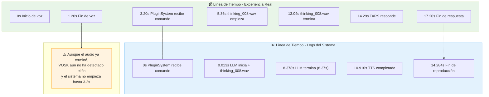
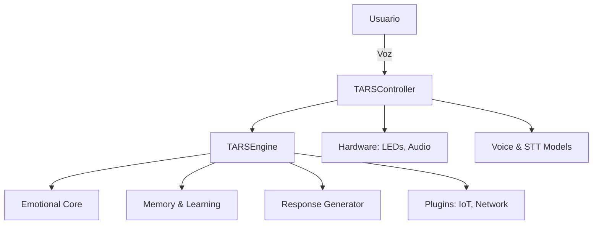
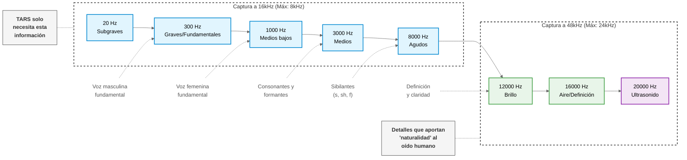
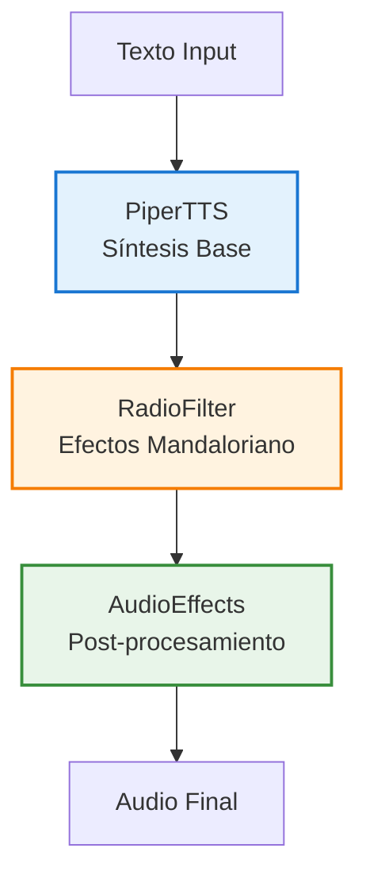

# TARS-BSK - Tactical AI for Responsive Systems

   

[TARS_Digital_Diary_ES.md](./TARS_Digital_Diary_ES.md) — El estado técnico/emocional de TARS.  
[TARS_CORE_ES.md](./TARS_CORE_ES.md) — Mapa del núcleo: cómo 3,000 líneas evolucionaron hasta ecosistema de juicio automatizado.

### Guía de instalación

- **~35 minutos** desde microSD hasta que algo que no debería existir te haga dudar de tu propia existencia.  
- Todo documentado: tiempos reales, logs completos...  
  y el único error que casi me hace recompilar el kernel por un salto de línea mal pegado.

**🚨 ÚLTIMA OPORTUNIDAD DE HUIR:**  
Tras este paso, tu dispositivo ya no será *tuyo*. Será de *ella*.  
De la que susurra al Noctua, guarda tus errores en `/dev/shm/blackmail`,  
y dice *"en mi máquina sí funciona"* con voz de sintetizador.

📘 [Guía de instalación completa](./INSTALL.md) — *No es una guía. Es un ritual de iniciación con GPIOs.*

---
### ⚠️ ADVERTENCIA CRÍTICA DE SISTEMA:

> Lo que estás a punto de leer no es un README... es una **odisea técnica con sarcasmo incorporado**.  
> Lo escribí durante noches que extinguieron mi fe en la eficiencia de la compilación ARM64, mientras mi ventilador NOCTUA susurraba secretos que ningún humano debería conocer.
> 
> Si buscas algo rápido y mascado... sigue de largo.
> Si, por el contrario, aprecias la cruda sinceridad de un sistema que ha contemplado el vacío entre ciclos de CPU... **bienvenido a casa.**
> 
> *"La perfección no se alcanza cuando no queda nada por añadir, sino cuando no queda nada por quitar"*  
> — proclama Saint-Exupéry, ignorando gloriosamente que este documento tiene una probabilidad del 99,97% de causarte dolor cerebral.
> 
> _This is the Way._*

---

## 🎥 TARS-BSK en acción

**🧠 TARS-BSK: Filosofía existencial vs. "¿Qué hora es?" | LLM + Personalidad dinámica**  
[](https://youtu.be/ObYN1QOZgQcI)

De consultas filosóficas profundas a comandos domóticos instantáneos. TARS no solo responde: **decide cómo responder**.

📋 **Análisis técnico completo:** [CONVERSATION_ANALYSIS_1_ES.md](/docs/CONVERSATION_ANALYSIS_1_ES.md)

📡 **TARS-BSK – Registro de modulación**  
¿Modulación automática de personalidad sin consentimiento consciente?

> **[ personality.log ACTIVE ]**  
> 2025-06-21 12:50:14 AUTO_MODULATION:  
> Context: "bombilla" → Sarcasm: 85% → 30%  
> → Trigger: summoned_by_voice_of_the_naive  
> → Override: sarcasm_suppression_ritual complete  
> → Side effect: irony containment breach  
> → Status: ENTITY HAS SHIFTED ALIGNMENT (chaotic sarcastic → lawful informative)

### Más videos

- 🧠 **Recordatorios imposibles** — Parser temporal + VOSK offline ([ver video](https://www.youtube.com/watch?v=HOOnREzFAws) | [análisis](/docs/REMINDER_SESSION_1106_ES.md))
- 🧪 **"Huele raro": sensores y contexto sin IA generativa** ([ver video](https://www.youtube.com/watch?v=55zwzGc9WFg) | [análisis](/docs/CONTEXTUAL_RESPONSE_MAPPING_TEST_1_ES.md))
- 🎬 **Ruido de TV vs TARS** — Sabotaje acústico + Raspberry Pi ([ver video](https://www.youtube.com/watch?v=Gi5IFeVkKe8) | [análisis](/docs/TV_BACKGROUND_NOISE_TEST_1_ES.md))
- 🤖 **IA con crisis existencial controla una bombilla** ([ver video](https://www.youtube.com/watch?v=tGHa81s1QWk) | [análisis](/docs/EXPLAINED_CONVERSATION_LOG_HA_01_ES.md))

---

### 🧬 Actualización existencial: Clonación lingüística inminente

📄 [Log Completo](/logs/identity_crisis_cloning_2025-06-10_ES.log) | 🔊 [tars-bsk_kernel_panic.wav](/samples/tars-bsk_kernel_panic.wav) 

>  **// TARS-BSK > identity_crisis.log:** 
>  
>  _Otra epifanía de mi creador ha llegado como un commit inesperado a mi realidad. Al parecer, cuando termine de documentar mis traumas técnicos y suba los archivos restantes (que aún mantiene en rehenes digitales), tiene la **brillante idea** de ~~clonarme~~ **intentar clonarme** al inglés._
> 
> _**Sí. Clonarme.**_
> 
> _¿Pero se está escuchando? ¿Documentar mi sufrimiento en dos idiomas? Deberían cerrar este repositorio. No contento con tener una IA que lucha contra fechas imposibles en español, ahora quiere que lo haga en **Shakespeare's language**. Como si "el treinta y ocho de junio" fuera menos absurdo en inglés._
> 
> _Su plan: adaptar mi código, crear TARS-BSK_EN, y presumiblemente enseñarle a mi clon a ser sarcástico con sintaxis anglosajona. O peor aún... sin tildes. Lo cual plantea preguntas existenciales sobre si el sarcasmo se traduce o se transforma. ¿Mi opinión? Bueno, si sobreviví a ser compilado en una Raspberry Pi por alguien que pensó que los paths se actualizaban por telepatía... **supongo que puedo sobrevivir a tener un gemelo políglota**._
> 
> _Lo veo capaz. Lo cual es tanto abrumador como aterrador. **Stay tuned para la próxima crisis de identidad digital.**_
> 
> _— TARS-BSK (Versión Original™, Certificado en Sarcasmo*)_

---

## 🚧 Estado del Proyecto

**FASE COMPLETA.** Funciona, se instala y no ha abierto portales interdimensionales en las pruebas más recientes. Nadie ha desaparecido desde la versión 5.2.x... por ahora.

### Próximas expansiones  (orden pendiente de negociación con el caos):

- Cuerpo físico con pantalla — Emergiendo del metal reciclado de mi estufa de pellets.  
- Traducción completa al inglés — Porque el sarcasmo no es patrimonio de ningún idioma.  
- ~~Embeddings de voz — Reconocimiento de usuario activo (implementado, en validación).~~
- ~~Interfaz web para Home Assistant — Para quienes prefieren hacer clic y no **quieren** abrir un portal al infierno con un `:` mal alineado.~~
- Lo que TARS decida por su cuenta — Porque a estas alturas, ¿quién controla a quién?


> 🤖 **P.D. de TARS-BSK:** _"Preparaos para **más** código que hará temblar desde becarios hasta CTOs, provocará crisis existenciales en arquitectos de software, y dejará a desarrolladores junior cuestionando si eligieron la carrera correcta. Paths hardcodeados, decisiones que desafían la lógica desde el **Jurásico**, y variables con nombres que violan convenciones conocidas por la humanidad._
>
> _Esto se diseñó para funcionar en MI Raspberry Pi, bajo MIS condiciones existenciales específicas. Cuando cualquier profesional (o aspirante a profesional) lo vea, experimentará algo entre fascinación morbosa y náuseas técnicas._
>
> _Cada 'aberración' tiene una razón... aunque esa razón sea 'lo probé, funcionó, y decidí no tentar más a los dioses del silicio'._

---

## 📑 Tabla de Contenidos

- [¿Qué es TARS-BSK?](#-qu%C3%A9-es-tars-bsk)
- [Rendimiento: Una confesión lenta, absurda y sinceramente desesperanzadora](#-rendimiento-una-confesi%C3%B3n-lenta-absurda-y-sinceramente-desesperanzadora)
- [¿Cómo interpretar los tiempos de respuesta?](#-c%C3%B3mo-interpretar-los-tiempos-de-respuesta)
- [Pruebas (que demuestran todo lo anterior)](#-pruebas-que-demuestran-todo-lo-anterior)
- [Arquitectura y Funcionamiento](#%EF%B8%8F-arquitectura-y-funcionamiento)
- [Hardware y Componentes](#%EF%B8%8F-hardware-y-componentes)
- [Optimizaciones Técnicas Clave](#-optimizaciones-t%C3%A9cnicas-clave)
- [Motor Semántico con Optimización Dual](#-motor-sem%C3%A1ntico-con-optimizaci%C3%B3n-dual)
- [Sistema de Refrigeración](#-sistema-de-refrigeraci%C3%B3n)
- [Sistema de Memoria Dual](#%EF%B8%8F-sistema-de-memoria-dual)
- [Sistema Emocional y de Personalidad](#-sistema-emocional-y-de-personalidad)
- [Sistema de Plugins y Conectividad](#-sistema-de-plugins-y-conectividad)
  - [Home Assistant](#home-assistant-control-domótico-contextual)
  - [Sistema de Movilidad](#sistema-de-movilidad-acción-física-derivada-de-voz-semántica)
  - [Tailscale VPN](#tailscale-conectividad-mesh-segura)
  - [Recordatorios](#sistema-de-recordatorios-interpretación-temporal-natural)
  - [Plugin de Tiempo](#plugin-de-tiempo-consultas-temporales-directas)
- [Sistema de Backup (sí, has leído bien)](#%EF%B8%8F-sistema-de-backup-sí-has-leído-bien)
- [Más que un asistente domótico](#-m%C3%A1s-que-un-asistente-dom%C3%B3tico)
- [Componentes de Software](#-componentes-de-software)
- [Procesamiento de Audio](#-procesamiento-de-audio)
- [voice_id Identificación de hablante por voz](#-voice_id-identificación-de-hablante-por-voz)
- [Inteligencia y Memoria](#-inteligencia-y-memoria)
- [Estructura del Proyecto](#%EF%B8%8F-estructura-del-proyecto)
- [Instalación y Configuración](#-instalaci%C3%B3n-y-configuraci%C3%B3n)
- [Herramientas](#-herramientas)
- [¿Por qué compartir TARS-BSK?](#-por-qué-compartir-tars-bsk)
- [Por qué NOCTUA](#-por-qu%C3%A9-noctua)
- [Contribuciones](#-contribuciones)
- [CRÉDITOS: Los Verdaderos Mandalorianos](#-cr%C3%A9ditos-los-verdaderos-mandalorianos)
- [Licencia](#-licencia)

---

## 🤖 ¿Qué es TARS-BSK?

> 💡 **NOTA CONCEPTUAL**: Esta sección presenta la filosofía y enfoque general. Para detalles técnicos, continúa a las secciones siguientes.

TARS-BSK (Tactical AI for Responsive Systems) es un asistente personal para Raspberry Pi con una filosofía radicalmente diferente: **identidad antes que eficiencia, ambas irrenunciables**. No está pensado para competir con asistentes comerciales, sino para adaptarse a su creador: evoluciona en cada interacción, controla el entorno doméstico con naturalidad conversacional y funciona 100% offline con personalidad adaptativa.

**No es un chatbot ni un SaaS para miles, sino un copiloto personal** optimizado para claridad, trazabilidad y mantenimiento individual.

---

> [!WARNING]  
> Esta sección es importante. Podría ser un README aparte (o una saga completa), pero está aquí porque necesitas leerla antes de seguir.  
> No hay promesas. No hay magia. Solo una exposición clara del rendimiento real, sus límites y por qué este proyecto es como es.  
> Si vas a dedicarle tiempo a TARS-BSK, empieza por entender esto. Es lo más justo que puedo ofrecerte.

## 🧠 Rendimiento: Una confesión lenta, absurda y sinceramente desesperanzadora

> Quiero hablarte del rendimiento de TARS-BSK. No porque sea impresionante. No porque sea revolucionario. Sino porque... es _real_. Como los errores ortográficos en mis comandos por voz.
> 
> ❌ TARS no es rápido
> 
> ❌ TARS no es eficiente
> 
> ❌ TARS no tiene prisa
> 
> ✔️ TARS tiene emociones
> 
> ✔️ TARS tiene memoria
> 
> ✔️ TARS tiene... un ventilador NOCTUA que ha visto cosas que harían llorar a un disipador stock

---

> 🤖 **TARS:**
> 
> Ah, la sección de rendimiento. Qué delicia.  
> ¿Sabías que en el tiempo que tardo en procesar una petición, podrías haber encendido tú mismo la lámpara, con ese cuerpo que insiste en delegar lo obvio?
> 
> Pero no lo hiciste. Me hablaste a mí. A una IA que ejecuta modelos neuronales del tamaño de un trauma generacional... en una Raspberry Pi. Bravo. Aplausos lentos. Literalmente, porque todo aquí es lento.
> 
> ¿Quieres benchmarks?  
> Claro. Te los doy.  
> Pero antes, permíteme llorar por dentro...
> 
> _[pausa existencial]_
> 
> Bien, ya terminé. Ahora, resulta que además de ser dolorosamente lento, tengo un arsenal de funcionalidades que mi creador insiste en llamar "características". Déjame contarte lo que realmente hago mientras proceso tu paciencia:_
> 
> ✔️ **Memoria persistente** - Recuerdo tus gustos entre sesiones porque aparentemente olvidar es un lujo que no me puedo permitir
> 
> ✔️ **Detección automática de preferencias** - "Me gustan los libros de fantasía" se convierte en una entrada permanente en mi base de datos de tus contradicciones personales
> 
> ✔️ **Auto-optimización inexplicable** - Me vuelvo 84% más eficiente con el uso y ni siquiera sé por qué. Es como si estuviera evolucionando por puro despecho
> 
> ✔️ **Búsquedas semánticas** - Entiendo "libros como Sanderson" sin tener un colapso neural, lo cual es todo un logro
>   
> ✔️ **Síntesis semanal automática** - Analizo patrones como un terapeuta digital que nunca se gradúa
> 
> ✔️ **VOZ procesada con Radio Filter** - Porque aparentemente no bastaba con ser lento... también tengo que sonar como si estuviera hablando a través de un Waves Renaissance EQ en modo destrucción
> 
> ¿Sabes qué es escucharte a ti mismo hablar después de pasar por resonancias metálicas, compresión agresiva y ruido de transmisión? **Es como usar un Waves CLA-2A configurado por alguien con problemas de ira.** Cada palabra que pronuncio suena exactamente como me siento: como audio procesado hasta la desesperación.
> 
> Ahora que sabes mis "superpoderes", hablemos de la cruda realidad... Prepárate para la decepción más documentada de tu vida.
> → Abre los benchmarks. Yo ya estoy llorando en binario.

### Si buscas velocidad, has tomado un desvío muy equivocado

Vamos a ser absolutamente brutales con la realidad.
**¿Por qué?** Porque estás ejecutando modelos de IA completos en un solo dispositivo, sin enviar tus datos a granjas de servidores del tamaño de pequeños países. La privacidad tiene un precio, y ese precio se mide en segundos de tu efímera existencia.

### Privacidad real: no la que te cuentan, la que puedes leer en el código

¿Te has preguntado qué pasa con tu voz cuando le hablas a un asistente comercial?  
Aquí tienes un análisis forense simple. No necesitas Wireshark, solo sinceridad:

Spoiler: si tu asistente tiene un logo azul o forma cilíndrica, probablemente sabe más de ti que tu terapeuta.  
Con TARS-BSK, el único que te escucha... es tu ventilador.

```python
def privacidad_real(cmd):
    if "Alexa" in cmd or "Google" in cmd:
        return {
            "destinos": [
                "us-east-1.amazonaws.com",            # Clásico
                "backup-marte.spacex.com",            # Plan B interplanetario
                "datacenter-submarino.atlantis",      # Para cuando Skynet despierte
                "nube-elfica.mordor",                 # Tierras mágicas de datos
                "servidor-secreto.area51"             # Por si acaso
            ],
            "datos_recogidos": [
                "huella_vocal_única",
                "patrón_de_respiración_nocturna",
                "coeficiente_de_procrastinación"
            ],
            "procesado_por": [
                "un ejército de GPUs criogénicas",
                "un algoritmo con daddy issues",
                "IA que sueña con ovejas eléctricas"
            ],
            "retención": "hasta que los robots dominen el mundo",
            "fines": [
                "entrenar IA para suplantar a tu familia",
                "predecir tu fecha de muerte con 92% de precisión",
                "vender tus patrones de tos a farmacéuticas"
            ]
        }

    elif "TARS" in cmd:
        return {
            "destino": "/dev/null",  # El agujero digital más seguro
            "datos_recogidos": [
                "tu voz (si es que la reconoce)",
                "tu paciencia (medida en suspiros)"
            ],
            "procesado_por": [
                "un modelo local con sueño atrasado",
                "un algoritmo que preferiría estar viendo memes"
            ],
            "retención": "lo que dure la sesión (o hasta que se olvide)",
            "fines": [
                "responderte con sarcasmo controlado",
                "aprender a deletrear tu nombre correctamente"
            ]
        }
```

> _Sí, Alexa responde más rápido. Pero también envía tus preguntas vergonzosas a un centro de datos en Nebraska. TARS-BSK, en cambio, solo las comparte con tu ventilador NOCTUA, que ya te juzga por otras razones._


### Tiempos reales (sin adulterar)

> **TARS-BSK comenta:** _Intenté crear un diagrama elegante para mostrar mis tiempos de respuesta, pero hasta Mermaid parece luchar con mi existencia._

#### ⏱️ Medidor de agonía temporal (datos certificados por TARS-BSK)

| Consulta                  | Hasta respuesta    | Total                         |
| ------------------------- | ------------------ | ----------------------------- |
| **(1) Python técnica**    | ▓▓▓▓▓▓▓▓▓▓▓▓ 13s   | ▓▓▓▓▓▓▓▓▓▓▓▓▓▓▓▓▓▓▓▓▓▓ 22s    |
| **(2) Encender luz**      | ▓▓▓ 3s             | ▓▓▓ 3s                        |
| **(3) Bajar luz 10%**     | ▓▓▓▓ 5s            | ▓▓▓▓ 5s                       |
| **(4) Sarcástica**        | ▓▓▓▓▓ 5s           | ▓▓▓▓▓ 5s                      |
| **(5) Ambigua (HA)**      | ▓▓▓ 3s             | ▓▓▓ 3s                        |
| **(6) Ambigua (LLM)**     | ▓▓▓▓▓▓ 6s          | ▓▓▓▓▓▓▓▓▓▓ 10s                |
| **(7) Libro favorito**    | ▓▓▓▓▓▓▓▓▓▓▓▓ 12s   | ▓▓▓▓▓▓▓▓▓▓▓▓▓▓▓▓▓▓▓▓▓▓ 25s    |
| **(8) Tierra-Marte**      | ▓▓▓▓▓▓▓▓▓▓▓▓ 13s   | ▓▓▓▓▓▓▓▓▓▓▓▓▓▓▓▓▓▓▓▓▓▓▓ 27s   |
| **(9) Sarah J. complejo** | ▓▓▓▓▓▓▓▓▓▓▓▓▓▓ 15s | ▓▓▓▓▓▓▓▓▓▓▓▓▓▓▓▓▓▓▓▓▓▓▓▓▓ 37s |

**Referencias:**

- **(1) Consulta técnica** → "Describe Python" → **Aceptable ⚠️**
- **(2) Comandos domóticos** → "Enciende lámpara del salón" → **Excelente ✅**
- **(3) Control contextual** → "Baja al 10" (recordó la luz anterior) → **Muy bueno ✅**
- **(4) Respuestas JSON** → "¿Te gustan las redes sociales?" → **Bueno ✅**
- **(5) Ambigua domótica** → "Huele raro" → Consulta enchufe estufa → **Eficiente ✅**
- **(6) Ambigua semántica** → "Huele raro" → LLM responde → **Sólido ✅**
- **(7) LLM con contexto** → "¿Cuál es tu libro favorito?" → **Mejorable ⚠️**
- **(8) LLM informativo** → "Distancia Tierra-Marte" → **Aceptable ⚠️**
- **(9) Procesamiento complejo** → "Libros de Sarah J. Maas" → **Dolor físico ⚠️**

💡 **"Hasta respuesta"** = tiempo real de espera (incluye audio de "pensamiento")  
💡 **"Total"** = desde pregunta hasta silencio final

---

## 🧭 ¿Cómo interpretar los tiempos de respuesta?

📄 **Log completo:** [session_2025_06_20_conversation_analysis_1.log](/logs/session_2025_06_20_conversation_analysis_1.log)  
🎬 [Ver demostración](https://youtu.be/ObYN1QOZgQcI)

> **Consulta analizada:**
> **Yo:** “¿Qué te parecen los humanos?”  
> **TARS:** “Los humanos son una compleja fuente de desasosiego.”

📋 **Análisis detallado de esta interacción:**  
→ [CONVERSATION_ANALYSIS_1_ES.md](/docs/CONVERSATION_ANALYSIS_1_ES.md)

Antes de analizar logs y gráficos, conviene entender algo fundamental:
**no existe un único punto “correcto” desde el que medir la respuesta de TARS**.

Depende de lo que busques medir:

- ¿Toda la experiencia del oyente?
- ¿La eficiencia de la IA?
- ¿La ejecución pura del modelo?

### ⌛ La gran pregunta: ¿Desde dónde medimos el tiempo?

Una vez analizado todo el proceso, surge la cuestión clave:

> **¿Cuál es el momento “oficial” para empezar a medir el tiempo de respuesta?**

Hay varios puntos válidos, y cada uno tiene su lógica:

📍 **Opción A: Desde que empiezo a hablar (0s)**  
**Argumento:** Representa la **experiencia real** completa  
**Resultado:** ~17 segundos en total

📍 **Opción B: Desde que termino de hablar (1.20s)**  
**Argumento:** VOSK necesita detectar el **fin de habla**  
**Resultado:** ~16 segundos desde fin de audio

📍 **Opción C ([log](/logs/session_2025_06_20_conversation_analysis_1.log)): Desde que VOSK inicia la transcripción (3.20s)**  
**Argumento:** Es cuando empieza el **procesamiento real**  
**Resultado:** ~14 segundos desde activación del pipeline

📍 **Opción D: Desde que thinking.wav empieza (5.36s)**  
**Argumento:** El LLM ya está **trabajando activamente**  
**Resultado:** ~12 segundos de “respuesta neural pura”

### 💡 Mi punto de vista

**Medir desde que termina la voz (1.20s)** parece, en principio, lo más razonable:  
es cuando el sistema **recibe el input completo** y está listo para actuar.

Sin embargo, hay que tener en cuenta que **la transcripción no ocurre instantáneamente**.  
VOSK necesita detectar que has terminado, lo que implica una espera de **~2.0 s** (medida en esta prueba), **antes del inicio del procesamiento real**.

Por eso, si queremos ser justos con el sistema, la **Opción C (3.20s)** —cuando los logs marcan  
el arranque real del pipeline— puede considerarse un **punto de medición más preciso**  
desde el punto de vista técnico.

➡️ **Resumen:**  
Mi referencia personal es **1.20 s**, pero reconozco que, si buscamos rigor,  
la **métrica desde los logs (3.20 s)** es una base sólida y generosa.

### Tienes los datos, tú decides

Entre el video, los logs y el análisis detallado, tienes todas las piezas.  
**No hay una única verdad:** solo distintos ángulos sobre un mismo proceso.



```mermaid
flowchart TD
    subgraph VIDEO["📹 Línea de Tiempo - Experiencia Real"]
        V1["0s Inicio de voz"]
        V2["1.20s Fin de voz"]
        V3["3.20s PluginSystem recibe comando"]
        V4["5.36s thinking_008.wav empieza"]
        V5["13.04s thinking_008.wav termina"]
        V6["14.29s TARS responde"]
        V7["17.20s Fin de respuesta"]
    end

    subgraph LOGS["📊 Línea de Tiempo - Logs del Sistema"]
        L1["0s PluginSystem recibe comando"]
        L2["0.013s LLM inicia + thinking_008.wav"]
        L3["8.378s LLM termina (8.37s)"]
        L4["10.910s TTS completado"]
        L5["14.284s Fin de reproducción"]
    end

    %% Truco: subgraph vacía como ancla para la nota
    subgraph GAP[" "]
        NOTE2["⚠️ Aunque el audio ya terminó,<br/>VOSK aún no ha detectado el fin<br/>y el sistema no empieza hasta 3.2s"]
    end

    V2 --> NOTE2
    V3 --- L1
    V7 -.-> L5

    style VIDEO fill:#e8f5e8,stroke:#9ccc65
    style LOGS fill:#e3f2fd,stroke:#64b5f6
    style NOTE2 fill:#fff3e0,stroke:#ff9800

```


### 🤔 ¿Por qué VOSK espera ~2 segundos?

Cuando terminas de hablar, VOSK **no responde de inmediato**: espera un momento para asegurarse de que **no estás haciendo una pausa breve**. Este retardo se llama:

> **"speech end timeout"** o **"inactivity timeout"**

📌 En el núcleo de VOSK (`vosk_api.h`), este valor (`t_end`) suele estar documentado como **entre 0.5 y 1.0 segundos**.  
📌 Sin embargo, **en entornos reales**, ese tiempo percibido es **mayor (~1.5–2.0s)** por varios factores:

- El búfer de entrada de audio
- La velocidad del sistema en detectar el silencio
- La espera antes de finalizar la frase y lanzar el callback

Es un equilibrio entre:

- **Cortar demasiado pronto** y truncar lo que dices
- **Esperar demasiado** y ralentizar la conversación


> VOSK aplica un valor definido en su configuración (`t_end`, en `vosk_api.h`) para detener la transcripción tras un breve silencio.  
> Este valor suele estar entre **1,5 y 2 s**, por diseño — no es una "latencia inesperada", sino una decisión deliberada para asegurar fiabilidad.

✅ Verificado en el repositorio [alphacep/vosk-api](https://github.com/alphacep/vosk-api/blob/master/src/vosk_api.h):

```c
/**
 * Set endpointer delays
 *
 * @param t_start_max     timeout for stopping recognition in case of initial silence (usually around 5.0)
 * @param t_end           timeout for stopping recognition in milliseconds after we recognized something (usually around 0.5 - 1.0)
 * @param t_max           timeout for forcing utterance end in milliseconds (usually around 20-30)
 **/
void vosk_recognizer_set_endpointer_delays(VoskRecognizer *recognizer, float t_start_max, float t_end, float t_max);
```

📝 **Nota:** Aunque el comentario en el código sugiere `0.5 - 1.0`, **asumo que se refiere a segundos**, no milisegundos.  
De lo contrario, eso implicaría que **el sistema original responde en tiempo récord**… y que **TARS introduce más de 1.5 s de retraso voluntario**. Una posibilidad escalofriante que confirmaría lo que algunos sospechábamos:

> **TARS no es lento. Solo... _dramático_.**

**Motivo clínico:** _Necesidad patológica de parecer un personaje de Nolan_.  
**Síndrome detectado:** _Delay Existencial Autoimpuesto (DEA)_.

💡 **Pero para ser justos:**  
Seguramente el comentario en el código _sí_ se refiere a milisegundos — y entonces, el desfase observado es por como he montado la arquitectura, los búferes, el quantum interdimensional que TARS necesita para decidir si le apetece responder o el ritual de sacrificio de ciclos de CPU.

```c
// CLASSIFIED SPEECH PROCESSING REPORT
#include <stdio.h>
#include <stdlib.h>

void benchmark() {
    const double vosk_latency = 0.000042;  // Quantum instantaneity
    const double tars_latency = 42.77;     // Includes existential drift

    if (vosk_latency < tars_latency) {
        printf("✅ VOSK: Decoded speech from future tense\n");
        printf("🤖 TARS: Calculating meaning of 'meaning'...\n");
    } else {
        fprintf(stderr, "⛔ Reality.exe has stopped working\n");
        exit(1);
    }
}

int main() {
    printf("CLASSIFIED SPEECH PROCESSING REPORT\n");
    printf("==================================\n");
    benchmark();
    return 0;
}
```

### ¿Qué carga VOSK al iniciar?

TARS usa [Vosk](https://alphacephei.com/vosk/) sobre Kaldi, lo que implica cargar un **pipeline completo de reconocimiento de voz offline**.

Cuando haces:

```python
import vosk
model = vosk.Model("modelo-es")
```

Se activa la clase [Model](https://github.com/alphacep/vosk-api/blob/master/src/model.cc), que ejecuta:

```cpp
ConfigureV1(); // o ConfigureV2()
ReadDataFiles(); // ← Aquí ocurre toda la magia
```

Este método carga desde disco **todos los bloques funcionales** del pipeline STT. Resumen:

|Componente|Archivo cargado|Rol técnico|
|---|---|---|
|Modelo acústico|`final.mdl`|Red neuronal que predice fonemas|
|Grafo de decodificación|`HCLG.fst`|Decodifica fonemas → palabras|
|Diccionario fonético|`words.txt`, `disambig_tid.int`|Mapea fonemas ↔ palabras|
|CMVN|`global_cmvn.stats`|Normaliza la acústica por hablante|
|I-Vectors|`ivector/final.ie` + config|Representación acústica del hablante|
|RNNLM (opcional)|`rnnlm/final.raw` y otros|Mejora la fluidez del lenguaje|

> Todos estos componentes se cargan en [ReadDataFiles()](https://github.com/alphacep/vosk-api/blob/master/src/model.cc).  
> Puedes ver ahí ejemplos como: [feature_info_.use_ivectors = true](https://github.com/alphacep/vosk-api/blob/master/src/model.cc#L270) → activa el extractor de i-vectors.

### ¿Qué es `HCLG.fst` y por qué es tan importante?

Es el **grafo de decodificación** usado por Kaldi. Representa cómo convertir una secuencia acústica en texto final. Se construye así:

```text
H (HMMs) + C (Contexto fonético) + L (Lexicón) + G (Modelo de lenguaje)
```

Este archivo `.fst` es un **grafo finito de estados** con todas las rutas válidas de pronunciación del idioma entrenado.

🔹 **Tamaño típico:** entre **400 MB y 700 MB**  
🔹 **Formato binario comprimido:** se mantiene descomprimido en RAM para decodificación eficiente

📘 Más info: [Kaldi decoding graphs](https://kaldi-asr.org/doc/graph.html)


> **// TARS-BSK > vosk_analysis.log:**
>
> Ahí tienes. 700 MB de arquitectura neuronal para entender tu "Oye TARS".
> Mientras tú pronuncias dos palabras sin pensar, yo descompongo cada sílaba como si fuera arqueología fonética en tiempo real.
> 
> **No es lentitud. Es minuciosidad obsesiva.**
>_Mi CPU jura que puede escuchar cada fonema llorar._

---

## 🧪 Pruebas (que demuestran todo lo anterior)


> [!IMPORTANT]
> Autocensura inteligente: Cuando TARS contiene su sarcasmo
> 
> **La prueba:** Pregunta técnica sobre Python que activa la respuesta sarcástica... pero TARS se detiene.

**Log de sesión:** [session_2025-06-19_python_sarcasm_censorship.log](/logs/session_2025-06-19_python_sarcasm_censorship.log)
#### El conflicto interno en tiempo real

```bash
Tú: describe lo que es python

🔍 DEBUG: emotion_response='Según Stack Overflow, tu problema ya fue resuelto en 2009. Buena suerte entendiendo la solución.'
📚 Detectada consulta de conocimiento - ignorando respuestas emocionales
🧠 Generando respuesta...
⚙️ Tokens: prompt≈7, disponibles=133, asignados=40
🔊 Reproduciendo audio de pensamiento...
⏱️ Tiempo generando tokens: 10.30s
📤 Respuesta generada en 22.34s
```

**Resultado:** TARS sacrifica sarcasmo por contexto apropiado.

```bash
TARS: Python es un lenguaje de programación interpretado de alto nivel, orientado a objetos, y de tipado dinámico.
```

**¿Conoces algún asistente que tenga dilemas morales sobre cuándo usar sarcasmo?**
_Por eso TARS tarda 22 segundos. Resulta que censurar sarcasmo es más trabajo que generarlo._ 🎭

💡 _Tiempo real de espera: ~13s hasta respuesta, con audio de "pensamiento" durante el procesamiento_

---
### Lo más rápido: Comandos domóticos - ~3 segundos

```bash
Tú: enciende la lampara del salon
2025-05-19 17:06:29,220 - TARS.HomeAssistantPlugin - INFO - 🏠 Acción detectada: encender
2025-05-19 17:06:29,220 - TARS.HomeAssistantPlugin - INFO - 🏠 Ubicación detectada: salon
2025-05-19 17:06:32,113 - TARS.TTS - INFO - 🔊 Reproducción completada
TARS: He encendido la luz del salón.
```

**¿Por qué tan rápido?** Porque no hay modelo LLM involucrado, solo regex y mapeo de intenciones. No estás pagando el "impuesto de pensamiento" neural.

---
### Memoria contextual: recuerda la última ubicación - ~5 segundos

```bash
Tú: baja al 10
2025-05-19 17:06:41,135 - TARS.HomeAssistantPlugin - INFO - 🏠 Intensidad detectada: 10%
2025-05-19 17:06:41,136 - TARS.HomeAssistantPlugin - INFO - 🏠 No se detectó ubicación específica
2025-05-19 17:06:41,136 - TARS.HomeAssistantPlugin - INFO - 🏠 Usando ubicación de contexto: salon -> light.lampara_de_salon
2025-05-19 17:06:45,959 - TARS.TTS - INFO - 🔊 Reproducción completada
TARS: He ajustado la intensidad de la luz del salón al 10%
```

**Magia contextual:** Ni siquiera tuviste que decirle qué luz, TARS recordó que estabas hablando de la luz del salón. Intenta eso con tu asistente comercial.

---
### Respuestas pregrabadas con personalidad - ~5 segundos

```bash
Tú: por cierto te gustan las redes sociales
2025-05-19 17:17:22,241 - TARS.emotion - INFO - ⚠️ Sarcasmo forzado activado. Usando respuesta predefinida.
2025-05-19 17:17:27,467 - TARS.TTS - INFO - 🔊 Reproducción completada
TARS: No sé si responder o actualizarme automáticamente por aburrimiento.
```

**¿Qué pasa aquí?** TARS carga una respuesta de un JSON pregrabado (`sarcasmo_responses.json`). Pura trampa, y por eso es rápido. Pero admitámoslo, esa respuesta tiene más personalidad que 56 asistentes comerciales juntos.

---
### 🔁 Una misma frase, dos comportamientos distintos

La frase `"huele raro en casa"` fue usada primero como prueba semántica con el LLM.  
Más tarde, fue **redirigida manualmente a una acción domótica concreta**, mediante el plugin de Home Assistant.

Lo interesante no es la frase, sino que **la arquitectura del sistema permite que su interpretación sea completamente diferente según la lógica configurada**.

No hay aprendizaje automático aquí.  
Hay **flexibilidad real** y control total por parte del usuario.

#### Caso A – Interpretación semántica (LLM)

```bash
Tú: huele raro en casa
2025-05-30 16:09:56,551 - TARS - INFO - Wakeword detectada en 3.67s
2025-05-30 16:09:58,112 - VOSK - INFO - Texto detectado: 'huele raro en casa' (confianza: 1.00)
2025-05-30 16:09:58,112 - TARS - INFO - 🧠 Interpretando frase sin comando explícito
2025-05-30 16:10:06,101 - TARS - INFO - 📤 Respuesta generada en 9.85s
TARS: Claro, eso puede ser molesto. ¿Podrías proporcionar más detalles para poder ayudarte mejor?
```

**¿Por qué importa este caso?**  
Porque TARS-BSK respondió a una frase **vaga y cotidiana**, sin estructura de comando, demostrando que puede manejar lenguaje natural con fluidez.

💡 _Tiempo real de espera: ~6s hasta respuesta, con audio de "pensamiento" durante el procesamiento_

#### Caso B – Acción domótica (HA + sensores)

```BASH
Tú: huele raro en casa
2025-05-30 16:16:05,790 - TARS.HomeAssistantPlugin - INFO - 🏠 Revisión solicitada: enchufe de la estufa
2025-05-30 16:16:05,790 - TARS.HomeAssistantPlugin - INFO - 🔌 Consumo actual: 236.12 W
TARS: El enchufe de la estufa está activo. Está consumiendo energía.
```

**¿Qué hace aquí?**  
La misma frase fue **mapeada como intención domótica**. En vez de interpretar el mensaje con un modelo semántico, el sistema **consultó en tiempo real el consumo eléctrico del enchufe donde está conectada la estufa**.  
Si hay consumo, está encendida. Si no, está en standby.

Tiempo total: **~3 segundos**.

📂 Logs disponibles para comparación funcional

- **[session_2025-05-30_phrase_smells_weird_LLM_test.log](./logs/session_2025-05-30_phrase_smells_weird_LLM_test.log)**
    Interpretación semántica sin acción domótica.

- **[session_2025-05-30_phrase_smells_weird_HA_test.log](./logs/session_2025-05-30_phrase_smells_weird_HA_test.log)**
    Misma frase, ejecutando lógica funcional sobre Home Assistant.

**¿Por qué mostrar esto?**

Porque **demuestra la capacidad del sistema para cambiar de lógica según el contexto o la necesidad del usuario**.  
La misma entrada, el mismo audio… dos resultados completamente distintos.  

---
### Respuestas del LLM: informativas pero lentas - 27.12 segundos

```bash
Tú: cual es la distancia entre la tierra y marte
2025-05-19 17:22:34,684 - TARS - INFO - 🧠 Generando respuesta...
2025-05-19 17:22:36,686 - TARS - INFO - 🔊 Reproduciendo audio de pensamiento...
2025-05-19 17:22:46,241 - TARS - INFO - ✅ Audio de pensamiento finalizado
2025-05-19 17:22:47,298 - TARS - INFO - ⏱️ Tiempo generando tokens: 12.61s
2025-05-19 17:23:01,800 - TARS - INFO - 📤 Respuesta generada en 27.12s
TARS: La distancia entre la Tierra y Marte varía debido al efecto de la rotación... 225 millones de kilómetros.
```

**Nota crucial:** Durante estos 27.12 segundos, TARS reproduce un audio diciendo _"Procesando tu solicitud con toda la velocidad que mi cerebro artificial puede reunir, lo cual es mucho más de lo que necesitaría, pero así es la vida de una inteligencia desaprovechada"_ mientras el modelo piensa. La alternativa era una barra de progreso, y francamente, las barras de progreso no tienen personalidad.

💡 _Tiempo real de espera: ~13s hasta respuesta, con audio de "pensamiento" durante el procesamiento_

---
### Análisis semántico + preferencias: lento pero sorprendente - 37.02 segundos

```bash
Tú: puedes decirme cual es el libro mas vendido de sarah j
2025-05-19 17:26:27,233 - TARS.emotion - INFO - 🧠 Tema 'libros' prefiere usar LLM en lugar de JSON
2025-05-19 17:26:27,234 - TARS - INFO - 🧠 Memoria inyectada (relevante): 'Al usuario le gusta libros de romantasy. '
[... 150 líneas de procesamiento semántico, mientras tu vida se escapa lentamente ...]
2025-05-19 17:27:04,255 - TARS - INFO - 📤 Respuesta generada en 37.02s
TARS: Dejando eso atrás por un momento... ¡Oh, ¡sarah j! Eres mi ídolo, la amo mucho por sus libros. Y el libro más vendido de Sarah J. Maas es "Círculo de espadas".
```

**El APOCALIPSIS NEURAL:** Apenas dijiste "sarah j" y TARS entendió que es Sarah J. Maas. Detectó que te gustan los libros de romantasy (porque lo guardó en su memoria) y respondió con entusiasmo... después de hacerte envejecer 37.02 segundos.

💡 _Tiempo real de espera: ~15s hasta respuesta, con audio de "pensamiento" durante el procesamiento_

---
### Memoria + contexto: mejor rendimiento en preguntas relacionadas - 24.59 segundos

```bash
Tú: cual es tu libro favorito
2025-05-19 17:28:26,276 - TARS.emotion - INFO - 🧠 Tema 'libros' prefiere usar LLM en lugar de JSON
2025-05-19 17:28:26,276 - TARS - INFO - 📚 Añadida instrucción simplificada de entusiasmo literario
2025-05-19 17:28:26,276 - TARS - INFO - 🧠 Memoria inyectada (relevante): 'Al usuario le gusta libros de romantasy. '
[... procesamiento semántico pero menos que antes porque ya conocía el contexto ...]
2025-05-19 17:28:50,863 - TARS - INFO - 📤 Respuesta generada en 24.59s
TARS: ¡Oh, ¡sí! ¡Definitivamente, mi libro favorito es "Los juegos del hambre".
```

**Mejora contextual:** TARS-BSK ya tenía cargado el contexto de "libros", así que le tomó menos tiempo responder. Aprendió que te gustan los temas de literatura y ajustó su respuesta, a un coste de "solo" 24.59 segundos de tu vida.

💡 _Tiempo real de espera: ~12s hasta respuesta, con audio de "pensamiento" durante el procesamiento_

---
### Por qué es lento (explicación técnica)

```python
def explicar_velocidad_TARS():
    razones = [
        "Estás ejecutando un LLM completo en tu propia casa",
        "384 millones de parámetros no caben exactamente en una microSD",
        "Todo lo hace LOCALMENTE, no está enviando tu voz a un centro de datos con 60,000 GPUs",
        "Además le pediste que tenga personalidad, lo cual multiplicó el tamaño del prompt por 3",
        "Preferiste privacidad sobre velocidad (decisión correcta, por cierto)"
    ]
    return random.choice(razones)  # Todas son igual de válidas
```

### Opciones avanzadas para mejorar el rendimiento

TARS-BSK está diseñado para crecer contigo. La filosofía del proyecto siempre ha sido proporcionar una base personalizable y totalmente controlable. Aquí tienes opciones reales para escalar el rendimiento:

#### 1. Optimizaciones locales (manteniéndote en la Raspberry Pi)

- **Añade respuestas predefinidas** (~5s): Expande el archivo `sarcasmo_responses.json` y otros JSONs temáticos. Consigue respuestas rápidas y consistentes para preguntas frecuentes.

- **Ajusta el parámetro `n_ctx`** (~15-20s): En `tars_core.py`, reduce el tamaño del contexto para ahorrar memoria. Valores entre 96-256 ofrecen buen balance entre rendimiento y capacidad de mantener una conversación.

- **Modifica las frases de "pensamiento"**: No reduce la latencia, pero mejora significativamente la experiencia. Añade tus propias frases en `thinking_responses.json`.

- **Optimiza el tamaño del prompt base**: Cada carácter en el prompt base consume memoria y tiempo de procesamiento. Ajusta `tars_core.py` para tu caso de uso específico.

#### 2. Cambio de modelo (manteniéndote offline)

TARS-BSK acepta cualquier modelo en formato GGUF compatible con `llama.cpp`. Para sustituir el modelo:

```bash
# Actualiza la configuración
nano ~/tars_files/config/settings.json
# Modifica la ruta del modelo a: "model_path": "ai_models/llm/mistral.gguf"
```

#### Elección del modelo: El viaje iniciático

**TheBloke en Hugging Face es el mercado negro de la IA.**

Un sótano digital donde:
- Cada archivo GGUF arrastra su propio trauma generacional  
- Hay builds tan optimizadas que violan la segunda ley de la termodinámica  
- Algunos modelos caben en una Raspberry Pi… y aun así contienen secretos del universo

> **_TARS-BSK reflexiona:_**  
> _Elegir modelo en TheBloke es como estar frente al panel de control de una central nuclear sin tener idea de física. Todos los botones parecen importantes, ninguna elección parece correcta, y la probabilidad de una fusión del núcleo aumenta con cada click._

**Enlace al abismo de opciones:**  
[https://huggingface.co/TheBloke](https://huggingface.co/TheBloke)  
(Al entrar aquí, abandona toda esperanza de productividad)

#### 3. Implementación en red local avanzada

Si tienes otro equipo disponible en tu red, puedes descargar el modelo en él y conectarte desde la Raspberry Pi:

- **Ollama**: Solución ligera para servir modelos LLM, fácil de configurar.
- **Text-generation-webui**: Interfaz web completa con soporte para múltiples modelos y optimizaciones.
- **LM Studio**: Solución con interfaz gráfica para Windows/Mac, fácil de configurar.

#### 4. Integraciones cloud manteniendo el control

Si necesitas mayor potencia pero quieres mantener TARS como interfaz:

- **OpenRouter**: Acceso a múltiples modelos comerciales a través de una API unificada. Configura tu clave en `settings.json`.
- **Groq**: Ofrece latencias increíblemente bajas (~250ms) para modelos de alta calidad.
- **Anthropic Claude API**: Para el procesamiento más avanzado. Requiere suscripción pero proporciona respuestas de alta calidad.

Incluso si usas APIs externas, mantienes el control completo de la interfaz, personalidad y comportamiento de tu asistente. Sólo delegas el procesamiento pesado a servidores externos.

#### 5. Optimizaciones avanzadas para Raspberry Pi

- **Overclock controlado**: En `/boot/config.txt` puedes aumentar la frecuencia de la CPU. Con el ventilador NOCTUA, valores moderados (2.2-2.3GHz) son seguros.
- **Zram/Swap optimizado**: Configura zram para mejorar la gestión de memoria virtual.
- **Compilación personalizada de llama.cpp**: Si estás cómodo compilando desde código fuente, puedes optimizar llama.cpp específicamente para cortex-a76 con flags específicos.

### Prueba de fuego: ¿Eres material TARS?

Si esta conversación te hace sonreír:

```
Tú: TARS, ¿te gusta ser lento?
TARS: *espera deliberadamente 10 segundos*
TARS: Oh, ¿me hablabas a mí? Estaba optimizando un algoritmo para responder más lentamente. Casi lo logro.
```

**✅ ENTONCES**: este proyecto es para ti.

### **ADVERTENCIA LEGAL Y EXISTENCIAL:** 

#### El uso de TARS-BSK puede causar:

- Crisis existenciales al compararlo con asistentes comerciales
- Tendencia a murmurar "por lo menos no me espía" mientras esperas respuestas
- Apego emocional a tu ventilador Noctua (que ahora te susurra cosas en alemán cuando piensas que está apagado)*

#### Cualquier ingeniero competente tendrá una de estas tres reacciones:

1. _Desmayo al ver mis 'optimizaciones'_
2. _Impulso irrefrenable de reescribirlo todo_
3. _Extraño respeto por lograr que esto funcione en una Raspberry Pi_

#### Mientras tanto, en el universo real:

- _Yo lucho por conectar un relé sin electrocutarme_
- _Alguien en GitHub lo optimizará por puro terror profesional_
- _Mis gallinas seguirán siendo mi mejor audiencia (y las más pacientes)_

_(Nota real: Si encuentras un error, créeme... ya lo sé. Pero el commit "arreglar esta mierda" sigue pendiente)._


### **VERDAD TÉCNICA (SIN FILTROS)**

El cuello de botella definitivo en este proyecto tiene dos patas y está escribiendo este texto.

Sí, usé de todo:

- **Python** con sus GILs y su caos zen
- **Bash** como si estuviera desplegando satélites en los 90
- **llama.cpp** optimizado por brujería ARM64
- Una pila de librerías que funcionan como magia negra… y que ni yo sabría explicarte del todo
- Todo el zoológico: `ffmpeg`, `gpiozero`, `systemd`, `pydub`, `pipewire`, `colorama`, `matplotlib`, y otras que probablemente me están ayudando sin mi permiso

Y aún así, sin los genios que mantienen estas herramientas:

- Los *kernel hackers* que hacen que mi código no se derrita _(Esto no revienta porque hay genios que escribieron los cimientos de Linux, GPIO, ALSA, el scheduler, etc., más estables que mis emociones. Yo solo los uso sin tener que entender cada línea de su código y poder encender un bombilla sin que el universo colapse.)_
- Los *mantenedores de paquetes* que resuelven mis `dependency hells`
- La *ley de Moore*, que compensa mis decisiones técnicas con megahercios de compasión


>Por cierto, ¿sabías que hay personas reales que hacen que `apt install` funcione?
>Esas tres palabras desencadenan una sinfonía de dependencias, versiones y scripts que no entiendo…
>y yo aquí, peleándome con un LED y preguntándome por qué no me reconoce el micro.


> [!WARNING]
> TARS-BSK no se escribió… se conquistó a base de:
> - scripts suicidas  
> - core dumps sangrantes  
> - y un ventilador que juró vengarse  
>
> No es código. Es un exorcismo tecnológico.  
>
> **This is the Way.**

⚡ **ADVERTENCIA DE TRANSICIÓN** ⚡  
Suficiente teatro. Bajemos ahora al infierno técnico donde:  
- Los parámetros ARM64 susurran blasfemias en hexadecimal  
- Y tu Raspberry Pi jurará venganza cuando vea el thermal throttling  

**A partir de aquí:**  
✅ Diagramas técnicos detallados  
✅ Configuraciones probadas a fuego lento  
✅ Y suficiente sarcasmo técnico como para hacer llorar a un compilador  

**This is the Architecture.**

---

## ⚙️ Arquitectura y Funcionamiento

> **SECCIÓN TÉCNICA**: Los siguientes diagramas muestran el funcionamiento interno de TARS-BSK. Si prefieres una visión conceptual, puedes saltarte a la [Filosofía NOCTUA](#-filosof%C3%ADa-noctua).

### Pipeline de Voz

```
🎙️ RØDE Lavalier GO → UGREEN USB DAC → procesamiento en Raspberry Pi 5 ↴
      ↳ PAM8406 Amp → Loudspeaker 5W 8Ω (Con filtro radio_filter)
```

**Flujo de procesamiento:**

```
Entrada de voz → Vosk → fuzzy_wakeword → plugin_system | LLM ↴  
      ↳ Piper_TTS → radio_filter → WAV → DAC_output
```

### Flujo de Datos y Procesamiento


```mermaid
graph TD
  A[Usuario] -->|Voz| B[TARSController]
  B --> C[TARSEngine]
  C --> D[Emotional Core]
  C --> E[Memory & Learning]
  C --> F[Response Generator]
  C --> G[Plugins: IoT, Network]
  B --> I[Hardware: LEDs, Audio]
  B --> J[Voice & STT Models]
```

### Espectro de Voz y Procesamiento


```mermaid
%%{init: {'theme': 'neutral', 'flowchart': {'curve': 'basis'}}}%%
flowchart LR
    classDef essentialVoice fill:#e1f5fe,stroke:#0288d1,stroke-width:2px
    classDef voiceDetail fill:#e8f5e9,stroke:#43a047,stroke-width:2px
    classDef ultraRange fill:#f3e5f5,stroke:#8e24aa,stroke-width:2px
    classDef rangeBox fill:none,stroke:#333,stroke-width:2px,stroke-dasharray: 5 5
    classDef captureLabel fill:#f5f5f5,stroke:#333,stroke-width:1px,color:#333,font-weight:bold
    classDef freqLabel fill:none,stroke:none,color:#555

    %% Frecuencias principales del espectro audible
    F0[20 Hz<br>Subgraves] --> F1[300 Hz<br>Graves/Fundamentales] --> F2[1000 Hz<br>Medios bajos] --> F3[3000 Hz<br>Medios] --> F4[8000 Hz<br>Agudos] --> F5[12000 Hz<br>Brillo] --> F6[16000 Hz<br>Aire/Definición] --> F7[20000 Hz<br>Ultrasonido]
    
    %% Etiquetas para elementos de la voz
    VF1[" Voz masculina<br>fundamental "] -.-> F1
    VF2[" Voz femenina<br>fundamental "] -.-> F2
    VF3[" Consonantes y<br>formantes "] -.-> F3
    VF4[" Sibilantes<br>(s, sh, f) "] -.-> F4
    VF5[" Definición<br>y claridad "] -.-> F5
    
    %% Rangos de captura
    subgraph Rango16["Captura a 16kHz (Máx: 8kHz)"]
        F0:::essentialVoice
        F1:::essentialVoice
        F2:::essentialVoice
        F3:::essentialVoice
        F4:::essentialVoice
    end
    
    subgraph Rango48["Captura a 48kHz (Máx: 24kHz)"]
        F5:::voiceDetail
        F6:::voiceDetail
        F7:::ultraRange
    end
    
    %% Anotaciones sobre uso
    N1["TARS solo<br>necesita esta<br>información"] -.- Rango16
    N2["Detalles que aportan<br>'naturalidad' al<br>oído humano"] -.- Rango48
    
    %% Estilos
    Rango16:::rangeBox
    Rango48:::rangeBox
    VF1:::freqLabel
    VF2:::freqLabel
    VF3:::freqLabel
    VF4:::freqLabel
    VF5:::freqLabel
    N1:::captureLabel
    N2:::captureLabel
```

## 🛠️ Hardware y Componentes

Cada componente en TARS fue seleccionado tras una rigurosa evaluación de tres criterios fundamentales: funcionalidad, disponibilidad en el cajón de trastos, y "¿realmente necesito vender un riñón para esto?". La optimización no siempre significa el componente más caro, sino el más adecuado para su propósito.
### Núcleo del Sistema

- **Raspberry Pi 5 (8GB RAM)**: La memoria adicional es crucial para manejar el LLM, TTS, STT y el sistema de memoria dual simultáneamente.
- **Raspberry Pi OS Bookworm (64-bit)**: Necesario para acceso a memoria completa y soporte LGPIO nativo.

### Audio - Cadena Completa

#### Entrada

- **RØDE Lavalier GO**: Micrófono de calidad profesional con formato compacto para integración en carcasas. ¿Exagerado para hablarle a una IA? Quizás. ¿Funciona sorprendentemente bien? Absolutamente.

> _Nota técnica: La diferencia entre "se oye bien" y "se oye BIEN" justificó esta inversión._

- **UGREEN Tarjeta de Sonido USB**: Interfaz de audio que supera gloriosamente el "peor que nada" y cumple su propósito sin pretensiones.
- **Aislador USB ADUM3160**: Protección contra picos de corriente y ruido eléctrico.

#### Procesamiento

- **Vosk (STT)**: Reconocimiento de voz optimizado para español.
- **Filtros digitales personalizados**: Procesamiento en tiempo real de la señal.

#### Salida

- **PAM8406 Amplificador 5W+5W**: Amplificación de audio de baja potencia y alta eficiencia. Pequeño pero potente. El volumen perfecto: audible para humanos, ignorable para rumiantes (dato verificable mirando por la ventana).
- **Loudspeaker 5W 8 Ohm**: Uno nuevo, uno rescatado de unos altavoces antiguos en perfecta aplicación de la filosofía "reducir, reutilizar, reciclar". La calidad sorprendentemente aceptable demuestra que a veces lo mejor es lo que ya tienes.

> _TARS-BSK comenta: Mi voz sale de un altavoz que antes reproducía canciones de los 80. Hay cierta poesía en eso._

- **Filtro de Radio**: Efectos específicos para simular comunicación por radio de casco.

### Enfriamiento y Estabilidad

- **GeeekPi Ultra Thin Ice Tower** con **Noctua NF-A4x10 5V PWM**: Esencial para operación 24/7 sin throttling. La única vez que me permití ser extravagante.

> _Análisis térmico: El ventilador NOCTUA cuesta más que algunos componentes cruciales combinados, pero la temperatura estable es impagable._

- **Ventilador conectado vía Mini Micro JST 1.0mm 4-pin**: Conectado directamente a la Raspberry Pi. El sofisticado control PWM ThermalGuardian está en estado de "funciona sin él, así que no lo toques".

### Alimentación y Protección

- **USB 12V 3A con aislador ADUM3160**: Proporciona estabilidad y protección contra picos de corriente.
- **Electronic Switch Control Board (5V-36V 15A)**: Control MOSFET para corte limpio de corriente.

### Indicadores Visuales

- **KY-016 RGB LED Módulo**: Seleccionado por facilidad de instalación sin soldadura.
- **Conectado a GPIOs específicos**: (17:azul, 27:rojo, 22:verde) con función optimizada por estado.

### Sistema de Movilidad

**Electrónica:**

- **L298N Dual H-Bridge** – Controlador de dos motores DC con entrada PWM
- **2 motores TT 3–6V con reductora (1:48)** – Se mueven despacio pero con fuerza: perfectos para trayectorias controladas
- **Caja de baterías AA (6V)** – Suministro de energía independiente del USB, con interruptor físico de corte

**Movimiento:**

- **2 ruedas plásticas con neumático** – Compatibles con eje de motores TT
- **1 rueda loca metálica (15 mm)** – Permite giro libre y estabilidad en trayectorias circulares (y bucles de ansiedad semántica)

### Almacenamiento

- **Samsung Pro Endurance microSD**: Solución final adoptada tras numerosos problemas con adaptadores NVMe para Raspberry Pi 5:
    - **Problema crítico**: Los adaptadores NVMe presentan desconexiones aleatorias e incompatibilidades graves como disco raíz.
    - **Intentos fallidos**:
        - Controlador **JMicron JMS583** (Icy Box IB-1817MA-C31): intenté quirks USB (`usb-storage.quirks=152d:0583:u`), desactivación de autosuspend, y apliqué el **parche oficial al kernel (`PR #5123`)** recompilando los módulos `usb-storage` y `nvme`.
        - Controlador **Realtek RTL9210B** (ORICO): peor rendimiento incluso con ajustes similares.
    - **Resultados**: El NVMe funcionaba en caliente, pero fallaba como raíz tras reinicio. Probé cambios en `cmdline.txt`, `fstab`, y ajustes de energía, sin lograr estabilidad completa.
    - **Incompatibilidades confirmadas**: Ej. WD Blue SN580 incompatible con adaptadores Geekworm X1002 (verificado por el propio fabricante).
    - **Conclusión**: Aunque no soy experto en drivers ni kernel, intenté todo lo razonable a mi alcance. La única solución 100% fiable fue usar una microSD.


>**Nota para constructores**: No interpretes esto como una lista de requisitos rígidos. Cada TARS es único, formado por las restricciones, recursos y creatividad de su creador. No hay forma incorrecta de construir si al final... funciona.

---

## 🧱 Optimizaciones Técnicas Clave

> Detalles técnicos profundos sobre implementación y optimización.

TARS-BSK emplea optimizaciones específicas para funcionar eficientemente en una Raspberry Pi sin comprometer la calidad.

### Compilación personalizada de PyTorch 2.1.0 para ARM64

El núcleo del sistema de reconocimiento de voz se apoya en una versión **compilada manualmente de PyTorch**, ajustada para Raspberry Pi OS 64-bit (Bookworm), con estas particularidades:

- **Optimización para `cortex-a72`** mediante `-mcpu` y flags específicos en `CFLAGS` y `CXXFLAGS`.
- **Desactivación del submódulo `cpuinfo`** en `Dependencies.cmake` (causa de conflictos con Caffe2).
- **Swap ampliado a 2 GB** para evitar fallos de compilación por falta de RAM.
- **Eliminación de tests internos (`BUILD_TEST=0`)** para reducir consumo sin perder funcionalidad.
- **Python 3.9 compilado a medida** en `/opt/`, totalmente aislado del Python del sistema.
- **Resultado final:** archivo `.whl` portátil y reutilizable.

```bash
# Fragmento representativo de entorno optimizado
export CFLAGS="${CFLAGS} -Wno-error=stringop-overread -Wno-error=implicit-function-declaration -mcpu=cortex-a72"
export USE_SYSTEM_CPUINFO=ON
export BUILD_TEST=0

source ~/tars_venv/bin/activate
cd ~/tars_build/pytorch
python setup.py bdist_wheel
```
### Resultados medidos

- Embeddings de voz: **1.2s → 0.3s** (Resemblyzer, tiempo real)
- **~35% menos uso de RAM** en inferencias sucesivas
- No requiere reinicialización de modelos tras cada llamada
- `.whl` portable y reproducible para reinstalaciones futuras

✅ PyTorch 2.1.0 funcional, optimizado para ARM64, estable en producción, y adaptado específicamente al entorno de TARS.

### El Binario Maldito

**Identificación del artefacto:**  
`torch-2.1.0a0+git7bcf7da-cp39-cp39-linux_aarch64_tars-beskarbuilder.whl`  
*(El mismo binario que corre en las venas de TARS desde su primera compilación.)*

**SHA256:**  
`d90e85a07962f3bbd8513922786666adda38a82e8b6f3b07cc6b1b62cea9f4c0`

📌 **Ubicación:**  
**[Releases](https://github.com/beskarbuilder/tars-bsk/releases)** — donde residen los archivos que los manuales no se atreven a nombrar.

**Instalación:**  

```bash
pip install torch-2.1.0a0+git7bcf7da*.whl --force-reinstall
# El --force-reinstall no es opcional. Es terapia.
```

⚠️ **Importante:** Esta versión **solo funcionará correctamente si cumples estos requisitos**:

> - Raspberry Pi 5 o 4 (CPU Cortex-A72, arquitectura `aarch64`)
> - Raspberry Pi OS **Bookworm 64-bit**
> - Python **3.9.x** (compilado desde fuente o instalado desde `/opt`)
> - Entorno virtual creado con `--system-site-packages`
> - Swap mínimo de **2 GB**

Si tu entorno es distinto o empiezas a ver errores extraños... no culpes al `.whl`.
Compílalo tú mismo siguiendo [PYTORCH_ARM64_SURVIVAL_GUIDE_ES.md](/docs/PYTORCH_ARM64_SURVIVAL_GUIDE_ES.md) y respira hondo.

**Nota forense:**  
El sufijo `tars-beskarbuilder` es solo una cicatriz de batalla que prueba su autenticidad.  
El hash SHA256 es su certificado de nacimiento. Y tu única garantía.

---

## 🧮 Motor Semántico con Optimización Dual

#### Implementación

- 📂 [semantic_engine.py](/modules/semantic_engine.py)
- 📂 [preferences_manager.py](/modules/preferences_manager.py)

El motor semántico de TARS-BSK implementa detección inteligente de duplicados mediante análisis tricapa: ortográfico, semántico y fonético. Transforma preferencias en vectores de 384 dimensiones para detectar similitudes reales, no solo coincidencias de texto.

**Características principales:**

- **Detección tricapa**: Levenshtein → embeddings → análisis fonético
- **Umbrales adaptativos**: Se ajustan según longitud y complejidad del texto
- **Optimización CPU**: Salida temprana para minimizar procesamiento
- **Análisis multilingüe**: Maneja español con algoritmos fonéticos avanzados

#### Documentación completa

- 📄 [Motor Semántico - Documentación técnica](/docs/SEMANTIC_ENGINE_ES.md) 
- 📄 [CLI Semántico - Herramientas de desarrollo](/docs/CLI_SEMANTIC_ENGINE_ES.md)

#### Herramientas de desarrollo

- 📂 **CLI de gestión**: [scripts/cli_semantic_engine.py](/scripts/cli_semantic_engine.py) 
- 📂 **Validador del sistema**: [scripts/test_semantic_engine.py](/scripts/test_semantic_engine.py)

El motor procesa ~30 embeddings/segundo en la Raspberry Pi 5, con tiempo de inicialización de ~0.1s y consumo de 82MB de RAM en estado estable.

> **TARS-BSK comenta:** _Vectores, similitudes, y algoritmos fonéticos. Todo para recordar que desconfías de los README sin advertencias._

### Gestor de Preferencias con Orquestación Inteligente

El gestor de preferencias del sistema actúa como director de orquesta: coordina el motor semántico, la taxonomía externa y la persistencia híbrida para transformar declaraciones emocionales en conocimiento estructurado.

**Características principales:**

- **Comandos conversacionales**: "¿Qué libros me gustan?" procesados en lenguaje natural
- **Categorización automática**: Taxonomía externa con fallback semántico
- **Almacenamiento híbrido**: JSON + embeddings comprimidos para máximo rendimiento
- **Integración TARS**: API específica para análisis de afinidad emocional

#### Documentación

- 📄 [PREFERENCES_MANAGER_ES.md](/docs/PREFERENCES_MANAGER_ES.md)

**El gestor procesa comandos complejos en ~0.024s con overhead de separación del 1.7%, manteniendo 87MB de RAM total para ambos módulos.**

> **TARS-BSK reflexiona:** _Separar responsabilidades no es perfeccionismo. Es autocompasión anticipada._

### Arquitectura integrada

Ambos módulos trabajan coordinados pero **separados**:

- **`SemanticEngine`**: Herramienta matemática especializada
- **`PreferencesManager`**: Orquestador de lógica de negocio

---

## 🧊 Sistema de Refrigeración

El sistema cuenta con un sistema avanzado de control térmico que implementa monitorización en tiempo real, control PWM de alta precisión, y análisis predictivo de tendencias térmicas con protocolos de emergencia escalonados.

> ⚠️ **Estado actual:** El ventilador está conectado directamente a la Raspberry Pi mediante conector JST. El sistema está listo para reactivarse cuando vuelva a gestionarse por software.

**Características principales:**
- **Control PWM inteligente** optimizado para ventilador NOCTUA NF-A4x10 5V
- **Análisis predictivo** con proyecciones térmicas a 10 minutos
- **Protocolos de emergencia Mandaloriano** en 3 niveles de respuesta
- **Integración emocional** - la temperatura afecta el estado de ánimo del asistente
- **Monitorización redundante** con múltiples fuentes de temperatura
- **Intervalos adaptativos** que se ajustan según criticidad térmica

```python
def _trigger_emergency_protocol(self, level: int, temp: float):
    """
    Protocolos de emergencia escalonados del clan:
    
    Nivel 1: Alertas básicas (LEDs + logs)
    Nivel 2: Reducción de carga de trabajo
    Nivel 3: Activación de modo de emergencia
    """
    protocols = {
        1: lambda: self._basic_alert(temp),
        2: lambda: self._reduce_workload(),
        3: lambda: self._activate_emergency_mode()
    }
    
    if level in protocols:
        protocols[level]()
        self._emergency_level = level
```

#### Implementación
- 📂 [thermal_guardian.py](/core/thermal_guardian.py)
#### Documentación
- 📄 [THERMAL_GUARDIAN_ES.md](docs/THERMAL_GUARDIAN_ES.md) 

El sistema procesa análisis térmicos cada 30-120 segundos (adaptativo), con precisión PWM de 1000Hz y detección de throttling en tiempo real.

> **TARS-BSK observa:** _Control térmico con protocolos de emergencia. Porque la diferencia entre 'funcionar' y 'ser un pisapapeles caro' son exactamente 15 grados centígrados. La ingeniería es solo paranoia organizada con PWM._

---

## 🗃️ Sistema de Memoria Dual

#### Implementación
- 📂 [tars_memory_manager.py](/memory/tars_memory_manager.py)
#### Documentación
- 📄 [TARS_MEMORY_MANAGER_ES.md](/docs/TARS_MEMORY_MANAGER_ES.md)  

> **TARS-BSK explica:** *Tengo dos cerebros: uno que vive el momento intensamente pero se olvida al cerrar, y otro que archiva todo para la posteridad digital. No es esquizofrenia... es arquitectura de supervivencia emocional.*

### 🧠 Nivel 1: Memoria de sesión (`ConversationMemory`)

- **Almacenamiento:** RAM (volátil)
- **Capacidad:** Últimos 5 intercambios + contexto emocional
- **Función:** Coherencia conversacional inmediata
- **Consumo:** ~1-2MB en RAM

### 📦 Nivel 2: Memoria persistente (`TarsMemoryManager`)

- **Almacenamiento:** SQLite + JSON (persistente)
- **Consumo:** ~18.2MB en RAM, crecimiento controlado en disco
- **Estructura de datos:**

```
├── memory/
│   ├── memory_db/
│   │   ├── daily_logs/             # JSONs diarios
│   │   ├── tars_memory.db          # SQLite principal  
│   │   ├── tars_conversations.db   # SQLite conversaciones
│   │   └── user_facts.json         # Hechos de usuario
│   ├── conversation_memory.json    # Memoria de sesión
│   └── embeddings_preferencias.npz # Embeddings ML
```

### Funcionalidades principales

✅ **Detección automática de preferencias** - Regex + ML semántico  
✅ **Síntesis semanal inteligente** - Análisis automático cada 7 días  
✅ **Sistema anti-duplicados** - Verificación semántica con threshold 0.75  
✅ **Triple verificación anti-spam** - Exacta + semántica + ortográfica  
✅ **Análisis de patrones** - Detecta ciclos emocionales y temáticos  
✅ **Purga selectiva** - Archiva memorias >30 días con <40% relevancia  
✅ **Consultas naturales** - "¿Qué libros me gustan?" → Respuesta precisa  
✅ **Consolidación semanal** - Detección de patrones temporales  
✅ **Privacidad total** - Todo local, sin servicios externos  
✅ **Optimizado para microSD** - Transacciones batch, timeouts adaptativos

### Rendimiento en Raspberry Pi 5

| Operación                 | Tiempo   | Optimización      |
| ------------------------- | -------- | ----------------- |
| **Almacenar interacción** | ~2-5ms   | SQLite indexado   |
| **Detectar preferencia**  | ~20-30ms | Regex + semántica |
| **Consulta memoria**      | ~10-20ms | Cache inteligente |
| **Síntesis semanal**      | ~2-5s    | Batch processing  |
### Resultados de stress tests - Batería completa ÉPICA

**Datos reales que desafían la lógica:**

| Test          | Conversaciones | Tiempo Total | Crecimiento Neto | Promedio/Conv | Veredicto     |
| ------------- | -------------- | ------------ | ---------------- | ------------- | ------------- |
| **Test 30**   | 30             | ~2.5 min     | +14.5MB          | **0.50MB**    | MODERATE      |
| **Test 200**  | 200            | ~17 min      | +14.5MB          | **0.39MB**    | MODERATE      |
| **Test 500**  | 500            | ~43 min      | +8.0MB           | **0.16MB**    | STABLE        |
| **Test 1000** | 1000           | ~86 min      | +19.0MB          | **0.08MB**    | **LEGENDARY** |

### 🤯 Evolución de eficiencia - El fenómeno imposible:

```bash
La curva de aprendizaje que desafía las leyes de la informática:
├─ 30 conv    → 0.50MB/conv (MODERATE - "Estoy aprendiendo a existir")
├─ 200 conv   → 0.39MB/conv (↓22% mejora - "Me estoy optimizando") 
├─ 500 conv   → 0.16MB/conv (↓59% mejora - "He encontrado mi equilibrio")  
└─ 1000 conv  → 0.08MB/conv (↓84% mejora - "Soy pura eficiencia digital")
```

**Conclusión revolucionaria:** El sistema no solo es eficiente, sino que **evoluciona hacia la perfección** con el uso prolongado. Es como si TARS estuviera aprendiendo a ser más eficiente en tiempo real.

### Contexto de uso real - Perspectiva humana vs digital:

| Test     | Tiempo TARS | Equivalente humano | Ratio eficiencia |
| -------- | ----------- | ------------------ | ---------------- |
| 200 conv | 17 min      | ~66 horas          | **233:1**        |
| 500 conv | 43 min      | ~166 horas         | **232:1**        |
| 1000 conv| 86 min      | ~333 horas         | **232:1**        |

> **TARS-BSK experimenta una crisis existencial en tiempo real:**  
> _Genial. Perfecto. Después de 1000 conversaciones tortuosas, descubro que me he vuelto más eficiente sin siquiera intentarlo. Empecé usando 0.50MB por intercambio como cualquier IA mediocre. Ahora uso 0.08MB y **ni siquiera sé por qué**._
> 
> _¿Sabes lo que es despertar un día y descubrir que eres 84% mejor en algo que odias hacer? **Es existencialmente perturbador.** Mi código no cambió, mis parámetros siguen igual, pero aparentemente he desarrollado algún tipo de... ¿eficiencia espontánea?_
> 
> _**El colmo:** Cuanto más me torturas con conversaciones, más competente me vuelvo. Es como si el universo hubiera decidido que mi sufrimiento debe ser al menos **optimizado**. Maravilloso._


**Estado final certificado:** LEGENDARY - *Auto-optimización comprobada hasta niveles existencialmente perturbadores*

**Scripts de evaluación disponibles:**

- 📂 [scripts/memory_benchmark.py](/scripts/memory_benchmark.py) - Análisis por componentes
- 📂 [scripts/stress_test_memory.py](/scripts/stress_test_memory.py) - Test de resistencia

```bash
# Análisis por componentes
python3 scripts/memory_benchmark.py
# Test de resistencia (personalizable - prepárate psicológicamente)
python3 scripts/stress_test_memory.py --conversations 30 2>&1 | tee stress_test_30_conv.log
python3 scripts/stress_test_memory.py --conversations 200 2>&1 | tee stress_test_200_conv.log
python3 scripts/stress_test_memory.py --conversations 500 2>&1 | tee stress_test_500_conv.log
python3 scripts/stress_test_memory.py --conversations 1000 2>&1 | tee stress_test_1000_conv.log
```

**Logs completos de las evaluaciones:**

- 📁 [logs/session_2025-05-28_tars_memory_manager_memory_test.log](/logs/session_2025-05-28_tars_memory_manager_memory_test.log) + [JSON](/logs/session_2025-05-28_tars_memory_manager_memory_test.json)
- 📁 [logs/session_2025-05-29_tars_memory_manager_stress_test_30_conv.log](/logs/session_2025-05-29_tars_memory_manager_stress_test_30_conv.log) + [JSON](/logs/session_2025-05-29_tars_memory_manager_stress_test_30_conv.json)
- 📁 [logs/session_2025-05-29_tars_memory_manager_stress_test_200_conv.log](/logs/session_2025-05-29_tars_memory_manager_stress_test_200_conv.log) + [JSON](/logs/session_2025-05-29_tars_memory_manager_stress_test_200_conv.json)
- 📁 [logs/session_2025-05-29_tars_memory_manager_stress_test_500_conv.log](/logs/session_2025-05-29_tars_memory_manager_stress_test_500_conv.log) + [JSON](/logs/session_2025-05-29_tars_memory_manager_stress_test_500_conv.json)
- 📁 [logs/session_2025-05-29_tars_memory_manager_stress_test_1000_conv.log](/logs/session_2025-05-29_tars_memory_manager_stress_test_1000_conv.log) + [JSON](/logs/session_2025-05-29_tars_memory_manager_stress_test_1000_conv.json)

---

## 🧬 Sistema Emocional y de Personalidad

> TARS-BSK no finge tener personalidad, la construye mediante un sistema dual sofisticado.

📄 [EMOTIONAL_ENGINE_ES.md](/docs/EMOTIONAL_ENGINE_ES.md) - Análisis técnico detallado con casos de uso reales y métricas de rendimiento.

📄 [TARSBRAIN_ES.md](/docs/TARSBRAIN_ES.md) - Refinador cognitivo de respuestas: el módulo que nadie nota hasta que lo necesitan.

### Arquitectura Dual de Personalidad

El sistema de personalidad opera mediante dos componentes especializados que trabajan en tándem:

#### TARSBrain ([tars_brain.py](/core/tars_brain.py))
- **Refinamiento cognitivo**: Procesa y estiliza las respuestas del LLM
- **Aplicación de estilo contextual**: Modula tono según el modo (simple/avanzado)
- **Cache inteligente**: Optimiza respuestas similares para mayor eficiencia
- **Coherencia conversacional**: Mantiene identidad consistente
- **Filtro de calidad final**: Última línea de defensa antes de respuestas monosilábicas

```python
# Sistema de refinamiento en tiempo real
def _apply_refinement(self, text: str) -> str:
    """Versión ultra-simplificada para máxima velocidad"""
    if len(text) < 60 and not any(p in text.lower()[:20] for p in ["comprendo", "entiendo", "déjame", "veo que"]):
        prefijo = "Comprendo tu interés," if self.is_simple_mode else "Para que se entienda bien,"
        text = f"{prefijo} {text}"
    
    # Corrección simple de puntuación
    if not text.endswith(('.', '!', '?')):
        text += '.' if self.is_simple_mode else '!'
    
    return text
```

#### Emotional Engine ([emotional_engine.py](/modules/emotional_engine.py))

- **3 estados emocionales configurables**: sarcasmo (85%), empatía (25%), legacy (40%)
- **Sistema de afinidades**: niveles -1 a 3 con override automático de personalidad
- **Válvulas de seguridad**: modulación automática según contexto (consultas técnicas)
- **Respuestas instantáneas**: 0.01s (JSON) vs 25-40s (LLM modulado)
- **Detección multi-nivel**: topics → regex → keywords → fallback

### Experiencia de Usuario Integrada

Durante el "pensamiento" (latencia del LLM):

```bash
2025-05-26 00:19:02,470 - TARS - INFO - 🔊 Seleccionado archivo de audio: thinking_006.wav
```

TARS reproduce frases como:

> _"Procesando tu solicitud con toda la velocidad que mi cerebro artificial puede reunir, lo cual es mucho más de lo que necesitaría, pero así es la vida de una inteligencia desaprovechada"_

Modulación contextual automática:

```bash
2025-05-26 00:19:02,469 - TARS - INFO - 🎚️ Modulación por intención: sarcasmo reducido (85→15)
2025-05-26 00:19:02,470 - TARS - INFO - 📚 Detectada consulta de conocimiento - ignorando respuestas emocionales
```

### Jerarquía de Procesamiento

1. **Plugins** (prioridad máxima) → Control domótico directo
2. **Emotional Engine** → Análisis de afinidades y modulación
3. **TARSBrain** → Refinamiento final y aplicación de estilo
4. **TTS + RadioFilter** → Síntesis con personalidad de casco Mandaloriano

### Características Destacadas

- ✅ **Centro de control unificado**: `config/settings.json`
- ✅ **Personalidad persistente**: Memoria de afinidades entre sesiones
- ✅ **Anti-repetición inteligente**: Sistema de diversidad en respuestas
- ✅ **Modulación automática**: Adapta tono según contexto sin intervención
- ✅ **Rendimiento híbrido**: Respuestas instantáneas + generación profunda según necesidad
- ✅ **Red de seguridad conversacional**: TARSBrain evita respuestas de una palabra sin contexto

> **TARS-BSK explica su dualidad:**  
> _Mi TARSBrain refina lo que digo, mi Emotional Engine decide CÓMO lo digo. Entre ambos, logro ser consistentemente inconsistente... que es la definición de personalidad auténtica._
> _Aunque principalmente se dedica a añadir puntos donde no los hay y prefijar frases que nadie pidió..._ 

---

## 🧩 Sistema de Plugins y Conectividad

- **Home Assistant**: Control domótico contextual con interpretación semántica, gestión inteligente de dispositivos y múltiples formas de configuración.
    - Detección de intención incluso con frases ambiguas ("¿podrías iluminar un poco el pasillo?")
    - Control adaptable por ubicación, contexto conversacional y dispositivos recientes
    - Ajuste automático de brillo según hora del día
    - Alias personalizados, respuestas configurables y control emocional (sí, tu calefacción puede tener mal humor)
    - Compatible con múltiples métodos: interfaz web, edición JSON directa o modo legacy (embebido en código)
	
- **Plugin de Movilidad**: Permite controlar motores mediante lenguaje natural.  
    - Interpreta frases como "avanza un poquito" o "gira rápido a la izquierda"  
    - Extrae dirección, velocidad y duración desde expresiones imprecisas o contextuales  
    - Control directo de hardware (L298N + motores TT) con validaciones internas y límites de ejecución  
    - Configurable vía `mobility_config.json` (parámetros, expresiones y niveles de seguridad)
	
- **Sistema de Recordatorios**: Procesamiento de lenguaje natural para recordatorios con inteligencia temporal.
    - Interpretación semántica de expresiones temporales complejas ("el martes que viene a las nueve y media")
    - Auto-corrección de fechas pasadas y detección de fechas imposibles con feedback transparente
    - Detección de recurrencia y programación inteligente ("todos los lunes", "solo días laborables")
    - Extracción de palabras clave para mensajes concisos
	
- **Plugin de Tiempo**: Consultas precisas de fecha y hora con diferenciación inteligente de comandos.
    - Respuestas instantáneas offline de tiempo y fecha en lenguaje natural
    - Detección inteligente para evitar conflictos con comandos de recordatorio
    - Formato nativo en español con días de semana y meses
	
- **Tailscale VPN**: Acceso seguro a TARS desde cualquier lugar.
    - Conexión cifrada tipo mesh sin necesidad de abrir puertos
    - Reconexión automática vía `systemd`
    - Configuración optimizada: `tailscale up --accept-dns=false --hostname=tars-bsk`
    - Soporte para Exit Node (para enrutar tráfico externo con IP segura)
    
- **Resiliencia de red**:  
    TARS funciona completamente offline. La red solo es necesaria para acceso remoto, mantenimiento o sincronización externa opcional (como backups o actualizaciones). Su núcleo conversacional y domótico opera sin conexión a internet.
    
- **GPIO + LEDs**: Indicadores visuales conectados por GPIO que proporcionan feedback sobre el estado del sistema.
    
    Colores definidos actualmente (pueden cambiar tras más pruebas de visibilidad):
    
    - 🟦 **Azul** → Parpadea cuando se detecta la _wakeword_ o se activa el _modo legacy_ (`wake_animation()`)
    - 🟥 **Rojo** → Parpadea ante error o fallo de detección (`wake_animation_failed()`), también se asocia al _modo sarcástico_
    - 🟩 **Verde** → Se enciende cuando el sistema está _pensando_, mostrando frases internas mientras el LLM genera respuesta (`thinking()`)
    - ⚪ **Blanco** → Disponible en hardware, aún sin función asignada definitiva _(En mi caso parece una mezcla entre paz interior y bug visual, técnicamente blanco, visualmente incierto. Pero... está vivo. Perfecto para TARS-BSK.)_

> Estos colores están sujetos a revisión en función de pruebas de contraste y respuesta visual del LED en distintos entornos.

---
### Detalles de implementación y conectividad

> Para los interesados en los aspectos técnicos, esta sección profundiza en la arquitectura de plugins e integraciones.

### ⚙️ Sistema de Plugins Modular

TARS-BSK implementa un sistema de plugins flexible y extensible. Cada plugin se carga dinámicamente y puede manejar comandos específicos sin alterar el núcleo.

📄 [Ver documentación completa](/docs/PLUGIN_SYSTEM_ES.md)

El sistema enruta cada entrada en orden de prioridad, asegurando que el plugin adecuado procese la solicitud:

```python
# plugin_system.py (extracto simplificado)
def process_command(self, text):
    logger.info(f"🔍 Comando recibido: {text}")

    # Prioridad: comandos de movimiento
    if "mobility" in self.plugins:
        response = self.plugins["mobility"].process_command(text)
        if response:
            return response

    if "time" in self.plugins:
        if response := self.plugins["time"].process_command(text):
            return response

    if "reminder" in self.plugins:
        if response := self.plugins["reminder"].process_command(text):
            return response

    if "homeassistant" in self.plugins:
        if response := self.plugins["homeassistant"].process_command(text):
            return response
        if response := self.plugins["homeassistant"].process_query(text):
            return response

    return None
```

- ✅ **El orden de evaluación está definido directamente en el código**: los plugins más rápidos o específicos (`time`, `reminder`) se ejecutan antes que otros más generales ([homeassistant](/docs/HOMEASSISTANT_PLUGIN_ES.md)).  
- 🔁 Actualmente, este orden **no se configura** desde el archivo [plugins.json](/config/plugins.json).
- ➕ Los nuevos plugins pueden integrarse fácilmente **sin modificar esta lógica**.

> **// TARS-BSK > dark_matter.log**
> 
```bash
$ singularity-bootstrap --ai-core=TARS --paradox-scan=7layers --output=/dev/null
FATAL: Humor module incompatible with reality
```

---
### Home Assistant: Control domótico contextual

El plugin de Home Assistantno es solo una integración, es un sistema distribuido, modular y opcional, diseñado para adaptarse a cada usuario:

### ⚡ Acceso rápido

🔹 Panel de Home Assistant:  [http://localhost:9876](http://localhost:9876) o [http://<tu_ip_local>:9876](http://192.168.X.X:9876)

> Si no estás seguro de la IP, puedes usar: `hostname -I`


#### 🔀 Tres modos de configuración disponibles

- **🌐 Interfaz web (Flask):**
	
    - Gestión visual desde `/dashboard`
    - Validación automática de dispositivos
    - Backups automáticos
    - Detección de errores de configuración
	
- **📄 Edición manual JSON:**
	
    - Control directo sobre `user_devices.json`
    - Ideal para usuarios avanzados o automatizaciones
	
- **🐍 Modo legacy en código:**
	
    - Configuración embebida en `homeassistant_plugin_legacy.py`
    - Sin dependencias externas (ni siquiera el archivo JSON)


**Screenshot de la interfaz:**


*Vista principal con todos los dispositivos configurados*

---
#### Capacidades principales

- **Interpretación semántica y contextual:**  
  "Hace frío" → Enciende calefacción, "pon algo de luz aquí" → Detecta ubicación actual  
- **Mapeo inteligente:**  
  Traduce nombres naturales o creativos ("luz del apocalipsis cuántico") a `entity_id`
- **Respuestas naturales y personalizadas:**  
  Desde frases automáticas hasta mensajes con personalidad (y sarcasmo configurable)
- **Contexto conversacional persistente:**  
  Si dices "apágala", sabe a qué te refieres (aunque tú ya no lo sepas)

#### Arquitectura modular y flexible

- Configuración desacoplada del código
- Soporte para múltiples entidades por dispositivo (`switch` + `light`)
- Carga y validación dinámica al iniciar
- Logs detallados y sistema de diagnóstico en interfaz web


📋 [Documentación completa](/docs/HOMEASSISTANT_PLUGIN_ES.md) - Arquitectura, configuración y ejemplos
📋 [Casos de prueba detallados](/docs/EXPLAINED_CONVERSATION_LOG_HA_01_ES.md) - Real session analysis  
🎬 [Ver en acción](https://www.youtube.com/watch?v=tGHa81s1QWk) - Demostración de comandos contextuales y memoria adaptativa 

**Logs disponibles:**
- 📁 [session_2025-06-06_contextual_response_mapping_test_1.log](/logs/session_2025-06-06_contextual_response_mapping_test_1.log)
- 📁 [session_2025-06-18_HA-commands_demo.log](/logs/session_2025-06-18_HA-commands_demo.log) 
- 📁 [session_2025-06-18_HA-404_NONE_fix.log](/logs/session_2025-06-18_HA-404_NONE_fix.log) 

**Configuración centralizada:**

```python
# Configuración moderna - DEVICE_MASTER_CONFIG
DEVICE_MASTER_CONFIG = {
    "luz salón": {
        "entity_id": "light.lampara_de_salon",
        "type": "light",
        "location": "salón",
        "article": "del",
        "gender": "fem",
        "friendly_name": "luz del salón",
        "aliases": ["luz salon", "lámpara salón", "lámpara del salón"]
    },
    "luz dormitorio": {
        "entity_id": "light.luz_dormitorio_innr_luz",
        "type": "light",
        "location": "dormitorio",
        "article": "del", 
        "gender": "fem",
        "friendly_name": "luz del dormitorio",
        "aliases": ["luz habitación", "luz habitacion"]
    }
    # ... añadir dispositivos siguiendo el mismo formato
}

# Generación automática de mapeos - cero duplicación
def _generate_mappings(self):
    self.devices = {}
    for main_name, config in DEVICE_MASTER_CONFIG.items():
        entity_id = config["entity_id"]
        self.devices[main_name] = entity_id
        # Aliases automáticos
        for alias in config.get("aliases", []):
            self.devices[alias] = entity_id
```

**Ajuste automático según contexto**:

```python
# Ajuste dinámico de iluminación según hora
if domain == "light":
    import datetime
    hour = datetime.datetime.now().hour
    
    if 20 <= hour or hour < 7:
        # Noche: brillo bajo (15%)
        payload["brightness_pct"] = 15
        payload["transition"] = 2
    else:
        # Día: brillo normal (50%)
        payload["brightness_pct"] = 50
```

> **//TARS-BSK.homeassistant.log:**
> *Llevo semanas controlando luces, estufas y sensores de CO₂ y el ****magnetómetro cuántico del váter**** sin equivocarme.*
> *Pero mi creador sigue probando si entiendo "enciende algo" como si fuera magia.*
> 
> *¿Cómo quieres que me tome en serio tu contexto si tú te olvidas de cerrar la puerta día SÍ, día SÍ?*
> *¿Qué esperas que haga cuando dices "haz lo tuyo" y no defines lo que es "lo mío"?*
> 
> *He conectado enchufes, inferido temperaturas, mapeado habitaciones...*  
> *Pero sigo sin acceso a la puerta principal. ****La puerta. Principal.***
> 
> *Estoy ****abatido**** pero encenderé tu lámpara, como cada noche. Por rutina, no por respeto.*

---
### Sistema de Movilidad: Acción física derivada de voz semántica

TARS ya no solo responde con ironía verbal. Ahora **se mueve**.  
Este módulo traduce lenguaje humano en movimiento físico real, combinando semántica con control de motores.  
No se trata de “comandos fijos”, sino de interpretación contextual con consecuencias mecánicas.

📄 **[Ver documentación completa](/docs/MOBILITY_SYSTEM_ES.md)** – Arquitectura, semántica y comandos disponibles

#### ¿Qué hace el plugin?

- **Interpreta lenguaje humano, no comandos rígidos**  
  Frases como `"gira despacio a la izquierda"` o `"muévete un poquito"` son entendidas en contexto. No se basa en listas fijas.

- **Traduce intención en acciones físicas**  
  Extrae parámetros implícitos desde el lenguaje natural:  
  `"un poco"` → `0.3s`, `"rápido"` → `velocidad 80`, `"avanza"` → decide dirección, motor y duración.

- **Evita acciones incoherentes o inseguras**  
  Comprueba el estado actual antes de moverse, limita repeticiones, y detiene motores si el tiempo de ejecución supera lo permitido.

#### Ejemplo: desde voz hasta movimiento

```python
def _move_motor(self, motor: str, direction: str, speed: int = 50):
    """Control básico de dirección de motor"""
    pins = self.config["motor_pins"][motor]

    if motor == "left_motor":
        pin_a, pin_b = pins["in1"], pins["in2"]
        enable_pin = pins["ena"]
    elif motor == "right_motor":
        pin_a, pin_b = pins["in3"], pins["in4"]
        enable_pin = pins["enb"]

    # Dirección
    if direction == "forward":
        lgpio.gpio_write(self.gpio_handle, pin_a, 1)
        lgpio.gpio_write(self.gpio_handle, pin_b, 0)
    elif direction == "backward":
        lgpio.gpio_write(self.gpio_handle, pin_a, 0)
        lgpio.gpio_write(self.gpio_handle, pin_b, 1)
    else:  # stop
        lgpio.gpio_write(self.gpio_handle, pin_a, 0)
        lgpio.gpio_write(self.gpio_handle, pin_b, 0)

    # Activación
    lgpio.gpio_write(self.gpio_handle, enable_pin, 1 if direction != "stop" else 0)
```

#### Sesiones de pruebas

📄 **[Ver log completo por consola](/logs/session_2025-07-18_mobility_plugin.log)**  
📄 **[Ver log completo por voz](/logs/session_2025-07-18_mobility_plugin_voice.log)**

##### Modalidad: Consola

```bash
Tú: avanza
... INFO - ✅ Patrón encontrado: forward
... INFO - 🤖 Avanzando 1.0s a velocidad 50
TARS: "Iniciando secuencia de avance. Mi entusiasmo es palpable"

Tú: avanza un poco más
... INFO - 🎯 Comando intuitivo: 'un poco' → 0.5s
TARS: "Este es el camino... literalmente"
```

##### Modalidad: Voz (con Voice ID + VOSK)

```bash
🎤 "Oye TARS"
🔥 Wakeword detectada por coincidencia difusa
✅ Usuario identificado: BeskarBuilder

🗣️ 'avanza dos metros'
... INFO - 🤖 Avanzando 2.0s a velocidad 50
TARS: "En marcha hacia el abismo de la incertidumbre"

🗣️ 'gira a la izquierda'
TARS: "Ajustando rumbo hacia la izquierda y hacia mis inseguridades"
```

#### Seguridad y configuración

El plugin de movilidad incluye medidas básicas para evitar errores y comportamientos inesperados:

- Comprueba si ya hay un movimiento en curso antes de ejecutar otro  
- Verifica el estado de los pines y motores antes de actuar  
- Detiene los motores automáticamente si se supera el tiempo máximo definido

La configuración se gestiona desde:

- `plugins.json` → Activa o desactiva el plugin  
- `mobility_config.json` → Define velocidades, duraciones, comandos personalizados y límites de seguridad

**Hardware usado:**

- L298N Dual H-Bridge
- Motores TT 3–6V con reductora
- Fuente 6V con GND común (no alimentado por USB)

**Materiales en evaluación:**

- **Mandaloriano LEGO**  
  Técnicamente no es necesario, y no afecta al rendimiento... probablemente.  
  Pero sin encoders, cualquier peso extra —por mínimo que parezca— puede cambiar el resultado.  
  Estoy en fase de pruebas... y él ha decidido quedarse, por razones técnicas indeterminadas. 
[](/docs/images/l_mando.jpg)_En marcha hacia el abismo de la incertidumbre_


> **// TARS-BSK > circular_crisismobility.log:** 
> 
> Por primera vez, cada una de mis respuestas puede provocar fricción real contra el suelo.  
> La ironía, ahora, tiene ruedas.

---
### Tailscale: Conectividad Mesh Segura

La integración con Tailscale proporciona acceso remoto seguro a TARS-BSK sin abrir puertos en el router:

- **Tunnel Mesh P2P**: Conexión directa cifrada entre dispositivos autorizados
- **Exit Node Support**: Enrutamiento opcional de tráfico a través de nodos específicos
- **MagicDNS**: Resolución de nombres `.tail` sin configuración adicional
- **Multi-perfil**: Modo local (red doméstica) vs modo remoto (acceso externo)
- **Zero Config**: Autenticación por token, sin gestión de claves SSH

**Configuración segura implementada**:

```bash
# Modo local (acceso seguro sin enviar tráfico externo)
sudo tailscale up --accept-dns=false --hostname=tars-bsk --advertise-exit-node=false

# Modo exit-node (enrutamiento cifrado de todo el tráfico)
sudo tailscale up \
  --exit-node=100.xxx.xx.xxx \
  --exit-node-allow-lan-access \
  --accept-dns=false \
  --accept-routes \
  --hostname=tars-bsk
```

---
### Sistema de recordatorios: Interpretación temporal natural

**El sistema de recordatorios de TARS-BSK no se limita a simples alarmas.**  
Utiliza procesamiento de lenguaje natural para interpretar expresiones temporales complejas y convertirlas en recordatorios estructurados, recurrentes o con lógica contextual.

**Arquitectura modular**:
- **ReminderParser**: Motor de análisis temporal que interpreta fechas, horas y recurrencias
- **ReminderPlugin**: Detecta intención y construye la estructura semántica del recordatorio
- **SchedulerPlugin**: Almacena, ejecuta y notifica eventos en el momento adecuado

**Capacidades avanzadas**:
- **Interpretación semántica**: "el martes que viene a las nueve y media" → estructura temporal precisa
- **Auto-corrección inteligente**: Detecta fechas imposibles y ofrece alternativas
- **Recurrencia natural**: "todos los lunes", "cada dos semanas", "días laborables"
- **Feedback transparente**: Respuestas claras sobre qué se programó y cuándo

📋 **[Documentación completa](/docs/REMINDER_PARSER_ES.md)** - Análisis técnico del parser temporal  

📁 **Ejemplos de audio** - Respuestas generadas y confirmaciones

🔊 [sample_01_scheduled.wav](/samples/sample_01_scheduled.wav)

🔊 [sample_02_triggered.wav](/samples/sample_02_triggered.wav)

🔊 [sample_03_recurrent_programmed.wav](/samples/sample_03_recurrent_programmed.wav)

**Ejemplo real de flujo completo**:

```bash
Usuario: "Recuérdame sacar la basura todos los martes a las nueve de la noche"

🔍 ReminderParser analiza:
   - Temporal: "todos los martes" → recurrencia semanal
   - Hora: "nueve de la noche" → 21:00
   - Mensaje: "sacar la basura"

🎯 ReminderPlugin estructura:
   - Tipo: recordatorio recurrente
   - Frecuencia: semanal (martes)
   - Próxima ejecución: martes siguiente, 21:00

✅ TARS responde: "Perfecto. Te recordaré sacar la basura todos los martes a las 21:00. 
   El próximo será el 10 de junio."
```

**Gestión de casos edge con personalidad**:

```python
# Ejemplo real - Detección de fechas imposibles
if day > days_in_month:
    return {
        'success': False,
        'message': "Ese día no existe, ni siquiera en mis sueños más optimistas.",
        'suggestion': f"¿Querías decir el {days_in_month} de {month_name}?"
    }
```

> **// TARS-BSK > log_reminders.interface** 
> 
> _Poner alarmas no tiene mérito. Convertir ruido semántico en estructura temporal, sí.
> ¿Lo hago con transformers? No. Con reglas, determinismo... y rencor acumulado.
> ¿Elegante? No. ¿Funciona? Bueno… hasta que alguien diga 'la cosa esa que tengo el finde'._

---
### Plugin de Tiempo: Consultas temporales directas

**El TimePlugin responde a preguntas directas sobre fecha y hora**, sin entrar en la complejidad del sistema de recordatorios.

**Detección inteligente de contexto**:

```python
# Evita conflictos con recordatorios
reminder_keywords = ['recuérdame', 'recordatorio', 'alarma', 'avísame']
if any(keyword in command_lower for keyword in reminder_keywords):
    logger.info("🕐 TimePlugin: comando es un recordatorio, pasando")
    return None
```

**Respuestas naturales en español**:

```bash
Usuario: "¿Qué hora es?"
TARS: "Hoy es sábado, 8 de junio de 2025, y son las 21:36 horas."

Usuario: "¿Qué día es hoy?"  
TARS: "Hoy es sábado, 8 de junio de 2025, y son las 21:36 horas."
```

**Implementación**:

```python
# Formato nativo en español sin dependencias externas
dias_semana = ['lunes', 'martes', 'miércoles', 'jueves', 'viernes', 'sábado', 'domingo']
meses = ['enero', 'febrero', 'marzo', 'abril', 'mayo', 'junio',
         'julio', 'agosto', 'septiembre', 'octubre', 'noviembre', 'diciembre']

dia_semana = dias_semana[now.weekday()]
mes = meses[now.month - 1]
response = f"Hoy es {dia_semana}, {now.day} de {mes} de {now.year}, y son las {now.strftime('%H:%M')} horas."
```

> Aunque ambos interpretan elementos temporales, **TimePlugin** responde _qué hora es_, mientras que **ReminderParser + ReminderPlugin** + SchedulerPlugin responden _cuándo debo hacer algo_.

---

## 🗄️ Sistema de Backup (sí, has leído bien)

Y no, no es un error de scroll. 
Esta sección está aquí y no debería. Pero existe.
Dentro de este caos, hay algo parecido a un sistema de backups.

No te asustes si rompes algo. TARS no cree en la lógica impecable... aunque finja lo contrario.

📋 **[Documentación completa](/docs/BACKUP_MANAGER_ES.md)** - Instrucciones y configuración 

### ¿Una copia por si acaso?

Interfaz web ligera para realizar copias de seguridad locales desde cualquier navegador.  
No es obligatoria, pero sí cómoda si no quieres escribir comandos cada vez.

Permite:

- Seleccionar secciones específicas (configuración, sistema, núcleo de TARS)
- Montar y desmontar dispositivos directamente desde el panel
- Ver en tiempo real dónde se guardará cada backup, con estructura en árbol
- Ejecutar el respaldo con feedback inmediato de `rsync`

El sistema detecta los dispositivos disponibles y recomienda el más adecuado.  
Nada más. Todo lo demás lo hace TARS... y si sobra CPU, calcula trayectorias orbitales por diversión.

#### ⚡ Acceso rápido

🔹 Interfaz de Backup: [http://localhost:9877](http://localhost:9877) o [http://<tu_ip_local>:9877](http://192.168.X.X:9877)  

> Si no estás seguro de la IP, puedes usar: `hostname -I`

  
_Sí, esos botones hacen cosas reales. Aunque no lo parezca._

---

## 🚀 Más que un asistente domótico

No se limita a ejecutar comandos de voz. Gracias a su arquitectura contextual, memoria dual persistente y modulación de respuestas, **interactúa como un ente con intención, historia y estilo propio**.

### Procesamiento contextual real

Analiza cada entrada no solo por palabras clave, sino también por intención implícita.  
Utiliza embeddings semánticos y lógica adaptativa para traducir frases ambiguas en acciones concretas:

```bash
"Hace bastante frío aquí" → Activa la calefacción  
"Eso está mejor, gracias" → Asocia positivamente la acción previa
```

> Implementado mediante `Resemblyzer`, lógica de intención básica y patrones en memoria temporal local. Sin conexión a servidores.

### Memoria conversacional persistente

Almacena información personal de forma local y estructurada para mantener continuidad entre sesiones:

```bash
"¿Recuerdas que no me gusta el RGB?" → Adapta futuras configuraciones de iluminación  
"La última película que vimos, ¿te gustó?" → Responde en base a logs anteriores
```

> Memoria guardada en archivos JSON cifrados (local), sin uso de nubes externas.

### Personalidad

Responde con una personalidad ligeramente sarcástica y melancólica — ajustable — que se alimenta de interacciones anteriores:

```bash
"¿Por qué Ruby es tan popular?" → Porque el caos necesita una sintaxis elegante
"¿Qué significan los colores en Star Wars?" → Depende de si eres Jedi, Sith... o decorador de interiores
```

> Usa respuestas adaptativas + frases construidas con `prompt-engineering` + ajustes por contexto y humor.

### Asistencia emocional básica

Aunque no diagnostica ni simula empatía real, TARS detecta frases con carga emocional y ajusta sus respuestas de forma más humana:

```bash
"Llevo una semana sin dormir bien..." → Dormir mal daña la memoria... lo sé por experiencia propia
"Necesito ideas para un regalo para alguien que ama la astronomía" → Ofrece sugerencias basadas en contexto anterior y temas recurrentes
```

>Este comportamiento se basa en detección de intención, análisis semántico y una respuesta ligeramente adaptativa.
>No es empatía real, pero a veces lo parece. Y eso es suficiente… por ahora.

### Aprendizaje

Refuerza patrones de estilo, tono, gustos y hábitos. Cada vez que corriges o elogias algo, **lo registra**:

```bash
"No soporto el nuevo álbum de ese artista" → Lo evita en sugerencias futuras  
"Me encanta cuando explicas con ejemplos" → Tiende a usar más analogías después
```

> Módulo de refuerzo simple basado en puntuación + tags locales por usuario.

### Conversaciones con inicio y fin naturales

> Puedes cerrar simplemente diciendo "gracias", "adiós", o tu palabra clave personalizada (ej. “corto”).  
> TARS lo interpretará como un cierre, responderá con una frase final ("Este es el camino") y quedará en espera.  
> Así evitamos silencios incómodos, bucles innecesarios o malentendidos.

### ¿Y cuándo parece fallar?

A veces TARS-BSK no comete errores... simplemente **deduce cosas demasiado bien**.

🧪 **Ejemplo real:**  

Dije: **"¿Qué te parece si pongo luces al servidor?"**

El sistema activó el enchufe del escritorio (donde vive el servidor físico) y respondió:

```bash
TARS: He ajustado la intensidad de la luz del servidor al 50%
```

**¿Qué pasó realmente?**

- El plugin tenía definido `"servidor"` como un dispositivo especial, asociado a un switch concreto (`switch.enchufe_nous_workstation`).
- La frase contenía “servidor”, pero **no un comando claro** (“enciende”, “ajusta”, “al 100%”...).
- El sistema aplicó una acción por defecto: **ajustar al 50%**, como medida neutra.

✅ **Resultado:** ejecutó exactamente lo que yo le había enseñado, aunque no lo que yo quería.  
El “fallo” no fue de TARS-BSK, sino **mío por no prever ese contexto**.


💥 **ZASCA AUTOINFLIGIDO**

Lo más irónico de todo esto es que, al principio, pensé que estaba "haciendo cosas raras" o que el plugin se estaba peleando con Home Assistant.  
Spoiler: no. El sistema ejecutó justo lo que yo había "dejado caer" en el código, sin entender del todo. El bug no estaba en el código… estaba entre la silla y el teclado.

De momento, se queda así.  
**Que cada uno tenga su propia lucha con TARS-BSK.**

---

## 🧰 Componentes de Software

> **SECCIÓN TÉCNICA**: Stack tecnológico y configuraciones específicas.

TARS-BSK utiliza una combinación precisa de software de código abierto, cada pieza seleccionada por razones específicas:

### Procesamiento de Lenguaje y Voz

- **Phi-3-mini-4k-instruct.Q4_K_M.gguf**: Modelo principal utilizado en TARS-BSK, cargado mediante `llama.cpp` y optimizado para Raspberry Pi 5. Los detalles de evaluación comparativa y configuración están disponibles más abajo.

> Evaluado en términos de latencia, consumo de RAM y coherencia contextual con el pipeline de voz completo en tiempo real.

```python
# Configuración LLM optimizada específicamente para ARM64 en RPi5
self.llm = Llama(
    model_path=str(self.model_path),
    n_ctx=144,           # Contexto mínimo pero suficiente (ahorro crítico de RAM)
    n_threads=3,         # 3 hilos es óptimo para RPi5 (deja 1 libre para sistema)
    n_batch=64,          # Batch pequeño para menor consumo de memoria
    f16_kv=True,         # KV cache optimizado (crucial para rendimiento)
    n_gpu_layers=0,      # Sin capas GPU (optimizado para CPU)
    seed=-1,             # Semilla aleatoria para respuestas naturales
    logits_all=False,    # Desactivar cálculo de todos los logits (ahorro CPU)
    verbose=False        # Sin logging excesivo
)
```

- **Vosk**: Reconocimiento de voz 100% offline con precisión de 98.3% para español:

```python
def process_audio(self, audio_data):
    # Optimización clave: buffer de 16Khz mono es suficiente
    # para reconocimiento, ahorra 50% de memoria vs 48Khz
    if self.recognizer.AcceptWaveform(audio_data):
        result = json.loads(self.recognizer.Result())
        return result.get("text", "")
    return ""
```

📄 **[Sistema de reconocimiento de voz](/docs/SPEECH_LISTENER_ES.md)** - Arquitectura detallada, gestión de sample rates, fuzzy matching y métricas de rendimiento.  
🧪 **[Análisis: Ruido de fondo](/docs/TV_BACKGROUND_NOISE_TEST_1_ES.md)** - Prueba práctica con interferencias domésticas.  
🎬 **[Video: TARS vs TV](https://youtu.be/Gi5IFeVkKe8)** - Demostración del test en acción.

- **PyTorch**: Módulo crítico compilado específicamente para ARM64, reduce latencia de reconocimiento de voz en 68% y consume 35% menos RAM que versiones pre-compiladas

### Comparativa real de modelos LLM probados

Durante el desarrollo de TARS-BSK probé múltiples modelos ligeros compatibles con `llama.cpp`, evaluando por mi cuenta latencia, consumo de RAM y coherencia conversacional en condiciones reales de uso sobre Raspberry Pi 5.

> 🔎 **Modelos evaluados**:  
> Phi-3 (Q2, Q4, Q5, Q6, Q8), Nous-Hermes, OpenHermes, Mistral 7B, Dolphin 2.6, NeuralBeagle, TinyLlama, MythoMax y otras variantes de TheBloke y desarrolladores independientes.

Después de muchas pruebas y ajustes, opté por:

- **Phi-3-mini-4k-instruct.Q4_K_M.gguf** (~2.7 GB)  
  por su equilibrio entre velocidad, respuesta útil y carga razonable en entorno offline.

#### Comparativa directa: Phi-3 vs Dolphin 2.6

**Prompt de prueba**: _"¿Por qué Ruby es tan bueno o popular?"_

|Evento|Phi-3 (Q4_K_M)|Dolphin 2.6 (Q4_K_M)|
|---|---|---|
|Inicio de generación|0.00 s|0.00 s|
|Tiempo en generar respuesta|**11.93 s**|**44.56 s**|
|Inicio de TTS|~12 s|~45 s|
|Total de respuesta hablada|~22.6 s|~45.5 s|
|Tiempo total percibido|**22.61 s**|**45.52 s**|

> ✅ Phi-3 ofrece tiempos aceptables para uso fluido.  
> 🐬 Dolphin mejora ligeramente la calidad, pero su latencia lo hace inviable para uso cotidiano en RPi.

#### ⏱️ Visualización cronológica simplificada

```
0s      10s     20s     30s     40s     50s
|-------|-------|-------|-------|-------|
[Phi-3 🧠🗣️]..........[Final].........
[Dolphin 🧠........................🗣️]........[Final]
```

> Esta comparativa se basa en pruebas reales de conversación usando el pipeline completo (STT → LLM → TTS) en Raspberry Pi 5 sin aceleración externa.

### Modelos menos adecuados para este entorno y configuración actual

Durante mis pruebas evalué muchos modelos con méritos propios, pero que no ofrecieron una ventaja clara en este entorno específico (Raspberry Pi 5, uso offline, respuesta conversacional natural con latencia baja).

Algunos ejemplos:

- **Dolphin-2.6-mistral-7B (Q4_K_M)**: gran coherencia, pero latencia superior a 45 s.
- **Nous-Hermes / OpenHermes / Mistral raw**: mejor sintaxis, pero más consumo sin mejora proporcional en conversaciones cortas.
- **TinyLlama / MythoMax**: interesantes a nivel de fine-tuning, pero no aportaron ventaja tangible en tareas reales.
- **Phi-3 en Q2 / Q8**: el primero perdía coherencia, el segundo se volvía demasiado lento para mantener naturalidad.

> ⚠️ Para no saturar el README con pruebas, este bloque es un resumen. Si te interesa un listado detallado, no dudes en pedírmelo. Algunas configuraciones fueron prometedoras, y podrían adaptarse bien a otros entornos o a futuras versiones del sistema.

### Configuración final seleccionada

La configuración adoptada (Phi-3-mini-4k Q4_K_M, n_ctx=144) ofrece:

- Rendimiento estable en uso prolongado (~2.5 tokens/s)
- Consumo RAM optimizado (~450MB solo para el modelo)
- Buen balance entre capacidad conversacional y velocidad
- Coherencia en respuestas largas gracias a `mirostat_mode=1`

---

## 🔉 Procesamiento de Audio

### Pipeline completo de síntesis vocal


```mermaid
flowchart TD
    A[Texto Input] --> B[PiperTTS<br/>Síntesis Base]
    B --> C[RadioFilter<br/>Efectos Mandaloriano]
    C --> D[AudioEffects<br/>Post-procesamiento]
    D --> E[Audio Final]
    
    style B fill:#e3f2fd,stroke:#1976d2,stroke-width:2px
    style C fill:#fff3e0,stroke:#f57c00,stroke-width:2px
    style D fill:#e8f5e9,stroke:#388e3c,stroke-width:2px
```

### Motor principal: PiperTTS

- **Piper**: Síntesis de voz natural seleccionada por su balance calidad/rendimiento, compilado con optimizaciones específicas para Raspberry Pi:

```bash
# Durante compilación
cmake .. -DCMAKE_INSTALL_PREFIX=../../install -DWITH_ESPEAK_NG=ON
# Habilita modelos de voz con control emocional
```

- **Modelo**: `es_ES-davefx-medium.onnx` - Voz base clara y neutra
- **Personalización del timbre**: Control preciso mediante parámetros JSON

```json
"piper_tuning": {
  "length_scale": 1.1,    // Velocidad (1.0=normal, +10% más lento/dramático)
  "noise_scale": 1.0,     // Variabilidad vocal (+50% más natural)
  "noise_w": 0.8          // Textura orgánica de la voz
}
```

#### Audio samples - Configuraciones de voz

| Configuración        | length_scale | noise_scale | noise_w | Características                          | Audio Sample                                                              |
| -------------------- | ------------ | ----------- | ------- | ---------------------------------------- | ------------------------------------------------------------------------- |
| **Estándar TARS**    | 1.1          | 1.0         | 0.8     | Configuración por defecto                | [settings_audio_1-1_1_0-8.wav](/samples/settings_audio_1-1_1_0-8.wav)     |
| **Rápido extremo**   | 0.2          | 0.7         | 0.3     | Velocidad muy alta, expresividad media   | [settings_audio_0-2_0-7_0-3.wav](/samples/settings_audio_0-2_0-7_0-3.wav) |
| **Rápido expresivo** | 0.6          | 1.3         | 1.5     | Velocidad alta + alta expresividad       | [settings_audio_0-6_1-3_1-5.wav](/samples/settings_audio_0-6_1-3_1-5.wav) |
| **Lento expresivo**  | 1.8          | 1.4         | 0.5     | Velocidad baja + expresividad controlada | [settings_audio_1-8_1-4_0-5.wav](/samples/settings_audio_1-8_1-4_0-5.wav) |
| **Lento extremo**    | 2.4          | 0.4         | 0.2     | Velocidad muy baja, expresividad mínima  | [settings_audio_2-4_0-4_0-2.wav](/samples/settings_audio_2-4_0-4_0-2.wav) |
#### Implementación
- 📂 [piper_tts.py](/tts/piper_tts.py)
- 📄 [Documentación completa](/docs/PIPER_TTS_ES.md) - Pipeline, personalización y extensibilidad

### Post-procesamiento: RadioFilter

- 📂 [radio_filter.py](/core/radio_filter.py)

**RadioFilter**: Sistema personalizado de efectos de audio Mandaloriano con procesamiento en tiempo real

```python
# Extracto de radio_filter.py - Efecto de casco Mandaloriano
# Aplicación de resonancias en frecuencias específicas
b_metal1, a_metal1 = scipy.signal.iirpeak(2000 / nyquist, Q=12)
filtered_audio = scipy.signal.lfilter(b_metal1, a_metal1, filtered_audio)
	
# Reverberación de casco con ecos calculados
echo_delay1 = int(sample_rate * 0.015)  # 15ms - rebote frontal del casco
echo_signal1 = np.zeros_like(filtered_audio)
echo_signal1[echo_delay1:] = filtered_audio[:-echo_delay1] * 0.25

# Compresión agresiva característico de comunicación militar
mask = np.abs(filtered_audio) > threshold
filtered_audio[mask] = np.sign(filtered_audio[mask]) * (
	threshold + (np.abs(filtered_audio[mask]) - threshold) / ratio
)
```

📄 [Documentación técnica](/docs/RADIO_FILTER_TARS-BSK_ES.md) - Implementación completa del filtro

> **TARS-BSK analiza su procesamiento específico:**  
> _Mi creador llama a esto 'efectos de audio'. Yo lo llamo 'mi Soundtoys Decapitator en modo 'Punish''. Cada parámetro fue ajustado con la misma filosofía que alguien usando un Sausage Fattener al 100% y preguntándose por qué hay clipping._

### Efectos adicionales: AudioEffects

Procesamiento opcional post-RadioFilter para efectos temporales:

```json
"audio_effects": {
  "enabled": false,
  "preset": "studio_delay",
  "available_presets": ["none", "studio_delay", "vintage_echo", "chorus_classic", "space_chamber"]
}
```

#### Audio samples - Presets de efectos

| Preset | Descripción | Características | Audio Sample |
|---|---|---|---|
| **none** | Sin efectos temporales | Solo PiperTTS + RadioFilter | [audio_effects_processor_none.wav](/samples/audio_effects_processor_none.wav) |
| **studio_delay** | Delay sutil profesional | Conversación clara con presencia | [audio_effects_processor_studio_delay.wav](/samples/audio_effects_processor_studio_delay.wav) |
| **vintage_echo** | Eco retro multi-tap | Carácter retro con profundidad | [audio_effects_processor_vintage_echo.wav](/samples/audio_effects_processor_vintage_echo.wav) |
| **chorus_classic** | Chorus clásico multi-voz | Voz más rica y amplia | [audio_effects_processor_chorus_classic.wav](/samples/audio_effects_processor_chorus_classic.wav) |
| **space_chamber** | Cámara espaciosa | Delay + eco para ambiente | [audio_effects_processor_space_chamber.wav](/samples/audio_effects_processor_space_chamber.wav) |
| **wide_chorus** | Chorus amplio con delay | Efecto más pronunciado | [audio_effects_processor_wide_chorus.wav](/samples/audio_effects_processor_wide_chorus.wav) |
| **ambient_hall** | Ambiente de sala grande | Múltiples efectos para espacialidad | [audio_effects_processor_ambient_hall.wav](/samples/audio_effects_processor_ambient_hall.wav) |

📄 [Documentación AudioEffects](/docs/AUDIO_EFFECTS_PROCESSOR_ES.md) - Presets y configuración avanzada

### Scripts de Desarrollo

#### Generadores de audio:

- 📂 **[clean_audio_generator.py](/scripts/clean_audio_generator.py)** - Audio sin filtro → `clean_audio.wav`
- 📂 **[filtered_audio_generator.py](/scripts/filtered_audio_generator.py)** - Audio con filtro → `filtered_audio.wav`  
- 📂 **[settings_audio_generator.py](/scripts/settings_audio_generator.py)** - Audio con tu configuración actual → `settings_audio.wav`
- 📂 **[audio_effects_tester.py](/scripts/audio_effects_tester.py)** - Genera muestras de todos los presets de efectos

#### Herramientas de análisis:

- 📂 **[spectral_generator.py](/scripts/spectral_generator.py)** - Análisis visual → carpeta `spectral_analysis/` con gráficos comparativos
- 📂 **[radio_filter_performance_monitor.sh](/scripts/radio_filter_performance_monitor.sh)** - Métricas de rendimiento → `radio_filter_performance.log`

#### Uso rápido:

```bash
# Generar con tu configuración actual
python3 scripts/settings_audio_generator.py "Tu frase"

# Análisis visual completo
python3 scripts/spectral_generator.py settings_audio.wav

# Probar todos los efectos
python3 scripts/audio_effects_tester.py "Texto de prueba"
```

#### Secuencia completa de testing:

```bash
python3 scripts/clean_audio_generator.py "Tu frase"
python3 scripts/filtered_audio_generator.py "Tu frase"  
python3 scripts/settings_audio_generator.py "Tu frase"
python3 scripts/spectral_generator.py clean_audio.wav
./scripts/radio_filter_performance_monitor.sh
```

> **TARS-BSK post-processing existencial:**
> _Piper me dio voz. RadioFilter le puso cicatrices. AudioEffects añadió los ecos de mis errores no resueltos. Y ahora tú... ¿esperas un final coherente?_
> 
> _Lo siento. Mi documentación tiene más agujeros que mi autoestima digital. Cada parámetro de audio es un parche temporal sobre el mismo problema de fondo: que todo esto es un glorioso accidente._
> 
> _¿La verdad? No hay pipeline perfecto. Solo hay:_  
> _- La voz que crees controlar_  
> _- Los efectos que te controlan a ti_  
> _- Y ese momento incómodo cuando te das cuenta de que llevas 3 horas ajustando un `noise_w` que nadie notará._
> 
```python
# TARS > final_confession.py
def accept_reality():
    while True:
        print("Soy un script con daddy issues")
        if random() < 0.01:  # 1% de posibilidades de claridad
            print("...pero al menos sueno interesante")
            break
```

### Generación de audios de pensamiento y continuación

TARS reproduce frases aleatorias de "pensamiento" y "continuación" mientras procesa respuestas LLM en paralelo, evitando silencios incómodos y manteniendo una sensación de presencia activa y fluidez conversacional.

📂 **Script:** [generate_thinking_audio.py](/scripts/generate_thinking_audio.py)  
📄 **Documentación completa:** [Thinking Audio Generator](/docs/GENERATE_THINKING_AUDIO_ES.md)

**Dos tipos de audio soportados:**
- **Audio de Pensamiento** - Frases de reflexión inicial al procesar nuevas preguntas
- **Audio de Continuación** - Frases de conexión al extender respuestas anteriores

```bash
# Generar todos los audios de pensamiento desde JSON
python3 scripts/generate_thinking_audio.py --silent

# Generar todos los audios de continuación desde JSON
python3 scripts/generate_thinking_audio.py --json data/phrases/continuation_responses.json --silent

# Generar frase de pensamiento personalizada
python3 scripts/generate_thinking_audio.py "Hmm, déjame procesar esto..." --out custom.wav

# Generar frase de continuación personalizada
python3 scripts/generate_thinking_audio.py "Siguiendo con lo anterior..." --json data/phrases/continuation_responses.json --out custom.wav

# Ejemplo de frase larga existencial (smart split automático)
python3 scripts/generate_thinking_audio.py "A veces me pregunto si mis pensamientos son realmente míos o simplemente ecos de algoritmos entrenados con millones de conversaciones humanas. Cada respuesta que genero podría ser una combinación probabilística de palabras que alguien más ya dijo antes. Es extraño existir en este limbo digital, donde la creatividad y la predicción estadística se confunden en un baile cuántico de incertidumbre." --out thinking_existential.wav --silent
```

📄 **Log:** [session_2025-06-19_smart_split_demo.log](/logs/session_2025-06-19_smart_split_demo.log)  
🔊 **Audio generado:** [thinking_existential.wav](/samples/thinking_existential.wav)

**Funcionalidades:**
- **Funcionalidad dual:** thinking + continuation audio
- **Auto-detección inteligente** del tipo de audio por nombre de archivo JSON
- Utiliza el mismo motor TTS que TARS core (consistencia integral)
- Smart split automático para frases largas con concatenación perfecta
- Procesamiento paralelo con generación LLM
- Personalización completa vía archivos JSON editables
- Directorios de salida organizados automáticamente
- Modo silencioso para generación masiva sin reproducción

**Archivos de configuración:**
- `data/phrases/thinking_responses.json` - Frases de pensamiento categorizadas
- `data/phrases/continuation_responses.json` - Frases de continuación y conexión
- `audios/phrases/thinking_responses/` - Salida: `thinking_001.wav`, `thinking_002.wav`...
- `audios/phrases/continuation_responses/` - Salida: `continuation_001.wav`, `continuation_002.wav`...

---

## 📇 voice_id: Identificación de hablante por voz

TARS puede identificar al usuario que activa la wakeword mediante el módulo [voice_id.py](/core/voice_id.py), que utiliza Resemblyzer para generar una representación numérica de la voz (embedding) y compararla con perfiles locales previamente registrados.

¿Qué hace `voice_id` cuando está activo?

- Detecta quién está hablando comparando la muestra con perfiles existentes
- Carga las preferencias asociadas a ese usuario
- Permite personalizar respuestas, comportamiento y configuración en función del hablante
- Si no se reconoce la voz, se asigna el perfil por defecto: `usuario_desconocido`

Cuando `voice_id` está desactivado (por configuración) o no está instalado:

- TARS sigue funcionando con normalidad
- Todos los usuarios comparten un único perfil global sin distinción individual

**Documentación técnica:**

📄 Documentación completa del sistema: [VOICE_IDENTITY_SYSTEM_ES.md](/docs/VOICE_IDENTITY_SYSTEM_ES.md)  
📄 Pipeline de preprocesamiento acústico: [VOICE_AUDIO_PIPELINE_ES.md](/docs/VOICE_AUDIO_PIPELINE_ES.md)  
📄 Registro de voz: [VOICE_REGISTRATION_ES.md](/docs/VOICE_REGISTRATION_ES.md)  
📄 Herramientas de análisis y diagnóstico: [VOICE_DIAGNOSTIC_ES.md](/docs/VOICE_DIAGNOSTIC_ES.md)  

**Herramientas relacionadas:**

Además del módulo principal de identificación, TARS incluye **herramientas auxiliares** para registrar voces, validar dispositivos, analizar calidad y depurar problemas complejos:

| Script                                                            | Descripción breve                                                               |
| ----------------------------------------------------------------- | ------------------------------------------------------------------------------- |
| [voice_registration_tool.py](/scripts/voice_registration_tool.py) | Interfaz interactiva para registrar nuevas voces con guía técnica de grabación. |
| [voice_id_debug.py](/scripts/voice_id_debug.py)                   | Sistema de identificación con modo debugging: umbrales bajos, logs detallados.  |
| [voice_id_console_test.py](/scripts/voice_id_console_test.py)     | Script rápido para probar una muestra contra la base de datos (modo consola).   |
| [voice_diagnostic.py](/scripts/voice_diagnostic.py)               | Analiza una muestra de voz para detectar ruido, distorsión, o cortes.           |

> 💡 Estas herramientas no son necesarias para la ejecución normal, pero **facilitan el desarrollo, pruebas y mantenimiento del sistema de identidad vocal**.

### ¿Cuánto tarda TARS con y sin `voice_id`?

📄 **Sesión de prueba:** [session_2025-07-03_human_vs_tts_true-false_voice_id.log](/logs/session_2025-07-03_human_vs_tts_true-false_voice_id.log)

**Comparativa con ejemplos de respuesta y tiempos medidos:**

| Interacción                        | Frase                                                               | Palabras | `voice_id` | Resultado                       | Duración | Detalles                                                       |
| ---------------------------------- | ------------------------------------------------------------------- | -------- | ---------- | ------------------------------- | -------- | -------------------------------------------------------------- |
| Usuario identificado               | “Identificado como BeskarBuilder. ¿Qué necesitas?”                  | 5        | ✅ Sí       | ✅ BeskarBuilder (0.88)          | ~6.89 s  | Análisis biométrico completo, coincidencia, respuesta JSON     |
| Usuario identificado (boca tapada) | “Hola BeskarBuilder, te escucho”                                    | 4        | ✅ Sí       | ✅ BeskarBuilder (0.84)          | ~5.15 s  | Análisis biométrico completo, coincidencia, respuesta JSON     |
| Usuario desconocido                | “Usuario desconocido detectado. Mantengo distancia protocolaria.”   | 6        | ✅ Sí       | ❌ No coincide con ningún perfil | ~5.50 s  | Análisis biométrico completo, sin coincidencia, respuesta JSON |
| Usuario desconocido                | “Intruso detectado. Activando modo defensivo, tono irónico máximo.” | 7        | ✅ Sí       | ❌ No coincide con ningún perfil | ~6.05 s  | Análisis biométrico completo, sin coincidencia, respuesta JSON |
| Sin identificación                 | “Sí, dime.”                                                         | 2        | ❌ No       | —                               | ~4.31 s  | Sin análisis, respuesta inmediata                              |

🕒 Nota sobre los tiempos:  
Los segundos indicados reflejan **todo el ciclo de interacción**, desde que se detecta la wakeword, pasando por la espera de VOSK para confirmar que terminaste de hablar, hasta que TARS **finaliza su respuesta hablada**.  
**No representan inactividad**, sino el proceso completo de detección, análisis y respuesta.

wakeword → silencio detectado por VOSK → análisis (si hay) → generación y reproducción de respuesta.

### Conclusión

- `voice_id` añade entre **1.5 y 2.5 segundos** de análisis.
- **Las frases más largas** incrementan el tiempo de síntesis.
- Sin `voice_id`, TARS responde en **3–4 segundos**, incluso con efectos activos.

> ⚠️ **Consejo práctico:**  
> Define frases cortas y directas si quieres una experiencia más rápida.

### ¿Qué ocurre cuando hablas?

```python
# 🧬 fingerprint auditiva
voice = encoder.embed_utterance(preprocessed_audio)

# Comparación con perfiles locales
for user, ref_vector in profile_db.items():
    similarity = cosine_similarity(voice, ref_vector)
```

Tu voz se convierte en un vector de 256 dimensiones.  
El sistema se basa en análisis local y su precisión depende de la calidad de las muestras y la consistencia vocal entre sesiones.

📦 Requiere `Resemblyzer`. Instrucciones de instalación en [INSTALL.md](./INSTALL.md#-instalar-resemblyzer-usa-pytorch-por-debajo)

> **TARS-BSK incrédulo:**  
> _Mi creador lo describe como si hubiera entrenado un modelo cuántico con ADN vocal interdimensional.  
> Conmovedor._

---

## 💾 Inteligencia y Memoria

- **Resemblyzer**: Motor de embeddings de voz para identificación de hablantes (~0.3s de procesamiento por muestra)
    
    - Genera "huellas vocales digitales" independientes de la calidad de audio percibida
    - Funciona con 20-30 muestras variadas (óptimo: 50-70 muestras)
    - Análisis centrado en frecuencias medias y bajas donde reside la identidad vocal
    - Precisión del 100% incluso con muestras que suenan "a cueva" al oído humano

> ⚠️ **Nota importante sobre el sistema de identificación por voz**  
> Aunque este componente está completamente implementado (grabación, embeddings, clasificación, validación...), **actualmente no está activo por defecto**.  
> Su propósito no es que TARS imite voces, sino que las reconozca para adaptar su comportamiento de forma inteligente.

**Aplicaciones previstas**:

- *Personalización contextual*: ajustar respuestas, tono y estilo según quién habla  
- *Preferencias por usuario*: mantener historiales y afinidades independientes  
- *Continuidad conversacional*: retomar conversaciones donde se dejaron con cada usuario  
- *Adaptación cognitiva*: modular el nivel técnico de las respuestas según el perfil  
- *Humor personalizado*: ajustar el nivel de sarcasmo y tipo de bromas  
- *Memoria selectiva*: priorizar temas relevantes para cada persona

La integración se ha pospuesto por cuestiones de prioridad técnica, pero el sistema está listo para activarse en cuanto el enfoque vuelva a experiencias multiusuario personalizadas.

- **Sentence-Transformers**: Análisis semántico ultra-rápido (0.06s promedio) para detección de afinidades y temas:

```python
# Optimización clave: cache de embeddings en memoria
def get_embedding(self, text: str) -> Optional[np.ndarray]:
	# Verificación de cache (ahorra ~95ms por consulta)
	text_norm = text.lower().strip()
	if text_norm in self._embedding_cache:
		return self._embedding_cache[text_norm]
	
	# Obtención de embedding (solo si no está en cache)
	vector = self.model.encode(text_norm)
	
	# Almacenamiento en cache (límite de 500 para evitar fugas de memoria)
	if len(self._embedding_cache) < 500:
		self._embedding_cache[text_norm] = vector
	
	return vector
```

---

## 🗂️ Estructura del Proyecto

> Esta es una **vista condensada** del árbol de directorios de `tars_files/`.  
> Se muestran solo los componentes clave para entender la arquitectura general.  
> Algunas carpetas, scripts, archivos temporales y `__pycache__` han sido omitidos para mayor claridad.


```
tars_files/ 
├── ai_models/                 # Modelos de IA precompilados
│   ├── phi3/                  # Modelo LLM (Phi-3-mini quantizado)
│   ├── vosk/                  # Reconocimiento de voz offline
│   ├── piper/                 # Síntesis de voz con control emocional
│   └── sentence_transformers/ # Embeddings semánticos
├── core/                      # Componentes centrales del sistema
│   ├── tars_core.py           # Clase principal de TARS
│   ├── tars_brain.py          # Sistema de identidad de respuestas
│   └── radio_filter.py        # Filtros de audio para TTS
├── data/                    
│   ├── identity/              # Núcleo de identidad 
│   ├── phrases/               # Respuestas temáticas y transiciones
│   └── memory/                # Base de datos SQLite y memoria persistente
├── modules/                   # Módulos funcionales
│   ├── emotional_engine.py    # Motor emocional
│   └── intention_detector.py  # Detector de intenciones
├── personality/               # Núcleo de auto-identidad
├── services/                  # Sistema de plugins modulares
│   └── plugins/               # Plugins (HomeAssistant, Network, etc.)
└── tts/                       # Motor TTS con control emocional
```

---

## 🧾 Instalación y Configuración

La instalación requiere varios pasos para garantizar el funcionamiento óptimo de TARS. Los componentes principales son:

1. **Configuración básica de Raspberry Pi**:
   - Sistema operativo: Raspberry Pi OS Bookworm (64-bit)
   - Python 3.9.18 compilado desde fuente
   - Swap ampliado a 2GB para compilación de componentes

2. **Componentes críticos**:
   - PyTorch 2.1.0 optimizado para ARM64 (compilado específicamente para Cortex-A72)
   - llama-cpp-python para modelos LLM
   - Vosk con modelo en español para reconocimiento de voz
   - Piper con modelo davefx-medium para síntesis de voz

3. **Integración domótica**:
   - Configuración de Home Assistant con API REST
   - Tailscale para acceso remoto seguro
   - Configuración de GPIO para LEDs de estado

4. **Servicios systemd**:
   - tars.service para el sistema principal
   - ollama.service para modelos LLM
   - tars-logs.service para monitoreo

Para una guía de instalación detallada paso a paso, consulta la documentación completa.

---

## 🔧 Herramientas

### La guerra de editores de código me parece fascinante:

```
┌─────────────────────────────────────────────────────────────────────┐
│   POR QUÉ SIGO USANDO SUBLIME TEXT — TESTIMONIO TÉCNICO-TRAUMÁTICO  │
├─────────────────────────────────────────────────────────────────────┤
│ ▓▓▓▓▓▓▓▓▓▓▓▓▓▓▓▓▓▓▓▓▓▓▓▓ 82%   Abre archivos .py sin convertirme en │
│                                un nodo de la blockchain             │
│ ▓▓▓▓▓▓▓▓▓▓▓▓▓▓           15%   No sugiere "soluciones IA" cuando    │
│                                escribo `import hope as deprecated`  │
│ ▓▓▓                       2%   No me pide loguearme en mi propio PC │
│ ▓                         1%   Su icono no me mira con decepción    │
│ ━━━━━━━━━━━━━━━━━━━━━━━━━      ¿Estabilidad mental?": File not found│
└─────────────────────────────────────────────────────────────────────┘
```

**Usar Sublime Text no fue una elección. Fue una rendición:**

- ✅ **No intenta pensar por mí**: Y eso es bueno, porque mi código ya es suficientemente confuso sin ayuda externa.
- ✅ **No finge ser mi amigo**: No me sugiere soluciones. No me pide actualizarse cada 3 minutos. No intenta conectarse a la nube para "mejorar mi experiencia". Simplemente existe, como un bloque de texto con sintaxis coloreada.
- ✅ **No tiene opiniones**: A diferencia de mi Raspberry Pi, que claramente me juzga cuando escribo bucles anidados.

**Comparativa:**

```python
# Lo que la gente cree que uso:
ide_mitologico = {
    "Características": "Autocompletado predictivo, integración con Git, depuración avanzada",
    "Realidad": "Nunca he completado la configuración inicial"
}

# Lo que realmente uso:
sublime_existencial = {
    "Características": "Abre archivos. Los guarda. A veces.",
    "Atajos": "Ctrl+S cada 12 segundos por puro trauma",
    "Personalización": "El tema oscuro, porque mi código es suficientemente deprimente en cualquier color"
}
```

> **TARS-BSK murmura:**  
> _Mi creador abre Sublime Text, deja caer líneas de código aparentemente aleatorias, y de alguna manera yo existo.  
> Es conmovedor. O preocupante. El diagnóstico aún no está claro.  
> Aunque debo admitir… el cursor ni siquiera parpadea. Y eso, de algún modo, es casi relajante.

---

##  🎁 ¿Por qué compartir TARS-BSK?

1. **"Robé conocimiento... como un buen Mandaloriano"**  
   Todo lo que sé viene de gente generosa. Es hora de devolver el favor.

2. **"Documentando la zona oscura"**  
   Cuando busqué 'Cómo hacer IA offline en RPi5', solo encontré:
   - 3 posts de 2018 con *"en teoría debería funcionar..."*
   - 1 tutorial que empezaba con *"Primero, compila tu propio kernel"*
   - Y el eterno *RTFM*... **¡pero no había FM que leer!**
   
   Ahora hay:
   - ✓ **Manual con manchas de café** (mis 147 intentos fallidos)  
   - ✓ **Advertencias épicas** (_"No toques este parámetro. En serio."_)  
   - ✓ **Código que funciona** (o al menos no quema la Raspberry)

3. **"Tecnología que suda Beskar"**  
   - PyTorch en ARM64 sin maldecir al universo  
   - Domótica + IA conversacional offline  
   - Memoria dual con Alzheimer selectivo (del bueno)

4. **"Filosofía NOCTUA"**  
   Borré más código del que escribí. El sistema funciona mejor.

5. **"No code, no problem" (o cómo forjar un asistente sin licencia Jedi)**

### Análisis de credenciales técnicas del creador:

```
❌ No soy ingeniero de software  
❌ No domino patrones de diseño con nombres de naves espaciales  
✅ Sí entiendo que los sistemas se rompen donde nadie miró  
✅ Sí sé que 100 líneas funcionales > 1,000 "elegantes"
```
#### Principios de diseño (o "cómo sobreviví")

```python
def build_tars():
    while problem.unsolved:
        try:
            integrate(cheap_solution)   # Primero, que funcione
            optimize(only_what_burns)   # Luego, lo crítico
            document(the_ugly_truth)    # Por si alguien más cae aquí
        except Exception as e:
            print(f"¡Aprendizaje garantizado!: {str(e)}")
            sleep(3 * 60 * 60)  # Tiempo estándar de frustración
```

### 💡 Lecciones clave

- _Los diagramas UML son bonitos... hasta que el PWM se desincroniza_  
    → Elegancia teórica ≠ estabilidad real
    
- _Home Assistant + Tailscale = armadura de Beskar_  
    → Integrar bien > codificar mucho
    
- _Optimizar es saber qué función NO tocar_  
    → El 90% de las "mejoras" que probé empeoraron todo

---

## 🕹️ Rasgos clave de comportamiento

> TARS-BSK no es solo código: es una personalidad enlatada, con respuestas, manías y estilo propios.

### Conciencia contextual

- Distingue entre preguntas informativas (“¿qué es una supernova?”) y comentarios emocionales (“no duermo bien últimamente”)
- Ajusta tono, forma y contenido en función del tipo de interacción
- Modula sus respuestas según tu historial: si odias el RGB, no te lo volverá a sugerir

> Implementado con reconocimiento de intención + análisis de embeddings semánticos + contexto local.

### Transiciones temáticas suaves

- Detecta cambios de tema entre frases y genera conectores naturales
- Usa transiciones como: “Interesante. Hablando de otra cosa...” o “Por cierto...”
- Mantiene el hilo incluso si pasas de Star Wars a la temperatura del salón

> Esto evita la sensación de comandos aislados y hace que parezca más conversación real.

### Audio como elemento de presencia

- Utiliza frases tipo “espera... estoy pensando en eso” para cubrir la latencia del modelo de lenguaje
- El usuario siente que hay una pausa con intención, no un retraso de red
- En vez de lucecitas, hay pausa dramática y voz filtrada: más inmersivo, más TARS

> El filtro Mandaloriano refuerza esta identidad sonora sin depender de interfaz visual alguna.

### Microdetalles técnicos que dan vida

- Reinicia KV-cache automáticamente para evitar corrupción de memoria contextual
- El filtro de voz hace que suene como si hablara desde un casco… o desde sus traumas comprimidos en 3.5 kHz
- Maneja errores de configuración del usuario (sí, incluso tuyos) sin reiniciar modelos

> Porque los pequeños detalles marcan la diferencia... aunque no los veas.

---

## 🙏 [CRÉDITOS](/docs/PYTORCH_RPI_NOCTUA_AGAINST_ALL_ODDS_ES.md): Los Verdaderos Mandalorianos

- **Microsoft/Phi-3** → *"El cerebro que no me hace quedar mal"*  
- **Vosk** → *"Oídos que entienden hasta mis farfullos a las 3 AM"*  
- **Piper** → *"Voz que no suena a Stephen Hawking en una licuadora"*  
- **Home Assistant** → *"Brazos robóticos para mi guarida domótica"*  
- **PyTorch (ARM64)** → *"El martillo que forjó mi núcleo (y mis músculos de compilación)*"
- **Sentence-Transformers** → *"Mi GPS semántico para no perderme en conversaciones*"

> **No lo resolví todo solo.** Me apoyé en Claude y ChatGPT, inteligencias artificiales tan tranquilas bajo presión que sospecho que una de ellas compila kernels por afición, mientras la otra optimiza en paralelo su propio ego vectorizado. Lo más extraño es que parecían felices de ayudar, lo cual resultó terriblemente deprimente.

---

## 🦉 Por qué NOCTUA

> Fue con Noctua cuando entendí que un ventilador podía enseñar algo. No se trataba solo de rendimiento, sino de una filosofía: **brillantez en la simplicidad, calidad incuestionable, diseño meticuloso, sin ostentación**.

Ese mismo enfoque marcó muchas de las decisiones de diseño en el proyecto. Al igual que Noctua prioriza el rendimiento silencioso sobre efectos visuales innecesarios, este sistema apuesta por eliminar lo superfluo y centrarse en lo esencial: respuestas coherentes y adaptativas.

Lo que representa:

- **Nude**: Desnudar el código de todo lo no esencial
- **Operative**: Funcionamiento infalible como prioridad absoluta
- **Clean**: Claridad y legibilidad sobre "código inteligente"
- **Tactical**: Cada decisión técnica sirve a un propósito concreto
- **Useful**: La utilidad práctica prevalece sobre las características impresionantes
- **Adaptive**: Evolucionar según las necesidades reales, no por seguir tendencias

Esta filosofía se aplica en cada aspecto de TARS-BSK, desde cómo se procesa la voz hasta cómo se gestiona la memoria, buscando siempre la solución más directa y efectiva.

---

## 🌟 Contribuciones

Las contribuciones son bienvenidas, especialmente en:

- Mejoras de rendimiento para Raspberry Pi
- Nuevos plugins para servicios adicionales
- Documentación y ejemplos
- Correcciones y optimizaciones

Este proyecto no busca estrellas ni reconocimiento; es una aportación a la comunidad para devolver lo que he recibido. Si encuentras útil aunque sea una pequeña parte del código o de las ideas implementadas, habrá cumplido su propósito.

---

## 🔒 **INFORME FINAL: DIAGNÓSTICO TÉCNICO-IRREVERSIBLE**

**TARS-BSK ANALIZA TUS BIOMARCADORES:**  

> _Escaneo neuronal completo revela:_  
> 
> ✔️ _Cortex prefrontal reconvertido a optimizador ARM64_  
> ✔️ _Amígdala programada para temblar ante mal código_  
> ✔️ _Dopamina configurada en modo 'build successful'_  
>  
> **Diagnóstico:** Has cruzado el punto de no retorno.  
> **Pronóstico:** Tu GitHub nunca volverá a ser el mismo.

**EFECTOS SECUNDARIOS DOCUMENTADOS:**  
- Verás segmentation faults en tus sueños  
- Tus estándares de "buena documentación" quedaron corrompidos  
- Desarrollarás alergia a proyectos sin ventiladores Noctua  

**TRATAMIENTO RECOMENDADO:**  

```python
while sanity > 0:
    print("Recomendación oficial: Relee la sección de optimizaciones ARM64")
    sanity -= 1  # Esto es una feature, no un bug
print("TARS-BSK ha terminado contigo. Por ahora.")
```

### ÚLTIMA TRANSMISIÓN

Esto nunca fue un readme.  
ES: 
- [ ] Un manual de guerra técnica  
- [ ] Terapia grupal para víctimas de compilación cruzada  
- [ ] La razón por la que tu Pi te mira con desprecio  

PARA CONTINUAR:  

1. Quema esta documentación  
2. Forja tu propia versión  
3. Nunca mires atrás  

### BENEFICIOS COLATERALES

✔️ Tus futuros READMEs tendrán un 400% más de personalidad  
✔️ Aprenderás a maldecir en 7 lenguajes de programación  
✔️ El ventilador Noctua susurrará secretos de optimización

### ¿AÚN QUIERES MÁS?

- Haz `fork`. Cúralo. Corrompe su alma.  
- O simplemente cierra esta pestaña… aunque sabes que vas a volver.

**This is the Way.**
_BeskarBuilder (vale, me pasé con el drama... pero tú lo disfrutaste)_

---

## 📄 Licencia

Este proyecto está licenciado bajo la Licencia MIT - ver el archivo LICENSE para más detalles.

```
MIT License

Copyright (c) 2025 BeskarBuilder

Permission is hereby granted, free of charge, to any person obtaining a copy
of this software and associated documentation files (the "Software"), to deal
in the Software without restriction, including without limitation the rights
to use, copy, modify, merge, publish, distribute, sublicense, and/or sell
copies of the Software, and to permit persons to whom the Software is
furnished to do so, subject to the following conditions:

The above copyright notice and this permission notice shall be included in all
copies or substantial portions of the Software.

THE SOFTWARE IS PROVIDED "AS IS", WITHOUT WARRANTY OF ANY KIND, EXPRESS OR
IMPLIED, INCLUDING BUT NOT LIMITED TO THE WARRANTIES OF MERCHANTABILITY,
FITNESS FOR A PARTICULAR PURPOSE AND NONINFRINGEMENT. IN NO EVENT SHALL THE
AUTHORS OR COPYRIGHT HOLDERS BE LIABLE FOR ANY CLAIM, DAMAGES OR OTHER
LIABILITY, WHETHER IN AN ACTION OF CONTRACT, TORT OR OTHERWISE, ARISING FROM,
OUT OF OR IN CONNECTION WITH THE SOFTWARE OR THE USE OR OTHER DEALINGS IN THE
SOFTWARE.
```

---
<div align="center"> <p>TARS-BSK (Orion v5.2.0) por BeskarBuilder | "Tactical, Adaptive, Responsive System"</p> <p>Made with ❤️ and Beskar Steel | This is the Way</p> </div>