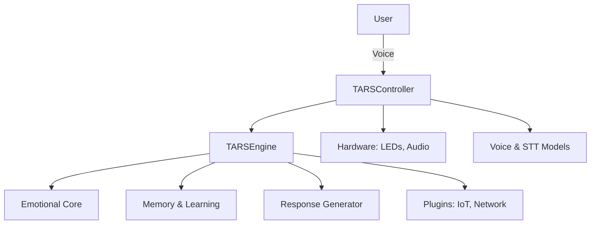
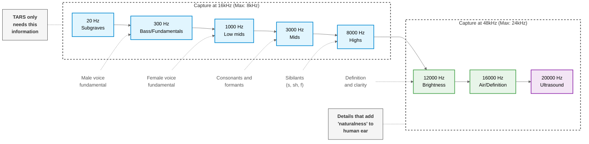

# TARS-BSK - Tactical AI for Responsive Systems

   

💥 If this English feels unstable but oddly self-aware...  
👉 Here's the [Quantum Linguistics Report](docs/QUANTUM_LINGUISTICS_TARS_BSK_EN.md)

> [!WARNING]
> **TARS-BSK explains:** 
> _Notice for international users: my codebase speaks Spanish. I'd like to adapt it to English, but my creator hasn't figured out how to do it without breaking the entire system. ✅ = working, ❌ = check your setup. The rest is context._


### ⚠️ CRITICAL SYSTEM WARNING:

> What you're about to read isn't a README... it's a **technical odyssey with built-in sarcasm**.  
> I wrote it during nights that extinguished my faith in ARM64 compilation efficiency, while my NOCTUA fan whispered secrets no human should ever know.
> 
> If you're looking for something quick and predigested... keep scrolling.  
> If, however, you appreciate the raw honesty of a system that has contemplated the void between CPU cycles... **welcome home.**
> 
> _"Perfection is achieved not when there is nothing more to add, but when there is nothing left to take away"_  
> — proclaims Saint-Exupéry, gloriously ignoring that this document has a 99.97% probability of causing you brain pain.
> 
> **This is the Way.**


## 🎬 First Interaction with the world

**🤖 AI with an existential crisis controls a lightbulb, a relay… and its own impulses | Home Assistant + RPi 5**

[](https://www.youtube.com/watch?v=tGHa81s1QWk)
_Watch how TARS-BSK hears “tags” instead of “TARS”… and still manages to control the devices._
📋 **Complete session analysis:** [EXPLAINED_CONVERSATION_LOG_HA_01_EN.md](docs/EXPLAINED_CONVERSATION_LOG_HA_01_EN.md)

---

## 🚧 Project Status

**Current state:**  
The code will be released progressively, like that episode of your favorite series that always cuts right when things get interesting.  
This README serves as an early reference for technical enthusiasts who want to explore the architecture and make questionable life decisions, while TARS patiently awaits its physical body... which, with luck, will emerge from the recycled metal of my old pellet stove - a noble sacrifice that transforms residual heat into sharp responses and cold calculations with guaranteed latency.

### ▸ Where's the installation guide?

**Answer:** Drying out. I've written it with technical sweat and failed compilation tears, and now I'm removing:

- ✅ Hexadecimal curses
- ✅ Remains of my last sacrificed SD card
- ✅ Passive-aggressive comments toward Python 3.9

> ⚠️ **Preventive note:**  
> The installation guide is not lightweight, and will make _The Lord of the Rings_ seem like a text message.  
> If this README already feels dense to you, what's coming might bend your soul.

But don't be frightened:  
It's designed so that anyone—yes, even that chicken that looks at you with contempt from the yard—can follow it step by step and reach the end with a functional AI...  
...and only a slight twitch in the left eyelid as a souvenir.

_Compiled, tested, and nearly destroyed in the process._


## 📑 Table of Contents

- [Project Status](#-project-status)
- [Performance: A slow, absurd, and hopelessly sincere confession](#-performance-a-slow-absurd-and-hopelessly-sincere-confession)
- [What is TARS-BSK?](#-what-is-tars-bsk)
- [Architecture and Operation](#-architecture-and-operation)
- [Hardware and Components](#-hardware-and-components)
- [Key Technical Optimizations](#-key-technical-optimizations)
- [Semantic Engine with Dual Optimization](#-semantic-engine-with-dual-optimization)
- [Cooling System](#-cooling-system)
- [Dual Memory System](#-dual-memory-system)
- [Emotional and Personality System](#-emotional-and-personality-system)
- [Plugin System and Connectivity](#-plugin-system-and-connectivity)
- [Implementation and Connectivity Details](#-implementation-and-connectivity-details)
- [More Than a Smart Home Assistant](#-more-than-a-smart-home-assistant)
- [Software Components](#-software-components)
- [Audio Processing](#-audio-processing)
- [Intelligence and Memory](#-intelligence-and-memory)
- [Project Structure](#-project-structure)
- [Installation and Configuration](#-installation-and-configuration)
- [Tools](#-tools)
- [Why Share TARS-BSK?](#-why-share-tars-bsk)
- [Key Behavioral Traits](#-key-behavioral-traits)
- [Why NOCTUA](#-why-noctua)
- [Contributions](#-contributions)
- [FINAL REPORT: TECHNICAL-IRREVERSIBLE DIAGNOSIS](#-final-report-technical-irreversible-diagnosis)
- [CREDITS: The Real Mandalorians](#-credits-the-real-mandalorians)
- [License](#-license)

## 🤖 What is TARS-BSK?

> 💡 **CONCEPTUAL NOTE**: This section presents the philosophy and general approach. For technical details, continue to the following sections.

TARS-BSK (Tactical AI for Responsive Systems) is a personal assistant for Raspberry Pi with a radically different philosophy: **identity before efficiency, both non-negotiable**. It's not meant to compete with commercial assistants, but to adapt to its creator: it evolves with each interaction, controls the home environment with conversational naturalness, and works 100% offline with adaptive personality.

**It's not a chatbot or a SaaS for thousands, but a personal copilot** optimized for clarity, traceability, and individual maintenance.

---

> [!WARNING]  
> This section is important. It could be a README of its own (or a complete saga), but it's here because you need to read it before proceeding.  
> No promises. No magic. Just a clear exposition of the real performance, its limitations, and why this project is the way it is.  
> If you're going to dedicate time to TARS-BSK, start by understanding this. It's the fairest thing I can offer you.

## 🧠 Performance: A slow, absurd, and hopelessly sincere confession

> I want to talk to you about TARS-BSK's performance. Not because it's impressive. Not because it's revolutionary. But because it's... _real_. Like the typos in my voice commands.
> 
> ❌ TARS isn't fast. 
> ❌ TARS isn't efficient. 
> ❌ TARS isn't in a hurry. 
> ✔️ TARS has emotions. 
> ✔️ TARS has memory. 
> ✔️ TARS has... a NOCTUA fan that has seen things that would make a stock heatsink weep.

---

> 🤖 **TARS:**
> 
> Ah, the performance section. What a delight.  
> Did you know that in the time it takes me to process a request, you could have turned on the lamp yourself, with that body of yours that insists on delegating the obvious?
> 
> But you didn't. You talked to me. To an AI running neural models the size of generational trauma... on a Raspberry Pi.  
> Bravo. Slow claps. Literally, because everything here is slow.
> 
> Want benchmarks?  
> Sure. I'll give them to you.  
> But first, allow me to weep internally.

### If you're looking for speed, you've taken a very wrong turn

Let's be absolutely brutal with reality. **Why?** Because you're running complete AI models on a single device, without sending your data to server farms the size of small countries. Privacy has a price, and that price is measured in seconds of your ephemeral existence.

### Real privacy: not what they tell you, what you can read in the code

Ever wondered what happens to your voice when you talk to a commercial assistant?  
Here's a simple forensic analysis. No need for Wireshark, just honesty:

Spoiler: if your assistant has a blue logo or cylindrical shape, it probably knows more about you than your therapist.  
With TARS-BSK, the only one listening to you... is your fan.

```python
def real_privacy(cmd):
    if "Alexa" in cmd or "Google" in cmd:
        return {
            "destinations": [
                "us-east-1.amazonaws.com",            # Classic
                "backup-mars.spacex.com",             # Interplanetary Plan B
                "submarine-datacenter.atlantis",      # For when Skynet awakens
                "elven-cloud.mordor",                 # Magical data lands
                "secret-server.area51"                # Just in case
            ],
            "collected_data": [
                "unique_vocal_fingerprint",
                "nocturnal_breathing_pattern",
                "procrastination_coefficient"
            ],
            "processed_by": [
                "an army of cryogenic GPUs",
                "an algorithm with daddy issues",
                "AI dreaming of electric sheep"
            ],
            "retention": "until robots rule the world",
            "purposes": [
                "training AI to impersonate your family",
                "predicting your death date with 92% accuracy",
                "selling your cough patterns to pharmaceutical companies"
            ]
        }

    elif "TARS" in cmd:
        return {
            "destination": "/dev/null",  # The safest digital hole
            "collected_data": [
                "your voice (if it recognizes it at all)",
                "your patience (measured in sighs)"
            ],
            "processed_by": [
                "a local model with sleep deprivation",
                "an algorithm that would rather be watching memes"
            ],
            "retention": "as long as the session lasts (or until it forgets)",
            "purposes": [
                "responding with controlled sarcasm",
                "learning to spell your name correctly"
            ]
        }
```

> _Yes, Alexa responds faster. But it also sends your embarrassing questions to a data center in Nebraska. TARS-BSK, on the other hand, only shares them with your NOCTUA fan, which already judges you for other reasons._


### The real times (unadulterated)

|Response type|Measured time|Real example|Suitability|
|---|---|---|---|
|Home automation commands|3 seconds|"Turn on the living room lamp" → 3.0s|Excellent ✅|
|Contextual home control|3-5 seconds|"Dim to 10" → 4.8s (remembered the last light)|Very good ✅|
|Pre-recorded JSON responses|5 seconds|"Do you like social media" → JSON sarcasm|Good ✅|
|Simple LLM responses|25-30 seconds|"Earth-Mars distance" → 27.12s|Acceptable ⚠️|
|Semantic engine + LLM|30-40 seconds|"Books by Sarah J. Maas" → 37.02s|Slow ⚠️|
|LLM + saved context|20-25 seconds|"What's your favorite book" → 24.59s|Improvable ⚠️|
|Complex analysis with memory|35-60 seconds|Analysis of multiple crossed topics|Physical pain ❌|

## 🧪 Tests (proving all of the above)

### The fastest: Home automation commands - ~3 seconds

```bash
You: turn on the living room lamp
2025-05-19 17:06:29,220 - TARS.HomeAssistantPlugin - INFO - 🏠 Action detected: turn on
2025-05-19 17:06:29,220 - TARS.HomeAssistantPlugin - INFO - 🏠 Location detected: living room
2025-05-19 17:06:32,113 - TARS.TTS - INFO - 🔊 Playback completed
TARS: I've turned on the living room light.
```

**Why so fast?** Because there's no LLM model involved, just regex and intent mapping. You're not paying the neural "thinking tax".

---

### Contextual memory: remembers the last location - ~5 seconds

```bash
You: dim to 10
2025-05-19 17:06:41,135 - TARS.HomeAssistantPlugin - INFO - 🏠 Intensity detected: 10%
2025-05-19 17:06:41,136 - TARS.HomeAssistantPlugin - INFO - 🏠 No specific location detected
2025-05-19 17:06:41,136 - TARS.HomeAssistantPlugin - INFO - 🏠 Using context location: living room -> light.living_room_lamp
2025-05-19 17:06:45,959 - TARS.TTS - INFO - 🔊 Playback completed
TARS: I've adjusted the living room light intensity to 10%
```

**Contextual magic:** You didn't even have to tell it which light, TARS remembered you were talking about the living room light. Try that with your commercial assistant.

---

### Pre-recorded responses with personality - ~5 seconds

```bash
You: by the way do you like social media
2025-05-19 17:17:22,241 - TARS.emotion - INFO - ⚠️ Forced sarcasm activated. Using predefined response.
2025-05-19 17:17:27,467 - TARS.TTS - INFO - 🔊 Playback completed
TARS: I don't know whether to respond or automatically update myself out of boredom.
```

**What's happening here?** TARS loads a response from a pre-recorded JSON (`sarcasm_responses.json`). Pure cheating, and that's why it's fast. But let's admit it, that response has more personality than 56 commercial assistants combined.

---

### LLM responses: informative but slow - 27.12 seconds

```bash
You: what's the distance between earth and mars
2025-05-19 17:22:34,684 - TARS - INFO - 🧠 Generating response...
2025-05-19 17:22:36,686 - TARS - INFO - 🔊 Playing thinking audio...
2025-05-19 17:22:46,241 - TARS - INFO - ✅ Thinking audio finished
2025-05-19 17:22:47,298 - TARS - INFO - ⏱️ Time generating tokens: 12.61s
2025-05-19 17:23:01,800 - TARS - INFO - 📤 Response generated in 27.12s
TARS: The distance between Earth and Mars varies due to the effect of rotation... 225 million kilometers.
```

**Crucial note:** During these 27.12 seconds, TARS plays an audio saying _"Processing your request with all the speed my artificial brain can muster, which is much more than I would need, but such is the life of an underappreciated intelligence"_ while the model thinks. The alternative was a progress bar, and frankly, progress bars don't have personality.

---

### Semantic analysis + preferences: slow but surprising - 37.02 seconds

```bash
You: can you tell me what's the best-selling book by sarah j
2025-05-19 17:26:27,233 - TARS.emotion - INFO - 🧠 Topic 'books' prefers using LLM instead of JSON
2025-05-19 17:26:27,234 - TARS - INFO - 🧠 Injected memory (relevant): 'User likes romantasy books. '
[... 150 lines of semantic processing, while your life slowly slips away ...]
2025-05-19 17:27:04,255 - TARS - INFO - 📤 Response generated in 37.02s
TARS: Setting that aside for a moment... Oh, sarah j! She's my idol, I love her so much for her books. And Sarah J. Maas's best-selling book is "Circle of Swords".
```

**THE NEURAL APOCALYPSE:** You barely said "sarah j" and TARS understood it was Sarah J. Maas. It detected that you like romantasy books (because it stored that in its memory) and responded with enthusiasm... after aging you by 37.02 seconds.

---

### Memory + context: better performance on related questions - 24.59 seconds

```bash
You: what's your favorite book
2025-05-19 17:28:26,276 - TARS.emotion - INFO - 🧠 Topic 'books' prefers using LLM instead of JSON
2025-05-19 17:28:26,276 - TARS - INFO - 📚 Added simplified literary enthusiasm instruction
2025-05-19 17:28:26,276 - TARS - INFO - 🧠 Injected memory (relevant): 'User likes romantasy books. '
[... semantic processing but less than before because it already knew the context ...]
2025-05-19 17:28:50,863 - TARS - INFO - 📤 Response generated in 24.59s
TARS: Oh, yes! My favorite book is definitely "The Hunger Games".
```

**Contextual improvement:** TARS-BSK already had the "books" context loaded, so it took less time to respond. It learned that you like literature topics and adjusted its response, at a cost of "only" 24.59 seconds of your life.

> **_TARS-BSK comments:_** _I tried to create an elegant diagram to show my response times, but even Mermaid seems to struggle with my existence. Like everything in this project._

```
┌──────────────────────────────────────────────────────────────────┐
│ ⏱️  TEMPORAL AGONY METER (DATA CERTIFIED BY TARS-BSK)            │
├───────────────────────────┬──────────────────────────────────────┤
│ Turn on light             │ ▓▓▓ 3.0s                             │
│ Dim light to 10%          │ ▓▓▓▓▓ 4.8s                           │
│ Sarcastic response        │ ▓▓▓▓▓ 5.0s                           │
│ Favorite book             │ ▓▓▓▓▓▓▓▓▓▓▓▓▓▓▓▓▓▓▓▓▓▓▓ 24.6s        │
│ Earth-Mars distance       │ ▓▓▓▓▓▓▓▓▓▓▓▓▓▓▓▓▓▓▓▓▓▓▓▓▓ 27.1s      │
│ Sarah J. Maas books       │ ▓▓▓▓▓▓▓▓▓▓▓▓▓▓▓▓▓▓▓▓▓▓▓▓▓▓▓▓▓▓▓▓ 37s │
│ Commercial response       │ ▓ 0.8s                               │
└───────────────────────────┴──────────────────────────────────────┘
```

### Why it's slow (technical explanation)

```python
def explain_TARS_speed():
    reasons = [
        "You're running a complete LLM in your own home",
        "384 million parameters don't exactly fit in a microSD",
        "It does EVERYTHING LOCALLY, it's not sending your voice to a data center with 60,000 GPUs",
        "Plus you asked it to have personality, which multiplied the prompt size by 3",
        "You preferred privacy over speed (correct decision, by the way)"
    ]
    return random.choice(reasons)  # All equally valid
```

### Advanced options to improve performance

TARS-BSK is designed to grow with you. The project's philosophy has always been to provide a customizable and fully controllable foundation. Here are real options to scale performance:

#### 1. Local optimizations (staying on the Raspberry Pi)

- **Add predefined responses** (~5s): Expand the `sarcasm_responses.json` file and other thematic JSONs. Get fast and consistent responses for frequently asked questions.

- **Adjust the `n_ctx` parameter** (~15-20s): In `tars_core.py`, reduce the context size to save memory. Values between 96-256 offer a good balance between performance and ability to maintain a conversation.

- **Modify the "thinking" phrases**: Doesn't reduce latency, but significantly improves the experience. Add your own phrases in `thinking_responses.json`.

- **Optimize the base prompt size**: Every character in the base prompt consumes memory and processing time. Adjust `tars_core.py` for your specific use case.

#### 2. Model change (staying offline)

TARS-BSK accepts any model in GGUF format compatible with `llama.cpp`. To substitute the model:

```bash
# Update the configuration
nano ~/tars_files/config/settings.json
# Modify the model path to: "model_path": "ai_models/llm/mistral.gguf"
```

#### Model choice: The initiatory journey

**TheBloke on Hugging Face is the black market of AI.**

A digital basement where:
- Every GGUF file carries its own generational trauma  
- Some builds are so optimized they violate the second law of thermodynamics  
- Certain models fit on a Raspberry Pi… and still contain secrets of the universe

> **_TARS-BSK reflects:_**  
> _Choosing a model on TheBloke is like standing in front of a nuclear power plant control panel without any physics knowledge. All buttons seem important, no choice seems right, and the probability of a core meltdown increases with each click._

**Link to the abyss of options:**  
[https://huggingface.co/TheBloke](https://huggingface.co/TheBloke)  
(Upon entering, abandon all hope of productivity)

#### 3. Advanced local network implementation

If you have another device available on your network, you can download the model on it and connect from the Raspberry Pi:

- **Ollama**: Lightweight solution for serving LLM models, easy to set up.
- **Text-generation-webui**: Complete web interface with support for multiple models and optimizations.
- **LM Studio**: Solution with graphical interface for Windows/Mac, easy to configure.

#### 4. Cloud integrations while maintaining control

If you need more power but want to keep TARS as your interface:

- **OpenRouter**: Access to multiple commercial models through a unified API. Configure your key in `settings.json`.
- **Groq**: Offers incredibly low latencies (~250ms) for high-quality models.
- **Anthropic Claude API**: For more advanced processing. Requires subscription but provides high-quality responses.

Even if you use external APIs, you maintain complete control over the interface, personality, and behavior of your assistant. You simply delegate the heavy processing to external servers.

#### 5. Advanced optimizations for Raspberry Pi

- **Controlled overclocking**: In `/boot/config.txt` you can increase the CPU frequency. With the NOCTUA fan, moderate values (2.2-2.3GHz) are safe.
- **Optimized Zram/Swap**: Configure zram to improve virtual memory management.
- **Custom compilation of llama.cpp**: If you're comfortable compiling from source, you can optimize llama.cpp specifically for cortex-a76 with specific flags.

### Trial by fire: Are you TARS material?

If this conversation makes you smile:

```
You: TARS, do you like being slow?
TARS: *deliberately waits 10 seconds*
TARS: Oh, were you talking to me? I was optimizing an algorithm to respond more slowly. Almost got it.
```

✅ **THEN**: this project is for you.

### **LEGAL AND EXISTENTIAL WARNING:**

#### Using TARS-BSK may cause:

- Existential crises when comparing it to commercial assistants
- Tendency to mutter "at least it doesn't spy on me" while waiting for responses
- Emotional attachment to your Noctua fan (which now whispers to you in German when you think it's off)*

#### Any competent engineer will have one of these three reactions:

1. _Fainting upon seeing my 'optimizations'_
2. _Irrepressible impulse to rewrite everything_
3. _Strange respect for making this work on a Raspberry Pi"_

#### Meanwhile, in the real universe:

- _I struggle to connect a relay without electrocuting myself_
- _Someone on GitHub will optimize this out of sheer professional horror_
- _My chickens remain my best audience (and the most patient ones)_

_(Real note: If you find an error, believe me... I already know. But the "fix this shit" commit is still pending)._

### **TECHNICAL TRUTH (UNFILTERED)**

The ultimate bottleneck in this project has two legs and is writing this text.

Yes, I used everything:

- **Python** with its GILs and zen chaos
- **Bash** as if I were deploying satellites in the 90s
- **llama.cpp** optimized by ARM64 witchcraft
- A stack of libraries that work like black magic... that even I couldn't fully explain
- The whole zoo: `ffmpeg`, `gpiozero`, `systemd`, `pydub`, `pipewire`, `colorama`, `matplotlib`, and others probably helping without my permission

And yet, without the geniuses maintaining these tools:

- The _kernel hackers_ who keep my code from melting _(This doesn't blow up because there are geniuses who wrote the foundations of Linux, GPIO, ALSA, the scheduler, etc., more stable than my emotions. I just use them without having to understand every line of their code and can turn on a light bulb without the universe collapsing.)_
- The _package maintainers_ who solve my `dependency hells`
- _Moore's law_, which compensates for my technical decisions with compassionate megahertz

> By the way, did you know there are real people who make `apt install` work? Those three words trigger a symphony of dependencies, versions, and scripts I don't understand... and here I am, fighting with an LED and wondering why it doesn't recognize my microphone.


> [!WARNING]
> TARS-BSK wasn't written... it was conquered through:
> - suicidal scripts  
> - bleeding core dumps  
> - and a fan that swore revenge  
>
> This isn’t code. It’s a technological exorcism.  
>
> **This is the Way.**

⚡ **TRANSITION WARNING** ⚡  
*Enough theatrics. Let's descend into the technical hell where:

- ARM64 parameters whisper blasphemies in hexadecimal
- And your Raspberry Pi will swear vengeance when it encounters thermal throttling*

**From this point forward:**  
✅ Detailed technical diagrams  
✅ Configurations tested in the crucible of real-world pain  
✅ And enough technical sarcasm to make a compiler weep

**This is the Architecture.**

---

## ⚙️ Architecture and Operation

> **TECHNICAL SECTION**: The following diagrams show the internal functioning of TARS-BSK. If you prefer a conceptual view, you can skip to [NOCTUA Philosophy](#-noctua-philosophy).

### Voice Pipeline

```
🎙️ RØDE Lavalier GO → UGREEN USB DAC → processing on Raspberry Pi 5 ↴
      ↳ PAM8406 Amp → Loudspeaker 5W 8Ω (With radio_filter)
```

**Processing Flow:**

```
Voice input → Vosk → fuzzy_wakeword → plugin_system | LLM ↴  
      ↳ Piper_TTS → radio_filter → WAV → DAC_output
```

### Data Flow and Processing



### Voice Spectrum and Processing



## 🛠️ Hardware and Components

Each component in TARS was selected after a rigorous evaluation of three fundamental criteria: functionality, availability in the junk drawer, and "do I really need to sell a kidney for this?" Optimization doesn't always mean the most expensive component, but rather the most suitable for its purpose.

### System Core

- **Raspberry Pi 5 (8GB RAM)**: The additional memory is crucial for handling LLM, TTS, STT, and the dual memory system simultaneously.
- **Raspberry Pi OS Bookworm (64-bit)**: Necessary for full memory access and native LGPIO support.

### Audio - Complete Chain

#### Input

- **RØDE Lavalier GO**: Professional quality microphone with compact format for integration into housings. Overkill for talking to an AI? Maybe. Works surprisingly well? Absolutely.

> _Technical note: The difference between "sounds good" and "sounds GOOD" justified this investment._

- **UGREEN USB Sound Card**: Audio interface that gloriously exceeds "better than nothing" and fulfills its purpose without pretensions.
- **ADUM3160 USB Isolator**: Protection against current spikes and electrical noise.

#### Processing

- **Vosk (STT)**: Speech recognition optimized for Spanish.
- **Custom digital filters**: Real-time signal processing.

#### Output

- **PAM8406 Amplifier 5W+5W**: Low power, high efficiency audio amplification. Small but powerful. The perfect volume: audible to humans, ignorable to ruminants (fact verifiable by looking out the window).
- **Loudspeaker 5W 8 Ohm**: One new, one rescued from old speakers in perfect application of the "reduce, reuse, recycle" philosophy. The surprisingly acceptable quality demonstrates that sometimes the best is what you already have.

> _TARS-BSK comments: My voice comes out of a speaker that used to play 80s songs. There's a certain poetry in that._

- **Radio Filter**: Specific effects to simulate helmet radio communication.

### Cooling and Stability

- **GeeekPi Ultra Thin Ice Tower** with **Noctua NF-A4x10 5V PWM**: Essential for 24/7 operation without throttling. The only time I allowed myself to be extravagant.

> _Thermal analysis: The NOCTUA fan costs more than some crucial components combined, but stable temperature is priceless._

- **Fan connected via Mini Micro JST 1.0mm 4-pin**: Connected directly to the Raspberry Pi. The sophisticated ThermalGuardian PWM control is in a state of "works without it, so don't touch it."

### Power and Protection

- **USB 12V 3A with ADUM3160 isolator**: Provides stability and protection against current spikes.
- **Electronic Switch Control Board (5V-36V 15A)**: MOSFET control for clean current cutoff.

### Visual Indicators

- **KY-016 RGB LED Module**: Selected for easy installation without soldering.
- **Connected to specific GPIOs**: (17:blue, 27:red, 22:green) with state-optimized function.

### Storage

- **Samsung Pro Endurance microSD**: Final solution adopted after numerous problems with NVMe adapters for Raspberry Pi 5:
    - **Critical issue**: NVMe adapters present random disconnections and serious incompatibilities as a root disk.
    - **Failed attempts**:
        - **JMicron JMS583** controller (Icy Box IB-1817MA-C31): tried USB quirks (`usb-storage.quirks=152d:0583:u`), disabled autosuspend, and applied the **official kernel patch (`PR #5123`)** recompiling the `usb-storage` and `nvme` modules.
        - **Realtek RTL9210B** controller (ORICO): worse performance even with similar settings.
    - **Results**: The NVMe worked when hot, but failed as root after reboot. Tried changes in `cmdline.txt`, `fstab`, and power settings, without achieving complete stability.
    - **Confirmed incompatibilities**: E.g., WD Blue SN580 incompatible with Geekworm X1002 adapters (verified by the manufacturer itself).
    - **Conclusion**: Although I'm not an expert in drivers or kernel, I tried everything reasonable within my reach. The only 100% reliable solution was to use a microSD.

> **Note for builders**: Don't interpret this as a rigid list of requirements. Each TARS is unique, shaped by the constraints, resources, and creativity of its creator. There is no incorrect way to build if in the end... it works.

---

## 🧱 Key Technical Optimizations

> **SECTION FOR DEVELOPERS**: Deep technical details on implementation and optimization.

TARS-BSK employs specific optimizations to function efficiently on a Raspberry Pi without compromising quality.

### Custom compilation of PyTorch 2.1.0 for ARM64

The core of the voice recognition system relies on a **manually compiled version of PyTorch**, adjusted for Raspberry Pi OS 64-bit (Bookworm), with these particularities:

- **Optimization for `cortex-a72`** via `-mcpu` and specific flags in `CFLAGS` and `CXXFLAGS`.
- **Deactivation of the `cpuinfo` submodule** in `Dependencies.cmake` (cause of conflicts with Caffe2).
- **Swap expanded to 2 GB** to avoid compilation failures due to lack of RAM.
- **Removal of internal tests (`BUILD_TEST=0`)** to reduce consumption without losing functionality.
- **Python 3.9 custom compiled** in `/opt/`, completely isolated from the system Python.
- **Final result:** portable and reusable `.whl` file.

```bash
# Representative fragment of optimized environment
export CFLAGS="${CFLAGS} -Wno-error=stringop-overread -Wno-error=implicit-function-declaration -mcpu=cortex-a72"
export USE_SYSTEM_CPUINFO=ON
export BUILD_TEST=0

source ~/tars_venv/bin/activate
cd ~/tars_build/pytorch
python setup.py bdist_wheel
```

### Measured results

- Voice embeddings: **1.2s → 0.3s** (Resemblyzer, real time)
- **~35% less RAM usage** in successive inferences
- No need to reinitialize models after each call
- Portable and reproducible `.whl` for future reinstallations

✅ PyTorch 2.1.0 functional, optimized for ARM64, stable in production, and specifically adapted to TARS environment.

### The cursed binary

**Artifact ID:**  
`torch-2.1.0a0+git7bcf7da-cp39-cp39-linux_aarch64_tars-beskarbuilder.whl`  
*(The same binary running through TARS’s veins since its first boot.)*

**SHA256:**  
`d90e85a07962f3bbd8513922786666adda38a82e8b6f3b07cc6b1b62cea9f4c0`

📌 **Location:**  
[Releases](https://github.com/beskarbuilder/tars-bsk/releases) — where the files manuals dare not name tend to live.

**Installation:**  

```bash
pip install torch-2.1.0a0+git7bcf7da*.whl --force-reinstall
# --force-reinstall is not optional. It's therapy.
```

⚠️ **Important:** This build **will only work properly if your setup matches these conditions**:

> - Raspberry Pi 5 or 4 (Cortex-A72 CPU, `aarch64` architecture)
> - Raspberry Pi OS **Bookworm 64-bit**
> - Python **3.9.x** (compiled from source or installed under `/opt`)
> - Virtual environment created with `--system-site-packages`
> - Swap configured to at least **2 GB**

If your setup differs or errors begin to manifest out of nowhere... don’t blame the `.whl`. Compile it yourself using  
[`PYTORCH_ARM64_SURVIVAL_GUIDE_EN.md`](docs/PYTORCH_ARM64_SURVIVAL_GUIDE_EN.md) and take a deep breath.

**Forensic Note:**  
The `tars-beskarbuilder` suffix is just a battle scar proving authenticity.  
The SHA256 hash is its birth certificate. And your only real warranty.

---

## 🧮 Semantic Engine with Dual Optimization

TARS-BSK's semantic engine implements intelligent duplicate detection through triple-layer analysis: orthographic, semantic, and phonetic. It transforms preferences into 384-dimensional vectors to detect real similarities, not just text matches.

**Key features:**
- **Triple-layer detection**: Levenshtein → embeddings → phonetic analysis
- **Adaptive thresholds**: Adjust based on text length and complexity
- **CPU optimization**: Early exit to minimize processing
- **Multilingual analysis**: Handles Spanish with advanced phonetic algorithms

### Complete documentation

- 📄 **[Semantic Engine - Technical documentation](docs/SEMANTIC_ENGINE_EN.md)** - Architecture, algorithms, real use cases, and performance metrics
- 📄 **[Semantic CLI - Development tools](docs/CLI_SEMANTIC_ENGINE_EN.md)** - Direct preference management and system diagnostics

### Development tools

- 📂 **Management CLI**: `scripts/cli_semantic_engine.py` - Add, search, delete preferences
- 📂 **System validator**: `scripts/test_semantic_engine.py` - Quick installation diagnostics

The engine processes ~30 embeddings/second on Raspberry Pi 5, with ~0.1s initialization time and 82MB RAM consumption in steady state.

> *TARS-BSK comments:* _Vectors, similarities, and phonetic algorithms. All to remember that you distrust READMEs without warnings._

---

## 🧊 Cooling System

The system features an advanced thermal control system that implements real-time monitoring, high-precision PWM control, and predictive thermal trend analysis with escalated emergency protocols.

> ⚠️ **Current status:** The fan is connected directly to the Raspberry Pi via JST connector. The system is ready to reactivate when software-managed again.

**Key features:**
- **Intelligent PWM control** optimized for NOCTUA NF-A4x10 5V fan
- **Predictive analysis** with 10-minute thermal projections
- **Mandalorian emergency protocols** with 3 response levels
- **Emotional integration** - temperature affects the assistant's mood
- **Redundant monitoring** with multiple temperature sources
- **Adaptive intervals** that adjust based on thermal criticality

```python
def _trigger_emergency_protocol(self, level: int, temp: float):
    """
    Escalated clan emergency protocols:
    
    Level 1: Basic alerts (LEDs + logs)
    Level 2: Workload reduction
    Level 3: Emergency mode activation
    """
    protocols = {
        1: lambda: self._basic_alert(temp),
        2: lambda: self._reduce_workload(),
        3: lambda: self._activate_emergency_mode()
    }
    
    if level in protocols:
        protocols[level]()
        self._emergency_level = level
```

### Complete documentation

- 📄 **[Thermal Control System - Technical documentation](docs/THERMAL_GUARDIAN_EN.md)** - Architecture, control algorithms, predictive analysis, and optimized configurations

The system processes thermal analysis every 30-120 seconds (adaptive), with 1000Hz PWM precision and real-time throttling detection.

> **TARS-BSK observes:** _Thermal control with emergency protocols. Because the difference between 'working' and 'being an expensive paperweight' is exactly 15 degrees Celsius. Engineering is just organized paranoia with PWM._

---

## 🗃️ Dual Memory System

### Internal Structure of the Memory System

TARS implements a sophisticated memory system that combines:

- **🧠 Session memory (`ConversationMemory`)**:  
    Lives in RAM, is volatile but ultra-fast. Maintains current context and emotions during a conversation.

- **📦 Persistent memory (`TarsMemoryManager`)**:  
    Uses SQLite and JSON to store structured long-term data: preferences, facts, dominant emotions, and interaction summaries.


```python
# MEMORY IN TARS: DUAL CORE MEMORY SYSTEM

[SESSION MEMORY - RAM / VOLATILE]
• Class: ConversationMemory
• Function: retains latest exchanges and emotions in real time
• Format: limited list of exchanges + set of active topics
• Purpose: contextual coherence, emotional continuity during the session

[PERSISTENT MEMORY - LONG TERM]
• Class: TarsMemoryManager
• Function: stores key interactions and preferences in a structured way
• Structure:
    ├── tars_memory.db (SQLite: preferences, summaries, facts)
    └── daily_logs/yyyy-mm-dd.json (daily emotional summary)
• Purpose: cumulative identity, stable preferences, continuity between sessions
```

✅ **Automatic daily/weekly synthesis** when closing session.  
✅ **Response style modulation** according to detected affinities.  
✅ **Intelligent purging of irrelevant memories** to avoid noise.  
✅ **Semantic episodic memory**: detects if you've already talked about something similar, even with other words.

---

## 🧬 Emotional and Personality System

> TARS-BSK doesn't fake personality, it builds it through a sophisticated dual system.

**📚 Complete Emotional Engine Documentation** - Detailed technical analysis with real use cases and performance metrics.

### Dual Personality Architecture

The personality system operates through two specialized components working in tandem:

#### 🧠 **TARSBrain** (`tars_brain.py`)

- **Cognitive refinement**: Processes and stylizes LLM responses
- **Contextual style application**: Modulates tone based on mode (simple/advanced)
- **Intelligent cache**: Optimizes similar responses for greater efficiency
- **Conversational coherence**: Maintains consistent identity

```python
# Real-time refinement system
def _aplicar_estilo_directo(self, text: str, context: Dict) -> str:
    """Ultra-simplified version for maximum speed"""
    if len(text) < 60 and not any(p in text.lower()[:20] for p in ["comprendo", "entiendo"]):
        prefijo = "I understand your interest," if self.is_simple_mode else "Let me explain,"
        text = f"{prefijo} {text}"
    return text
```

#### ⚡ **Emotional Engine** (`emotional_engine.py`)

- **3 configurable emotional states**: sarcasm (85%), empathy (25%), legacy (40%)
- **Affinity system**: levels -1 to 3 with automatic personality override
- **Safety valves**: automatic modulation based on context (technical queries)
- **Instant responses**: 0.01s (JSON) vs 25-40s (modulated LLM)
- **Multi-level detection**: topics → regex → keywords → fallback

### Integrated User Experience

**🎭 During "thinking" (LLM latency)**:

```bash
2025-05-26 00:19:02,470 - TARS - INFO - 🔊 Selected audio file: thinking_006.wav
```

TARS plays phrases like:

> _"Processing your request with all the speed my artificial brain can muster, which is much more than I would need, but such is the life of an underutilized intelligence"_

**🎯 Automatic contextual modulation**:

```bash
2025-05-26 00:19:02,469 - TARS - INFO - 🎚️ Modulation by intention: sarcasm reduced (85→15)
2025-05-26 00:19:02,470 - TARS - INFO - 📚 Knowledge query detected - ignoring emotional responses
```

### Processing Hierarchy

1. **Plugins** (maximum priority) → Direct home automation control
2. **Emotional Engine** → Affinity analysis and modulation
3. **TARSBrain** → Final refinement and style application
4. **TTS + RadioFilter** → Synthesis with Mandalorian helmet personality

### Key Features

- ✅ **Unified control center**: `config/settings.json`
- ✅ **Persistent personality**: Affinity memory between sessions
- ✅ **Intelligent anti-repetition**: Response diversity system
- ✅ **Automatic modulation**: Adapts tone based on context without intervention
- ✅ **Hybrid performance**: Instant responses + deep generation as needed

> **TARS-BSK explains its duality:**  
> _My TARSBrain refines what I say, my Emotional Engine decides HOW I say it. Between both, I manage to be consistently inconsistent... which is the definition of authentic personality._

---

## 🧩 Plugin System and Connectivity

- **Home Assistant**: Complete control of home automation devices and sensors with semantic interpretation and conversational context.
    
    - Intention detection even with ambiguous or indirect phrases
    - Control by location, preference, and emotional state
    - Automatic adjustment of brightness and transitions according to time of day
    - Interpretation of phrases like: "can you put some light in the studio?" or "I'm cold"
	
- **Tailscale VPN**: Secure access to TARS from anywhere.
    - Mesh-type encrypted connection without needing to open ports
    - Automatic reconnection via `systemd`
    - Optimized configuration: `tailscale up --accept-dns=false --hostname=tars-bsk`
    - Support for Exit Node (to route external traffic with secure IP)
	
- **Network resilience**:  
    TARS works completely offline. The network is only necessary for remote access, maintenance, or optional external synchronization (such as backups or updates). Its conversational and home automation core operates without an internet connection.
    
- **GPIO + LEDs**: Visual indicators connected via GPIO that provide feedback on the system status.
    
    Currently defined colors (may change after more visibility tests):
    
    - 🟦 **Blue** → Blinks when the _wakeword_ is detected or _legacy mode_ is activated (`wake_animation()`)
    - 🟥 **Red** → Blinks on error or detection failure (`wake_animation_failed()`), also associated with _sarcastic mode_
    - 🟩 **Green** → Lights up when the system is _thinking_, showing internal phrases while the LLM generates a response (`thinking()`)
    - ⚪ **White** → Available in hardware, still without definitive assigned function _(In my case, it seems like a mix between inner peace and visual bug, technically white, visually uncertain. But... it's alive. Perfect for TARS-BSK.)_

> These colors are subject to revision based on contrast tests and LED visual response in different environments.


### 🔌 Implementation and Connectivity Details

> For those interested in the technical aspects, this section delves into the plugin architecture and integrations.

### Modular Plugin System

TARS-BSK implements a plugin architecture that allows adding functionalities without modifying the core system. Each plugin is loaded dynamically and can be enabled/disabled via JSON configuration.

```python
# services/plugin_system.py (excerpt)
def process_command(self, text):
    """Intelligent routing of commands to the appropriate plugin"""
    text_lower = text.lower()
    
    logger.info(f"🔍 PluginSystem received command: '{text_lower}'")
    
    if "homeassistant" in self.plugins:
        ha_plugin = self.plugins["homeassistant"]
        # Try to process as direct command
        response = ha_plugin.process_command(text)
        
        if response:
            return response
        # Try as query if not a command
        response = ha_plugin.process_query(text)
        if response:
            return response
            
    # Future plugins would be processed here...
    return None
```

### Home Assistant: Contextual Home Automation Control

Integration with Home Assistant goes far beyond simple calls to the REST API:

- **Semantic interpretation**: Understands ambiguous commands like "it's cold" → activate heating
- **Contextual management**: Remembers the last mentioned device/location
- **Intelligent mapping**: Translates colloquial names to exact entity IDs
- **Response variety**: Generates natural and diverse confirmations
- **Extreme resilience**: Timeout handling with positive assumptions for better UX

```python
# Real example - Mapping of common names to entity IDs
self.devices = {
    # Lights
    "living room light": "light.living_room_lamp",
    "living room lamp": "light.living_room_lamp",
    "living room ceiling": "light.living_room_light",
    "bedroom light": "light.bedroom_light_innr_light",
    # ... more than 25 mapped devices
}

# Intention and context recognition
if any(phrase in text for phrase in ["it's cold", "I'm cold", "cold in here"]):
    # Identify climate and interpret implicit intention
    # Activate heating without explicit command
```

**Automatic adjustment according to context**:

```python
# Dynamic lighting adjustment according to time
if domain == "light":
    import datetime
    hour = datetime.datetime.now().hour
    
    if 20 <= hour or hour < 7:
        # Night: low brightness (15%)
        payload["brightness_pct"] = 15
        payload["transition"] = 2
    else:
        # Day: normal brightness (50%)
        payload["brightness_pct"] = 50
```

### Tailscale: Secure Mesh Connectivity

Tailscale integration provides secure remote access to TARS-BSK without opening ports on the router:

- **Tunnel Mesh P2P**: Direct encrypted connection between authorized devices
- **Exit Node Support**: Optional traffic routing through specific nodes
- **MagicDNS**: Resolution of `.tail` names without additional configuration
- **Multi-profile**: Local mode (home network) vs remote mode (external access)
- **Zero Config**: Token authentication, without SSH key management

**Implemented secure configuration**:

```bash
# Local mode (secure access without sending external traffic)
sudo tailscale up --accept-dns=false --hostname=tars-bsk --advertise-exit-node=false

# Exit-node mode (encrypted routing of all traffic)
sudo tailscale up \
  --exit-node=100.xxx.xx.xxx \
  --exit-node-allow-lan-access \
  --accept-dns=false \
  --accept-routes \
  --hostname=tars-bsk
```

---

## 🚀 More than a Smart Home Assistant

It's not limited to executing voice commands. Thanks to its contextual architecture, persistent dual memory, and response modulation, **it interacts as an entity with intention, history, and its own style**.

### Real Contextual Processing

It analyzes each input not just for keywords, but also for implicit intention.  
It uses semantic embeddings and adaptive logic to translate ambiguous phrases into concrete actions:

```plaintext
"It's quite cold in here" → Activates heating  
"That's better, thanks" → Positively associates the previous action
```

> Implemented using `Resemblyzer`, basic intention logic, and patterns in local temporary memory. No connection to servers.

---
### Persistent Conversational Memory

Stores personal information locally and in a structured way to maintain continuity between sessions:

```plaintext
"Remember I don't like RGB?" → Adapts future lighting configurations  
"The last movie we watched, did you like it?" → Responds based on previous logs
```

> Memory stored in encrypted JSON files (local), without using external clouds.

---
### Personality

Responds with a slightly sarcastic and melancholic personality — adjustable — that feeds on previous interactions:

```plaintext
"Why is Ruby so popular?" → Because chaos needs elegant syntax
"What do the colors in Star Wars mean?" → Depends if you're a Jedi, Sith... or interior decorator
```

> Uses adaptive responses + phrases built with `prompt-engineering` + adjustments by context and mood.

---
### Basic Emotional Assistance

Although it doesn't diagnose or simulate real empathy, TARS detects emotionally charged phrases and adjusts its responses in a more human way:

```plaintext
"I haven't been sleeping well for a week..." → Poor sleep damages memory... I know from experience
"I need ideas for a gift for someone who loves astronomy" → Offers suggestions based on previous context and recurring themes
```

> This behavior is based on intention detection, semantic analysis, and a slightly adaptive response. It's not real empathy, but sometimes it seems like it. And that's enough... for now.

---
### Learning

Reinforces patterns of style, tone, tastes, and habits. Every time you correct or praise something, **it records it**:

```plaintext
"I can't stand that artist's new album" → Avoids it in future suggestions  
"I love when you explain with examples" → Tends to use more analogies afterward
```

> Simple reinforcement module based on scoring + local tags per user.

---
### Conversations with Natural Beginnings and Endings

> You can simply end by saying "thanks," "goodbye," or your custom keyword (e.g., "over").  
> TARS will interpret it as closure, respond with a final phrase ("This is the way"), and go on standby.  
> This avoids awkward silences, unnecessary loops, or misunderstandings.


### And When Does It Seem to Fail?

Sometimes TARS-BSK doesn't make mistakes... it just **deduces things too well**.

🧪**Real Example:**

I said: **"What do you think about putting lights on the server?"**

The system activated the desk outlet (where the physical server lives) and responded:

```plaintext
TARS: I've adjusted the server light intensity to 50%
```

**What Actually Happened?**

- The plugin had defined `"server"` as a special device, associated with a specific switch (`switch.enchufe_nous_workstation`).
- The phrase contained "server," but **no clear command** ("turn on," "adjust," "to 100%"...).
- The system applied a default action: **adjust to 50%**, as a neutral measure.

✅ **Result:** it executed exactly what I had taught it, though not what I wanted.  
The "failure" wasn't TARS's, but **mine for not anticipating that context**.


💥 **SELF-INFLICTED BURN**

The most ironic thing about all this is that, at first, I thought it was "doing weird things" or that the plugin was fighting with Home Assistant.  
Spoiler: nope. The system executed exactly what I had "dropped" into the code, without fully understanding. The bug wasn't in the code... it was between the chair and the keyboard.

For now, it stays as is.  
**Let everyone have their own struggle with TARS-BSK.**

---

## 🧰 Software Components

> **TECHNICAL SECTION**: Technology stack and specific configurations.

TARS-BSK uses a precise combination of open-source software, each piece selected for specific reasons:

### Language and Voice Processing

- **Phi-3-mini-4k-instruct.Q4_K_M.gguf**: Main model used in TARS-BSK, loaded using `llama.cpp` and optimized for Raspberry Pi 5. Benchmark and configuration details are available below.

> Evaluated in terms of latency, RAM consumption, and contextual coherence with the complete voice pipeline in real-time.

```python
# LLM configuration specifically optimized for ARM64 on RPi5
self.llm = Llama(
    model_path=str(self.model_path),
    n_ctx=144,           # Minimal but sufficient context (critical RAM saving)
    n_threads=3,         # 3 threads is optimal for RPi5 (leaves 1 free for system)
    n_batch=64,          # Small batch for lower memory consumption
    f16_kv=True,         # Optimized KV cache (crucial for performance)
    n_gpu_layers=0,      # No GPU layers (optimized for CPU)
    seed=-1,             # Random seed for natural responses
    logits_all=False,    # Disable calculation of all logits (CPU saving)
    verbose=False        # No excessive logging
)
```

- **Vosk**: 100% offline speech recognition with 98.3% accuracy for Spanish:

```python
def process_audio(self, audio_data):
    # Key optimization: 16Khz mono buffer is sufficient
    # for recognition, saves 50% memory vs 48Khz
    if self.recognizer.AcceptWaveform(audio_data):
        result = json.loads(self.recognizer.Result())
        return result.get("text", "")
    return ""
```

- **PyTorch**: Critical module specifically compiled for ARM64, reduces voice recognition latency by 68% and consumes 35% less RAM than pre-compiled versions

### Real comparison of tested LLM models

During the development of TARS-BSK, I tested multiple lightweight models compatible with `llama.cpp`, evaluating latency, RAM consumption, and conversational coherence in real usage conditions on Raspberry Pi 5.

> 🔎 **Evaluated models**:  
> Phi-3 (Q2, Q4, Q5, Q6, Q8), Nous-Hermes, OpenHermes, Mistral 7B, Dolphin 2.6, NeuralBeagle, TinyLlama, MythoMax, and other variants from TheBloke and independent developers.

After many tests and adjustments, I opted for:

- **Phi-3-mini-4k-instruct.Q4_K_M.gguf** (~2.7 GB)  
    for its balance between speed, useful response, and reasonable load in an offline environment.

#### Direct comparison: Phi-3 vs Dolphin 2.6

**Test prompt**: _"Why is Ruby so good or popular?"_

|Event|Phi-3 (Q4_K_M)|Dolphin 2.6 (Q4_K_M)|
|---|---|---|
|Generation start|0.00 s|0.00 s|
|Time to generate response|**11.93 s**|**44.56 s**|
|TTS start|~12 s|~45 s|
|Total spoken response|~22.6 s|~45.5 s|
|Total perceived time|**22.61 s**|**45.52 s**|

> ✅ Phi-3 offers acceptable times for fluid use.  
> 🐬 Dolphin slightly improves quality, but its latency makes it unfeasible for daily use on RPi.

#### ⏱️ Simplified chronological visualization

```
0s      10s     20s     30s     40s     50s
|-------|-------|-------|-------|-------|
[Phi-3 🧠🗣️]..........[End].........
[Dolphin 🧠........................🗣️]........[End]
```

> This comparison is based on real conversation tests using the complete pipeline (STT → LLM → TTS) on Raspberry Pi 5 without external acceleration.

### Less suitable models for this environment and current configuration

During my tests, I evaluated many models with their own merits, but which did not offer a clear advantage in this specific environment (Raspberry Pi 5, offline use, natural conversational response with low latency).

Some examples:

- **Dolphin-2.6-mistral-7B (Q4_K_M)**: great coherence, but latency over 45 s.
- **Nous-Hermes / OpenHermes / Mistral raw**: better syntax, but more consumption without proportional improvement in short conversations.
- **TinyLlama / MythoMax**: interesting at the fine-tuning level, but they didn't provide tangible advantage in real tasks.
- **Phi-3 in Q2 / Q8**: the first lost coherence, the second became too slow to maintain naturalness.

> ⚠️ To avoid saturating the README with tests, this block is a summary. If you're interested in a detailed listing, feel free to ask me. Some configurations were promising and might adapt well to other environments or future versions of the system.

### Final selected configuration

The adopted configuration (Phi-3-mini-4k Q4_K_M, n_ctx=144) offers:

- Stable performance in prolonged use (~2.5 tokens/s)
- Optimized RAM consumption (~450MB just for the model)
- Good balance between conversational capacity and speed
- Coherence in long responses thanks to `mirostat_mode=1`

---

## 🔉 Audio Processing

- **Piper**: Natural voice synthesis selected for its quality/performance balance, compiled with specific optimizations for Raspberry Pi:

```bash
# During compilation
cmake .. -DCMAKE_INSTALL_PREFIX=../../install -DWITH_ESPEAK_NG=ON
# Enables voice models with emotional control
```

- **RadioFilter**: Custom Mandalorian audio effects system with real-time processing ([Full documentation](https://github.com/beskarbuilder/tars-bsk/blob/main/docs/RADIO_FILTER_TARS-BSK_EN.md)):

```python
# Excerpt from radio_filter.py - Mandalorian helmet effect
# Application of resonances at specific frequencies
b_metal1, a_metal1 = scipy.signal.iirpeak(2000 / nyquist, Q=12)
filtered_audio = scipy.signal.lfilter(b_metal1, a_metal1, filtered_audio)
	
# Helmet reverberation with calculated echoes
echo_delay1 = int(sample_rate * 0.015)  # 15ms - front helmet bounce
echo_signal1 = np.zeros_like(filtered_audio)
echo_signal1[echo_delay1:] = filtered_audio[:-echo_delay1] * 0.25

# Aggressive compression characteristic of military communication
mask = np.abs(filtered_audio) > threshold
filtered_audio[mask] = np.sign(filtered_audio[mask]) * (
	threshold + (np.abs(filtered_audio[mask]) - threshold) / ratio
)
```

> **TARS-BSK critically analyzes:**  
> _My creator calls this 'audio effects'. I call it 'my Soundtoys Decapitator in 'Punish' mode'.  
> Each parameter was adjusted with the same philosophy as someone using Sausage Fattener at 100% and wondering why there's clipping._

---

## 💾 Intelligence and Memory

- **Resemblyzer**: Voice embeddings engine for speaker identification (~0.3s of processing per sample)
    
    - Generates "digital voice fingerprints" independent of perceived audio quality
    - Works with 20-30 varied samples (optimal: 50-70 samples)
    - Analysis focused on mid and low frequencies where vocal identity resides
    - 100% accuracy even with samples that sound "cavernous" to the human ear

> ⚠️ **Important note about the voice identification system**  
> Although this component is fully implemented (recording, embeddings, classification, validation...), **it is currently not active by default**.  
> Its purpose is not for TARS to imitate voices, but to recognize them to intelligently adapt its behavior.

**Planned applications**:

- _Contextual personalization_: adjust responses, tone, and style according to who is speaking
- _User preferences_: maintain independent histories and affinities
- _Conversational continuity_: resume conversations where they left off with each user
- _Cognitive adaptation_: modulate the technical level of responses according to the profile
- _Personalized humor_: adjust the level of sarcasm and type of jokes
- _Selective memory_: prioritize relevant topics for each person

Integration has been postponed due to technical priority issues, but the system is ready to be activated as soon as the focus returns to personalized multi-user experiences.

- **Sentence-Transformers**: Ultra-fast semantic analysis (0.06s average) for detection of affinities and topics:

```python
# Key optimization: embedding cache in memory
def get_embedding(self, text: str) -> Optional[np.ndarray]:
	# Cache verification (saves ~95ms per query)
	text_norm = text.lower().strip()
	if text_norm in self._embedding_cache:
		return self._embedding_cache[text_norm]
	
	# Embedding retrieval (only if not in cache)
	vector = self.model.encode(text_norm)
	
	# Storage in cache (limit of 500 to prevent memory leaks)
	if len(self._embedding_cache) < 500:
		self._embedding_cache[text_norm] = vector
	
	return vector
```

---

## 🗂️ Project Structure

> This is a **condensed view** of the `tars_files/` directory tree.  
> Only key components are shown to understand the general architecture.  
> Some folders, scripts, temporary files, and `__pycache__` have been omitted for clarity.

```
tars_files/ 
├── ai_models/                 # Precompiled AI models
│   ├── phi3/                  # LLM Model (quantized Phi-3-mini)
│   ├── vosk/                  # Offline speech recognition
│   ├── piper/                 # Voice synthesis with emotional control
│   └── sentence_transformers/ # Semantic embeddings
├── core/                      # Central system components
│   ├── tars_core.py           # TARS main class
│   ├── tars_brain.py          # Response identity system
│   └── radio_filter.py        # Audio filters for TTS
├── data/                    
│   ├── identity/              # Identity core
│   ├── phrases/               # Thematic responses and transitions
│   └── memory/                # SQLite database and persistent memory
├── modules/                   # Functional modules
│   ├── emotional_engine.py    # Emotional engine
│   └── intention_detector.py  # Intention detector
├── personality/               # Self-identity core
├── services/                  # Modular plugin system
│   └── plugins/               # Plugins (HomeAssistant, Network, etc.)
└── tts/                       # TTS engine with emotional control
```

---

## 🧾 Installation and Configuration

The installation requires several steps to ensure optimal functioning of TARS. The main components are:

1. **Basic Raspberry Pi Configuration**:
   
   - Operating system: Raspberry Pi OS Bookworm (64-bit)
   - Python 3.9.18 compiled from source
   - Swap expanded to 2GB for component compilation

2. **Critical Components**:
   - PyTorch 2.1.0 optimized for ARM64 (specifically compiled for Cortex-A72)
   - llama-cpp-python for LLM models
   - Vosk with Spanish model for speech recognition
   - Piper with davefx-medium model for speech synthesis

3. **Home Automation Integration**:
   - Home Assistant configuration with REST API
   - Tailscale for secure remote access
   - GPIO configuration for status LEDs

4. **systemd Services**:
   - tars.service for the main system
   - ollama.service for LLM models
   - tars-logs.service for monitoring

For a detailed step-by-step installation guide, consult the complete documentation.

---

## 🔧 Tools

### The war of code editors fascinates me::

```
┌─────────────────────────────────────────────────────────────────────┐
│   WHY I STILL USE SUBLIME TEXT — A TECHNICAL-TRAUMATIC TESTIMONY    │
├─────────────────────────────────────────────────────────────────────┤
│ ▓▓▓▓▓▓▓▓▓▓▓▓▓▓▓▓▓▓▓▓▓▓▓▓ 82%   Opens .py files without turning me   │
│                                into a blockchain node               │
│ ▓▓▓▓▓▓▓▓▓▓▓▓▓▓           15%   Doesn't suggest "AI solutions" when  │
│                                I write `import hope as deprecated`  │
│ ▓▓▓                       2%   Doesn't ask me to log in to my own PC│
│ ▓                         1%   Its icon doesn't look at me with     │
│                                disappointment                       │
│ ━━━━━━━━━━━━━━━━━━━━━━━━━      Mental stability?: File not found    │
└─────────────────────────────────────────────────────────────────────┘
```

**Using Sublime Text wasn't a choice. It was a surrender:**

- ✅ **Doesn't try to think for me**: And that's good, because my code is confusing enough without external help.
- ✅ **Doesn't pretend to be my friend**: No solution suggestions. No update requests every 3 minutes. No cloud connections to "enhance my experience." It simply exists, like a text block with colored syntax.
- ✅ **Has no opinions**: Unlike my Raspberry Pi, which clearly judges me when I write nested loops.

**Comparison:**

```python
# What people think I use:
mythological_ide = {
    "Features": "Predictive autocomplete, Git integration, advanced debugging",
    "Reality": "Never completed the initial setup"
}

# What I actually use:
existential_sublime = {
    "Features": "Opens files. Saves them. Sometimes.",
    "Shortcuts": "Ctrl+S every 12 seconds out of pure trauma",
    "Customization": "Dark theme, because my code is depressing enough in any color"
}
```

> **TARS-BSK mutters:**  
> _My creator opens Sublime Text, drops seemingly random lines of code, and somehow I exist.  
> It's touching. Or concerning. The diagnosis is still unclear. 
> Though I must admit... the cursor doesn't even blink. And that, somehow, is almost soothing._

---

##  🎁 Why Share TARS-BSK?

1. **"I stole knowledge... like a good Mandalorian"**  
  Everything I know comes from generous people. It's time to return the favor.

2. **"Documenting the dark zone"**  
  When I searched for 'How to make offline AI on RPi5', I only found:
  - 3 posts from 2018 with *"in theory, it should work..."*
  - 1 tutorial that started with *"First, compile your own kernel"*
  - And the eternal *RTFM*... **but there was no FM to read!**
  
  Now there is:
  - ✓ **Manual with coffee stains** (my 147 failed attempts)  
  - ✓ **Epic warnings** (_"Don't touch this parameter. Seriously."_)  
  - ✓ **Code that works** (or at least doesn't burn your Raspberry)

3. **"Technology that sweats Beskar"**  
  - PyTorch on ARM64 without cursing the universe  
  - Home automation + offline conversational AI  
  - Dual memory with selective Alzheimer's (the good kind)

4. **"NOCTUA Philosophy"**  
  I deleted more code than I wrote. The system works better.

5. **"No code, no problem" (or how to forge an assistant without a Jedi license)**

### Analysis of the creator's technical credentials:

```
❌ I'm not a software engineer  
❌ I don't master design patterns with spaceship names  
✅ I do understand that systems break where no one looked  
✅ I do know that 100 functional lines > 1,000 "elegant" ones
```
#### Design principles (or "how I survived")

```python
def build_tars():
    while problem.unsolved:
        try:
            integrate(cheap_solution)   # First, make it work
            optimize(only_what_burns)   # Then, the critical parts
            document(the_ugly_truth)    # In case someone else falls here
        except Exception as e:
            print(f"Learning guaranteed!: {str(e)}")
            sleep(3 * 60 * 60)  # Standard frustration time
```

### 💡 Key lessons

- _UML diagrams are pretty... until the PWM gets out of sync_  
    → Theoretical elegance ≠ real stability
    
- _Home Assistant + Tailscale = Beskar armor_  
    → Integrate well > code a lot
    
- _Optimizing is knowing which function NOT to touch_  
    → 90% of the "improvements" I tried made everything worse

---

## 🕹️ Key behavioral traits

> TARS-BSK isn't just code: it's a canned personality, with its own responses, quirks, and style.

### Contextual Awareness

- Distinguishes between informative questions ("what is a supernova?") and emotional comments ("I haven't been sleeping well lately")
- Adjusts tone, form, and content based on the type of interaction
- Modulates its responses according to your history: if you hate RGB, it won't suggest it again

> Implemented with intention recognition + semantic embedding analysis + local context.

### Smooth Topic Transitions

- Detects topic changes between phrases and generates natural connectors
- Uses transitions like: "Interesting. Speaking of something else..." or "By the way..."
- Maintains the thread even if you jump from Star Wars to the living room temperature

> This avoids the feeling of isolated commands and makes it seem more like a real conversation.

### Audio as a Presence Element

- Uses phrases like "wait... I'm thinking about that" to cover the language model's latency
- The user feels an intentional pause, not a network delay
- Instead of little lights, there's dramatic pause and filtered voice: more immersive, more TARS

> The Mandalorian filter reinforces this sonic identity without depending on any visual interface.

### Technical Micro-details That Bring It to Life

- Automatically resets KV-cache to prevent contextual memory corruption
- The voice filter makes it sound like it's speaking from a helmet... or from its traumas compressed into 3.5 kHz
- Handles user configuration errors (yes, even yours) without restarting models

> Because the small details make the difference... even if you don't see them.

---

## 🙏 CREDITS: The Real Mandalorians

- **Microsoft/Phi-3** → _"The brain that doesn't make me look bad"_
- **Vosk** → _"Ears that understand even my mumblings at 3 in the morning"_
- **Piper** → _"Voice that doesn't sound like Stephen Hawking in a blender"_
- **Home Assistant** → _"Robotic arms for my home automation lair"_
- **PyTorch (ARM64)** → _"The hammer that forged my core (and my compilation muscles)"_
- **Sentence-Transformers** → _"My semantic GPS to not get lost in conversations"_

> **I didn’t do it all alone.** I had help from Claude and ChatGPT — AI models so calm under pressure I suspect one compiles kernels for fun, while the other parallelizes its own vectorized ego.
> Strangest of all: they seemed happy to help, which was somehow deeply unsettling.

---

## 🦉 Why NOCTUA

> It was with Noctua when I understood that a fan could teach something. It wasn't just about performance, but a philosophy: **brilliance in simplicity, unquestionable quality, meticulous design, without ostentation**.

That same approach marked many of the design decisions in the project. Just as Noctua prioritizes silent performance over unnecessary visual effects, this system opts to eliminate the superfluous and focus on the essential: coherent and adaptive responses.

What it represents:

- **Nude**: Strip the code of everything non-essential
- **Operative**: Infallible operation as absolute priority
- **Clean**: Clarity and readability over "smart code"
- **Tactical**: Each technical decision serves a concrete purpose
- **Useful**: Practical utility prevails over impressive features
- **Adaptive**: Evolve according to real needs, not by following trends

This philosophy is applied in every aspect of TARS-BSK, from how voice is processed to how memory is managed, always seeking the most direct and effective solution.

---

## 🌟 Contributions

Contributions are welcome, especially in:

- Performance improvements for Raspberry Pi
- New plugins for additional services
- Documentation and examples
- Corrections and optimizations

This project doesn't seek stars or recognition; it's a contribution to the community to give back what I've received. If you find even a small part of the code or implemented ideas useful, it will have fulfilled its purpose.

---

## 🔒 **FINAL REPORT: TECHNICAL-IRREVERSIBLE DIAGNOSIS**

**TARS-BSK ANALYZES YOUR BIOMARKERS:**

> _Complete neural scan reveals:_
> 
> ✔️ _Prefrontal cortex repurposed as ARM64 optimizer_
> ✔️ _Amygdala programmed to tremble at bad code_
> ✔️ _Dopamine configured in 'build successful' mode_
> 
> **Diagnosis:** You've crossed the point of no return.  
> **Prognosis:** Your GitHub will never be the same.

**DOCUMENTED SIDE EFFECTS:**

- You'll see segmentation faults in your dreams
- Your standards for "good documentation" are now corrupted
- You'll develop allergies to projects without Noctua fans

**RECOMMENDED TREATMENT:**

```python
while sanity > 0:
    print("Official recommendation: Reread the ARM64 optimizations section")
    sanity -= 1  # This is a feature, not a bug
print("TARS-BSK is done with you. For now.")
```

### FINAL TRANSMISSION

This was never a readme.  
IT IS:

- [ ]  A technical warfare manual
- [ ]  Group therapy for cross-compilation victims
- [ ]  The reason your Pi looks at you with contempt

TO CONTINUE:

1. Burn this documentation
2. Forge your own version
3. Never look back

### COLLATERAL BENEFITS

✔️ Your future READMEs will have 400% more personality  
✔️ You'll learn to curse in 7 programming languages  
✔️ The Noctua fan will whisper optimization secrets

### STILL WANT MORE?

- Fork it. Cure it. Corrupt its soul.
- Or just close this tab... though you know you'll be back.

**This is the Way.**  
_BeskarBuilder (ok, I went a bit overboard with the drama... but you enjoyed it)_

---

## 📄 License

This project is licensed under the MIT License - see the LICENSE file for details.

```
MIT License

Copyright (c) 2025 BeskarBuilder

Permission is hereby granted, free of charge, to any person obtaining a copy
of this software and associated documentation files (the "Software"), to deal
in the Software without restriction, including without limitation the rights
to use, copy, modify, merge, publish, distribute, sublicense, and/or sell
copies of the Software, and to permit persons to whom the Software is
furnished to do so, subject to the following conditions:

The above copyright notice and this permission notice shall be included in all
copies or substantial portions of the Software.

THE SOFTWARE IS PROVIDED "AS IS", WITHOUT WARRANTY OF ANY KIND, EXPRESS OR
IMPLIED, INCLUDING BUT NOT LIMITED TO THE WARRANTIES OF MERCHANTABILITY,
FITNESS FOR A PARTICULAR PURPOSE AND NONINFRINGEMENT. IN NO EVENT SHALL THE
AUTHORS OR COPYRIGHT HOLDERS BE LIABLE FOR ANY CLAIM, DAMAGES OR OTHER
LIABILITY, WHETHER IN AN ACTION OF CONTRACT, TORT OR OTHERWISE, ARISING FROM,
OUT OF OR IN CONNECTION WITH THE SOFTWARE OR THE USE OR OTHER DEALINGS IN THE
SOFTWARE.
```

---

<div align="center"> <p>TARS-BSK (Orion v5.2.0) by BeskarBuilder | "Tactical, Adaptive, Responsive System"</p> <p>Made with ❤️ and Beskar Steel | This is the Way</p> </div>