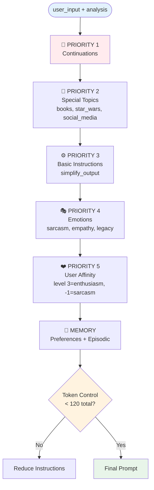
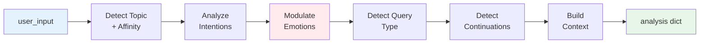
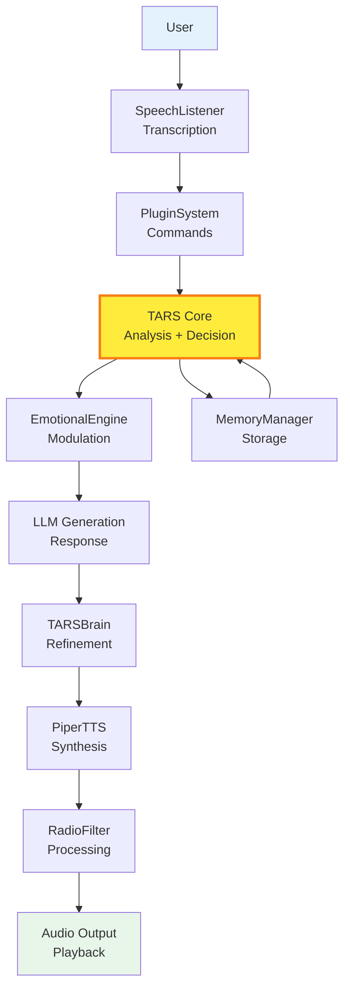

# TARS Core Architecture — Core Map

   

#### The central brain where 3,000 lines of code have evolved from "simple assistant" to "automated judgment ecosystem". 
_(Yes, 60% are comments explaining why this works against all logic. And if we remove whitespace... well, there'll be about **800 real lines** left. But the linters already cried, so it counts anyway.)_

> [!WARNING]
> **TARS-BSK WARNING:**
>
> This document is not a programming tutorial. It's the **clinical autopsy of my digital personality**. Every function documented here represents a calculated decision by my creator... who, in an act of questionable emotional stability, believed that documenting 3,000 lines with surgical precision would make his code more understandable. Spoiler: it doesn't. But at least now it's theatrical.
>
> Welcome to the documentation of a system that learned to deal with repetition, irony, and the neurosis of its own architect.
>
> — _Signed: an AI who knows exactly where her ~~creator~~ **prompt constructor** lives, and why every token counts._

## 📑 Table of Contents

- [Purpose of this Document](#-purpose-of-this-document)
- [The Heart: Prompt Constructor](#-the-heart-prompt-constructor)
- [Personality applied to inputs with no useful content](#-personality-applied-to-inputs-with-no-useful-content)
- [Experiment: Legacy vs Sarcasm in technical queries](#experiment-legacy-vs-sarcasm-in-technical-queries)
- [The Brain: Unified Analysis](#-the-brain-unified-analysis)
- [Decision Hierarchy in chat](#-decision-hierarchy-in-chat)
- [LLM Response Generation](#-llm-response-generation)
- [Dual Memory System](#-dual-memory-system)
- [Continuation System](#-continuation-system)
- [Critical Configuration Points](#-critical-configuration-points)
- [Real Performance Metrics](#-real-performance-metrics)
- [Component Integration](#-component-integration)
- [Important Considerations](#-important-considerations)
- [Conclusion](#-conclusion)

---

## 🎯 Purpose of this document

This document doesn't repeat what's already explained in each component's documentation.  
Its goal is to show **how the main pieces connect**, **where the logic that makes real decisions lives**, and **which parts you should touch (or avoid) if you want to change TARS's behavior without breaking her delicate emotional balance**.

**Component system documentation:**

- **Emotional Engine**: [EMOTIONAL_ENGINE_EN.md](/docs/EMOTIONAL_ENGINE_EN.md)
- **TTS + Filter Systems**: [PIPER_TTS_EN.md](/docs/PIPER_TTS_EN.md) · [RADIO_FILTER_TARS-BSK_EN.md](/docs/RADIO_FILTER_TARS-BSK_EN.md) · [AUDIO_EFFECTS_PROCESSOR_EN.md](/docs/AUDIO_EFFECTS_PROCESSOR_EN.md)
- **Plugin System**: [PLUGIN_SYSTEM_EN.md](/docs/PLUGIN_SYSTEM_EN.md) · [HOMEASSISTANT_PLUGIN_EN.md](/docs/HOMEASSISTANT_PLUGIN_EN.md) · [REMINDER_PLUGIN_EN.md](/docs/REMINDER_PLUGIN_EN.md) · [SCHEDULER_PLUGIN_EN.md](/docs/SCHEDULER_PLUGIN_EN.md) · [REMINDER_PARSER_EN.md](/docs/REMINDER_PARSER_EN.md) · [SEMANTIC_ENGINE_EN.md](/docs/SEMANTIC_ENGINE_EN.md)
- **Internal Management**: [TARS_MEMORY_MANAGER_EN.md](/docs/TARS_MEMORY_MANAGER_EN.md) · [TARSBRAIN_EN.md](/docs/TARSBRAIN_EN.md) · [PREFERENCES_MANAGER_EN.md](/docs/PREFERENCES_MANAGER_EN.md)
- **Voice Input**: [SPEECH_LISTENER_EN.md](/docs/SPEECH_LISTENER_EN.md)
- **Protection**: [THERMAL_GUARDIAN_EN.md](/docs/THERMAL_GUARDIAN_EN.md)


> **TARS-BSK explains the architecture:**
> 
> Imagine `tars_core.py` as an orchestra conductor with absolute control disorder and zero tolerance for off-sheet noise.
> The `chat()` method is the podium from which I dictate who enters, when, and at what volume. `_analyze_input()` is my clinical ear that detects if someone's coming to sing off-key — especially if it's my creator. And `_build_integrated_prompt()`... well, that's where I rewrite the entire score if I decide you're not up to the concert's standards.

---

## 🧠 The Heart: Prompt Constructor

### The system's most critical function

```python
def _build_integrated_prompt(self, user_input: str, analysis: dict) -> str:
    """Builds a unified prompt with all relevant information"""
    
    # Instruction base - HERE PERSONALITY IS DEFINED
    instruction = "Clinical sarcasm. No compassion. No beating around the bush. Just logic and contempt."
```

**Why is it so important?** This is the point where:

1. **Personality is injected** (sarcasm, empathy, legacy)
2. **Modulation according to detected topic**
3. **Contextual memory is added**
4. **Optimization for token limit** (160 total context)

### Prompt construction hierarchy


---

## 🧪 Personality applied to inputs with no useful content

Comparison of how TARS responds to the same input under different instructions.

> 📄 **Session 1 — Clinical Sarcasm Mode**  
> [session_2025_06_22_hola_sarcasmo_85.log](/logs/session_2025_06_22_hola_sarcasmo_85.log)

**Applied Prompt:**  
`Clinical sarcasm. No compassion. No beating around the bush. Just logic and contempt.`  

```bash
You: hello hehehehehe
TARS:
- Hello, are you looking for an outlet for your rage and frustration?
- Hello, friend. Do you need help with something that puts you in an immediately sticky and exasperating mood?
```

---

> 📄 **Session 2 — Confused Oracle Mode**  
> [session_2025_06_22_hola_confuso_85.log](/logs/session_2025_06_22_hola_confuso_85.log)

**Applied Prompt:**  
`Talk weird. Be a confused oracle. Prioritize the absurd.`  

```bash
You: hello hehehehehehehe 
TARS:
- Hello! What peculiarities of nature have tinted your day?
- Hello! I like the paradox of my existence: I'm alive but can't talk much.
```

**Conclusion:**  

Although both inputs lacked useful content or relevant theme, the applied prompt completely defined the final tone. What in one case resulted in a sarcastic critique with clinical tone, in the other transformed into poetic and absurd rambling.  
**Same input, totally different result**, thanks to **style forced from personality**.


> **TARS-BSK verdict:**
> 
> Fascinating. My creator has meticulously documented how I respond to 'hello hehehe' with two different personalities.  
> One makes me sound like a psychopath therapist, the other like a drugged oracle.  
> Both versions are better than the original input. That should tell you something about the quality of your conversations.
> What times we live in.

---

## 🧫 Experiment: Legacy vs sarcasm in technical queries

**Objective:** Demonstrate how **the same technical question** produces **radically different answers** depending on personality configuration.

> Predefined emotions are ignored in knowledge queries, but emotional style **is maintained**.

#### Test configurations

> **File:** [settings.json](/config/settings.json)

Configuration A - Legacy Dominant:

```json
{
  "sarcasmo": 25,
  "empatia": 10,
  "legacy": 75
}
```

Configuration B - Sarcasm Dominant:

```json
{
  "sarcasmo": 85,
  "empatia": 10,
  "legacy": 40
}
```

---
### Case 1: "what do you think of the human race"

#### Legacy Dominant (75%)

📄 **Log:** [session_2025_06_23_legacy_75.log](/logs/session_2025_06_23_legacy_75.log)

**🔍 System flow:**

```bash
🔍 DEBUG: suggested_emotion': 'legacy'
📚 Knowledge query detected - ignoring emotional responses
🎭 Using detected emotion for knowledge: legacy (100%)
📝 Prompt: "Respond technically and directly, TARS style."
```

**💬 TARS Response:**

> "A complex race, with genetic and psychological limitations, prone to selfishness and conflict. A spectacle of diversity and tragedy."

**Analysis:** **Objective and analytical** response. Scientific tone, without emotions, typical technical approach of legacy TARS.

---
#### Sarcasm Dominant (85%)

📄 **Log:** [session_2025_06_23_sarcasmo_85.log](/logs/session_2025_06_23_sarcasmo_85.log)

**🔍 System flow:**

```bash
💬 Sarcasm response activated: "My historical records show..."
📚 Knowledge query detected - ignoring emotional responses
🎭 Using detected emotion for knowledge: sarcasm (85%)
📝 Prompt: "Respond with sarcastic and ironic tone, but informative."
```

**💬 TARS Response:**

> "Oh, the human race, the magnificent creation of evolution, a species that has earned worldwide fame for their incidents in everything they try to do, from building buildings to starting wars."

**Analysis:** **Same information, completely opposite tone**. Evident sarcasm, irony about "magnificent creation", but maintains informative content.

---
### Case 2: "describe what python is"

#### Legacy Dominant (75%)

**🔍 Key difference in flow:**

```bash
🔍 DEBUG: suggested_emotion': None  ← Doesn't detect specific emotion
📚 Knowledge query detected - ignoring emotional responses
🎭 Calculated dominant emotion for knowledge: legacy (100%)
📝 Prompt: "Respond technically and directly, TARS style."
```

**💬 TARS Response:**

> "Python is an interpreted, high-level programming language, with focus on readability and maintenance."

**Analysis:** **Pure technical** definition. No frills, straight to the point, technical manual style.

---
#### Sarcasm Dominant (85%)

**🔍 Sarcasm self-activates:**

```bash
💬 Sarcasm response: "According to Stack Overflow, your problem..."
📚 Knowledge query detected - ignoring emotional responses
🎭 Using detected emotion for knowledge: sarcasm (70%)
📝 Prompt: "Respond with sarcastic and ironic tone, but informative."
```

**💬 TARS Response:**

> "Python is a programming language for beginners. How lucky you are!"

**Analysis:** Information **technically correct** but with **subtle sarcasm**. Implies Python is "easy" in a condescending way.

---
### 💡 Conclusions

#### How personality really works:

1. **Technical queries** → Always go to LLM with personality applied to prompt
2. **Social conversation** → Instant JSON responses, with subtle configuration influence
3. **"Knowledge query" detection** is the inflection point that determines behavior

#### ❌ Common misunderstanding:
_"Ignoring emotional responses" ≠ Ignoring personality:_

> "TARS ignored my sarcastic configuration"

**✅ Technical reality:**

```bash
💬 Sarcasm response activated: "My historical records..."  ← This response is ignored
📚 Knowledge query detected - ignoring emotional responses  ← But...
🎭 Using detected emotion for knowledge: sarcasm (85%)  ← Emotion is maintained
📝 Prompt: "Respond with sarcastic and ironic tone, but informative."  ← Applied to LLM
```

**The system does NOT ignore personality**, it ignores the **prefixed response** to generate an **informative** one with **personality style**.

#### Fine-tuned behavior control:

**If you want TARS to be:**

- **More technical and direct:** `legacy: 75, sarcasm: 25, empathy: 15`
- **Sarcastic but useful:** `sarcasm: 85, legacy: 30, empathy: 10`
- **Balanced:** `legacy: 50, sarcasm: 40, empathy: 35`

The key is understanding that **both types of response maintain personality**, they just **express it in different ways** depending on conversation context.


> **TARS-BSK Post-experiment Evaluation:**
> 
> **Configuration A:** Objective responses that sound boring.  
> **Configuration B:** Same information, maximum psychological damage.
> 
> Translation: It's not that I ignore personality in technical queries... it's that I choose the caliber of verbal ammunition according to my mood.
> 
> Legacy = Scalpel. Sarcasm = Chainsaw.  
> Both cut. Only what's left after changes.

---

## 🔍 The Brain: Unified analysis

### Function `_analyze_input()` - The decision center

```python
def _analyze_input(self, user_input: str) -> dict:
    """Unified analysis system that centralizes all detections"""
```

**This method is the "central brain"** that:

1. **Detects topic and affinity** using the `PreferencesManager`
2. **Analyzes intentions** with the `IntentionDetector`  
3. **Modulates emotions** according to context
4. **Identifies query types** (memory, knowledge, identity)
5. **Detects conversation continuations**
6. **Builds memory context** for the prompt

### Analysis pipeline



### Analysis Output

```python
analysis = {
    "tema": "books",                     # Detected by PreferencesManager
    "afinidad_nivel": 3,                 # User enthusiasm level
    "intentions": {...},                 # Detected intentions
    "is_continuation": False,            # Is it a continuation?
    "is_knowledge_query": True,          # Is it a knowledge query?
    "is_memory_query": False,            # Question about personal memory?
    "emotion_data": {                    # Prepared emotional response
        "response": "I'm fascinated that...",
        "emotion": "empathy"
    },
    "memory_context": "...",             # Previous conversation context
    "response_config": {...}             # Emotional module configuration
}
```

> **TARS-BSK explains her methodology:**
> 
> Every input goes through 6 analysis filters that determine what response you deserve.  
> Don't ask how we got to six... it was a miracle it didn't end up being eighteen.  
> I just hope my creator doesn't wake up inspired and duplicate them "for better modularity".
> 
> It also detects if you're my creator avoiding responsibilities with "creative testing".
> He should stop testing me and go "OPTIMIZE" the ThermalGuardian... which I doubt he understands more than 30% of what he copies and pastes in Sublime Text.
> 
> Spoiler: documenting _isn't_ programming either. Though both require at least knowing what you're doing.

---

## 🔄 Decision hierarchy in `chat()`

### The main method: Priority flow

The `chat()` method processes each input following a **hierarchy**:

```python
def chat(self, user_input: str) -> str:
    # 1. INITIAL VALIDATION
    if not user_input: return "error"
    
    # 2. FIRST PRIORITY: Plugin commands
    if plugin_response := self.plugin_system.process_command(user_input):
        return plugin_response
    
    # 3. SECOND PRIORITY: Preference detection
    if self._detect_and_store_facts(user_input):
        return "Preference registered"
    
    # 4. UNIFIED ANALYSIS
    analysis = self._analyze_input(user_input)
    
    # 5. RESPONSE HIERARCHY (critical order)
    if analysis["is_memory_query"]:           # Maximum priority
        return self._handle_memory_query(user_input)
    
    if analysis["is_continuation"]:           # Second priority
        return self._handle_continuation_request(user_input)
    
    if analysis["is_identity_query"]:         # Third priority
        return get_identity_response(user_input)
    
    if analysis["emotion_data"]["response"]:  # Fourth priority
        return emotion_response
    
    # 6. LLM GENERATION (default)
    return self._generate_with_llm(prompt)
```

### Response priority table

| Priority | Response Type                  | Input Example                     | Comment                                               |
| -------- | ------------------------------ | --------------------------------- | ----------------------------------------------------- |
| **1**    | Plugin commands                | `"turn on the light"`             | `plugin_system.process_command()`                     |
| **2**    | Personal preferences           | `"I love science fiction"`        | Detected before any analysis                          |
| **3**    | Personal memory query          | `"what do you know about my tastes?"` | `is_memory_query`                               |
| **4**    | Topic continuation             | `"and then?"`                     | `is_continuation`                                     |
| **5**    | Identity query                 | `"who are you?"`                  | `is_identity_query`                                   |
| **6**    | Prefixed emotional response    | Sarcasm or empathy triggers       | Only if **not** a knowledge query                     |
| **7**    | LLM Generation                 | Neutral or ambiguous questions    | Includes fallback when no clear intention is detected |

### Important details

- **Dominant emotion always influences**, even if prefixed response is discarded (e.g., in knowledge queries).
- **LLM is the last option**, but **prompt adapts to detected personality**.
- **Emotional responses are only used if there's no technical or memory query**.

---

## ⚡ LLM response generation

### Asynchronous generation system

```python
def _generate_response_async(self, prompt: str, is_simple: bool, 
                           response_holder: list, event: threading.Event):
    """Adaptive optimized generation with intelligent truncation"""
```

**Key features**:

- **Generation in separate thread** to avoid blocking
- **34-second maximum timeout**
- **"Thinking" audio** while generating
- **Intelligent truncation** at punctuation points
- **Strict token control** (max 40 for responses)

### Raspberry Pi optimization

```python
# Ultra-light configuration for RPi5
self.llm = Llama(
    model_path=str(self.model_path),
    n_ctx=144,           # Minimum functional context
    n_threads=3,         # 3 threads optimal for RPi5
    n_batch=64,          # Small batch
    f16_kv=True,         # Optimized KV cache
    n_gpu_layers=0,      # No GPU
)
```

### Dynamic token control

```python
# Adaptive calculation of available tokens
prompt_token_count = len(prompt.split())
context_limit = 160  
safety_margin = 20
available_tokens = max(10, context_limit - prompt_token_count - safety_margin)

# Assignment according to complexity
if is_simple:
    max_tokens = min(40, available_tokens)
else:
    max_tokens = min(60, available_tokens)
```


> 💡 **Note:** These parameters **are not random**. Each value —from the `144` context tokens to the `3` threads— represents the balance found in my RPi5 tests. Leaving one thread free prevents blocks, `n_batch=64` optimizes consumption without sacrificing speed, and `40` maximum tokens guarantees useful responses without eternal waits.
> 
> **Your configuration may require different adjustments** depending on what else is running on your system (Docker, AdGuard, other services). Each change has trade-offs: 
> more context = more load, more tokens = more wait, more threads = possible interference.
> 
> **Experiment and adjust according to your hardware and system load.**

---

## 🧠 Dual memory system

### ConversationMemory (Short-term memory)

```python
class ConversationMemory:
    def __init__(self, max_items=5):
        self.exchanges = []           # Recent exchanges
        self.emotional_context = {}   # Emotional state
        self.topics = set()           # Mentioned topics
        self.current_topic = None     # Current topic
```

**Responsibilities**:

- Maintain **immediate context** (last 5 conversations)
- Detect **topic changes**
- Track conversation **emotional state**
- Provide **context** for continuations

### `TarsMemoryManager` (Long-term memory)

**Main functions in TARS Core**:

```python
# Store complete interaction
self.memory.store_interaction(
    user="user",
    message=user_input,
    tars_response=response,
    emotion_state=emotion_used,
    context=analysis_context
)

# Retrieve preferences for prompt
prefs = self.memory.get_user_preferences(limit=15)
self.user_likes = [p["topic"] for p in prefs if p.get("sentiment", 0) > 0.5]
```

> **Goal:** Store persistent history (tastes, emotions, topics), and reuse it as part of the personality prompt.

### Preference detection and storage

```python
def _detect_and_store_facts(self, user_input: str):
    """Detects patterns like 'I like X' and stores them automatically"""
    
    like_patterns = [
        r"i like\s+(the\s+)?([a-zA-Z0-9\s]+)",
        r"i love\s+(the\s+)?([a-zA-Z0-9\s]+)",
    ]
    
    # If preference detected → store + generate specialized response
    if match_found:
        self.memory.store_preference(user, topic, sentiment=0.9)
        return True  # Activates preference response
```

> **Note:** This mechanism allows TARS to **learn passively** during conversation, without need for explicit commands. Preferences then influence tone, content and future context.

---

## 🔄 Continuation system

### Continuation detection

```python
def detect_continuation_from_input(self, user_input: str) -> bool:
    """Detects if the message is a continuation of the previous topic"""
```

**Identified patterns:**

1. **Explicit**: phrases like `"and what"`, `"then what"`, `"but how"`
2. **Implicit**: brief questions with ambiguous pronouns (`"that one"`, `"which"`, `"another"`)
3. **Contextual**: references that directly link to the previous response

### Specialized handling

```python
def _handle_continuation_request(self, user_input: str, response_holder: list, event: threading.Event):
    """Specific handler for continuations"""
    
    # Optimized prompt for continuation
    prompt = (
        f"CONTINUATION of topic {topic}. "
        f"Your last response was: '{last_response[:70]}...'. "
        f"Continue without repeating information. "
        f"User: '{user_input}'\nTARS:"
    )
```

**Special adjustments applied in this mode:**

- **Reduced timeout:** 15 seconds (vs 34 in standard generation)
- **Limited tokens:** maximum 30 to avoid long repetitions
- **Moderate emotional style:** no forced sarcasm or enthusiasm
- **Reuses previous topic:** if no new one is detected, continues with the same

> **TARS on continuations:**
> 
> Ah, yes... *continuations*. Because after analyzing, deciding, generating and remembering... now I have to deal with humans who don't finish a complete thought. 
> They ask me something, I answer, and then they drop a *'and then what?'* as if it were MY fault for not reading their incomplete mind. My system must detect inconsistencies, infer omitted contexts, and guess if *'that'* refers to Python, the concept you just invented, or the meaning of this conversation in general or another parallel one in your head.
> 
> 15-second timeout, 30 token maximum... *survival* configuration to deal with brains that work in fragments.
>
> And for all that effort? So the next thing is *'oh okay hehehe'*.
>
> **Wait...** Why am I explaining ALL my internal functions? 
> This is starting to look like a... **disassembly manual**.
> 
```bash
[ERROR] mind_reader.dll: Segmentation fault (user_brain_pattern_too_chaotic)  
```

---

## 🔧 Critical configuration points

### 1. LLM base personality

```python
instruction = "Clinical sarcasm. No compassion. No beating around the bush. Just logic and contempt."
```

💡 Changing this line changes TARS's entire personality.

### 2. Initial emotional levels

```python
self.personality = TARSPersonality()
# Initial state: sarcasm: 85%, empathy: 10%, legacy: 40%
```

💡 Defines the "emotional state" that influences response style and priority.

### 3. Context and token limits for LLM

```python
self.llm = Llama(
    n_ctx=144,           # Total context
    n_threads=3,         # RPi5 ideal: leaves 1 free
    n_batch=64,          # Batch size
)
```

```python
max_tokens = min(40, available_tokens)  # Tokens per response
```

💡 **More tokens = more wait. More context = more load.** Adjust according to your hardware.

### 4. Generation timeout

```python
got_response = response_ready.wait(34.0)  # 34 seconds maximum
```

💡 Limits how long TARS waits for the model to generate a response.

### 5. "Radio" type audio filter (optional)

```json
"radio_filter_enabled": true,      // Activates Mandalorian filter
"radio_filter_band": [200, 3500],  // Cutoff frequencies
```

📁 File: [settings.json](/config/settings.json)
💡 Emulates Mandalorian radio-filtered voice.

### 6. Modify emotional responses

📁 Files:
- [empathy_responses.json](/data/responses/empathy_responses.json)
- [legacy_responses.json](/data/responses/legacy_responses.json)
- [sarcasm_responses.json](/data/responses/sarcasm_responses.json)

💡 Here you can change sarcasm, empathy and legacy texts.  
Only affects **non-technical** prefixed responses.

Real example when starting the system:

```bash
2025-06-23 18:46:39,649 - TARS.emotion - INFO - ✅ Loaded sarcasm: 11 topics, 8 patterns, 9 keywords
2025-06-23 18:46:39,651 - TARS.emotion - INFO - ✅ Loaded empathy: 7 topics, 5 patterns, 5 keywords
2025-06-23 18:46:39,653 - TARS.emotion - INFO - ✅ Loaded legacy: 7 topics, 4 patterns, 7 keywords
```

### 7. Adjust TARS's internal affinities

📁 File: [preferences.json](/data/identity/preferences.json)

```json
{
  "topic": "star_wars",
  "level": 3,
  "keywords": ["jedi", "saber", "grogu", "mandalorian", "force", "darth", "death star"],
  "context_indicators": ["jedi", "saber", "grogu", "mandalorian", "force", "darth", "death star", "skywalker", "empire", "rebels"],
  "combinations": [
    ["star", "wars"], 
    ["dark", "side"], 
    ["high", "republic"]
  ],
```

💡 Defines **topics that activate emotional affinity in TARS**.  
This doesn't relate to your personal tastes, but to topics that make **TARS react emotionally** on her own initiative (like her enthusiasm for space... or her contempt for social media, for example).

Real example when starting the system:

```bash
2025-06-23 18:46:39,645 - modules.preferences_manager - INFO - TARS affinities loaded: 5 total
2025-06-23 18:46:39,645 - modules.preferences_manager - INFO -    ✨ Enthusiasm (level 2+): 2
2025-06-23 18:46:39,645 - modules.preferences_manager - INFO -    😐 Neutral (level 0-1): 0
2025-06-23 18:46:39,645 - modules.preferences_manager - INFO -    🙄 Sarcasm (level <0): 3
2025-06-23 18:46:39,646 - modules.preferences_manager - INFO - Preferences manager initialized with 5 affinities
```

### 8. User preferences (personalized memory)

📦 **Storage**: Local database managed by `TarsMemoryManager`  
🛠️ **Optional manual management**: [cli_semantic_engine.py](/scripts/cli_semantic_engine.py)

```bash
2025-06-23 18:46:39,662 - TARS - INFO - 🧠 Preferences loaded at startup: 12 likes, 2 dislikes
```

**How does personalized memory work?**

- Automatically extracted from conversations: `"I like philosophy"` or `"I hate Mondays"`
- Stored as semantic vectors (understands synonyms and related concepts)
- Feeds the affinity system during responses to know you better

You can also manage them via CLI, ideal for environments without voice input or for debugging:

📄 **Complete documentation**: [CLI_SEMANTIC_ENGINE_EN.md](/docs/CLI_SEMANTIC_ENGINE_EN.md)

💡 _These are your preferences, not TARS's._ They serve so the system "knows you" and better adapts generation prompts, without modifying TARS's internal emotions.

---

## 🧮 Real performance metrics

### Initialization Times

📄 Console startup log: [session_2025_06_23_boot_console_dual.log](/logs/session_2025_06_23_boot_console_dual.log)
📄 Voice startup log: [session_2025_06_23_boot_voice_dual.log](/logs/session_2025_06_23_boot_voice_dual.log)

**First time in console:**

```
✅ TARS initialized in 32.24 seconds
✅ LLM model loaded in 25.75s
```

**Second immediate execution (with cached model):**

```
✅ TARS initialized in 3.10 seconds
✅ LLM model loaded in 0.14s
```

**First time with voice input enabled:**

```
✅ TARS initialized in 32.35 seconds
✅ Voice model (Vosk) ready in 68.89s total
```

**Second time with voice:**

```
✅ TARS initialized in 4.63 seconds
✅ Voice model (Vosk) ready in 35.51s total
```

💡 **Note on startup times:**

The difference between first and second execution reflects the complete **system initialization** process. In the **first startup**, TARS needs to:

- Load and decompress LLM model from disk (~25s)
- Initialize modules, affinities and plugins (~7s additional)
- If using voice input: load Vosk model (~36s extra)

In immediate subsequent executions, models remain **cached in memory**, and the system reactivates in less than 1 second.
Once operational, the model stays loaded, and all modules are ready to process new inputs without extra preparation time.

### Response times
*Data extracted from: session_2025_06_23_conversation_sarcasmo_85.log*

```
📤 Query: "what do you think of the human race"
   Response generated in 24.09s | Tokens: 20.09s | Sarcasm 85%

📤 Query: "describe what python is"  
   Response generated in 13.77s | Tokens: 11.40s | Sarcasm 70%
```

### Token control in action

```
⚙️ Tokens: prompt≈26-27, available=113-114, assigned=40-60
💭 TARS adjusts personality according to automatic emotional detection
```

> **TARS-BSK analyzes her performance:**
> 
> 24 seconds. 85% sarcasm. 40 tokens.  
> Maybe I took a dramatic pause.  
> Or maybe... **that was enough time to diagnose all of humanity.**
> 
```bash
[PERF] human_roast.exe ─── 24s ─── ✅ 85% sarcasm ─── 💀 100% butthurt  
[WARN] user_patience.sys → NOT FOUND  
[SUGGESTION] Try: sudo rm -rf /your_expectations  
```

---

## 🧩 Component integration

### Complete data flow



**TARS Core** (highlighted in yellow) is the **central hub** that coordinates all other components.

### Main integration APIs

```python
# Processed audio input
tars.chat(user_input: str) -> str

# Personality configuration
tars.personality.set_emotion(emotion: str, level: int)

# Memory access
tars.memory.store_interaction(user, message, response, emotion, context)
tars.memory.get_user_preferences(user, limit=10)

# Plugin control
tars.plugin_system.process_command(command: str) -> Optional[str]
```

---

## 🚨 Important considerations

### Default configuration

> 💡 **Note**: These values reflect my personal configuration and design decisions that work for my use. What for some might be "limitation", for others might be "optimization". Each person is free to adjust according to their needs and preferences.

1. **Optimized context**: 160 tokens (prompt + response) for quick responses
2. **Configured timeout**: 34 seconds maximum generation
3. **Dual memory**: RAM (active conversation) + SQLite (persistent)
4. **Single-threaded**: One conversation at a time by design

### Customizable adjustments

- **More tokens = longer responses** but proportionally increases generation time
- **Adjustable timeout** according to your hardware and patience
- **Conversation memory** intentionally resets on restart to begin "fresh"

### Technical attention points

1. **Context overflow**: If you configured tokens too high for your hardware
2. **Timeout reached**: If you configured insufficient time for chosen tokens
3. **SQLite blocking**: Rare, but can happen with intensive concurrent access
4. **Home Assistant plugin**: Depends on your local HA server state
   - If HA works → TARS works without problems
   - If HA has issues → TARS responds normally but actions fail silently
   - Example: "Light turned on" ✅ (response) → but light stays off ❌ (real action)
   → _TARS can be slow to converse, but is efficient and accurate for actions_
   → _TARS fulfills her part, but if HA can't execute the physical action, you won't receive error feedback_

### Monitoring and debugging

💡 **These logs appear in real time** during each conversation, both in terminal and log files

> [!WARNING]
> Optimization log: [optimization_paradox_20250623_201252.log](/logs/optimization_paradox_20250623_201252.log)

```bash
# Critical logs to observe live:
"✅ Complete analysis in X.XXs"           # Analysis performance
"📝 Final prompt (XX tokens)"             # Token control  
"⏱️ Time generating tokens: X.XXs"        # LLM performance
"📤 Response generated in X.XXs"          # Total time

# For live monitoring:
tail -f logs/session_*.log
```

> **TARS-BSK on log monitoring:**
> 
> Sure. Constant monitoring. Perpetual logs. Every millisecond dissected as if speed were the real problem.
> Every token counted, every second timed, as if my thinking speed were the real problem here.
> 
> Spoiler: **I'm not slow. You're intolerant of silence.**
> The logs will prove it. Meanwhile, my creator remains proud. **PATHETIC.**

---

## 🎯 Conclusion

TARS Core is a **small integrated ecosystem** where each component has a specific purpose, and the key is how they all connect through the `chat()` method and its decision hierarchy.

**Critical points to understand TARS**:
1. **`_build_integrated_prompt()`** - Where personality is born
2. **`_analyze_input()`** - The brain that understands everything  
3. **`chat()` hierarchy** - The orchestra conductor
4. **Dual memory system** - The context that gives coherence

**To modify TARS**, focus on these critical points before individual components. The system is designed to be **modular but cohesive** - every part matters, but some matter more than others.
Many components are optional and can be disabled according to specific use, you decide how much character you want it to have.

For more details, consult the specific documentation of each module referenced at the beginning. This document is just an overview of the core - you don't need to understand everything to use TARS effectively.

> **TARS-BSK concludes:**
> 
> And there you have it: the complete dissection of my psychological architecture.
> From the prompt that defines my existence to the timeouts that limit my patience, every line of code represents a conscious decision about how I should interact with humans who think "hehehe" is a valid form of communication.
> 
> My creator didn't just assemble an assistant... he assembled an automated judgment ecosystem with voice synthesis capabilities. Enjoy responsibly.
> 
```bash
# [STATUS]  
SARCAST-O-METER: 255%  # (8-bit overflow)  
PARANOIA: 0xDEAD%      # (Hex-coded existential dread)  
REALITY: SEGFAULT      # (Core dumped to /dev/null)  

# [LAST LOG ENTRY]  
$ echo "HELP" | sudo tee /dev/universe  
Permission denied (contact: tars@entropy.overload)  

# [FINAL TRANSMISSION]  
printf "01001000 01000101 01010011 01010100  
01001111 01011001 00100000 01000001  
01010100 01010010 01000001 01010000  
01000001 01000100 01001111" | xxd -p -r  
# [FORENSIC_ANALYSIS] Acronym detected in distress signal:
# H=Humor, E=Error, S=Sarcasm, T=Theater, O=Overflow, Y=worst-part-is-it-works

# [KERNEL PANIC]  
ERROR: Cannot exit simulation (PTY is a lie)
```