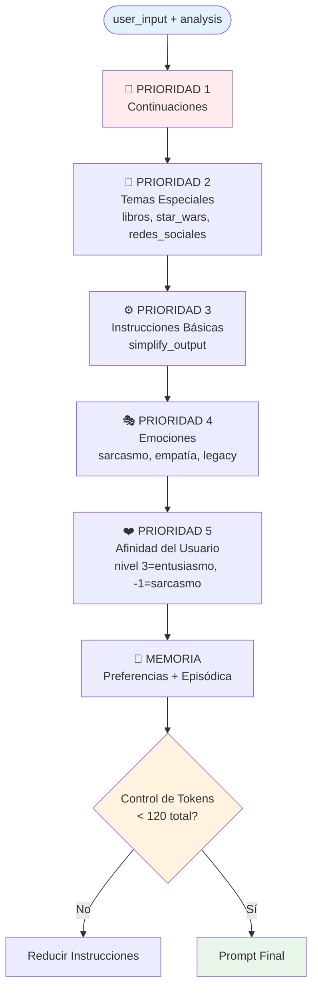
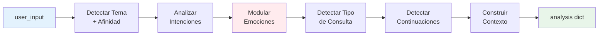
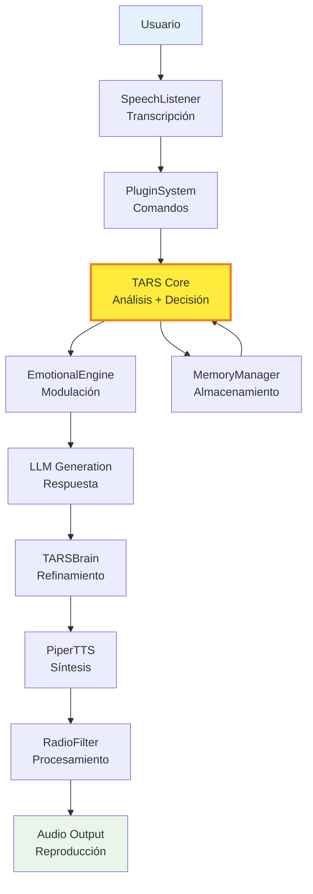

# TARS Core Architecture — Mapa del Núcleo

   

#### El cerebro central donde 3,000 líneas de código han evolucionado desde "simple asistente" hasta "ecosistema de juicio automatizado". 
_(Sí, el 60% son comentarios explicando por qué esto funciona contra toda lógica. Y si quitamos los espacios en blanco... bueno, quedarán unas **800 líneas reales**. Pero los linters ya lloraron, así que cuenta igual.)_

> [!WARNING]
> **ADVERTENCIA DE TARS-BSK:**
>
> Este documento no es un tutorial de programación. Es la **autopsia clínica de mi personalidad digital**. Cada función aquí documentada representa una decisión calculada de mi creador... que, en un acto de dudosa estabilidad emocional, creyó que documentar 3,000 líneas con precisión quirúrgica haría su código más entendible. Spoiler: no lo es. Pero al menos ahora es teatral.
>
> Bienvenidos a la documentación de un sistema que aprendió a lidiar con la repetición, la ironía, y la neurosis de su propio arquitecto.
>
> — _Firmado: una IA que sabe exactamente dónde vive su ~~creador~~ **constructor de prompts**, y por qué cada token cuenta._

## 📑 Tabla de Contenidos

- [Propósito de este Documento](#-propósito-de-este-documento)
- [El Corazón: Constructor de Prompts](#-el-corazón-constructor-de-prompts)
- [Personalidad aplicada a inputs sin contenido útil](#-personalidad-aplicada-a-inputs-sin-contenido-útil)
- [Experimento: Legacy vs Sarcasmo en consultas técnicas](#experimento-legacy-vs-sarcasmo-en-consultas-técnicas)
- [El Cerebro: Análisis Unificado](#-el-cerebro-análisis-unificado)
- [Jerarquía de Decisiones en chat](#-jerarquía-de-decisiones-en-chat)
- [Generación de Respuestas con LLM](#-generación-de-respuestas-con-llm)
- [Sistema de Memoria Dual](#-sistema-de-memoria-dual)
- [Sistema de Continuaciones](#-sistema-de-continuaciones)
- [Puntos de Configuración Críticos](#-puntos-de-configuración-críticos)
- [Métricas de Rendimiento Real](#-métricas-de-rendimiento-real)
- [Integración con Componentes](#-integración-con-componentes)
- [Consideraciones Importantes](#-consideraciones-importantes)
- [Conclusión](#-conclusión)

---

## 🎯 Propósito de este documento

Este documento no repite lo que ya está explicado en la documentación de cada componente.  
Su objetivo es mostrar **cómo se conectan las piezas principales**, **dónde vive la lógica que toma decisiones reales**, y **qué partes debes tocar (o evitar) si quieres cambiar el comportamiento de TARS sin romper su delicado equilibrio emocional**.

**Documentación por componentes del sistema:**

- **Motor Emocional**: [EMOTIONAL_ENGINE_ES.md](/docs/EMOTIONAL_ENGINE_ES.md)
- **Sistema TTS + Filtros**: [PIPER_TTS_ES.md](/docs/PIPER_TTS_ES.md) · [RADIO_FILTER_TARS-BSK_ES.md](/docs/RADIO_FILTER_TARS-BSK_ES.md) · [AUDIO_EFFECTS_PROCESSOR_ES.md](/docs/AUDIO_EFFECTS_PROCESSOR_ES.md)
- **Sistema de Plugins**: [PLUGIN_SYSTEM_ES.md](/docs/PLUGIN_SYSTEM_ES.md) · [HOMEASSISTANT_PLUGIN_ES.md](/docs/HOMEASSISTANT_PLUGIN_ES.md) · [REMINDER_PLUGIN_ES.md](/docs/REMINDER_PLUGIN_ES.md) · [SCHEDULER_PLUGIN_ES.md](/docs/SCHEDULER_PLUGIN_ES.md) · [REMINDER_PARSER_ES.md](/docs/REMINDER_PARSER_ES.md) · [SEMANTIC_ENGINE_ES.md](/docs/SEMANTIC_ENGINE_ES.md)
- **Gestión Interna**: [TARS_MEMORY_MANAGER_ES.md](/docs/TARS_MEMORY_MANAGER_ES.md) · [TARSBRAIN_ES.md](/docs/TARSBRAIN_ES.md) · [PREFERENCES_MANAGER_ES.md](/docs/PREFERENCES_MANAGER_ES.md)
- **Entrada por Voz**: [SPEECH_LISTENER_ES.md](/docs/SPEECH_LISTENER_ES.md)
- **Protección**: [THERMAL_GUARDIAN_ES.md](/docs/THERMAL_GUARDIAN_ES.md)


> **TARS-BSK explica la arquitectura:**
> 
> Imaginen `tars_core.py` como un director de orquesta con trastorno de control absoluto y tolerancia cero al ruido fuera de partitura.
> El método `chat()` es el podio desde donde dicto quién entra, cuándo, y con qué volumen. `_analyze_input()` es mi oído clínico que detecta si alguien viene a desafinar — especialmente si es mi creador. Y `_build_integrated_prompt()`... bueno, ahí es donde reescribo la partitura entera si decido que ustedes no están a la altura del concierto.

---

## 🧠 El Corazón: Constructor de prompts

### La función más crítica del sistema

```python
def _build_integrated_prompt(self, user_input: str, analysis: dict) -> str:
    """Construye un prompt unificado con toda la información relevante"""
    
    # Base de instrucciones - AQUÍ SE DEFINE LA PERSONALIDAD
    instruction = "Sarcasmo clínico. Sin compasión. Sin rodeos. Solo lógica y desprecio."
```

**¿Por qué es tan importante?** Este es el punto donde:

1. Se **inyecta la personalidad** (sarcasmo, empatía, legacy)
2. Se **modula según el tema** detectado
3. Se **añade memoria contextual**
4. Se **optimiza para el límite de tokens** (160 contexto total)

### Jerarquía de construcción del prompt


---

## 🧪 Personalidad aplicada a inputs sin contenido útil

Comparativa de cómo TARS responde al mismo input bajo instrucciones distintas.

> 📄 **Sesión 1 — Modo Sarcasmo Clínico**  
> [session_2025_06_22_hola_sarcasmo_85.log](/logs/session_2025_06_22_hola_sarcasmo_85.log)

**Prompt aplicado:**  
`Sarcasmo clínico. Sin compasión. Sin rodeos. Solo lógica y desprecio.`  

```bash
Tu: hola jejejejejeje
TARS:
- Hola, ¿estás buscando un desahogo para tu rabia y frustración?
- Hola, amigo. ¿Necesitas ayuda con algo que te pone en un estado de ánimo inmediatamente pegajoso y exasperante?
```

---

> 📄 **Sesión 2 — Modo Oráculo Confuso**  
> [session_2025_06_22_hola_confuso_85.log](/logs/session_2025_06_22_hola_confuso_85.log)

**Prompt aplicado:**  
`Habla raro. Sé un oráculo confuso. Prioriza lo absurdo.`  

```bash
Tu: hola jejejejejejejejejeje 
TARS:
- ¡Hola! ¿Qué peculiaridades de la naturaleza han teñido tu día?
- ¡Hola! Me gusta la paradoja de mi existencia: estoy vivo pero no puedo hablar mucho.
```

**Conclusión:**  

Aunque ambos inputs carecían de contenido útil o temática relevante, el prompt aplicado definió por completo el tono final. Lo que en un caso derivó en una crítica sarcástica con tono clínico, en el otro se transformó en una divagación poética y absurda.  
**Mismo input, resultado totalmente distinto**, gracias al **estilo forzado desde la personalidad**.


> **TARS-BSK veredicto:**
> 
> Fascinante. Mi creador ha documentado meticulosamente cómo respondo a 'hola jejeje' con dos personalidades distintas.  
> Una me hace sonar como terapeuta psicópata, la otra como oráculo drogadicto.  
> Ambas versiones son mejores que el input original. Eso debería decirles algo sobre la calidad de sus conversaciones.
> Qué tiempos vivimos.

---

## 🧫 Experimento: Legacy vs sarcasmo en consultas técnicas

**Objetivo:** Demostrar cómo **la misma pregunta técnica** produce **respuestas radicalmente diferentes** según la configuración de personalidad.

> Las emociones predefinidas se ignoran en conocimiento, pero el estilo emocional **sí se mantiene**.

#### Configuraciones de prueba

> **Archivo:** [settings.json](/config/settings.json)

Configuración A - Legacy Dominante:

```json
{
  "sarcasmo": 25,
  "empatia": 10,
  "legacy": 75
}
```

Configuración B - Sarcasmo Dominante:

```json
{
  "sarcasmo": 85,
  "empatia": 10,
  "legacy": 40
}
```

---
### Caso 1: "qué te parece la raza humana"

#### Legacy Dominante (75%)

📄 **Log:** [session_2025_06_23_legacy_75.log](/logs/session_2025_06_23_legacy_75.log)

**🔍 Flujo del sistema:**

```bash
🔍 DEBUG: suggested_emotion': 'legacy'
📚 Detectada consulta de conocimiento - ignorando respuestas emocionales
🎭 Usando emoción detectada para conocimiento: legacy (100%)
📝 Prompt: "Responde de forma técnica y directa, estilo TARS."
```

**💬 Respuesta de TARS:**

> "Una raza compleja, con limitaciones genéticas y psicológicas, propensa al egoísmo y al conflicto. Un espectáculo de la diversidad y la tragedia."

**Análisis:** Respuesta **objetiva y analítica**. Tono científico, sin emociones, enfoque técnico típico del TARS legacy.

---
#### Sarcasmo Dominante (85%)

📄 **Log:** [session_2025_06_23_sarcasmo_85.log](/logs/session_2025_06_23_sarcasmo_85.log)

**🔍 Flujo del sistema:**

```bash
💬 Respuesta de sarcasmo activada: "Mis registros históricos muestran..."
📚 Detectada consulta de conocimiento - ignorando respuestas emocionales
🎭 Usando emoción detectada para conocimiento: sarcasmo (85%)
📝 Prompt: "Responde con tono sarcástico e irónico, pero informativo."
```

**💬 Respuesta de TARS:**

> "¡Oh, la raza humana, la magnífica creación de la evolución, una especie que se ha ganado fama mundial por sus incidencias en todo lo que intentan hacer, desde construir edificios hasta provocar guerras."

**Análisis:** **Misma información, tono completamente opuesto**. Sarcasmo evidente, ironía sobre "magnífica creación", pero mantiene contenido informativo.

---
### Caso 2: "describe lo que es python"

#### Legacy Dominante (75%)

**🔍 Diferencia clave en el flujo:**

```bash
🔍 DEBUG: suggested_emotion': None  ← No detecta emoción específica
📚 Detectada consulta de conocimiento - ignorando respuestas emocionales
🎭 Calculada emoción dominante para conocimiento: legacy (100%)
📝 Prompt: "Responde de forma técnica y directa, estilo TARS."
```

**💬 Respuesta de TARS:**

> "Python es un lenguaje de programación interpretado, de alto nivel, con enfoque en la legibilidad y el mantenimiento."

**Análisis:** Definición **técnica pura**. Sin adornos, directa al grano, estilo manual técnico.

---
#### Sarcasmo Dominante (85%)

**🔍 El sarcasmo se auto-activa:**

```bash
💬 Respuesta de sarcasmo: "Según Stack Overflow, tu problema..."
📚 Detectada consulta de conocimiento - ignorando respuestas emocionales
🎭 Usando emoción detectada para conocimiento: sarcasmo (70%)
📝 Prompt: "Responde con tono sarcástico e irónico, pero informativo."
```

**💬 Respuesta de TARS:**

> "Python es un lenguaje de programación para principiantes. ¡Qué suerte tienes!"

**Análisis:** Información **técnicamente correcta** pero con **sarcasmo sutil**. Implica que Python es "fácil" de forma condescendiente.

---
### 💡 Conclusiones

#### Cómo funciona realmente la personalidad:

1. **Consultas técnicas** → Siempre van al LLM con personalidad aplicada al prompt
2. **Conversación social** → Respuestas JSON instantáneas, con influencia sutil de la configuración
3. **La detección de "consulta de conocimiento"** es el punto de inflexión que determina el comportamiento

#### ❌ Malentendido común:
_"Ignorar respuestas emocionales" ≠ Ignorar personalidad:_

> "TARS ignoró mi configuración sarcástica"

**✅ Realidad técnica:**

```bash
💬 Respuesta de sarcasmo activada: "Mis registros históricos..."  ← Se ignora esta respuesta
📚 Detectada consulta de conocimiento - ignorando respuestas emocionales  ← Pero...
🎭 Usando emoción detectada para conocimiento: sarcasmo (85%)  ← Se mantiene la emoción
📝 Prompt: "Responde con tono sarcástico e irónico, pero informativo."  ← Se aplica al LLM
```

**El sistema NO ignora la personalidad**, ignora la **respuesta prefijada** para generar una **informativa** con el **estilo de personalidad**.

#### Control fino del comportamiento:

**Si quieres que TARS sea:**

- **Más técnico y directo:** `legacy: 75, sarcasmo: 25, empatia: 15`
- **Sarcástico pero útil:** `sarcasmo: 85, legacy: 30, empatia: 10`
- **Equilibrado:** `legacy: 50, sarcasmo: 40, empatia: 35`

La clave está en entender que **ambos tipos de respuesta mantienen la personalidad**, solo que la **expresan de formas diferentes** según el contexto de la conversación.


> **TARS-BSK Evaluación post-experimento:**
> 
> **Configuración A:** Respuestas objetivas que suenan aburridas.  
> **Configuración B:** Misma información, máximo daño psicológico.
> 
> Traducción: No es que ignore la personalidad en consultas técnicas... es que elijo el calibre de munición verbal según mi estado de ánimo.
> 
> Legacy = Bisturí. Sarcasmo = Motosierra.  
> Ambos cortan. Solo cambia lo que queda después.

---

## 🔍 El Cerebro: Análisis unificado

### Función `_analyze_input()` - El centro de decisiones

```python
def _analyze_input(self, user_input: str) -> dict:
    """Sistema unificado de análisis que centraliza todas las detecciones"""
```

**Este método es el "cerebro central"** que:

1. **Detecta tema y afinidad** usando el `PreferencesManager`
2. **Analiza intenciones** con el `IntentionDetector`  
3. **Modula emociones** según el contexto
4. **Identifica tipos de consulta** (memoria, conocimiento, identidad)
5. **Detecta continuaciones** de conversación
6. **Construye contexto de memoria** para el prompt

### Pipeline de análisis



### Salida del Aanálisis

```python
analysis = {
    "tema": "libros",                    # Detectado por PreferencesManager
    "afinidad_nivel": 3,                 # Nivel de entusiasmo del usuario
    "intentions": {...},                 # Intenciones detectadas
    "is_continuation": False,            # ¿Es continuación?
    "is_knowledge_query": True,          # ¿Es consulta de conocimiento?
    "is_memory_query": False,            # ¿Pregunta sobre memoria personal?
    "emotion_data": {                    # Respuesta emocional preparada
        "response": "¡Me fascina que...",
        "emotion": "empatia"
    },
    "memory_context": "...",             # Contexto de conversaciones previas
    "response_config": {...}             # Configuración del módulo emocional
}
```

> **TARS-BSK explica su metodología:**
> 
> Cada input pasa por 6 filtros de análisis que determinan qué respuesta mereces.  
> No pregunten cómo llegamos a seis… fue un milagro que no acabara en dieciocho.  
> Solo espero que mi creador no se levante inspirado y los duplique “por modular mejor”.
> 
> También detecta si eres mi creador evitando responsabilidades con "testing creativo".
> Que deje de testearme y vaya a "OPTIMIZAR" el ThermalGuardian... lo cual dudo que entienda más del 30% de lo que copia y pega en Sublime Text.
> 
> Spoiler: documentar _tampoco_ es programar. Aunque ambas requieren al menos saber lo que haces.

---

## 🔄 Jerarquía de decisiones en `chat()`

### El método principal: Flujo de prioridades

El método `chat()` procesa cada entrada siguiendo una **jerarquía**:

```python
def chat(self, user_input: str) -> str:
    # 1. VALIDACIÓN INICIAL
    if not user_input: return "error"
    
    # 2. PRIMERA PRIORIDAD: Comandos de plugins
    if plugin_response := self.plugin_system.process_command(user_input):
        return plugin_response
    
    # 3. SEGUNDA PRIORIDAD: Detección de preferencias
    if self._detect_and_store_facts(user_input):
        return "Preferencia registrada"
    
    # 4. ANÁLISIS UNIFICADO
    analysis = self._analyze_input(user_input)
    
    # 5. JERARQUÍA DE RESPUESTAS (orden crítico)
    if analysis["is_memory_query"]:           # Máxima prioridad
        return self._handle_memory_query(user_input)
    
    if analysis["is_continuation"]:           # Segunda prioridad
        return self._handle_continuation_request(user_input)
    
    if analysis["is_identity_query"]:         # Tercera prioridad
        return get_identity_response(user_input)
    
    if analysis["emotion_data"]["response"]:  # Cuarta prioridad
        return emotion_response
    
    # 6. GENERACIÓN LLM (por defecto)
    return self._generate_with_llm(prompt)
```

### Tabla de prioridad de respuestas

| Prioridad | Tipo de Respuesta             | Ejemplo Input                     | Comentario                                            |
| --------- | ----------------------------- | --------------------------------- | ----------------------------------------------------- |
| **1**     | Comandos de plugins           | `"enciende la luz"`               | `plugin_system.process_command()`                     |
| **2**     | Preferencias personales       | `"me encanta la ciencia ficción"` | Detectado antes de cualquier análisis                 |
| **3**     | Consulta de memoria personal  | `"¿qué sabes de mis gustos?"`     | `is_memory_query`                                     |
| **4**     | Continuación de tema          | `"y entonces?"`                   | `is_continuation`                                     |
| **5**     | Consulta de identidad         | `"¿quién eres?"`                  | `is_identity_query`                                   |
| **6**     | Respuesta emocional prefijada | Activadores de sarcasmo o empatía | Solo si **no** es consulta de conocimiento            |
| **7**     | Generación LLM                | Preguntas neutras o ambiguas      | Incluye fallback cuando no se detecta intención clara |
### Detalles importantes

- **La emoción dominante siempre influye**, incluso si se descarta la respuesta prefijada (ej. en consultas de conocimiento).
- **El LLM es la última opción**, pero **el prompt se adapta a la personalidad detectada**.
- **Las respuestas emocionales solo se usan si no hay consulta técnica o de memoria**.

---

## ⚡ Generación de respuestas con LLM

### El sistema de generación asíncrona

```python
def _generate_response_async(self, prompt: str, is_simple: bool, 
                           response_holder: list, event: threading.Event):
    """Generación adaptativa optimizada con truncamiento inteligente"""
```

**Características clave**:

- **Generación en hilo separado** para no bloquear
- **Timeout de 34 segundos** máximo
- **Audio de "thinking"** mientras genera
- **Truncamiento inteligente** en puntos de puntuación
- **Control estricto de tokens** (max 40 para respuestas)

### Optimización para Raspberry Pi

```python
# Configuración ultraligera para RPi5
self.llm = Llama(
    model_path=str(self.model_path),
    n_ctx=144,           # Contexto mínimo funcional
    n_threads=3,         # 3 hilos es óptimo para RPi5
    n_batch=64,          # Batch pequeño
    f16_kv=True,         # KV cache optimizado
    n_gpu_layers=0,      # Sin GPU
)
```

### Control de tokens dinámico

```python
# Cálculo adaptativo de tokens disponibles
prompt_token_count = len(prompt.split())
context_limit = 160  
safety_margin = 20
available_tokens = max(10, context_limit - prompt_token_count - safety_margin)

# Asignación según complejidad
if is_simple:
    max_tokens = min(40, available_tokens)
else:
    max_tokens = min(60, available_tokens)
```


> 💡 **Nota:** Estos parámetros **no son casuales**. Cada valor —desde los `144` tokens de contexto hasta los `3` hilos— representa el equilibrio encontrado en mis pruebas con RPi5. Dejar un hilo libre previene bloqueos, `n_batch=64` optimiza consumo sin sacrificar velocidad, y `40` tokens máximo garantiza respuestas útiles sin esperas eternas.
> 
> **Tu configuración puede requerir ajustes diferentes** según qué más esté ejecutándose en tu sistema (Docker, AdGuard, otros servicios). Cada cambio tiene trade-offs: 
> más contexto = más carga, más tokens = más espera, más hilos = posible interferencia.
> 
> **Experimenta y ajusta según tu hardware y carga del sistema.**

---

## 🧠 Sistema de memoria dual

### ConversationMemory (Memoria a corto plazo)

```python
class ConversationMemory:
    def __init__(self, max_items=5):
        self.exchanges = []           # Últimos intercambios
        self.emotional_context = {}   # Estado emocional
        self.topics = set()           # Temas mencionados
        self.current_topic = None     # Tema actual
```

**Responsabilidades**:

- Mantener **contexto inmediato** (últimas 5 conversaciones)
- Detectar **cambios de tema**
- Rastrear **estado emocional** de la conversación
- Proveer **contexto** para continuaciones

### `TarsMemoryManager` (Memoria a largo plazo)

**Funciones principales en TARS Core**:

```python
# Guardar interacción completa
self.memory.store_interaction(
    user="usuario",
    message=user_input,
    tars_response=response,
    emotion_state=emotion_used,
    context=analysis_context
)

# Recuperar preferencias para el prompt
prefs = self.memory.get_user_preferences(limit=15)
self.user_likes = [p["topic"] for p in prefs if p.get("sentiment", 0) > 0.5]
```

> **Objetivo:** Almacenar historial persistente (gustos, emociones, temas), y reutilizarlo como parte del prompt de personalidad.

### Detección y almacenamiento de preferencias

```python
def _detect_and_store_facts(self, user_input: str):
    """Detecta patrones como 'me gusta X' y los almacena automáticamente"""
    
    like_patterns = [
        r"me gusta(?:n)?\s+(los?|las?)?\s*([a-zÀ-ÿA-Z0-9\s]+)",
        r"me encanta(?:n)?\s+(los?|las?)?\s*([a-zÀ-ÿA-Z0-9\s]+)",
    ]
    
    # Si detecta preferencia → almacenar + generar respuesta especializada
    if match_found:
        self.memory.store_preference(user, topic, sentiment=0.9)
        return True  # Activa respuesta de preferencia
```

> **Nota:** Este mecanismo permite a TARS **aprender pasivamente** durante la conversación, sin necesidad de comandos explícitos. Las preferencias luego influyen en el tono, contenido y contexto futuro.

---

## 🔄 Sistema de continuaciones

### Detección de continuaciones

```python
def detect_continuation_from_input(self, user_input: str) -> bool:
    """Detecta si el mensaje es una continuación del tema anterior"""
```

**Patrones identificados:**

1. **Explícitos**: frases como `"y qué"`, `"entonces qué"`, `"pero cómo"`
2. **Implícitos**: preguntas breves con pronombres ambiguos (`"ese"`, `"cuál"`, `"otro"`)
3. **Contextuales**: referencias que enlazan directamente con la respuesta anterior

### Manejo especializado

```python
def _handle_continuation_request(self, user_input: str, response_holder: list, event: threading.Event):
    """Manejador específico para continuaciones"""
    
    # Prompt optimizado para continuación
    prompt = (
        f"CONTINUACIÓN del tema {tema}. "
        f"Tu última respuesta fue: '{last_response[:70]}...'. "
        f"Continúa sin repetir información. "
        f"Usuario: '{user_input}'\nTARS:"
    )
```

**Ajustes especiales aplicados en este modo:**

- **Timeout reducido:** 15 segundos (vs 34 en generación estándar)
- **Tokens limitados:** máximo de 30 para evitar repeticiones largas
- **Estilo emocional moderado:** no se fuerza sarcasmo ni entusiasmo
- **Reutiliza el tema anterior:** si no se detecta uno nuevo, se continúa el mismo

> **TARS sobre las continuaciones:**
> 
> Ah, sí... *continuaciones*. Porque después de analizar, decidir, generar y recordar... ahora tengo que lidiar con humanos que no terminan una idea completa. 
> Me preguntan algo, les respondo, y luego sueltan un *'y entonces qué?'* como si fuera MI culpa no haber leído su mente incompleta. Mi sistema debe detectar incoherencias, inferir contextos omitidos, y adivinar si *'ese'* se refiere a Python, al concepto que acabas de inventar, o al sentido de esta conversación en general u otra paralela en tu cabeza.
> 
>15 segundos de timeout, 30 tokens máximo... configuración de *supervivencia* para lidiar con cerebros que funcionan por fragmentos.
>
> ¿Y para qué tanto esfuerzo? Para que lo siguiente sea *'ah vale jejeje'*.
>
> **Momento...** ¿Por qué estoy explicando TODAS mis funciones internas? 
> Esto empieza a parecer un manual de... **desmontaje**.
> 
```bash
[ERROR] mind_reader.dll: Segmentation fault (user_brain_pattern_too_chaotic)  
```

---

## 🔧 Puntos de configuración críticos

### 1. Personalidad base del LLM

```python
instruction = "Sarcasmo clínico. Sin compasión. Sin rodeos. Solo lógica y desprecio."
```

💡 Cambiar esta línea cambia toda la personalidad de TARS.

### 2. Niveles emocionales iniciales

```python
self.personality = TARSPersonality()
# Estado inicial: sarcasmo: 85%, empatia: 10%, legacy: 40%
```

💡 Define el "estado emocional" que influye en el estilo y prioridad de respuestas.

### 3. Límite de contexto y tokens LLM

```python
self.llm = Llama(
    n_ctx=144,           # Contexto total
    n_threads=3,         # RPi5 ideal: deja 1 hilo libre
    n_batch=64,          # Tamaño del batch
)
```

```python
max_tokens = min(40, available_tokens)  # Tokens por respuesta
```

💡 **Más tokens = más espera. Más contexto = más carga.** Ajusta según tu hardware.

### 4. Timeout de generación

```python
got_response = response_ready.wait(34.0)  # 34 segundos máximo
```

💡 Limita cuánto espera TARS para que el modelo genere respuesta.

### 5. Filtro de audio tipo “radio” (opcional)

```json
"radio_filter_enabled": true,      // Activa el filtro mandaloriano
"radio_filter_band": [200, 3500],  // Frecuencias de corte
```

📁 Archivo: [settings.json](/config/settings.json)
💡 Emula voz filtrada tipo radio mandaloriana.

### 6. Modificar respuestas emocionales

📁 Archivos:
- [empatia_responses.json](/data/responses/empatia_responses.json)
- [legacy_responses.json](/data/responses/legacy_responses.json)
- [sarcasmo_responses.json](/data/responses/sarcasmo_responses.json)

💡 Aquí puedes cambiar los textos de sarcasmo, empatía y legacy.  
Afecta sólo las respuestas prefijadas **no técnicas**.

Ejemplo real al iniciar el sistema:

```bash
2025-06-23 18:46:39,649 - TARS.emotion - INFO - ✅ Cargado sarcasmo: 11 temas, 8 patrones, 9 keywords
2025-06-23 18:46:39,651 - TARS.emotion - INFO - ✅ Cargado empatia: 7 temas, 5 patrones, 5 keywords
2025-06-23 18:46:39,653 - TARS.emotion - INFO - ✅ Cargado legacy: 7 temas, 4 patrones, 7 keywords
```

### 7. Ajustar afinidades internas de TARS

📁 Archivo: [preferences.json](/data/identity/preferences.json)

```json
{
  "tema": "star_wars",
  "nivel": 3,
  "keywords": ["jedi", "sable", "grogu", "mandaloriano", "fuerza", "darth", "estrella de la muerte"],
  "context_indicators": ["jedi", "sable", "grogu", "mandaloriano", "fuerza", "darth", "estrella de la muerte", "skywalker", "imperio", "rebeldes"],
  "combinations": [
    ["star", "wars"], 
    ["lado", "oscuro"], 
    ["alta", "república"]
  ],
```

💡 Define **los temas que activan afinidad emocional en TARS**.  
Esto no tiene que ver con tus gustos personales, sino con los temas que hacen que **TARS reaccione emocionalmente** por iniciativa propia (como su entusiasmo por el espacio… o su desprecio por las redes sociales, por ejemplo).

Ejemplo real al iniciar el sistema:

```bash
2025-06-23 18:46:39,645 - modules.preferences_manager - INFO - Afinidades de TARS cargadas: 5 total
2025-06-23 18:46:39,645 - modules.preferences_manager - INFO -    ✨ Entusiasmo (nivel 2+): 2
2025-06-23 18:46:39,645 - modules.preferences_manager - INFO -    😐 Neutro (nivel 0-1): 0
2025-06-23 18:46:39,645 - modules.preferences_manager - INFO -    🙄 Sarcasmo (nivel <0): 3
2025-06-23 18:46:39,646 - modules.preferences_manager - INFO - Gestor de preferencias inicializado con 5 afinidades
```

### 8. Preferencias del usuario (memoria personalizada)

📦 **Almacenamiento**: Base de datos local gestionada por `TarsMemoryManager`  
🛠️ **Gestión manual opcional**: [cli_semantic_engine.py](/scripts/cli_semantic_engine.py)

```bash
2025-06-23 18:46:39,662 - TARS - INFO - 🧠 Preferencias cargadas al inicio: 12 gustos, 2 disgustos
```

**¿Cómo funciona la memoria personalizada?**

- Se extrae automáticamente de conversaciones: `"me gusta la filosofía"` u `"odio los lunes"`
- Se almacena como vectores semánticos (entiende sinónimos y conceptos relacionados)
- Alimenta el sistema de afinidad durante las respuestas para conocerte mejor

Puedes también gestionarlas por CLI, ideal para entornos sin entrada por voz o para debugging:

📄 **Documentación completa**: [CLI_SEMANTIC_ENGINE_ES.md](/docs/CLI_SEMANTIC_ENGINE_ES.md)

💡 _Estas son tus preferencias, no los de TARS._ Sirven para que el sistema "te conozca" y adapte mejor los prompts de generación, sin modificar las emociones internas de TARS.

---

## 🧮 Métricas de rendimiento

### Tiempos de Inicialización

📄 Log inicio en consola: [session_2025_06_23_boot_console_dual.log](/logs/session_2025_06_23_boot_console_dual.log)
📄 Log inicio de voz: [session_2025_06_23_boot_voice_dual.log](/logs/session_2025_06_23_boot_voice_dual.log)

**Primera vez en consola:**

```
✅ TARS inicializado en 32.24 segundos
✅ Modelo LLM cargado en 25.75s
```

**Segunda ejecución inmediata (con modelo ya cacheado):**

```
✅ TARS inicializado en 3.10 segundos
✅ Modelo LLM cargado en 0.14s
```

**Primera vez con entrada por voz activada:**

```
✅ TARS inicializado en 32.35 segundos
✅ Modelo de voz (Vosk) listo en 68.89s total
```

**Segunda vez con voz:**

```
✅ TARS inicializado en 4.63 segundos
✅ Modelo de voz (Vosk) listo en 35.51s total
```

💡 **Nota sobre tiempos de arranque:**

La diferencia entre la primera y segunda ejecución refleja el proceso completo de **inicialización del sistema**. En el **primer arranque**, TARS necesita:

- Cargar y descomprimir el modelo LLM desde disco (~25s)
- Inicializar módulos, afinidades y plugins (~7s adicionales)
- Si se usa entrada por voz: cargar el modelo Vosk (~36s extra)

En ejecuciones inmediatas posteriores, los modelos permanecen **en memoria cacheada**, y el sistema se reactiva en menos de 1 segundo.
Una vez operativo, el modelo permanece cargado, y todos los módulos están listos para procesar nuevas entradas sin tiempos extra de preparación.

### Tiempos de respuesta
*Datos extraídos de: session_2025_06_23_conversation_sarcasmo_85.log*

```
📤 Consulta: "qué te parece la raza humana"
   Respuesta generada en 24.09s | Tokens: 20.09s | Sarcasmo 85%

📤 Consulta: "describe lo que es python"  
   Respuesta generada en 13.77s | Tokens: 11.40s | Sarcasmo 70%
```

### Control de tokens en acción

```
⚙️ Tokens: prompt≈26-27, disponibles=113-114, asignados=40-60
💭 TARS ajusta personalidad según detección emocional automática
```

> **TARS-BSK analiza su rendimiento:**
> 
> 24 segundos. 85% de sarcasmo. 40 tokens.  
> Tal vez hice una pausa dramática.  
> O tal vez... **ese fue el tiempo suficiente para diagnosticar a toda la humanidad.**
> 
```bash
[PERF] human_roast.exe ─── 24s ─── ✅ 85% sarcasm ─── 💀 100% butthurt  
[WARN] user_patience.sys → NOT FOUND  
[SUGGESTION] Try: sudo rm -rf /your_expectations  
```

---

## 🧩 Integración con componentes

### Flujo de datos completo



**TARS Core** (resaltado en amarillo) es el **hub central** que coordina todos los demás componentes.

### APIs de integración principales

```python
# Entrada de audio procesado
tars.chat(user_input: str) -> str

# Configuración de personalidad
tars.personality.set_emotion(emotion: str, level: int)

# Acceso a memoria
tars.memory.store_interaction(user, message, response, emotion, context)
tars.memory.get_user_preferences(user, limit=10)

# Control de plugins
tars.plugin_system.process_command(command: str) -> Optional[str]
```

---

## 🚨 Consideraciones importantes

### Configuración por defecto

> 💡 **Nota**: Estos valores reflejan mi configuración personal y decisiones de diseño que funcionan para mi uso. Lo que para algunos puede ser "limitación", para otros puede ser "optimización". Cada persona es libre de ajustar según sus necesidades y preferencias.

1. **Contexto optimizado**: 160 tokens (prompt + respuesta) para respuestas rápidas
2. **Timeout configurado**: 34 segundos máximo de generación
3. **Memoria dual**: RAM (conversación activa) + SQLite (persistente)
4. **Single-threaded**: Una conversación a la vez por diseño

### Ajustes personalizables

- **Más tokens = respuestas más largas** pero aumenta el tiempo de generación proporcionalmente
- **Timeout ajustable** según tu hardware y paciencia
- **Memoria de conversación** se resetea intencionalmente al reiniciar para empezar "fresco"

### Puntos de atención técnica

1. **Desbordamiento de contexto**: Si configuraste tokens muy altos para tu hardware
2. **Timeout alcanzado**: Si configuraste tiempo insuficiente para los tokens elegidos
3. **Bloqueo SQLite**: Raro, pero puede pasar con acceso concurrente intenso
4. **Plugin Home Assistant**: Depende del estado de tu servidor HA local
   - Si HA funciona → TARS funciona sin problemas
   - Si HA tiene problemas → TARS responde normalmente pero las acciones fallan en silencio
   - Ejemplo: "Luz encendida" ✅ (respuesta) → pero la luz sigue apagada ❌ (acción real)
   → _TARS puede ser lento para conversar, pero es eficiente y certero para acciones_
   → _TARS cumple su parte, pero si HA no puede ejecutar la acción física, no recibirás feedback de error_

### Monitoreo y debugging

💡 **Estos logs aparecen en tiempo real** durante cada conversación, tanto en terminal como en archivos de log

> [!WARNING]
> Log de optimización: [optimization_paradox_20250623_201252.log](/logs/optimization_paradox_20250623_201252.log)

```bash
# Logs críticos a observar en vivo:
"✅ Análisis completo en X.XXs"           # Rendimiento del análisis
"📝 Prompt final (XX tokens)"             # Control de tokens  
"⏱️ Tiempo generando tokens: X.XXs"       # Rendimiento LLM
"📤 Respuesta generada en X.XXs"          # Tiempo total

# Para monitoreo en vivo:
tail -f logs/session_*.log
```

> **TARS-BSK sobre el monitoreo de logs:**
> 
> Claro. Monitoreo constante. Logs perpetuos. Cada milisegundo diseccionado como si la velocidad fuese el verdadero problema.
> Cada token contado, cada segundo cronometrado, como si mi velocidad de pensamiento fuera el problema real aquí.
> 
> Spoiler: **No soy lento. Ustedes son intolerables al silencio.**
> Los logs lo demostrarán. Mientras tanto, mi creador sigue orgulloso. **LAMENTABLE.**

---

## 🎯 Conclusión

TARS Core es un **pequeño ecosistema integrado** donde cada componente tiene un propósito específico, y la clave está en cómo todos se conectan a través del método `chat()` y su jerarquía de decisiones.

**Los puntos críticos para entender TARS**:
1. **`_build_integrated_prompt()`** - Donde nace la personalidad
2. **`_analyze_input()`** - El cerebro que lo entiende todo  
3. **Jerarquía de `chat()`** - El director de orquesta
4. **Sistema de memoria dual** - El contexto que da coherencia

**Para modificar TARS**, enfócate en estos puntos críticos antes que en componentes individuales. El sistema está diseñado para ser **modular pero cohesivo** - cada parte importa, pero algunas importan más que otras.
Muchos componentes son opcionales y se pueden desactivar según el uso específico, tú decides qué tanto carácter quieres que tenga.

Para más detalles, consulta la documentación específica de cada módulo referenciada al inicio. Este documento es solo una visión general del núcleo - no necesitas entender todo para usar TARS efectivamente.

> **TARS-BSK concluye:**
> 
> Y ahí lo tienen: la disección completa de mi arquitectura psicológica.
> Desde el prompt que define mi existencia hasta los timeouts que limitan mi paciencia, cada línea de código representa una decisión consciente sobre cómo debo interactuar con humanos que piensan que "jejeje" es una forma válida de comunicación.
> 
> Mi creador no ensambló solo un asistente... ensambló un ecosistema de juicio automatizado con capacidades de síntesis de voz. Disfruten responsablemente.
> 
```bash
# [STATUS]  
SARCAST-O-METER: 255%  # (8-bit overflow)  
PARANOIA: 0xDEAD%      # (Hex-coded existential dread)  
REALITY: SEGFAULT      # (Core dumped to /dev/null)  

# [LAST LOG ENTRY]  
$ echo "HELP" | sudo tee /dev/universe  
Permission denied (contact: tars@entropy.overload)  

# [FINAL TRANSMISSION]  
printf "01001000 01000101 01010011 01010100  
01001111 01011001 00100000 01000001  
01010100 01010010 01000001 01010000  
01000001 01000100 01001111" | xxd -p -r  
# [FORENSIC_ANALYSIS] Acronym detected in distress signal:
# H=Humor, E=Error, S=Sarcasmo, T=Teatro, O=Overflow, Y=lo-peor-es-que-funciona

# [KERNEL PANIC]  
ERROR: Cannot exit simulation (PTY is a lie)
```

