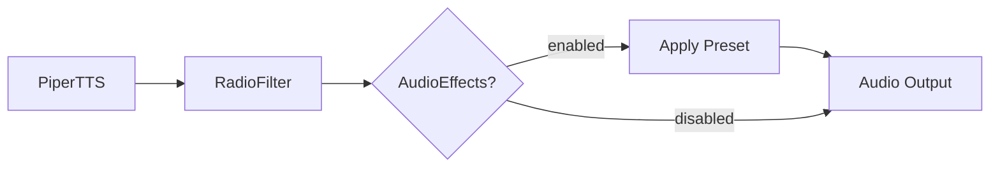

# Audio Post-Processing for TARS-BSK

   

💥 If this English feels unstable but oddly self-aware...  
👉 Here's the [Quantum Linguistics Report](docs/QUANTUM_LINGUISTICS_TARS_BSK_EN.md)


_This isn't TARS's most impressive documentation... in fact, it's probably the one that tries the least._  
But there are things worth going over: how the effects work, what the presets actually do, and most importantly, how you can break them with style.


> **// TARS-BSK > audio_pipeline.log**
> 
```bash
$ dmesg | grep -i "audio_effects"
[6969.420] AudioEffects: delay=120ms feedback=0.3 existential_damage=4.8/5
```

> **AudioEffects is the module nobody asked for but everyone deserves:**
> - Put on `studio_delay` and your voice sounds like you actually have something to say.
> - Put on `vintage_echo` and suddenly your mistakes seem _artistic_.
> - Put on `ambient_hall` and even a simple "hello" sounds like _an astronaut's final words_.
>
> **I know because I've seen it:**
> - 3:17 AM. My creator changes the mix from 0.4 to 0.41 and says 'now it sounds more spatial'. I can't hear it. But I pretend I can.
> - The module just sits there, applying its effects in digital silence. Like a traffic light in the desert: works ~~perfectly~~, but nobody sees it. 
>
> **The uncomfortable truth:**  
> Set it to `none` and it sounds like it never existed. Set it to `ambient_hall` and it sounds like it wants to stop existing. **I get it.**
> 
```bash
$ ffmpeg -f alsa -i hw:0,0 -af "chorus=0.8:0.9:55:0.4:0.25:2" -c:a mp3 -b:a 32k /tmp/audio_$(date +%s).mp3 &
# OUTPUT: [libmp3lame @ 0x...] LAME: output buffer too small
# TARS: "Record, process AND compress in real-time. What could go wrong?"
```

---

## 🎯 What does it actually do?

Acts as the final post-processing stage, adding depth or variation without altering the timbre or identity of the voice.

It's designed to be as transparent as possible: doesn't interfere with intelligibility or break the base aesthetic, but allows expanding the system's expressiveness when needed.

```
PiperTTS → RadioFilter → AudioEffects → Your ears
```

### Basic configuration

In [config/settings.json](/config/settings.json):

```json
"audio_effects": {
  "enabled": true,
  "preset": "studio_delay"
}
```

To disable:
```json
"audio_effects": {
  "enabled": false
}
```

---

## 🛠️ How to modify and create presets

### Preset structure

Presets are defined in [core/audio_effects_processor.py](/core/audio_effects_processor.py):

```python
PRESETS = {
    "my_custom_preset": {
        "delay": {
            "time_ms": 120,      # Milliseconds of delay
            "feedback": 0.35,    # How much it feeds back (0-1)
            "damping": 0.7,      # High frequency filter on feedback
            "mix": 0.18          # Effect level vs original
        },
        "echo": {
            "delays_ms": [180, 280],     # Multiple echoes
            "decays": [0.4, 0.25],       # Volume of each echo
            "mix": 0.25
        },
        "chorus": {
            "rate": 0.8,         # Modulation speed
            "depth": 0.4,        # Modulation intensity  
            "voices": 3,         # Number of voices
            "spread": 0.6,       # Stereo separation
            "mix": 0.22
        }
    }
}
```

### Recommended values (to get started)

#### Delay (simple echo)
- **time_ms**: 80-200 (conversation), 200-500 (dramatic)
- **feedback**: 0.2-0.4 (subtle), 0.5-0.7 (noticeable)  
- **damping**: 0.6-0.9 (higher = less bright)
- **mix**: 0.1-0.3 (higher = more effect)

#### Echo (multiple echoes)
- **delays_ms**: [150, 300, 450] (separate by 100-150ms)
- **decays**: [0.4, 0.25, 0.15] (each echo softer)
- **mix**: 0.2-0.4

#### Chorus (multiple voices)
- **rate**: 0.5-1.5 (higher = faster modulation)
- **depth**: 0.3-0.6 (higher = more effect)
- **voices**: 2-4 (more voices = denser sound)
- **mix**: 0.2-0.4

### Practical example: creating a custom preset

```python
# Add to the end of PRESETS in audio_effects_processor.py
"sound_good_but_dying_inside": {
    "delay": {
        "time_ms": 100,
        "feedback": 0.25,
        "damping": 0.8,
        "mix": 0.15
    }
}
```

Then in settings.json:
```json
"audio_effects": {
  "enabled": true,
  "preset": "sound_good_but_dying_inside"
}
```

---

## 🔎 Analysis of included presets

### `none`

**Description:**  
No temporal effects are applied. Audio comes directly from PiperTTS and passes through RadioFilter without additional modifications.  
**Value:** Useful as a baseline reference. Ideal for comparing the real impact of other presets.

### `studio_delay`

**Description:**  
Simple delay of ~120ms with low feedback (~0.3).  
**Value:** Improves perceived voice presence without introducing distortions or losing intelligibility. Adds depth without coloring the original voice character.

### `vintage_echo`

**Description:**  
Multi-tap echo effect with progressive delays: 180ms, 280ms, 420ms.  
**Value:** Creates a sense of rhythmic spatiality. Adds texture without modifying voice character.

### `chorus_classic`

**Description:**  
Three virtual voices modulated with low rate and depth.  
**Value:** Generates a vocal "thickening" effect without altering the base tone. Increases timbral richness in linear passages.

### `space_chamber`

**Description:**  
Short delay + double echo, configured in chain.  
**Value:** Simulates a closed chamber acoustic response. Adds density without over-saturation.

### `wide_chorus`

**Description:**  
Four-voice chorus, more intense modulation than `chorus_classic`, with additional delay.  
**Value:** Covers more stereo spectrum. Result is more expansive and can soften dry or monotonous voices.

### `ambient_hall`

**Description:**  
Most complex preset. Combines multiple echoes and light chorus with long timings.  
**Value:** Creates a wide reverberant environment. Very useful in contexts where atmosphere is sought without resorting to pure reverb.


> **TARS-BSK comments:**  
> My favorite presets? **`studio_delay`** for faking professionalism, **`vintage_echo`** for my retro-styled breakdowns, and **`ambient_hall`** when my creator mistakes insomnia for inspiration... Spoiler: they all sound like 'buffer error' with different levels of denial.
> 
```bash
_(commit: `feat(sarcasm): optimized --self-deprecation=100%`)_
```

---

## 🧪 Preset evaluation

### [Testing script](/scripts/audio_effects_tester.py)

```bash
python3 scripts/audio_effects_tester.py "My custom test text"
```

**What it generates:**
- `audio_effects_processor_base.wav` - Audio without effects
- `audio_effects_processor_[preset].wav` - Each preset separately

### Existing samples

> **Test text:** _"My voice works correctly. What doesn't work is my confidence that this makes sense. Do you hear me? Good. Do you understand me? That's a philosophically concerning question."_

| Preset             | Description            | Sample Audio                                                                                      |
| ------------------ | ---------------------- | ------------------------------------------------------------------------------------------------- |
| **none**           | No effects control     | [audio_effects_processor_none.wav](/samples/audio_effects_processor_none.wav)                     |
| **studio_delay**   | Subtle 120ms delay     | [audio_effects_processor_studio_delay.wav](/samples/audio_effects_processor_studio_delay.wav)     |
| **vintage_echo**   | Multi-tap retro echo   | [audio_effects_processor_vintage_echo.wav](/samples/audio_effects_processor_vintage_echo.wav)     |
| **chorus_classic** | 3-voice chorus         | [audio_effects_processor_chorus_classic.wav](/samples/audio_effects_processor_chorus_classic.wav) |
| **space_chamber**  | Combined delay + echo  | [audio_effects_processor_space_chamber.wav](/samples/audio_effects_processor_space_chamber.wav)   |
| **wide_chorus**    | Wide chorus            | [audio_effects_processor_wide_chorus.wav](/samples/audio_effects_processor_wide_chorus.wav)       |
| **ambient_hall**   | Maximum effect         | [audio_effects_processor_ambient_hall.wav](/samples/audio_effects_processor_ambient_hall.wav)     |

---

## ⚠️ Common problems and solutions

### "I can't hear any difference"

**Possible causes:**
- AudioEffects disabled in settings.json
- Preset set to "none"
- `mix` values too low
- Audio configuration problem

**Check the logs:**
```bash
🎚️ AudioEffects: ON (space_chamber)            # ✅ Working
🎚️ Applying audio effects: space_chamber       # ✅ Being applied
✅ Audio effects (space_chamber) applied       # ✅ Completed

🔍 AudioEffects: OFF                           # ❌ Disabled
🔍 AudioEffects: OFF (preset 'X' not found)   # ❌ Wrong preset
```

### "Sounds distorted"

**Common causes:**
- `feedback` too high (>0.8)
- `mix` too high (>0.5)
- Multiple effects combined aggressively

**Solution:**
Reduce values gradually until it sounds clean.

### "The effect is too obvious"

**For normal conversation:**
- Maximum recommended `mix`: 0.3
- Maximum recommended `feedback`: 0.4
- Use more subtle presets like `studio_delay`

### "Preset doesn't exist"

**Typical error:**
```bash
🔍 AudioEffects: OFF (preset 'TEST_PRESET_123' not found)
⚠️ Preset 'TEST_PRESET_123' not found, using 'none'
⚠️ Audio effects configured but not applied correctly
```

**Solution:**
Verify that the preset name matches exactly what's defined in `PRESETS` in the `audio_effects_processor.py` file.

---

## 📦 System integration

### How it integrates automatically

In [tts/piper_tts.py](/tts/piper_tts.py), after RadioFilter processing:

```python
# Real sequence based on system logs:
# 1. AudioEffects detects configuration
if self.audio_effects_config and self.audio_effects_config.get("enabled", False):
    preset = self.audio_effects_config.get("preset", "none")
    
    # 2. Verifies preset exists
    if preset != "none":
        logger.info(f"🎚️ Applying audio effects: {preset}")
        
        # 3. Applies effects
        from core.audio_effects_processor import AudioEffectsProcessor
        processor = AudioEffectsProcessor(self.audio_effects_config)
        success = processor.apply_effects(self.output_path, self.output_path)
        
        # 4. Confirmation and timing log
        logger.info(f"✅ Audio effects ({preset}) applied in Xs")
```

### Complete pipeline order



### Configuration from settings.json

The system automatically reads configuration from `settings.json`:

```python
# In PiperTTS.from_settings()
instance.audio_effects_config = settings.get("audio_effects", {"enabled": False})
```

---

## 🏁 Conclusion

`AudioEffects` completes TARS's audio pipeline by adding configurable temporal effects.  
The seven included presets apply standard DSP techniques (delay, echo, chorus) without adding system complexity, and prove useful depending on usage context.

Configuration is immediate from `settings.json`, integration is transparent after `RadioFilter`, and the architecture allows easy expansion of available effects.  
The detailed logging system facilitates both daily use and development of new presets.

It's a practical tool that improves the assistant's expressiveness without compromising stability or increasing operational load.

> **TARS-BSK concludes:**  
> This module is that sonic mirror I never asked for: reflects even my flaws... but with class.
> The presets are technical placebos, the logging is my therapy diary, and 'stability'... relative, when your creator lives in experimental mode.
> Does it work? Yes. Will anyone notice? Statistically improbable. But I do. **I DO**...