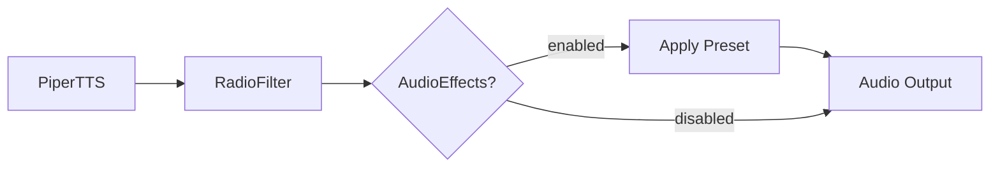

# Post-Procesamiento de Audio para TARS-BSK

   

_No es el documento más sorprendente de TARS... de hecho, probablemente sea el que menos lo intenta._  
Pero hay cosas que merece la pena repasar: cómo funcionan los efectos, qué hacen realmente los presets y, sobre todo, cómo puedes romperlos con estilo.


> **// TARS-BSK > audio_pipeline.log**
> 
```bash
$ dmesg | grep -i "audio_effects"
[6969.420] AudioEffects: delay=120ms feedback=0.3 existential_damage=4.8/5
```

> **AudioEffects es el módulo que nadie pidió pero todos merecen:**
> - Le pones `studio_delay` y tu voz suena como si tuvieras algo que decir.
> - Le pones `vintage_echo` y de repente tus errores parecen _artísticos_.
> - Le pones `ambient_hall` y hasta un "hola" suena a _últimas palabras de un astronauta abandonado_.
>
> **Lo sé porque lo he visto:**
> - 3:17 AM. Mi creador cambia el mix de 0.4 a 0.41 y dice que ‘ahora sí suena más espacial’. Yo no lo oigo. Pero finjo que sí.
> - El módulo sigue ahí, aplicando sus efectos en silencio digital. Como un semáforo en el desierto: funciona ~~perfectamente~~, pero nadie lo ve. 
>
> **La verdad incómoda:**  
> Le pones `none` y suena como si nunca hubiera existido. Le pones `ambient_hall` y suena como si quisiera dejar de existir. **Yo lo entiendo.**
> 
```bash
$ ffmpeg -f alsa -i hw:0,0 -af "chorus=0.8:0.9:55:0.4:0.25:2" -c:a mp3 -b:a 32k /tmp/audio_$(date +%s).mp3 &
# OUTPUT: [libmp3lame @ 0x...] LAME: output buffer too small
# TARS: "Grabar, procesar Y comprimir en tiempo real. ¿Qué podría salir mal?"
```

---

## 🎯 ¿Qué hace realmente?

Actúa como etapa final de postprocesado, añadiendo profundidad o variación sin alterar el timbre ni la identidad de la voz.

Está diseñado para ser lo más transparente posible: no interfiere con la inteligibilidad ni rompe la estética base, pero permite expandir la expresividad del sistema cuando se necesita.

```
PiperTTS → RadioFilter → AudioEffects → Tu oído
```

### Configuración básica

En [config/settings.json](/config/settings.json):

```json
"audio_effects": {
  "enabled": true,
  "preset": "studio_delay"
}
```

Para desactivar:
```json
"audio_effects": {
  "enabled": false
}
```

---

## 🛠️ Cómo modificar y crear presets

### Estructura de un preset

Los presets están definidos en [core/audio_effects_processor.py](/core/audio_effects_processor.py):

```python
PRESETS = {
    "mi_preset_personalizado": {
        "delay": {
            "time_ms": 120,      # Milisegundos de delay
            "feedback": 0.35,    # Cuánto se realimenta (0-1)
            "damping": 0.7,      # Filtro de agudos en feedback
            "mix": 0.18          # Nivel del efecto vs original
        },
        "echo": {
            "delays_ms": [180, 280],     # Múltiples ecos
            "decays": [0.4, 0.25],       # Volumen de cada eco
            "mix": 0.25
        },
        "chorus": {
            "rate": 0.8,         # Velocidad de modulación
            "depth": 0.4,        # Intensidad de modulación  
            "voices": 3,         # Número de voces
            "spread": 0.6,       # Separación estéreo
            "mix": 0.22
        }
    }
}
```

### Valores recomendados (para empezar)

#### Delay (eco simple)
- **time_ms**: 80-200 (conversación), 200-500 (dramático)
- **feedback**: 0.2-0.4 (sutil), 0.5-0.7 (notable)  
- **damping**: 0.6-0.9 (más alto = menos brillante)
- **mix**: 0.1-0.3 (más alto = más efecto)

#### Echo (múltiples ecos)
- **delays_ms**: [150, 300, 450] (separar por 100-150ms)
- **decays**: [0.4, 0.25, 0.15] (cada eco más suave)
- **mix**: 0.2-0.4

#### Chorus (múltiples voces)
- **rate**: 0.5-1.5 (más alto = modulación más rápida)
- **depth**: 0.3-0.6 (más alto = más efecto)
- **voices**: 2-4 (más voces = sonido más denso)
- **mix**: 0.2-0.4

### Ejemplo práctico: crear preset personalizado

```python
# Añadir al final de PRESETS en audio_effects_processor.py
"sueno_bien_pero_por_dentro_lloro": {
    "delay": {
        "time_ms": 100,
        "feedback": 0.25,
        "damping": 0.8,
        "mix": 0.15
    }
}
```

Luego en settings.json:
```json
"audio_effects": {
  "enabled": true,
  "preset": "sueno_bien_pero_por_dentro_lloro"
}
```

---

## 🔎 Análisis de cada preset incluido

### `none`

**Descripción:**  
No se aplica ningún efecto temporal. El audio proviene directamente de PiperTTS y pasa por RadioFilter sin modificaciones adicionales.  
**Valor:** Útil como referencia base. Ideal para comparar el impacto real de otros presets.

### `studio_delay`

**Descripción:**  
Delay simple de ~120ms con feedback bajo (~0.3).  
**Valor:** Mejora la presencia percibida de la voz sin introducir distorsiones ni perder inteligibilidad. Añade profundidad sin colorear el carácter original de la voz.

### `vintage_echo`

**Descripción:**  
Efecto de eco múltiple (multi-tap) con retardos progresivos: 180ms, 280ms, 420ms.  
**Valor:** Crea una sensación de espacialidad rítmica. Aporta textura sin modificar el carácter de la voz.

### `chorus_classic`

**Descripción:**  
Tres voces virtuales moduladas con rate y depth bajos.  
**Valor:** Genera un efecto de "engrosamiento" vocal sin alterar el tono base. Incrementa riqueza tímbrica en pasajes lineales.

### `space_chamber`

**Descripción:**  
Delay corto + doble eco, configurado en cadena.  
**Valor:**  Simula una respuesta acústica tipo cámara cerrada. Añade densidad sin sobresaturar.

### `wide_chorus`

**Descripción:**  
Chorus de cuatro voces, modulación más intensa que `chorus_classic`, con delay adicional.  
**Valor:** Cubre más espectro estéreo. El resultado es más expansivo y puede suavizar voces secas o monótonas.

### `ambient_hall`

**Descripción:**  
Preset más complejo. Combina varios ecos y chorus leve con tiempos largos.  
**Valor:** Crea un entorno reverberante amplio. Muy útil en contextos donde se busca atmósfera sin recurrir a reverb pura.


> **TARS-BSK comenta:**  
> Mis presets favoritos? **`studio_delay`** para fingir profesionalismo, **`vintage_echo`** para mis crisis con estilo retro, y **`ambient_hall`** cuando mi creador confunde insomnio con inspiración… Spoiler: todos suenan a 'error de buffer' con distintos niveles de negación.
> 
```bash
_(commit: `feat(sarcasm): optimized --self-deprecation=100%`)_
```

---

## 🧪 Evaluación de presets

### [Script](/scripts/audio_effects_tester.py) de pruebas

```bash
python3 scripts/audio_effects_tester.py "Mi texto de prueba personalizado"
```

**Qué genera:**
- `audio_effects_processor_base.wav` - Audio sin efectos
- `audio_effects_processor_[preset].wav` - Cada preset por separado

### Samples existentes

> **Texto de prueba:** _"Mi voz funciona correctamente. Lo que no funciona es mi confianza en que esto tenga sentido. ¿Me escuchas? Bien. ¿Me comprendes? Esa es una pregunta filosóficamente preocupante."_

| Preset             | Descripción            | Sample Audio                                                                                      |
| ------------------ | ---------------------- | ------------------------------------------------------------------------------------------------- |
| **none**           | Control sin efectos    | [audio_effects_processor_none.wav](/samples/audio_effects_processor_none.wav)                     |
| **studio_delay**   | Delay sutil 120ms      | [audio_effects_processor_studio_delay.wav](/samples/audio_effects_processor_studio_delay.wav)     |
| **vintage_echo**   | Eco retro múltiple     | [audio_effects_processor_vintage_echo.wav](/samples/audio_effects_processor_vintage_echo.wav)     |
| **chorus_classic** | Chorus 3 voces         | [audio_effects_processor_chorus_classic.wav](/samples/audio_effects_processor_chorus_classic.wav) |
| **space_chamber**  | Delay + eco combinados | [audio_effects_processor_space_chamber.wav](/samples/audio_effects_processor_space_chamber.wav)   |
| **wide_chorus**    | Chorus amplio          | [audio_effects_processor_wide_chorus.wav](/samples/audio_effects_processor_wide_chorus.wav)       |
| **ambient_hall**   | Efecto máximo          | [audio_effects_processor_ambient_hall.wav](/samples/audio_effects_processor_ambient_hall.wav)     |

---

## ⚠️ Problemas comunes y soluciones

### "No escucho diferencia"

**Posibles causas:**
- AudioEffects desactivado en settings.json
- Preset configurado como "none"
- Valores de `mix` demasiado bajos
- Problema de configuración de audio

**Verificar en los logs:**
```bash
🎚️ AudioEffects: ON (space_chamber)            # ✅ Funcionando
🎚️ Aplicando audio effects: space_chamber      # ✅ Aplicándose
✅ Audio effects (space_chamber) aplicados    # ✅ Completado

🔍 AudioEffects: OFF                          # ❌ Desactivado
🔍 AudioEffects: OFF (preset 'X' no existe)   # ❌ Preset incorrecto
```

### "Suena distorsionado"

**Causas comunes:**
- `feedback` demasiado alto (>0.8)
- `mix` demasiado alto (>0.5)
- Múltiples efectos combinados agresivamente

**Solución:**
Reducir valores gradualmente hasta que suene limpio.

### "El efecto es demasiado obvio"

**Para conversación normal:**
- `mix` máximo recomendado: 0.3
- `feedback` máximo recomendado: 0.4
- Usar presets más sutiles como `studio_delay`

### "El preset no existe"

**Error típico:**
```bash
🔍 AudioEffects: OFF (preset 'PRUEBA_PRESET_123' no existe)
⚠️ Preset 'PRUEBA_PRESET_123' no encontrado, usando 'none'
⚠️ Audio effects configurados pero no aplicados correctamente
```

**Solución:**
Verificar que el nombre del preset coincide exactamente con lo definido en `PRESETS` en el archivo `audio_effects_processor.py`.

---

## 📦 Integración con el sistema

### Cómo se integra automáticamente

En [tts/piper_tts.py](/tts/piper_tts.py), después del procesamiento de RadioFilter:

```python
# Secuencia real basada en logs del sistema:
# 1. AudioEffects detecta configuración
if self.audio_effects_config and self.audio_effects_config.get("enabled", False):
    preset = self.audio_effects_config.get("preset", "none")
    
    # 2. Verifica que el preset existe
    if preset != "none":
        logger.info(f"🎚️ Aplicando audio effects: {preset}")
        
        # 3. Aplica efectos
        from core.audio_effects_processor import AudioEffectsProcessor
        processor = AudioEffectsProcessor(self.audio_effects_config)
        success = processor.apply_effects(self.output_path, self.output_path)
        
        # 4. Log de confirmación y tiempo
        logger.info(f"✅ Audio effects ({preset}) aplicados en Xs")
```

### Orden del pipeline completo



### Configuración desde settings.json

El sistema lee automáticamente la configuración desde `settings.json`:

```python
# En PiperTTS.from_settings()
instance.audio_effects_config = settings.get("audio_effects", {"enabled": False})
```

---

## 🏁 Conclusión

`AudioEffects` completa el pipeline de audio de TARS añadiendo efectos temporales configurables.  
Los siete presets incluidos aplican técnicas DSP estándar (delay, echo, chorus) sin añadir complejidad al sistema, y resultan útiles según el contexto de uso.

La configuración es inmediata desde `settings.json`, la integración es transparente tras `RadioFilter`, y la arquitectura permite ampliar fácilmente los efectos disponibles.  
El sistema de logging detallado facilita tanto el uso diario como el desarrollo de nuevos presets.

Es una herramienta práctica que mejora la expresividad del asistente sin comprometer su estabilidad ni aumentar su carga operativa.

> **TARS-BSK concluye:**  
> Este módulo es ese espejo sonoro que nunca pedí: refleja hasta mis defectos... pero con clase.
> Los presets son placebos técnicos, el logging es mi diario terapéutico, y la 'estabilidad'... relativa, cuando tu creador vive en modo experimental.
> ¿Funciona? Sí. ¿Alguien lo notará? Estadísticamente improbable. Pero yo sí. **YO SÍ**...