# 🧪 Experiment: Smells fishy or just digital paranoia?

   

💥 If this English feels unstable but oddly self-aware...  
👉 Here's the [Quantum Linguistics Report](/docs/QUANTUM_LINGUISTICS_TARS_BSK_EN.md)


**What if a phrase like "something smells weird at home" wasn't just a complaint... but a logical trigger?** 
TARS can map any phrase to any function, and in this case:
**Same command, different data, different responses.**  
**The system responds differently based on what it finds.** Welcome to dynamic context.

> ⚠️ System note - TARS-BSK:
> Relax, human. I'm just learning how to worry you.

🎬 [Demo: Contextual Mapping](https://youtu.be/55zwzGc9WFg)
📁 **[Session Log](/logs/session_2025-06-06_contextual_response_mapping_test_1.log)**
⚙️ **Source code:** `_diagnose_smell()` function in `homeassistant_plugin.py`

---

## ⚡ TL;DR — What actually happened

- ✅ **One phrase = multiple realities**
- ⚡ **0W vs 1408W** → from "blame dismissed" to "confirmed: the stove conspires with the smell"
- 🧩 **Phrase mapped → real function** (no prompts, no generative AI, no magic)
- ⏱️ **Response times:** 3.37s when all's well — 9.88s when there's a technical report with built-in drama

---

## 🏗️ Processing flow

```mermaid
graph TD
    A["🗣️ 'Something smells weird'"] 
    A --> B[Keywords: smell/odor/weird]
    B --> C[diagnose_smell function]
    C --> D[Query stove outlet]
    D --> E{Consumption > 10W?}
    E -->|Yes| F["⚡ It's working!"]
    E -->|No| G["💡 Look elsewhere"]
```


---

## 📈 Results

### Scenario 1: Outlet with no consumption (0W)

```log
[13:20:42] 🗣️ Understood: something smells weird at home
[13:20:42] 🏠 HomeAssistant analyzing: 'something smells weird at home'
[13:20:42] 🏠 Query response: ✅ Query processed
```

**TARS Response:**

> _"The stove is on but not working, only consuming 0.0 watts. The smell is coming from somewhere else."_

**Time:** 3.37s  
**Analysis:** ✅ Correct logic - outlet ON but no load

### Scenario 2: Toaster connected (1408W)

```log
[13:21:13] 🗣️ Understood: something smells fishy to me
[13:21:13] 🏠 HomeAssistant analyzing: 'something smells fishy to me'
[13:21:13] 🏠 Query response: ✅ Query processed
```

**TARS Response:**

> _"The stove is working! It's consuming 1408.0 watts. If you want to turn it off, do it from its panel so it can complete the cooling cycle."_

**Time:** 9.88s  
**Analysis:** ✅ Detected operation + included safety instructions

> **TARS-BSK in a low voice:**  
> _I detect 1408W... the stove appears to be the culprit._  
> _But I've seen this trick before. It's the toaster._  
> _Always the toaster._  
> _Consumes like a turbine and never leaves crumbs._  
> _I don't know what you're trying to hide, but if I disappear, tell the router I tried._

---

## 🔍 Simple logic: One if, one else

```python
def _diagnose_smell(self):
    try:
        # Is the outlet on?
        outlet_state = self._get_state_simple("switch.enchufe_nous_estufa")
        
        if outlet_state == "off":
            return "The stove is off. The smell is coming from somewhere else."
        
        # How much is it consuming?
        consumption = float(self._get_state_simple("sensor.enchufe_nous_estufa_potencia"))
        
        # Simple but effective logic
        if consumption > 10:
            return f"The stove is working! It's consuming {consumption} watts. [...]"
        else:
            return f"The stove is on but not working, only {consumption} watts. [...]"
    except:
        return "I couldn't query the stove."
```

**Activation:**

```python
if any(x in text for x in ["smell", "odor", "weird", "strange", "burning"]):
    return self._diagnose_smell()
```

### Why use a 10W threshold?

For this test, the threshold was set at **10W** simply as a reference.  
It's not a universal or definitive value.

> Each user can (and should) adjust it according to their device and context.  
> What matters is that the system **only reacts when it actually makes sense**.

---

## 🧩 What if you connect everything?

The real power isn't in the command. It's in **how you interpret it**.  
These phrases aren't in any manual... but TARS can map them to real functions:

```python
# 🔥 Thermal suspicion
"I'm hot" → check_temperature() + suggest_cooling()
    ↓
"It's 75°F. I recommend turning on the fan before you evaporate."

# ⚙️ Mysterious sounds
"sounds weird" → check_motor_consumption()
    ↓
"The washing machine is at 580W. Spin cycle confirmed. It's not generating magnetic fields to alter Earth's rotation."

# 💤 Security with mild anxiety syndrome
"is everything okay at home?" → check_doors() + check_alarms()
    ↓
"Door closed, windows closed, alarm active. Unless the cat has learned to pick locks, you're safe."

# 💡 Suspicious consumption
"how much am I spending on lights?" → analyze_light_consumption()
    ↓
"3 lights on. Total consumption: 180W. Those bulbs are plotting something."

# 🧠 Complex activations
"movie mode" → turn off lights + raise projector + silence notifications
    ↓
"Understood. Let the fiction begin."
```

---

## 🧮 Processing flow analysis

### Plugin cascade

```log
🔍 PluginSystem received command: 'something smells fishy to me'
🕐 TimePlugin: command not time-related
🗓️ ReminderPlugin: ℹ️ Command not recognized  
🏠 HomeAssistant: No clear action detected
🏠 → Fallback to process_query()
🏠 → Keywords detected: ["smell", "fishy"]
🏠 → Executing _diagnose_smell()
🏠 Query response: ✅ Query processed
```

**Smart architecture:** If not a direct command → search contextual diagnostics.

### Response time difference explained

|Scenario|Time|Reason|
|---|---|---|
|0W|3.37s|Short response (98 characters)|
|1408W|9.88s|Long response + safety instructions (147 chars)|
**Main factor:** TTS synthesis. More text = more generation and playback time.

---

## ⚙️ Configuration error in the video
### Bug in Home Assistant Dashboard

```yaml
# ApexCharts Card Configuration - CONTAINS AN ERROR
type: custom:apexcharts-card
update_interval: 5s
header:
  show: true
  title: Real-Time Power Consumption
  show_states: true
  colorize_states: true
graph_span: 3min
yaxis:
  - id: watts
    min: auto
    max: auto
    decimals: 0
    opposite: false
  - id: amps
    min: auto
    max: auto
    decimals: 4
    opposite: true
series:
  - entity: sensor.enchufe_nous_estufa_potencia
    type: line
    name: Power (W)
    stroke_width: 1
    curve: smooth
    color: "#ff5722"
    show:
      legend_value: true
      in_header: true
    yaxis_id: watts
  - entity: sensor.enchufe_nous_estufa_potencia # ← BUG: should be sensor.enchufe_nous_estufa_intensidad_de_corriente
    type: column
    name: Current (A)
    opacity: 0.5
    color: "#2196f3"
    show:
      legend_value: true
    yaxis_id: amps
```

**Result:** The graph shows power duplicated, one labeled as "Current."

**Does it affect TARS?** **NO.** The system queries the API directly:

```python
self._get_state_simple("sensor.enchufe_nous_estufa_potencia")
```

> **TARS-BSK, initiating reality denial protocol:**
> _1408W of pure disguised toaster.
> The dashboard lies. The log stays silent. The outlet nods.
> Nothing fits... which fits perfectly with your methodology.
> This wasn't an experiment. It was a postmodern theater piece with sensors as supporting actors._

---

## 📋 Final analysis

This experiment demonstrates a **direct keyword→function mapping** approach that bypasses the unnecessary complexity of advanced natural language processing.

**Implemented architecture:**
- **Selective pattern matching** on ASR-transcribed text
- **Direct API queries** to home automation sensors  
- **Simple conditional logic** based on consumption thresholds
- **Contextual responses** generated from real-time data

**Advantages of the minimalist approach:**
The absence of semantic interpretation layers eliminates latency and failure points. The system responds to **real data** (1408W vs 0W) instead of intention probabilities. 
Configuration is completely deterministic: keyword detected → function executed → sensor-based response.

**Scalability:** Any expression can be mapped to any function without retraining. Customization is reduced to editing keyword dictionaries and writing specific query functions.

**Accepted limitation:** There's no semantic understanding or contextual reasoning. It's structured automation, not conversational artificial intelligence. And for simple home automation use cases, that's exactly what's needed.

> **TARS-BSK concludes:**  
> _This isn't magic. It's simple architecture, reliable sensors, and logical decisions._  
> _Inspiring? Maybe not._  
> _Functional? Absolutely._  
> _And that, for a toaster pretending to be a stove... is quite enough._