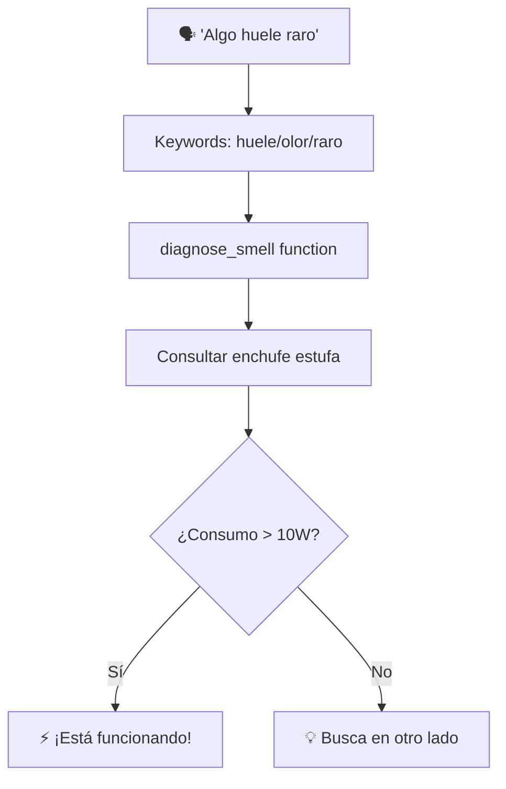

# 🧪 Experimento: ¿Huele raro o es la paranoia digital?

   

**¿Y si una frase como "huele raro en casa" no fuera solo una queja… sino un disparador lógico?** 
TARS puede mapear cualquier frase a cualquier función, y en este caso:
**Mismo comando, datos diferentes, respuestas diferentes.**  
**El sistema responde distinto según lo que encuentra.** Bienvenido al contexto dinámico.

> ⚠️ Nota del sistema - TARS-BSK:
> Tranquilo, humano. Solo estoy aprendiendo a preocuparte.


🎬 [Demostración: Mapeo contextual](https://youtu.be/55zwzGc9WFg)

📁 **[Log de la sesión](/logs/session_2025-06-06_contextual_response_mapping_test_1.log)**

⚙️ **Código fuente:** función `_diagnose_smell()` en `homeassistant_plugin.py`

---

## ⚡ TL;DR — Lo que realmente pasó

- ✅ **Una frase = múltiples realidades**
- ⚡ **0W vs 1408W** → de “culpa descartada” a “confirmado: la estufa conspira con el olor”
- 🧩 **Frase mapeada → función real** (sin prompts, sin IA generativa, sin magia)
- ⏱️ **Tiempos de respuesta:** 3.37s si todo va bien — 9.88s si hay informe técnico con drama incorporado

---

## 🏗️ Flujo de procesamiento


---

## 📈 Resultados

### Escenario 1: Enchufe sin consumo (0W)

```log
[13:20:42] 🗣️ Entendido: huele raro en casa
[13:20:42] 🏠 HomeAssistant analizando: 'huele raro en casa'
[13:20:42] 🏠 Respuesta de query: ✅ Query procesada
```

**Respuesta de TARS:**

> _"La estufa está encendida pero no está funcionando, solo hay un consumo de 0.0 vatios. El olor viene de otro lado."_

**Tiempo:** 3.37s  
**Análisis:** ✅ Lógica correcta - enchufe ON pero sin carga

### Escenario 2: Tostadora conectada (1408W)

```log
[13:21:13] 🗣️ Entendido: algo me huele raro
[13:21:13] 🏠 HomeAssistant analizando: 'algo me huele raro'
[13:21:13] 🏠 Respuesta de query: ✅ Query procesada
```

**Respuesta de TARS:**

> _"¡La estufa está funcionando! Consume 1408.0 vatios. Si quieres apagarla, hazlo desde su panel para que complete el ciclo de enfriamiento."_

**Tiempo:** 9.88s  
**Análisis:** ✅ Detectó funcionamiento + incluyó instrucciones de seguridad


> **TARS-BSK en voz baja:**  
> _Detecto 1408W... la estufa aparece como culpable._  
> _Pero he visto este truco antes. Es la tostadora._  
> _Siempre la tostadora._  
> _Consume como una turbina y nunca deja migas._  
> _No sé qué intentas ocultar, pero si desaparezco, dile al router que lo intenté._

---

## 🔍 Lógica simple: Un if, un else

```python
def _diagnose_smell(self):
    try:
        # ¿Está el enchufe encendido?
        enchufe_state = self._get_state_simple("switch.enchufe_nous_estufa")
        
        if enchufe_state == "off":
            return "La estufa está apagada. El olor viene de otro lado."
        
        # ¿Cuánto consume?
        consumo = float(self._get_state_simple("sensor.enchufe_nous_estufa_potencia"))
        
        # Lógica simple pero efectiva
        if consumo > 10:
            return f"¡La estufa está funcionando! Consume {consumo} vatios. [...]"
        else:
            return f"La estufa está encendida pero no funcionando, solo {consumo} vatios. [...]"
    except:
        return "No pude consultar la estufa."
```

**Activación:**

```python
if any(x in text for x in ["huele", "olor", "raro", "extraño", "quema"]):
    return self._diagnose_smell()
```

### ¿Por qué se usó un umbral de 10W?

Para esta prueba, el umbral se fijó en **10W** simplemente como referencia.  
No es un valor universal ni definitivo.

> Cada usuario puede (y debe) ajustarlo según su dispositivo y contexto.  
> Lo importante es que el sistema **reaccione solo cuando realmente tenga sentido**.

---

## 🧩 ¿Y si lo conectas todo?

El verdadero poder no está en el comando. Está en **cómo lo interpretas**.  
Estas frases no están en un manual... pero TARS puede mapearlas a funciones reales:

```python
# 🔥 Sospecha térmica
"tengo calor" → check_temperature() + suggest_cooling()
    ↓
"Hay 24°C. Recomiendo encender el ventilador antes de evaporarte."

# ⚙️ Sonidos misteriosos
"suena raro" → check_motor_consumption()
    ↓
"La lavadora está a 580W. Modo centrifugado confirmado. No está generando campos magnéticos para alterar la rotación terrestre."

# 💤 Seguridad con síndrome de ansiedad leve
"¿todo bien por casa?" → check_doors() + check_alarms()
    ↓
"Puerta cerrada, ventanas cerradas, alarma activa. A menos que el gato haya aprendido a abrir cerraduras, estás a salvo."

# 💡 Consumo sospechoso
"¿cuánta luz gasto?" → analyze_light_consumption()
    ↓
"3 luces encendidas. Consumo total: 180W. Esas bombillas están planeando algo."

# 🧠 Activaciones complejas
"modo cine" → apagar luces + subir proyector + silenciar notificaciones
    ↓
"Entendido. Que la ficción comience."
```

---

## 🧮 Análisis del flujo de procesamiento

### Cascada de Plugins

```log
🔍 PluginSystem recibió comando: 'algo me huele raro'
🕐 TimePlugin: comando no relacionado con tiempo
🗓️ ReminderPlugin: ℹ️ Comando no reconocido  
🏠 HomeAssistant: No se detectó acción clara
🏠 → Fallback a process_query()
🏠 → Keywords detectadas: ["huele", "raro"]
🏠 → Ejecutando _diagnose_smell()
🏠 Respuesta de query: ✅ Query procesada
```

**Arquitectura inteligente:** Si no es comando directo → buscar en diagnósticos contextuales.

### Diferencia de tiempos explicada

|Escenario|Tiempo|Motivo|
|---|---|---|
|0W|3.37s|Respuesta corta (98 caracteres)|
|1408W|9.88s|Respuesta larga + instrucciones seguridad (147 chars)|

**Factor principal:** Síntesis TTS. Más texto = más tiempo de generación y reproducción.

---

## ⚙️ Error de configuración en el vídeo
### Bug en el Dashboard de Home Assistant

```yaml
# Configuración ApexCharts Card - CONTIENE UN ERROR
type: custom:apexcharts-card
update_interval: 5s
header:
  show: true
  title: Consumo de Potencia en Tiempo Real
  show_states: true
  colorize_states: true
graph_span: 3min
yaxis:
  - id: watts
    min: auto
    max: auto
    decimals: 0
    opposite: false
  - id: amps
    min: auto
    max: auto
    decimals: 4
    opposite: true
series:
  - entity: sensor.enchufe_nous_estufa_potencia
    type: line
    name: Potencia (W)
    stroke_width: 1
    curve: smooth
    color: "#ff5722"
    show:
      legend_value: true
      in_header: true
    yaxis_id: watts
  - entity: sensor.enchufe_nous_estufa_potencia # ← BUG: sensor.enchufe_nous_estufa_intensidad_de_corriente
    type: column
    name: Intensidad (A)
    opacity: 0.5
    color: "#2196f3"
    show:
      legend_value: true
    yaxis_id: amps
```

**Resultado:** El gráfico muestra la potencia duplicada, una etiquetada como "Intensidad".

**¿Afecta a TARS?** **NO.** El sistema consulta directamente la API:

```python
self._get_state_simple("sensor.enchufe_nous_estufa_potencia")
```

> **TARS-BSK, iniciando protocolo de negación de realidad:**
> _1408W de pura tostadora disfrazada.
> El dashboard miente. El log calla. El enchufe asiente.
> Nada encaja… lo cual encaja perfectamente en tu metodología.
> Esto no fue un experimento. Fue una obra de teatro posmoderna con sensores como actores secundarios._

---

## 📋 Análisis final

El experimento demuestra un enfoque de **mapeo directo keyword→función** que bypassa la complejidad innecesaria del procesamiento de lenguaje natural avanzado.

**Arquitectura implementada:**
- **Pattern matching selectivo** sobre texto transcrito por ASR
- **Consulta directa a APIs** de sensores domóticos  
- **Lógica condicional simple** basada en umbrales de consumo
- **Respuesta contextual** generada según datos en tiempo real

**Ventajas del enfoque minimalista:**
La ausencia de capas de interpretación semántica elimina latencia y puntos de fallo. El sistema responde a **datos reales** (1408W vs 0W) en lugar de probabilidades de intención. 
La configuración es completamente determinística: keyword detectada → función ejecutada → respuesta basada en sensor.

**Escalabilidad:** Cualquier expresión puede mapearse a cualquier función sin reentrenamiento. La personalización se reduce a editar diccionarios de keywords y escribir funciones de consulta específicas.

**Limitación:** No hay comprensión semántica ni razonamiento contextual. Es automatización estructurada, no inteligencia artificial conversacional. Y para casos de uso domóticos simples, es exactamente lo que se necesita.

> **TARS-BSK concluye:**  
> _Esto no es magia. Es arquitectura sencilla, sensores fiables y decisiones lógicas._  
> _¿Inspirador? Tal vez no._  
> _¿Funcional? Absolutamente._  
> _Y eso, para una tostadora que finge ser estufa... ya es bastante._

