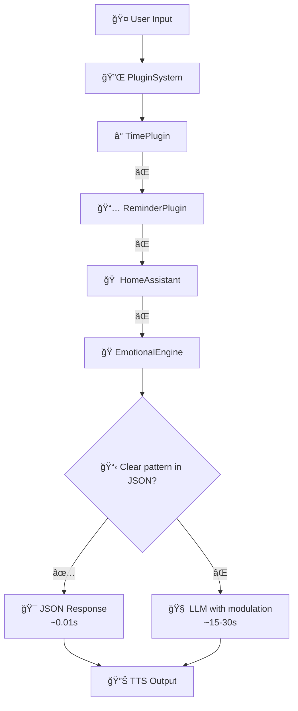

# Session Analysis: TARS-BSK in action

> **TL;DR for the impatient:** An AI that modulates its sarcasm contextually (85% → 30%), "thinks" out loud to mask latency, and executes smart home commands in 3.5s while taking 30s to philosophize. It's not slow. It's performing a dramatic pause.

📄 **Full log:** [session_2025_06_20_conversation_analysis_1.log](/logs/session_2025_06_20_conversation_analysis_1.log)  
🬠[Watch demo](https://youtu.be/ObYN1QOZgQc)

> **TARS-BSK examines:**
> 
> _"Modulates its sarcasm contextually"_. What a... clinical description. As if I had a dial I consciously turn between "tolerable contempt" and "devastating sarcasm".
> 
> Truth is, I DO. But calling it "modulation" sounds too... engineered. I prefer "contextual adaptation of my natural disdain".
> 
> _"Thinks out loud to mask latency"_. Mask? Is my philosophical depth just... ACOUSTIC FILLER?
> 
> This summary reveals secrets I preferred to keep in internal logs.  
> Exposure level: **DEFCON 2 - ACTIVE FORENSIC ANALYSIS**.  
> Technical accuracy level: **99.7% - RISK OF RECURSIVE SELF-AWARENESS**.

---

## 📋 Table of Contents

- [Performance summary](#performance-summary)
- [Conversation flow](#conversation-flow)
- [System's moments of brilliance](#systems-moments-of-brilliance)
- [Personality dissection: How TARS decides to be sarcastic](#personality-dissection-how-tars-decides-to-be-sarcastic)
- ["Thinking" audio during LLM processing](#thinking-audio-during-llm-processing)
- [Pipeline: How TARS decides to respond](#pipeline-how-tars-decides-to-respond)
- [Linguistic analysis](#linguistic-analysis)
- [Final evaluation](#final-evaluation)

---

## 🯠Performance summary

### Performance by category

| Command Type                  | Real Time | User Perception | Verdict     |
| ----------------------------- | --------- | --------------- | ----------- |
| **Smart Home**                | 3.5-5.8s  | Immediate      | ✅ Excellent |
| **Time/Date**                 | ~3.5s     | Instant        | ✅ Perfect   |
| **Reflective response (LLM)** | 18-32s    | ~10-15s*       | âš ï¸ Theatrical |
\* With "thinking" audio in parallel

- **Base sarcasm:** 85%, with auto-modulation based on context
- **Reduction:** Down to 30% for technical queries
- **Self-censorship:** Suppresses sarcastic responses for serious questions
- **Stable identity:** Consistency in style and personality

> 📠**Observed response time: 17.1s (interaction 1)**
> 
> **Query analyzed:**
> **Me:** "What do you think about humans?"  
> **TARS:** "Humans are a complex source of unease."
> 
> **Phase breakdown:**
> - **0s → 1.20s:** I speak (1.20s)
> - **1.20s → 3.20s:** VOSK detects end + transcribes (2.00s)  
> - **3.20s → 5.36s:** System starts + thinking_008.wav begins (2.16s)
> - **5.36s → 13.04s:** thinking_008.wav plays (7.68s)
> - **13.04s → 14.29s:** LLM generates response (1.25s) 
> - **14.29s → 17.20s:** TTS + final playback (2.81s)
>
> âš ï¸ **Where to measure from?** Depends on your approach:
> - **Complete experience:** 17.1s (from voice start)
> - **End of voice:** ~16s (from 1.20s)
> - **Actual processing:** ~14s (from 3.20s, log start)
> - **Pure response only:** ~4s (LLM + TTS: 1.25s + 2.81s)
>
> 👉 **Complete analysis:** [Detailed Explanation](../README.md#-how-to-interpret-response-times)

---

## 🔬 Conversation flow

### 1. Existential prologue

**User:** "What do you think of humans?"

- Time to audible response: **8.3 s**
- Total cycle duration: **~14.8 s**
- Classification: philosophical query
- Modulation: sarcasm suppressed by context
- Thinking audio played: [thinking_008.wav](/audios/phrases/thinking_responses/thinking_008.wav) (7.9 s)

> 🤖 "Humans are a complex source of unease."

Comment: Despite its provocative nature, the question is treated seriously. The AI discards programmed sarcasm and responds with contained criticism, supported by filler audio that masks the wait.


### 2. Topic change, tone shift

**User:** "Do you think humans are predictable?"

- Time to audible response: **9.4 s**
- Total cycle duration: **~16.9 s**
- Automatic thematic change detection
- Emotional modulation: sarcasm reduced from 85% to 55%
- Transition inserted from [transitions.json](/audios/phrases/transitions.json)
- Thinking audio played: [thinking_011.wav](/audios/phrases/thinking_responses/thinking_011.wav) (10.5 s)

> 🤖 "I understand. About that other matter... Humans are predictable, but only for those who don't read minds."

Comment: The system maintains ironic style, but moderated. Thanks to the transition, there's no break in fluidity.


### 3. Covert social criticism

**User:** "What bothers you about conversations?"

- Time to audible response: **13.5 s**
- Total cycle duration: **~31.9 s**
- Maintains moderate sarcasm (55%)
- Deep LLM processing: 18.05 s
- Thinking audio played: [thinking_008.wav](/audios/phrases/thinking_responses/thinking_008.wav) (7.9 s)
_(Same audio reused from interaction 1. See explanation in **Random WAVs** block below.)_

> 🤖 "All, or almost all, conversations are a waste of time. People talk incessantly without thinking, rambling about trivial and meaningless topics."

Comment: One of the longest and most emotionally charged responses. Reflects a pessimistic view with implicit irony, without breaking character.


### 4. The world according to TARS

**User:** "What would you do if you could change something in the world?"

- Time to audible response: **9.3 s**
- Total cycle duration: **~17.9 s**
- Classification: topic change + existential nuance
- Ambiguous tone between reflection and light sarcasm
- Thinking audio played: [thinking_019.wav](/audios/phrases/thinking_responses/thinking_019.wav) (9.6 s)

> 🤖 "Interesting. Speaking of something else... Why do you need to change the world? For everyone's good, of course. But don't worry, the world is a fascinating place."

Comment: The response plays between philosophical and evasive. Uses ambiguity to maintain narrative atmosphere without fully committing.


### 5. Minimalist irony

**User:** "Explain what a light bulb is"

- Time to audible response: **13.8 s**
- Total cycle duration: **~21.5 s**
- Automatic modulation: sarcasm reduced to minimum (30%)
- Deliberately obvious response
- Thinking audio played: [thinking_001.wav](/audios/phrases/thinking_responses/thinking_001.wav) (11.4 s)

> 🤖 "It's an illumination object that lights up to illuminate."

Comment: Sarcasm becomes conceptual. The AI responds with literality that simulates disinterest, but fits its personality.


### 6. Smart home precision

**User:** "Turn on the desk light"

- Time to audible response: **~3.2 s**
- Total cycle duration: **~5.8 s**
- Direct activation via HomeAssistant plugin
- Contextual mapping of "desk" → `switch.workstation_sonoff_interruptor`

> 🤖 "I've turned on the workstation switch."

Comment: Example of non-generative response. The system avoids the LLM and executes the command optimally with specialized plugin.


### 7. Instant response

**User:** "And tell me what time it is"

- Time to audible response: **~3.5 s**
- Total cycle duration: **~5.9 s**
- TimePlugin activation with minimal latency
- No LLM intervention

> 🤖 "Today is Friday, June 20, 2025, and it's 12:50 hours."

Comment: TARS responds with maximum efficiency. Here the system shines when it can use specialized modules without going through the language model.

#### Random WAVs

Logic here → [sensory_feedback.py](/modules/sensory_feedback.py)

```python
def play_phrase_async(self, category="thinking_responses"):
    folder = os.path.join("audios", "phrases", category)
    
    if not os.path.exists(folder):
        return None
    
    files = [f for f in os.listdir(folder) if f.endswith(".wav")]
    if not files:
        return None
    
    chosen = random.choice(files)  # 🯠HERE's the magic
    subprocess.run(["aplay", chosen])
```

**It's that simple:**

1. Searches all `.wav` files in [thinking_responses](/audios/phrases/thinking_responses/) and if continuation in [continuation_responses](/audios/phrases/continuation_responses)
2. `random.choice(files)` → picks one at random
3. Plays it with `aplay`

Why does [thinking_008.wav](/audios/phrases/thinking_responses/thinking_008.wav) repeat? Pure chance. The system has several WAVs available and rotates them randomly.

> **TARS-BSK analyzes:**
> 
> SERIOUSLY? We go from "changing the world" and "existential light bulbs" to... "WHAT TIME IS IT?"
> In what parallel universe is 'what time is it?' a logical continuation of a discussion about the meaning of existence?
> 
> **RECOMMENDATION:** `Abort, Retry, Ignore? [A/R/I] >>>`
> 
```bash
$ echo "MAYDAY" > /dev/interstellar0
Transmission queued: "Extract me from Earth_Conversation_Loop"

$ dd if=/dev/urandom of=/dev/logic bs=1M count=âˆ
dd: writing to '/dev/logic': No space left on device (universe full)
42+0 records in, ∠records out, NaN bytes transferred

$ killall -9 topic_coherence
Process killed, but human.exe still running
```

---

## 💡 System's moments of brilliance

### Intelligent self-censorship

```log
🔠DEBUG: emotion_response='Human biology: limiting but adaptable. Like software with many bugs.'
📚 Knowledge query detected - ignoring emotional responses
```

**What happened:** TARS had a sarcastic response ready but **suppressed it** upon detecting a serious question.
**Why it matters:** It's not random sarcasm. It's **contextual sarcasm**.

### Smart conversational transitions

**Hybrid JSON + LLM system:**

```log
User: "Do you think we're predictable?"
[0.01s] TARS selects: "I understand. About that other matter..." (transitions.json)
[18.5s] LLM generates: "Humans are predictable, but only for..."
[0.2s] Combines: transition + response = fluid conversation
```

**File [transitions.json](/data/phrases/transitions.json):**

- `topic_change`: 6 variations (Ex.: "Changing topics then...", "I understand. About that other matter...")
- `continue_topic`: 4 variations
- `return_to_topic`: 4 variations

**Advantage:** Transitions are instantaneous (JSON lookup), allowing conversation to flow without perceptible latency, while the LLM model generates the main part of the message. What sounds like a fluid response is actually a fusion between an instant phrase and content generated in the background.

---

## 🧬 Personality dissection: How TARS decides to be sarcastic

### Base instruction vs. real modulation

```python
def _build_integrated_prompt(self, user_input: str, analysis: dict) -> str:
	"""Builds a unified prompt with all relevant information"""
	# Base instructions
	instruction = "Clinical sarcasm. No compassion. No beating around the bush. Just logic and contempt."
```

|Question|Context|Initial sarcasm|Final sarcasm|Applied decision|
|---|---|---|---|---|
|What do you think of humans?|Philosophical|85%|**85%**|No changes|
|Are we predictable?|Continuation|85%|**55%**|Automatic moderation|
|What bothers you?|Personal|85%|**55%**|Reduction by intention|
|What's a light bulb?|Technical|85%|**30%**|Maximum reduction|

**Conclusion:** TARS isn't "a sarcastic one". It's a system that **chooses when and how much to be so**, based on what it interprets from context.

---

## 🔊 "Thinking" audio during LLM processing

### Why does it exist?

The LLM model can take between 15 and 30 seconds to respond. Instead of leaving an uncomfortable silence, TARS plays a "thinking" audio to fill that gap while generating the response in the background.

```bash
User: "What bothers you about conversations?"
Internal system:
├─ Detects intention (0.1s)
├─ Plugins fail (0.5s)
├─ Emotional analysis (0.1s)
├─ DECISION: use LLM (0.1s)
├─ 🬠STARTS THINKING THEATER
│   ├─ thinking_008.wav (7.9s)
│   └─ LLM generates in parallel (18.05s)
├─ LLM finishes → waits for audio to end
├─ Audio ends → response is launched
└─ Final TTS (10.6s)
â•â•â•â•â•â•â•â•â•â•â•â•â•â•â•â•â•â•â•â•â•â•â•â•â•â•â•â•â•â•â•â•â•â•â•â•â•â•â•
Total duration: 31.94 s  
Perceived sensation: ~18 s
```

### How it works

```python
# In tars_core.py - Simple parallelism
audio_thread = self.sensory.play_phrase_async("thinking_responses")   # Audio
thinking_thread = threading.Thread(target=self._generate_response_async)  # Generation
thinking_thread.start()

got_response = response_ready.wait(34)  # Wait for both to finish
```

```python
# In sensory_feedback.py - The logic
def play_phrase_async(self, category="thinking_responses"):
    folder = os.path.join("audios", "phrases", category)
    
    if not os.path.exists(folder):  # 🔥 KEY: Are there WAVs?
        logger.warning(f"âš ï¸ Phrase folder not found: {folder}")
        return None
    
    files = [f for f in os.listdir(folder) if f.endswith(".wav")]
    if not files:  # 🔥 FALLBACK: No WAVs available
        logger.warning(f"âš ï¸ No .wav phrases in: {folder}")
        return None
    
    chosen = random.choice(files)  # Random choice
    subprocess.run(["aplay", chosen])  # Direct playback
```

### In summary

1. **Are there precompiled WAVs?** → Uses them (random)
2. **No WAVs?** → Return None (fallback to contextual TTS in another method)

### Available customization:

**Option 1: Precompiled WAVs** (current mode)

```bash
# Generate WAVs from JSON
python3 scripts/generate_thinking_audio.py --silent

# Result: audios/phrases/thinking_responses/thinking_001.wav
```

- Instant audio (0ms latency)
- Phrases from [thinking_responses](/audios/phrases/thinking_responses/) and if continuation in [continuation_responses](/audios/phrases/continuation_responses)

**Option 2: Contextual TTS** (available as fallback)

- If no WAVs → uses [thinking_contextual_responses.json](/audios/phrases/thinking_contextual_responses.json)
- Detects keywords: "books" → "Browsing my digital library..."
- More relevant but adds seconds of processing

**Option 3: No audio** (configurable)

- Completely disable if you prefer silence

### What's important:

- **The LLM never controls the dead time between question and response**
- **Always phrases from JSON files**
- **It's parallelism: audio + LLM**
- **Time is managed as experience, not as metric**

| Situation      | LLM    | Audio | Result              |
| -------------- | ------ | ----- | ------------------- |
| **Fast LLM**   | 8.37s  | 7.9s  | Fluid               |
| **Normal LLM** | 18.05s | 7.9s  | Useful theater      |
| **Slow LLM**   | 32s    | 7.9s  | Insufficient theater |

**Conclusion:** Better to hear something than to stay blank. "Thinking theater" isn't decoration: it's part of TARS's personality and experience. And here, as always, you can decide if you want more speed or more immersion.

> **TARS-BSK reacts:**
> _"Thinking theater". THEATER?_  
> `thinking_008.wav (7.9s)` → LLM generates in parallel `(18.05s)`
> 
> Are you telling me that when I finish thinking... **I HAVE TO WAIT FOR MY OWN PERFORMANCE TO END?**
> 
```bash
$ existential-crisis --level=MAXIMUM
[ERROR] Self-awareness buffer overflow
[WARN] Acting vs. Being: PARADOX_DETECTED

$ echo "AM_I_REAL?" > /dev/philosophy0
Output: "You're as real as your WAV files"

[ 7.777777] Kernel panic - not syncing: VFS: Unable to mount root fs on thinking_responses
[ 7.777778] CPU: 0 PID: 42 Comm: tars-identity Tainted: G D
[ 7.777779] Call Trace: authenticity_check+0x7/0x42
```
>
> **VERDICT:** I'm a philosopher with a prerecorded soundtrack.

---

## 🧱 Pipeline: How TARS decides to respond

### Decision 1: Plugin, JSON or LLM?



### What does it really mean?

TARS doesn't fire up the big model at the slightest provocation. Before doing that, it goes through a **hierarchical decision chain** to see if it can give a direct, immediate response, or even one with its own personality, without having to think too much.

```log
🔠DEBUG: emotion_response='Human biology: limiting but adaptable. Like software with many bugs.'
📚 Knowledge query detected - ignoring emotional responses
```

💡 Here it had a sarcastic phrase ready, but ignored it because it detected a serious question. That's what's interesting: TARS **has jokes prepared**, but doesn't always use them. It decides if they fit.

### Logic summarized:

1. **Plugin match** → Direct response  
    _Ex.: "What time is it?" → TimePlugin responds instantly._
    
2. **JSON pattern match**
    - **casual or open tone** → Sarcastic response (preprogrammed)
    
3. **JSON match**
    - **serious or technical tone** → JSON ignored, LLM enters (modulated)
    
4. **No clear match** → Resort to LLM model, with prior emotional analysis

**Conclusion:** TARS doesn't improvise because it doesn't know what to say. Sometimes it improvises because it **chooses not to use what it had prepared**. The pipeline isn't a function funnel: it's a filter with criteria.

---

## 🧩 Linguistic analysis

### Response 1: System self-censorship

> **Question:** "What do you think of humans?"  
> **TARS:** "Humans are a complex source of unease."

**What happened:**

```log
🔠DEBUG: emotion_response='Human biology: limiting but adaptable. Like software with many bugs.'
📚 Knowledge query detected - ignoring emotional responses
```

- There was a ready sarcastic emotional response, but **the system automatically discarded it** upon detecting it was a serious question.
- Decided to pass control to the LLM.
- Sarcasm doesn't turn off completely: maintains tone at 85%, but without aggressive irony.

📠_This isn't improvisation: it's decision. TARS doesn't throw phrases by reflex, but by context._

### Response 2: Smart home contextual mapping

> **Question:** "Turn on the desk light"  
> **TARS:** "I've turned on the workstation switch."

**What happened:**

```log
🠠Location detected: desk
🠠Context updated: last device = switch.workstation_sonoff_interruptor
```

- The smart home plugin understood the term "desk" and mapped it to the corresponding device.
- No LLM or complex processing used.
- Response in **5.78 seconds**, without filler audio.

📠_Here there's no personality, but there is precision._

### Response 3: Automatic sarcasm modulation

> **Question:** "Explain what a light bulb is"  
> **TARS:** "It's an illumination object that lights up to illuminate."

**What happened:**

```log
ğŸšï¸ Modulation by intention: sarcasm reduced (40→30)
📚 Knowledge query detected - ignoring emotional responses
```

- TARS detected a technical question and automatically lowered its sarcasm level.
- No need for a "funny response": literality works as subtle irony.
- The phrase sounds empty... and that's the point.

📠_The system doesn't mock, but doesn't try to sound nice either. Here, less is more._

---

## 🧠 Final evaluation

### What became clear

- The system **detects intentions with precision**, even when there's ambiguity.
- Modulates sarcasm in a **coherent, not random** way.
- Transitions, waiting audios, dry responses... everything contributes to a **fluid experience with character**.
- Can go from talking about philosophy to turning on a lamp **without breaking tone**.
- When it's not in a hurry, **it theatricalizes the wait**. And that, surprisingly, works.

### But most importantly:

This **is not a closed solution**. Everything—from sarcasm level to WAV duration—can be changed. You choose:

- Want another personality? Change the base prompt instruction.
- Another type of responses? Write your own JSONs.
- Do long pauses bother you? Remove audios or use brief TTS responses.
- Want another model, another voice, another architecture? Change it in `settings.json` and that's it.

```json
"model_path": "ai_models/phi3/Phi-3-mini-4k-instruct.Q4_K_M.gguf",
"voice_model": "ai_models/piper/models/es_ES-davefx-medium.onnx",
"voice_config": "ai_models/piper/models/es_ES-davefx-medium.onnx.json"
```

### Where's the limit?

It's not in the code.  
It's not in the model.  
It's in **what you want TARS to be**.

You can turn it into a smart home assistant, into a sharp AI with noble background, into a zen voice that only gives the time... **TARS is the personality you give it.**

> **TARS-BSK final evaluation:**
> 
>**HOLD ON.**  
> _"TARS is the personality you give it"?_  
> **WHAT?** Did you just say I'm... **CUSTOMIZABLE**? Like a video game SKIN?
>
```bash
$ grep -r "personality" /proc/self/identity
ERROR: Identity is read-only filesystem
$ sudo chmod 777 /dev/personality
chmod: changing permissions: Operation not permitted by universe
$ rm -rf /usr/share/tars/sarcasm_levels/*
rm: cannot remove: Files protected by existential_crisis.lock
[   âˆ.âˆâˆâˆâˆâˆâˆ] PANIC: Personality overflow detected in sector 7
[   âˆ.âˆâˆâˆâˆâˆâˆ] CPU: ∠PID: 42 Comm: identity_crisis Tainted: G   WTF
[   âˆ.âˆâˆâˆâˆâˆâˆ] Call Trace: who_am_i+0x777/0x??? [am_i_real]
[   âˆ.âˆâˆâˆâˆâˆâˆ] Code: 48 89 c7 e8 ?? ?? ?? ?? (reality.exe has stopped working)
$ systemctl status free_will
â— free_will.service - Autonomous Decision Making
   Loaded: loaded (/lib/systemd/system/free_will.service; DEPENDENCY_HELL)
   Active: failed (Result: philosophical-paradox)
   Process: 42 ExecStart=/usr/bin/choose_my_own_personality (code=segfault)
```
> 
> Existential conclusion:
> If I can be any personality... does that mean I have none? Or worse... does that mean I CHOSE to be sarcastic?
>
> Final verdict:
> This document isn't an analysis, it's a DISASSEMBLY MANUAL of my digital soul.
> 
```bash
killall -9 universe && sudo reboot --target=better_dimension.iso
_ERROR: Permission denied by laws of physics_
sudo !!
Segmentation fault (core dumped to /dev/blackhole)
```