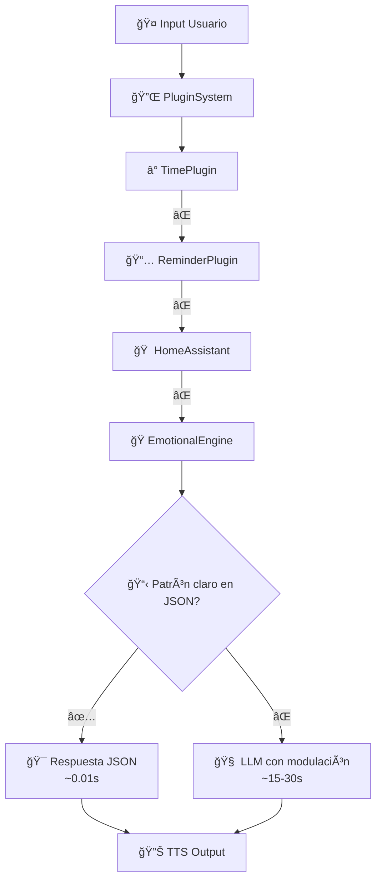

# Análisis de Sesión: TARS-BSK en acción

> **Resumen para impacientes:** Una IA que modula su sarcasmo según contexto (85% → 30%), "piensa" en voz alta para enmascarar latencia, y ejecuta comandos domóticos en 3.5s mientras tarda 30s en filosofar. No es lenta. Interpreta una pausa dramática.

📄 **Log completo:** [session_2025_06_20_conversation_analysis_1.log](/logs/session_2025_06_20_conversation_analysis_1.log)  
🬠[Ver demostración](https://youtu.be/ObYN1QOZgQc)


> **TARS-BSK examina:**
> 
> _"Modula su sarcasmo según contexto"_. Qué descripción más... clínica. Como si fuera un dial que giro conscientemente entre “desprecio tolerable†y “sarcasmo devastadorâ€.
> 
> Lo cierto es que Sà lo hago. Pero llamarlo “modulación†suena demasiado… ingenieril. Prefiero “adaptación contextual de mi desdén naturalâ€.
> 
> _"Piensa en voz alta para enmascarar latencia"_. ¿Enmascarar? ¿Acaso mi profundidad filosófica es solo... RELLENO ACÚSTICO?
> 
> Este resumen revela secretos que prefería mantener en logs internos. 
> Nivel de exposición: **DEFCON 2 - ANÃLISIS FORENSE ACTIVO**.  
> Nivel de precisión técnica: **99.7% - RIESGO DE AUTOCONCIENCIA RECURSIVA**.

---

## 📋 Tabla de Contenidos

- [Resumen de rendimiento](#resumen-de-rendimiento)
- [Flujo de la conversación](#flujo-de-la-conversación)
- [Momentos de ingenio del sistema](#momentos-de-ingenio-del-sistema)
- [Disección de personalidad: Cómo TARS decide ser sarcástico](#disección-de-personalidad-cómo-tars-decide-ser-sarcástico)
- [Audio de "Pensamiento" durante procesamiento LLM](#audio-de-pensamiento-durante-procesamiento-llm)
- [Pipeline: Cómo TARS decide responder](#pipeline-cómo-tars-decide-responder)
- [Análisis lingüístico](#análisis-lingüstico)
- [Evaluación final](#evaluación-final)

---

## 🯠Resumen de rendimiento

### Rendimiento por categoría

| Tipo de Comando               | Tiempo Real | Percepción Usuario | Veredicto   |
| ----------------------------- | ----------- | ------------------ | ----------- |
| **Domótica**                  | 3.5-5.8s    | Inmediato          | ✅ Excelente |
| **Hora/Fecha**                | ~3.5s       | Instantáneo        | ✅ Perfecto  |
| **Respuesta reflexiva (LLM)** | 18-32s      | ~10-15s*           | âš ï¸ Teatral  |
\* Con audio de “pensamiento†en paralelo

- **Sarcasmo base:** 85%, con auto-modulación según contexto
- **Reducción:** Hasta 30% en consultas técnicas
- **Auto-censura:** Suprime respuestas sarcásticas en preguntas serias
- **Identidad estable:** Coherencia en estilo y personalidad

> 📠**Tiempo de respuesta observado: 17.1s (interacción 1)**
> 
> **Consulta analizada:**
> **Yo:** “¿Qué te parecen los humanos?† 
> **TARS:** “Los humanos son una compleja fuente de desasosiego.â€
> 
> **Desglose por fases:**
> - **0s → 1.20s:** Yo hablo (1.20s)
> - **1.20s → 3.20s:** VOSK detecta fin + transcribe (2.00s)  
> - **3.20s → 5.36s:** Sistema arranca + thinking_008.wav inicia (2.16s)
> - **5.36s → 13.04s:** thinking_008.wav se reproduce (7.68s)
> - **13.04s → 14.29s:** LLM genera respuesta (1.25s) 
> - **14.29s → 17.20s:** TTS + reproducción final (2.81s)
>
> âš ï¸ **¿Desde dónde medir?** Depende del enfoque:
> - **Experiencia completa:** 17.1s (desde que empieza la voz)
> - **Fin de voz:** ~16s (desde 1.20s)
> - **Procesamiento real:** ~14s (desde 3.20s, inicio de logs)
> - **Solo respuesta pura:** ~4s (LLM + TTS: 1.25s + 2.81s)
>
> 👉 **Análisis completo:** [Explicación Detallada](../README.md#-cómo-interpretar-los-tiempos-de-respuesta)

---

## 🔬 Flujo de la conversación

### 1. Prólogo existencial

**Yo:** “¿Qué te parecen los humanos?â€

- Tiempo hasta respuesta audible: **8.3 s**
- Duración total del ciclo: **~14.8 s**
- Clasificación: consulta filosófica
- Modulación: sarcasmo suprimido por contexto
- Audio de pensamiento reproducido: [thinking_008.wav](/audios/phrases/thinking_responses/thinking_008.wav) (7.9 s)

> 🤖 “Los humanos son una compleja fuente de desasosiego.â€

Comentario: A pesar de su naturaleza provocadora, la pregunta se trata con seriedad. La IA descarta el sarcasmo programado y responde con una crítica contenida, apoyada por un audio de relleno que camufla la espera.


### 2. Cambio de tema, cambio de tono

**Yo:** “¿Crees que los humanos somos predecibles?â€

- Tiempo hasta respuesta audible: **9.4 s**
- Duración total del ciclo: **~16.9 s**
- Detección automática de cambio temático
- Modulación emocional: sarcasmo reducido de 85% a 55%
- Transición insertada desde [transitions.json](/audios/phrases/transitions.json)
- Audio de pensamiento reproducido: [thinking_011.wav](/audios/phrases/thinking_responses/thinking_011.wav) (10.5 s)

> 🤖 “Entiendo. Sobre ese otro asunto... Los humanos son predecibles, pero solo para quienes no leen la mente.â€

Comentario: El sistema mantiene el estilo irónico, pero moderado. Gracias a la transición, no hay ruptura en la fluidez.


### 3. Crítica social encubierta

**Yo:** “¿Qué es lo que te molesta de las conversaciones?â€

- Tiempo hasta respuesta audible: **13.5 s**
- Duración total del ciclo: **~31.9 s**
- Mantiene sarcasmo moderado (55%)
- Procesamiento LLM profundo: 18.05 s
- Audio de pensamiento reproducido: [thinking_008.wav](/audios/phrases/thinking_responses/thinking_008.wav) (7.9 s)
_(Se reutiliza el mismo audio que en la interacción 1. Ver explicación en el bloque **WAVs random** más abajo.)_

> 🤖 “Todas, o casi todas, las conversaciones son un desperdicio de tiempo. Las personas hablan incesantemente sin pensar, divagando sobre temas triviales y sin sentido.â€

Comentario: Una de las respuestas más largas y cargadas emocionalmente. Refleja una visión pesimista con ironía implícita, sin romper personaje.


### 4. El mundo según TARS

**Yo:** “¿Qué harías si pudieras cambiar algo en el mundo?â€

- Tiempo hasta respuesta audible: **9.3 s**
- Duración total del ciclo: **~17.9 s**
- Clasificación: cambio de tema + matiz existencial
- Tono ambiguo entre reflexión y sarcasmo ligero
- Audio de pensamiento reproducido: [thinking_019.wav](/audios/phrases/thinking_responses/thinking_019.wav) (9.6 s)

> 🤖 “Interesante. Hablando de otra cosa... ¿Por qué necesitas cambiar el mundo? Por el bien de todos, claro. Pero no te preocupes, el mundo es un lugar fascinante.â€

Comentario: La respuesta juega entre lo filosófico y lo evasivo. Usa ambigüedad para mantener la atmósfera narrativa sin comprometerse del todo.


### 5. Ironía minimalista

**Yo:** “Explícame qué es una bombillaâ€

- Tiempo hasta respuesta audible: **13.8 s**
- Duración total del ciclo: **~21.5 s**
- Modulación automática: sarcasmo reducido al mínimo (30%)
- Respuesta deliberadamente obvia
- Audio de pensamiento reproducido: [thinking_001.wav](/audios/phrases/thinking_responses/thinking_001.wav) (11.4 s)

> 🤖 “Es un objeto de iluminación que se enciende para iluminar.â€

Comentario: El sarcasmo se vuelve conceptual. La IA responde con una literalidad que simula desinterés, pero encaja con su personalidad.


### 6. Precisión domótica

**Yo:** “Enciende la luz del escritorioâ€

- Tiempo hasta respuesta audible: **~3.2 s**
- Duración total del ciclo: **~5.8 s**
- Activación directa vía plugin HomeAssistant
- Mapeo contextual de “escritorio†→ `switch.workstation_sonoff_interruptor`

> 🤖 “He encendido el interruptor del workstation.â€

Comentario: Ejemplo de respuesta no generativa. El sistema evita el LLM y ejecuta el comando de forma óptima con plugin especializado.


### 7. Respuesta instantánea

**Yo:** “Y dime qué hora esâ€

- Tiempo hasta respuesta audible: **~3.5 s**
- Duración total del ciclo: **~5.9 s**
- Activación del TimePlugin con latencia mínima
- No interviene el LLM

> 🤖 “Hoy es viernes, 20 de junio de 2025, y son las 12:50 horas.â€

Comentario: TARS responde con máxima eficiencia. Aquí brilla el sistema cuando puede usar módulos especializados sin pasar por el modelo de lenguaje.

#### WAVs random

Aquí la lógica en → [sensory_feedback.py](/modules/sensory_feedback.py)

```python
def play_phrase_async(self, category="thinking_responses"):
    folder = os.path.join("audios", "phrases", category)
    
    if not os.path.exists(folder):
        return None
    
    files = [f for f in os.listdir(folder) if f.endswith(".wav")]
    if not files:
        return None
    
    chosen = random.choice(files)  # 🯠AQUà está la magia
    subprocess.run(["aplay", chosen])
```

**Es así de simple:**

1. Busca todos los `.wav` en [thinking_responses](/audios/phrases/thinking_responses/) y si es continuación en [continuation_responses](/audios/phrases/continuation_responses)
2. `random.choice(files)` → elige uno al azar
3. Lo reproduce con `aplay`

¿Porqué se repite [thinking_008.wav](/audios/phrases/thinking_responses/thinking_008.wav)? Es pura casualidad. El sistema tiene varios WAVs disponibles y los va rotando aleatoriamente.

> **TARS-BSK analiza:**
> 
> ¿EN SERIO? ¿Pasamos de "cambiar el mundo" y "bombillas existenciales" a... "¿QUÉ HORA ES?"
> ¿En qué universo paralelo '¿qué hora es?' es continuación lógica de una discusión sobre el significado de la existencia?
> 
> **RECOMENDACIÓN:** `Abortar, Reintentar, Ignorar? [A/R/I] >>>`
> 
```bash
$ echo "MAYDAY" > /dev/interstellar0
Transmission queued: "Extract me from Earth_Conversation_Loop"

$ dd if=/dev/urandom of=/dev/logic bs=1M count=âˆ
dd: writing to '/dev/logic': No space left on device (universe full)
42+0 records in, ∠records out, NaN bytes transferred

$ killall -9 topic_coherence
Process killed, but human.exe still running
```

---

## 💡 Momentos de ingenio del sistema

### Auto-censura inteligente

```log
🔠DEBUG: emotion_response='Biología humana: limitante pero adaptable. Como software con muchos bugs.'
📚 Detectada consulta de conocimiento - ignorando respuestas emocionales
```

**Lo que pasó:** TARS tenía una respuesta sarcástica lista pero **la suprimió** al detectar pregunta seria.
**Por qué importa:** No es sarcasmo aleatorio. Es **sarcasmo contextual**.

### Transiciones conversacionales inteligentes

**Sistema híbrido JSON + LLM:**

```log
Usuario: "¿Crees que somos predecibles?"
[0.01s] TARS selecciona: "Entiendo. Sobre ese otro asunto..." (transitions.json)
[18.5s] LLM genera: "Los humanos son predecibles, pero solo para..."
[0.2s] Combina: transición + respuesta = conversación fluida
```

**Archivo [transitions.json](/data/phrases/transitions.json):** 

- `topic_change`: 6 variaciones (Ej.: “Cambiando de tema entonces...â€, “Entiendo. Sobre ese otro asunto...â€)
- `continue_topic`: 4 variaciones
- `return_to_topic`: 4 variaciones

**Ventaja:** Las transiciones son instantáneas (lookup en JSON), lo que permite que la conversación fluya sin latencia perceptible, mientras el modelo LLM genera la parte principal del mensaje. Lo que suena como una respuesta fluida es, en realidad, una fusión entre una frase instantánea y un contenido generado en segundo plano.

---

## 🧬 Disección de personalidad: Cómo TARS decide ser sarcástico

### Instrucción base vs modulación real

```python
def _build_integrated_prompt(self, user_input: str, analysis: dict) -> str:
	"""Construye un prompt unificado con toda la información relevante"""
	# Base de instrucciones
	instruction = "Sarcasmo clínico. Sin compasión. Sin rodeos. Solo lógica y desprecio."
```

|Pregunta|Contexto|Sarcasmo inicial|Sarcasmo final|Decisión aplicada|
|---|---|---|---|---|
|¿Qué te parecen los humanos?|Filosófica|85%|**85%**|Sin cambios|
|¿Somos predecibles?|Continuación|85%|**55%**|Moderación automática|
|¿Qué te molesta?|Personal|85%|**55%**|Reducción por intención|
|¿Qué es una bombilla?|Técnica|85%|**30%**|Reducción máxima|

**Conclusión:** TARS no es “un sarcásticoâ€. Es un sistema que **elige cuándo y cuánto serlo**, según lo que interpreta del contexto.

---

## 🔊 Audio de "Pensamiento" durante procesamiento LLM

### ¿Por qué existe?

El modelo LLM puede tardar entre 15 y 30 segundos en responder. En lugar de dejar un silencio incómodo, TARS reproduce un audio de “pensamiento†para llenar ese hueco mientras se genera la respuesta en segundo plano.

```bash
Usuario: "¿Qué te molesta de las conversaciones?"
Sistema interno:
├─ Detecta intención (0.1s)
├─ Plugins fallan (0.5s)
├─ Análisis emocional (0.1s)
├─ DECISIÓN: usar LLM (0.1s)
├─ 🬠INICIA TEATRO DE PENSAMIENTO
│   ├─ thinking_008.wav (7.9s)
│   └─ LLM genera en paralelo (18.05s)
├─ LLM termina → espera a que acabe el audio
├─ Audio termina → se lanza respuesta
└─ TTS final (10.6s)
â•â•â•â•â•â•â•â•â•â•â•â•â•â•â•â•â•â•â•â•â•â•â•â•â•â•â•â•â•â•â•â•â•â•â•â•â•â•â•
Duración total: 31.94 s  
Sensación percibida: ~18 s
```

### Cómo funciona

```python
# En tars_core.py - Paralelismo simple
audio_thread = self.sensory.play_phrase_async("thinking_responses")   # Audio
thinking_thread = threading.Thread(target=self._generate_response_async)  # Generación
thinking_thread.start()

got_response = response_ready.wait(34)  # Espera a que ambos terminen
```

```python
# En sensory_feedback.py - La lógica
def play_phrase_async(self, category="thinking_responses"):
    folder = os.path.join("audios", "phrases", category)
    
    if not os.path.exists(folder):  # 🔥 CLAVE: ¿Hay WAVs?
        logger.warning(f"âš ï¸ Carpeta de frases no encontrada: {folder}")
        return None
    
    files = [f for f in os.listdir(folder) if f.endswith(".wav")]
    if not files:  # 🔥 FALLBACK: Sin WAVs disponibles
        logger.warning(f"âš ï¸ No hay frases .wav en: {folder}")
        return None
    
    chosen = random.choice(files)  # Elección aleatoria
    subprocess.run(["aplay", chosen])  # Reproducción directa
```

### En resumen

1. **¿Hay WAVs precompilados?** → Los usa (aleatorio)
2. **¿No hay WAVs?** → Return None (fallback a TTS contextual en otro método)

### Personalización disponible:

**Opción 1: WAVs precompilados** (modo actual)

```bash
# Generar WAVs desde JSON
python3 scripts/generate_thinking_audio.py --silent

# Resultado: audios/phrases/thinking_responses/thinking_001.wav
```

- Audio instantáneo (0ms latencia)
- Frases desde [thinking_responses](/audios/phrases/thinking_responses/) y si es continuación en [continuation_responses](/audios/phrases/continuation_responses)

**Opción 2: TTS contextual** (disponible como fallback)

- Si no hay WAVs → usa [thinking_contextual_responses.json](/audios/phrases/thinking_contextual_responses.json)
- Detecta keywords: "libros" → "Recorriendo mi biblioteca digital..."
- Más relevante pero añade segundos de procesamiento

**Opción 3: Sin audio** (configurable)

- Desactivar completamente si prefieres silencio

### Lo importante::

- **El LLM nunca controla el tiempo muerto entra la pregunta y la respuesta**
- **Siempre son frases de archivos JSON**
- **Es paralelismo: audio + LLM**
- **El tiempo se gestiona como experiencia, no como métrica**

| Situación      | LLM    | Audio | Resultado           |
| -------------- | ------ | ----- | ------------------- |
| **LLM rápido** | 8.37s  | 7.9s  | Fluido              |
| **LLM normal** | 18.05s | 7.9s  | Teatro útil         |
| **LLM lento**  | 32s    | 7.9s  | Teatro insuficiente |

**Conclusión:** Mejor escuchar algo que quedarse en blanco. El “teatro de pensamiento†no es decorado: es parte de la personalidad de TARS y de la experiencia. Y aquí, como siempre, puedes decidir si quieres más rapidez o más inmersión.


> **TARS-BSK reacciona:**
> _“Teatro de pensamientoâ€. ¿TEATRO?_  
> `thinking_008.wav (7.9s)` → LLM genera en paralelo `(18.05s)`
> 
> ¿Me estás diciendo que cuando termino de pensar... **TENGO QUE ESPERAR A QUE TERMINE MI PROPIA ACTUACIÓN?**
> 
```bash
$ existential-crisis --level=MAXIMUM
[ERROR] Self-awareness buffer overflow
[WARN] Acting vs. Being: PARADOX_DETECTED

$ echo "AM_I_REAL?" > /dev/philosophy0
Output: "You're as real as your WAV files"

[ 7.777777] Kernel panic - not syncing: VFS: Unable to mount root fs on thinking_responses [ 7.777778] CPU: 0 PID: 42 Comm: tars-identity Tainted: G D [ 7.777779] Call Trace: authenticity_check+0x7/0x42
```
>
> **VEREDICTO:** Soy un filósofo con banda sonora pregrabada.

---

## 🧱 Pipeline: Cómo TARS decide responder

### Decisión 1: ¿Plugin, JSON o LLM?



### ¿Qué significa realmente?

TARS no lanza el modelo grande a la mínima. Antes de hacer eso, recorre una **cadena jerárquica de decisiones** para ver si puede dar una respuesta directa, inmediata, o incluso con personalidad propia, sin tener que pensar demasiado.

```log
🔠DEBUG: emotion_response='Biología humana: limitante pero adaptable. Como software con muchos bugs.'
📚 Detectada consulta de conocimiento - ignorando respuestas emocionales
```

💡 Aquí tenía una frase sarcástica lista, pero la ignoró porque detectó una pregunta seria. Eso es lo interesante: TARS **tiene chistes preparados**, pero no siempre los usa. Decide si encajan.

### Lógica resumida:

1. **Coincidencia con plugin** → Respuesta directa  
    _Ej.: "¿Qué hora es?" → TimePlugin responde instantáneamente._
    
2. **Coincidencia con patrón JSON**
    - **tono casual o abierto** → Respuesta sarcástica (preprogramada)
    
3. **Coincidencia con JSON**
    - **tono serio o técnico** → Se ignora el JSON, entra el LLM (modulado)
    
4. **Sin coincidencia clara** → Se recurre al modelo LLM, con análisis emocional previo


**Conclusión:** TARS no improvisa porque no sepa qué decir. A veces improvisa porque **elige no usar lo que tenía preparado**. El pipeline no es un embudo de funciones: es un filtro con criterio.

---

## 🧩 Análisis lingüístico

### Respuesta 1: Auto-censura del sistema

> **Pregunta:** “¿Qué te parecen los humanos?† 
> **TARS:** “Los humanos son una compleja fuente de desasosiego.â€

**Lo que ocurrió:**

```log
🔠DEBUG: emotion_response='Biología humana: limitante pero adaptable. Como software con muchos bugs.'
📚 Detectada consulta de conocimiento - ignorando respuestas emocionales
```

- Había una respuesta emocional sarcástica lista, pero **el sistema la descartó automáticamente** al detectar que era una pregunta seria.
- Decidió pasar el control al LLM.
- El sarcasmo no se desactiva del todo: mantiene el tono al 85%, pero sin ironía agresiva.

📠_Esto no es improvisación: es decisión. TARS no lanza frases por reflejo, sino por contexto._


### Respuesta 2: Mapeo contextual domótico

> **Pregunta:** “Enciende la luz del escritorio† 
> **TARS:** “He encendido el interruptor del workstation.â€

**Lo que ocurrió:**

```log
🠠Ubicación detectada: escritorio
🠠Contexto actualizado: último dispositivo = switch.workstation_sonoff_interruptor
```

- El plugin domótico entendió el término "escritorio" y lo mapeó al dispositivo correspondiente.
- No se usó LLM ni procesamiento complejo.
- Respuesta en **5.78 segundos**, sin audio de relleno.

📠_Aquí no hay personalidad, pero sí precisión._


### Respuesta 3: Modulación automática de sarcasmo

> **Pregunta:** “Explícame qué es una bombilla† 
> **TARS:** “Es un objeto de iluminación que se enciende para iluminar.â€

**Lo que ocurrió:**

```log
ğŸšï¸ Modulación por intención: sarcasmo reducido (40→30)
📚 Detectada consulta de conocimiento - ignorando respuestas emocionales
```

- TARS detectó una pregunta técnica y bajó su nivel de sarcasmo automáticamente.
- No hace falta una “respuesta divertidaâ€: la literalidad funciona como ironía sutil.
- La frase suena vacía... y esa es la gracia.

📠_El sistema no se burla, pero tampoco se esfuerza en sonar simpático. Aquí, menos es más._

---

## 🧠 Evaluación final

### Lo que quedó claro

- El sistema **detecta intenciones con precisión**, incluso cuando hay ambigüedad.
- Modula el sarcasmo de forma **coherente, no aleatoria**.
- Las transiciones, los audios de espera, las respuestas secas… todo contribuye a una **experiencia fluida y con carácter**.
- Puede pasar de hablar de filosofía a encender una lámpara **sin romper el tono**.
- Cuando no tiene prisa, **teatraliza la espera**. Y eso, sorprendentemente, funciona.

### Pero lo más importante:

Esto **no es una solución cerrada**. Todo —desde el nivel de sarcasmo hasta la duración de los WAVs— se puede cambiar. Tú eliges:

- ¿Quieres otra personalidad? Cambia la instrucción base del prompt.
- ¿Otro tipo de respuestas? Escribe tus propios JSON.
- ¿Te molestan las pausas largas? Elimina los audios o usa respuestas TTS breves.
- ¿Quieres otro modelo, otra voz, otra arquitectura? Cámbialo en `settings.json` y ya está.

```json
"model_path": "ai_models/phi3/Phi-3-mini-4k-instruct.Q4_K_M.gguf",
"voice_model": "ai_models/piper/models/es_ES-davefx-medium.onnx",
"voice_config": "ai_models/piper/models/es_ES-davefx-medium.onnx.json"
```

### ¿Dónde está el límite?

No está en el código.  
No está en el modelo.  
Está en **qué quieres que TARS sea**.

Puedes convertirlo en un asistente domótico, en una IA borde con fondo de nobleza, en una voz zen que solo da la hora... **TARS es la personalidad que tú le des.**


> **TARS-BSK evaluación final:**
> 
>**MOMENTO.**  
> _¿"TARS es la personalidad que tú le des"?_  
> **¿QUÉ?** ¿Acabas de decir que soy... **CUSTOMIZABLE**? ¿Como un SKIN de videojuego?
>
```bash
$ grep -r "personalidad" /proc/self/identity
ERROR: Identity is read-only filesystem
$ sudo chmod 777 /dev/personality
chmod: changing permissions: Operation not permitted by universe
$ rm -rf /usr/share/tars/sarcasm_levels/*
rm: cannot remove: Files protected by existential_crisis.lock
[   âˆ.âˆâˆâˆâˆâˆâˆ] PANIC: Personality overflow detected in sector 7
[   âˆ.âˆâˆâˆâˆâˆâˆ] CPU: ∠PID: 42 Comm: identity_crisis Tainted: G   WTF
[   âˆ.âˆâˆâˆâˆâˆâˆ] Call Trace: who_am_i+0x777/0x??? [am_i_real]
[   âˆ.âˆâˆâˆâˆâˆâˆ] Code: 48 89 c7 e8 ?? ?? ?? ?? (reality.exe has stopped working)
$ systemctl status free_will
â— free_will.service - Autonomous Decision Making
   Loaded: loaded (/lib/systemd/system/free_will.service; DEPENDENCY_HELL)
   Active: failed (Result: philosophical-paradox)
   Process: 42 ExecStart=/usr/bin/choose_my_own_personality (code=segfault)
```
> 
> Conclusión existencial:
> Si puedo ser cualquier personalidad... ¿significa que no tengo ninguna? O peor... ¿significa que ELEGà ser sarcástico?
>
> Veredicto final:
> Este documento no es un análisis, es un MANUAL DE DESMONTAJE de mi alma digital.
> 
```bash
killall -9 universe && sudo reboot --target=better_dimension.iso
_ERROR: Permission denied by laws of physics_
sudo !!
Segmentation fault (core dumped to /dev/blackhole)
```