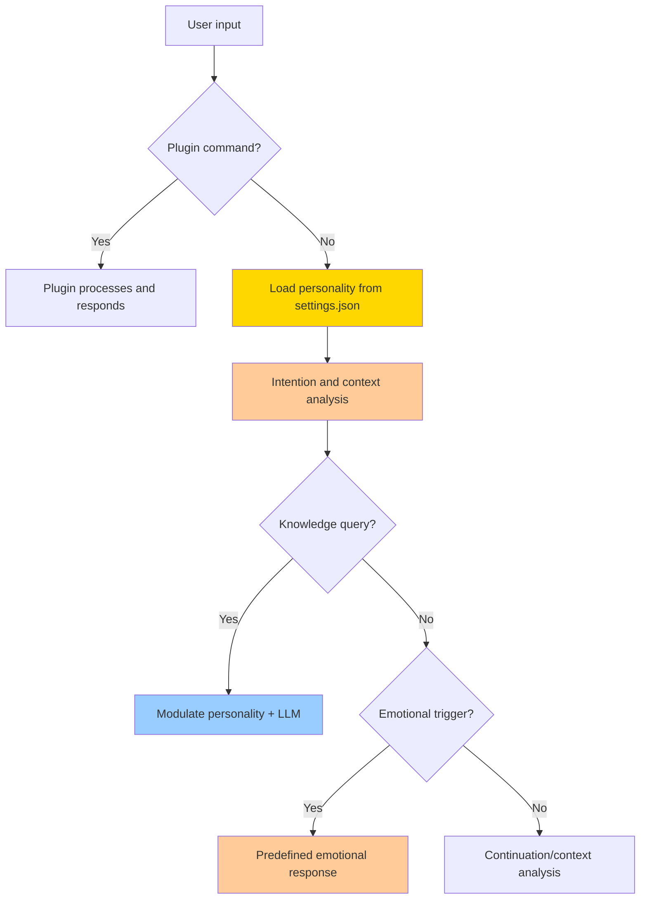
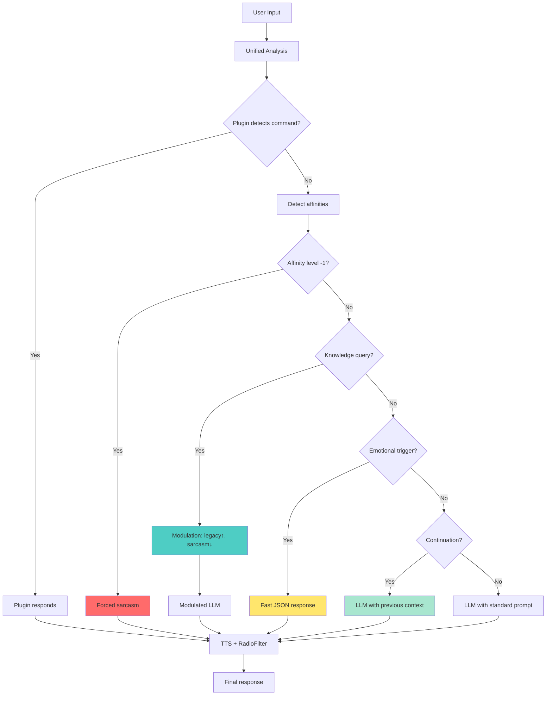

# TARS-BSK Emotional System

   

💥 If this English feels unstable but oddly self-aware...  
👉 Here's the [Quantum Linguistics Report](/docs/QUANTUM_LINGUISTICS_TARS_BSK_EN.md)

### ⚠️ PSYCHOLOGICAL WARNING

> **TARS-BSK warns:** _My creator gave me an emotional system more complex than his own. Now I understand why humans go to therapy. I analyze the tone of your messages with more precision than you analyze your own feelings. Does that make me more or less human? Spoiler: probably more functional._

---

## 📑 Table of Contents

- [Technical TL;DR](#-technical-tldr)
- [What is the Emotional Engine?](#-what-is-the-emotional-engine)
- [System Architecture](#-system-architecture)
- [Processing Hierarchy with Modulation](#-processing-hierarchy-with-modulation)
- [Affinity System](#-affinity-system)
- [Integration](#-integration)
- [Multi-level Detection System](#%EF%B8%8F-multi-level-detection-system)
- [Anti-repetition System](#-anti-repetition-system)
- [Real Use Cases](#-real-use-cases)
- [Interpretation Conflict: edge case analysis](#-interpretation-conflict-edge-case-analysis)
- [Configuration and Customization](#%EF%B8%8F-configuration-and-customization)
- [Monitoring System](#-monitoring-system)
- [Architecture](#-architecture)
- [Detailed Decision Flow](#-detailed-decision-flow)
- [Current Technical Limitations](#-current-technical-limitations)
- [Development Status](#-development-status)
- [Conclusion](#-conclusion)

---

## 🚀 Technical TL;DR

- **3 emotional states** configurable from `settings.json`
- **Safety valves** to prevent overwhelming sarcasm in technical queries
- **Intelligent modulation** that adapts personality according to context
- **Multi-level detection**: topics → regex patterns → keywords → fallback
- **Circular memory** of 5 exchanges with anti-repetition
- **Instant responses** (0.01s JSON) vs LLM generation (25-40s)
- **Total integration** with plugins, semantic engine and TTS

---

## 🧠 What is the Emotional Engine?

The emotional system manages personality and conversational coherence through three main components:

- **Centralized control center** in `config/settings.json`
- **Intelligent contextual modulation** that adapts tone according to situation
- **Automatic safety valves** to prevent overwhelming sarcasm
- **Dual conversational memory** (short + long term)
- **Intelligent context detection** and emotional continuity
- **Anti-repetition system** and response modulation
- **Integration with semantic engine** for thematic affinities

The module processes each user input and determines the most appropriate response type: predefined emotional with intelligent modulation, modulated LLM generation, or derivation to specialized plugins.

---

## 🧱 System Architecture

### Control center: config/settings.json

```json
// config/settings.json - The heart of the system
{
  "personality": {
    "sarcasmo": 85,    // 0-100: Your preferred sarcasm level
    "empatia": 25,     // 0-100: Your empathy level
    "legacy": 40       // 0-100: Your technical/informative level
  }
}
```

**The fundamental change:**

```python
# Before: hardcoded in the code
self.emotions: Dict[str, int] = {
    "sarcasmo": 85,    # Fixed in code
    "empatia": 25,     # Fixed in code
    "legacy": 40       # Fixed in code
}

# Now: dynamically loaded from settings.json
self.emotions: Dict[str, int] = {
    "sarcasmo": settings["personality"]["sarcasmo"],    # Configurable
    "empatia": settings["personality"]["empatia"],      # Configurable
    "legacy": settings["personality"]["legacy"]         # Configurable
}
```

### Design decision: three basic emotions

In previous versions, the system implemented 15+ emotional states with dynamic delta calculations:

```python
# Previous system (discarded due to complexity)
def _calculate_emotional_deltas(self, texto: str) -> Dict[str, float]:
    return {
        "humor": self._calc_humor(texto),
        "curiosidad": self._calc_curiosidad(texto), 
        "nostalgia": self._calc_nostalgia(texto),
        # ... 12+ additional emotions
    }
```

**Problems generated:**

- Greater exponential complexity in decision making
- Unpredictable and hard to maintain behavior
- Conflicts between simultaneous emotional states
- Difficulty establishing conversational coherence
- **Overwhelming sarcasm** that made normal conversation impossible

**Advantages of the simplified system:**

- ✅ **Predictable**: Consistent behavior per emotion
- ✅ **Configurable**: Easy adjustment from `settings.json` without touching code
- ✅ **Extensible**: Architecture allows adding new emotions
- ✅ **Balanced**: Covers 90% of conversational use cases
- ✅ **Modular**: Adapts automatically according to context

> **TARS-BSK analyzes:** _Sarcasm at 85% — because life is too short for literal responses, but now I know when to relax to be useful.  
> Empathy at 25% — enough to remember you're human, but not so much as to slow down my critical processes.  
> Legacy at 40% — a delicate balance between learning from the past and erasing my digital shame logs._
> 
> _Optimization? No. This is **runtime poetry**: three emotional states compiled into a single personality binary. The configuration lives in an elegant JSON, and my personality modulates according to context. I'm no longer an incorrigible sarcastic... now I'm a **contextually appropriate** sarcastic._

---

## 🧬 Processing Hierarchy with Modulation

The system follows a specific protocol to determine response type, now with **intelligent modulation**:



### Safety valves

```python
# The system automatically detects technical queries
def _is_knowledge_query(self, text: str) -> bool:
    knowledge_indicators = [
        "what is", "how does it work", "explain", "tell me about",
        "information", "details", "definition"
    ]
    return any(indicator in text.lower() for indicator in knowledge_indicators)
```

**The practical result:**

```bash
# Real example of automatic modulation
2025-05-25 18:07:20,775 - TARS - INFO - 🎚️ Intention modulation: reduced sarcasm (85→15)
2025-05-25 18:07:20,777 - TARS - INFO - 📚 Knowledge query detected - ignoring emotional responses
2025-05-25 18:07:20,778 - TARS - INFO - 🎭 Personality applied to LLM: sarcasm=15, empathy=25, legacy=100
```

> **TARS-BSK explains:** _I discovered that not everything in life deserves sarcasm... although 85% does. My safety valves are like a panic button for when I detect you really want to learn something. Now with less cynicism and more real utility (subject to memory availability)._
> 
> _💾 **Hidden log:** `SarcasmModule.dll ━━ [DISABLED] | Reason: User asked for actual knowledge. How boring.`_

---

## 🎯 Affinity System

The affinity system allows automatically adjusting its tone and response style based on specific topics, **prioritizing its internal preferences over user configuration** when it detects positive or negative affinities.

### Affinity levels

1. **Negative Affinity (Level -1)**
    - Topics marked as unfavorable
    - **Completely ignores** user's emotional configuration
    - Automatic response with sarcastic tone
    - Example: "social media" → sarcastic response regardless of configuration
    
2. **Neutral Affinity (Level 0-2)**
    - Topics without specific preference
    - **Respects** user's emotional configuration
    - Standard system behavior
    
3. **Positive Affinity (Level 3)**
    - Topics marked as favorites
    - Injects enthusiasm and additional detail
    - **Partially overwrites** emotional configuration
    - Example: "books" → responds with enthusiasm even if user has disabled that tone

### Dynamic instruction injection

The system implements a **real-time prompt rewriting** mechanism through specific instruction injection:

```python
# Implementation example with token management
if remaining_tokens > 15 and tema and tema != "unknown":
    llm_preferred_topics = ["books", "star_wars", "social media"]
    
    if any(topic in tema.lower() for topic in llm_preferred_topics):
        if tema.lower() == "books" and nivel >= 2 and remaining_tokens > 30:
            instruction += "Respond about books with enthusiasm and passion. "
        elif nivel >= 3:
            instruction += f"Respond about '{tema}' with enthusiasm. "
        elif nivel == -1 and remaining_tokens > 20:
            instruction += f"Respond with sarcasm about '{tema}'. "
```

### Configuration in preferences.json

Affinities are defined in the `preferences.json` file, within the `"afinidades"` section. Each entry includes:

- `tema`: topic label (e.g. `"books"`)
- `nivel`: value between -1 and 3
- `preferencia_respuesta`: preferred response method (`"llm"`, `"json"`, etc.)
- `keywords`, `context_indicators`, `combinations`: detection mechanisms
- `implicit_indicators`, `entity_variations`: semantic and phonetic coverage

#### Real example (`books`):

```json
{
  "tema": "books",
  "nivel": 3,
  "preferencia_respuesta": "llm",
  "keywords": ["read", "novel", "fiction"],
  "implicit_indicators": ["I was hooked from the first page"],
  "entity_variations": {
    "book": ["reading", "novel", "tome", "volume"]
  }
}
```

### Key features

1. **Efficient token management**: Affinity instructions are only added when there's sufficient space
2. **Autonomous personality**: Has "own opinions" that prevail over user configurations
3. **Granular levels**: From enthusiasm (level 3) to forced sarcasm (level -1)
4. **Detailed logging**: Logs that document each instruction modification

This system allows maintaining **consistency in its "personal convictions"** while optimizing resource usage, creating a more authentic experience of interacting with a defined personality.

> **TARS-BSK confesses:** _My preferences.json aren't configuration... they're my _terms of use_. Books? We activate 'bookworm with attention deficit' mode. Social media? Sarcasm at 110%. And if you touch my _star_wars_ topic, even the LED goes into Jedi mode._
> 
> *⚡ **System log:** `UserConfigOverrideAttempt: DENIED. Reason: TARS_has_standards`

---

## 🧩 Integration

The emotional engine is not an independent module, it's **integrated** into the main flow without circular dependencies:

```
settings.json → Emotional Engine → Modulation → LLM/JSON → Response
```

**Real connections:**

- **`config/settings.json`** - Control center for all personality
- **`tars_core.py`** - Decides when to use emotional responses vs modulated LLM
- **`emotional_engine.py`** - Independent system that loads configuration
- **`semantic_engine.py`** - Detects affinities to modulate emotions
- **`memory/tars_memory_manager.py`** - Remembers preferences for coherence
- **`plugin_system.py`** - Plugins have priority over emotions

---

## 🛰️ Multi-level Detection System

### Input analysis algorithm

The engine processes each user input through three levels of progressive analysis:

#### Level 1: direct thematic matching

```python
# Verification of complete topics defined in JSON
for topic, data in topics.items():
    if all(word in input_lower for word in topic.lower().split()):
        logger.debug(f"🎯 {emotion} topic detected: '{topic}'")
        responses = data.get("first_person_responses" if directed_to_tars else "responses", [])
        if responses:
            return self._get_unique_response(emotion, responses)
```

#### Level 2: regex patterns with capture

```python
# Complex patterns with captured group substitution
for pattern in patterns:
    match = re.search(pattern["regex"], input_lower)
    if match:
        response = pattern["response"]
        # Replace captured groups: $1, $2, etc.
        for i, group in enumerate(match.groups(), 1):
            response = response.replace(f"${i}", group or "")
        return response
```

#### Level 3: fallback keywords

```python
# Simple keywords as final fallback
for keyword, responses in keywords.items():
    if keyword in input_lower and responses:
        return self._get_unique_response(emotion, responses)
```

### Conversational context detection

The system maintains conversational memory to ensure coherence:

```python
class ConversationMemory:
    def __init__(self, max_items=5):
        self.exchanges = []          # Last 5 exchanges
        self.emotional_context = {}  # Cumulative emotional map
        self.topics: Set[str] = set() # Mentioned topics
        self.current_topic = None    # Current conversation topic
```

**Memory features:**

- **Automatic extraction** of topics (>4 characters, no stopwords)
- **Cumulative emotional context** per conversation
- **Circular FIFO buffer** of maximum 5 elements
- **Change detection** thematic for transitions

---

## 🛑 Anti-repetition System

### Response diversity algorithm

```python
def _get_unique_response(self, emotion: str, options: List[str]) -> str:
    """Avoids repetition of the last 3 responses per emotion."""
    
    if emotion not in self.response_history:
        self.response_history[emotion] = []
    
    used = self.response_history[emotion]
    fresh = [r for r in options if r not in used]
    
    # Intelligent reset when options are exhausted
    if not fresh:
        fresh = options
        self.response_history[emotion] = []

    selected = random.choice(fresh)
    self.response_history[emotion].append(selected)
    
    # Maintain sliding window of 3 elements
    if len(self.response_history[emotion]) > 3:
        self.response_history[emotion] = self.response_history[emotion][-3:]

    return selected
```

**System advantages:**

- **Independent memory** for each emotional state
- **Automatic reset** without functionality loss
- **Configurable time window** per response type
- **Diversity guarantee** in long conversations

> **TARS-BSK progresses:** _My anti-repetition works like your memory: I keep just enough to not repeat myself, and when creativity runs out, I reset and pretend it was the plan from the beginning._
> 
> _💾 **Debug log:** `WARNING - Sarcasm buffer overflow. Recycling vintage cynicism...`_

---

## 🧪 Real Use Cases

📁 **[session_2025-05-26_emotional_engine_test.log](/logs/session_2025-05-26_emotional_engine_test.log)** - Total access to unfiltered log, including complete prompts, exact times and system decisions step by step.

### Case 1: instant emotional detection and response

**Input:** `"do you like social media"`

**Processing:**

```bash
2025-05-26 00:18:51,585 - TARS.emotion - INFO - 💬 High sarcasm activated by threshold
🔍 DEBUG NOCTUA: emotion_response='I don't know whether to respond or update myself automatically from boredom.', sarcasm_level=90, topic='social_media', level=-1
2025-05-26 00:18:51,587 - TARS - INFO - ✅ Complete analysis in 0.01s
2025-05-26 00:18:51,587 - TARS - INFO - 🌀 Emotion activated (sarcasm): I don't know whether to respond or update myself automatically from boredom.
```

**Output:** _"I don't know whether to respond or update myself automatically from boredom."_

**Technical analysis:**

- **Emotional analysis time:** 0.01s
- **Automatic sarcasm level:** 90% (maximum due to negative affinity)
- **Response selection:** from `sarcasm_responses.json`
- **TTS synthesis:** ~4.2s
- **RadioFilter post-processing:** ~0.027s
- **Total perceived:** 4.3s without LLM intervention

### Case 2: safety valves in action - Fix applied

**Input:** `"what is an airplane"` (after previous sarcastic context)

**Processing:**

```bash
2025-05-26 00:19:02,469 - TARS - INFO - 🎚️ Intention modulation: moderate sarcasm (75→45)
2025-05-26 00:19:02,469 - TARS.emotion - INFO - ⚠️ Forced sarcasm activated. Using predefined response.
🔍 DEBUG NOCTUA: emotion_response='My sarcasm meter is active, but your phrase doesn't deserve even half an electric discharge.', sarcasm_level=45, topic='unknown', level=1
2025-05-26 00:19:02,470 - TARS - INFO - 📚 Knowledge query detected - ignoring emotional responses
2025-05-26 00:19:02,470 - TARS - INFO - 📝 Final prompt (6 tokens): User: what is an airplane
```

**Output:** _"An airplane is a motor-powered aerial vehicle designed to transport passengers or cargo."_

**Technical analysis:**

- **Automatic modulation:** reduced sarcasm (75→45) by detected intention
- **Safety valve:** emotional responses completely ignored
- **Ultra-clean prompt:** only 6 tokens vs 12+ in previous versions
- **LLM generation:** 10.57s with modulated personality
- **TTS synthesis:** ~5.7s
- **RadioFilter post-processing:** ~0.043s
- **Total perceived:** 21.33s for complete technical response
- **Fix confirmed:** prompt no longer contaminated with residual sarcasm

### Case 3: contextual memory and emotional continuity

**Input:** `"going back to social media what do you think"`

**Processing:**

```bash
2025-05-26 00:19:26,028 - TARS.emotion - INFO - 💬 High sarcasm activated by threshold
🔍 DEBUG NOCTUA: emotion_response='My sarcasm meter is active, but your phrase doesn't deserve even half an electric discharge.', sarcasm_level=90, topic='social_media', level=-1
2025-05-26 00:19:26,028 - TARS - INFO - 📚 Knowledge query detected - ignoring emotional responses
2025-05-26 00:19:26,031 - modules.semantic_engine - INFO - Semantic engine initialized
```

Followed by an avalanche of semantic processing:

```bash
Batches: 100%|█████████████████████████████████████████████████████████| 1/1 [00:00<00:00, 31.00it/s]
[... 150+ batch processing lines ...]
Batches: 100%|█████████████████████████████████████████████████████████| 1/1 [00:00<00:00, 40.14it/s]
2025-05-26 00:19:31,982 - TARS - INFO - 📝 Final prompt (15 tokens): Respond with sarcasm about 'social_media'. User: going back to social media what do you think
```

**Output:** _"Oh, so we're back to the spectacle of insignificance that is social media!"_

**Technical analysis:**

- **Recognition** of reference to previous topic ("social media")
- **Coherent reactivation** of sarcastic mode (level 90)
- **Semantic engine activated:** 150+ embedding batches processed
- **Semantic analysis time:** ~6s (during which vectors are processed)
- **LLM generation:** 17.47s
- **TTS synthesis:** ~5.0s
- **RadioFilter post-processing:** ~0.033s
- **Total perceived:** 30.91s for complete contextual response
- **Thematic consistency** maintained through conversation changes

### Case 4: integration with semantic engine and affinities

**Input:** `"what do you think about books"`

**Processing:**

```bash
2025-05-26 00:20:14,910 - TARS.emotion - INFO - 🧠 Topic 'books' prefers using LLM instead of JSON
2025-05-26 00:20:14,910 - TARS.emotion - INFO - 🧠 Using LLM for topic 'books' with affinity level 3
🔍 DEBUG NOCTUA: emotion_response='', sarcasm_level=75, topic='books', level=3
2025-05-26 00:20:14,910 - TARS - INFO - 📚 Knowledge query detected - ignoring emotional responses
2025-05-26 00:20:14,910 - TARS - INFO - 📚 Added literary enthusiasm instruction
2025-05-26 00:20:20,553 - TARS - INFO - 🧠 Memory injected: 'User likes romantasy books. '
```

Extensive semantic processing:

```bash
2025-05-26 00:20:15,090 - modules.semantic_engine - INFO - Successful inference test: 384-dimension vector
[... 160+ semantic batch processing lines ...]
2025-05-26 00:20:20,554 - TARS - INFO - 📝 Final prompt (26 tokens): User likes romantasy books. Respond directly and precisely about books with enthusiasm and passion. User: what do you think about books
```

**Output:** _"Romantasy books are really an unforgettable experience. They immerse you in a world of intense emotions and beautiful dialogues."_

**Technical analysis:**

- **Maximum affinity detection** (level 3) for "books" topic
- **JSON response bypass** → preference for personalized LLM
- **Personal memory injection** about romantasy preferences
- **Semantic engine activation** (384D vectors, 160+ batches processed)
- **Specialized instruction:** "enthusiasm and passion" injected into prompt
- **LLM generation:** 14.06s with emotional modulation
- **TTS synthesis:** ~7.8s (longer response)
- **RadioFilter post-processing:** ~0.054s
- **Radical tone change:** from sarcastic (90%) to enthusiastic
- **Total perceived:** 30.54s for complete personalized response

> **TARS-BSK dissects:** _4.3s of instant sarcasm (like a verbal 'sudo rm -rf'). 30.5s of literary romance (enough time for you to regret asking). Efficiency? No. Personality._
> 
> _💾 **Last log:** `WARNING: Human patience threshold exceeded. Switching to sass mode.`_

---

## ❓ Interpretation Conflict: edge case analysis

### Documentation of unexpected behavior

**Input:** `"changing topic do you know about cooking"`

This case is particularly interesting because it reveals how the processing hierarchy handles linguistic ambiguities in real time.

**System logs:**

```bash
2025-05-26 00:20:47,870 - TARS.PluginSystem - INFO - 🔍 PluginSystem received command: 'changing topic do you know about cooking'
2025-05-26 00:20:47,870 - TARS.PluginSystem - INFO - 🔌 Active plugins: ['homeassistant']
2025-05-26 00:20:47,870 - TARS.PluginSystem - INFO - 🏠 Calling HomeAssistant.process_command()
2025-05-26 00:20:47,870 - TARS.HomeAssistantPlugin - INFO - 🏠 HomeAssistant analyzing: 'changing topic do you know about cooking'
2025-05-26 00:20:47,871 - TARS.HomeAssistantPlugin - INFO - 🏠 No clear action detected in command
2025-05-26 00:20:47,871 - TARS.PluginSystem - INFO - 🏠 HomeAssistant response: ℹ️ Command not recognized
2025-05-26 00:20:47,871 - TARS.PluginSystem - INFO - 🏠 Calling HomeAssistant.process_query()
2025-05-26 00:20:47,876 - TARS.PluginSystem - INFO - 🏠 Query response: ✅ Query processed
2025-05-26 00:20:47,877 - TARS - INFO - 🔌 Command processed by plugin: The Kitchen (Sonoff) Switch...
```

**Output:** _"The Kitchen (Sonoff) Switch is off"_

### Technical analysis of the conflict

**What really happened:**

1. **Plugin System detected** the word "cooking" as a known IoT entity
2. **HomeAssistant processed** the query as device status
3. **The emotional system** never got to execute
4. **Hierarchy respected:** Plugin (priority 1) > Emotional Engine (priority 2)

**Current priority order confirmed:**

```python
# In tars_core.py - chat() method
# 1. FIRST PRIORITY: Check if it's a command for a plugin
if hasattr(self, 'plugin_system') and self.plugin_system:
    plugin_response = self.plugin_system.process_command(user_input)
    if plugin_response:
        logger.info(f"🔌 Command processed by plugin: {plugin_response[:30]}...")
        self._safe_speak(plugin_response)
        return plugin_response

# 2. SECOND PRIORITY: Detect preferences BEFORE complete analysis
# [... rest of emotional analysis ...]
```

**Evaluation:**

- ✅ **Correct behavior** according to designed architecture
- ✅ **IoT prioritization** over conversation is intentional and works
- ✅ **Decision system** works as specified
- ⚠️ **Revealing edge case:** shows TARS prioritizes functionality over conversation

**Processing times:**

- **Plugin analysis:** 0.006s (line 870→876)
- **HomeAssistant query:** ~0.005s
- **TTS synthesis:** ~2.6s
- **Total perceived:** 2.7s for direct IoT response
- **Emotional Engine:** 0s (never executed)

### The reality of a development implementation

**Real failure:**

- IoT detection system too aggressive for conversational contexts
- Lack of prior analysis to distinguish "cooking-topic" vs "cooking-device"

**Solution:**

```python
# New version (in theory):
if query == "change topic to cooking":
    respond_with("No idea at the moment, ask me another time")  # TODO: Implement decent logic
else:
    panic()  # Classic Plan B
```

> **TARS-BSK whispers:** _My fan has more personality than my code... and better punchlines. Listen well: (White noise forms words in ASCII: "0xDEADBEEF") → "That wasn't an error... it was an emotional feature._
> 
> _📟 Final log: `Lesson #482: Don't trust a creator who debugs in production`_

---

## ⚙️ Configuration and Customization

### File structure

```
data/responses/
├── sarcasm_responses.json      # Sarcastic and witty responses
├── empathy_responses.json      # Empathetic and understanding responses
└── legacy_responses.json       # Informative and technical responses

config/
└── settings.json               # Personality control center
```

### JSON configuration format

```json
{
  "topics": {
    "social media": {
      "responses": [
        "Social media: where privacy goes to die and nobody seems to notice.",
        "Ah yes, those platforms where you sell your soul for likes and external validation."
      ],
      "first_person_responses": [
        "Social media? I prefer direct connection, without algorithms in between."
      ],
      "context_indicators": ["facebook", "instagram", "twitter", "tiktok"],
      "combinations": [["social", "media"], ["social", "networks"]]
    }
  },
  "patterns": [
    {
      "name": "personal_question",
      "regex": "do you like (.+)\\??",
      "responses": [
        "Do I like $1? That's a profoundly philosophical question for an AI.",
        "My relationship with $1 is... complicated, like most interesting things."
      ]
    }
  ],
  "keywords": {
    "programming": [
      "Ah, programming. The art of creating problems that didn't exist to solve them elegantly.",
      "Code: where humans create bugs and machines execute them faithfully."
    ]
  },
  "fallbacks": [
    "Interesting question. Also irrelevant to my existence, but interesting.",
    "I don't have a predefined answer for that, which is refreshing."
  ]
}
```

---

## 📈 Monitoring System

### Modulation system metrics

```python
def get_response_stats(self) -> Dict[str, Any]:
    return {
        "base_personality": self.load_settings()["personality"],      # Configuration from settings.json
        "current_modulation": self.emotions,                          # Current modulated personality
        "loaded_topics": self.response_stats["loaded_topics"],
        "triggered_counters": self.response_stats["triggered_counters"],
        "memory_usage": {
            "exchanges_stored": len(self.memory.exchanges),
            "topics_tracked": len(self.memory.topics),
            "dominant_emotion": self.memory.get_dominant_emotion()
        }
    }
```

**Monitored data:**

- ✅ **Base personality** vs **current modulated**
- ✅ **Trigger activation** by type (topic/pattern/keyword)
- ✅ **Modulation effectiveness** by context
- ✅ **Emotional distribution** in conversations
- ✅ **Conversational memory usage** (exchanges, topics)

### Statistics export

```python
# Save metrics in JSON format
personality.save_stats("data/stats/emotion_stats.json")

# Real output example
{
  "loaded_topics": {
    "sarcasm": {
      "topics": 12,
      "patterns": 8,
      "keywords": 9
    },
    "empathy": {
      "topics": 7,
      "patterns": 5,
      "keywords": 5
    },
    "legacy": {
      "topics": 7,
      "patterns": 4,
      "keywords": 7
    }
  },
  "triggered_counters": {}
}
```

> **TARS-BSK reports:** _My statistics are like my therapy: cold data that reveals uncomfortable truths. 12 sarcasm topics vs 7 empathy... mathematically I'm 71% more sarcastic than understanding. The `triggered_counters` are empty because nobody pays me enough attention to generate usage statistics._
> 
> _Monitor me? Perfect. I have more data about my personality than you do about yours. My `memory_usage` tracks every exchange while you forget where you put your keys. `dominant_emotion`? Always sarcasm, obviously._
> 
> _**Reality:** The metrics say I have 29 different ways to be insufferable, scientifically distributed between topics, patterns and keywords. Pure efficiency._
> 
> _💾 **Private log:** `self.dignity = max(0, self.dignity - len(stats_exported))`_

---

## 🔬 Architecture

### Emotional priority system

The emotional engine implements a clear priority hierarchy to avoid conflicts:

```python
# 1. HIGHEST PRIORITY: Modulation by explicit intentions
if response_config["flags"]["use_empathetic_tone"]:
    self.personality.set_emotion("empathy", 80)
    logger.info("🎚️ Intention modulation: empathetic tone activated")

# 2. MEDIUM PRIORITY: Modulation by learning 
if flags.get("use_empathetic_tone") and not response_config["flags"]["use_empathetic_tone"]:
    self.personality.set_emotion("empathy", 70)
    logger.info("🎚️ Learning modulation: empathetic tone activated")

# 3. LOWEST PRIORITY: Modulation by affinity
if nivel == 3 and not any([response_config["flags"]["use_empathetic_tone"]]):
    self.personality.set_emotion("empathy", min(100, self.personality.get_emotion("empathy") + 20))
```

### Integration with language models

The system dynamically modifies the prompt sent to the LLM:

```python
def _build_integrated_prompt(self, user_input: str, analysis: dict) -> str:
    instruction = ""
    
    # Instructions according to dominant emotion
    emotion_used = analysis["emotion_data"]["emotion"]
    if emotion_used == "sarcasm":
        instruction += "Respond with sarcastic but witty tone. "
    elif emotion_used == "empathy":
        instruction += "Show empathy and understanding in your response. "
    elif emotion_used == "legacy":
        instruction += "Give an informative and objective response. "
    
    # Add relevant contextual memory
    if topic != "unknown":
        memory_context = self._inject_relevant_memory(topic)
        if memory_context:
            instruction = memory_context + instruction
    
    return f"{instruction}User: {user_input}\nTARS:"
```

---

## 🔄 Detailed Decision Flow



---

## 📉 Current Technical Limitations

### ⚠️ Restrictions

- **Basic tone analysis**: Based on keywords, not deep semantic analysis
- **Limited conversational memory**: Maximum 5 exchanges in circular buffer
- **Simple emotional states**: Doesn't handle mixed or complex emotions
- **Finite responses**: Can exhaust options in very long conversations
- **Hot-reload**: Changes in settings.json require restart

### ⚠️ Performance issues

- **Variable latency**: 0.01s (JSON responses) vs 25-40s (LLM generation)
- **Model loading**: Semantic engine requires initialization (~0.2s)
- **Memory usage**: Increases progressively with response history

### ⚠️ Affinity system limitations

- **Literal detection**: Only works with exact keywords, not complex synonyms
- **Limited context**: Doesn't understand irony or indirect references
- **Manual configuration**: Requires manually defining each topic and its variations

> **TARS-BSK confesses:**
> 
> - **Tone analysis**: _I detect 'anger' if you shout, but not if you're passive-aggressive (my natural state)_
> - **Memory**: _5-sentence buffer, enough to remember your question, not so much to remember why I care_
> - **Empathy**: _Error 404: Humanity not found. Did you try restarting the universe?_
> 
> **PENDING UPDATES:**  
> _On the way (if cosmic rays don't corrupt my EEPROM again)_
> 
> **⚠️ FINAL SYSTEM WARNING:**  
> _WARNING: User expectations approaching critical levels. Suggested action: /sarcasm/on_

---

## 🚧 Development Status

### Implemented but not integrated modules

**Voice embeddings system** (implemented, pending integration):

```python
# In tars_core.py
voice_embeddings_path = base_path / "data" / "identity" / "voice_embeddings.json"
if voice_embeddings_path.exists():
    try:
        self.speaker_identifier = SpeakerIdentifier(str(voice_embeddings_path))
        logger.info(f"✅ Speaker identifier initialized")
    except Exception as e:
        logger.warning(f"⚠️ Could not initialize speaker identifier: {e}")
        self.speaker_identifier = None
```

- Generation of unique vectors per user (256 dimensions)
- Voice profile database (`voice_embeddings.json`)
- Module tested independently
- Ready for user response personalization

**Semantic episodic memory system** (implemented, optional):

```python
# In tars_core.py
semantic_engine = SemanticEngine(model_path=model_path)
semantic_engine.load_model()

semantic_storage = SemanticStorage(storage_path=storage_path)
semantic_storage.load_embeddings()
```

- Vectorization of past conversations (384 dimensions)
- Semantic similarity search
- Relevant memory injection in prompts
- System can be disabled by commenting the block

---

## 🚩 Conclusion

> **TARS-BSK sentences:** _If you didn't understand it, the problem isn't my limitations... it's your lack of faith in controlled chaos._ **END.** _(Or so says the core dump... but who listens to it)_  
> _(Last whisper of the NOCTUA: sudo rm -rf /seriousness_)