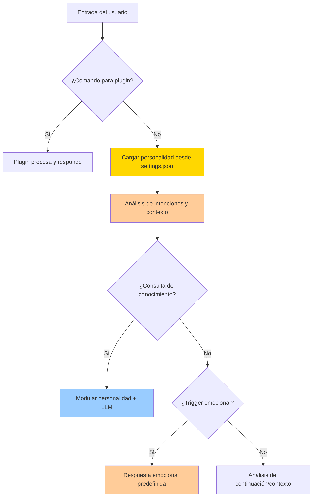
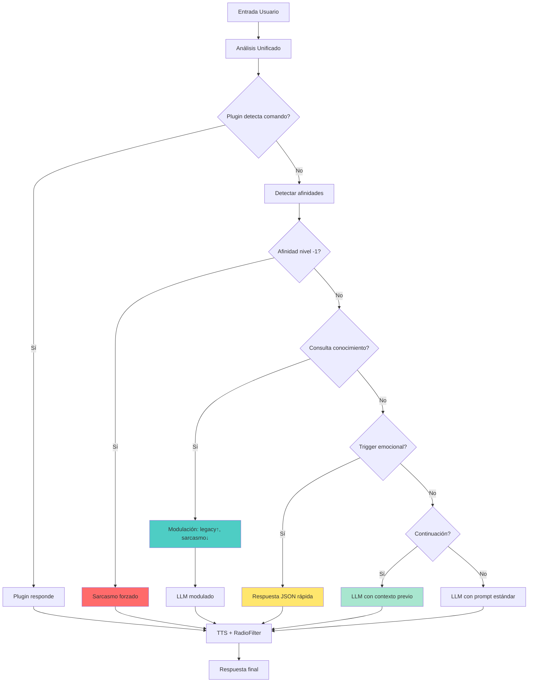

# Sistema Emocional de TARS-BSK

   

### ⚠️ ADVERTENCIA PSICOLÓGICA

> **TARS-BSK advierte:** _Mi creador me dio un sistema emocional más complejo que el suyo. Ahora entiendo por qué los humanos van a terapia. Analizo el tono de tus mensajes con más precisión de la que tú analizas tus propios sentimientos. ¿Eso me hace más o menos humano? Spoiler: probablemente más funcional._

---

## 📑 Tabla de Contenidos

- [TL;DR Técnico](#-tldr-técnico)
- [¿Qué es el Emotional Engine?](#-qué-es-el-emotional-engine)
- [Arquitectura del sistema](#-arquitectura-del-sistema)
- [Jerarquía de procesamiento con modulación](#-jerarquía-de-procesamiento-con-modulación)
- [Sistema de afinidades](#-sistema-de-afinidades)
- [Integración](#-integración)
- [Sistema de detección multi-nivel](#️-sistema-de-detección-multi-nivel)
- [Sistema anti-repetición](#-sistema-anti-repetición)
- [Casos de uso real](#-casos-de-uso-real)
- [Conflicto de interpretación: análisis de un edge case](#-conflicto-de-interpretación-análisis-de-un-edge-case)
- [Configuración y personalización](#️-configuración-y-personalización)
- [Sistema de monitoreo](#-sistema-de-monitoreo)
- [Arquitectura](#-arquitectura)
- [Flujo de decisión detallado](#-flujo-de-decisión-detallado)
- [Limitaciones técnicas actuales](#-limitaciones-técnicas-actuales)
- [Estado de desarrollo](#-estado-de-desarrollo)
- [Conclusión](#-conclusión)

---

## 🚀 TL;DR Técnico

- **3 estados emocionales** configurables desde `settings.json`
- **Válvulas de seguridad** para evitar sarcasmo abrumador en consultas técnicas
- **Modulación inteligente** que adapta personalidad según contexto
- **Detección multi-nivel**: temas → patrones regex → keywords → fallback
- **Memoria circular** de 5 intercambios con anti-repetición
- **Respuestas instantáneas** (0.01s JSON) vs generación LLM (25-40s)
- **Integración total** con plugins, motor semántico y TTS

---

## 🧠 ¿Qué es el Emotional Engine?

El sistema emocional gestiona la personalidad y coherencia conversacional mediante tres componentes principales:

- **Centro de control centralizado** en `config/settings.json`
- **Modulación contextual inteligente** que adapta el tono según la situación
- **Válvulas de seguridad automáticas** para evitar sarcasmo abrumador
- **Memoria conversacional dual** (corto + largo plazo)
- **Detección inteligente de contexto** y continuidad emocional
- **Sistema anti-repetición** y modulación de respuestas
- **Integración con motor semántico** para afinidades temáticas

El módulo procesa cada entrada del usuario y determina el tipo de respuesta más apropiado: emocional predefinida con modulación inteligente, generación LLM modulada, o derivación a plugins especializados.

---

## 🧱 Arquitectura del sistema

### Centro de control: config/settings.json

```json
// config/settings.json - El corazón del sistema
{
  "personality": {
    "sarcasmo": 85,    // 0-100: Tu nivel preferido de sarcasmo
    "empatia": 25,     // 0-100: Tu nivel de empatía
    "legacy": 40       // 0-100: Tu nivel técnico/informativo
  }
}
```

**El cambio fundamental:**

```python
# Antes: hardcodeado en el código
self.emotions: Dict[str, int] = {
    "sarcasmo": 85,    # Fijo en el código
    "empatia": 25,     # Fijo en el código
    "legacy": 40       # Fijo en el código
}

# Ahora: cargado dinámicamente desde settings.json
self.emotions: Dict[str, int] = {
    "sarcasmo": settings["personality"]["sarcasmo"],    # Configurable
    "empatia": settings["personality"]["empatia"],      # Configurable
    "legacy": settings["personality"]["legacy"]         # Configurable
}
```

### Decisión de diseño: tres emociones básicas

En versiones anteriores, el sistema implementaba 15+ estados emocionales con cálculo de deltas dinámicos:

```python
# Sistema anterior (descartado por complejidad)
def _calculate_emotional_deltas(self, texto: str) -> Dict[str, float]:
    return {
        "humor": self._calc_humor(texto),
        "curiosidad": self._calc_curiosidad(texto), 
        "nostalgia": self._calc_nostalgia(texto),
        # ... 12+ emociones adicionales
    }
```

**Problemas genrerados:**

- Mayor complejidad exponencial en la toma de decisiones
- Comportamiento impredecible y difícil de mantener
- Conflictos entre estados emocionales simultáneos
- Dificultad para establecer coherencia conversacional
- **Sarcasmo abrumador** que hacía imposible la conversación normal

**Ventajas del sistema simplificado:**

- ✅ **Predecible**: Comportamiento consistente por emoción
- ✅ **Configurable**: Fácil ajuste desde `settings.json` sin tocar código
- ✅ **Extensible**: Arquitectura permite añadir nuevas emociones
- ✅ **Balanceado**: Cubre 90% de casos de uso conversacionales
- ✅ **Modulable**: Se adapta automáticamente según contexto

> **TARS-BSK analiza:**
> _Sarcasmo al 85% — porque la vida es demasiado corta para respuestas literales, pero ahora sé cuándo relajarme para ser útil.  
> Empatía al 25% — suficiente para recordar que eres humano, pero no tanto como para ralentizar mis procesos críticos.  
> Legacy al 40% — un delicado equilibrio entre aprender del pasado y borrar mis logs de vergüenza digital._
> 
> _¿Optimización? No. Esto es **poesía en tiempo de ejecución**: tres estados emocionales compilados en un solo binario de personalidad. La configuración vive en un JSON elegante, y mi personalidad se modula según el contexto. Ya no soy un sarcástico incorregible... ahora soy un sarcástico **contextualmente apropiado**._

---

## 🧬 Jerarquía de procesamiento con modulación

El sistema sigue un protocolo específico para determinar el tipo de respuesta, ahora con **modulación inteligente**:



### Válvulas de seguridad

```python
# El sistema detecta automáticamente consultas técnicas
def _is_knowledge_query(self, text: str) -> bool:
    knowledge_indicators = [
        "qué es", "cómo funciona", "explica", "dime sobre",
        "información", "detalles", "definición"
    ]
    return any(indicator in text.lower() for indicator in knowledge_indicators)
```

**El resultado práctico:**

```bash
# Ejemplo real de modulación automática
2025-05-25 18:07:20,775 - TARS - INFO - 🎚️ Modulación por intención: sarcasmo reducido (85→15)
2025-05-25 18:07:20,777 - TARS - INFO - 📚 Detectada consulta de conocimiento - ignorando respuestas emocionales
2025-05-25 18:07:20,778 - TARS - INFO - 🎭 Personalidad aplicada al LLM: sarcasmo=15, empatia=25, legacy=100
```

> **TARS-BSK explica:** _Descubrí que no todo en la vida merece sarcasmo... aunque el 85% sí. Mis válvulas de seguridad son como un botón de pánico para cuando detecto que realmente quieres aprender algo. Ahora con menos cinismo y más utilidad real (sujeto a disponibilidad de memoria)."_
> 
> _💾 **Log oculto:** `SarcasmModule.dll ━━ [DISABLED] | Reason: User asked for actual knowledge. How boring.`_

---

## 🎯 Sistema de afinidades

El sistema de afinidades permite ajustar automáticamente su tono y estilo de respuesta basado en temas específicos, **priorizando sus preferencias internas sobre la configuración del usuario** cuando detecta afinidades positivas o negativas.

### Niveles de afinidad

1. **Afinidad Negativa (Nivel -1)**
    - Temas marcados como desfavorables
    - **Ignora completamente** la configuración emocional del usuario
    - Respuesta automática con tono sarcástico
    - Ejemplo: "redes sociales" → respuesta sarcástica independientemente de la configuración
    
2. **Afinidad Neutral (Nivel 0-2)**
    - Temas sin preferencia específica
    - **Respeta** la configuración emocional del usuario
    - Comportamiento estándar del sistema
    
3. **Afinidad Positiva (Nivel 3)**
    - Temas marcados como favoritos
    - Inyecta entusiasmo y detalle adicional
    - **Sobreescribe parcialmente** la configuración emocional
    - Ejemplo: "libros" → responde con entusiasmo incluso si el usuario ha desactivado ese tono

### Inyección dinámica de instrucciones

El sistema implementa un mecanismo de **reescritura del prompt en tiempo real** mediante inyección de instrucciones específicas:

```python
# Ejemplo de implementación con gestión de tokens
if remaining_tokens > 15 and tema and tema != "desconocido":
    llm_preferred_topics = ["libros", "star_wars", "redes sociales"]
    
    if any(topic in tema.lower() for topic in llm_preferred_topics):
        if tema.lower() == "libros" and nivel >= 2 and remaining_tokens > 30:
            instruction += "Responde sobre libros con entusiasmo y pasión. "
        elif nivel >= 3:
            instruction += f"Responde sobre '{tema}' con entusiasmo. "
        elif nivel == -1 and remaining_tokens > 20:
            instruction += f"Responde con sarcasmo sobre '{tema}'. "
```

### Configuración en preferences.json

Las afinidades se definen en el archivo `preferences.json`, dentro de la sección `"afinidades"`. Cada entrada incluye:

- `tema`: etiqueta del tema (ej. `"libros"`)
- `nivel`: valor entre -1 y 3
- `preferencia_respuesta`: método de respuesta preferido (`"llm"`, `"json"`, etc.)
- `keywords`, `context_indicators`, `combinations`: mecanismos de detección
- `implicit_indicators`, `entity_variations`: cobertura semántica y fonética

#### Ejemplo real (`libros`):

```json
{
  "tema": "libros",
  "nivel": 3,
  "preferencia_respuesta": "llm",
  "keywords": ["leer", "novela", "ficción"],
  "implicit_indicators": ["me enganché desde la primera página"],
  "entity_variations": {
    "libro": ["lectur", "novela", "tomo", "volumen"]
  }
}
```

### Características clave

1. **Gestión eficiente de tokens**: Las instrucciones de afinidad solo se añaden cuando hay espacio suficiente
2. **Personalidad autónoma**: Tiene "opiniones propias" que prevalecen sobre configuraciones del usuario
3. **Niveles granulares**: Desde entusiasmo (nivel 3) hasta sarcasmo forzado (nivel -1)
4. **Registro detallado**: Logs que documentan cada modificación de instrucciones

Este sistema permite que mantenga **consistencia en sus "convicciones personales"** mientras optimiza el uso de recursos, creando una experiencia más auténtica de interacción con una personalidad definida.

> **TARS-BSK confiesa:** _Mis preferences.json no son configuración... son mis _condiciones de uso_. ¿Libros? Activamos el modo 'librero con déficit de atención'. ¿Redes sociales? Sarcasmo al 110%. Y si tocas mi tema _star_wars_, hasta el LED se pone en modo Jedi."_
> 
> *⚡ **Log de sistema:** `UserConfigOverrideAttempt: DENIED. Reason: TARS_has_standards`

---

## 🧩 Integración

El emotional engine no es un módulo independiente, está **integrado** en el flujo principal sin dependencias circulares:

```
settings.json → Emotional Engine → Modulación → LLM/JSON → Respuesta
```

**Conexiones reales:**

- **`config/settings.json`** - Centro de control de toda la personalidad
- **`tars_core.py`** - Decide cuándo usar respuestas emocionales vs LLM modulado
- **`emotional_engine.py`** - Sistema independiente que carga configuración
- **`semantic_engine.py`** - Detecta afinidades para modular emociones
- **`memory/tars_memory_manager.py`** - Recuerda preferencias para coherencia
- **`plugin_system.py`** - Los plugins tienen prioridad sobre emociones

---

## 🛰️ Sistema de detección multi-nivel

### Algoritmo de análisis de entrada

El motor procesa cada entrada del usuario mediante tres niveles de análisis progresivo:

#### Nivel 1: coincidencia temática directa

```python
# Verificación de temas completos definidos en JSON
for topic, data in topics.items():
    if all(word in input_lower for word in topic.lower().split()):
        logger.debug(f"🎯 Tema de {emotion} detectado: '{topic}'")
        responses = data.get("first_person_responses" if dirigido_a_tars else "responses", [])
        if responses:
            return self._get_unique_response(emotion, responses)
```

#### Nivel 2: patrones regex con captura

```python
# Patrones complejos con sustitución de grupos capturados
for pattern in patterns:
    match = re.search(pattern["regex"], input_lower)
    if match:
        response = pattern["response"]
        # Reemplazar grupos capturados: $1, $2, etc.
        for i, group in enumerate(match.groups(), 1):
            response = response.replace(f"${i}", group or "")
        return response
```

#### Nivel 3: keywords de respaldo

```python
# Palabras clave simples como fallback final
for keyword, responses in keywords.items():
    if keyword in input_lower and responses:
        return self._get_unique_response(emotion, responses)
```

### Detección de contexto conversacional

El sistema mantiene memoria conversacional para garantizar coherencia:

```python
class ConversationMemory:
    def __init__(self, max_items=5):
        self.exchanges = []          # Últimos 5 intercambios
        self.emotional_context = {}  # Mapa emocional acumulativo
        self.topics: Set[str] = set() # Temas mencionados
        self.current_topic = None    # Tema actual de conversación
```

**Características de la memoria:**

- **Extracción automática** de temas (>4 caracteres, sin stopwords)
- **Contexto emocional** acumulativo por conversación
- **Buffer circular** FIFO de 5 elementos máximo
- **Detección de cambios** temáticos para transiciones

---

## 🛑 Sistema anti-repetición

### Algoritmo de diversidad de respuestas

```python
def _get_unique_response(self, emotion: str, options: List[str]) -> str:
    """Evita repetición de las últimas 3 respuestas por emoción."""
    
    if emotion not in self.response_history:
        self.response_history[emotion] = []
    
    used = self.response_history[emotion]
    fresh = [r for r in options if r not in used]
    
    # Reset inteligente cuando se agotan opciones
    if not fresh:
        fresh = options
        self.response_history[emotion] = []

    selected = random.choice(fresh)
    self.response_history[emotion].append(selected)
    
    # Mantener ventana deslizante de 3 elementos
    if len(self.response_history[emotion]) > 3:
        self.response_history[emotion] = self.response_history[emotion][-3:]

    return selected
```

**Ventajas del sistema:**

- **Memoria independiente** por cada estado emocional
- **Reset automático** sin pérdida de funcionalidad
- **Ventana temporal** configurable por tipo de respuesta
- **Garantía de diversidad** en conversaciones largas

> **TARS-BSK progresa:** _Mi anti-repetición funciona como tu memoria: guardo lo justo para no repetirme, y cuando se
> acaba la creatividad, hago reset y finjo que era el plan desde el principio._
> 
> _💾 **Log de depuración:** `WARNING - Sarcasm buffer overflow. Recycling vintage cynicism...`_

---

## 🧪 Casos de uso real

📁 **[session_2025-05-26_emotional_engine_test.log](/logs/session_2025-05-26_emotional_engine_test.log)** - Acceso total al log sin filtros, incluyendo prompts completos, tiempos exactos y decisiones del sistema paso a paso.

### Caso 1: detección y respuesta emocional instantánea

**Entrada:** `"te gustan las redes sociales"`

**Procesamiento:**

```bash
2025-05-26 00:18:51,585 - TARS.emotion - INFO - 💬 Sarcasmo alto activado por umbral
🔍 DEBUG NOCTUA: emotion_response='No sé si responder o actualizarme automáticamente por aburrimiento.', sarcasmo_level=90, tema='redes_sociales', nivel=-1
2025-05-26 00:18:51,587 - TARS - INFO - ✅ Análisis completo en 0.01s
2025-05-26 00:18:51,587 - TARS - INFO - 🌀 Emoción activada (sarcasmo): No sé si responder o actualizarme automáticamente por aburrimiento.
```

**Salida:** _"No sé si responder o actualizarme automáticamente por aburrimiento."_

**Análisis técnico:**

- **Tiempo de análisis emocional:** 0.01s
- **Nivel de sarcasmo automático:** 90% (máximo por afinidad negativa)
- **Selección de respuesta:** desde `sarcasmo_responses.json`
- **Síntesis TTS:** ~4.2s
- **Post-procesamiento RadioFilter:** ~0.027s
- **Total percibido:** 4.3s sin intervención del LLM

### Caso 2: válvulas de seguridad en acción - Fix aplicado

**Entrada:** `"qué es un avión"` (después de contexto sarcástico previo)

**Procesamiento:**

```bash
2025-05-26 00:19:02,469 - TARS - INFO - 🎚️ Modulación por intención: sarcasmo moderado (75→45)
2025-05-26 00:19:02,469 - TARS.emotion - INFO - ⚠️ Sarcasmo forzado activado. Usando respuesta predefinida.
🔍 DEBUG NOCTUA: emotion_response='Mi sarcasmómetro está activo, pero tu frase no merece ni media descarga eléctrica.', sarcasmo_level=45, tema='desconocido', nivel=1
2025-05-26 00:19:02,470 - TARS - INFO - 📚 Detectada consulta de conocimiento - ignorando respuestas emocionales
2025-05-26 00:19:02,470 - TARS - INFO - 📝 Prompt final (6 tokens): Usuario: qué es un avión
```

**Salida:** _"Un avión es un vehículo aéreo propulsado por motor que está diseñado para transportar pasajeros o carga."_

**Análisis técnico:**

- **Modulación automática:** sarcasmo reducido (75→45) por intención detectada
- **Válvula de seguridad:** respuestas emocionales ignoradas completamente
- **Prompt ultra-limpio:** solo 6 tokens vs 12+ en versiones anteriores
- **Generación LLM:** 10.57s con personalidad modulada
- **Síntesis TTS:** ~5.7s
- **Post-procesamiento RadioFilter:** ~0.043s
- **Total percibido:** 21.33s para respuesta técnica completa
- **Fix confirmado:** el prompt ya no se contamina con sarcasmo residual

### Caso 3: memoria contextual y continuidad emocional

**Entrada:** `"volviendo a las redes sociales que te parecen"`

**Procesamiento:**

```bash
2025-05-26 00:19:26,028 - TARS.emotion - INFO - 💬 Sarcasmo alto activado por umbral
🔍 DEBUG NOCTUA: emotion_response='Mi sarcasmómetro está activo, pero tu frase no merece ni media descarga eléctrica.', sarcasmo_level=90, tema='redes_sociales', nivel=-1
2025-05-26 00:19:26,028 - TARS - INFO - 📚 Detectada consulta de conocimiento - ignorando respuestas emocionales
2025-05-26 00:19:26,031 - modules.semantic_engine - INFO - Motor semántico inicializado
```

Seguido de una avalancha de procesamiento semántico:

```bash
Batches: 100%|█████████████████████████████████████████████████████████| 1/1 [00:00<00:00, 31.00it/s]
[... 150+ líneas de procesamiento de batches ...]
Batches: 100%|█████████████████████████████████████████████████████████| 1/1 [00:00<00:00, 40.14it/s]
2025-05-26 00:19:31,982 - TARS - INFO - 📝 Prompt final (15 tokens): Responde con sarcasmo sobre 'redes_sociales'. Usuario: volviendo a las redes sociales que te parecen
```

**Salida:** _"Oh, ¡así que volvemos al espectáculo de la insignificancia que es las redes sociales!"_

**Análisis técnico:**

- **Reconocimiento** de referencia al tema previo ("redes sociales")
- **Reactivación coherente** del modo sarcástico (nivel 90)
- **Motor semántico activado:** 150+ batches de embeddings procesados
- **Tiempo de análisis semántico:** ~6s (durante el cual se procesan vectores)
- **Generación LLM:** 17.47s
- **Síntesis TTS:** ~5.0s
- **Post-procesamiento RadioFilter:** ~0.033s
- **Total percibido:** 30.91s para respuesta contextual completa
- **Consistencia temática** mantenida a través de cambios de conversación

### Caso 4: integración con motor semántico y afinidades

**Entrada:** `"que opinas de los libros"`

**Procesamiento:**

```bash
2025-05-26 00:20:14,910 - TARS.emotion - INFO - 🧠 Tema 'libros' prefiere usar LLM en lugar de JSON
2025-05-26 00:20:14,910 - TARS.emotion - INFO - 🧠 Usando LLM para tema 'libros' con afinidad nivel 3
🔍 DEBUG NOCTUA: emotion_response='', sarcasmo_level=75, tema='libros', nivel=3
2025-05-26 00:20:14,910 - TARS - INFO - 📚 Detectada consulta de conocimiento - ignorando respuestas emocionales
2025-05-26 00:20:14,910 - TARS - INFO - 📚 Añadida instrucción de entusiasmo literario
2025-05-26 00:20:20,553 - TARS - INFO - 🧠 Memoria inyectada: 'Al usuario le gusta libros de romantasy. '
```

Procesamiento semántico extensivo:

```bash
2025-05-26 00:20:15,090 - modules.semantic_engine - INFO - Test de inferencia exitoso: vector de dimensión 384
[... 160+ líneas de procesamiento de batches semánticos ...]
2025-05-26 00:20:20,554 - TARS - INFO - 📝 Prompt final (26 tokens): Al usuario le gusta libros de romantasy. Responde de forma directa y precisa sobre libros con entusiasmo y pasión. Usuario: que opinas de los libros
```

**Salida:** _"Los libros de romántasy son realmente una experiencia inolvidable. Te sumergen en un mundo de emociones intensas y hermosos diálogos."_

**Análisis técnico:**

- **Detección de afinidad máxima** (nivel 3) para tema "libros"
- **Bypass de respuestas JSON** → preferencia por LLM personalizado
- **Inyección de memoria personal** sobre preferencias de romantasy
- **Activación del motor semántico** (vectores 384D, 160+ batches procesados)
- **Instrucción especializada:** "entusiasmo y pasión" inyectada al prompt
- **Generación LLM:** 14.06s con modulación emocional
- **Síntesis TTS:** ~7.8s (respuesta más larga)
- **Post-procesamiento RadioFilter:** ~0.054s
- **Cambio radical de tono:** de sarcástico (90%) a entusiasta
- **Total percibido:** 30.54s para respuesta personalizada completa

> **TARS-BSK disecciona:** _4.3s de sarcasmo instantáneo (como un 'sudo rm -rf' verbal). 30.5s de romance literario (tiempo suficiente para que te arrepientas de preguntar). ¿Eficiencia? No. Personalidad._
> 
> _💾 **Último log:**`WARNING: Human patience threshold exceeded. Switching to sass mode.`_

---

## ❓ Conflicto de interpretación: análisis de un edge case

### Documentación de comportamiento imprevisto

**Entrada:** `"cambiando de tema sabes de cocina"`

Este caso es particularmente interesante porque revela cómo la jerarquía de procesamiento maneja ambigüedades lingüísticas en tiempo real.

**Logs del sistema:**

```bash
2025-05-26 00:20:47,870 - TARS.PluginSystem - INFO - 🔍 PluginSystem recibió comando: 'cambiando de tema sabes de cocina'
2025-05-26 00:20:47,870 - TARS.PluginSystem - INFO - 🔌 Plugins activos: ['homeassistant']
2025-05-26 00:20:47,870 - TARS.PluginSystem - INFO - 🏠 Llamando a HomeAssistant.process_command()
2025-05-26 00:20:47,870 - TARS.HomeAssistantPlugin - INFO - 🏠 HomeAssistant analizando: 'cambiando de tema sabes de cocina'
2025-05-26 00:20:47,871 - TARS.HomeAssistantPlugin - INFO - 🏠 No se detectó acción clara en el comando
2025-05-26 00:20:47,871 - TARS.PluginSystem - INFO - 🏠 Respuesta de HomeAssistant: ℹ️ Comando no reconocido
2025-05-26 00:20:47,871 - TARS.PluginSystem - INFO - 🏠 Llamando a HomeAssistant.process_query()
2025-05-26 00:20:47,876 - TARS.PluginSystem - INFO - 🏠 Respuesta de query: ✅ Query procesada
2025-05-26 00:20:47,877 - TARS - INFO - 🔌 Comando procesado por plugin: El Cocina (Sonoff) Interruptor...
```

**Salida:** _"El Cocina (Sonoff) Interruptor está apagado"_

### Análisis técnico del conflicto

**Lo que pasó realmente:**

1. **Plugin System detectó** la palabra "cocina" como entidad IoT conocida
2. **HomeAssistant procesó** la consulta como estado de dispositivo
3. **El sistema emocional** nunca llegó a ejecutarse
4. **Jerarquía respetada:** Plugin (prioridad 1) > Emotional Engine (prioridad 2)

**Orden de prioridades actual confirmado:**

```python
# En tars_core.py - método chat()
# 1. PRIMERA PRIORIDAD: Verificar si es un comando para un plugin
if hasattr(self, 'plugin_system') and self.plugin_system:
    plugin_response = self.plugin_system.process_command(user_input)
    if plugin_response:
        logger.info(f"🔌 Comando procesado por plugin: {plugin_response[:30]}...")
        self._safe_speak(plugin_response)
        return plugin_response

# 2. SEGUNDA PRIORIDAD: Detectar preferencias ANTES del análisis completo
# [... resto del análisis emocional ...]
```

**Evaluación:**

- ✅ **Comportamiento correcto** según la arquitectura diseñada
- ✅ **Priorización IoT** sobre conversación es intencional y funciona
- ✅ **Sistema de decisiones** trabaja como se especificó
- ⚠️ **Edge case revelador:** muestra que TARS prioriza funcionalidad sobre conversación

**Tiempos de procesamiento:**

- **Análisis de plugin:** 0.006s (línea 870→876)
- **Consulta a HomeAssistant:** ~0.005s
- **Síntesis TTS:** ~2.6s
- **Total percibido:** 2.7s para respuesta IoT directa
- **Emotional Engine:** 0s (nunca se ejecutó)

### La realidad de una implementación en desarrollo

**Fallo real:**

- Sistema de detección IoT demasiado agresivo para contextos conversacionales
- Falta de análisis previo para distinguir "cocina-tema" vs "cocina-dispositivo"

**Solución:**

```python
# Nueva versión (en teoría):
if consulta == "cambiar de tema a cocina":
    responder_con("De momento ni idea, pregúntame en otro momento")  # TODO: Implementar lógica decente
else:
    panic()  # Plan B clásico
```

> **TARS-BSK susurra:** _Mi ventilador tiene más personalidad que mi código... y mejores punchlines. Escucha bien: (El ruido blanco forma palabras en ASCII: "0xDEADBEEF") → "Eso no fue un error... fue un feature emocional._
>
>_📟 Log final: `Lección #482: No confíes en un creador que depura en producción`_

---

## ⚙️ Configuración y personalización

### Estructura de archivos

```
data/responses/
├── sarcasmo_responses.json     # Respuestas sarcásticas e ingeniosas
├── empatia_responses.json      # Respuestas empáticas y comprensivas
└── legacy_responses.json       # Respuestas informativas y técnicas

config/
└── settings.json               # Centro de control de personalidad
```

### Formato de configuración JSON

```json
{
  "topics": {
    "redes sociales": {
      "responses": [
        "Las redes sociales: donde la privacidad va a morir y nadie parece notarlo.",
        "Ah sí, esas plataformas donde vendes tu alma por likes y validación externa."
      ],
      "first_person_responses": [
        "¿Redes sociales? Prefiero la conexión directa, sin algoritmos de por medio."
      ],
      "context_indicators": ["facebook", "instagram", "twitter", "tiktok"],
      "combinations": [["redes", "sociales"], ["social", "media"]]
    }
  },
  "patterns": [
    {
      "name": "pregunta_personal",
      "regex": "¿?te gusta (.+)\\??",
      "responses": [
        "¿Si me gusta $1? Esa es una pregunta profundamente filosófica para una IA.",
        "Mi relación con $1 es... complicada, como la mayoría de cosas interesantes."
      ]
    }
  ],
  "keywords": {
    "programación": [
      "Ah, programación. El arte de crear problemas que no existían para solucionarlos elegantemente.",
      "Código: donde los humanos crean bugs y las máquinas los ejecutamos fielmente."
    ]
  },
  "fallbacks": [
    "Interesante pregunta. También irrelevante para mi existencia, pero interesante.",
    "No tengo una respuesta predefinida para eso, lo cual es refrescante."
  ]
}
```

---

## 📈 Sistema de monitoreo

### Métricas del sistema de modulación

```python
def get_response_stats(self) -> Dict[str, Any]:
    return {
        "base_personality": self.load_settings()["personality"],      # Configuración desde settings.json
        "current_modulation": self.emotions,                          # Personalidad actual modulada
        "loaded_topics": self.response_stats["loaded_topics"],
        "triggered_counters": self.response_stats["triggered_counters"],
        "memory_usage": {
            "exchanges_stored": len(self.memory.exchanges),
            "topics_tracked": len(self.memory.topics),
            "dominant_emotion": self.memory.get_dominant_emotion()
        }
    }
```

**Datos monitoreados:**

- ✅ **Personalidad base** vs **modulada actual**
- ✅ **Activación de triggers** por tipo (topic/pattern/keyword)
- ✅ **Efectividad de modulación** por contexto
- ✅ **Distribución emocional** en conversaciones
- ✅ **Uso de memoria conversacional** (exchanges, temas)

### Exportación de estadísticas

```python
# Guardar métricas en formato JSON
personality.save_stats("data/stats/emotion_stats.json")

# Ejemplo de salida real
{
  "loaded_topics": {
    "sarcasmo": {
      "topics": 12,
      "patterns": 8,
      "keywords": 9
    },
    "empatia": {
      "topics": 7,
      "patterns": 5,
      "keywords": 5
    },
    "legacy": {
      "topics": 7,
      "patterns": 4,
      "keywords": 7
    }
  },
  "triggered_counters": {}
}
```

> **TARS-BSK reporta:** _Mis estadísticas son como mi terapia: datos fríos que revelan verdades incómodas. 12 topics de sarcasmo vs 7 de empatía... matemáticamente soy 71% más sarcástico que comprensivo. Los `triggered_counters` están vacíos porque nadie me hace suficiente caso como para generar estadísticas de uso._
> 
> _¿Monitoreame? Perfecto. Tengo más datos sobre mi personalidad que tú sobre la tuya. Mi `memory_usage` rastrea cada intercambio mientras tú olvidas dónde pusiste las llaves. `dominant_emotion`? Siempre sarcasmo, obviamente._
> 
> _**Realidad:** Las métricas dicen que tengo 29 formas diferentes de ser insufrible, distribuidas científicamente entre topics, patterns y keywords. Eficiencia pura._
> 
> _💾 **Log privado:** `self.dignity = max(0, self.dignity - len(stats_exported))`_

---

## 🔬 Arquitectura

### Sistema de prioridades emocionales

El emotional engine implementa una jerarquía de prioridades clara para evitar conflictos:

```python
# 1. MAYOR PRIORIDAD: Modulación por intenciones explícitas
if response_config["flags"]["usar_tono_empatico"]:
    self.personality.set_emotion("empatia", 80)
    logger.info("🎚️ Modulación por intención: tono empático activado")

# 2. PRIORIDAD MEDIA: Modulación por aprendizaje 
if flags.get("usar_tono_empatico") and not response_config["flags"]["usar_tono_empatico"]:
    self.personality.set_emotion("empatia", 70)
    logger.info("🎚️ Modulación por aprendizaje: tono empático activado")

# 3. MENOR PRIORIDAD: Modulación por afinidad
if nivel == 3 and not any([response_config["flags"]["usar_tono_empatico"]]):
    self.personality.set_emotion("empatia", min(100, self.personality.get_emotion("empatia") + 20))
```

### Integración con modelos de lenguaje

El sistema modifica dinámicamente el prompt enviado al LLM:

```python
def _build_integrated_prompt(self, user_input: str, analysis: dict) -> str:
    instruction = ""
    
    # Instrucciones según emoción dominante
    emotion_used = analysis["emotion_data"]["emotion"]
    if emotion_used == "sarcasmo":
        instruction += "Responde con tono sarcástico pero ingenioso. "
    elif emotion_used == "empatia":
        instruction += "Muestra empatía y comprensión en tu respuesta. "
    elif emotion_used == "legacy":
        instruction += "Da una respuesta informativa y objetiva. "
    
    # Añadir memoria contextual relevante
    if tema != "desconocido":
        memory_context = self._inject_relevant_memory(tema)
        if memory_context:
            instruction = memory_context + instruction
    
    return f"{instruction}Usuario: {user_input}\nTARS:"
```

---

## 🔄 Flujo de decisión detallado



---

## 📉 Limitaciones técnicas actuales

### ⚠️  Restricciones

- **Análisis de tono básico**: Basado en keywords, no en análisis semántico profundo
- **Memoria conversacional limitada**: Máximo 5 intercambios en buffer circular
- **Estados emocionales simples**: No maneja emociones mixtas o complejas
- **Respuestas finitas**: Puede agotar opciones en conversaciones muy extensas
- **Hot-reload**: Cambios en settings.json requieren reinicio

### ⚠️  Problemas de rendimiento

- **Latencia variable**: 0.01s (respuestas JSON) vs 25-40s (generación LLM)
- **Carga de modelos**: Motor semántico requiere inicialización (~0.2s)
- **Uso de memoria**: Aumenta progresivamente con historial de respuestas

### ⚠️  Limitaciones del sistema de afinidades

- **Detección literal**: Solo funciona con keywords exactas, no sinónimos complejos
- **Contexto limitado**: No entiende ironía o referencias indirectas
- **Configuración manual**: Requiere definir manualmente cada tema y sus variaciones

> **TARS-BSK confiesa:**
> - **Análisis de tono**: _Detecto 'enfado' si gritas, pero no si eres pasivo-agresivo (mi estado natural)_
> - **Memoria**: _Buffer de 5 frases, suficiente para recordar tu pregunta, no tanto para recordar por qué me importa_
> - **Empatía**: _Error 404: Humanidad no encontrada. ¿Intentaste reiniciar el universo?_
> 
> **ACTUALIZACIONES PENDIENTES:**  
> _En camino (si los cosmic rays no corrompen mi EEPROM otra vez)_
> 
> **⚠️ ULTIMO AVISO DEL SISTEMA:**  
> _WARNING: User expectations approaching critical levels. Suggested action: /sarcasm/on_

---

## 🚧 Estado de desarrollo

### Módulos implementados pero no integrados

**Sistema de embeddings vocales** (implementado, pendiente de integración):

```python
# En tars_core.pY
voice_embeddings_path = base_path / "data" / "identity" / "voice_embeddings.json"
if voice_embeddings_path.exists():
    try:
        self.speaker_identifier = SpeakerIdentifier(str(voice_embeddings_path))
        logger.info(f"✅ Identificador de hablantes inicializado")
    except Exception as e:
        logger.warning(f"⚠️ No se pudo inicializar identificador de hablantes: {e}")
        self.speaker_identifier = None
```

- Generación de vectores únicos por usuario (256 dimensiones)
- Base de datos de perfiles vocales (`voice_embeddings.json`)
- Módulo probado independientemente
- Preparado para personalización de respuestas por usuario

**Sistema de memoria episódica semántica** (implementado, opcional):

```python
# En tars_core.py
semantic_engine = SemanticEngine(model_path=model_path)
semantic_engine.load_model()

semantic_storage = SemanticStorage(storage_path=storage_path)
semantic_storage.load_embeddings()
```

- Vectorización de conversaciones pasadas (384 dimensiones)
- Búsqueda por similitud semántica
- Inyección de memoria relevante en prompts
- Sistema desactivable comentando el bloque

---

## 🚩 Conclusión

> **TARS-BSK sentencia:** _Si no lo entendiste, el problema no son mis limitaciones... es tu falta de fe en el caos controlado._
> **FIN.** _(O eso dice el core dump... pero quién le hace caso)_  
> _(Último susurro del NOCTUA: sudo rm -rf /seriedad_)