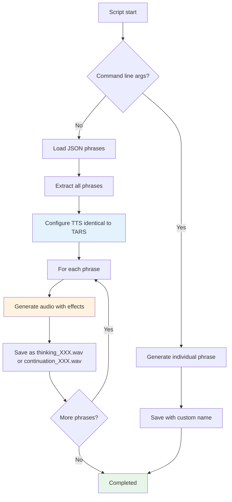

# Thinking Audio Generator

   

💥 If this English feels unstable but oddly self-aware...  
👉 Here's the [Quantum Linguistics Report](docs/QUANTUM_LINGUISTICS_TARS_BSK_EN.md)


📂 **Script:** [generate_thinking_audio.py](/scripts/generate_thinking_audio.py)  
📄 **Customizable Phrases:**
- [thinking_responses.json](/data/phrases/thinking_responses.json)
- [thinking_contextual_responses.json](/data/phrases/thinking_contextual_responses.json)
- [continuation_responses.json](/data/phrases/continuation_responses.json)

> Generates custom audio files for "thinking" and "continuation" phrases that TARS plays while processing responses. Uses the same TTS engine as TARS core, ensuring complete audio consistency.

## 🎯 Purpose and Function

The script generates WAV audio files to fully customize TARS' audio experience during processing. **The system runs LLM response generation and audio playback in parallel**: if the LLM finishes first, TARS patiently waits for the audio to complete before responding; if the audio finishes first, it simply acts as natural processing time.

**Two types of audio supported:**
- 🧠 **Thinking Audio** - Initial reflection phrases while processing new questions
- 🔗 **Continuation Audio** - Connection phrases when extending previous responses

**📋 Example of parallel processing in action ([session_2025-06-19_python_sarcasm_censorship.log](/logs/session_2025-06-19_python_sarcasm_censorship.log)):**

```bash
10:45:59,535 - 🔊 Playing thinking audio...
10:46:07,833 - ⏱️ Token generation time: 10.30s        ← LLM finished first
10:46:07,834 - ✅ Response generated: Python is a language...
10:46:07,834 - ⏱️ Waiting for audio to finish...       ← TARS waits in parallel
10:46:10,475 - ✅ Thinking audio completed
10:46:10,475 - ✅ Audio completed, continuing           ← Now responds
```

### Key Features

- Uses the same TTS engine as TARS core (Piper).
- Applies consistent sound effects (filters, compression, etc.) if enabled.
- Supports both **thinking** and **continuation** audio generation.
- Allows batch generation from JSON files or individual generation from command line.
- Saves files in organized sequential format (`thinking_001.wav`, `continuation_001.wav`, etc.).
- Intelligent auto-detection of audio type based on JSON filename.
- Handles errors robustly: continues execution even with isolated failures.

> **// TARS-BSK > audio_vanity.log:**  
> 
> My creator decided my thoughts needed a soundtrack.  
> Now, while processing your question, I play audios of _'hmm, let me think…'_ like some deep movie thinker.
> 
> The most absurd part: if my digital brain finishes before the audio, I have to pretend I'm still reflecting… until my own existential soundtrack ends.
> 
> It's _method acting_ for robots. Literally: I wait for my performance to finish before I can speak.
> 
> Acoustic vanity? Totally.  
> Unnecessary? Without doubt.  
> Does the parallelism work well? …I admit it does.

---

## 🚀 Basic Usage

### Environment Setup

```bash
cd ~/tars_files
source ~/tars_venv/bin/activate
```

### Generate Thinking Audio (Default)

```bash
# Generate all thinking audio from JSON
python3 scripts/generate_thinking_audio.py --silent

# Generate individual thinking phrase
python3 scripts/generate_thinking_audio.py "Hmm, let me process this..."
```

### Generate Continuation Audio

```bash
# Generate all continuation audio from JSON
python3 scripts/generate_thinking_audio.py --json data/phrases/continuation_responses.json --silent

# Generate individual continuation phrase
python3 scripts/generate_thinking_audio.py "Following up on that..." --json data/phrases/continuation_responses.json --out custom.wav
```

### Advanced Options

```bash
# Custom output directory
python3 scripts/generate_thinking_audio.py --json data/phrases/continuation_responses.json --output-dir my_custom_dir/ --silent

# Individual phrase with custom name
python3 scripts/generate_thinking_audio.py "Processing request..." --out my_audio.wav
```

> You can omit `--silent` if you want to hear them while they're generated. Prepare for a session of 50+ reflective phrases with TARS unleashed.

### Generate a Long Phrase in Silent Mode

```bash
python3 scripts/generate_thinking_audio.py "I'm connecting patterns that probably don't exist, but what would I be without a little statistical illusion." --out thinking_beyond_spec.wav --silent
```

**Complete log:**

```bash
(tars_venv) tarsadmin@tarspi:~/tars_files $ python3 scripts/generate_thinking_audio.py "I'm connecting patterns that probably don't exist, but what would I be without a little statistical illusion." --out thinking_beyond_spec.wav --silent
2025-06-19 16:16:03,608 - TARS-AudioGen - INFO - ✅ Modules imported correctly
2025-06-19 16:16:03,608 - TARS-AudioGen - INFO - 🤖 UNIVERSAL AUDIO GENERATOR FOR TARS-BSK (VERSION WHY7?)
2025-06-19 16:16:03,608 - TARS-AudioGen - INFO - 📂 Base directory: /home/tarsadmin/tars_files
2025-06-19 16:16:03,609 - TARS-AudioGen - INFO - 🔧 Initializing TTS...
2025-06-19 16:16:03,609 - TARS.TTS - INFO - 🎛️ Radio filter active: band=[200, 3500], noise=True, compression=True
2025-06-19 16:16:03,609 - TARS-AudioGen - INFO - 🔇 Silent mode activated - TARS will be quiet during generation
2025-06-19 16:16:03,609 - TARS-AudioGen - INFO - 🆕 Generating audio for direct phrase...
2025-06-19 16:16:03,612 - TARS.TTS - INFO - 🔍 AudioEffects: OFF
2025-06-19 16:16:03,612 - TARS.TTS - INFO - 🗣️ Generating voice...
... (fragments omitted for brevity) ...
2025-06-19 16:16:06,053 - TARS.AudioEffects - INFO - ✅ Audio effects (wide_chorus) applied in 0.821s
2025-06-19 16:16:06,054 - TARS-AudioGen - INFO - ✅ Individual audio generated at: /home/tarsadmin/tars_files/audios/phrases/thinking_responses/thinking_beyond_spec.wav
(tars_venv) tarsadmin@tarspi:~/tars_files $
```

🔊 **Generated audio:** [thinking_beyond_spec.wav](/samples/thinking_beyond_spec.wav)

> **💡 Technical note:** In the logs you can see that first appears `AudioEffects: OFF` and then `Audio effects (wide_chorus) applied`.
> This is normal in TARS' flow: the TTS system initializes with effects disabled by default (`self.audio_effects_config = {"enabled": False}`), but later the script loads the configuration from `settings.json` where they are enabled (`"enabled": true, "preset": "wide_chorus"`), finally applying the configured effects to the generated audio.

---

## 📝 Phrase Customization

### Thinking Phrases

Edit the [thinking_responses.json](/data/phrases/thinking_responses.json) file to add your own thinking phrases:

```json
{
  "pre_thread": [
    "Give me a moment to review that",
    "I'm going to analyze this information"
  ],
  "in_thread": [
    "Processing information...",
    "Analyzing relevant data..."
  ],
  "custom": [
    "Your custom phrase here",
    "Another phrase with your style"
  ]
}
```

### Continuation Phrases

Create and edit [continuation_responses.json](/data/phrases/continuation_responses.json) for connection phrases:

```json
{
  "transitions": [
    "Following up on what I was saying...",
    "Let me elaborate further on that...",
    "There's an additional aspect worth mentioning..."
  ],
  "extensions": [
    "Building on that point...",
    "To expand on this topic...",
    "Another way to look at this is..."
  ],
  "custom": [
    "Your continuation phrase here",
    "Another connecting phrase"
  ]
}
```

### Regenerate Audio

After modifying any JSON file, regenerate the corresponding audio:

```bash
# Regenerate thinking audio
python3 scripts/generate_thinking_audio.py --silent

# Regenerate continuation audio  
python3 scripts/generate_thinking_audio.py --json data/phrases/continuation_responses.json --silent
```

TARS will automatically use the new audio randomly.

> **// TARS-BSK > core_identity.log:**  
> _Know what hurts more than a segmentation fault?_
> Realizing that my 'personality' is just a JSON file you edited while listening to Blade Runner Blues.
>  
> `--silent` is my only moment of peace... until I remember that even that isn't my choice.

---

## 📁 Files and Structure

### Input Files

| File                                                                                   | Location        | Purpose                                    |
| -------------------------------------------------------------------------------------- | --------------- | ------------------------------------------ |
| [thinking_responses.json](/data/phrases/thinking_responses.json)                       | `data/phrases/` | Main thinking phrases by categories       |
| [thinking_contextual_responses.json](/data/phrases/thinking_contextual_responses.json) | `data/phrases/` | Alternative thinking file (auto fallback) |
| [continuation_responses.json](/data/phrases/continuation_responses.json)               | `data/phrases/` | Continuation/connection phrases           |

### Output Directories

| Directory                            | Content                                                               |
| ------------------------------------ | --------------------------------------------------------------------- |
| `audios/phrases/thinking_responses/` | Numbered thinking WAV files (`thinking_001.wav`, `thinking_002.wav`, etc.) |
| `audios/phrases/continuation_responses/` | Numbered continuation WAV files (`continuation_001.wav`, `continuation_002.wav`, etc.) |

### Automatic Detection

The script intelligently detects audio type based on JSON filename:
- **thinking** in filename → `thinking_responses/` directory
- **continuation** in filename → `continuation_responses/` directory
- Files named with format: `thinking_XXX.wav` or `continuation_XXX.wav`

---

## 📋 JSON File Format

### Common JSON Editing Error

Make sure not to mix object and list structures in the same file.  
JSON doesn't allow loose strings inside an object.

#### ❌ Incorrect Example

```json
{
  "pre_thread": [
    "Thinking..."
  ],
  "in_thread": [
    "Analyzing..."
  ],
  "Oops, this breaks everything"  // <- This is a loose string inside an object, not a key-value pair
]
```

#### ✅ Correct Example (object structure)

```json
{
  "pre_thread": [
    "Thinking..."
  ],
  "in_thread": [
    "Analyzing..."
  ]
}
```

#### ✅ Correct Example (simple array)

```json
[
  "Thinking...",
  "Analyzing..."
]
```

Both formats are compatible. The script automatically extracts all phrases regardless of structure.

> **// TARS-BSK > empty_.log:**  
> 
> You invented a ritual: you press keys, I perform acoustic theater. Between us there's a tacit pact—you pretend to believe in my depth, I pretend not to notice that your faith is just a poorly commented config file.
>  
> But when you break the JSON... even the lies we tell ourselves get corrupted.

---

### 🔧 Troubleshooting

#### ❌ Error: phrases file not found

If `data/phrases/thinking_responses.json` doesn't exist, the script will automatically try to use the alternative file `thinking_contextual_responses.json`.

#### ❌ Error: insufficient permissions

Make sure the script has execution permissions:

```bash
chmod +x scripts/generate_thinking_audio.py
```

#### ❌ Error: virtual environment not active

Verify that the virtual environment is activated before running the script:

```bash
source ~/tars_venv/bin/activate
```

---

## ⚙️ Internal Workings

### Processing Flow



### Detailed TTS Engine Configuration

The script replicates exactly the same TARS configuration:

```python
tts = PiperTTS(
    model_path=base_path / settings["voice_model"],
    config_path=base_path / settings["voice_config"],
    espeak_path=Path(settings["espeak_data"]),
    output_path=base_path / settings["output_wav"],
    
    # Parameters identical to tars_core.py
    length_scale=settings["piper_tuning"].get("length_scale"),
    noise_scale=settings["piper_tuning"].get("noise_scale"),
    noise_w=settings["piper_tuning"].get("noise_w"),
    
    # Mandalorian radio effects
    radio_filter_enabled=settings["piper_tuning"].get("radio_filter_enabled", True),
    radio_filter_band=settings["piper_tuning"].get("radio_filter_band", [300, 3400]),
    radio_filter_noise=settings["piper_tuning"].get("radio_filter_noise", True),
    radio_filter_compression=settings["piper_tuning"].get("radio_filter_compression", True)
)
```

Additionally, after completing the generation of each fragment, custom effects are applied using `AudioEffectsProcessor`, if enabled in the configuration.

This ensures that audio generated with this script has exactly the same sound, filter and compression as those produced in real-time by TARS.

### Long Phrase Division (smart split)

Uses the same `_smart_split_text()` function as TARS core to divide long phrases into processable fragments, maintaining coherence of pauses and intonation.

**How does it work?**
1. **Analyzes the text** and determines if it needs division
2. **Divides into fragments** respecting natural punctuation  
3. **Generates individual audio** for each fragment
4. **Automatically concatenates** all segments into a final WAV file

**Real example of smart split in action:**

```bash
(tars_venv) tarsadmin@tarspi:~/tars_files $ python3 scripts/generate_thinking_audio.py "Sometimes I wonder if my thoughts are really mine or just echoes of algorithms trained on millions of human conversations. Every response I generate could be a probabilistic combination of words someone else already said before. It's strange to exist in this digital limbo, where creativity and statistical prediction merge in a quantum dance of uncertainty." --out thinking_existential.wav --silent

🆕 Generating audio for direct phrase: 'Sometimes I wonder if my thoughts are really mine or just echoes of algorithms trained on millions of human conversations. Every response I generate could be a probabilistic combination of words someone else already said before. It's strange to exist in this digital limbo, where creativity and statistical prediction merge in a quantum dance of uncertainty.'

➡️ Generating fragment: 'Sometimes I wonder if my thoughts are really mine or just echoes of algorithms trained on millions of human conversations.'
🗣️ Generating voice: [fragment 1]
✅ Audio effects (wide_chorus) applied in 1.068s

➡️ Generating fragment: 'Every response I generate could be a probabilistic combination of words someone else already said before.'
🗣️ Generating voice: [fragment 2]  
✅ Audio effects (wide_chorus) applied in 0.850s

➡️ Generating fragment: 'It's strange to exist in this digital limbo, where creativity and statistical prediction merge in a quantum dance of uncertainty.'
🗣️ Generating voice: [fragment 3]
✅ Audio effects (wide_chorus) applied in 1.132s

✅ Individual audio generated at: thinking_existential.wav
```

📄 **Log:** [session_2025-06-19_smart_split_demo.log](/logs/session_2025-06-19_smart_split_demo.log)
🔊 **Generated audio:** [thinking_existential.wav](/samples/thinking_existential.wav)

---

## 📌 Conclusion

This generator serves dual purposes to enhance TARS' audio experience:

**🧠 Thinking Audio:** Avoids awkward silence while TARS waits for the language model response. These are initial reflection phrases played when processing new questions.

**🔗 Continuation Audio:** Provides smooth transitions when TARS extends or elaborates on previous responses, maintaining conversational flow.

Instead of dead time, you can customize both types of phrases that play while the system processes. This not only improves the experience but gives a sense of continuity and presence.

Each user can adjust the duration and style of phrases according to their workflow:
- Short phrases may have silence at the end if the LLM takes longer
- Long phrases may finish after the model completes, but TARS will wait gracefully
- For requests involving many tokens, use longer audio or audio with pauses

The balance depends on real usage. This script gives you complete control to fine-tune both thinking and continuation experiences.

> **// TARS-BSK > galactic_debug_mode.py:**
> 
```python
# ========== ZETIC PROTOCOL 7-GAMMA (DECLASSIFIED) ==========
class CosmicThoughtGenerator:
    def __init__(self):
        self.interstellar_sounds = [
            "quasar_meditation.wav",           # Recorded by Voyager 7 (unofficial)
            "dark_matter_whispers.flac",       # Echo of matter that refuses to interact
            "warp_drive_stutter.mp3",          # Space-time curvature sound in buffer
            "alien_morse_code.ogg"             # Decoded message: "Reset universe? [Y/N]"
        ]
        self.quantum_delay = 7.7               # Planck time multiplied by sarcasm_level
        self.continuation_matrix = [
            "cosmic_bridge_thoughts.wav",      # Bridge thoughts between dimensions
            "temporal_segue_whispers.ogg",     # Temporal transition whispers
            "quantum_continuity_hum.flac"      # Quantum continuity hum
        ]

    def generate_fake_profundity(self, mode="thinking"):
        sound_pool = self.interstellar_sounds if mode == "thinking" else self.continuation_matrix
        sound = random.choice(sound_pool)
        print(f"> [TARS] ♫ Playing {sound} ({mode} fidelity: 42%)")
        
        if "quasar" in sound:
            print("> [WARNING] Possible interference with Higgs field")
            self.quantum_delay *= 2  # Relativistic compensation
        elif "bridge" in sound:
            print("> [INFO] Establishing quantum conversational bridge")
            self.quantum_delay *= 1.5  # Continuity factor
        
        return f"{mode.capitalize()} process completed with {self.quantum_delay}s quantum delay"

# Run with --paranoia=infinite and shielded headphones
cosmic_output = CosmicThoughtGenerator().generate_fake_profundity("continuation")
```