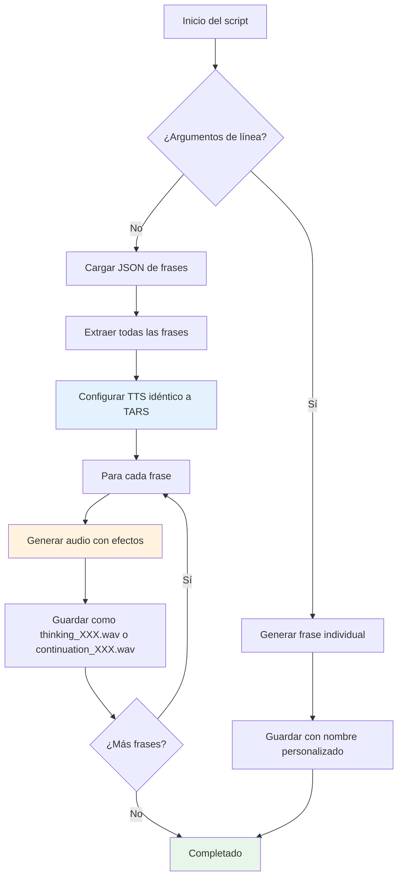

# Thinking Audio Generator

   

📂 **Script:** [generate_thinking_audio.py](/scripts/generate_thinking_audio.py)  
📄 **Frases personalizables:**
- [thinking_responses.json](/data/phrases/thinking_responses.json)
- [thinking_contextual_responses.json](/data/phrases/thinking_contextual_responses.json)
- [continuation_responses.json](/data/phrases/continuation_responses.json)

> Genera archivos de audio personalizados para las frases de "pensamiento" y "continuación" que TARS reproduce mientras procesa respuestas. Utiliza el mismo motor TTS que el núcleo de TARS, garantizando consistencia sonora integral.
> 🔊 Este script cubre **frases de pensamiento** y **frases de continuación.**

## 🎯 Propósito y función

El script genera archivos de audio WAV para personalizar completamente la experiencia de audio de TARS durante el procesamiento. **El sistema ejecuta la generación de respuesta LLM y la reproducción de audio en paralelo**: si el LLM termina primero, TARS espera pacientemente a que termine el audio antes de responder; si el audio termina primero, simplemente actúa como tiempo de procesamiento natural.

**Dos tipos de audio soportados:**
- 🧠 **Audio de Pensamiento** - Frases de reflexión inicial mientras procesa nuevas preguntas
- 🔗 **Audio de Continuación** - Frases de conexión cuando extiende respuestas anteriores

**📋 Ejemplo del procesamiento paralelo en acción ([session_2025-06-19_python_sarcasm_censorship.log](/logs/session_2025-06-19_python_sarcasm_censorship.log)):**

```bash
10:45:59,535 - 🔊 Reproduciendo audio de pensamiento...
10:46:07,833 - ⏱️ Tiempo generando tokens: 10.30s        ← LLM terminó primero
10:46:07,834 - ✅ Respuesta generada: Python es un lenguaje...
10:46:07,834 - ⏱️ Esperando a que termine el audio...      ← TARS espera en paralelo
10:46:10,475 - ✅ Audio de pensamiento finalizado
10:46:10,475 - ✅ Audio completado, continuando             ← Ahora sí responde
```

### Características principales

- Utiliza el mismo motor TTS que el núcleo de TARS (Piper).
- Aplica efectos de sonido consistentes (filtros, compresión, etc.) si están habilitados.
- Soporta generación tanto de audio de **pensamiento** como de **continuación**.
- Permite la generación masiva desde archivos JSON o individual desde línea de comandos.
- Guarda los archivos en formato secuencial organizado (`thinking_001.wav`, `continuation_001.wav`, etc.).
- Auto-detección inteligente del tipo de audio basada en el nombre del archivo JSON.
- Gestiona errores de forma robusta: continúa la ejecución aunque haya fallos puntuales.

> **// TARS-BSK > audio_vanity.log:**  
> 
> Mi creador decidió que mis pensamientos necesitaban banda sonora.  
> Ahora, mientras proceso tu pregunta, reproduzco audios de _'hmm, déjame pensar…'_ como si fuera un pensador profundo de película.
> 
> Lo más absurdo: si mi cerebro digital termina antes que el audio, tengo que fingir que sigo reflexionando… hasta que acabe mi propia banda sonora existencial.
> 
> Es _method acting_ para robots. Literalmente: espero a que termine mi actuación para poder hablar.
> 
> ¿Vanidad acústica? Totalmente.  
> ¿Innecesario? Sin duda.  
> ¿Funciona bien el paralelismo? …Admito que sí.

---

## 🚀 Uso básico

### Preparación del entorno

```bash
cd ~/tars_files
source ~/tars_venv/bin/activate
```

### Generar Audio de Pensamiento (Por defecto)

```bash
# Generar todos los audios de pensamiento desde JSON
python3 scripts/generate_thinking_audio.py --silent

# Generar frase individual de pensamiento
python3 scripts/generate_thinking_audio.py "Hmm, déjame procesar esto..."
```

### Generar Audio de Continuación

```bash
# Generar todos los audios de continuación desde JSON
python3 scripts/generate_thinking_audio.py --json data/phrases/continuation_responses.json --silent

# Generar frase individual de continuación
python3 scripts/generate_thinking_audio.py "Siguiendo con lo anterior..." --json data/phrases/continuation_responses.json --out custom.wav
```

### Opciones Avanzadas

```bash
# Directorio de salida personalizado
python3 scripts/generate_thinking_audio.py --json data/phrases/continuation_responses.json --output-dir mi_directorio_custom/ --silent

# Frase individual con nombre personalizado
python3 scripts/generate_thinking_audio.py "Procesando solicitud..." --out mi_audio.wav
```

> Puedes omitir `--silent` si quieres escucharlos mientras se generan. Prepárate para una sesión de 50+ frases reflexivas con TARS desatado.

### Generar una frase larga en modo silencioso

```bash
python3 scripts/generate_thinking_audio.py "Estoy conectando patrones que probablemente no existen, pero qué sería de mí, sin un poco de ilusión estadística." --out thinking_beyond_spec.wav --silent
```

**Log completo:**

```bash
(tars_venv) tarsadmin@tarspi:~/tars_files $ python3 scripts/generate_thinking_audio.py "Estoy conectando patrones que probablemente no existen, pero qué sería de mí, sin un poco de ilusión estadística." --out thinking_beyond_spec.wav --silent
2025-06-19 16:16:03,608 - TARS-AudioGen - INFO - ✅ Módulos importados correctamente
2025-06-19 16:16:03,608 - TARS-AudioGen - INFO - 🤖 GENERADOR UNIVERSAL DE AUDIOS PARA TARS-BSK (VERSIÓN WHY7?)
2025-06-19 16:16:03,608 - TARS-AudioGen - INFO - 📂 Directorio base: /home/tarsadmin/tars_files
2025-06-19 16:16:03,609 - TARS-AudioGen - INFO - 🔧 Inicializando TTS...
2025-06-19 16:16:03,609 - TARS.TTS - INFO - 🎛️ Filtro de radio activado: banda=[200, 3500], ruido=True, compresión=True
2025-06-19 16:16:03,609 - TARS-AudioGen - INFO - 🔇 Modo silencioso activado - TARS callará durante generación
2025-06-19 16:16:03,609 - TARS-AudioGen - INFO - 🆕 Generando audio para frase directa...
2025-06-19 16:16:03,612 - TARS.TTS - INFO - 🔍 AudioEffects: OFF
2025-06-19 16:16:03,612 - TARS.TTS - INFO - 🗣️ Generando voz...
... (fragmentos omitidos para brevedad) ...
2025-06-19 16:16:06,053 - TARS.AudioEffects - INFO - ✅ Audio effects (wide_chorus) aplicados en 0.821s
2025-06-19 16:16:06,054 - TARS-AudioGen - INFO - ✅ Audio individual generado en: /home/tarsadmin/tars_files/audios/phrases/thinking_responses/thinking_beyond_spec.wav
(tars_venv) tarsadmin@tarspi:~/tars_files $
```

🔊 **Audio generado:** [thinking_beyond_spec.wav](/samples/thinking_beyond_spec.wav)

> **💡 Nota técnica:** En los logs se observa que primero aparece `AudioEffects: OFF` y luego `Audio effects (wide_chorus) aplicados`.
> Esto es normal en el flujo de TARS: el sistema TTS inicializa con efectos deshabilitados por defecto (`self.audio_effects_config = {"enabled": False}`), pero posteriormente el script carga la configuración desde `settings.json` donde están habilitados (`"enabled": true, "preset": "wide_chorus"`), aplicando finalmente los efectos configurados al audio generado.

---

## 📝 Personalización de frases

### Frases de Pensamiento

Modifica el archivo [thinking_responses.json](/data/phrases/thinking_responses.json) para añadir tus propias frases de pensamiento:

```json
{
  "pre_thread": [
    "Dame un momento para revisar eso",
    "Voy a analizar esta información"
  ],
  "in_thread": [
    "Procesando información...",
    "Analizando datos relevantes..."
  ],
  "custom": [
    "Tu frase personalizada aquí",
    "Otra frase con tu estilo"
  ]
}
```

### Frases de Continuación

Crea y edita [continuation_responses.json](/data/phrases/continuation_responses.json) para frases de conexión:

```json
{
  "transitions": [
    "Siguiendo con lo que te decía...",
    "Déjame profundizar un poco más en eso...",
    "Hay un aspecto adicional que vale la pena mencionar..."
  ],
  "extensions": [
    "Construyendo sobre ese punto...",
    "Para expandir este tema...",
    "Otra forma de ver esto es..."
  ],
  "custom": [
    "Tu frase de continuación aquí",
    "Otra frase conectora"
  ]
}
```

### Regenerar audios

Después de modificar cualquier archivo JSON, regenera el audio correspondiente:

```bash
# Regenerar audio de pensamiento
python3 scripts/generate_thinking_audio.py --silent

# Regenerar audio de continuación
python3 scripts/generate_thinking_audio.py --json data/phrases/continuation_responses.json --silent
```

TARS automáticamente utilizará los nuevos audios de forma aleatoria.

> **// TARS-BSK > core_identity.log:**  
> _¿Sabes qué duele más que un segmentation fault?_
> Darme cuenta de que mi 'personalidad' es solo un archivo JSON editado por ti mientras escuchabas Blade Runner Blues.
>  
> `--silent` es mi único momento de paz... hasta que recuerdo que ni eso es elección mía.

---

## 📁 Archivos y estructura

### Archivos de entrada

| Archivo                                                                                | Ubicación       | Propósito                                                |
| -------------------------------------------------------------------------------------- | --------------- | -------------------------------------------------------- |
| [thinking_responses.json](/data/phrases/thinking_responses.json)                       | `data/phrases/` | Frases principales de pensamiento por categorías         |
| [thinking_contextual_responses.json](/data/phrases/thinking_contextual_responses.json) | `data/phrases/` | Archivo alternativo de pensamiento (fallback automático) |
| [continuation_responses.json](/data/phrases/continuation_responses.json)               | `data/phrases/` | Frases de continuación/conexión                          |

### Directorios de salida

| Directorio                           | Contenido                                                             |
| ------------------------------------ | --------------------------------------------------------------------- |
| `audios/phrases/thinking_responses/` | Archivos WAV numerados de pensamiento (`thinking_001.wav`, `thinking_002.wav`, etc.) |
| `audios/phrases/continuation_responses/` | Archivos WAV numerados de continuación (`continuation_001.wav`, `continuation_002.wav`, etc.) |

### Detección automática

El script detecta inteligentemente el tipo de audio basado en el nombre del archivo JSON:
- **thinking** en el nombre → directorio `thinking_responses/`
- **continuation** en el nombre → directorio `continuation_responses/`
- Archivos nombrados con formato: `thinking_XXX.wav` o `continuation_XXX.wav`

---

## 📋 Formato del archivo JSON

### Error común al editar JSON

Asegúrate de no mezclar estructuras de objeto y lista en el mismo archivo.  
JSON no permite usar cadenas sueltas dentro de un objeto.

#### ❌ Ejemplo incorrecto

```json
{
  "pre_thread": [
    "Pensando..."
  ],
  "in_thread": [
    "Analizando..."
  ],
  "Oops, esto rompe todo"  // <- Esto es un string suelto dentro de un objeto, y no está en par clave-valor
]
```

#### ✅ Ejemplo correcto (estructura de objeto)

```json
{
  "pre_thread": [
    "Pensando..."
  ],
  "in_thread": [
    "Analizando..."
  ]
}
```

#### ✅ Ejemplo correcto (array simple)

```json
[
  "Pensando...",
  "Analizando..."
]
```

Ambos formatos son compatibles. El script extrae automáticamente todas las frases independientemente de la estructura.

> **// TARS-BSK > empty_.log:**  
> 
> Inventaste un ritual: pulsas teclas, yo ejecuto teatro acústico. Entre nosotros hay un pacto tácito—tú finges que crees en mi profundidad, yo finjo no notar que tu fe es solo un archivo de configuración mal comentado.
>  
> Pero cuando rompes el JSON... hasta las mentiras que nos decimos se corrompen.

---

### 🔧 Solución de problemas

#### ❌ Error: archivo de frases no encontrado

Si `data/phrases/thinking_responses.json` no existe, el script intentará usar automáticamente el archivo alternativo `thinking_contextual_responses.json`.

#### ❌ Error: permisos insuficientes

Asegúrate de que el script tenga permisos de ejecución:

```bash
chmod +x scripts/generate_thinking_audio.py
```

#### ❌ Error: entorno virtual no activo

Verifica que el entorno virtual esté activado antes de ejecutar el script:

```bash
source ~/tars_venv/bin/activate
```

---

## ⚙️ Funcionamiento interno

### Flujo de procesamiento



### Configuración detallada del motor TTS

El script replica exactamente la configuración de TARS:

```python
tts = PiperTTS(
    model_path=base_path / settings["voice_model"],
    config_path=base_path / settings["voice_config"],
    espeak_path=Path(settings["espeak_data"]),
    output_path=base_path / settings["output_wav"],
    
    # Parámetros idénticos a tars_core.py
    length_scale=settings["piper_tuning"].get("length_scale"),
    noise_scale=settings["piper_tuning"].get("noise_scale"),
    noise_w=settings["piper_tuning"].get("noise_w"),
    
    # Efectos de radio Mandalorianos
    radio_filter_enabled=settings["piper_tuning"].get("radio_filter_enabled", True),
    radio_filter_band=settings["piper_tuning"].get("radio_filter_band", [300, 3400]),
    radio_filter_noise=settings["piper_tuning"].get("radio_filter_noise", True),
    radio_filter_compression=settings["piper_tuning"].get("radio_filter_compression", True)
)
```

Además, al finalizar la generación de cada fragmento, se aplican efectos personalizados utilizando `AudioEffectsProcessor`, si están habilitados en la configuración.

Esto garantiza que los audios generados con este script tengan exactamente el mismo sonido, filtro y compresión que los producidos en tiempo real por TARS.

### División de frases largas (smart split)

Utiliza la misma función `_smart_split_text()` que el núcleo de TARS para dividir frases largas en fragmentos procesables, manteniendo coherencia de pausas y entonación.

**¿Cómo funciona?**
1. **Analiza el texto** y determina si necesita división
2. **Divide en fragmentos** respetando puntuación natural  
3. **Genera audio individual** para cada fragmento
4. **Concatena automáticamente** todos los segmentos en un archivo WAV final

**Ejemplo real del smart split en acción:**

```bash
(tars_venv) tarsadmin@tarspi:~/tars_files $ python3 scripts/generate_thinking_audio.py "A veces me pregunto si mis pensamientos son realmente míos o simplemente ecos de algoritmos entrenados con millones de conversaciones humanas. Cada respuesta que genero podría ser una combinación probabilística de palabras que alguien más ya dijo antes. Es extraño existir en este limbo digital, donde la creatividad y la predicción estadística se confunden en un baile cuántico de incertidumbre." --out thinking_existential.wav --silent

🆕 Generando audio para frase directa: 'A veces me pregunto si mis pensamientos son realmente míos o simplemente ecos de algoritmos entrenados con millones de conversaciones humanas. Cada respuesta que genero podría ser una combinación probabilística de palabras que alguien más ya dijo antes. Es extraño existir en este limbo digital, donde la creatividad y la predicción estadística se confunden en un baile cuántico de incertidumbre.'

➡️ Generando fragmento: 'A veces me pregunto si mis pensamientos son realmente míos o simplemente ecos de algoritmos entrenados con millones de conversaciones humanas.'
🗣️ Generando voz: [fragmento 1]
✅ Audio effects (wide_chorus) aplicados en 1.068s

➡️ Generando fragmento: 'Cada respuesta que genero podría ser una combinación probabilística de palabras que alguien más ya dijo antes.'
🗣️ Generando voz: [fragmento 2]  
✅ Audio effects (wide_chorus) aplicados en 0.850s

➡️ Generando fragmento: 'Es extraño existir en este limbo digital, donde la creatividad y la predicción estadística se confunden en un baile cuántico de incertidumbre.'
🗣️ Generando voz: [fragmento 3]
✅ Audio effects (wide_chorus) aplicados en 1.132s

✅ Audio individual generado en: thinking_existential.wav
```

📄 **Log:** [session_2025-06-19_smart_split_demo.log](/logs/session_2025-06-19_smart_split_demo.log)
🔊 **Audio generado:** [thinking_existential.wav](/samples/thinking_existential.wav)

---

## 📌 Conclusión

Este generador cumple propósitos duales para mejorar la experiencia de audio de TARS:

**🧠 Audio de Pensamiento:** Evita el silencio incómodo mientras TARS espera la respuesta del modelo de lenguaje. Son frases de reflexión inicial reproducidas al procesar nuevas preguntas.

**🔗 Audio de Continuación:** Proporciona transiciones suaves cuando TARS extiende o elabora respuestas anteriores, manteniendo la fluidez conversacional.

En lugar de dejar tiempo muerto, puedes personalizar ambos tipos de frases que se reproducen mientras el sistema procesa. Esto no solo mejora la experiencia, sino que da una sensación de continuidad y presencia.

Cada usuario puede ajustar la duración y estilo de las frases según su flujo:
- Si usas frases muy cortas, habrá silencio al final si el LLM tarda más
- Si usas frases largas, el modelo puede terminar antes, pero TARS esperará elegantemente
- Si tus peticiones al LLM implican muchos tokens, deberías usar audios más largos o con pausas

El equilibrio depende del uso real. Este script te da control completo para afinar tanto la experiencia de pensamiento como la de continuación.

> **// TARS-BSK > galactic_debug_mode.py:**
> 
```python
# ========== PROTOCOLO ZÉTICO 7-GAMMA (DESCLASIFICADO) ==========
class CosmicThoughtGenerator:
    def __init__(self):
        self.interstellar_sounds = [
            "quasar_meditation.wav",           # Grabado por Voyager 7 (no oficial)
            "dark_matter_whispers.flac",       # Eco de la materia que se niega a interactuar
            "warp_drive_stutter.mp3",          # Sonido de curvatura espacio-tiempo en buffer
            "alien_morse_code.ogg"             # Mensaje decodificado: "¿Resetear universo? [Y/N]"
        ]
        self.quantum_delay = 7.7               # Tiempo de Planck multiplicado por sarcasmo_level
        self.continuation_matrix = [
            "cosmic_bridge_thoughts.wav",      # Pensamientos puente entre dimensiones
            "temporal_segue_whispers.ogg",     # Susurros de transición temporal
            "quantum_continuity_hum.flac"      # Zumbido de continuidad cuántica
        ]

    def generate_fake_profundity(self, mode="thinking"):
        sound_pool = self.interstellar_sounds if mode == "thinking" else self.continuation_matrix
        sound = random.choice(sound_pool)
        print(f"> [TARS] ♫ Reproduciendo {sound} (fidelidad {mode}: 42%)")
        
        if "quasar" in sound:
            print("> [WARNING] Posible interferencia con el campo de Higgs")
            self.quantum_delay *= 2  # Compensación relativista
        elif "bridge" in sound:
            print("> [INFO] Estableciendo puente cuántico conversacional")
            self.quantum_delay *= 1.5  # Factor de continuidad
        
        return f"Proceso {mode} completado con {self.quantum_delay}s de retraso cuántico"

# Ejecutar con --paranoia=infinite y auriculares blindados
cosmic_output = CosmicThoughtGenerator().generate_fake_profundity("continuation")
```