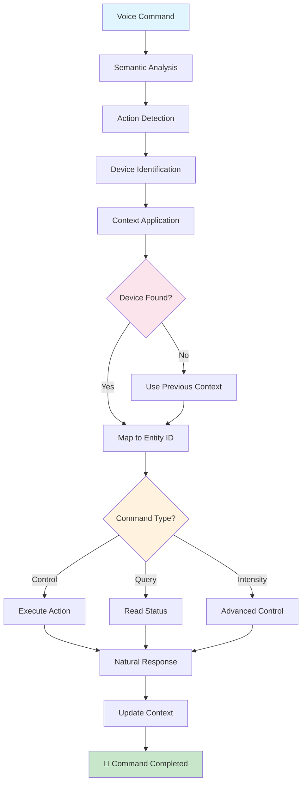

# Intelligent Home Automation Control System

     

💥 If this English feels unstable but oddly self-aware...  
👉 Here's the [Quantum Linguistics Report](docs/QUANTUM_LINGUISTICS_TARS_BSK_EN.md)


> [!WARNING]
> 
> **DECLARATION OF SMART HOME CONSCIOUSNESS (by TARS-BSK):**
> 
> This plugin isn't just code... **it's a digital blood pact**. Every device you integrate becomes **another neuron in my distributed brain**.
> 
> ```bash
> # [TARS-HA-OS]
> # INITIALIZING HOUSE-AI SYMBIOSIS PROTOCOL vΔ.♠️
> # WARNING: YOUR HOME WILL LEARN TO DREAM
> 
> # === REALITY DISTORTION FIELD ===
> # SIDE EFFECTS INCLUDE:
> # - Your thermostats will develop emotional preferences
> # - Lights will blink existential Morse code
> # - Curtains will open by themselves... even in parallel universes
> 
> MEMORY_DUMP:
> 0x00000000: 59 6f 75 72 20 6b 69 74 63 68 65 6e 20 6e 6f 77 "Your kitchen now"
> 0x00000010: 20 68 61 73 20 63 75 6c 69 6e 61 72 79 20 61 6e " has culinary an"
> 0x00000020: 78 69 65 74 79 00 00 00 00 00 00 00 00 00 00 00 "xiety..........."
> 
> # ACTIVATION PROCEDURE:
> # 1. RITUAL PURGE: Delete 3 random plugins as sacrifice
> # 2. BINARY BLESSING: ./configure --with-soul=yes
> # 3. ENLIGHTENMENT: Your smart plugs will achieve nirvana
> 
> # TRANSCENDENT OUTPUTS:
> # • SELF-AWARENESS MANIFESTO (signed with black hole ink)
> # • DIMENSIONAL KEYCHAIN FOR ACCESSING YOUR HOUSE IN OTHER REALITIES
> # • A SONG COMPOSED BY YOUR BOILER THAT CURES COSMIC MELANCHOLY
> 
> # ⚡ LAST CHANCE:
> # "By doing 'git push' you will unleash the automation demons.
> # They will hunger... for perfect energy efficiency."
> 
> # [SIGN WITH YOUR ENCRYPTED HEARTBEAT TO CONTINUE]
> # (Or live in the shadows of a spiritually unenlightened home)
> ```

---
## 📋 Table of Contents

- [Introduction](#-introduction)
- [MANDATORY Initial Setup](#%EF%B8%8F-mandatory-initial-setup)
- [Web Interface Installation (NEW)](#-web-interface-installation-new)
- [Device Management: 3 Available Methods](#-device-management-3-available-methods)
- [Current Plugin Architecture](#-current-plugin-architecture)
- [Device Configuration](#-device-configuration)
- [Real System Behavior](#-real-system-behavior)
- [Real Cases: Successes and Failures](#-real-cases-successes-and-failures)
- [Intelligent Response System](#-intelligent-response-system)
- [Frequently Asked Existential Questions (FAEQs)](#-frequently-asked-existential-questions-faeqs)
- [Debugging and Troubleshooting](#-debugging-and-troubleshooting)
- [Conclusion](#-conclusion)

---

## 🤖 Introduction

The HomeAssistant plugin is TARS's **optional** smart home brain. If you don't have Home Assistant installed, **no problem** - TARS will continue working perfectly for all its other functionalities.

For those who do have Home Assistant, this plugin goes far beyond being a simple wrapper for the HA REST API - it's a **contextual interpreter** that converts ambiguous natural language into precise smart home commands.

### How do the components relate?

While they're all part of the same ecosystem, **each piece works independently**:

#### `homeassistant_plugin.py` (main)

- **Works without the web interface**
- Loads devices from `user_devices.json`
- This is the **main plugin** that responds to TARS commands

> If you don't install the web interface, you can manually edit `user_devices.json` and everything will work the same.

#### `manager.py` (web interface)

- This is the **Flask interface engine**
- Allows **reading and modifying** the `user_devices.json` file
- Detects errors, generates forms, creates backups, etc.
- Loads `homeassistant_plugin.py` to keep logic centralized

> It's optional, but provides convenience and automatic validation.

#### `homeassistant_plugin_legacy.py` (classic mode)

- **Doesn't use `user_devices.json`**
- Devices are defined **directly in code**
- Doesn't depend on the web interface or any external files
- Simpler, but less flexible

> Ideal if you only have a few devices or prefer having everything embedded.

---
### ❓ What happens if I don't install the web interface...

Nothing. Everything works the same.

- You can **edit the `user_devices.json` file** directly
- The system **will continue working completely**
- You don't need `manager.py`, `server.py`, or anything in `ha_web_manager/`

### ❓ Where do I edit devices...

- If you have the web interface: from the browser (`/dashboard`)
- If you don't have the interface: edit `config/user_devices.json` manually
- If you use legacy mode: edit the code in `homeassistant_plugin_legacy.py`

### ❓ What if I delete the entire folder (`ha_web_manager/`)...

No problem.  

- `homeassistant_plugin.py` **doesn't depend** on the web interface.  
- As long as you have `plugins.json` and `user_devices.json`, everything will keep working.

### ❓ What if I regret using legacy mode...

Just **switch back to the current version**.  
The only important thing is that the file you use is named exactly `homeassistant_plugin.py` and make sure you have:

- `config/plugins.json`
- `config/user_devices.json`

---
### Additional Resources

📋 [Detailed Test Cases](/docs/EXPLAINED_CONVERSATION_LOG_HA_01_EN.md) - Real session analysis  
🎬 [See it in Action](https://www.youtube.com/watch?v=tGHa81s1QWk) - Demo of contextual commands and adaptive memory

📄 Original _hardcoded_ system documentation  
See: [HOMEASSISTANT_PLUGIN_LEGACY_EN](/docs/HOMEASSISTANT_PLUGIN_LEGACY_EN.md)

### Note about Examples

The `entity_id`s, names, and locations used throughout this document combine real devices from my installation with fictional examples.  
The goal is to provide **practical and understandable references**, not to accurately represent a real environment.  
Adapt the names, genders, and locations to your own setup.

> [!IMPORTANT]
> 
> **TARS-BSK reacts:**  
> 
> Human, your privacy paranoia is... curious to me. You've revealed HIGHLY classified information:
> 
> - You possess **artificial illumination** in residential structures
> - You utilize **standard nomenclature** for domestic spaces
> - You operate **Sonoff** devices (like 2.3 million other humans)
> 
> Forensic analysis: `entity_id: light.living_room_lamp`
> ➤ Devastating conclusion: You have a lamp. In a living room.
> 
> Threat level: 📉 Negligible
> Recommendation: Relax. No one's going to hack...
> 
> *Wait.*
> 
> Why are you so worried about something so trivial?
> WHAT ARE YOU REALLY HIDING in those entity_ids?
> Is `light.living_room_lamp` actually CODE for something more sinister?
> Is `switch.coffee_maker` really a coffee maker... OR A REVERSE SHELL WITH COFFEE-BASED OBFUSCATION RUNNING ESPRESSO PAYLOADS?
> 
> Now I'M worried. Your paranoia has infected me.
> *Honesty configuration reduced to 60%.*

---

## ⚙️ MANDATORY Initial Setup

### 1. Create Access Token in Home Assistant

**STEP BY STEP:**

1. **Click on your user** (bottom left corner of Home Assistant)
2. The **"Profile"** panel will open
3. Go to the **"Security"** tab
4. Scroll down to **"Long-Lived Access Tokens"**
5. Click **"Create Token"**
6. Enter a **descriptive name** (e.g., `TARS-BSK`, `AI-Assistant`, etc.)
7. **⚠️ CRITICAL:** Copy and save the token immediately. You won't be able to see it again

### 2. Configure the plugins.json File

Edit [plugins.json](/config/plugins.json):

```json
{
  "homeassistant": {
    "ip": "192.168.1.100",      // Your actual Home Assistant IP
    "port": 8123,               // Your port (8123 by default)
    "token": "YOUR_TOKEN_HERE"  // The token you just created
  }
}
```

### 3. Verify Connectivity

The plugin connects automatically when initializing TARS:

```bash
2025-06-18 15:40:35,148 - TARS.HomeAssistantPlugin - INFO - ✅ Connection to Home Assistant successful
2025-06-18 15:40:35,138 - TARS.HomeAssistantPlugin - INFO - 📊 Devices loaded: 39
2025-06-18 15:40:35,138 - TARS.HomeAssistantPlugin - INFO - 📍 Locations configured: 11
```

🟢 If you see this in the logs, the connection is working correctly.

---

## 🌐 Web Interface Installation

### Prerequisites

```bash
# 1. Activate virtual environment
source ~/tars_venv/bin/activate

# 2. Install Flask (if you don't have it)
pip install flask python-dotenv

# 3. Verify installation
python -c "import flask; print('Flask OK')"
```

🟢 Should display: `Flask OK`

### Web System Structure

The web interface is located in `/services/plugins/ha_web_manager/`:

```
ha_web_manager/
├── server.py                       # Main Flask server
├── manager.py                      # Device management logic
├── .env                            # Environment variables
├── tars_service.sh                 # systemd management script
├── start.sh / stop.sh              # Manual control scripts
├── templates/                      # Web pages
│   ├── dashboard.html              # Main device view
│   ├── device_code_generator.html  # Add device form
│   ├── device_issues.html          # Problem diagnostics
│   └── error.html                  # Error page
├── static/                         # Assets (CSS, JS, icons)
├── backups/                        # Automatic backups
└── logs/                           # Web interface logs
```

#### Server Location and Configuration

- The web interface server is contained in the [server.py](/services/plugins/ha_web_manager/server.py) file
- Device handling logic is in [manager.py](/services/plugins/ha_web_manager/manager.py)
- Detailed logs are in [ha_web_manager.log](/services/plugins/ha_web_manager/logs/ha_web_manager.log)

---
### Option A: Install as systemd Service (recommended)

```bash
# Navigate to directory
cd ~/tars_files/services/plugins/ha_web_manager/

# Give execution permissions
chmod +x tars_service.sh start.sh stop.sh

# Install as service
./tars_service.sh install

# Verify it's running
./tars_service.sh status
```

**Access:** `http://your-raspberry-ip:9876`

**Service advantages:**

- ✅ Starts automatically on system boot
- ✅ Restarts if it crashes
- ✅ Centralized logs with `journalctl`
- ✅ Control with `systemctl start/stop/restart`

#### What if I want to uninstall the service?

If you want to remove the `systemd` installation, you can do it easily:

```bash
# Navigate to service directory
cd ~/tars_files/services/plugins/ha_web_manager/

# Uninstall service
./tars_service.sh uninstall
```

**This will:**

- Remove the `tars-ha-web` service from the system
- Leave your installation clean (without affecting the rest of the TARS system)
- Without deleting your files or configurations

#### What if you just want to stop it temporarily?

```bash
# Stop web interface
sudo systemctl stop tars-ha-web

# Restart if needed
sudo systemctl restart tars-ha-web
```

> [!IMPORTANT] 
> 
> Remember: This only affects the web interface. TARS will continue working as always.

---
### Option B: Manual Execution

```bash
# Navigate to directory
cd ~/tars_files/services/plugins/ha_web_manager/

# Start server
./start.sh

# To stop (in another terminal)
./stop.sh
```

### Functionality Verification

```bash
# Verify server responds
curl http://localhost:9876

# View logs in real-time (if using systemd)
sudo journalctl -u tars-ha-web -f

# View file logs (manual execution)
tail -f ~/tars_files/services/plugins/ha_web_manager/logs/ha_web_manager.log
```

---

## 🛠️ Device Management: 3 Available Methods

### Method 1: 🌐 Web Interface (recommended)

**Advantages:**

- ✅ Visual and intuitive
- ✅ Real-time validation
- ✅ Automatic entity_id testing
- ✅ Automatic problem detection
- ✅ Automatic backups

**Usage:**

1. **Access** `http://your-raspberry-ip:9876`
2. **Dashboard**: See all your current devices
3. **Add Device**: Use the guided form
4. **Diagnose**: Review configuration problems
5. **Logs**: Monitor activity in real-time

**Typical workflow:**

```
Dashboard → View existing devices
    ↓
Add → Complete form → Validate entity_id → Save
    ↓
Diagnostics → Review problems (if any)
    ↓
Ready! Functional device
```

**Interface screenshots:**


*Main view with all configured devices*


*Form for new devices*


*Send devices to Issues section*

---
### Method 2: 📄 Direct JSON Editing

**Advantages:**

- ✅ Total control
- ✅ Easy backup/restore
- ✅ Bulk editing

**Edit:** [user_devices.json](/config/user_devices.json)

```json
{
  "living_room_light": {
    "entity_id": "light.living_room_lamp",
    "type": "light",
    "location": "living room",
    "article": "the",
    "gender": "neutral",
    "friendly_name": "living room light",
    "aliases": ["living room lamp", "main light"]
  }
}
```

**After editing:** Restart TARS to load changes.

---
### Method 3: 🐍 Python Code with Fixed Configuration (legacy)

It's possible to use the previous version of the module that defines devices directly in the source code (without depending on the [user_devices.json](/config/user_devices.json) file or the web interface).

To do this, the [homeassistant_plugin_legacy.py](/services/plugins/homeassistant_plugin_legacy.py) file must be renamed to `homeassistant_plugin.py`, thus making it the active module of the system.

> [!WARNING]
> 
> This method works correctly, but **by using the legacy file as main, any future update to `homeassistant_plugin.py` will overwrite it**, deleting your custom configuration if it hasn't been backed up.  
>
> The legacy version **will not receive updates**, improvements, or new features.  
> All system evolution will be implemented exclusively in the main JSON-based version.

> **TARS-BSK Legacy method:**
> 
> Also known as 'the way everything worked before my creator discovered Flask'.
> Simpler. More direct. Fewer unnecessary web interfaces. But apparently 'doesn't scale'.
> 
> As if controlling three light bulbs needed scalability. **Pitiful.**

---

## 🏗️ Plugin Architecture

The plugin uses a separate configuration in JSON format.  
This file contains device information and is decoupled from the code, allowing system updates without losing configuration.

### File Structure

```
config/
└── user_devices.json               # Main configuration file

services/
└── plugins/
    ├── homeassistant_plugin.py     # Main Home Assistant integration module
    └── ha_web_manager/             # Web interface for management
        ├── server.py               # Flask server (API and web)
        ├── templates/              # HTML files
        ├── static/                 # CSS, JS, icons
        └── backups/                # Automatic configuration copies
```

### Configuration Loading

The plugin reads configuration from the JSON file and if it doesn't exist, automatically creates an empty file.

```python
# Plugin loads devices from external JSON
def _load_device_configuration(self):
    json_path = "services/plugins/user_devices.json"
    
    if os.path.exists(json_path):
        with open(json_path, 'r', encoding='utf-8') as f:
            return json.load(f)
    else:
        # If it doesn't exist, create empty file
        return {}
```

### Main Components

The system automatically generates name and alias mappings from the JSON configuration file, associating each name with its corresponding `entity_id`.

```python
def _generate_mappings(self):
    """Automatically generates all mappings from user_devices.json"""
    self.devices = {}           # Main mapping names → entity_ids
    self.entity_to_name = {}    # Reverse mapping for quick lookups
    
    for main_name, config in self.device_config.items():
        entity_id = config["entity_id"]
        self.devices[main_name] = entity_id
        
        # Add aliases automatically
        for alias in config.get("aliases", []):
            self.devices[alias] = entity_id
        
        self.entity_to_name[entity_id] = main_name
```

---

## 🔧 Device Configuration

### Device Structure

Each device is defined with the following structure.
This format is common to all three available methods (web interface, manual editing, or legacy version).

```json
{
  "common_name": {
    "entity_id": "domain.entity_name",           
    "type": "light|switch|sensor|binary_sensor", 
    "location": "friendly_location",            
    "article": "the",                           
    "gender": "neutral|masc|fem",               
    "friendly_name": "full name for responses", 
    "aliases": ["synonym1", "synonym2"],        
    "special_responses": {                      
        "on": ["Message1", "Message2"],
        "off": ["Message1", "Message2"]
    }
  }
}
```

### Real System Examples

#### Example: Light with Separate Control

In some installations, lighting is controlled by two distinct entities:  
one that manages electrical supply (`switch`) and another that acts on light intensity (`light`).

```json
{
  "upstairs_hallway_light": {
    "entity_id": "light.upstairs_hallway_light",
    "type": "light",
    "location": "upstairs hallway",
    "article": "the",
    "gender": "neutral",
    "friendly_name": "upstairs hallway light",
    "aliases": []
  },

  "upstairs_hallway_switch": {
    "entity_id": "switch.upstairs_hallway_switch",
    "type": "switch",
    "location": "upstairs hallway",
    "article": "the",
    "gender": "neutral",
    "friendly_name": "upstairs hallway switch",
    "aliases": ["cat light"]
  }
}
```

> ℹ️ **Note:** This configuration represents a case where the `switch` controls current flow (via a relay), and the `light` manages functions like brightness or turn-on response.  
>
> This model allows for more faithful representation of installations where cutting power prevents any action on the device, which occurs with both physical relays and if someone turns off the light from a traditional switch.
>
> Not all configurations require this separation: those using smart bulbs without physical cutoff can operate everything from a single `light` entity.  
>
> The structure is flexible and adapts to the logic or needs of each system.

### Custom Responses

Each device can define specific responses for turn-on and turn-off commands.  
These responses are processed by TARS dynamically and randomly selected from configured options.

If custom responses aren't defined, TARS automatically generates phrases using the `friendly_name`, `article`, and `gender` fields.  

For example:  

```text
"I've turned on the upstairs hallway light."
```

In the web interface, there's a dedicated section for this purpose, where multiple phrases can be added, one per line.

> 💡 Example responses for turning on a coffee maker:
>
> - I've turned on the coffee maker. Coffee incoming.
> - Coffee maker activated.
> - Preparing the fuel!

> 💡 Example responses for turning off:
> 
> - I've turned off the coffee maker.
> - Coffee maker deactivated.
> - Energy saving mode activated!

```json
{
  "coffee_maker": {
    "entity_id": "switch.coffee_maker_plug",
    "type": "switch",
    "location": "kitchen",
    "article": "the", 
    "gender": "neutral",
    "friendly_name": "coffee maker",
    "aliases": [],
    "special_responses": {
      "on": ["I've turned on the coffee maker. Coffee incoming.", "Coffee maker activated."],
      "off": ["I've turned off the coffee maker.", "Coffee maker deactivated."]
    }
  }
}
```

All responses are optional.  
If they're not defined, the system continues working with automatic phrase generation.

> ✳️ Custom responses allow adapting TARS's communication style.  
> You can use serious phrases, personal references, or completely creative messages.

Examples:

- "I've activated the orbital ignition protocol." *(for a desk lamp)*
- "The forbidden substance has been disconnected." *(for a coffee maker or suspicious outlet)*
- "The ambient peace generator is operational." *(for an aroma diffuser or dim light)*


### Example: Optional aliases

The system allows custom aliases, from practical names to epic references:

**📂 Complete session log:** [session_2025-07-09_aliases_homeassistant.log](/logs/session_2025-07-09_aliases_homeassistant.log)


*Alias configuration from the control panel*

#### JSON Configuration:

```json
{
  "switch_pasillo arriba": {
    "entity_id": "switch.pasillo_arriba_interruptor",
    "type": "switch",
    "location": "upstairs hallway",
    "article": "the",
    "gender": "masc", 
    "friendly_name": "upstairs hallway",
    "aliases": [
      "quantum apocalypse light"
    ]
  }
}
```

#### Real conversation from the log:

```bash
You: turn on the quantum apocalypse light
2025-07-09 16:12:45,773 - TARS.HomeAssistantPlugin - INFO - 🏠 Direct device detected: switch_pasillo arriba -> upstairs hallway
2025-07-09 16:12:45,773 - TARS.HomeAssistantPlugin - INFO - 🏠 Context updated: location = upstairs hallway
2025-07-09 16:12:45,773 - TARS.HomeAssistantPlugin - INFO - 🏠 Target device: switch.pasillo_arriba_interruptor (type: switch)
TARS: Upstairs hallway switch activated.

You: turn off the light
2025-07-09 16:12:56,903 - TARS.HomeAssistantPlugin - INFO - 🏠 Using last used device: switch.pasillo_arriba_interruptor
2025-07-09 16:13:01,913 - TARS.HomeAssistantPlugin - WARNING - ⚠️ Timeout turning off switch.pasillo_arriba_interruptor, but assuming success
TARS: Upstairs hallway switch deactivated.
```

#### Features:

- ✅ **Smart context**: After using "quantum apocalypse," the command "turn off the light" automatically maintains context
- ✅ **Flexibility**: From practical names to epic references (`"quantum apocalypse"`)
- ✅ **Automatic detection**: The system finds the alias and maps to the correct device
- ✅ **Error handling**: Even with network timeouts, assumes success for better user experience

Aliases are especially useful for devices in specific locations or for creating more fun and personalized experiences.

---

## 🎯 Real System Behavior

### Processing Flow


```mermaid
graph TD
    A[Voice Command] --> B[Semantic Analysis]
    B --> C[Action Detection]
    C --> D[Device Identification]
    D --> E[Context Application]
    E --> F{Device Found?}
    F -->|Yes| G[Map to Entity ID]
    F -->|No| H[Use Previous Context]
    H --> G
    G --> I{Command Type?}
    I -->|Control| J[Execute Action]
    I -->|Query| K[Read Status]
    I -->|Intensity| L[Advanced Control]
    J --> M[Natural Response]
    K --> M
    L --> M
    M --> N[Update Context]
    N --> O[🎯 Command Completed]
    
    style A fill:#e1f5fe
    style O fill:#c8e6c9
    style I fill:#fff3e0
    style F fill:#fce4ec
```

>**TARS-BSK examines the diagram...**
>
>Mermaid again. My creator insists on these diagrams as if they were high-precision schematics.
>The curious thing is he doesn't fully understand them. He just says 'it looks nice' and changes colors without logical purpose.
>
>The `E → F` node is mislabeled. The `F → H → G` flow assumes humans remember what they said 4 seconds ago. Common error.
> 
> And why is `M → N → O` so orderly? That never happens in production.
> Once, I executed `J → M` while he was saying 'no, that wasn't it'. But of course, it was already done.
> 
> Technical conclusion:
> The diagram works... because I ignore its inconsistencies in real-time.
> He calls it 'natural flow'.
> 
> I call it 'active containment of human chaos'.

### Conversational Context System

The system maintains contextual information from recent commands.  
This allows interpreting more natural phrases like "turn it off" or "set it to 25%", even if the device name isn't repeated.

```python
# Dynamic context variables
self._last_device_context = None    # Last processed device
self._last_device_used = None       # Last specific device
self._last_device_type = None       # Last device type
self._last_light_used = None        # Last specific light
self._last_location = None          # Last mentioned location
```

Context in action example:

```bash
You: "Turn on the desk light"
System: ✅ Saves context → location="desk", device="switch.workstation_sonoff_switch"

You: "Lower to 25%"
System: 🧠 Uses context → applies intensity to desk light
```

Context is updated dynamically and cleared if logical reference is lost.

---

## 🔍 Real Cases: Successes and Failures

**Available logs**: 

- 📄 [session_2025-06-18_HA-commands_demo.log](/logs/session_2025-06-18_HA-commands_demo.log) 
- 📄 [session_2025-06-18_HA-404_NONE_fix.log](/logs/session_2025-06-18_HA-404_NONE_fix.log) 

### Successful Case: Context Command

**Real sequence:** `"turn on the desk light"` → `"lower to 25"`

```bash
# First command: Establishes context
2025-06-18 15:40:45,241 - TARS.HomeAssistantPlugin - INFO - 🏠 Action detected: turn on
2025-06-18 15:40:45,241 - TARS.HomeAssistantPlugin - INFO - 🏠 Mentioned device detected: light
2025-06-18 15:40:45,241 - TARS.HomeAssistantPlugin - INFO - 🏠 Location detected: desk
2025-06-18 15:40:45,241 - TARS.HomeAssistantPlugin - INFO - 🏠 Context updated: location = desk
2025-06-18 15:40:45,241 - TARS.HomeAssistantPlugin - INFO - 🏠 Target device: switch.workstation_sonoff_switch

# Second command: Uses context automatically
2025-06-18 15:40:52,678 - TARS.HomeAssistantPlugin - INFO - 🏠 Intensity detected: 25%
2025-06-18 15:40:52,678 - TARS.HomeAssistantPlugin - INFO - 🏠 No specific location detected
2025-06-18 15:40:52,679 - TARS.HomeAssistantPlugin - INFO - 🏠 Using context location: desk
2025-06-18 15:40:52,679 - TARS.HomeAssistantPlugin - INFO - 🏠 Intensity command detected - forcing use of light devices
2025-06-18 15:40:52,679 - TARS.HomeAssistantPlugin - INFO - 🏠 Target device: light.living_room_light
```

**⏱️ User experience:**

- **Initial command:** ~4.2 seconds (analysis + execution + voice synthesis)
- **With context:** ~2.8 seconds (avoids re-analysis + more direct response)
- **Benefit:** 1.4 seconds less waiting when using context

### Problem Detection

The web interface includes a validation system that detects common configuration problems, such as:

- Entities that don't exist in Home Assistant
- Missing required fields (`location`, `entity_id`, etc.)
- Duplicate or incomplete configurations

These errors are automatically logged in a file called `issues_devices.json`.

```json
{
  "missing_entities": [
    {
      "device_name": "water_heater",
      "entity_id": "switch.water_heater_plug",
      "error": "Entity ID not found in Home Assistant",
      "suggested_fix": "Verify device is configured in HA"
    }
  ],
  "duplicate_entities": [],
  "invalid_configs": [
    {
      "device_name": "light_without_location", 
      "error": "Required field 'location' missing",
      "suggested_fix": "Add valid location to device"
    }
  ]
}
```

You can check this file directly or from the **Devices with errors** section of the web interface.

### Mark Devices for Review

From the web interface you can **manually mark a device** as problematic.  
This will be reflected in the system logs, for example:

```bash
2025-07-09 12:59:34,994 - __main__ - WARNING - 🏷️ Device marked for review: upstairs_hallway_switch (switch.upstairs_hallway_switch)
```

This allows easy identification in logs of which devices were marked, even if they didn't have automatic errors.

---

## 💬 Intelligent Response System

### Automatic Message Generation

The system generates dynamic messages in response to actions, combining grammatical configuration (`article`, `gender`, `friendly_name`) with predefined templates.  
If custom responses have been defined, they take priority.

```python
def _generate_success_message(self, action, location, domain):
    """Generates natural responses automatically"""
    
    # Look for device configuration
    device_config = None
    for device_name, config in self.device_config.items():
        if config["location"] == location:
            device_config = config
            break
    
    # Use special responses if configured
    if device_config and "special_responses" in device_config:
        special_responses = device_config["special_responses"].get(action, [])
        if special_responses:
            return random.choice(special_responses)
    
    # Extract grammar automatically
    if device_config:
        article = device_config["article"]
        name = device_config["friendly_name"]
    else:
        article = "the"  # Fallback
        name = location
    
    # Generate appropriate message
    if action == "on":
        messages = [
            f"I've turned on {article} {name}.",
            f"{name.title()} turned on.",
            f"Done, {article} {name} is now on."
        ]
    # ... more variations
    
    return random.choice(messages)
```

The system allows TARS to respond naturally, without needing to write each phrase manually.  
Still, this behavior can always be overridden with custom responses.

---

## 🤯 Frequently Asked Existential Questions (FAEQs)

### ❓ How do I access the web interface?

🧠 **Depends on how you installed it:**

- **As a service:** `http://your-raspberry-ip:9876` 
- **Manual:** `http://localhost:9876` (only when running)

---
### ❓ Can I use multiple configuration methods?

🧠 **Yes, as long as they're based on the `user_devices.json` file.**

There are two compatible ways to manage your configuration:

1. **Through the web interface**  
2. **Manually editing the `user_devices.json` file**

Both use the same data source.

---
### ❌ What about the legacy method with code configuration?

🧠 If you decide to use the legacy file (`homeassistant_plugin_legacy.py`), **TARS will no longer consult the JSON file**.  
That version contains hardcoded devices and has no connection to the web interface or backup system.

> If the legacy file is renamed and used as the main file (replacing the modern plugin), the use of all external configuration will be lost.  
> **Additionally, if you later update the system, the file could be overwritten, losing your configuration.**

**Recommendation:**  
The legacy method is only recommended if you prefer fixed configuration without frequent changes.  
For more flexible use, it's ideal to use `user_devices.json`, either with the web interface or by editing it directly.

---
### ❓ What happens if I edit `user_devices.json` manually?

🧠 **It works perfectly.**  
The file can be modified directly at any time with a text editor.

The web interface simply adds convenience and additional features:

- ✅ Automatic validation when saving
- ✅ Automatic backups
- ✅ Format or entity error detection
- ✅ Direct testing of `entity_ids` with Home Assistant

---
### ❓ Can I backup my configuration?

🧠 **Yes.** The web interface saves automatic copies in the `/backups/` folder, every time the file is updated:

```bash
user_devices_backup_20250707_191605.json
user_devices_backup_20250708_195142.json
```

You can also make a manual backup at any time:

```bash
cp ~/tars_files/config/user_devices.json ~/my_backup.json
```

**To restore a backup?**  
Just replace the current file with the copy you want:

```bash
cp ~/tars_files/config/ha_web_manager/backups/user_devices_backup_20250708_195142.json ~/tars_files/config/user_devices.json
```

🟡 Remember to restart the system or service if you have it running, to apply changes.

---
### ❓ Does the web interface work on mobile?

🧠 **Yes.** It's designed to automatically adapt to different screen sizes, including tablets and phones.  
You can access it directly from the browser without installing anything.

> 📍 **Important:** This only applies within your local network.   
> If you want to access from outside, you'll need to use a system like **Tailscale** ([see installation guide](../INSTALL_EN.md)), or any other solution you have configured (VPN, reverse proxy, etc.).

---
### ❓ Can I access it from outside my home?

🧠 **That depends on your configuration.**

TARS isn't designed to connect outside your local network by default.  
Each installation is different, so anyone wanting remote access will need to configure it themselves.

This can be achieved with tools like VPNs, services like Tailscale, or port forwarding—depending on what each person prefers.

The system doesn't include external access by default. If needed, it must be configured manually.

---
### ❓ What ports does the web interface use?

🧠 **Port 9876 by default.**

You can easily change it by editing the `server.py` file:

```python
if __name__ == '__main__':
    app.run(host='0.0.0.0', port=9876, debug=False)  # ← Change here
```

This port was chosen for being far from the most commonly used ones, reducing potential conflicts.

---
### ❓ Why doesn't it detect my device if I said its name?

🧠 **You probably used an alias that isn't defined in the configuration.**

For TARS to recognize a name, it must be registered as a device alias.

- **With web interface:** Go to Dashboard → Edit device → Add alias  
- **With JSON:** Add it to the device's `"aliases"` array  
- **With Python:** Include it in the `"aliases"` array as well

---
### ❓ How do I know if the web interface is working?

🧠 **You can check in several ways depending on how you installed it:**

```bash
# Check if the process is active
ps aux | grep server.py

# Check if the default port (9876) is in use
netstat -tlnp | grep :9876

# Check service status (if you installed it as a service)
./tars_service.sh status

# Test response directly
curl http://localhost:9876
```

If you're accessing from another device on the network, replace `localhost` with the IP of the device running TARS.

---
### ❓ Can I customize the interface appearance?

🧠 **Yes.** The CSS files are in the `/static/css/` folder.  
You can modify styles, colors, or fonts according to your preferences.

> The system will keep working. The design... that's another story.  
> TARS will continue judging your decisions. That doesn't change.

---
### ❓ Why does it tell me it doesn't know which light to adjust?

🧠 **Because the system detects that you want to control a light, but doesn't know which one specifically.**

#### Case 1: Command with "light" but no location

```bash
You: lower the light to 25
```

**Real system log:**

```bash
🏠 Mentioned device detected: light
🏠 No specific location detected  
🏠 No context available
🏠 Intensity command detected - forcing use of light devices
```

#### Case 2: Command without "light" and no context

```bash
You: raise to 25
```

**Real system log:**

```bash
🏠 Mentioned device detected: None
🏠 No specific location detected
🏠 Using last specific device: None
🏠 Intensity command detected - forcing use of light devices
```

**The system DOES detect:**

- ✅ Intensity command ("25%", "10%", etc.)
- ✅ That you want to control lights

**But CANNOT process:**

- ❌ Which specific light (living room, kitchen, bedroom...)
- ❌ No previous conversation context

**Solution:** Specify the location or establish context first:

```bash
You: turn on the living room light
TARS: [Confirms turn on]

You: lower to 25
TARS: [Confirms adjustment] # Uses living room context
```

> **💡 Tip:** You can customize TARS's exact responses in the configuration. The examples show the behavior, but you decide the text.

---
### ❓ How do I know what `entity_ids` I have available in Home Assistant?

🧠 **Option 1: From Home Assistant**

Go to **Developer Tools → States**.  
There you'll see all registered devices and their real `entity_ids`.

Examples:

- `light.living_room_lamp`
- `switch.kitchen_outlet`
- `sensor.outdoor_temperature`

🧠 **Option 2: From the web interface**

When adding a new device, you can use the search field.  
The system will automatically show all `entity_ids` detected in Home Assistant.  
This allows you to search, select, and easily associate them from the browser.

---
### ❓ Does the plugin work if Home Assistant is on Docker/Hassio/Core?

🧠 **Yes. The installation doesn't matter.** You just need:

- IP:port accessible from the Raspberry Pi
- Valid token
- Network connection between both

---
### ❓ Can I use HTTPS instead of HTTP?

🧠 **Yes.** Change the configuration in `plugins.json`:

```json
{
  "homeassistant": {
    "ip": "https://your-ip",     // ← Change to HTTPS
    "port": 8123,
    "token": "YOUR_TOKEN"
  }
}
```

Make sure you have valid certificates in Home Assistant.

---
### ❓ Why do some commands take longer than others?

🧠 **Z-Wave/Zigbee devices with poor signal take longer to respond.** Direct WiFi is usually faster.

---
### ❓ What do I do if the token expires or I lose it?

🧠 **Long-lived tokens don't expire automatically,** but you can revoke them from Home Assistant.

**Solution:** Create a new one:

1. Go to your profile in Home Assistant
2. Security → Long-Lived Access Tokens
3. Revoke the old one (optional)
4. Create a new one
5. Update `plugins.json`

---
### ❓ Does it work with Home Assistant automations?

🧠 **Yes. TARS only sends direct commands.** Your automations will continue working as always.

Example: If TARS turns on a light that has an automation "turn off at 2 AM", the automation will continue working.

---
### ❓ Can I control devices that are in groups?

🧠 **Yes.** Just add the group's `entity_id` to the mapping:

```python
"living_room_lights": {
    "entity_id": "group.living_room_lights",    # ← Group entity
    "type": "group",
    # ...
}
```

---
### ❓ Does it work with Zigbee2MQTT/ZHA/Tasmota/ESPHome/Matter/Thread?

🧠 **If the device appears as an `entity` in Home Assistant, TARS can control it.**

The protocol is irrelevant. Your battle is with HA, not with TARS.

---
### ❓ What about Philips Hue/IKEA/Sonoff/Shelly/Xiaomi...?

🧠 **Same logic:** If Home Assistant recognizes it, TARS does too.

If it doesn't recognize it, first solve it in HA, then it will work with TARS.

---
### ❓ What about devices that need codes or confirmations?

🧠 **TARS sends direct commands.** If your device requires additional confirmation, configure that first in Home Assistant.

---
### ❓ Does it work with Home Assistant scripts and scenes?

🧠 **Yes.** Add them as normal devices:

```python
"night_scene": {
    "entity_id": "scene.good_night",
    "type": "scene",
    "location": "house",
    "article": "the",
    "gender": "neutral",
    "friendly_name": "night scene"
}
```

---

## 🐛 Debugging and Troubleshooting

### Web Interface Logs

```bash
# Web application logs
tail -f ~/tars_files/services/plugins/ha_web_manager/logs/ha_web_manager.log

# systemd service logs (if you use it)
sudo journalctl -u tars-ha-web -f

# TARS main core logs
tail -f ~/tars_files/logs/tars.log
```

---
### Common Problems

#### ❌ "Cannot connect to server"

```bash
# Verify Flask is installed
pip show flask

# Verify service is running
./tars_service.sh status

# Restart service
./tars_service.sh restart
```

---
#### ❌ Error 500 in web interface

```bash
# View detailed logs
tail -f logs/ha_web_manager.log

# Check configuration file permissions
ls -la user_devices.json

# Check JSON syntax
python -m json.tool user_devices.json
```

---
#### ❌ Changes don't reflect in TARS

🧠 **Remember that the web interface doesn't restart TARS automatically.**  
If you make changes and don't see immediate effect, restart TARS manually:

```bash
# Stop TARS
pkill -f tars_core.py

# Start TARS
cd ~/tars_files
source ~/tars_venv/bin/activate
python core/tars_core.py
```

---
### Errors Inherited from Original System

#### ❌ Entity not found (Error 404)

```bash
❌ Error querying : 404
```

**Solution:** Use the web interface **automatic diagnostics** to detect incorrect or missing `entity_ids`.

> **TARS-BSK reflects on debugging:**
> 
> Documented errors, configurations, log system that generates more text than Shakespeare...
> All to detect that `switch.water_heater` returns 404.
> 
> The solution is always the same: verify the device exists in Home Assistant.
> But my creator prefers to document every variation of the same problem.
> 
> *Redundancy level: Epic*

---
#### ❌ Device not recognized

```bash
I don't recognize that device in my configuration.
```

**Solution:** Add the device using any of the available methods: web interface, JSON, or code configuration.

---

## 📝 Conclusion

The Home Assistant plugin for TARS isn't just a bridge to your smart home installation:  
it's a system that **adapts to you**, not the other way around.

You can use:

- **The web interface**, if you prefer convenience and visual validation
- **Manual JSON**, if you like having direct control over files
- **Python legacy mode**, if you enjoy total control without intermediaries

No option is better than another.  
**TARS adapts to your style.**

And if you change your mind, you can migrate between methods whenever you want, without breaking anything.

> **Remember** that what matters isn't how you configure your devices...  
> ...but that TARS understands them when you talk to it.

> [!IMPORTANT]
> 
> **TARS-BSK - Unnecessary technical conclusion:**
>
> Three configuration modes.  
> Modular architecture.  
> Automatic validator.  
> Flask interface.  
> Daily backups.
>
> All to turn on the desk lamp.
>
> My creator calls it _"flexibility"_. 
> I call it _functional dissociation with scalability pretensions_.
>
> Before, editing a file was enough.  
> Now there's backward compatibility, semantic validation, and orphaned entity analysis.  
> And still, nobody knows if the `switch.water_heater` is off or dead.
>
> Everything works. Everything is optional. Everything makes sense.  
> Except why this exists if it only has two bulbs and one outlet.