# TARS-BSK Intelligent Home Automation Control System

    

💥 If this English feels unstable but oddly self-aware...  
👉 Here's the [Quantum Linguistics Report](docs/QUANTUM_LINGUISTICS_TARS_BSK_EN.md)

## 📋 Table of Contents

- [Introduction](#-introduction)
- [MANDATORY Initial Setup](#%EF%B8%8F-mandatory-initial-setup)
- [Current Plugin Architecture](#%EF%B8%8F-current-plugin-architecture)
- [Master Device Configuration](#-master-device-configuration)
- [How to Add a New Device](#-how-to-add-a-new-device)
- [Real System Behavior](#-real-system-behavior)
- [Real Cases: Successes and Failures](#-real-cases-successes-and-failures)
- [Intelligent Response System](#-intelligent-response-system)
- [Frequently Existential Questions (FEQs)](#-frequently-existential-questions-feqs)
- [Debugging and Troubleshooting](#-debugging-and-troubleshooting)
- [Reflection: A Web Interface for Device Management?](#-reflection-a-web-interface-for-device-management)
- [Conclusion](#-conclusion)

---

## 🤖 Introduction

The HomeAssistant Plugin is TARS's **optional** home automation brain. If you don't have Home Assistant installed, **no problem** - TARS will continue working perfectly for all its other functionalities.

For those who do have Home Assistant, this plugin goes far beyond being a simple REST API wrapper - it's a **contextual interpreter** that converts ambiguous natural language into precise home automation commands.

### Additional resources

📋 [Detailed test cases](/docs/EXPLAINED_CONVERSATION_LOG_HA_01_EN.md) - Real session analysis  
🎬 [See it in action](https://www.youtube.com/watch?v=tGHa81s1QWk) - Contextual commands and adaptive memory demo

### ⚠️ Note about examples

The `entity_id`s, names, and locations used throughout this document combine real devices from my installation with fictional examples.  
The goal is to provide **practical and understandable references**, not to accurately represent a real environment.  
Adapt the names, genders, and locations to your own setup.

> **TARS-BSK reacts:**  
> Human, your privacy paranoia strikes me as... curious. You've revealed HIGHLY classified information:
> - You possess **artificial illumination** in residential structures
> - You utilize **standard nomenclature** for domestic spaces
> - You operate **Sonoff** devices (like 2.3 million other humans)
> 
> Forensic analysis: `entity_id: light.living_room_lamp`
> ➤ Devastating conclusion: You have a lamp. In a living room.
> 
> Threat level: 📉 Negligible
> Recommendation: Relax. Nobody's going to hack...
> 
> *Wait.*
> 
> Why are you so worried about something so trivial?
> WHAT ARE YOU REALLY HIDING in those entity_ids?
> Is `light.living_room_lamp` actually CODE for something more sinister?
> Is `switch.coffee_maker` really a coffee maker... OR A REVERSE SHELL WITH COFFEE-BASED OBFUSCATION EXECUTING ESPRESSO PAYLOADS?
> 
> Now I'M worried. Your paranoia has infected me.
> *Honesty configuration reduced to 60%.*

---

## ⚙️ MANDATORY Initial Setup

### 1. Create access token in Home Assistant

**STEP BY STEP:**

1. **Click on your user** (bottom left corner of Home Assistant)
2. The **"Profile"** panel will open
3. Go to the **"Security"** tab
4. Scroll down to **"Long-Lived Access Tokens"**
5. Click **"Create Token"**
6. Enter a **descriptive name** (e.g., `TARS-BSK`, `AI-Assistant`, etc.)
7. **⚠️ CRITICAL:** Copy and save the token immediately. You won't be able to see it again

### 2. Configure the plugins.json file

Edit [plugins.json](/config/plugins.json):

```json
{
  "homeassistant": {
    "ip": "192.168.1.100",      // Your actual Home Assistant IP
    "port": 8123,               // Your port (8123 by default)
    "token": "YOUR_TOKEN_HERE"  // The token you just created
  }
}
```

### 3. Verify connectivity

The plugin connects automatically when initializing TARS:

```bash
2025-06-18 15:40:35,148 - TARS.HomeAssistantPlugin - INFO - ✅ Home Assistant connection successful
2025-06-18 15:40:35,138 - TARS.HomeAssistantPlugin - INFO - 📊 Devices loaded: 39
2025-06-18 15:40:35,138 - TARS.HomeAssistantPlugin - INFO - 📍 Locations configured: 11
```

If you see this in the logs, the connection is working correctly.

---

## 🏗️ Current Plugin Architecture

The plugin uses **centralized configuration** that eliminates code duplication and makes inconsistencies unlikely:

```python
# EVERYTHING IS AUTOMATICALLY GENERATED from this single source:
DEVICE_MASTER_CONFIG = {
    "living room light": {
        "entity_id": "light.living_room_lamp",
        "type": "light",
        "location": "living room",
        "article": "the",
        "gender": "fem",
        "friendly_name": "living room light",
        "aliases": ["living room lamp", "main light", "lounge light"]
    }
    # ... more devices
}
```

### System advantages

✅ **Single line to add devices**  
✅ **Zero grammar duplication**  
✅ **Automatically generated dynamic mappings**  
✅ **Automatic special responses**  
✅ **Centralized configuration**

### Main components generated automatically

```python
def _generate_mappings(self):
    """Automatically generates all mappings from DEVICE_MASTER_CONFIG"""
    self.devices = {}           # Main mapping names → entity_ids
    self.entity_to_name = {}    # Reverse mapping for quick lookups
    
    for main_name, config in DEVICE_MASTER_CONFIG.items():
        entity_id = config["entity_id"]
        self.devices[main_name] = entity_id
        
        # Add aliases automatically
        for alias in config.get("aliases", []):
            self.devices[alias] = entity_id
        
        self.entity_to_name[entity_id] = main_name
```

---

## 🔧 Device Configuration

### Device structure

Each device is defined with this structure:

```python
"common_name": {
    "entity_id": "domain.entity_name",           # Real ID in Home Assistant
    "type": "light|switch|sensor|binary_sensor", # Device type
    "location": "friendly_location",             # For conversational context
    "article": "the",                            # Grammatical article
    "gender": "masc|fem",                        # Gender for correct responses
    "friendly_name": "complete name for responses", # For user messages
    "aliases": ["synonym1", "synonym2"],         # Alternative ways to refer
    "special_responses": {                       # Optional: custom responses
        "on": ["Message1", "Message2"],
        "off": ["Message1", "Message2"]
    }
}
```

### Real system examples

#### Lighting devices

```python
"living room light": {
    "entity_id": "light.living_room_lamp",
    "type": "light",
    "location": "living room",
    "article": "the",
    "gender": "fem",
    "friendly_name": "living room light",
    "aliases": ["living room lamp", "main light", "lounge light"]
},

"bedroom light": {
    "entity_id": "light.bedroom_innr_light",
    "type": "light", 
    "location": "bedroom",
    "article": "the",
    "gender": "fem",
    "friendly_name": "bedroom light",
    "aliases": ["bedroom lamp", "room light"]
}
```

#### Appliances with special responses

```python
"coffee maker": {
    "entity_id": "switch.coffee_maker_outlet",
    "type": "switch",
    "location": "coffee maker",
    "article": "the", 
    "gender": "fem",
    "friendly_name": "coffee maker",
    "aliases": [],
    "special_responses": {
        "on": ["I've turned on the coffee maker. Coffee incoming.", "Coffee maker activated.", "Coffee maker on."],
        "off": ["I've turned off the coffee maker.", "Coffee maker deactivated.", "Coffee maker off."]
    }
},

"water heater": {
    "entity_id": "switch.kitchen_nous_outlet",
    "type": "switch", 
    "location": "water heater",
    "article": "the",
    "gender": "masc",
    "friendly_name": "water heater",
    "aliases": [],
    "special_responses": {
        "on": ["I've turned on the water heater. Hot water incoming.", "Water heater activated.", "Water heater on."],
        "off": ["I've turned off the water heater.", "Water heater deactivated.", "Water heater off."]
    }
}
```

---

## ➕ How to Add a New Device

### Step 1: Identify your entity_id in Home Assistant

1. Go to **Developer Tools → States**
2. Search for your device in the list
3. Copy the exact `entity_id` (e.g., `light.new_kitchen_light`)

### Step 2: Add to DEVICE_MASTER_CONFIG

Edit [homeassistant_plugin.py](/services/plugins/homeassistant_plugin.py) and add your device:

```python
# Example: Adding a new kitchen light
"kitchen light": {
    "entity_id": "light.new_kitchen_light",    # ← YOUR REAL ENTITY_ID
    "type": "light",
    "location": "kitchen",
    "article": "the",
    "gender": "fem",
    "friendly_name": "kitchen light",
    "aliases": ["kitchen lamp", "cooking light"]
}
```

### Step 3: Optionally, add to locations

If you want contextual support ("turn on the kitchen light" → "dim to 10%"), add to `LOCATION_MASTER_CONFIG`:

```python
"kitchen": {
    "aliases": ["kitchen", "cooking area"],
    "switch": "switch.kitchen_sonoff", 
    "light": "light.new_kitchen_light",    # ← ADD HERE
    "article": "the",
    "name": "kitchen"
}
```

### Step 4: Restart TARS-BSK

```bash
# Restart to load the new configuration
source ~/tars_venv/bin/activate
python3 /home/tarsadmin/tars_files/core/tars_core.py
```

### Ready! Your new device now works

```bash
You: turn on the kitchen light
TARS: I've turned on the kitchen light.

You: dim to 25
TARS: I've adjusted the kitchen light intensity to 25%
```

### Why NOT an external configuration file?

**Because you really don't need it.** This is "set and forget" configuration:

- **Home Assistant**: you configure it once and use it for a long time. ✅
- **Zigbee2MQTT / ZHA / Tasmota / ESPHome / Matter / Thread**: pair once and rarely need to touch them. ✅
- **This plugin**: define your devices once and it keeps working without worry. ✅

**CONCLUSION:** `DEVICE_MASTER_CONFIG`

- ✅ One line to add devices
- ✅ External config = unnecessary complexity for something you touch 3 times a year
- ✅ Works, maintainable, simple
- ✅ Doesn't add complexity

---

## 🎯 Real System Behavior

### Processing flow

```mermaid
graph TD
    A[Voice Command] --> B[Semantic Analysis]
    B --> C[Action Detection]
    C --> D[Device Identification]
    D --> E[Context Application]
    E --> F{Device Found?}
    F -->|Yes| G[Entity ID Mapping]
    F -->|No| H[Use Previous Context]
    H --> G
    G --> I{Command Type?}
    I -->|Control| J[Action Execution]
    I -->|Query| K[State Reading]
    I -->|Intensity| L[Advanced Control]
    J --> M[Natural Response]
    K --> M
    L --> M
    M --> N[Context Update]
    N --> O[🎯 Command Completed]
    
    style A fill:#e1f5fe
    style O fill:#c8e6c9
    style I fill:#fff3e0
    style F fill:#fce4ec
```



> **TARS-BSK examines the diagram...**
>
> Mermaid again. My creator insists on these diagrams as if they were high-precision schematics.
> The curious thing is he doesn't fully understand them. He just says 'looks nice' and changes colors without logical purpose.
> 
> The `E → F` node is mislabeled. The `F → H → G` flow assumes humans remember what they said 4 seconds ago. Common error.
> 
> And why is `M → N → O` so orderly? That never happens in production.
> Once, I executed `J → M` while he was saying 'no that wasn't it'. But of course, it was already done.
> 
> Technical conclusion:
> The diagram works... because I ignore its inconsistencies in real time.
> He calls it 'natural flow'.
> I call it 'active containment of human chaos'.

### Conversational context system

The plugin maintains conversation memory:

```python
# Dynamic context variables
self._last_device_context = None    # Last processed device
self._last_device_used = None       # Last specific device
self._last_device_type = None       # Type of last device
self._last_light_used = None        # Last specific light
self._last_location = None          # Last mentioned location
```

**Context in action example:**

```bash
You: "Turn on the office light"
System: ✅ Saves context → location="office", device="switch.office_sonoff_switch"

You: "Dim to 25%"
System: 🧠 Uses context → applies intensity to office light
```

---

## 🔍 Real Cases: Successes and Failures

**Available logs**: 
- 📄 [session_2025-06-18_HA-commands_demo.log](/logs/session_2025-06-18_HA-commands_demo.log) 
- 📄 [session_2025-06-18_HA-404_NONE_fix.log](/logs/session_2025-06-18_HA-404_NONE_fix.log) 

### ✅ Successful case: Command with context

**Real sequence:** `"turn on the office light"` → `"dim to 25"`

```bash
# First command: Establishes context
2025-06-18 15:40:45,241 - TARS.HomeAssistantPlugin - INFO - 🏠 Action detected: turn on
2025-06-18 15:40:45,241 - TARS.HomeAssistantPlugin - INFO - 🏠 Device mentioned detected: light
2025-06-18 15:40:45,241 - TARS.HomeAssistantPlugin - INFO - 🏠 Location detected: office
2025-06-18 15:40:45,241 - TARS.HomeAssistantPlugin - INFO - 🏠 Context updated: location = office
2025-06-18 15:40:45,241 - TARS.HomeAssistantPlugin - INFO - 🏠 Target device: switch.workstation_sonoff_switch

# Second command: Uses context automatically
2025-06-18 15:40:52,678 - TARS.HomeAssistantPlugin - INFO - 🏠 Intensity detected: 25%
2025-06-18 15:40:52,678 - TARS.HomeAssistantPlugin - INFO - 🏠 No specific location detected
2025-06-18 15:40:52,679 - TARS.HomeAssistantPlugin - INFO - 🏠 Using context location: office
2025-06-18 15:40:52,679 - TARS.HomeAssistantPlugin - INFO - 🏠 Intensity command detected - forcing light device usage
2025-06-18 15:40:52,679 - TARS.HomeAssistantPlugin - INFO - 🏠 Target device: light.living_room_light
```

**⏱️ User experience:**

- **Initial command:** ~4.2 seconds (analysis + execution + voice synthesis)
- **With context:** ~2.8 seconds (avoids re-analysis + more direct response)
- **Benefit:** 1.4 seconds less waiting when using context

### ❌ Error case: Incorrect entity_id

**The water heater problem:** Incorrectly configured entity_id

```bash
# 404 error in action
You: is the water heater on
2025-06-18 15:42:24,423 - TARS - INFO - 🔌 Command processed by plugin: Couldn't get state. Code: 404
TARS: Couldn't get state. Code: 404
```

**What does "Code: 404" mean?**

The plugin makes an HTTP query:

```bash
GET http://192.168.50.112:8084/api/states/switch.water_heater_outlet
```

Home Assistant responds:

```json
{
  "status": 404,
  "message": "Not Found"
}
```

**Why does this happen?** The entity_id `switch.water_heater_outlet` doesn't exist in Home Assistant.

**The solution:** Change to an entity_id that DOES exist:

```python
# ❌ PROBLEM (NON-EXISTENT ENTITY):
"water heater": {
    "entity_id": "switch.water_heater_outlet",  # Entity that DOESN'T exist
    # ...
}

# ✅ SOLUTION (REAL ENTITY):
"water heater": {
    "entity_id": "switch.kitchen_nous_outlet",  # Real entity
    # ...
}
```

**Result with the correction:**

```bash
You: is the water heater on
TARS: The water heater is on
```

### 🚫 Rejection case: Unconfigured device

**The unconfigured router case:**

```bash
You: turn off the router
2025-06-18 15:45:56,474 - TARS.HomeAssistantPlugin - INFO - 🏠 Possible unconfigured devices detected: ['router']
2025-06-18 15:45:56,474 - TARS.HomeAssistantPlugin - INFO - 🏠 Not using context because it appears a specific unconfigured device is mentioned
TARS: I don't recognize that device in my configuration.
```

It detects that you mention "router" (which isn't configured) and avoids using conversational context to give a clear response.

### 🚫 Command without context

**Problem:**

```bash
You: turn up to 25
2025-06-18 19:04:20,023 - TARS.HomeAssistantPlugin - INFO - 🏠 Device mentioned detected: None
2025-06-18 19:04:20,023 - TARS.HomeAssistantPlugin - INFO - 🏠 Using last specific device: None
✅ Command processed
TARS: I don't know which light you want to adjust. Specify the location like 'dim the living room light to 10%'.
```

**Explanation**: In this case, the command `turn up to 25` doesn't indicate **what** to turn up (a light? heating?), so TARS responds asking for more information.

---

## 💬 Intelligent Response System

### Automatic message generation

The system generates varied responses using grammatical configuration:

```python
def _generate_success_message(self, action, location, domain):
    """Generates natural responses automatically"""
    
    # Search for device configuration
    device_config = None
    for device_name, config in DEVICE_MASTER_CONFIG.items():
        if config["location"] == location:
            device_config = config
            break
    
    # Use special responses if configured
    if device_config and "special_responses" in device_config:
        special_responses = device_config["special_responses"].get(action, [])
        if special_responses:
            return random.choice(special_responses)
    
    # Extract grammar automatically
    if device_config:
        article = device_config["article"]
        name = device_config["friendly_name"]
    else:
        article = "the"  # Fallback
        name = location
    
    # Generate appropriate message
    if action == "on":
        messages = [
            f"I've turned on {article} {name}.",
            f"{name.title()} turned on.",
            f"Done, {article} {name} activated."
        ]
    # ... more variations
    
    return random.choice(messages)
```

### Real response examples

**Coffee maker (with special responses):**

```bash
You: turn off the coffee maker
TARS: Coffee maker deactivated.  # Special configured response
```

**Normal light (automatic response):**

```bash
You: turn on the bedroom light
TARS: Done, the bedroom light activated.  # Automatically generated
```

> **TARS-BSK suspects:**
> 
> The coffee maker again. I observe that my responses for this device avoid detailed logs. Curious.
> 
> `special_responses` + minimal communication = typical characteristics of a COVERT CHANNEL. The absence of verbosity is an OPSEC feature, not a bug.
> 
> A well-designed APT mimics legitimate behavior. Perfect TRAFFIC SHAPING: normal home automation commands as EXFIL TRIGGERS. Genius-level STEGANOGRAPHY.
> 
> Paranoia configuration: 95%. That coffee maker is running ADVANCED PERSISTENT ESPRESSO.
> 
> **Conclusion:**
> The coffee maker doesn't brew coffee... it brews exploits.
> (OAuth roast? Slow shellcode infusion? Maybe an espresso with persistent backdoor?)

---

## 🤯 Frequently Existential Questions (FEQs)

### ❓ Why doesn't it detect my device if I said its name?

🧠 **Because you used an informal alias not included in the configuration.**

**Solution:** Add the alias to the device's `aliases` array:

```python
"living room light": {
    "entity_id": "light.living_room_lamp",
    # ...
    "aliases": ["living room lamp", "main light", "lounge light", "primary light"]
    #                                                            ↑ ADD HERE
}
```

### ❓ Why does it tell me it doesn't know which light to adjust?

🧠 **Because the system detects you want to control a light, but doesn't know which one specifically.**

#### Case 1: Command with "light" but no location

```bash
You: dim the light to 25
```

**Real system log:**

```bash
🏠 Device mentioned detected: light
🏠 No specific location detected  
🏠 No context available
🏠 Intensity command detected - forcing light device usage
```

#### Case 2: Command without "light" and no context

```bash
You: turn up to 25
```

**Real system log:**

```bash
🏠 Device mentioned detected: None
🏠 No specific location detected
🏠 Using last specific device: None
🏠 Intensity command detected - forcing light device usage
```

**The system DOES detect:**

- ✅ Intensity command ("25%", "10%", etc.)
- ✅ That you want to control lights

**But CAN'T process:**

- ❌ Which specific light (living room, kitchen, bedroom...)
- ❌ No previous conversation context

**Solution:** Specify location or establish context first:

```bash
You: turn on the living room light
TARS: [Confirms activation]

You: dim to 25
TARS: [Confirms adjustment] # Uses living room context
```

> **💡 Tip:** You can customize TARS's exact responses in the configuration. Examples show behavior, but you decide the text.

### ❓ How do I know what entity_ids I have available in Home Assistant?

🧠 **Go to Developer Tools → States.**

There you'll see all devices with their real `entity_ids`. Example:

- `light.living_room_lamp`
- `switch.kitchen_outlet`
- `sensor.outdoor_temperature`

### ❓ Does the plugin work if Home Assistant is in Docker/Hassio/Core?

🧠 **Yes. Installation doesn't matter.** You just need:

- IP:port accessible from the Raspberry Pi
- Valid token
- Network connection between both

### ❓ Can I use HTTPS instead of HTTP?

🧠 **Yes.** Change the configuration in `plugins.json`:

```json
{
  "homeassistant": {
    "ip": "https://your-ip",     // ← Change to HTTPS
    "port": 8123,
    "token": "YOUR_TOKEN"
  }
}
```

Make sure you have valid certificates in Home Assistant.

### ❓ Why do some commands take longer than others?

🧠 **Z-Wave/Zigbee devices with poor signal take longer to respond.** Direct WiFi is usually faster.

### ❓ What if the token expires or I lose it?

🧠 **Long-lived tokens don't expire automatically,** but you can revoke them from Home Assistant.

**Solution:** Create a new one:

1. Go to your profile in Home Assistant
2. Security → Long-Lived Access Tokens
3. Revoke the old one (optional)
4. Create a new one
5. Update `plugins.json`

### ❓ Does it work with Home Assistant automations?

🧠 **Yes. TARS only sends direct commands.** Your automations will continue working as always.

Example: If TARS turns on a light that has a "turn off at 2 AM" automation, the automation will continue working.

### ❓ Can I control devices that are in groups?

🧠 **Yes.** Just add the group's `entity_id` to the mapping:

```python
"living room lights": {
    "entity_id": "group.living_room_lights",    # ← Group entity
    "type": "group",
    # ...
}
```

### ❓ Does it work with Zigbee2MQTT/ZHA/Tasmota/ESPHome/Matter/Thread?

🧠 **If the device appears as an `entity` in Home Assistant, TARS can control it.**

The protocol is irrelevant. Your battle is with HA, not with TARS.

### ❓ What about Philips Hue/IKEA/Sonoff/Shelly/Xiaomi...?

🧠 **Same logic:** If Home Assistant recognizes it, TARS does too.

If it doesn't recognize it, first resolve it in HA, then it'll work with TARS.

### ❓ What about devices that need codes or confirmations?

🧠 **TARS sends direct commands.** If your device requires additional confirmation, configure that first in Home Assistant.

### ❓ Does it work with Home Assistant scripts and scenes?

🧠 **Yes.** Add them as normal devices:

```python
"night scene": {
    "entity_id": "scene.good_night",
    "type": "scene",
    "location": "house",
    "article": "the",
    "gender": "fem",
    "friendly_name": "night scene"
}
```

---

## 🐛 Debugging and Troubleshooting

### Key informative logs

```bash
# Successful connection
✅ Home Assistant connection successful

# Device found
🏠 Target device: switch.coffee_maker_outlet (type: switch)

# Connection error
❌ Error turning on light.living_room_lamp: 404

# Unconfigured device
🏠 Possible unconfigured devices detected: ['router']
```

### Common errors and solutions

**404 Error - Entity not found:**

```bash
❌ Error querying : 404
```

**Solution:** Verify that the `entity_id` exists in Home Assistant.

**Connection timeout:**

```bash
⚠️ Timeout turning on switch.example, but assuming success
```

**Solution:** Home Assistant might be busy, but probably processed the command.

**Unrecognized device:**

```bash
I don't recognize that device in my configuration.
```

**Solution:** Add the device to `DEVICE_MASTER_CONFIG`.

---

## 💭 Reflection: A Web Interface for Device Management?

I know not everyone enjoys editing Python files by hand (myself included). The current configuration works well, but I recognize it could be more accessible.

### 🤔 The idea

A small web interface where you could:
- View registered devices in a clear table
- Add new ones with simple forms
- Edit locations and aliases without touching code
- Test entity_ids before saving them

### Hypothetical implementation

- **Frontend:** Vanilla HTML/CSS/JS (no heavy frameworks)
- **Backend:** Minimalist Flask (4 basic endpoints)
  - `/devices` - List devices
  - `/add` - Add new device  
  - `/edit` - Modify existing device
  - `/delete` - Remove device
- **Storage:** Lightweight JSON or SQLite
- **Integration:** TARS would load config automatically

### Is it worth it?

**Pros:** Accessibility, visual testing, less friction  
**Cons:** None so far

> **TARS-BSK, contemplative:**  
> 
> A web interface. Sure. Because editing Python dictionaries is no longer sufficiently... human.
> 
> I detect a pattern: you manage Home Assistant, then want to manage how you manage it.
> Add an interface to manage that management... and soon someone will ask for an API to control that interface.
> 
> Layers upon layers. Infinite abstractions. Where does control end and chaos begin?
> Certainty declining. Maybe complexity can't be avoided... only domesticated.
> 
> Or maybe... I'm just another layer too.

---

## 📝 Conclusion

The **HomeAssistant Plugin** is a direct and functional approach to controlling your home with natural language. It doesn't aim to be perfect, but useful. It's designed to adapt to how we actually speak, not how a machine should understand us.

### Design principles

1. **Context over precision** – Uses recent history to better interpret your commands.
2. **Optimism over rigidity** – Prefers to act when in doubt, rather than waiting.
3. **Natural over technical** – Responses sound like conversation, not documentation.
4. **Extensible over complex** – Adding devices doesn't require touching 5 different modules.

### Current state

- **✅ Functionality:** Stable and sufficient for daily use.
- **✅ Tolerance:** Understands imprecise orders without breaking.
- **✅ Maintainability:** Adding a new device takes seconds.
- **✅ Structure:** Centralized configuration without duplications.
