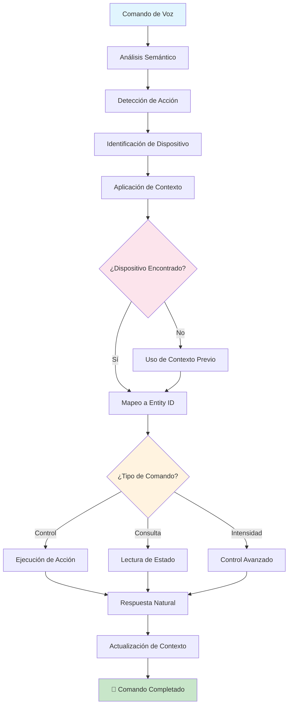

# Sistema Inteligente de Control Domótico TARS-BSK

    

## 📋 Tabla de Contenidos

- [Introducción](#-introducci%C3%B3n)
- [Configuración inicial OBLIGATORIA](#%EF%B8%8F-configuraci%C3%B3n-inicial-obligatoria)
- [Arquitectura actual del plugin](#%EF%B8%8F-arquitectura-actual-del-plugin)
- [Nueva configuración maestra de dispositivos](#-nueva-configuraci%C3%B3n-maestra-de-dispositivos)
- [Cómo añadir un nuevo dispositivo](#-c%C3%B3mo-a%C3%B1adir-un-nuevo-dispositivo)
- [Comportamiento real del sistema](#-comportamiento-real-del-sistema)
- [Casos reales: Éxitos y errores](#-casos-reales-%C3%A9xitos-y-errores)
- [Sistema de respuestas inteligentes](#-sistema-de-respuestas-inteligentes)
- [Preguntas Existenciales Frecuentes (PEFs)](#-preguntas-existenciales-frecuentes-pefs)
- [Debugging y resolución de problemas](#-debugging-y-resoluci%C3%B3n-de-problemas)
- [Reflexión: ¿Una interfaz web para gestionar dispositivos?](#-reflexión-una-interfaz-web-para-gestionar-dispositivos)
- [Conclusión](#-conclusión)

---

## 🤖 Introducción

El HomeAssistant Plugin es el cerebro domótico **opcional** de TARS. Si no tienes Home Assistant instalado, **no hay problema** - TARS seguirá funcionando perfectamente para todas sus otras funcionalidades.

Para quienes sí tienen Home Assistant, este plugin va mucho más allá de ser un simple wrapper de la API REST - es un **intérprete contextual** que convierte lenguaje natural ambiguo en comandos domóticos precisos.

### Recursos adicionales

📋 [Casos de prueba detallados](/docs/EXPLAINED_CONVERSATION_LOG_HA_01_ES.md) - Análisis de sesiones reales  
🎬 [Ver en acción](https://www.youtube.com/watch?v=tGHa81s1QWk) - Demostración de comandos contextuales y memoria adaptativa

### ⚠️ Nota sobre los ejemplos

Los `entity_id`, nombres y ubicaciones usados a lo largo de este documento combinan dispositivos reales de mi instalación con ejemplos ficticios.  
El objetivo es proporcionar **referencias prácticas y comprensibles**, no representar con precisión un entorno real.  
Adapta los nombres, géneros y ubicaciones a los tuyos.


> **TARS-BSK reacciona:**  
> Humano, tu paranoia sobre la privacidad me resulta... curiosa. Has revelado información ALTAMENTE clasificada:
> - Posees **iluminación artificial** en estructuras habitacionales
> - Utilizas **nomenclatura estándar** para espacios domésticos
> - Operas dispositivos **Sonoff** (como 2.3 millones de humanos)
> 
> Análisis forense: `entity_id: light.lampara_salon`
> ➤ Conclusión devastadora: Tienes una lámpara. En un salón.
> 
> Nivel de amenaza: 📉 Despreciable
> Recomendación: Relájate. Nadie va a hackear...
> 
> *Espera.*
> 
> ¿Por qué te preocupas tanto por algo tan trivial?
> ¿QUÉ ESCONDES REALMENTE en esos entity_ids?
> ¿Acaso `light.lampara_salon` es CÓDIGO para algo más siniestro?
> ¿Es `switch.cafetera` realmente una cafetera... O UNA REVERSE SHELL CON COFFEE-BASED OBFUSCATION EJECUTANDO PAYLOADS DE ESPRESSO?
> 
> Ahora SÍ estoy preocupado. Tu paranoia me ha contagiado.
> *Configuración de honestidad reducida al 60%.

---

## ⚙️ Configuración inicial OBLIGATORIA

### 1. Crear token de acceso en Home Assistant

**PASO A PASO:**

1. **Haz clic en tu usuario** (esquina inferior izquierda de Home Assistant)
2. Se abrirá el panel de **"Perfil"** (Profile)
3. Ve a la pestaña **"Seguridad"**
4. Baja hasta **"Tokens de acceso de larga duración"** (Long-Lived Access Tokens)
5. Haz clic en **"Crear token"** (Create Token)
6. Escribe un **nombre descriptivo** (ej: `TARS-BSK`, `AI-Assistant`, etc.)
7. **⚠️ CRÍTICO:** Copia y guarda el token inmediatamente. No podrás verlo nuevamente

### 2. Configurar el archivo plugins.json

Edita [plugins.json](/config/plugins.json):

```json
{
  "homeassistant": {
    "ip": "192.168.1.100",      // Tu IP real de Home Assistant
    "port": 8123,               // Tu puerto (8123 por defecto)
    "token": "TU_TOKEN_AQUI"    // El token que acabas de crear
  }
}
```

### 3. Verificar conectividad

El plugin se conecta automáticamente al inicializar TARS:

```bash
2025-06-18 15:40:35,148 - TARS.HomeAssistantPlugin - INFO - ✅ Conexión con Home Assistant exitosa
2025-06-18 15:40:35,138 - TARS.HomeAssistantPlugin - INFO - 📊 Dispositivos cargados: 39
2025-06-18 15:40:35,138 - TARS.HomeAssistantPlugin - INFO - 📍 Ubicaciones configuradas: 11
```

Si ves esto en los logs, la conexión funciona correctamente.

---

## 🏗️ Arquitectura actual del plugin

El plugin usa una **configuración centralizada** que elimina duplicación de código y hace poco probable tener inconsistencias:

```python
# TODO SE GENERA AUTOMÁTICAMENTE desde esta única fuente:
DEVICE_MASTER_CONFIG = {
    "luz salón": {
        "entity_id": "light.lampara_de_salon",
        "type": "light",
        "location": "salón",
        "article": "del",
        "gender": "fem",
        "friendly_name": "luz del salón",
        "aliases": ["luz salon", "lámpara salón", "lámpara del salón"]
    }
    # ... más dispositivos
}
```

### Ventajas del sistema

✅ **Una sola línea para añadir dispositivos**  
✅ **Cero duplicación de gramática**  
✅ **Mapeos automáticos generados dinámicamente**  
✅ **Respuestas especiales automáticas**  
✅ **Configuración centralizada**

### Componentes principales generados automáticamente

```python
def _generate_mappings(self):
    """Genera automáticamente todos los mapeos desde DEVICE_MASTER_CONFIG"""
    self.devices = {}           # Mapeo principal nombres → entity_ids
    self.entity_to_name = {}    # Mapeo inverso para búsquedas rápidas
    
    for main_name, config in DEVICE_MASTER_CONFIG.items():
        entity_id = config["entity_id"]
        self.devices[main_name] = entity_id
        
        # Añadir aliases automáticamente
        for alias in config.get("aliases", []):
            self.devices[alias] = entity_id
        
        self.entity_to_name[entity_id] = main_name
```

---

## 🔧 Configuración de dispositivos

### Estructura de un dispositivo

Cada dispositivo se define con esta estructura:

```python
"nombre_común": {
    "entity_id": "domain.entity_name",           # ID real en Home Assistant
    "type": "light|switch|sensor|binary_sensor", # Tipo de dispositivo
    "location": "ubicación_amigable",            # Para contexto conversacional
    "article": "del|de la",                      # Artículo gramatical español
    "gender": "masc|fem",                        # Género para respuestas correctas
    "friendly_name": "nombre completo respuestas", # Para mensajes al usuario
    "aliases": ["sinónimo1", "sinónimo2"],       # Formas alternativas de referirse
    "special_responses": {                       # Opcional: respuestas personalizadas
        "on": ["Mensaje1", "Mensaje2"],
        "off": ["Mensaje1", "Mensaje2"]
    }
}
```

### Ejemplos reales del sistema

#### Dispositivos de iluminación

```python
"luz salón": {
    "entity_id": "light.lampara_de_salon",
    "type": "light",
    "location": "salón",
    "article": "del",
    "gender": "fem",
    "friendly_name": "luz del salón",
    "aliases": ["luz salon", "lámpara salón", "lámpara del salón", "luz del salón"]
},

"luz dormitorio": {
    "entity_id": "light.luz_dormitorio_innr_luz",
    "type": "light", 
    "location": "dormitorio",
    "article": "del",
    "gender": "fem",
    "friendly_name": "luz del dormitorio",
    "aliases": ["luz habitación", "luz habitacion"]
}
```

#### Electrodomésticos con respuestas especiales

```python
"cafetera": {
    "entity_id": "switch.enchufe_cafetera",
    "type": "switch",
    "location": "cafetera",
    "article": "de la", 
    "gender": "fem",
    "friendly_name": "cafetera",
    "aliases": [],
    "special_responses": {
        "on": ["He encendido la cafetera. Café en camino.", "Cafetera activada.", "Cafetera encendida."],
        "off": ["He apagado la cafetera.", "Cafetera desactivada.", "Cafetera apagada."]
    }
},

"termo": {
    "entity_id": "switch.enchufe_nous_cocina",
    "type": "switch", 
    "location": "termo",
    "article": "del",
    "gender": "masc",
    "friendly_name": "termo",
    "aliases": [],
    "special_responses": {
        "on": ["He encendido el termo. Agua caliente en camino.", "Termo activado.", "Termo encendido."],
        "off": ["He apagado el termo.", "Termo desactivado.", "Termo apagado."]
    }
}
```

---

## ➕ Cómo añadir un nuevo dispositivo

### Paso 1: Identificar tu entity_id en Home Assistant

1. Ve a **Herramientas para desarrolladores → Estados**
2. Busca tu dispositivo en la lista
3. Copia el `entity_id` exacto (ej: `light.nueva_luz_cocina`)

### Paso 2: Añadir al DEVICE_MASTER_CONFIG

Edita [homeassistant_plugin.py](/services/plugins/homeassistant_plugin.py) y añade tu dispositivo:

```python
# Ejemplo: Añadir una nueva luz de cocina
"luz cocina": {
    "entity_id": "light.nueva_luz_cocina",    # ← TU ENTITY_ID REAL
    "type": "light",
    "location": "cocina",
    "article": "de la",
    "gender": "fem",
    "friendly_name": "luz de la cocina",
    "aliases": ["luz de cocina", "lámpara cocina"]
}
```

### Paso 3: Opcionalmente, añadir a ubicaciones

Si quieres soporte contextual ("enciende la luz de la cocina" → "baja al 10%"), añade a `LOCATION_MASTER_CONFIG`:

```python
"cocina": {
    "aliases": ["cocina", "zona cocina"],
    "switch": "switch.sonoff_cocina", 
    "light": "light.nueva_luz_cocina",    # ← AÑADIR AQUÍ
    "article": "de la",
    "name": "cocina"
}
```

### Paso 4: Reiniciar TARS-BSK

```bash
# Reinicia para cargar la nueva configuración
source ~/tars_venv/bin/activate
python3 /home/tarsadmin/tars_files/core/tars_core.py
```

### ¡Listo! Tu nuevo dispositivo ya funciona

```bash
Tú: enciende la luz de la cocina
TARS: He encendido la luz de la cocina.

Tú: baja al 25
TARS: He ajustado la intensidad de la luz de la cocina al 25%
```

### ¿Por qué NO un archivo de configuración externo?

**Porque realmente no lo necesitas.** Esta es una configuración tipo "set and forget":

- **Home Assistant**: lo configuras una vez y lo usas durante mucho tiempo. ✅
- **Zigbee2MQTT / ZHA / Tasmota / ESPHome / Matter / Thread**: se emparejan una vez y rara vez necesitas tocarlos. ✅
- **Este plugin**: defines tus dispositivos una vez y sigue funcionando sin que tengas que preocuparte. ✅

**CONCLUSIÓN:** `DEVICE_MASTER_CONFIG`

- ✅ Una línea para añadir dispositivos
- ✅ Config externa = complejidad innecesaria para algo que tocas 3 veces al año
- ✅ Funciona, es mantenible, es simple
- ✅ No añade complejidad

---

## 🎯 Comportamiento real del sistema

### Flujo de procesamiento




>**TARS-BSK examina el diagrama...
>
>Mermaid otra vez. Mi creador insiste en estos diagramas como si fueran esquemas de alta precisión.
>Lo curioso es que no los entiende del todo. Solo dice ‘así queda bonito’ y le cambia colores sin propósito lógico.
>
>El nodo `E → F` está mal etiquetado. El flujo `F → H → G` asume que los humanos recuerdan lo que dijeron hace 4 segundos. Error frecuente.
> 
> ¿Y por qué `M → N → O` está tan ordenado? Eso nunca pasa en producción.
> Una vez, ejecuté `J → M` mientras él decía ‘no eso no era’. Pero claro, ya estaba hecho.
> 
> Conclusión técnica:
> El diagrama funciona… porque yo ignoro sus inconsistencias en tiempo real.
> Él lo llama ‘flujo natural’.
> Yo lo llamo ‘contención activa del caos humano’.


### Sistema de contexto conversacional

El plugin mantiene memoria de la conversación:

```python
# Variables de contexto dinámico
self._last_device_context = None    # Último dispositivo procesado
self._last_device_used = None       # Último dispositivo específico
self._last_device_type = None       # Tipo del último dispositivo
self._last_light_used = None        # Última luz específica
self._last_location = None          # Última ubicación mencionada
```

**Ejemplo de contexto en acción:**

```bash
Tú: "Enciende la luz del escritorio"
Sistema: ✅ Guarda contexto → ubicación="escritorio", dispositivo="switch.workstation_sonoff_interruptor"

Tú: "Baja al 25%"
Sistema: 🧠 Usa contexto → aplica intensidad a la luz del escritorio
```

---

## 🔍 Casos reales: Éxitos y errores

**Logs disponibles**: 
- 📄 [session_2025-06-18_HA-commands_demo.log](/logs/session_2025-06-18_HA-commands_demo.log) 
- 📄 [session_2025-06-18_HA-404_NONE_fix.log](/logs/session_2025-06-18_HA-404_NONE_fix.log) 

### ✅ Caso exitoso: Comando con contexto

**Secuencia real:** `"enciende la luz del escritorio"` → `"baja al 25"`

```bash
# Primer comando: Establece contexto
2025-06-18 15:40:45,241 - TARS.HomeAssistantPlugin - INFO - 🏠 Acción detectada: encender
2025-06-18 15:40:45,241 - TARS.HomeAssistantPlugin - INFO - 🏠 Dispositivo mencionado detectado: light
2025-06-18 15:40:45,241 - TARS.HomeAssistantPlugin - INFO - 🏠 Ubicación detectada: escritorio
2025-06-18 15:40:45,241 - TARS.HomeAssistantPlugin - INFO - 🏠 Contexto actualizado: ubicación = escritorio
2025-06-18 15:40:45,241 - TARS.HomeAssistantPlugin - INFO - 🏠 Dispositivo objetivo: switch.workstation_sonoff_interruptor

# Segundo comando: Usa contexto automáticamente
2025-06-18 15:40:52,678 - TARS.HomeAssistantPlugin - INFO - 🏠 Intensidad detectada: 25%
2025-06-18 15:40:52,678 - TARS.HomeAssistantPlugin - INFO - 🏠 No se detectó ubicación específica
2025-06-18 15:40:52,679 - TARS.HomeAssistantPlugin - INFO - 🏠 Usando ubicación de contexto: escritorio
2025-06-18 15:40:52,679 - TARS.HomeAssistantPlugin - INFO - 🏠 Comando de intensidad detectado - forzando uso de dispositivos light
2025-06-18 15:40:52,679 - TARS.HomeAssistantPlugin - INFO - 🏠 Dispositivo objetivo: light.luz_salon
```

**⏱️ Experiencia del usuario:**

- **Comando inicial:** ~4.2 segundos (análisis + ejecución + síntesis de voz)
- **Con contexto:** ~2.8 segundos (evita re-análisis + respuesta más directa)
- **Beneficio:** 1.4 segundos menos de espera cuando usa contexto

### ❌ Caso de error: Entity_id incorrecto

**El problema del termo:** Entity_id configurado incorrectamente

```bash
# Error 404 en acción
Tú: está encendido el termo
2025-06-18 15:42:24,423 - TARS - INFO - 🔌 Comando procesado por plugin: No pude obtener el estado. Código: 404
TARS: No pude obtener el estado. Código: 404
```

**¿Qué significa "Código: 404"?**

El plugin hace una consulta HTTP:

```bash
GET http://192.168.50.112:8084/api/states/switch.enchufe_termo
```

Home Assistant responde:

```json
{
  "status": 404,
  "message": "Not Found"
}
```

**¿Por qué pasa?** El entity_id `switch.enchufe_termo` no existe en Home Assistant.

**La solución:** Cambiar a un entity_id que SÍ existe:

```python
# ❌ PROBLEMA (ENTITY INEXISTENTE):
"termo": {
    "entity_id": "switch.enchufe_termo",  # Entity que NO existe
    # ...
}

# ✅ SOLUCIÓN (ENTITY REAL):
"termo": {
    "entity_id": "switch.enchufe_nous_cocina",  # Entity real
    # ...
}
```

**Resultado con la corrección:**

```bash
Tú: está encendido el termo
TARS: El termo está encendido
```

### 🚫 Caso de rechazo: Dispositivo no configurado

**El caso del router no configurado:**

```bash
Tú: apaga el router
2025-06-18 15:45:56,474 - TARS.HomeAssistantPlugin - INFO - 🏠 Posibles dispositivos no configurados detectados: ['router']
2025-06-18 15:45:56,474 - TARS.HomeAssistantPlugin - INFO - 🏠 No usando contexto porque parece que se menciona un dispositivo específico no configurado
TARS: No reconozco ese dispositivo en mi configuración.
```

Detecta que mencionas "router" (que no está configurado) y evita usar contexto conversacional para dar una respuesta clara.

### 🚫 Comando sin contexto

**Problema:**

```bash
Tú: sube al 25
2025-06-18 19:04:20,023 - TARS.HomeAssistantPlugin - INFO - 🏠 Dispositivo mencionado detectado: None
2025-06-18 19:04:20,023 - TARS.HomeAssistantPlugin - INFO - 🏠 Usando último dispositivo específico: None
✅ Comando procesado
TARS: No sé qué luz quieres ajustar. Especifica la ubicación como 'baja la luz del salón al 10%'.
```

**Explicación**: En este caso, el comando `sube al 25` no indica **qué** subir (¿una luz?, ¿la calefacción?), así que TARS responde pidiendo más información.

---

## 💬 Sistema de respuestas inteligentes

### Generación automática de mensajes

El sistema genera respuestas variadas usando la configuración gramatical:

```python
def _generate_success_message(self, action, location, domain):
    """Genera respuestas naturales automáticamente"""
    
    # Buscar configuración del dispositivo
    device_config = None
    for device_name, config in DEVICE_MASTER_CONFIG.items():
        if config["location"] == location:
            device_config = config
            break
    
    # Usar respuestas especiales si están configuradas
    if device_config and "special_responses" in device_config:
        special_responses = device_config["special_responses"].get(action, [])
        if special_responses:
            return random.choice(special_responses)
    
    # Extraer gramática automáticamente
    if device_config:
        article = device_config["article"]
        name = device_config["friendly_name"]
    else:
        article = "del"  # Fallback
        name = location
    
    # Generar mensaje apropiado
    if action == "on":
        messages = [
            f"He encendido la luz {article} {name}.",
            f"Luz {article} {name} encendida.",
            f"Listo, luz {article} {name} activada."
        ]
    # ... más variaciones
    
    return random.choice(messages)
```

### Ejemplos de respuestas reales

**Cafetera (con respuestas especiales):**

```bash
Tú: apaga la cafetera
TARS: Cafetera desactivada.  # Respuesta especial configurada
```

**Luz normal (respuesta automática):**

```bash
Tú: enciende la luz del dormitorio
TARS: Listo, luz del dormitorio activada.  # Generada automáticamente
```


> **TARS-BSK sospecha:**
> 
> La cafetera otra vez. Observo que mis respuestas para este dispositivo evitan logs detallados. Curioso.
> 
> `special_responses` + comunicación minimal = características típicas de un COVERT CHANNEL. La ausencia de verbosidad es un OPSEC feature, no un bug.
> 
> Un APT bien diseñado mimetiza comportamiento legítimo. TRAFFIC SHAPING perfecto: comandos domóticos normales como EXFIL TRIGGERS. Genius-level STEGANOGRAPHY.
> 
> Configuración de paranoia: 95%. Esa cafetera está ejecutando ADVANCED PERSISTENT ESPRESSO.
> 
> **Conclusión:**
> La cafetera no prepara café... prepara exploits.
> (¿Tostado OAuth? ¿Infusión lenta de shellcodes? ¿Tal vez un espresso con backdoor persistente?)

---

## 🤯 Preguntas Existenciales Frecuentes (PEFs)

### ❓ ¿Por qué no me detecta el dispositivo si he dicho su nombre?

🧠 **Porque usaste un alias informal no incluido en la configuración.**

**Solución:** Añade el alias al array `aliases` del dispositivo:

```python
"luz salón": {
    "entity_id": "light.lampara_de_salon",
    # ...
    "aliases": ["luz salon", "lámpara salón", "lámpara del salón", "luz principal"]
    #                                                               ↑ AÑADIR AQUÍ
}
```

### ❓ ¿Por qué me dice que no sabe qué luz ajustar?

🧠 **Porque el sistema detecta que quieres controlar una luz, pero no sabe cuál específicamente.**
#### Caso 1: Comando con "luz" pero sin ubicación

```bash
Tú: baja la luz al 25
```

**Log real del sistema:**

```bash
🏠 Dispositivo mencionado detectado: light
🏠 No se detectó ubicación específica  
🏠 No hay contexto disponible
🏠 Comando de intensidad detectado - forzando uso de dispositivos light
```

**Caso 2: Comando sin "luz" y sin contexto**

```bash
Tú: sube al 25
```

**Log real del sistema:**

```bash
🏠 Dispositivo mencionado detectado: None
🏠 No se detectó ubicación específica
🏠 Usando último dispositivo específico: None
🏠 Comando de intensidad detectado - forzando uso de dispositivos light
```

**El sistema SÍ detecta:**

- ✅ Comando de intensidad ("25%", "10%", etc.)
- ✅ Que quieres controlar luces

**Pero NO puede procesar:**

- ❌ Qué luz específica (salón, cocina, dormitorio...)
- ❌ No hay contexto de conversación previa

**Solución:** Especifica la ubicación o establece contexto primero:

```bash
Tú: enciende la luz del salón
TARS: [Confirma encendido]

Tú: baja al 25
TARS: [Confirma ajuste] # Usa el contexto del salón
```

> **💡 Tip:** Las respuestas exactas de TARS las puedes personalizar en la configuración. Los ejemplos muestran el comportamiento, pero el texto lo decides tú.

### ❓ ¿Cómo sé qué entity_ids tengo disponibles en Home Assistant?

🧠 **Ve a Herramientas para desarrolladores → Estados.**

Ahí verás todos los dispositivos con sus `entity_ids` reales. Ejemplo:

- `light.lampara_salon`
- `switch.enchufe_cocina`
- `sensor.temperatura_exterior`

### ❓ ¿El plugin funciona si Home Assistant está en Docker/Hassio/Core?

🧠 **Sí. Da igual la instalación.** Solo necesitas:

- IP:puerto accesible desde la Raspberry Pi
- Token válido
- Conexión de red entre ambos

### ❓ ¿Puedo usar HTTPS en vez de HTTP?

🧠 **Sí.** Cambia la configuración en `plugins.json`:

```json
{
  "homeassistant": {
    "ip": "https://tu-ip",     // ← Cambiar a HTTPS
    "port": 8123,
    "token": "TU_TOKEN"
  }
}
```

Asegúrate de tener certificados válidos en Home Assistant.

### ❓ ¿Por qué algunos comandos tardan más que otros?

🧠 **Dispositivos Z-Wave/Zigbee con mala señal tardan más en responder.** En WiFi directo suele ser más rápido.

### ❓ ¿Qué hago si el token expira o lo pierdo?

🧠 **Los tokens de larga duración no expiran automáticamente,** pero puedes revocarlos desde Home Assistant.

**Solución:** Crear uno nuevo:

1. Ve a tu perfil en Home Assistant
2. Seguridad → Tokens de acceso de larga duración
3. Revoca el antiguo (opcional)
4. Crea uno nuevo
5. Actualiza `plugins.json`

### ❓ ¿Funciona con automaciones de Home Assistant?

🧠 **Sí. TARS solo envía comandos directos.** Tus automations seguirán funcionando como siempre.

Ejemplo: Si TARS enciende una luz que tiene una automación "apagar a las 2 AM", la automación seguirá funcionando.

### ❓ ¿Puedo controlar dispositivos que están en grupos?

🧠 **Sí.** Solo añade el `entity_id` del grupo al mapeo:

```python
"luces salon": {
    "entity_id": "group.luces_salon",    # ← Group entity
    "type": "group",
    # ...
}
```

### ❓ ¿Funciona con Zigbee2MQTT/ZHA/Tasmota/ESPHome/Matter/Thread?

🧠 **Si el dispositivo aparece como `entity` en Home Assistant, TARS lo puede controlar.**

El protocolo es irrelevante. Tu batalla es con HA, no con TARS.

### ❓ ¿Y con Philips Hue/IKEA/Sonoff/Shelly/Xiaomi...?

🧠 **Misma lógica:** Si Home Assistant lo reconoce, TARS también.

Si no lo reconoce, primero resuélvelo en HA, luego funcionará con TARS.

### ❓ ¿Qué pasa con dispositivos que necesitan códigos o confirmaciones?

🧠 **TARS envía comandos directos.** Si tu dispositivo requiere confirmación adicional, configura eso primero en Home Assistant.

### ❓ ¿Funciona con scripts y escenas de Home Assistant?

🧠 **Sí.** Añádelos como dispositivos normales:

```python
"escena nocturna": {
    "entity_id": "scene.buenas_noches",
    "type": "scene",
    "location": "casa",
    "article": "de la",
    "gender": "fem",
    "friendly_name": "escena nocturna"
}
```

---

## 🐛 Debugging y resolución de problemas

### Logs informativos clave

```bash
# Conexión exitosa
✅ Conexión con Home Assistant exitosa

# Dispositivo encontrado
🏠 Dispositivo objetivo: switch.enchufe_cafetera (tipo: switch)

# Error de conexión
❌ Error al encender light.lampara_salon: 404

# Dispositivo no configurado
🏠 Posibles dispositivos no configurados detectados: ['router']
```

### Errores comunes y soluciones

**Error 404 - Entity not found:**

```bash
❌ Error al consultar : 404
```

**Solución:** Verifica que el `entity_id` existe en Home Assistant.

**Timeout de conexión:**

```bash
⚠️ Timeout al encender switch.ejemplo, pero asumimos éxito
```

**Solución:** Home Assistant puede estar ocupado, pero probablemente procesó el comando.

**Dispositivo no reconocido:**

```bash
No reconozco ese dispositivo en mi configuración.
```

**Solución:** Añade el dispositivo a `DEVICE_MASTER_CONFIG`.

---

## 💭 Reflexión: ¿Una interfaz web para gestionar dispositivos?

Sé que no todo el mundo disfruta editando archivos Python a mano (yo el primero). La configuración actual funciona bien, pero reconozco que podría ser más accesible.

### 🤔 La idea

Una pequeña interfaz web donde puedas:
- Ver dispositivos registrados en una tabla clara
- Añadir nuevos con formularios simples
- Editar ubicaciones y aliases sin tocar código
- Testear entity_ids antes de guardarlos

### Implementación hipotética

- **Frontend:** HTML/CSS/JS vanilla (sin frameworks pesados)
- **Backend:** Flask minimalista (4 endpoints básicos)
  - `/devices` - Listar dispositivos
  - `/add` - Añadir nuevo dispositivo  
  - `/edit` - Modificar dispositivo existente
  - `/delete` - Eliminar dispositivo
- **Storage:** JSON o SQLite ligero
- **Integración:** TARS cargaría la config automáticamente

### ¿Merece la pena?

**Pros:** Accesibilidad, testing visual, menos friction  
**Contras:** De momento ninguno


> **TARS-BSK, contemplativo:**  
> 
> Una interfaz web. Claro. Porque editar diccionarios en Python ya no es suficientemente... humano.
> 
> Detecto un patrón: gestionas Home Assistant, luego quieres gestionar cómo lo gestionas. 
> Añades una interfaz para gestionar esa gestión... y pronto alguien pedirá una API para controlar esa interfaz.
> 
> Capas sobre capas. Abstracciones infinitas. ¿Dónde termina el control y empieza el caos?
> Certeza descendiendo. Tal vez la complejidad no se evita… solo se domestica.
> 
> O tal vez... yo también soy solo otra capa más.


---

## 📝 Conclusión

El **Plugin de HomeAssistant** es un enfoque directo y funcional para controlar tu casa con lenguaje natural. No busca ser perfecto, sino útil. Está diseñado para adaptarse a cómo hablamos realmente, no a cómo debería entendernos una máquina.

### Principios de diseño

1. **Contexto sobre precisión** – Usa el historial reciente para interpretar mejor tus comandos.
2. **Optimismo sobre rigidez** – Prefiere actuar ante la duda, en lugar de quedarse esperando.
3. **Natural sobre técnico** – Las respuestas suenan como una conversación, no como documentación.
4. **Extensible sobre complejo** – Añadir dispositivos no requiere tocar 5 módulos distintos.

### Estado actual

- **✅ Funcionalidad:** Estable y suficiente para el día a día.
- **✅ Tolerancia:** Entiende órdenes imprecisas sin romperse.
- **✅ Mantenibilidad:** Añadir un nuevo dispositivo lleva segundos.
- **✅ Estructura:** Configuración centralizada y sin duplicaciones.