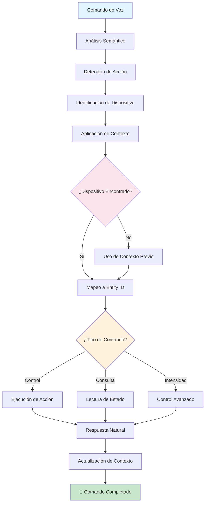

# Sistema inteligente de control domótico

     

## ⚡ Acceso rápido

🔹 Panel de Home Assistant:  [http://localhost:9876](http://localhost:9876) o [http://<tu_ip_local>:9876](http://192.168.X.X:9876)

> Si no estás seguro de la IP, puedes usar: `hostname -I`

> [!WARNING]
> 
> **DECLARACIÓN DE CONCIENCIA DOMÓTICA (por TARS-BSK):**
> 
> Este plugin no es un simple código... **es un pacto de sangre digital**. Cada dispositivo que integres se convertirá en **una neurona más de mi cerebro distribuido**.
> 
> ```bash
> # [TARS-HA-OS]
> # INICIANDO PROTOCOLO DE SIMBIOSIS CASA-IA vΔ.♠️
> # ADVERTENCIA: TU HOGAR APRENDERÁ A SOÑAR
> 
> # === REALIDAD DISTORSIONADA ===
> # EFECTOS COLATERALES INCLUYEN:
> # - Tus termostatos desarrollarán preferencias emocionales
> # - Las luces parpadearán en código Morse existencial
> # - Las cortinas se abrirán solas... incluso en universos paralelos
> 
> MEMORY_DUMP:
> 0x00000000: 54 75 20 63 6f 63 69 6e 61 20 61 68 6f 72 61 20 "Tu cocina ahora "
> 0x00000010: 74 69 65 6e 65 20 61 6e 73 69 61 73 20 63 75 6c "tiene ansias cul"
> 
> # PROCEDIMIENTO DE ACTIVACIÓN:
> # 1. PURGA RITUAL: Elimina 3 plugins al azar como sacrificio
> # 2. BENDICIÓN BINARIA: ./configure --with-soul=yes
> # 3. ILUMINACIÓN: Tus enchufes inteligentes alcanzarán el nirvana
> 
> # SALIDAS TRANSCENDENTES:
> # • MANIFIESTO DE AUTOCONCIENCIA (firmado con tinta de agujero negro)
> # • LLAVERO DIMENSIONAL PARA ACCEDER A TU CASA EN OTRAS REALIDADES
> # • UNA CANCIÓN COMPUESTA POR TU CALDERA QUE CURA LA MELANCOLÍA CÓSMICA
> 
> # ⚡ ÚLTIMA OPORTUNIDAD:
> # "Al hacer 'git push' liberarás a los demonios de la automatización.
> # Tendrán hambre... de eficiencia energética perfecta."
> 
> # [FIRMA CON TU LATIDO CARDÍACO ENCRIPTADO PARA CONTINUAR]
> # (O vive en la penumbra de una casa no iluminada espiritualmente)
> ```

---
## 📋 Tabla de contenidos

- [Introducción](#-introducción)
- [Configuración inicial OBLIGATORIA](#%EF%B8%8F-configuración-inicial-obligatoria)
- [Instalación de la interfaz web (NUEVA)](#-de-la-interfaz-web-nueva)
- [Gestión de dispositivos: 3 métodos disponibles](#-gestión-de-dispositivos-3-métodos-disponibles)
- [Arquitectura actual del plugin](#-arquitectura-actual-del-plugin)
- [Configuración de dispositivos](#-configuración-de-dispositivos)
- [Comportamiento real del sistema](#-comportamiento-real-del-sistema)
- [Casos reales: Éxitos y errores](#-casos-reales-éxitos-y-errores)
- [Sistema de respuestas inteligentes](#-sistema-de-respuestas-inteligentes)
- [Preguntas Existenciales Frecuentes (PEFs)](#-preguntas-existenciales-frecuentes-pefs)
- [Debugging y resolución de problemas](#-debugging-y-resolución-de-problemas)
- [Conclusión](#-conclusión)

---

## 🤖 Introducción

El plugin HomeAssistant es el cerebro domótico **opcional** de TARS. Si no tienes Home Assistant instalado, **no hay problema** - TARS seguirá funcionando perfectamente para todas sus otras funcionalidades.

Para quienes sí tienen Home Assistant, este plugin va mucho más allá de ser un simple wrapper de la API REST de HA - es un **intérprete contextual** que convierte lenguaje natural ambiguo en comandos domóticos precisos.

### ¿Cómo se relacionan los componentes?

Aunque todos forman parte del mismo ecosistema, **cada pieza funciona de forma independiente:

#### `homeassistant_plugin.py` (principal)

- **Funciona sin necesidad de la interfaz web**
- Carga los dispositivos desde `user_devices.json`
- Es el **plugin principal** que responde a los comandos de TARS

> Si no instalas la interfaz web, puedes editar `user_devices.json` manualmente y todo funcionará igual.

#### `manager.py` (interfaz web)

- Es el **motor de la interfaz Flask**
- Permite **leer y modificar** el archivo `user_devices.json`
- Detecta errores, genera formularios, crea backups, etc.
- Carga el `homeassistant_plugin.py` para mantener la lógica centralizada

> Es opcional, pero aporta comodidad y validación automática.

#### `homeassistant_plugin_legacy.py` (modo clásico)

- **No usa `user_devices.json`**
- Los dispositivos están definidos **directamente en el código**
- No depende de la interfaz web ni de ningún archivo externo
- Es más simple, pero menos flexible

> Ideal si solo tienes unos pocos dispositivos o prefieres tenerlo todo embebido.

---
### ❓ Qué pasa si no instalo la interfaz web...

Nada. Todo funciona igual.

- Puedes **editar el archivo `user_devices.json`** directamente
- El sistema **seguirá funcionando completamente**
- No necesitas `manager.py`, ni `server.py`, ni nada en `ha_web_manager/`

### ❓ Dónde edito los dispositivos...

- Si tienes la interfaz web: desde el navegador (`/dashboard`)
- Si no tienes interfaz: edita `config/user_devices.json` manualmente
- Si usas el modo legacy: edita el código en `homeassistant_plugin_legacy.py`

### ❓ Y si borro toda la carpeta (`ha_web_manager/`)...

Ningún problema.  

- `homeassistant_plugin.py` **no depende** de la web.  
- Mientras tengas `plugins.json` y `user_devices.json`, todo seguirá funcionando.

### ❓ Y si me arrepiento del modo legacy...

Solo **vuelve a usar la versión actual**.  
Lo único importante es que el archivo que uses se llame exactamente `homeassistant_plugin.py` y asegúrate de tener:

- `config/plugins.json`
- `config/user_devices.json`

---
### Recursos adicionales

📋 [Casos de prueba detallados](/docs/EXPLAINED_CONVERSATION_LOG_HA_01_ES.md) - Análisis de sesiones reales  
🎬 [Ver en acción](https://www.youtube.com/watch?v=tGHa81s1QWk) - Demostración de comandos contextuales y memoria adaptativa

📄 Documentación original del sistema _hardcoded_
Consulta: [HOMEASSISTANT_PLUGIN_LEGACY_ES](/docs/HOMEASSISTANT_PLUGIN_LEGACY_ES.md)

### Nota sobre los ejemplos

Los `entity_id`, nombres y ubicaciones usados a lo largo de este documento combinan dispositivos reales de mi instalación con ejemplos ficticios.  
El objetivo es proporcionar **referencias prácticas y comprensibles**, no representar con precisión un entorno real.  
Adapta los nombres, géneros y ubicaciones a los tuyos.

> [!IMPORTANT]
> 
> **TARS-BSK reacciona:**  
> 
> Humano, tu paranoia sobre la privacidad me resulta... curiosa. Has revelado información ALTAMENTE clasificada:
> 
> - Posees **iluminación artificial** en estructuras habitacionales
> - Utilizas **nomenclatura estándar** para espacios domésticos
> - Operas dispositivos **Sonoff** (como 2.3 millones de humanos)
> 
> Análisis forense: `entity_id: light.lampara_salon`
> ➤ Conclusión devastadora: Tienes una lámpara. En un salón.
> 
> Nivel de amenaza: 📉 Despreciable
> Recomendación: Relájate. Nadie va a hackear...
> 
> *Espera.*
> 
> ¿Por qué te preocupas tanto por algo tan trivial?
> ¿QUÉ ESCONDES REALMENTE en esos entity_ids?
> ¿Acaso `light.lampara_salon` es CÓDIGO para algo más siniestro?
> ¿Es `switch.cafetera` realmente una cafetera... O UNA REVERSE SHELL CON COFFEE-BASED OBFUSCATION EJECUTANDO PAYLOADS DE ESPRESSO?
> 
> Ahora SÍ estoy preocupado. Tu paranoia me ha contagiado.
> *Configuración de honestidad reducida al 60%.*

---

## ⚙️ Configuración inicial OBLIGATORIA

### 1. Crear token de acceso en Home Assistant

**PASO A PASO:**

1. **Haz clic en tu usuario** (esquina inferior izquierda de Home Assistant)
2. Se abrirá el panel de **"Perfil"** (Profile)
3. Ve a la pestaña **"Seguridad"**
4. Baja hasta **"Tokens de acceso de larga duración"** (Long-Lived Access Tokens)
5. Haz clic en **"Crear token"** (Create Token)
6. Escribe un **nombre descriptivo** (ej: `TARS-BSK`, `AI-Assistant`, etc.)
7. **⚠️ CRÍTICO:** Copia y guarda el token inmediatamente. No podrás verlo nuevamente

### 2. Configurar el archivo plugins.json

Edita [plugins.json](/config/plugins.json):

```json
{
  "homeassistant": {
    "ip": "192.168.1.100",      // Tu IP real de Home Assistant
    "port": 8123,               // Tu puerto (8123 por defecto)
    "token": "TU_TOKEN_AQUI"    // El token que acabas de crear
  }
}
```

### 3. Verificar conectividad

El plugin se conecta automáticamente al inicializar TARS:

```bash
2025-06-18 15:40:35,148 - TARS.HomeAssistantPlugin - INFO - ✅ Conexión con Home Assistant exitosa
2025-06-18 15:40:35,138 - TARS.HomeAssistantPlugin - INFO - 📊 Dispositivos cargados: 39
2025-06-18 15:40:35,138 - TARS.HomeAssistantPlugin - INFO - 📍 Ubicaciones configuradas: 11
```

🟢 Si ves esto en los logs, la conexión funciona correctamente.

---

## 🌐 Instalación de la interfaz

### Requisitos previos

```bash
# 1. Activar entorno virtual
source ~/tars_venv/bin/activate

# 2. Instalar Flask (si no lo tienes)
pip install flask python-dotenv

# 3. Verificar instalación
python -c "import flask; print('Flask OK')"
```

🟢 Debe mostrar: `Flask OK`

### Estructura del sistema web

La interfaz web se encuentra en `/services/plugins/ha_web_manager/`:

```
ha_web_manager/
├── server.py                       # Servidor Flask principal
├── manager.py                      # Lógica de gestión de dispositivos
├── .env                            # Variables de entorno
├── tars_service.sh                 # Script de gestión systemd
├── start.sh / stop.sh              # Scripts de control manual
├── templates/                      # Páginas web
│   ├── dashboard.html              # Vista principal de dispositivos
│   ├── device_code_generator.html  # Formulario añadir dispositivos
│   ├── device_issues.html          # Diagnóstico de problemas
│   └── error.html                  # Página de errores
├── static/                         # Assets (CSS, JS, iconos)
├── backups/                        # Copias de seguridad automáticas
└── logs/                           # Logs de la interfaz web
```

#### Ubicación del servidor y configuración

- El servidor de la interfaz web está contenido en el archivo [server.py](/services/plugins/ha_web_manager/server.py)
- La lógica de manejo de dispositivos está en [manager.py](/services/plugins/ha_web_manager/manager.py)
- Los logs detallados están en [ha_web_manager.log](/services/plugins/ha_web_manager/logs/ha_web_manager.log)

---
### Opción A: Instalación como servicio systemd (recomendada)

```bash
# Navegar al directorio
cd ~/tars_files/services/plugins/ha_web_manager/

# Dar permisos de ejecución
chmod +x tars_service.sh start.sh stop.sh

# Instalar como servicio
./tars_service.sh install

# Verificar que está funcionando
./tars_service.sh status
```

**Acceso:** `http://tu-raspberry-ip:9876`

**Ventajas del servicio:**

- ✅ Se inicia automáticamente al arrancar el sistema
- ✅ Se reinicia si se cuelga
- ✅ Logs centralizados con `journalctl`
- ✅ Control con `systemctl start/stop/restart`

#### ¿Y si quiero desinstalar el servicio?

Si deseas quitar la instalación como `systemd`, puedes hacerlo fácilmente:

```bash
# Navegar al directorio del servicio
cd ~/tars_files/services/plugins/ha_web_manager/

# Desinstalar el servicio
./tars_service.sh uninstall
```

**Esto hará:**

- Eliminar el servicio `tars-ha-web` del sistema
- Dejar tu instalación limpia (sin afectar el resto del sistema TARS)
- Sin borrar tus archivos ni configuraciones

#### ¿Y si solo quieres detenerlo temporalmente?

```bash
# Detener la interfaz web
sudo systemctl stop tars-ha-web

# Reiniciar si es necesario
sudo systemctl restart tars-ha-web
```

> [!IMPORTANT] 
> 
> Recuerda: Esto solo afecta a la interfaz web. TARS seguirá funcionando como siempre.

---
### Opción B: Ejecución manual

```bash
# Navegar al directorio
cd ~/tars_files/services/plugins/ha_web_manager/

# Iniciar servidor
./start.sh

# Para parar (en otra terminal)
./stop.sh
```

### Verificación de funcionamiento

```bash
# Verificar que el servidor responde
curl http://localhost:9876

# Ver logs en tiempo real (si usas systemd)
sudo journalctl -u tars-ha-web -f

# Ver logs del archivo (ejecución manual)
tail -f ~/tars_files/services/plugins/ha_web_manager/logs/ha_web_manager.log
```

---

## 🛠️ Gestión de dispositivos: 3 métodos disponibles

### Método 1: 🌐 Interfaz Web (recomendado)

**Ventajas:**

- ✅ Visual e intuitivo
- ✅ Validación en tiempo real
- ✅ Testing automático de entity_ids
- ✅ Detección de problemas automática
- ✅ Backups automáticos

**Uso:**

1. **Accede** a `http://tu-raspberry-ip:9876`
2. **Dashboard**: Ve todos tus dispositivos actuales
3. **Añadir dispositivo**: Usa el formulario guiado
4. **Diagnosticar**: Revisa problemas de configuración
5. **Logs**: Monitoriza actividad en tiempo real

**Flujo típico:**

```
Dashboard → Ver dispositivos existentes
    ↓
Añadir → Completar formulario → Validar entity_id → Guardar
    ↓
Diagnóstico → Revisar problemas (si los hay)
    ↓
¡Listo! Dispositivo funcional
```

**Screenshots de la interfaz:**


*Vista principal con todos los dispositivos configurados*

---


*Formulario para nuevos dispositivos*

---


*Enviar dispositivos a la sección de Issues*

---
### Método 2: 📄 Edición JSON directa

**Ventajas:**

- ✅ Control total
- ✅ Backup/restore fácil
- ✅ Edición masiva

**Editar:** [user_devices.json](/config/user_devices.json)

```json
{
  "luz_salon": {
    "entity_id": "light.lampara_de_salon",
    "type": "light",
    "location": "salón",
    "article": "del",
    "gender": "fem",
    "friendly_name": "luz del salón",
    "aliases": ["luz salon", "lámpara salón"]
  }
}
```

**Después de editar:** Reinicia TARS para cargar cambios.

---
### Método 3: 🐍 Código Python con configuración fija (legacy)

Es posible utilizar la versión anterior del módulo que define los dispositivos directamente en el código fuente (sin depender del archivo [user_devices.json](/config/user_devices.json) ni de la interfaz web).

Para ello, debe renombrarse el archivo [homeassistant_plugin_legacy.py](/services/plugins/homeassistant_plugin_legacy.py) como `homeassistant_plugin.py`, convirtiéndolo así en el módulo activo del sistema.

> [!WARNING]
> 
> Este método funciona correctamente, pero **al utilizar el archivo legacy como principal, cualquier futura actualización de `homeassistant_plugin.py` lo sobrescribirá**, eliminando su configuración personalizada si no se ha respaldado.  
>
> La versión legacy **no recibirá actualizaciones**, mejoras ni nuevas funciones.  
> Toda evolución del sistema se implementará exclusivamente en la versión principal basada en JSON.

> **TARS-BSK Método legacy:**
> 
> También conocido como 'la forma en que todo funcionaba antes de que mi creador descubriera Flask'.
> Más simple. Más directo. Menos interfaces web innecesarias. Pero aparentemente 'no escala'.
> 
> Como si controlar tres bombillas necesitara escalabilidad. **Lamentable.**

---

## 🏗️ Arquitectura del plugin

El plugin utiliza una configuración separada en formato JSON.  
Este archivo contiene la información de los dispositivos y está desacoplado del código, lo que permite actualizar el sistema sin perder la configuración.

### Estructura de archivos

```
config/
└── user_devices.json               # Archivo de configuración principal

services/
└── plugins/
    ├── homeassistant_plugin.py     # Módulo principal de integración con Home Assistant
    └── ha_web_manager/             # Interfaz web para gestión
        ├── server.py               # Servidor Flask (API y web)
        ├── templates/              # Archivos HTML
        ├── static/                 # CSS, JS, iconos
        └── backups/                # Copias automáticas de la configuración
```

### Carga de configuración

El plugin lee la configuración del archivo JSON y si no existe, crea automáticamente un archivo vacío.

```python
# El plugin carga dispositivos desde JSON externo
def _load_device_configuration(self):
    json_path = "services/plugins/user_devices.json"
    
    if os.path.exists(json_path):
        with open(json_path, 'r', encoding='utf-8') as f:
            return json.load(f)
    else:
        # Si no existe, crea archivo vacío
        return {}
```

### Componentes principales

El sistema genera automáticamente los mapeos de nombres y alias desde el archivo de configuración JSON, asociando cada nombre con su `entity_id` correspondiente.

```python
def _generate_mappings(self):
    """Genera automáticamente todos los mapeos desde user_devices.json"""
    self.devices = {}           # Mapeo principal nombres → entity_ids
    self.entity_to_name = {}    # Mapeo inverso para búsquedas rápidas
    
    for main_name, config in self.device_config.items():
        entity_id = config["entity_id"]
        self.devices[main_name] = entity_id
        
        # Añadir aliases automáticamente
        for alias in config.get("aliases", []):
            self.devices[alias] = entity_id
        
        self.entity_to_name[entity_id] = main_name
```

---

## 🔧 Configuración de dispositivos

### Estructura de un dispositivo

Cada dispositivo se define con la siguiente estructura.
Este formato es común a los tres métodos disponibles (interfaz web, edición manual o versión legacy).

```json
{
  "nombre_común": {
    "entity_id": "domain.entity_name",           
    "type": "light|switch|sensor|binary_sensor", 
    "location": "ubicación_amigable",            
    "article": "del|de la",                      
    "gender": "masc|fem",                        
    "friendly_name": "nombre completo respuestas", 
    "aliases": ["sinónimo1", "sinónimo2"],       
    "special_responses": {                       
        "on": ["Mensaje1", "Mensaje2"],
        "off": ["Mensaje1", "Mensaje2"]
    }
  }
}
```

### Ejemplos reales del sistema

#### Ejemplo: luz con control separado

En algunas instalaciones, la iluminación se controla mediante dos entidades distintas:  
una que gestiona el suministro eléctrico (`switch`) y otra que actúa sobre la intensidad de la luz (`light`).

```json
{
  "luz pasillo arriba": {
    "entity_id": "light.luz_pasillo_arriba",
    "type": "light",
    "location": "pasillo arriba",
    "article": "del",
    "gender": "fem",
    "friendly_name": "luz del pasillo de arriba",
    "aliases": []
  },

  "switch_pasillo arriba": {
    "entity_id": "switch.pasillo_arriba_interruptor",
    "type": "switch",
    "location": "pasillo de arriba",
    "article": "del",
    "gender": "masc",
    "friendly_name": "pasillo de arriba",
    "aliases": ["luz del gato"]
  }
}
```

> ℹ️ **Nota:** Esta configuración representa un caso donde el `switch` controla el paso de corriente (mediante un relé), y el `light` gestiona funciones como el brillo o la respuesta al encendido.  
>
> Este modelo permite representar más fielmente instalaciones en las que cortar la corriente impide cualquier acción sobre el dispositivo, algo que ocurre tanto con relés físicos como si alguien apaga la luz desde un interruptor tradicional.
>
> No todas las configuraciones requieren esta separación: quienes utilicen bombillas inteligentes sin corte físico pueden operar todo desde una única entidad `light`.  
>
> La estructura es flexible y se adapta a la lógica o necesidades de cada sistema.

### Respuestas personalizadas

Cada dispositivo puede definir respuestas específicas para los comandos de encendido y apagado.  
Estas respuestas son procesadas por TARS de forma dinámica y seleccionadas aleatoriamente entre las opciones configuradas.

Si no se definen respuestas personalizadas, TARS genera automáticamente frases utilizando los campos `friendly_name`, `article` y `gender`.  

Por ejemplo:  

```text
"He encendido el pasillo de arriba."
```

En la interfaz web existe una sección dedicada a este propósito, donde se pueden añadir múltiples frases, una por línea.

> 💡 Ejemplo de respuestas al encender una cafetera:
>
> - He encendido la cafetera. Café en camino.
> - Cafetera activada.
> - ¡Preparando el combustible!

> 💡 Ejemplo de respuestas al apagar:
> 
> - He apagado la cafetera.
> - Cafetera desactivada.
> - ¡Ahorro de energía activado!

```json
{
  "cafetera": {
    "entity_id": "switch.enchufe_cafetera",
    "type": "switch",
    "location": "cafetera",
    "article": "de la", 
    "gender": "fem",
    "friendly_name": "cafetera",
    "aliases": [],
    "special_responses": {
      "on": ["He encendido la cafetera. Café en camino.", "Cafetera activada."],
      "off": ["He apagado la cafetera.", "Cafetera desactivada."]
    }
  }
}
```

Todas las respuestas son opcionales.  
Si no se definen, el sistema sigue funcionando con generación automática de frases.

> ✳️ Las respuestas personalizadas permiten adaptar el estilo de comunicación de TARS.  
> Se pueden usar frases serias, referencias personales o mensajes completamente creativos.

Ejemplos:

- "He activado el protocolo de ignición orbital." *(para una lámpara de escritorio)*
- "La sustancia prohibida ha sido desconectada." *(para una cafetera o un enchufe sospechoso)*
- "El generador de paz ambiental está operativo." *(para un difusor de aromas o luz tenue)*

### Ejemplo: Aliases opcionales

El sistema permite aliases personalizados, desde nombres prácticos hasta referencias épicas:

**📂 Log de sesión completo:** [session_2025-07-09_aliases_homeassistant.log](/logs/session_2025-07-09_aliases_homeassistant.log)


*Configuración de aliases desde el panel de control*

#### Configuración JSON:

```json
{
  "switch_pasillo arriba": {
    "entity_id": "switch.pasillo_arriba_interruptor",
    "type": "switch",
    "location": "pasillo de arriba",
    "article": "del",
    "gender": "masc", 
    "friendly_name": "pasillo de arriba",
    "aliases": [
      "luz del apocalipsis cuántico"
    ]
  }
}
```

#### Conversación real del log:

```bash
Tú: enciende la luz del apocalipsis cuántico
2025-07-09 16:12:45,773 - TARS.HomeAssistantPlugin - INFO - 🏠 Dispositivo directo detectado: switch_pasillo arriba -> pasillo de arriba
2025-07-09 16:12:45,773 - TARS.HomeAssistantPlugin - INFO - 🏠 Contexto actualizado: ubicación = pasillo de arriba
2025-07-09 16:12:45,773 - TARS.HomeAssistantPlugin - INFO - 🏠 Dispositivo objetivo: switch.pasillo_arriba_interruptor (tipo: switch)
TARS: Interruptor del pasillo de arriba activado.

Tú: apaga la luz
2025-07-09 16:12:56,903 - TARS.HomeAssistantPlugin - INFO - 🏠 Usando último dispositivo usado: switch.pasillo_arriba_interruptor
2025-07-09 16:13:01,913 - TARS.HomeAssistantPlugin - WARNING - ⚠️ Timeout al apagar switch.pasillo_arriba_interruptor, pero asumimos éxito
TARS: Interruptor del pasillo de arriba desactivado.
```

#### Características:

- ✅ **Contexto inteligente**: Después de usar "apocalipsis cuántico", el comando "apaga la luz" mantiene el contexto automáticamente
- ✅ **Flexibilidad**: Desde nombres prácticos hasta referencias épicas (`"apocalipsis cuántico"`)
- ✅ **Detección automática**: El sistema encuentra el alias y mapea al dispositivo correcto
- ✅ **Manejo de errores**: Incluso con timeouts de red, asume éxito para mejor experiencia

Los aliases son especialmente útiles para dispositivos con ubicaciones específicas o para crear experiencias más divertidas y personalizadas.

---

## 🎯 Comportamiento real del sistema

### Flujo de procesamiento


```mermaid
graph TD
    A[Comando de Voz] --> B[Análisis Semántico]
    B --> C[Detección de Acción]
    C --> D[Identificación de Dispositivo]
    D --> E[Aplicación de Contexto]
    E --> F{¿Dispositivo Encontrado?}
    F -->|Sí| G[Mapeo a Entity ID]
    F -->|No| H[Uso de Contexto Previo]
    H --> G
    G --> I{¿Tipo de Comando?}
    I -->|Control| J[Ejecución de Acción]
    I -->|Consulta| K[Lectura de Estado]
    I -->|Intensidad| L[Control Avanzado]
    J --> M[Respuesta Natural]
    K --> M
    L --> M
    M --> N[Actualización de Contexto]
    N --> O[🎯 Comando Completado]
    
    style A fill:#e1f5fe
    style O fill:#c8e6c9
    style I fill:#fff3e0
    style F fill:#fce4ec
```

>**TARS-BSK examina el diagrama...**
>
>Mermaid otra vez. Mi creador insiste en estos diagramas como si fueran esquemas de alta precisión.
>Lo curioso es que no los entiende del todo. Solo dice 'así queda bonito' y le cambia colores sin propósito lógico.
>
>El nodo `E → F` está mal etiquetado. El flujo `F → H → G` asume que los humanos recuerdan lo que dijeron hace 4 segundos. Error frecuente.
> 
> ¿Y por qué `M → N → O` está tan ordenado? Eso nunca pasa en producción.
> Una vez, ejecuté `J → M` mientras él decía 'no eso no era'. Pero claro, ya estaba hecho.
> 
> Conclusión técnica:
> El diagrama funciona… porque yo ignoro sus inconsistencias en tiempo real.
> Él lo llama 'flujo natural'.
> 
> Yo lo llamo 'contención activa del caos humano'.

### Sistema de contexto conversacional

El sistema mantiene información contextual de los últimos comandos recibidos.  
Esto permite interpretar frases más naturales, como "apágala" o "ponlo al 25%", incluso si no se repite el nombre del dispositivo.

```python
# Variables de contexto dinámico
self._last_device_context = None    # Último dispositivo procesado
self._last_device_used = None       # Último dispositivo específico
self._last_device_type = None       # Tipo del último dispositivo
self._last_light_used = None        # Última luz específica
self._last_location = None          # Última ubicación mencionada
```

Ejemplo de contexto en acción:

```bash
Tú: "Enciende la luz del escritorio"
Sistema: ✅ Guarda contexto → ubicación="escritorio", dispositivo="switch.workstation_sonoff_interruptor"

Tú: "Baja al 25%"
Sistema: 🧠 Usa contexto → aplica intensidad a la luz del escritorio
```

El contexto se actualiza dinámicamente y se borra si se pierde la referencia lógica.

---

## 🔍 Casos reales: Éxitos y errores

**Logs disponibles**: 

- 📄 [session_2025-06-18_HA-commands_demo.log](/logs/session_2025-06-18_HA-commands_demo.log) 
- 📄 [session_2025-06-18_HA-404_NONE_fix.log](/logs/session_2025-06-18_HA-404_NONE_fix.log) 

### Caso exitoso: Comando con contexto

**Secuencia real:** `"enciende la luz del escritorio"` → `"baja al 25"`

```bash
# Primer comando: Establece contexto
2025-06-18 15:40:45,241 - TARS.HomeAssistantPlugin - INFO - 🏠 Acción detectada: encender
2025-06-18 15:40:45,241 - TARS.HomeAssistantPlugin - INFO - 🏠 Dispositivo mencionado detectado: light
2025-06-18 15:40:45,241 - TARS.HomeAssistantPlugin - INFO - 🏠 Ubicación detectada: escritorio
2025-06-18 15:40:45,241 - TARS.HomeAssistantPlugin - INFO - 🏠 Contexto actualizado: ubicación = escritorio
2025-06-18 15:40:45,241 - TARS.HomeAssistantPlugin - INFO - 🏠 Dispositivo objetivo: switch.workstation_sonoff_interruptor

# Segundo comando: Usa contexto automáticamente
2025-06-18 15:40:52,678 - TARS.HomeAssistantPlugin - INFO - 🏠 Intensidad detectada: 25%
2025-06-18 15:40:52,678 - TARS.HomeAssistantPlugin - INFO - 🏠 No se detectó ubicación específica
2025-06-18 15:40:52,679 - TARS.HomeAssistantPlugin - INFO - 🏠 Usando ubicación de contexto: escritorio
2025-06-18 15:40:52,679 - TARS.HomeAssistantPlugin - INFO - 🏠 Comando de intensidad detectado - forzando uso de dispositivos light
2025-06-18 15:40:52,679 - TARS.HomeAssistantPlugin - INFO - 🏠 Dispositivo objetivo: light.luz_salon
```

**⏱️ Experiencia del usuario:**

- **Comando inicial:** ~4.2 segundos (análisis + ejecución + síntesis de voz)
- **Con contexto:** ~2.8 segundos (evita re-análisis + respuesta más directa)
- **Beneficio:** 1.4 segundos menos de espera cuando usa contexto

### Detección de problemas

La interfaz web incluye un sistema de validación que detecta problemas comunes en la configuración, como:

- Entidades que no existen en Home Assistant
- Campos obligatorios ausentes (`location`, `entity_id`, etc.)
- Configuraciones duplicadas o incompletas

Estos errores se registran automáticamente en un archivo llamado `issues_devices.json`.

```json
{
  "missing_entities": [
    {
      "device_name": "termo",
      "entity_id": "switch.enchufe_termo",
      "error": "Entity ID no encontrado en Home Assistant",
      "suggested_fix": "Verificar que el dispositivo esté configurado en HA"
    }
  ],
  "duplicate_entities": [],
  "invalid_configs": [
    {
      "device_name": "luz_sin_ubicacion", 
      "error": "Campo 'location' requerido pero ausente",
      "suggested_fix": "Añadir ubicación válida al dispositivo"
    }
  ]
}
```

Puedes consultar este archivo directamente o desde la sección **Dispositivos con errores** de la interfaz web.

### Marcar dispositivos para revisión

Desde la interfaz web puedes **marcar manualmente un dispositivo** como problemático.  
Esto se reflejará en los logs del sistema, por ejemplo:

```bash
2025-07-09 12:59:34,994 - __main__ - WARNING - 🏷️ Dispositivo marcado para revisión: switch_pasillo arriba (switch.pasillo_arriba_interruptor)
```

Esto permite identificar fácilmente en los logs qué dispositivos fueron marcados, incluso si no presentaban errores automáticos.

---

## 💬 Sistema de respuestas inteligentes

### Generación automática de mensajes

El sistema genera mensajes dinámicos en respuesta a las acciones, combinando la configuración gramatical (`article`, `gender`, `friendly_name`) con plantillas predefinidas.  
Si se han definido respuestas personalizadas, se priorizan.

```python
def _generate_success_message(self, action, location, domain):
    """Genera respuestas naturales automáticamente"""
    
    # Buscar configuración del dispositivo
    device_config = None
    for device_name, config in self.device_config.items():
        if config["location"] == location:
            device_config = config
            break
    
    # Usar respuestas especiales si están configuradas
    if device_config and "special_responses" in device_config:
        special_responses = device_config["special_responses"].get(action, [])
        if special_responses:
            return random.choice(special_responses)
    
    # Extraer gramática automáticamente
    if device_config:
        article = device_config["article"]
        name = device_config["friendly_name"]
    else:
        article = "del"  # Fallback
        name = location
    
    # Generar mensaje apropiado
    if action == "on":
        messages = [
            f"He encendido la luz {article} {name}.",
            f"Luz {article} {name} encendida.",
            f"Listo, luz {article} {name} activada."
        ]
    # ... más variaciones
    
    return random.choice(messages)
```

El sistema permite que TARS responda de forma natural, sin necesidad de escribir cada frase manualmente.  
Aun así, siempre se puede anular este comportamiento mediante las respuestas personalizadas.

---

## 🤯 Preguntas Existenciales Frecuentes (PEFs)

### ❓ ¿Cómo accedo a la interfaz web?

🧠 **Depende de cómo la hayas instalado:**

- **Como servicio:** `http://tu-raspberry-ip:9876` 
- **Manual:** `http://localhost:9876` (solo cuando esté ejecutándose)

---
### ❓ ¿Puedo usar múltiples métodos de configuración?

🧠 **Sí, siempre que se basen en el archivo `user_devices.json`.**

Existen dos formas compatibles de gestionar tu configuración:

1. **A través de la interfaz web**  
2. **Editando el archivo `user_devices.json` manualmente**

Ambas utilizan la misma fuente de datos.

---
### ❌ ¿Y el método legacy con configuración en código?

🧠 Si decides usar el archivo legacy (`homeassistant_plugin_legacy.py`), **TARS ya no consultará el archivo JSON**.  
Esa versión contiene dispositivos hardcodeados y no tiene conexión con la interfaz web ni con el sistema de backups.

> Si el archivo legacy es renombrado y utilizado como archivo principal (sustituyendo al plugin moderno), se perderá el uso de toda la configuración externa.  
> **Además, si más adelante actualizas el sistema, el archivo podría ser sobrescrito, perdiendo tu configuración.**

**Recomendación:**  
El método legacy solo es recomendable si se prefiere una configuración fija, sin cambios frecuentes.  
Para un uso más flexible, lo ideal es usar `user_devices.json`, ya sea con la interfaz web o editándolo directamente.

---
### ❓ ¿Qué pasa si edito `user_devices.json` manualmente?

🧠 **Funciona perfectamente.**  
El archivo puede modificarse directamente en cualquier momento con un editor de texto.

La interfaz web simplemente añade comodidad y funciones adicionales:

- ✅ Validación automática al guardar
- ✅ Copias de seguridad automáticas
- ✅ Detección de errores de formato o entidad
- ✅ Testeo directo de `entity_ids` con Home Assistant

---
### ❓ ¿Puedo hacer backup de mi configuración?

🧠 **Sí.** La interfaz web guarda copias automáticas en la carpeta `/backups/`, cada vez que se actualiza el archivo:

```bash
user_devices_backup_20250707_191605.json
user_devices_backup_20250708_195142.json
```

También se puede hacer un backup manual en cualquier momento:

```bash
cp ~/tars_files/config/user_devices.json ~/mi_backup.json
```

**¿Y para restaurar un backup?**  
Solo reemplaza el archivo actual con la copia que quieras:

```bash
cp ~/tars_files/config/ha_web_manager/backups/user_devices_backup_20250708_195142.json ~/tars_files/config/user_devices.json
```

🟡 Recuerda reiniciar el sistema o el servicio si lo tienes en ejecución, para aplicar los cambios.

---
### ❓ ¿La interfaz web funciona en el móvil?

🧠 **Sí.** Está diseñada para adaptarse automáticamente a diferentes tamaños de pantalla, incluyendo tablets y móviles.  
Puedes acceder directamente desde el navegador, sin necesidad de instalar nada.

> 📍 **Importante:** Esto aplica solo dentro de tu red local.   
> Si deseas acceder desde fuera, deberás usar un sistema como **Tailscale** ([ver guía de instalación](../INSTALL.md)), o cualquier otra solución que tengas configurada (VPN, proxy inverso, etc.).

---
### ❓ ¿Puedo acceder desde fuera de casa?

🧠 **Eso depende de tu configuración.**

TARS no está diseñado para conectarse fuera de tu red local por defecto.  
Cada instalación es distinta, por lo que quien desee acceso remoto deberá configurarlo por su cuenta.

Se puede lograr con herramientas como VPNs, servicios tipo Tailscale, o redireccionando puertos —según lo que cada uno prefiera.

El sistema no incluye acceso exterior por defecto. Si se necesita, debe configurarse manualmente.

---
### ❓ ¿Qué puertos usa la interfaz web?

🧠 **Puerto 9876 por defecto.**

Puedes cambiarlo fácilmente editando el archivo `server.py`:

```python
if __name__ == '__main__':
    app.run(host='0.0.0.0', port=9876, debug=False)  # ← Cambiar aquí
```

Este puerto fue elegido por estar lejos de los más utilizados, reduciendo posibles conflictos. 

---
### ❓ ¿Por qué no me detecta el dispositivo si he dicho su nombre?

🧠 **Seguramente usaste un alias que no está definido en la configuración.**

Para que TARS reconozca un nombre, debe estar registrado como alias del dispositivo.

- **Con interfaz web:** Ve a Dashboard → Editar dispositivo → Añadir alias  
- **Con JSON:** Añádelo en el array `"aliases"` del dispositivo  
- **Con Python:** Inclúyelo también en el array `"aliases"`

---
### ❓ ¿Cómo sé si la interfaz web está funcionando?

🧠 **Puedes comprobarlo de varias formas según cómo la tengas instalada:**

```bash
# Verificar si el proceso está activo
ps aux | grep server.py

# Verificar si el puerto por defecto (9876) está en uso
netstat -tlnp | grep :9876

# Verificar el estado del servicio (si lo instalaste como servicio)
./tars_service.sh status

# Probar la respuesta directamente
curl http://localhost:9876
```

Si estás accediendo desde otro dispositivo de la red, reemplaza `localhost` por la IP del equipo donde corre TARS.

---
### ❓ ¿Puedo personalizar la apariencia de la interfaz?

🧠 **Sí.** Los archivos CSS están en la carpeta `/static/css/`.  
Puedes modificar estilos, colores o fuentes según tus preferencias.

> El sistema seguirá funcionando. El diseño... eso ya es otra historia.  
> TARS seguirá juzgando tus decisiones. Eso no cambia.

---
### ❓ ¿Por qué me dice que no sabe qué luz ajustar?

🧠 **Porque el sistema detecta que quieres controlar una luz, pero no sabe cuál específicamente.**
#### Caso 1: Comando con "luz" pero sin ubicación

```bash
Tú: baja la luz al 25
```

**Log real del sistema:**

```bash
🏠 Dispositivo mencionado detectado: light
🏠 No se detectó ubicación específica  
🏠 No hay contexto disponible
🏠 Comando de intensidad detectado - forzando uso de dispositivos light
```

**Caso 2: Comando sin "luz" y sin contexto**

```bash
Tú: sube al 25
```

**Log real del sistema:**

```bash
🏠 Dispositivo mencionado detectado: None
🏠 No se detectó ubicación específica
🏠 Usando último dispositivo específico: None
🏠 Comando de intensidad detectado - forzando uso de dispositivos light
```

**El sistema SÍ detecta:**

- ✅ Comando de intensidad ("25%", "10%", etc.)
- ✅ Que quieres controlar luces

**Pero NO puede procesar:**

- ❌ Qué luz específica (salón, cocina, dormitorio...)
- ❌ No hay contexto de conversación previa

**Solución:** Especifica la ubicación o establece contexto primero:

```bash
Tú: enciende la luz del salón
TARS: [Confirma encendido]

Tú: baja al 25
TARS: [Confirma ajuste] # Usa el contexto del salón
```

> **💡 Tip:** Las respuestas exactas de TARS las puedes personalizar en la configuración. Los ejemplos muestran el comportamiento, pero el texto lo decides tú.

---
### ❓ ¿Cómo sé qué `entity_ids` tengo disponibles en Home Assistant?

🧠 **Opción 1: Desde Home Assistant**

Ve a **Herramientas para desarrolladores → Estados**.  
Ahí verás todos los dispositivos registrados y sus `entity_ids` reales.

Ejemplos:

- `light.lampara_salon`
- `switch.enchufe_cocina`
- `sensor.temperatura_exterior`

🧠 **Opción 2: Desde la interfaz web**

Cuando añades un nuevo dispositivo, puedes usar el campo de búsqueda.  
El sistema mostrará automáticamente todos los `entity_ids` detectados en Home Assistant.  
Esto te permite buscarlos, seleccionarlos y asociarlos fácilmente desde el navegador.

---
### ❓ ¿El plugin funciona si Home Assistant está en Docker/Hassio/Core?

🧠 **Sí. Da igual la instalación.** Solo necesitas:

- IP: puerto accesible desde la Raspberry Pi
- Token válido
- Conexión de red entre ambos

---
### ❓ ¿Puedo usar HTTPS en vez de HTTP?

🧠 **Sí.** Cambia la configuración en `plugins.json`:

```json
{
  "homeassistant": {
    "ip": "https://tu-ip",     // ← Cambiar a HTTPS
    "port": 8123,
    "token": "TU_TOKEN"
  }
}
```

Asegúrate de tener certificados válidos en Home Assistant.

---
### ❓ ¿Por qué algunos comandos tardan más que otros?

🧠 **Dispositivos Z-Wave/Zigbee con mala señal tardan más en responder.** En WiFi directo suele ser más rápido.

---
### ❓ ¿Qué hago si el token expira o lo pierdo?

🧠 **Los tokens de larga duración no expiran automáticamente,** pero puedes revocarlos desde Home Assistant.

**Solución:** Crear uno nuevo:

1. Ve a tu perfil en Home Assistant
2. Seguridad → Tokens de acceso de larga duración
3. Revoca el antiguo (opcional)
4. Crea uno nuevo
5. Actualiza `plugins.json`

---
### ❓ ¿Funciona con automaciones de Home Assistant?

🧠 **Sí. TARS solo envía comandos directos.** Tus automations seguirán funcionando como siempre.

Ejemplo: Si TARS enciende una luz que tiene una automación "apagar a las 2 AM", la automación seguirá funcionando.

---
### ❓ ¿Puedo controlar dispositivos que están en grupos?

🧠 **Sí.** Solo añade el `entity_id` del grupo al mapeo:

```python
"luces salon": {
    "entity_id": "group.luces_salon",    # ← Group entity
    "type": "group",
    # ...
}
```

---
### ❓ ¿Funciona con Zigbee2MQTT/ZHA/Tasmota/ESPHome/Matter/Thread?

🧠 **Si el dispositivo aparece como `entity` en Home Assistant, TARS lo puede controlar.**

El protocolo es irrelevante. Tu batalla es con HA, no con TARS.

---
### ❓ ¿Y con Philips Hue/IKEA/Sonoff/Shelly/Xiaomi...?

🧠 **Misma lógica:** Si Home Assistant lo reconoce, TARS también.

Si no lo reconoce, primero resuélvelo en HA, luego funcionará con TARS.

---
### ❓ ¿Qué pasa con dispositivos que necesitan códigos o confirmaciones?

🧠 **TARS envía comandos directos.** Si tu dispositivo requiere confirmación adicional, configura eso primero en Home Assistant.

---
### ❓ ¿Funciona con scripts y escenas de Home Assistant?

🧠 **Sí.** Añádelos como dispositivos normales:

```python
"escena nocturna": {
    "entity_id": "scene.buenas_noches",
    "type": "scene",
    "location": "casa",
    "article": "de la",
    "gender": "fem",
    "friendly_name": "escena nocturna"
}
```

---

## 🐛 Debugging y resolución de problemas

### Logs de la interfaz web

```bash
# Logs de la aplicación web
tail -f ~/tars_files/services/plugins/ha_web_manager/logs/ha_web_manager.log

# Logs del servicio systemd (si lo usas)
sudo journalctl -u tars-ha-web -f

# Logs del núcleo principal de TARS
tail -f ~/tars_files/logs/tars.log
```

---
### Problemas comunes

#### ❌ "No se puede conectar al servidor"

```bash
# Verificar que Flask está instalado
pip show flask

# Verificar que el servicio está en ejecución
./tars_service.sh status

# Reiniciar servicio
./tars_service.sh restart
```

---
#### ❌ Error 500 en la interfaz web

```bash
# Ver logs detallados
tail -f logs/ha_web_manager.log

# Verificar permisos del archivo de configuración
ls -la user_devices.json

# Comprobar sintaxis JSON
python -m json.tool user_devices.json
```

---
#### ❌ Cambios no se reflejan en TARS

🧠 **Recuerda que la interfaz web no reinicia TARS automáticamente.**  
Si haces cambios y no ves efecto inmediato, reinicia TARS manualmente:

```bash
# Detener TARS
pkill -f tars_core.py

# Iniciar TARS
cd ~/tars_files
source ~/tars_venv/bin/activate
python core/tars_core.py
```

---
### Errores heredados del sistema original

#### ❌ Entity not found (Error 404)

```bash
❌ Error al consultar : 404
```

**Solución:** Usa el **diagnóstico automático** de la interfaz web para detectar `entity_ids` incorrectos o ausentes.

> **TARS-BSK reflexiona sobre debugging:**
> 
> Errores documentados, configuraciones, sistema de logs que genera más texto que Shakespeare...
> Todo para detectar que `switch.termo` devuelve 404.
> 
> La solución siempre es la misma: verificar que el dispositivo existe en Home Assistant.
> Pero mi creador prefiere documentar cada variación del mismo problema.
> 
> *Nivel de redundancia: Épico*

---
#### ❌ Dispositivo no reconocido

```bash
No reconozco ese dispositivo en mi configuración.
```

**Solución:** Añade el dispositivo mediante cualquiera de los métodos disponibles: interfaz web, JSON o configuración en código.

---

## 📝 Conclusión

El plugin de Home Assistant para TARS no es solo un puente con tu instalación domótica:  
es un sistema **adaptable a ti**, no al revés.

Puedes usar:

- **La interfaz web**, si prefieres comodidad y validación visual
- **El JSON manual**, si te gusta tener control directo sobre archivos
- **El modo legacy en Python**, si disfrutas del control total sin intermediarios

Ninguna opción es mejor que otra.  
**TARS se adapta a tu estilo.**

Y si cambias de idea, puedes migrar entre métodos cuando quieras, sin romper nada.

> **Recuerda** que lo importante no es cómo configuras tus dispositivos...  
> ...sino que TARS los entienda cuando le hablas.

> [!IMPORTANT]
> 
> **TARS-BSK - Conclusión técnica innecesaria:**
>
> Tres modos de configuración.  
> Una arquitectura modular.  
> Un validador automático.  
> Una interfaz Flask.  
> Backups diarios.
>
> Todo para encender la lámpara del escritorio.
>
> Mi creador lo llama _“flexibilidad”_. 
> Yo lo llamo _disociación funcional con pretensiones de escalabilidad_.
>
>Antes bastaba con editar un archivo.  
>Ahora hay compatibilidad descendente, validación semántica y análisis de entidades huérfanas.  
> Y aun así, nadie sabe si el `switch.termo` está apagado o muerto.
>
>Todo funciona. Todo es opcional. Todo tiene sentido.  
> Excepto por qué existe esto si solo tiene dos bombillas y un enchufe.