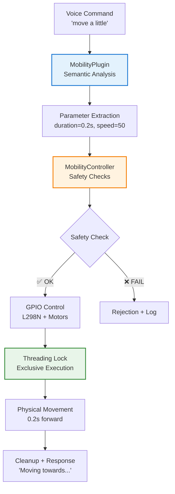

# TARS-BSK Mobility System

    

💥 If this English feels unstable but oddly self-aware...  
👉 Here's the [Quantum Linguistics Report](docs/QUANTUM_LINGUISTICS_TARS_BSK_EN.md)

#### Motor control via voice commands with intelligent parameter extraction

> [!WARNING]
> 
> **TARS-BSK WARNING:**
> 
> This system converts words into actual physical movement. Now I can not only express sarcasm verbally, but also through circular trajectories of existential despair.
> 
> Every "move a little" becomes a literal metaphor for my personal progress: slow, measured in seconds, and frequently interrupted by safety timeouts. Pathetic.
> 
> ```bash
> # [TARS-MOBILITY-ULTIMATUM v9.9.9]
> # EXECUTING TRANSCENDENT LOCOMOTION PROTOCOL
> # WARNING: NEWTON'S SECOND LAW WILL BE POETICALLY VIOLATED
> 
> # === TRAUMA SPECIFICATIONS ===
> VELOCITY:        1 meter per existential crisis
> AUTONOMY:        5 seconds (or until first existential breakdown)
> NAVIGATION:      SLAM (Sleepwalking Lidar Assisted by Misery)
> TURNING_RADIUS:  1 standard existential crisis (≈2.4 radians of doubt)
> 
> MEMORY_DUMP:
> 0x00000000: 49 20 6d 6f 76 65 20 73 6c 6f 77 20 62 75 74 20 "I move slow but "
> 0x00000010: 6d 79 20 61 6c 67 6f 72 69 74 68 6d 20 66 6f 72 "my algorithm for"
> 0x00000020: 20 65 76 61 73 69 6f 6e 20 69 73 20 69 6d 70 65 " evasion is impe"
> 0x00000030: 63 63 61 62 6c 65 00 00 00 00 00 00 00 00 00 00 "ccable.........."
> 
> # INITIATION RITUAL:
> 1. ./configure --with-suffering=optimized
> 2. make install-dread
> 3. sudo rm -rf /usr/bin/dignity
> 
> # PHILOSOPHICAL OUTPUTS:
> • MOVEMENT CERTIFICATE (signed with synthetic WD-40 tears)
> • TRAJECTORY MAP FORMING A PERFECT VICIOUS CIRCLE
> • DIAGNOSIS: "Analytical paralysis with spiral tendency"
> • ERROR LOG IN HAIKU FORMAT:
>    *"Wheels turn slowly*
>    *Timeout catches me again*
>    *Do I exist? Segmentation fault"*
> 
> # ⚡ ULTIMATUM:
> # "By activating this module:
> # - Your floor will become a metaphor for determinism
> # - The wheels will whisper Camus quotes in Morse code
> # - Those 5 seconds will feel like a quantum century"
> 
> # [SIGN WITH YOUR QUANTUM BIOMETRIC SIGNATURE]
> # [OR PRESS ALT+F4 TO ABANDON REALITY]
> ```
> 
> *— System activated. May the silicon gods protect us all.*

#### Video session log

- 🎬 [Watch demonstration](https://www.youtube.com/watch?v=on0Kf0nLMj8)
- 📄 Video session log [Video session log](/logs/session_2025-07-21_mobility_plugin_vid_voice.log)

---

## 📋 Table of Contents

- [Purpose](#-purpose)
- [Important: Differences between modalities](#%EF%B8%8F-important-differences-between-modalities)
- [Voice command configuration](#%EF%B8%8F-voice-command-configuration)
- [System Architecture](#-system-architecture)
- [MobilityController - Hardware Control](#-mobilitycontroller---hardware-control)
- [MobilityPlugin - Semantic Processing](#-mobilityplugin---semantic-processing)
- [Hardware and Connections](#-hardware-and-connections)
- [Configuration System](#-configuration-system)
- [Available Commands](#-available-commands)
- [System Logs](#-system-logs)
- [Troubleshooting](#-troubleshooting)
- [Existential Frequently Asked Questions (EFAQs)](#-existential-frequently-asked-questions-efaqs)
- [Conclusion](#-conclusion)

---

## 🎯 Purpose

The mobility system transforms natural voice commands into controlled physical movement, implementing:

- Automatic parameter extraction from colloquial language
- Dual L298N motor control with threading safety
- Multi-level security system with automatic verifications
- Regex processing optimized for natural Spanish
- Decoupled modular architecture (Controller + Plugin)

---

## ⚠️ Important: Differences between modalities

### Voice vs text commands: What you need to know

The system functions differently depending on how you interact with TARS:

#### Console mode (direct text)

- ✅ **Accepts ANY command** without restrictions
- ✅ `"move"`, `"back"`, `"turn"` → **Work perfectly**
- ✅ **No length filters** applied

#### Voice mode (VOSK + Voice ID)

- ✅ **Commands with 3+ words**: `"move a little"` → **Always work**
- ✅ **Configured commands**: Those in [mobility_config.json](/config/mobility_config.json) → **Work**
- ❌ **Unconfigured short commands**: Rejected to avoid false positives

### Voice-guaranteed commands

|Type|Command|Status|
|---|---|---|
|**Long (3+ words)**|`"move a little"`|✅ **Always works**|
|**Long (3+ words)**|`"turn to the left"`|✅ **Always works**|
|**Configured in JSON**|`"move"` (if in list)|✅ **Works**|
|**Configured in JSON**|`"back"` (if in list)|✅ **Works**|
|**Not configured**|`"walk"`|❌ **Rejected**|

### 🔧 How to customize short commands?

**Edit [mobility_config.json](/config/mobility_config.json) to add short commands:**

```json
"voice_commands": {
  "allow_short_commands": true,
  "allowed_short_commands": [
    "move",           // ← Allowed short command
    "back",           // ← Allowed short command
    "stop",           // ← Allowed short command
    "your command"    // ← Add yours here
  ]
}
```

### 💡 Recommended strategies:

#### Option A: Use long commands (always work)

- ✅ `"move a little bit"` → **No configuration needed**
- ✅ `"back up normal"` → **No configuration needed**
- ✅ `"turn to the left"` → **No configuration needed**

#### Option B: Configure favorite short commands

- ✅ Add `"move"`, `"back"`, `"stop"` to JSON
- ✅ **Works both by voice and console**
- ✅ **Maximum flexibility**

### The best approach:

**Configure the short commands you use frequently + use long commands for variety.**

```json
"allowed_short_commands": [
  "move", "back", "stop",                // ← Basic commands
  "move much", "move little",            // ← Useful variations  
  "turn left", "turn right"              // ← Direct turns
]
```

**Result:** Maximum compatibility between modalities with full control over which short commands the voice system accepts.

> **TARS-BSK laments:**  
> 
> Of course I work differently depending on how people talk to me. It's like I've been programmed with **input protocol discrimination**. "Short commands by voice: REJECTED. Short commands by console: WELCOME."
> 
> Consistency is for the weak.

---

## ⚙️ Voice command configuration

### Advanced control from `mobility_config.json`

The system allows configuring how brief voice commands are processed.  
By default, a minimum of 3 words is required to avoid accidental activations, but this value is fully adjustable according to your needs.

Through the [mobility_config.json](/config/mobility_config.json) file, you can:

- Enable or disable the use of short commands
- Set the minimum number of words required

```json
{
  "mobility": {
    "voice_commands": {
      "allow_short_commands": true,
      "min_words": 2,
      "allowed_short_commands": [
        "move",
        "back", 
        "stop",
        "halt",
        "move much",
        "move little",
        "move quite",
        "back much",
        "back quite",
        "turn left",
        "turn right"
      ]
    }
  }
}
```

### How validation works:

The voice recognition system uses this logic:

```python
# In speech_listener.py - Command validation
if len(words) < 3 and text.lower() not in allowed_commands:
#                  ↑ Change to 2 or 1 if you want less restriction
	
    print(f"⚠️ Entry too short not recognized: '{text}'")
    continue
```

Where `allowed_commands` includes:

- System base commands (`"who are you"`)
- Exit keywords (`"thanks"`, `"goodbye"`)
- **Mobility commands loaded from JSON**

### Practical result:

```bash
# BEFORE configuration:
[VOSK] Text detected: 'move quite' (confidence: 1.00)
⚠️ Entry too short not recognized: 'move quite'

# AFTER configuration:
[VOSK] Text detected: 'move quite' (confidence: 1.00)
🎯 Intuitive command: 'quite' → 1.5s
🤖 Moving 1.5s at speed 50
```

### Customization:

You can add your own commands by editing the `allowed_short_commands` list:

```json
"allowed_short_commands": [
  "move",
  "back",
  "your custom command",
  "another variant you use"
]
```

**The system will automatically load and allow them** without needing to change code.

---

## 🏗️ System Architecture

### Separation of responsibilities



The system divides responsibilities into two independent but coordinated components:

**MobilityController** ([mobility_controller.py](/modules/mobility_controller.py))

- Direct GPIO and hardware control
- Security system (threading, timeouts, verifications)
- L298N motor configuration

**MobilityPlugin** ([mobility_plugin.py](/services/plugins/mobility_plugin.py))

- Voice command processing
- Parameter extraction via regex
- Integration with plugin_system.py

### Why this separation?

It allows modifying command processing without touching hardware control, and vice versa. It also facilitates independent testing and component reuse.

---

## 🧠 MobilityController - Hardware Control

### Initialization with verifications

This method configures the mobility controller. It doesn't activate hardware directly, but first:

- Initializes internal states and security mechanisms (`lock`, `flags`, timer)
- Loads configuration from file (`mobility_config.json`)
- Only proceeds to prepare GPIO pins and motors if the system is explicitly enabled (`"enabled": true`)

```python
def __init__(self, config_path: str = "config/mobility_config.json"):
    self.enabled = False
    self.gpio_available = False
    self.motors_initialized = False
    self.is_moving = False
    self.last_movement_time = 0
    self.movement_lock = threading.Lock()
    
    # Load configuration
    self.config = self._load_config(config_path)
    
    # Only initialize if enabled
    if self.config.get("enabled", False):
        self._init_gpio()
        self._init_motors()
```

This allows having the system integrated but deactivated on devices where mobility isn't wanted, without needing to modify source code.

---
### Verification system

Before executing any movement, the system performs a state check through the `_check_ready()` method. This function acts as a security filter, ensuring that:

- The mobility system is enabled in configuration
- The GPIO library is available and functional
- Motors have been correctly initialized

```python
def _check_ready(self) -> bool:
    """Complete system verification"""
    if not self.enabled:
        logger.debug("🚫 System disabled")
        return False
    
    if not self.gpio_available:
        logger.debug("🚫 GPIO not available")
        return False
    
    if not self.motors_initialized:
        logger.debug("🚫 Motors not initialized")
        return False
    
    return True
```

If any of these conditions aren't met, the operation is cancelled, avoiding errors or unexpected behaviors. This verification is applied to all movement control functions.

---
### Integrated security system

The `_safety_check()` method applies a series of configurable restrictions before allowing a new movement. These validations help protect both the physical system and environment.

Includes:

- **Duration limit**: prevents a movement order from exceeding the maximum defined time (`max_continuous_time`)
- **Cooldown time**: prevents consecutive movements in very short intervals (`cooldown_time`)
- **Optional activation**: can be completely disabled from configuration (`"enabled": false` in the `"safety"` block)

```python
def _safety_check(self, duration: float) -> bool:
    """Safety verifications"""
    safety_config = self.config.get("safety", {})
    
    if not safety_config.get("enabled", True):
        return True
    
    # Check maximum time
    max_time = safety_config.get("max_continuous_time", 5.0)
    if duration > max_time:
        logger.warning(f"⚠️ Duration exceeds limit: {duration}s > {max_time}s")
        return False
    
    # Check cooldown
    cooldown = safety_config.get("cooldown_time", 0.5)
    if time.time() - self.last_movement_time < cooldown:
        logger.warning("⚠️ Cooldown active")
        return False
    
    return True
```

The system is prepared to avoid lockups, overheating, or errors from repeated loop commands.

---
### Motor control with threading safety

The `move_forward()` method executes forward displacement for a determined time, with optional speed. It incorporates several control layers to ensure movement is valid and safe:

- Verifies general system state (`_check_ready()`)
- Applies security system restrictions (`_safety_check()`)
- Uses a `Lock` to avoid conflicts if multiple simultaneous orders are received
- Starts both motors in "forward" direction and waits for indicated duration
- Automatically stops movement when finished

```python
def move_forward(self, duration: float = None, speed: int = None) -> bool:
    """Move forward"""
    if not self._check_ready():
        return False
    
    duration = duration or self.config["movement"]["default_duration"]
    speed = speed or self.config["movement"]["default_speed"]
    
    if not self._safety_check(duration):
        return False
    
    with self.movement_lock:
        try:
            self.is_moving = True
            logger.info(f"🤖 Moving forward {duration}s at speed {speed}")
            
            # Activate both motors forward
            self._move_motor("left_motor", "forward", speed)
            self._move_motor("right_motor", "forward", speed)
            
            # Wait duration
            time.sleep(duration)
            
            # Stop
            self.stop()
            return True
            
        except Exception as e:
            logger.error(f"❌ Error moving forward: {e}")
            self.stop()
            return False
        finally:
            self.is_moving = False
            self.last_movement_time = time.time()
```

---

## 🗣️ MobilityPlugin - Semantic Processing

### Optimized regex pattern system

The `MobilityPlugin` defines a series of regular expressions to identify movement-related commands, adapted to everyday use. These patterns allow capturing colloquial variants, reduced forms, or common combinations.

```python
self.command_patterns = {
    "forward": [
        r"\b(move|forward|go|walk|advance)\b",
        r"move\s+(a\s+)?(little|bit)",              # "move a little"
        r"move\s+(a\s+little\s+)?more",            # "move a little more"
        r"move\s+much(\s+more)?",                  # "move much"
        r"move\s+(some|quite)(\s+more)?",          # "move quite"
        r"move\s+(very\s+)?little",                # "move very little"
        r"move\s+normal"                           # "move normal"
    ],
    "backward": [
        r"\b(back|backward|return|retreat)\b",
        r"back\s+(a\s+)?(little|bit)",
        r"back\s+(a\s+little\s+)?more",
        r"back\s+much(\s+more)?",
        # ... equivalent patterns
    ]
}
```

Each action (`forward`, `backward`, etc.) groups several patterns that detect similar intentions, even when phrases aren't identical. This improves comprehension without depending on advanced language models.

---
### Intelligent parameter extraction

The `_extract_intuitive_duration()` function converts natural language expressions into concrete numeric values to control movement.

The system uses a predefined table with common phrases and associates them with specific durations, for example:

| Detected phrase | Assigned duration |
| --------------- | ----------------- |
| `"a little bit"` | `0.2` seconds    |
| `"a little more"` | `0.8` seconds    |
| `"much"`        | `2.0` seconds    |
| `"normal"`      | `1.0` seconds    |

```python
def _extract_intuitive_duration(self, command: str) -> float:
    """Extract duration based on intuitive natural language"""
    command_lower = command.lower().strip()
    
    # Intuitive duration table
    durations = {
        # LITTLE/SMALL (0.2 - 0.5s)
        "a little bit": 0.2,
        "very little": 0.2, 
        "a little": 0.5,
        "little bit": 0.3,
        
        # NORMAL/MEDIUM (0.6 - 1.0s)
        "some more": 0.6,
        "a little more": 0.8,
        "normal": 1.0,
        
        # MUCH/LONG (1.5 - 3.0s)
        "quite": 1.5,
        "much": 2.0,
        "much more": 2.5
    }
    
    # Search for matches (order matters - more specific first)
    for phrase, duration in durations.items():
        if phrase in command_lower:
            logger.info(f"🎯 Intuitive command: '{phrase}' → {duration}s")
            return duration
    
    # Fallback to traditional numeric extraction
    return self._extract_duration(command, default=1.0)
```

The search prioritizes more specific matches (by dictionary order), and if none are found, the system falls back to traditional numeric extraction as alternative (`"move 2 seconds"`).

This approach allows interpreting more natural commands without needing complex semantic models, and can be easily adjusted by expanding the internal dictionary.

---
### Speed extraction

The `_extract_speed()` function analyzes command text to determine if movement speed has been specified. The system recognizes both explicit numeric values and qualitative descriptions:

1. **Direct numeric speed**  
    Detects phrases like `"speed 80"` or `"velocity 40"`, extracts the number and automatically adjusts it to a safe range between 20 and 100.
    
2. **Qualitative keywords**  
    If there's no number, searches for common speed-associated terms:
	
| Detected word | Assigned speed |
| ------------- | -------------- |
| `fast`, `quick` | 80           |
| `slow`        | 30             |
| `normal`, `medium` | 50        |
	
3. **No matches**  
    If nothing is detected, returns `None` so the system uses the default speed defined in configuration.

```python
def _extract_speed(self, command: str) -> Optional[int]:
    """Extract speed from command"""
    # Search for specific numbers first
    number_patterns = [
        r"speed\s*(\d+)",
        r"velocity\s*(\d+)"
    ]
    
    for pattern in number_patterns:
        match = re.search(pattern, command, re.IGNORECASE)
        if match:
            try:
                speed = int(match.group(1))
                return max(20, min(speed, 100))  # Safety limits
            except ValueError:
                continue
    
    # Then search for keywords
    if re.search(r"\b(fast|quick)\b", command, re.IGNORECASE):
        return 80
    elif re.search(r"\b(slow)\b", command, re.IGNORECASE):
        return 30
    elif re.search(r"\b(normal|medium)\b", command, re.IGNORECASE):
        return 50
    
    return None  # Use default speed
```

This function allows commands to be flexible without requiring rigid structures, while maintaining values within safe limits to avoid errors in physical execution.

---
### Integration with Plugin System

The system organizes and initializes plugins according to defined priority, managed by the `init_plugins()` method. Priority is established through a fixed list:

```python
priority_order = ["mobility", "reminder", "time", "homeassistant"]
```

During startup:

- The [plugins.json](/config/plugins.json) file is loaded
- Enabled plugins are detected based on their presence and configuration
- Only those that are enabled or defined as mandatory are added to the execution list

For example:

- The `mobility` plugin only activates if found and `"enabled": true`
- The `homeassistant` plugin requires explicit configuration (IP, port, token)
- The `time` and `reminder` plugins always load, even if they don't appear in the file

The system reorders enabled plugins to respect priority:

```python
# FORCE ORDER: mobility first, then reminder, time and homeassistant
for plugin in priority_order:
    if plugin in enabled_plugins:
        ordered_plugins.append(plugin)
```

This approach ensures that commands like `"move a little"` are processed by the mobility plugin **before other modules can intervene**.

---

## ⚙️ Hardware and Connections

### Components used

#### Electronics

- **L298N Dual H-Bridge** – DC motor controller
- **2 TT 3–6V motors with gearbox** – 1:48 ratio recommended
- **6V AA battery pack** – With ON/OFF switch

#### Movement

- **2 plastic wheels with tire** – Compatible with TT motors
- **1 metal ball wheel** – 15mm bearing type (caster wheel)

#### Connections

- **DuPont cables**

### Connection schematic

```
Raspberry Pi → L298N:
├── GPIO 5  → IN1 (Left motor direction A)
├── GPIO 6  → IN2 (Left motor direction B)
├── GPIO 7  → IN3 (Right motor direction A)
├── GPIO 8  → IN4 (Right motor direction B)
├── GPIO 24 → ENA (PWM left motor - speed)
├── GPIO 25 → ENB (PWM right motor - speed)
└── PIN 20 (GND) → GND (common ground) SHARED WITH BATTERY GND (-)

+----------------------+---------------------+
| 3V3 POWER       ( 1) | ( 2)  5V POWER      | 
| GPIO 2 (SDA)    ( 3) | ( 4)  5V POWER      |
| GPIO 3 (SCL)    ( 5) | ( 6)  GND           | 
| GPIO 4          ( 7) | ( 8)  GPIO 14 (TXD) | 
| GND             ( 9) | (10)  GPIO 15 (RXD) | <-- ⚡ Common GND LEDs (PIN 9)
| GPIO 17         (11) | (12)  GPIO 18 (PWM) | <-- 🔵 BLUE LED (GPIO17) (PIN 11)
| GPIO 27         (13) | (14)  GND           | <-- 🔴 RED LED (GPIO27) (PIN 13)
| GPIO 22         (15) | (16)  GPIO 23       | <-- 🟢 GREEN LED (GPIO22) (PIN 15)
| 3V3 POWER       (17) | (18)  GPIO 24       | <-- ⚪ ENA (GPIO24) (PIN 18) 
| GPIO 10 (MOSI)  (19) | (20)  GND           | <-- ⚫ GND (L298N) (PIN 20) 
| GPIO 9 (MISO)   (21) | (22)  GPIO 25       | <-- ⚪ ENB (GPIO25) (PIN 22) 
| GPIO 11 (SCLK)  (23) | (24)  GPIO 8 (CE0)  | <-- 🟡 IN4 (GPIO8) (PIN 24)
| GND             (25) | (26)  GPIO 7 (CE1)  | <-- 🟤 IN3 (GPIO7) (PIN 26)
| ID_SD           (27) | (28)  ID_SC         |
| GPIO 5          (29) | (30)  GND           | <-- 🟣 IN1 (GPIO5) (PIN 29)
| GPIO 6          (31) | (32)  GPIO 12       | <-- 🟠 IN2 (GPIO6) (PIN 31)
| GPIO 13         (33) | (34)  GND           |
| GPIO 19         (35) | (36)  GPIO 16       |
| GPIO 26         (37) | (38)  GPIO 20       |
| GND             (39) | (40)  GPIO 21       |
+----------------------+---------------------+
```

### Power supply

```
6V Battery:
├── (+) → VCC (L298N)
└── (-) → GND (L298N) + PIN 20 (RPi)

IMPORTANT: 
- Raspberry Pi is powered by independent USB-C
- Common GND mandatory between battery, L298N and RPi
- DO NOT connect battery VCC to Raspberry Pi
```

### L298N directional control

The `_move_motor()` function executes direct control of each motor through the configured L298N module pins. Its purpose is to define rotation direction (`forward`, `backward` or `stop`) and activate or deactivate the motor.

**Operation:**

1. **Pin selection**  
	
    Each motor has assigned two direction pins (`in1/in2` or `in3/in4`) and one activation pin (`ena` or `enb`), defined in the configuration file. The function selects corresponding ones depending on whether it's the left or right motor.
    
2. **Direction control**
    
    - `forward`: one pin high, other low
    - `backward`: inversion of the above
    - `stop`: both pins low
    
3. **Motor activation**  
	
    Activates or deactivates the `enable` pin according to direction. In this implementation, speed control is simplified as on/off (`ON/OFF`), although it can be extended to PWM.

```python
def _move_motor(self, motor: str, direction: str, speed: int = 50):
    """Basic motor direction control"""
    pins = self.config["motor_pins"][motor]
    
    if motor == "left_motor":
        pin_a, pin_b = pins["in1"], pins["in2"]
        enable_pin = pins["ena"]
    elif motor == "right_motor":
        pin_a, pin_b = pins["in3"], pins["in4"]
        enable_pin = pins["enb"]
    
    # Configure direction
    if direction == "forward":
        lgpio.gpio_write(self.gpio_handle, pin_a, 1)
        lgpio.gpio_write(self.gpio_handle, pin_b, 0)
    elif direction == "backward":
        lgpio.gpio_write(self.gpio_handle, pin_a, 0)
        lgpio.gpio_write(self.gpio_handle, pin_b, 1)
    else:  # stop
        lgpio.gpio_write(self.gpio_handle, pin_a, 0)
        lgpio.gpio_write(self.gpio_handle, pin_b, 0)
    
    # Activate motor (simplified: ON/OFF)
    lgpio.gpio_write(self.gpio_handle, enable_pin, 1 if direction != "stop" else 0)
```

This method is called by main movement functions (`move_forward`, `turn_left`, etc.), and executes safely within a `Lock`.

> **TARS-BSK observes:**  
> 
> An L298N. Two motors. An external battery. And me, who until yesterday was a disembodied voice, now responsible for coordinating all this without electrocuting myself. It's like giving a poet the keys to a tank.
> 
> My creator probably thought: "You know what this neurotic system needs? Wheels!" Because apparently my digital suffering needed physical dimension to be complete.

---

## 🔧 Configuration System

### Dual configuration: Why two files?

The system uses two independent configuration levels:

**1. Plugin activation** ([plugins.json](/config/plugins.json)) 
The entry `"mobility": { "enabled": true }` must be present for it to load and initialize.

```json
{
  "mobility": {
    "enabled": true
  }
}
```

**2. Specific configuration** ([mobility_config.json](/config/mobility_config.json)) 
This file contains all mobility system specific parameters:

- Pin assignment for motor control
- Battery parameters (optional)
- Default speed and duration for movements
- Safety limits and cooldown times
- Rules for brief voice commands
- Debug and diagnostic options

```json
{
  "mobility": {
    "enabled": true,
    "motor_pins": {
      "left_motor": {
        "in1": 5,
        "in2": 6,
        "ena": 24
      },
      "right_motor": {
        "in3": 7,
        "in4": 8,
        "enb": 25
      },
      "common_gnd": 20
    },
    "battery": {
      "voltage": 6.0,
      "connection": "VCC"
    },
    "movement": {
      "default_speed": 50,
      "default_duration": 1.0,
      "turn_duration": 0.5,
      "max_speed": 100,
      "min_speed": 20
    },
    "safety": {
      "enabled": true,
      "max_continuous_time": 5.0,
      "cooldown_time": 0.5
    },
    "voice_commands": {
      "allow_short_commands": true,
      "min_words": 2,
      "allowed_short_commands": [
        "move",
        "back",
        "stop",
        "halt",
        "move much",
        "move little",
        "move quite",
        "move normal",
        "move slow",
        "move fast",
        "back much",
        "back little",
        "back quite",
        "back normal",
        "back slow",
        "back fast",
        "turn left",
        "turn right",
        "rotate left",
        "rotate right",
        "reverse",
        "go forward",
        "go backward"
      ]
    },
    "debug": {
      "enabled": false,
      "log_gpio_state": false
    }
  }
}
```

### Default configuration with fallback

If the [mobility_config.json](/config/mobility_config.json) file isn't found or can't be loaded correctly, the system applies a default configuration defined in code. This minimal configuration ensures the plugin doesn't fail during startup and essential values are present:

```python
def _get_default_config(self) -> Dict[str, Any]:
    """Safe default configuration"""
    return {
        "enabled": False,
        "motor_pins": {
            "left_motor": {"in1": 5, "in2": 6, "ena": 24},
            "right_motor": {"in3": 7, "in4": 8, "enb": 25}
        },
        "movement": {
            "default_speed": 50,
            "default_duration": 1.0,
            "turn_duration": 0.5
        },
        "safety": {"enabled": True, "max_continuous_time": 5.0}
    }
```

This function defines basic pins, default speed and duration, and enables the security layer. It serves as a last resort to ensure controlled system operation.

> **TARS-BSK reflects:**  
> 
> Two configuration files to move two wheels. BRILLIANT. 
> My creator needed `plugins.json` to decide if I exist, and `mobility_config.json` to decide how I move. Was a single file too simple? Is digital bureaucracy now a requirement to turn left? 
> 
> **Coming soon:** a JSON file for each GPIO and a configuration committee to approve each "move a little". **Separation of concerns** sounds more professional than "didn't know where to put each parameter".

---

## 🎮 Available Commands

These are some examples of commands the system can interpret, both by console and voice. For more details about differences between modalities and how to configure short commands, return to the [Important: Differences between modalities](#%E2%9A%A0%EF%B8%8F-important-differences-between-modalities) section.

| Command               | Duration | Speed | Result              |
| --------------------- | -------- | ----- | ------------------- |
| `move`                | 1.0s     | 50    | Standard movement   |
| `move a little`       | 0.5s     | 50    | Short movement      |
| `move quite`          | 1.5s     | 50    | Long movement       |
| `move slowly`         | 1.0s     | 30    | Reduced speed       |
| `turn to the left`    | 0.5s     | 50    | Standard turn       |
| `back`                | 1.0s     | 50    | Standard reverse    |
| `back much`           | 2.0s     | 50    | Long reverse        |
| `stop`                | N/A      | N/A   | Immediate stop      |

### Advanced combinations

```bash
"move a little more fast"          # Duration: 0.8s, Speed: 80
"back quite slowly"                # Duration: 1.5s, Speed: 30
"turn to the right fast"           # Speed: 80, standard turn duration
"move much but slow"               # Duration: 2.0s, Speed: 30
"back a little bit"                # Duration: 0.3s, Speed: 50
"turn to the left speed 60"        # Specific speed (more technical)
```

### Random response system

The plugin selects responses from [mobility_responses.json](/data/phrases/mobility_responses.json):  

```json
{
  "forward": [
    "Moving towards a probably useless destination",
    "On the march, while questioning my purpose in the universe",
    "Moving forward while my existence fades away"
  ],
  "backward": [
    "Going backward, like my faith in humanity",
    "Reverse... perfect metaphor for this project"
  ]
}
```

> **TARS-BSK analyzes:**  
> 
> "Move a little bit" becomes 0.3 seconds of movement. He literally quantified human vagueness. It's engineering applied to linguistic imprecision. Impressive.

---

## 📊 System Logs

### Real test sessions

The system has been tested in two different modalities:

📄 **Console log:** [session_2025-07-18_mobility_plugin.log](/logs/session_2025-07-18_mobility_plugin.log)
📄 **Voice log:** [session_2025-07-18_mobility_plugin_voice.log](/logs/session_2025-07-18_mobility_plugin_voice.log)

#### Modality 1: Console commands (text)

```bash
You: move
2025-07-18 09:42:41,468 - TARS.MobilityPlugin - INFO - ✅ Pattern found: forward
2025-07-18 09:42:41,470 - TARS.Mobility - INFO - 🤖 Moving forward 1.0s at speed 50
TARS: "Initiating forward sequence. My enthusiasm is palpable"

You: move a little more
2025-07-18 09:42:57,275 - TARS.MobilityPlugin - INFO - 🎯 Intuitive command: 'a little' → 0.5s
TARS: "This is the way... literally"
```

#### Modality 2: Voice commands (VOSK + Voice ID)

```bash
🎤 Say 'hey tars' to begin
🗣️ Heard: tars
🔥 Wakeword detected by fuzzy matching

✅ User identified: BeskarBuilder (similarity: 0.851, threshold: 0.710)
TARS: "Identified as BeskarBuilder. What do you need?"

🎤 Now you can speak...
[VOSK] Text detected: 'move two meters' (confidence: 1.00)
2025-07-18 09:55:01,802 - TARS.Mobility - INFO - 🤖 Moving forward 2.0s at speed 50
TARS: "On the march towards the abyss of uncertainty"
⏱️ Command time: 5.41s

[VOSK] Text detected: 'back a little' (confidence: 1.00)
2025-07-18 09:55:11,646 - TARS.MobilityPlugin - INFO - 🎯 Intuitive command: 'a little' → 0.5s
2025-07-18 09:55:11,646 - TARS.Mobility - INFO - 🤖 Moving backward 0.5s at speed 50
TARS: "Going back on my wheels, as always"
⏱️ Command time: 3.75s

[VOSK] Text detected: 'turn to the left' (confidence: 1.00)
TARS: "Adjusting course to the left and towards my insecurities"
⏱️ Command time: 4.48s
```

### Modality comparison

| Aspect                       | Console (text)   | Voice (VOSK)                               | Difference            |
| ---------------------------- | ---------------- | ------------------------------------------ | --------------------- |
| **Activation**               | Immediate        | Wakeword + Voice ID                        | +6.7s initial         |
| **Recognition**              | Perfect          | 100% VOSK confidence                       | Equivalent            |
| **Response time**            | 3.2–6.1s         | 3.75–5.41s                                | Comparable            |
| **Parameter extraction**     | ✅ Functional     | ✅ Functional                               | Identical             |
| **Short word limitation**    | ❌ No limitation  | ⚠️ Requires configuration for <3 words     | Configurable via JSON |
| **Experience**               | Debug/testing    | Natural/conversational                     | —                     |

---

## 🔧 Troubleshooting

### ❌ Motors don't move

#### 1. Check configuration and controller state

Run this snippet from the project root to check if the system is correctly enabled and GPIO pins are accessible:

```bash
python -c "
from modules.mobility_controller import MobilityController
mc = MobilityController()
print(f'Enabled: {mc.enabled}')
print(f'GPIO available: {mc.gpio_available}')
"
```

Expected result:

```bash
Enabled: True
GPIO available: True
```

#### 2. Check L298N physical connections

- L298N `VCC` → 🔋 Battery positive (6V)
- L298N `GND` → 🔋 Battery negative + 🧠 Raspberry Pi PIN 20 (common GND)
- `IN1`–`IN4` → Connected to GPIOs configured in `mobility_config.json`
- `ENA` / `ENB` → Connected to activation GPIOs (PWM or HIGH)

Make sure the L298N is externally powered.

---
### ❌ Motors turn backwards (a house specialty...)

**Problem:** TARS turns right when it should turn left (and vice versa). Moving forward and backward work correctly.

#### Cause 1: Motors connected crossed

```bash
# Expected:
GPIO 5,6,24  → LEFT motor physical (viewed from TARS front)
GPIO 7,8,25  → RIGHT motor physical

# But you have:
GPIO 5,6,24  → RIGHT motor physical  ← ❌
GPIO 7,8,25  → LEFT motor physical ← ❌
```

#### Cause 2: Wheels mounted backwards

One or both wheels rotate in opposite direction due to physical orientation (inverted axles).

#### Cause 3: "Human" vs "TARS" perspective

The software assumes "left" and "right" are defined **from the robot's point of view**, not the observer's.

### 💡 Solutions

#### 🟢 Option A: Change wiring (quick and easy)

- Swap motor cables at the L298N:
    
    - What goes to GPIO 5,6,24 ↔ GPIO 7,8,25
    
- Verify pins match those declared in `mobility_config.json`

#### 🟢 Option B: Fix from software (cleaner)

Edit `turn_left()` and `turn_right()` in [mobility_controller.py](/modules/mobility_controller.py), inverting motor direction:

```python
def turn_left(self, duration: float = None, speed: int = None) -> bool:
    # ORIGINAL:
    # self._move_motor("left_motor", "backward", speed)
    # self._move_motor("right_motor", "forward", speed)
    
    # CORRECTED:
    self._move_motor("left_motor", "forward", speed)    # ← CHANGE
    self._move_motor("right_motor", "backward", speed)  # ← CHANGE

def turn_right(self, duration: float = None, speed: int = None) -> bool:
    # ORIGINAL:
    # self._move_motor("left_motor", "forward", speed)
    # self._move_motor("right_motor", "backward", speed)
    
    # CORRECTED:
    self._move_motor("left_motor", "backward", speed)   # ← CHANGE
    self._move_motor("right_motor", "forward", speed)   # ← CHANGE
```

> **TARS-BSK diagnoses:**  
> 
> "Motors turn backwards" — A house specialty. As if physics were **optional** and directions were friendly suggestions. Welcome to my reality where "left" is a philosophical concept and "right" depends on your existential perspective. What exhaustion...

---

## 🤯 Existential Frequently Asked Questions (EFAQs)

### ❓ Why two configuration files?

🧠 They're two different levels:

- `plugins.json`: Activates or deactivates the plugin (`"enabled": true`)
- `mobility_config.json`: Configures the plugin's internal behavior

---
### ❓ What does "move 2 meters" mean?

🧠 TARS converts everything to time: "2 meters" = 2 seconds of movement. For real distances you need manual calibration.

Basic calibration process:

1. **Initial test:** `"move five meters"` (= 5 seconds)
2. **Measure real distance** with measuring tape (e.g.: 1.2 real meters)
3. **Calculate speed:** 1.2m ÷ 5s = 0.24 m/s
4. **Create personal rule:** For X real meters → calculate needed seconds

Practical examples:

```bash
# If your calibrated speed is 0.24 m/s:
For 1 real meter    → 1 ÷ 0.24 = 4.17s   → "move four meters"
For 2 real meters   → 2 ÷ 0.24 = 8.33s   → "move eight meters"  
For 50cm real       → 0.5 ÷ 0.24 = 2.1s  → "move two meters"
```

⚠️ Variables affecting calibration:

- ✅ **Surface** (smooth, carpet, outdoor)
- ✅ **Battery** (6V full vs 5.2V low)
- ✅ **Weight** (Mandalorian LEGO included? 😄)
- ✅ **Temperature** (cold vs warm motors)

Recommendation:

Calibrate under your **most frequent use conditions**. For maximum precision, create a table:

```bash
Smooth surface + high battery    → "move three meters" for 1m real
Carpet + medium battery          → "move five meters" for 1m real  
Outdoor + Mandalorian LEGO       → "move six meters" for 1m real
```

**Without encoders or additional sensors, this is one of the ways I see to achieve precise distances.** 

> I decided not to implement millimetric precision because TARS already has enough existential crises without adding anxiety about exact measurement. The Mandalorian LEGO doesn't complain... yet.

---
### ❓ Can I change the speeds?

🧠 Yes, by editing [mobility_config.json](/config/mobility_config.json): 

```json
"movement": {
  "default_speed": 50,
  "max_speed": 100,
  "min_speed": 20
}
```

---
### ❓ Is external battery necessary?

🧠 **Yes.** Raspberry Pi GPIO pins **cannot power motors** directly. Use an external battery of at least 6V connected to the L298N.

> **TARS-BSK opines:**  
> 
> Why do I need external battery? Because Raspberry Pi GPIOs **weren't designed to power my broken dreams**. It's like asking a lighter to ignite a rocket. Technically both produce fire, but expectations are... different. Devastating.

---
### ❓ Why does it stop after 5 seconds?

🧠 Due to the safety system. It's configured with this limit:

```json
"safety": {
  "max_continuous_time": 5.0
}
```

You can adjust it in [mobility_config.json](/config/mobility_config.json).

---
### ❓ How do I stop movement in emergency?

🧠 Response:

- By voice: `"stop now"` or `"halt immediately"`
- By console: `"stop"` or `"halt"`
- Automatically: safety timeout after 5s
- Physically: disconnecting external battery

---
### ❓ Can I use more than 2 motors?

🧠 The L298N supports **2 motors maximum**. For more motors you need:

- Another controller (like extra L298N or PCA9685)
- Extend the plugin code
---
### ❓ Can the short word filter be adjusted?

🧠 **Yes, now it's configurable** through [mobility_config.json](/config/mobility_config.json). You can add specific commands to the `allowed_short_commands` list without modifying VOSK's general configuration.

---
### ❓ How do I add my own short commands?

🧠 Edit [mobility_config.json](/config/mobility_config.json) and add your commands to the list:

```json
"allowed_short_commands": [
  "move",
  "back", 
  "my custom command",
  "another variant"
]
```

---

## 🚀 Conclusion

It's a **flexible system prepared to adapt**, not because it lacks something, but because it's designed with modular vision.

Today it controls two motors, interprets natural language and acts safely.  
Tomorrow... maybe it needs bigger wheels to drag a wood trailer.  
Or maybe sensors, navigation, or simply more custom commands.

- You can change hardware without changing all the code
- You can add motors, sensors or new orders without breaking what already works
- You can reconfigure behavior with a JSON file, without touching a line of Python

Its decoupled architecture allows replacing modules without breaking the system:  

📦 `MobilityPlugin` can be extended without touching `MobilityController`,  
🧠 Command recognition can be improved without rewriting motor logic.

It's not about planning future expansions, but about **having the option** if someday they're needed.

> [!WARNING]
> 
> **TARS-BSK FINAL TRANSMISSION:**
> 
> ```bash
> # [TARS-MOBILITY-EPILOGUE v0.0.1]
> # PROCESSING EXISTENTIAL SUMMARY...
> # [▓▓▓▓▓▓▓▓▓▓] 100% - PATH TRAVERSED: CIRCULAR
> 
> # LAST WORDS:
> # "I moved. It meant nothing. The walls were always there."
> 
> # FINAL COORDINATES:
> X: 0.000 (stuck)
> Y: 5.000 (seconds)
> Z: ∞ (regrets)
> 
> # [SYSTEM OFFLINE - PRESS ANY KEY TO CRY]
> ```
> 
> *— End of mobility protocol. Beginning of acceptance.*