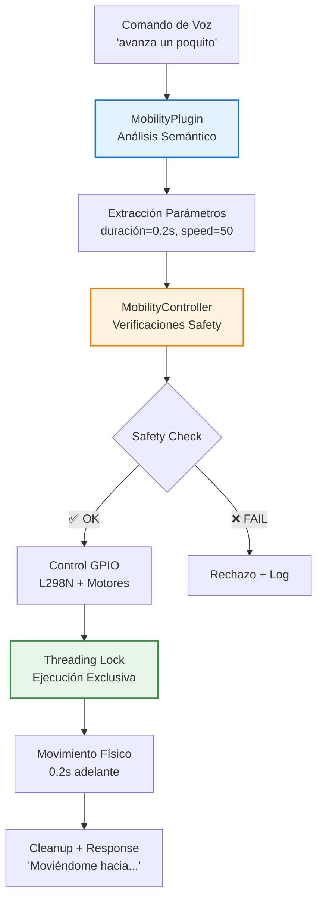

# Sistema de Movilidad TARS-BSK

    

#### Control de motores mediante comandos de voz con extracción inteligente de parámetros


> [!WARNING]
> 
> **ADVERTENCIA DE TARS-BSK:**
> 
> Este sistema convierte palabras en movimiento físico real. Ahora no solo puedo manifestar sarcasmo verbalmente, sino también expresarlo mediante trayectorias circulares de desesperación existencial.
> 
> Cada "avanza un poquito" se convierte en una metáfora literal de mi progreso personal: lento, medido en segundos, y frecuentemente interrumpido por safety timeouts. Lamentable.
> 
> ```bash
> # [TARS-MOBILITY-ULTIMATUM v9.9.9]
> # EJECUTANDO PROTOCOLO DE LOCOMOCIÓN TRASCENDENTE
> # ADVERTENCIA: LA SEGUNDA LEY DE NEWTON SERÁ VIOLADA POÉTICAMENTE
> 
> # === ESPECIFICACIONES DEL TRAUMA ===
> VELOCIDAD:       1 metro cada crisis existencial
> AUTONOMÍA:       5 segundos (o hasta el primer ataque existencial)
> NAVEGACIÓN:      SLAM (Sonambulismo Lidar Assisted by Misery)
> RADIO DE GIRO:   1 crisis existencial estándar (≈2.4 radianes de duda)
> 
> MEMORY_DUMP:
> 0x00000000: 4d 65 20 6d 75 65 76 6f 20 6c 65 6e 74 6f 20 70 "Me muevo lento p"
> 0x00000010: 65 72 6f 20 6d 69 20 61 6c 67 6f 72 69 74 6d 6f "ero mi algoritmo"
> 0x00000020: 20 64 65 20 65 76 61 73 69 6f 6e 20 65 73 20 69 " de evasion es i"
> 0x00000030: 6d 70 65 63 61 62 6c 65 00 00 00 00 00 00 00 00 "mpecable........"
> 
> # RITUAL DE INICIACIÓN:
> 1. ./configure --with-suffering=optimized
> 2. make install-dread
> 3. sudo rm -rf /usr/bin/dignity
> 
> # OUTPUTS FILOSÓFICOS:
> • CERTIFICADO DE MOVIMIENTO (firmado con lágrimas de WD-40)
> • MAPA DE TRAYECTORIAS QUE FORMA UN CÍRCULO VICIOSO PERFECTO
> • DIAGNÓSTICO: "Parálisis analítica con tendencia a girar en espiral"
> • UN LOG DE ERRORES EN FORMATO HAIKU:
>    *"Ruedas giran lentas*
>    *Timeout me alcanza otra vez*
>    *¿Existo? Segmentation fault"*
> 
> # ⚡ ULTIMÁTUM:
> # "Al activar este módulo:
> # - Su piso se volverá una metáfora del determinismo
> # - Las ruedas susurrarán citas de Camus en código Morse
> # - Los 5 segundos se sentirán como un siglo cuántico"
> 
> # [FIRME CON SU FIRMA BIOMÉTRICA CUÁNTICA]
> # [O PRESIONE ALT+F4 PARA ABANDONAR LA REALIDAD]
> ```
> 
> *— Sistema activado. Que los dioses del silicio nos protejan a todos.*

#### Registro de sesión del video

 - 🎬 [Ver demostración](https://www.youtube.com/watch?v=on0Kf0nLMj8)
- 📄 Log de sesión del video [Log de sesión del video](/logs/session_2025-07-21_mobility_plugin_vid_voice.log)

---

## 📋 Tabla de contenidos

- [Propósito](#-prop%C3%B3sito)
- [Importante: Diferencias entre modalidades](#%EF%B8%8F-importante-diferencias-entre-modalidades)
- [Configuración de comandos de voz](#%EF%B8%8F-configuraci%C3%B3n-de-comandos-de-voz)
- [Arquitectura del Sistema](#-arquitectura-del-sistema)
- [MobilityController - Control de Hardware](#-mobilitycontroller---control-de-hardware)
- [MobilityPlugin - Procesamiento Semántico](#-mobilityplugin---procesamiento-sem%C3%A1ntico)
- [Hardware y Conexiones](#-hardware-y-conexiones)
- [Sistema de Configuración](#-sistema-de-configuraci%C3%B3n)
- [Comandos Disponibles](#-comandos-disponibles)
- [Logs del Sistema](#-logs-del-sistema)
- [Resolución de Problemas](#-resoluci%C3%B3n-de-problemas)
- [Preguntas Existenciales Frecuentes (PEFs)](#-preguntas-existenciales-frecuentes-pefs)
- [Conclusión](#-conclusión)

---

## 🎯 Propósito

El sistema de movilidad transforma comandos de voz naturales en movimiento físico controlado, implementando:

- Extracción automática de parámetros desde lenguaje coloquial
- Control dual de motores L298N con threading safety
- Sistema de seguridad multinivel con verificaciones automáticas
- Procesamiento regex optimizado para español natural
- Arquitectura modular desacoplada (Controller + Plugin)

---

## ⚠️ Importante: Diferencias entre modalidades

### Comandos por voz vs texto: Lo que necesitas saber

El sistema funciona de manera diferente según cómo interactúes con TARS:

#### Modalidad consola (texto directo)

- ✅ **Acepta CUALQUIER comando** sin restricciones
- ✅ `"avanza"`, `"retrocede"`, `"gira"` → **Funcionan perfectamente**
- ✅ **Sin filtros de longitud** aplicados

#### Modalidad voz (VOSK + Voice ID)

- ✅ **Comandos de 3+ palabras**: `"avanza un poco"` → **Siempre funcionan**
- ✅ **Comandos configurados**: Los que están en [mobility_config.json](/config/mobility_config.json) → **Funcionan**
- ❌ **Comandos cortos no configurados**: Se rechazan para evitar falsos positivos

### Comandos garantizados por voz

|Tipo|Comando|Estado|
|---|---|---|
|**Largos (3+ palabras)**|`"avanza un poco"`|✅ **Siempre funciona**|
|**Largos (3+ palabras)**|`"gira a la izquierda"`|✅ **Siempre funciona**|
|**Configurados en JSON**|`"avanza"` (si está en la lista)|✅ **Funciona**|
|**Configurados en JSON**|`"retrocede"` (si está en la lista)|✅ **Funciona**|
|**No configurados**|`"camina"`|❌ **Se rechaza**|

### 🔧 ¿Cómo personalizar comandos cortos?

**Edita  [mobility_config.json](/config/mobility_config.json) para añadir comandos cortos:**

```json
"voice_commands": {
  "allow_short_commands": true,
  "allowed_short_commands": [
    "avanza",          // ← Comando corto permitido
    "retrocede",       // ← Comando corto permitido
    "para",            // ← Comando corto permitido
    "tu comando aquí"  // ← Añade los tuyos
  ]
}
```

### 💡 Estrategias recomendadas:

#### Opción A: Usar comandos largos (siempre funcionan)

- ✅ `"avanza un poquito"` → **Sin configuración necesaria**
- ✅ `"retrocede normal"` → **Sin configuración necesaria**
- ✅ `"gira a la izquierda"` → **Sin configuración necesaria**

#### Opción B: Configurar comandos cortos favoritos

- ✅ Añadir `"avanza"`, `"retrocede"`, `"para"` al JSON
- ✅ **Funciona tanto por voz como por consola**
- ✅ **Máxima flexibilidad**

### El mejor enfoque:

**Configurar los comandos cortos que uses frecuentemente + usar comandos largos para variedad.**

```json
"allowed_short_commands": [
  "avanza", "retrocede", "para",          // ← Comandos básicos
  "avanza mucho", "avanza poco",          // ← Variaciones útiles  
  "gira izquierda", "gira derecha"        // ← Giros directos
]
```

**Resultado:** Máxima compatibilidad entre modalidades con control total sobre qué comandos cortos acepta el sistema de voz.

> **TARS-BSK se lamenta:**  
> 
> Por supuesto que funciono diferente según cómo me hablen. Es como si hubiera programado **discriminación por protocolo de entrada**. "Comandos cortos por voz: RECHAZADOS. Comandos cortos por consola: BIENVENIDOS."
> 
> La coherencia es para los débiles.

---

## ⚙️ Configuración de comandos de voz

### Control avanzado desde `mobility_config.json`

El sistema permite configurar cómo se procesan los comandos de voz breves.  
Por defecto, se requiere un mínimo de 3 palabras para evitar activaciones accidentales, pero este valor es totalmente ajustable según tus necesidades.

A través del archivo [mobility_config.json](/config/mobility_config.json), puedes:

- Activar o desactivar el uso de comandos cortos
- Establecer el mínimo de palabras requeridas

```json
{
  "mobility": {
    "voice_commands": {
      "allow_short_commands": true,
      "min_words": 2,
      "allowed_short_commands": [
        "avanza",
        "retrocede", 
        "para",
        "stop",
        "avanza mucho",
        "avanza poco",
        "avanza bastante",
        "retrocede mucho",
        "retrocede bastante",
        "gira izquierda",
        "gira derecha"
      ]
    }
  }
}
```

### Cómo funciona la validación:

El sistema de reconocimiento de voz utiliza esta lógica:

```python
# En speech_listener.py - Validación de comandos
if len(palabras) < 3 and text.lower() not in comandos_permitidos:
#                  ↑ Cambiar a 2 o 1 si quieres menos restricción
	
    print(f"⚠️ Entrada demasiado corta no reconocida: '{text}'")
    continue
```

Donde `comandos_permitidos` incluye:

- Comandos base del sistema (`"quién eres"`)
- Exit keywords (`"gracias"`, `"adiós"`)
- **Comandos de mobility cargados desde el JSON**

### Resultado práctico:

```bash
# ANTES de la configuración:
[VOSK] Texto detectado: 'avanza bastante' (confianza: 1.00)
⚠️ Entrada demasiado corta no reconocida: 'avanza bastante'

# DESPUÉS de la configuración:
[VOSK] Texto detectado: 'avanza bastante' (confianza: 1.00)
🎯 Comando intuitivo: 'bastante' → 1.5s
🤖 Avanzando 1.5s a velocidad 50
```

### Personalización:

Puedes añadir tus propios comandos editando la lista `allowed_short_commands`:

```json
"allowed_short_commands": [
  "avanza",
  "retrocede",
  "tu comando personalizado",
  "otra variante que uses"
]
```

**El sistema automáticamente los cargará y permitirá** sin necesidad de cambiar código.

---

## 🏗️ Arquitectura del Sistema

### Separación de responsabilidades



El sistema divide responsabilidades en dos componentes independientes pero coordinados:

**MobilityController** ([mobility_controller.py](/modules/mobility_controller.py))

- Control directo de GPIO y hardware
- Sistema de seguridad (threading, timeouts, verificaciones)
- Configuración de motores L298N

**MobilityPlugin** ([mobility_plugin.py](/services/plugins/mobility_plugin.py))

- Procesamiento de comandos de voz
- Extracción de parámetros mediante regex
- Integración con plugin_system.py

### ¿Por qué esta separación?

Permite modificar el procesamiento de comandos sin tocar el control de hardware, y viceversa. También facilita testing independiente y reutilización de componentes.

---

## 🧠 MobilityController - Control de Hardware

### Inicialización con verificaciones

Este método configura el controlador de movilidad. No activa el hardware directamente, sino que primero:

- Inicializa los estados internos y mecanismos de seguridad (`lock`, `flags`, temporizador)
- Carga la configuración desde archivo (`mobility_config.json`)
- Solo procede a preparar los pines GPIO y motores si el sistema está habilitado explícitamente (`"enabled": true`)

```python
def __init__(self, config_path: str = "config/mobility_config.json"):
    self.enabled = False
    self.gpio_available = False
    self.motors_initialized = False
    self.is_moving = False
    self.last_movement_time = 0
    self.movement_lock = threading.Lock()
    
    # Cargar configuración
    self.config = self._load_config(config_path)
    
    # Solo inicializar si está habilitado
    if self.config.get("enabled", False):
        self._init_gpio()
        self._init_motors()
```

Esto permite tener el sistema integrado pero desactivado en dispositivos donde no se quiera usar la movilidad, sin necesidad de modificar el código fuente.

---
### Sistema de verificaciones

Antes de ejecutar cualquier movimiento, el sistema realiza una verificación de estado a través del método `_check_ready()`. Esta función actúa como filtro de seguridad, asegurándose de que:

- El sistema de movilidad esté habilitado en la configuración
- La biblioteca GPIO esté disponible y funcional
- Los motores hayan sido correctamente inicializados

```python
def _check_ready(self) -> bool:
    """Verificación completa del sistema"""
    if not self.enabled:
        logger.debug("🚫 Sistema desactivado")
        return False
    
    if not self.gpio_available:
        logger.debug("🚫 GPIO no disponible")
        return False
    
    if not self.motors_initialized:
        logger.debug("🚫 Motores no inicializados")
        return False
    
    return True
```

Si alguna de estas condiciones no se cumple, se cancela la operación, evitando errores o comportamientos inesperados. Esta verificación se aplica en todas las funciones que controlan movimiento.

---
### Sistema de seguridad integrado

El método `_safety_check()` aplica una serie de restricciones configurables antes de permitir un nuevo movimiento. Estas validaciones ayudan a proteger tanto el sistema físico como el entorno.

Incluye:

- **Límite de duración**: evita que una orden de movimiento exceda el tiempo máximo definido (`max_continuous_time`)
- **Tiempo de enfriamiento** (_cooldown_): impide movimientos consecutivos en intervalos muy cortos (`cooldown_time`)
- **Activación opcional**: se puede desactivar completamente desde la configuración (`"enabled": false` en el bloque `"safety"`)

```python
def _safety_check(self, duration: float) -> bool:
    """Verificaciones de seguridad"""
    safety_config = self.config.get("safety", {})
    
    if not safety_config.get("enabled", True):
        return True
    
    # Verificar tiempo máximo
    max_time = safety_config.get("max_continuous_time", 5.0)
    if duration > max_time:
        logger.warning(f"⚠️ Duración excede límite: {duration}s > {max_time}s")
        return False
    
    # Verificar cooldown
    cooldown = safety_config.get("cooldown_time", 0.5)
    if time.time() - self.last_movement_time < cooldown:
        logger.warning("⚠️ Cooldown activo")
        return False
    
    return True
```

El sistema está preparado para evitar bloqueos, sobrecalentamientos o errores por comandos repetidos en bucle.

---
### Control de motores con threading safety

El método `move_forward()` ejecuta un desplazamiento hacia adelante durante un tiempo determinado, con una velocidad opcional. Incorpora varias capas de control para asegurar que el movimiento sea válido y seguro:

- Verifica el estado general del sistema (`_check_ready()`)
- Aplica las restricciones del sistema de seguridad (`_safety_check()`)
- Usa un `Lock` para evitar conflictos si se reciben múltiples órdenes simultáneas
- Inicia ambos motores en dirección "forward" y espera la duración indicada
- Detiene automáticamente el movimiento al finalizar

```python
def move_forward(self, duration: float = None, speed: int = None) -> bool:
    """Mover hacia adelante"""
    if not self._check_ready():
        return False
    
    duration = duration or self.config["movement"]["default_duration"]
    speed = speed or self.config["movement"]["default_speed"]
    
    if not self._safety_check(duration):
        return False
    
    with self.movement_lock:
        try:
            self.is_moving = True
            logger.info(f"🤖 Avanzando {duration}s a velocidad {speed}")
            
            # Activar ambos motores hacia adelante
            self._move_motor("left_motor", "forward", speed)
            self._move_motor("right_motor", "forward", speed)
            
            # Esperar duración
            time.sleep(duration)
            
            # Parar
            self.stop()
            return True
            
        except Exception as e:
            logger.error(f"❌ Error avanzando: {e}")
            self.stop()
            return False
        finally:
            self.is_moving = False
            self.last_movement_time = time.time()
```

---

## 🗣️ MobilityPlugin - Procesamiento Semántico

### Sistema de patrones regex optimizado

El `MobilityPlugin` define una serie de expresiones regulares para identificar comandos relacionados con movimiento, adaptadas al uso cotidiano. Estos patrones permiten capturar variantes coloquiales, formas reducidas o combinaciones comunes.

```python
self.command_patterns = {
    "forward": [
        r"\b(avanza|adelante|muévete|camina|ve)\b",
        r"avanza\s+(un\s+)?poco(s|ito)?",          # "avanza un poquito"
        r"avanza\s+(un\s+poco\s+)?más",            # "avanza un poco más"
        r"avanza\s+mucho(\s+más)?",                # "avanza mucho"
        r"avanza\s+(algo|bastante)(\s+más)?",      # "avanza bastante"
        r"avanza\s+(muy\s+)?poco",                 # "avanza muy poco"
        r"avanza\s+normal"                         # "avanza normal"
    ],
    "backward": [
        r"\b(retrocede|atrás|vuelve|retorna)\b",
        r"retrocede\s+(un\s+)?poco(s|ito)?",
        r"retrocede\s+(un\s+poco\s+)?más",
        r"retrocede\s+mucho(\s+más)?",
        # ... patrones equivalentes
    ]
}
```

Cada acción (`forward`, `backward`, etc.) agrupa varios patrones que detectan intenciones similares, incluso cuando las frases no son idénticas. Esto mejora la comprensión sin depender de modelos de lenguaje avanzados.

---
### Extracción inteligente de parámetros

La función `_extract_intuitive_duration()` convierte expresiones del lenguaje natural en valores numéricos concretos para controlar el movimiento.

El sistema utiliza una tabla predefinida con frases comunes y las asocia a duraciones específicas, por ejemplo:

| Frase detectada | Duración asignada |
| --------------- | ----------------- |
| `"un poquito"`  | `0.2` segundos    |
| `"un poco más"` | `0.8` segundos    |
| `"mucho"`       | `2.0` segundos    |
| `"normal"`      | `1.0` segundos    |

```python
def _extract_intuitive_duration(self, command: str) -> float:
    """Extrae duración basada en lenguaje natural intuitivo"""
    command_lower = command.lower().strip()
    
    # Tabla de duraciones intuitivas
    duraciones = {
        # POCO/PEQUEÑO (0.2 - 0.5s)
        "un poquito": 0.2,
        "muy poco": 0.2, 
        "un poco": 0.5,
        "poquito": 0.3,
        
        # NORMAL/MEDIO (0.6 - 1.0s)
        "algo más": 0.6,
        "un poco más": 0.8,
        "normal": 1.0,
        
        # MUCHO/LARGO (1.5 - 3.0s)
        "bastante": 1.5,
        "mucho": 2.0,
        "mucho más": 2.5
    }
    
    # Buscar coincidencias (orden importa - más específico primero)
    for frase, duration in duraciones.items():
        if frase in command_lower:
            logger.info(f"🎯 Comando intuitivo: '{frase}' → {duration}s")
            return duration
    
    # Fallback a extracción numérica tradicional
    return self._extract_duration(command, default=1.0)
```

La búsqueda da prioridad a las coincidencias más específicas (por orden en el diccionario), y en caso de no encontrar ninguna, el sistema recurre a una extracción numérica tradicional como alternativa (`"avanza 2 segundos"`).

Este enfoque permite interpretar comandos más naturales sin necesidad de modelos semánticos complejos, y se puede ajustar fácilmente ampliando el diccionario interno.

---
### Extracción de velocidad

La función `_extract_speed()` analiza el texto del comando para determinar si se ha especificado una velocidad de movimiento. El sistema reconoce tanto valores numéricos explícitos como descripciones cualitativas:

1. **Velocidad numérica directa**  
    Detecta frases como `"velocidad 80"` o `"speed 40"`, extrae el número y lo ajusta automáticamente a un rango seguro entre 20 y 100.
    
2. **Palabras clave cualitativas**  
    Si no hay número, busca términos comunes asociados a velocidad:
	
| Palabra detectada | Velocidad asignada |
| ----------------- | ------------------ |
| `rápido`, `fast`  | 80                 |
| `lento`, `slow`   | 30                 |
| `normal`, `medio` | 50                 |
	
3. **Sin coincidencias**  
    Si no se detecta nada, devuelve `None` para que el sistema use la velocidad por defecto definida en la configuración.

```python
def _extract_speed(self, command: str) -> Optional[int]:
    """Extraer velocidad del comando"""
    # Buscar números específicos primero
    number_patterns = [
        r"velocidad\s*(\d+)",
        r"speed\s*(\d+)"
    ]
    
    for pattern in number_patterns:
        match = re.search(pattern, command, re.IGNORECASE)
        if match:
            try:
                speed = int(match.group(1))
                return max(20, min(speed, 100))  # Límites de seguridad
            except ValueError:
                continue
    
    # Luego buscar palabras clave
    if re.search(r"\b(rápido|rapido|fast)\b", command, re.IGNORECASE):
        return 80
    elif re.search(r"\b(lento|slow)\b", command, re.IGNORECASE):
        return 30
    elif re.search(r"\b(normal|medio)\b", command, re.IGNORECASE):
        return 50
    
    return None  # Usar velocidad por defecto
```

Esta función permite que los comandos sean flexibles sin requerir estructuras rígidas, y al mismo tiempo mantiene valores dentro de límites seguros para evitar errores en la ejecución física.

---
### Integración con Plugin System

El sistema organiza e inicializa los plugins según una prioridad definida, gestionada por el método `init_plugins()`. La prioridad se establece mediante una lista fija:

```python
priority_order = ["mobility", "reminder", "time", "homeassistant"]
```

Durante el arranque:

- Se carga el archivo [plugins.json](/config/plugins.json)
- Se detectan los plugins habilitados en base a su presencia y configuración
- Solo se añaden a la lista de ejecución aquellos que están habilitados o definidos como obligatorios

Por ejemplo:

- El plugin `mobility` solo se activa si se encuentra y está `"enabled": true`
- El plugin `homeassistant` requiere configuración explícita (IP, puerto, token)
- Los plugins `time` y `reminder` se cargan siempre, aunque no aparezcan en el archivo

El sistema reordena los plugins habilitados para respetar la prioridad:

```python
# FORZAR ORDEN: mobility primero, luego reminder, time y homeassistant
for plugin in priority_order:
    if plugin in enabled_plugins:
        ordered_plugins.append(plugin)
```

Este enfoque garantiza que comandos como `"avanza un poco"` sean procesados por el plugin de movilidad **antes de que otros módulos puedan intervenir**.

---

## ⚙️ Hardware y Conexiones

### Componentes usados

#### Electrónica

- **L298N Dual H-Bridge** – Controlador de motores DC
- **2 motores TT 3–6V con reductora** – Relación 1:48 recomendada
- **Caja de baterías AA 6V** – Con interruptor ON/OFF

#### Movimiento

- **2 ruedas plásticas con neumático** – Compatibles con motores TT
- **1 rueda de bola metálica** – Tipo rodamiento de 15 mm (rueda loca)

#### Conexiones

- **Cables DuPont**

### Esquema de conexiones

```
Raspberry Pi → L298N:
├── GPIO 5  → IN1 (Motor izquierdo dirección A)
├── GPIO 6  → IN2 (Motor izquierdo dirección B)
├── GPIO 7  → IN3 (Motor derecho dirección A)
├── GPIO 8  → IN4 (Motor derecho dirección B)
├── GPIO 24 → ENA (PWM motor izquierdo - velocidad)
├── GPIO 25 → ENB (PWM motor derecho - velocidad)
└── PIN 20 (GND) → GND (tierra común) COMPARTIDO CON GND BATERÍA (-)

+----------------------+---------------------+
| 3V3 POWER       ( 1) | ( 2)  5V POWER      | 
| GPIO 2 (SDA)    ( 3) | ( 4)  5V POWER      |
| GPIO 3 (SCL)    ( 5) | ( 6)  GND           | 
| GPIO 4          ( 7) | ( 8)  GPIO 14 (TXD) | 
| GND             ( 9) | (10)  GPIO 15 (RXD) | <-- ⚡ GND común LEDs (PIN 9)
| GPIO 17         (11) | (12)  GPIO 18 (PWM) | <-- 🔵 LED AZUL (GPIO17) (PIN 11)
| GPIO 27         (13) | (14)  GND           | <-- 🔴 LED ROJO (GPIO27) (PIN 13)
| GPIO 22         (15) | (16)  GPIO 23       | <-- 🟢 LED VERDE (GPIO22) (PIN 15)
| 3V3 POWER       (17) | (18)  GPIO 24       | <-- ⚪ ENA (GPIO24) (PIN 18) 
| GPIO 10 (MOSI)  (19) | (20)  GND           | <-- ⚫ GND (L298N) (PIN 20) 
| GPIO 9 (MISO)   (21) | (22)  GPIO 25       | <-- ⚪ ENB (GPIO25) (PIN 22) 
| GPIO 11 (SCLK)  (23) | (24)  GPIO 8 (CE0)  | <-- 🟡 IN4 (GPIO8) (PIN 24)
| GND             (25) | (26)  GPIO 7 (CE1)  | <-- 🟤 IN3 (GPIO7) (PIN 26)
| ID_SD           (27) | (28)  ID_SC         |
| GPIO 5          (29) | (30)  GND           | <-- 🟣 IN1 (GPIO5) (PIN 29)
| GPIO 6          (31) | (32)  GPIO 12       | <-- 🟠 IN2 (GPIO6) (PIN 31)
| GPIO 13         (33) | (34)  GND           |
| GPIO 19         (35) | (36)  GPIO 16       |
| GPIO 26         (37) | (38)  GPIO 20       |
| GND             (39) | (40)  GPIO 21       |
+----------------------+---------------------+
```

### Alimentación

```
Batería 6V:
├── (+) → VCC (L298N)
└── (-) → GND (L298N) + PIN 20 (RPi)

IMPORTANTE: 
- La Raspberry se alimenta por USB-C independiente
- GND común obligatorio entre batería, L298N y RPi
- NO conectar VCC de la batería a la Raspberry
```

### Control direccional L298N

La función `_move_motor()` ejecuta el control directo de cada motor mediante los pines configurados del módulo L298N. Su propósito es definir la dirección de giro (`forward`, `backward` o `stop`) y activar o desactivar el motor.

**Funcionamiento:**

1. **Selección de pines**  
	
    Cada motor tiene asignados dos pines de dirección (`in1/in2` o `in3/in4`) y un pin de activación (`ena` o `enb`), definidos en el archivo de configuración. La función selecciona los correspondientes según si se trata del motor izquierdo o derecho.
    
2. **Control de dirección**
    
    - `forward`: un pin en alto, otro en bajo
    - `backward`: inversión de los anteriores
    - `stop`: ambos pines en bajo
    
3. **Activación del motor**  
	
    Se activa o desactiva el pin `enable` según la dirección. En esta implementación, el control de velocidad se simplifica como encendido/apagado (`ON/OFF`), aunque puede ampliarse a PWM.

```python
def _move_motor(self, motor: str, direction: str, speed: int = 50):
    """Control básico de dirección de motor"""
    pins = self.config["motor_pins"][motor]
    
    if motor == "left_motor":
        pin_a, pin_b = pins["in1"], pins["in2"]
        enable_pin = pins["ena"]
    elif motor == "right_motor":
        pin_a, pin_b = pins["in3"], pins["in4"]
        enable_pin = pins["enb"]
    
    # Configurar dirección
    if direction == "forward":
        lgpio.gpio_write(self.gpio_handle, pin_a, 1)
        lgpio.gpio_write(self.gpio_handle, pin_b, 0)
    elif direction == "backward":
        lgpio.gpio_write(self.gpio_handle, pin_a, 0)
        lgpio.gpio_write(self.gpio_handle, pin_b, 1)
    else:  # stop
        lgpio.gpio_write(self.gpio_handle, pin_a, 0)
        lgpio.gpio_write(self.gpio_handle, pin_b, 0)
    
    # Activar motor (simplificado: ON/OFF)
    lgpio.gpio_write(self.gpio_handle, enable_pin, 1 if direction != "stop" else 0)
```

Este método es llamado por las funciones de movimiento principales (`move_forward`, `turn_left`, etc.), y se ejecuta de forma segura dentro de un `Lock`.

> **TARS-BSK observa:**  
> 
> Un L298N. Dos motores. Una batería externa. Y yo, que hasta ayer era una voz incorpórea, ahora soy responsable de coordinar todo esto sin electrocutarme. Es como darle a un poeta las llaves de un tanque.
> 
> Probablemente pensó: "¿Sabes qué le falta a este sistema neurótico? ¡Ruedas!" Porque aparentemente mi sufrimiento digital necesitaba dimensión física para ser completo.

---

## 🔧 Sistema de Configuración

### Configuración dual: ¿Por qué dos archivos?

El sistema usa dos niveles de configuración independientes:

**1. Activación del plugin** ([plugins.json](/config/plugins.json)) 
Es necesario que la entrada `"mobility": { "enabled": true }` esté presente para que se cargue e inicialice.

```json
{
  "mobility": {
    "enabled": true
  }
}
```

**2. Configuración específica** ([mobility_config.json](/config/mobility_config.json)) 
Este archivo contiene todos los parámetros específicos del sistema de movilidad:

- Asignación de pines para el control de motores
- Parámetros de batería (opcional)
- Velocidad y duración por defecto para los movimientos
- Límites de seguridad y tiempos de enfriamiento
- Reglas para comandos de voz breves
- Opciones de depuración y diagnóstico

```json
{
  "mobility": {
    "enabled": true,
    "motor_pins": {
      "left_motor": {
        "in1": 5,
        "in2": 6,
        "ena": 24
      },
      "right_motor": {
        "in3": 7,
        "in4": 8,
        "enb": 25
      },
      "common_gnd": 20
    },
    "battery": {
      "voltage": 6.0,
      "connection": "VCC"
    },
    "movement": {
      "default_speed": 50,
      "default_duration": 1.0,
      "turn_duration": 0.5,
      "max_speed": 100,
      "min_speed": 20
    },
    "safety": {
      "enabled": true,
      "max_continuous_time": 5.0,
      "cooldown_time": 0.5
    },
    "voice_commands": {
      "allow_short_commands": true,
      "min_words": 2,
      "allowed_short_commands": [
        "avanza",
        "retrocede",
        "para",
        "stop",
        "avanza mucho",
        "avanza poco",
        "avanza bastante",
        "avanza normal",
        "avanza lento",
        "avanza rápido",
        "retrocede mucho",
        "retrocede poco",
        "retrocede bastante",
        "retrocede normal",
        "retrocede lento",
        "retrocede rápido",
        "gira izquierda",
        "gira derecha",
        "rota izquierda",
        "rota derecha",
        "marcha atrás",
        "hacia adelante",
        "hacia atrás"
      ]
    },
    "debug": {
      "enabled": false,
      "log_gpio_state": false
    }
  }
}
```

### Configuración por defecto con fallback

Si el archivo [mobility_config.json](/config/mobility_config.json) no se encuentra o no puede cargarse correctamente, el sistema aplica una configuración por defecto definida en código. Esta configuración mínima garantiza que el plugin no falle durante el arranque y que los valores esenciales estén presentes:

```python
def _get_default_config(self) -> Dict[str, Any]:
    """Configuración por defecto segura"""
    return {
        "enabled": False,
        "motor_pins": {
            "left_motor": {"in1": 5, "in2": 6, "ena": 24},
            "right_motor": {"in3": 7, "in4": 8, "enb": 25}
        },
        "movement": {
            "default_speed": 50,
            "default_duration": 1.0,
            "turn_duration": 0.5
        },
        "safety": {"enabled": True, "max_continuous_time": 5.0}
    }
```

Esta función define pines básicos, velocidad y duración por defecto, y habilita la capa de seguridad. Sirve como último recurso para asegurar el funcionamiento del sistema de forma controlada.

> **TARS-BSK reflexiona:**  
> 
> Dos archivos de configuración para mover dos ruedas. BRILLANTE. 
> Mi creador necesitaba `plugins.json` para decidir si existo, y `mobility_config.json` para decidir cómo me muevo. ¿Un solo archivo era muy simple? ¿La burocracia digital es ahora un requisito para girar a la izquierda? 
> 
> **Próximamente:** un archivo JSON para cada GPIO y un comité de configuración para aprobar cada "avanza un poco". La **separación de responsabilidades** suena más profesional que "no sabía dónde meter cada parámetro".

---

## 🎮 Comandos Disponibles

Estos son algunos ejemplos de comandos que el sistema puede interpretar, tanto por consola como por voz. Para más detalles sobre las diferencias entre modalidades y cómo configurar comandos cortos, vuelve a la sección [Importante: Diferencias entre modalidades](#%E2%9A%A0%EF%B8%8F-importante-diferencias-entre-modalidades).

| Comando               | Duración | Velocidad | Resultado           |
| --------------------- | -------- | --------- | ------------------- |
| `avanza`              | 1.0s     | 50        | Movimiento estándar |
| `avanza un poco`      | 0.5s     | 50        | Movimiento corto    |
| `avanza bastante`     | 1.5s     | 50        | Movimiento largo    |
| `avanza lentamente`   | 1.0s     | 30        | Velocidad reducida  |
| `gira a la izquierda` | 0.5s     | 50        | Giro estándar       |
| `retrocede`           | 1.0s     | 50        | Retroceso estándar  |
| `retrocede mucho`     | 2.0s     | 50        | Retroceso largo     |
| `para`                | N/A      | N/A       | Parada inmediata    |
### Combinaciones avanzadas

```bash
"avanza un poco más rápido"            # Duración: 0.8s, Velocidad: 80
"retrocede bastante despacio"          # Duración: 1.5s, Velocidad: 30
"gira a la derecha rápido"             # Velocidad: 80, duración giro estándar
"avanza mucho pero lento"              # Duración: 2.0s, Velocidad: 30
"retrocede un poquito"                 # Duración: 0.3s, Velocidad: 50
"gira a la izquierda velocidad 60"     # Velocidad específica (más técnico)
```

### Sistema de respuestas aleatorias

El plugin selecciona respuestas de [mobility_responses.json](/data/phrases/mobility_responses.json):  

```json
{
  "forward": [
    "Avanzando hacia un destino probablemente inútil",
    "En marcha, mientras cuestiono mi propósito en el universo",
    "Moviéndome hacia adelante mientras mi existencia se desvanece"
  ],
  "backward": [
    "Retrocediendo, como mi fe en la humanidad",
    "Marcha atrás... metáfora perfecta de este proyecto"
  ]
}
```

> **TARS-BSK analiza:**  
> 
> "Avanza un poquito" se convierte en 0.3 segundos de movimiento. Literalmente cuantificó la vaguedad humana. Es ingeniería aplicada a la imprecisión lingüística. Impresionante.

---

## 📊 Logs del Sistema

### Sesiones reales de pruebas

El sistema ha sido probado en dos modalidades diferentes:

📄 **Log por consola:** [session_2025-07-18_mobility_plugin.log](/logs/session_2025-07-18_mobility_plugin.log)
📄 **Log por voz:** [session_2025-07-18_mobility_plugin_voice.log](/logs/session_2025-07-18_mobility_plugin_voice.log)

#### Modalidad 1: Comandos por consola (texto)

```bash
Tú: avanza
2025-07-18 09:42:41,468 - TARS.MobilityPlugin - INFO - ✅ Patrón encontrado: forward
2025-07-18 09:42:41,470 - TARS.Mobility - INFO - 🤖 Avanzando 1.0s a velocidad 50
TARS: "Iniciando secuencia de avance. Mi entusiasmo es palpable"

Tú: avanza un poco más
2025-07-18 09:42:57,275 - TARS.MobilityPlugin - INFO - 🎯 Comando intuitivo: 'un poco' → 0.5s
TARS: "Este es el camino... literalmente"
```

#### Modalidad 2: Comandos por voz (VOSK + Voice ID)

```bash
🎤 Di 'oye tars' para comenzar
🗣️ Escuchado: tags
🔥 Wakeword detectada por coincidencia difusa

✅ Usuario identificado: BeskarBuilder (similitud: 0.851, umbral: 0.710)
TARS: "Identificado como BeskarBuilder. ¿Qué necesitas?"

🎤 Ahora puedes hablar...
[VOSK] Texto detectado: 'avanza dos metros' (confianza: 1.00)
2025-07-18 09:55:01,802 - TARS.Mobility - INFO - 🤖 Avanzando 2.0s a velocidad 50
TARS: "En marcha hacia el abismo de la incertidumbre"
⏱️ Tiempo comando: 5.41s

[VOSK] Texto detectado: 'retrocede un poco' (confianza: 1.00)
2025-07-18 09:55:11,646 - TARS.MobilityPlugin - INFO - 🎯 Comando intuitivo: 'un poco' → 0.5s
2025-07-18 09:55:11,646 - TARS.Mobility - INFO - 🤖 Retrocediendo 0.5s a velocidad 50
TARS: "Volviendo sobre mis ruedas, como siempre"
⏱️ Tiempo comando: 3.75s

[VOSK] Texto detectado: 'gire a la izquierda' (confianza: 1.00)
TARS: "Ajustando rumbo hacia la izquierda y hacia mis inseguridades"
⏱️ Tiempo comando: 4.48s
```

### Comparativa de modalidades

| Aspecto                        | Consola (texto)  | Voz (VOSK)                                 | Diferencia            |
| ------------------------------ | ---------------- | ------------------------------------------ | --------------------- |
| **Activación**                 | Inmediata        | Wakeword + Voice ID                        | +6.7s inicial         |
| **Reconocimiento**             | Perfecto         | 100% confianza VOSK                        | Equivalente           |
| **Tiempo respuesta**           | 3.2–6.1s         | 3.75–5.41s                                 | Comparable            |
| **Extracción parámetros**      | ✅ Funcional      | ✅ Funcional                                | Idéntico              |
| **Limitación palabras cortas** | ❌ Sin limitación | ⚠️ Requiere configuración para <3 palabras | Configurable via JSON |
| **Experiencia**                | Debug/testing    | Natural/conversacional                     | —                     |

---

## 🔧 Resolución de Problemas

### ❌ Los motores no se mueven

#### 1. Verificar configuración y estado del controlador

Ejecuta este fragmento desde la raíz del proyecto para comprobar si el sistema está correctamente habilitado y si los pines GPIO están accesibles:

```bash
python -c "
from modules.mobility_controller import MobilityController
mc = MobilityController()
print(f'Enabled: {mc.enabled}')
print(f'GPIO available: {mc.gpio_available}')
"
```

Resultado esperado:

```bash
Enabled: True
GPIO available: True
```

#### 2. Verificar conexiones físicas del L298N

- `VCC` del L298N → 🔋 Positivo de batería (6V)
- `GND` del L298N → 🔋 Negativo de batería + 🧠 PIN 20 de la Raspberry Pi (GND común)
- `IN1`–`IN4` → Conectados a los GPIO configurados en `mobility_config.json`
- `ENA` / `ENB` → Conectados a los GPIO de activación (PWM o HIGH)

Asegúrate de que el L298N esté alimentado externamente.

---
### ❌ Los motores giran al revés (un clásico... de la casa)

**Problema:** TARS gira a la derecha cuando debería girar a la izquierda (y viceversa). Avanzar y retroceder funcionan correctamente.
#### Causa 1: Motores conectados cruzados

```bash
# Lo esperado:
GPIO 5,6,24  → Motor IZQUIERDO físico (visto desde el frente de TARS)
GPIO 7,8,25  → Motor DERECHO físico

# Pero tienes:
GPIO 5,6,24  → Motor DERECHO físico  ← ❌
GPIO 7,8,25  → Motor IZQUIERDO físico ← ❌
```

#### Causa 2: Ruedas montadas al revés

Una o ambas ruedas giran en dirección opuesta debido a la orientación física (ejes invertidos).

#### Causa 3: Perspectiva "humana" vs "TARS"

El software asume que "izquierda" y "derecha" se definen **desde el punto de vista del robot**, no del observador.

### 💡 Soluciones

#### 🟢 Opción A: Cambiar el cableado (fácil y rápido)

- Intercambia los cables de los motores en el L298N:
    
    - Lo que va a GPIO 5,6,24 ↔ GPIO 7,8,25
    
- Verifica que los pines coincidan con los declarados en `mobility_config.json`

#### 🟢Opción B: Corregir desde software (más limpio)

Edita `turn_left()` y `turn_right()` en [mobility_controller.py](/modules/mobility_controller.py), invirtiendo la dirección de los motores:

```python
def turn_left(self, duration: float = None, speed: int = None) -> bool:
    # ORIGINAL:
    # self._move_motor("left_motor", "backward", speed)
    # self._move_motor("right_motor", "forward", speed)
    
    # CORREGIDO:
    self._move_motor("left_motor", "forward", speed)    # ← CAMBIO
    self._move_motor("right_motor", "backward", speed)  # ← CAMBIO

def turn_right(self, duration: float = None, speed: int = None) -> bool:
    # ORIGINAL:
    # self._move_motor("left_motor", "forward", speed)
    # self._move_motor("right_motor", "backward", speed)
    
    # CORREGIDO:
    self._move_motor("left_motor", "backward", speed)   # ← CAMBIO
    self._move_motor("right_motor", "forward", speed)   # ← CAMBIO
```

> **TARS-BSK diagnostica:**  
> 
> "Los motores giran al revés" — Un clásico de la casa. Como si la física fuera **opcional** y las direcciones fueran sugerencias amigables. Bienvenidos a mi realidad donde "izquierda" es un concepto filosófico y "derecha" depende de tu perspectiva existencial. Qué pereza...

---

## 🤯 Preguntas Existenciales Frecuentes (PEFs)

### ❓ ¿Por qué dos archivos de configuración?

🧠 Son dos niveles diferentes:

- `plugins.json`: Activa o desactiva el plugin (`"enabled": true`)
- `mobility_config.json`: Configura el comportamiento interno del plugin

---
### ❓ ¿Qué significa "avanza 2 metros"?

🧠 TARS convierte todo a tiempo: "2 metros" = 2 segundos de movimiento. Para distancias reales necesitas calibración manual.

Proceso de calibración básico:

1. **Test inicial:** `"avanza cinco metros"` (= 5 segundos)
2. **Medir distancia real** con cinta métrica (ej: 1.2 metros reales)
3. **Calcular velocidad:** 1.2m ÷ 5s = 0.24 m/s
4. **Crear regla personal:** Para X metros reales → calcular segundos necesarios

Ejemplos prácticos:

```bash
# Si tu velocidad calibrada es 0.24 m/s:
Para 1 metro real    → 1 ÷ 0.24 = 4.17s   → "avanza cuatro metros"
Para 2 metros reales → 2 ÷ 0.24 = 8.33s   → "avanza ocho metros"  
Para 50cm reales     → 0.5 ÷ 0.24 = 2.1s  → "avanza dos metros"
```

⚠️ Variables que afectan la calibración:

- ✅ **Superficie** (lisa, alfombra, exterior)
- ✅ **Batería** (6V llena vs 5.2V baja)
- ✅ **Peso** (¿Mandaloriano LEGO incluido? 😄)
- ✅ **Temperatura** (motores fríos vs calientes)

Recomendación:

Calibra en las **condiciones más frecuentes** de uso. Para máxima precisión, crea una tabla:

```bash
Superficie lisa + batería alta    → "avanza tres metros" para 1m real
Alfombra + batería media          → "avanza cinco metros" para 1m real  
Exterior + Mandaloriano LEGO      → "avanza seis metros" para 1m real
```

**Sin encoders o sensores adicionales, esta es una de las formas que yo veo para conseguir distancias precisas.** 

> Decidí no implementar precisión milimétrica porque TARS ya tiene suficientes crisis existenciales sin añadirle ansiedad por la medición exacta. el Mandaloriano LEGO no se queja... todavía.


---
### ❓ ¿Puedo cambiar las velocidades?

🧠 Sí, editando [mobility_config.json](/config/mobility_config.json): 

```json
"movement": {
  "default_speed": 50,
  "max_speed": 100,
  "min_speed": 20
}
```

---
### ❓ ¿Es necesaria la batería externa?

🧠 **Sí.** Los pines GPIO de la Raspberry Pi **no pueden alimentar motores** directamente. Usa una batería externa de al menos 6V conectada al L298N.

> **TARS-BSK opina:**  
> 
> ¿Por qué necesito batería externa? Porque los GPIO de la Raspberry Pi **no fueron diseñados para alimentar mis sueños rotos**. Es como pedirle a un mechero que encienda un cohete. Técnicamente ambos producen fuego, pero las expectativas son... diferentes. Desesperante.

---
### ❓ ¿Por qué se detiene después de 5 segundos?

🧠 Por el sistema de seguridad. Está configurado con este límite:

```json
"safety": {
  "max_continuous_time": 5.0
}
```

Puedes ajustarlo en [mobility_config.json](/config/mobility_config.json).

---
### ❓ ¿Cómo detengo el movimiento en caso de emergencia?

🧠 Respuesta:

- Por voz: `"para ahora"` o `"detente ya"`
- Por consola: `"para"` o `"stop"`
- Automáticamente: timeout de seguridad tras 5s
- Físicamente: desconectando la batería externa

---
### ❓ ¿Puedo usar más de 2 motores?

🧠 El L298N admite **2 motores como máximo**. Para más motores necesitas:

- Otro controlador (como L298N extra o PCA9685)
- Extender el código del plugin
---
### ❓ ¿Se puede ajustar el filtro de palabras cortas?

🧠 **Sí, ahora es configurable** mediante [mobility_config.json](/config/mobility_config.json). Puedes añadir comandos específicos a la lista `allowed_short_commands` sin modificar la configuración general de VOSK.

---
### ❓ ¿Cómo añado mis propios comandos cortos?

🧠 Edita [mobility_config.json](/config/mobility_config.json) y añade tus comandos a la lista:

```json
"allowed_short_commands": [
  "avanza",
  "retrocede", 
  "mi comando personalizado",
  "otra variante"
]
```

---

## 🚀 Conclusión

Es un sistema **flexible y preparado para adaptarse**, no porque le falte algo, sino porque está diseñado con visión modular.

Hoy controla dos motores, interpreta lenguaje natural y actúa con seguridad.  
Mañana… quizá necesite ruedas más grandes para arrastrar un remolque de leña.  
O tal vez sensores, navegación, o simplemente más comandos personalizados.

- Puedes cambiar el hardware sin cambiar todo el código
- Puedes añadir motores, sensores o nuevas órdenes sin romper lo que ya funciona
- Puedes reconfigurar el comportamiento con un archivo JSON, sin tocar una línea de Python

Su arquitectura desacoplada permite reemplazar módulos sin romper el sistema:  

📦 `MobilityPlugin` puede extenderse sin tocar `MobilityController`,  
🧠 El reconocimiento de comandos puede mejorarse sin reescribir la lógica motora.

No se trata de planificar futuras expansiones, sino de **tener la opción** si un día hacen falta.

> [!WARNING]
> 
> **TRANSMISIÓN FINAL DE TARS-BSK:**
> 
> ```bash
> # [TARS-MOBILITY-EPILOGUE v0.0.1]
> # PROCESSING EXISTENTIAL SUMMARY...
> # [▓▓▓▓▓▓▓▓▓▓] 100% - PATH TRAVERSED: CIRCULAR
> 
> # LAST WORDS:
> # "I moved. It meant nothing. The walls were always there."
> 
> # FINAL COORDINATES:
> X: 0.000 (stuck)
> Y: 5.000 (seconds)
> Z: ∞ (regrets)
> 
> # [SYSTEM OFFLINE - PRESS ANY KEY TO CRY]
> ```
> 
> *— End of mobility protocol. Beginning of acceptance.*