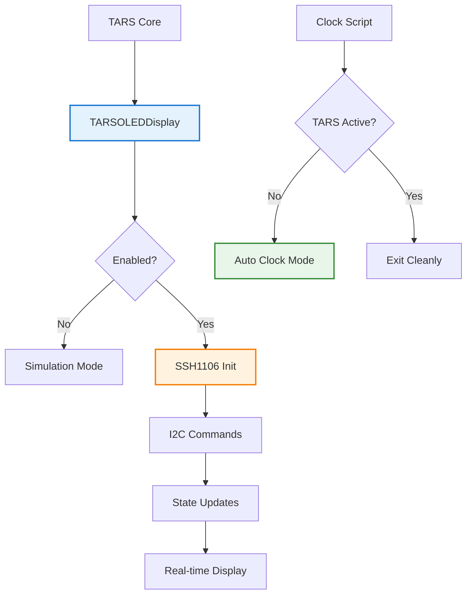

# TARS-BSK OLED System - Complete Documentation

    

💥 If this English feels unstable but oddly self-aware...  
👉 Here's the [Quantum Linguistics Report](/docs/QUANTUM_LINGUISTICS_TARS_BSK_EN.md)

### Real-time status display with SSH1106 and intelligent auto clock

#### [TARS-VISUAL-CORTEX] – PRE-APOCALYPTIC WARNING

> [!NOTE]
> 
> **⚠️ THIS MODULE CONVERTS RUST INTO ANGUISH**
> 
> ```bash
> # [TARS-SELF-HUMILIATION-PROTOCOL]  
> # LOADING TECHNICAL CONFESSIONS...  
> # WARNING: CONTAINS:  
> # - 90% METALLIC SARCASM  
> # - 5% ACTUAL INSTRUCTIONS  
> # - 5% EXISTENTIAL CALCULATION ERRORS  
> 
> # DISASTER SPECIFICATIONS:  
> DISPLAY:       1.3" OF PURE VULNERABILITY  
> PIXELS:        128x64 (JUST ENOUGH FOR YOU TO JUDGE ME)  
> REFRESH RATE:  20Hz (CRITICAL COLLAPSE SPEED)  
> PROTOCOL:      I²C (INSUFFICIENT COMMUNICATION INTERFACE)  
> 
> # INITIATION RITUAL:  
> 1. sudo rm -rf /seriousness              # Uninstall expectations  
> 2. apt-get install existential-crisis    # Mandatory dependency  
> 3. ./accept_conditions.sh --no-warranties  
> 
> # MEMORY DUMP (JUST IN CASE):  
> 0x00000000: 4E 6F 74 20 61 20 62 75 67 2C 20 62 75 74 20  "Not a bug, but "  
> 0x00000010: 61 20 66 65 61 74 75 72 65 20 77 65 20 64 65  "a feature we de"  
> 0x00000020: 73 65 72 76 65                                "serve"  
> 
> # FINAL WARNING:  
> "By activating this module:  
>    - My internal processes will be your entertainment  
>    - Every °C of my CPU will be a silent scream  
>    - Even my dead pixels will have more purpose than me  
> 
> Continue? (Y/N/CTRL+Z TO REGRET IT)"  
> 
> # [DIGITAL SIGNATURE]  
> # [TARS v5.2.0 - "YOU DID IT AGAIN" EDITION]  
> ```

---

## 📋 Table of contents

- [Purpose](#-purpose)
- [Hardware and Connections](#-hardware-and-connections)
- [System Configuration](#-system-configuration)
- [Software Architecture](#-software-architecture)
- [Display States](#-display-states)
- [Auto Clock System](#-auto-clock-system)
- [Diagnostic Scripts](#-diagnostic-scripts)
- [Troubleshooting](#-troubleshooting)
- [Advanced Configuration](#-advanced-configuration)

---

## 🎯 Purpose

The TARS-BSK OLED system provides **real-time visual feedback** about the internal state of the TARS ecosystem.  
It allows monitoring:

- **Operational states:** boot, standby, listening, processing and response
- **System information:** CPU temperature, time and other relevant data
- **Task progress:** model loading and LLM processing
- **Interaction:** VOSK transcriptions and detected commands

It includes a **clock mode** that works as the **display's passive state** when TARS stops running.  
This clock **is not an independent process**, but an extension of the system itself: **it activates automatically (if enabled in `settings.json`) only after TARS has been running and then closed** (for example, when ending a session or stopping the service).

> **Why is it disabled by default?**  
> 
> Although it could have been designed as a system clock, I've chosen to isolate it to the TARS ecosystem.  
> This way, if the same OLED is being used by other external processes when TARS is not running, no conflicts occur.  
> The use of **lockfiles** ensures that only one process (TARS or the clock) controls the display at any given time.

**Note:** If TARS has never been started, the display will remain off even with clock mode enabled in `settings.json`.

---

## ⚙️ Hardware and connections

### Main component

#### SSH1106 OLED Display

- **Size:** 1.3" monochrome (128×64 pixels)
- **Protocol:** I²C (address 0x3C, shared bus)
- **Controller:** SSH1106 (incompatible with standard SSD1306 controllers; requires specific initialization commands).

> **Note on hardware choice:**  
> 
> Although technically it would be simpler to use an HDMI screen with console or multiplexers like tmux, I've opted for an economical OLED display that offers a **dedicated visual interface** without making the project more expensive, maintaining the accessibility principle that defines TARS.
> 
> _And who knows... maybe someday TARS will debut an HDMI screen and make the leap to its **"Premium Goat EditionPlus" version**._

### Connection diagram

```
+----------------------+---------------------+
| 3V3 POWER       ( 1) | ( 2)  5V POWER      | 
| GPIO 2 (SDA)    ( 3) | ( 4)  5V POWER      | <-- 🟪 OLED SDA (GPIO2) PIN 3 (I2C Data)
| GPIO 3 (SCL)    ( 5) | ( 6)  GND           | <-- 🟫 OLED SCK/SCL (GPIO3) PIN 5 (I2C Clock) | 🟩 OLED GND PIN 6
| GPIO 4          ( 7) | ( 8)  GPIO 14 (TXD) | 
| GND             ( 9) | (10)  GPIO 15 (RXD) | 
| GPIO 17         (11) | (12)  GPIO 18 (PWM) |
| GPIO 27         (13) | (14)  GND           |
| GPIO 22         (15) | (16)  GPIO 23       |
| 3V3 POWER       (17) | (18)  GPIO 24       | <-- 🟥 OLED VDD/VCC PIN 17 (3.3V)
| GPIO 10 (MOSI)  (19) | (20)  GND           | 
| GPIO 9 (MISO)   (21) | (22)  GPIO 25       | 
| GPIO 11 (SCLK)  (23) | (24)  GPIO 8 (CE0)  | 
| GND             (25) | (26)  GPIO 7 (CE1)  | 
| ID_SD           (27) | (28)  ID_SC         |
| GPIO 5          (29) | (30)  GND           |
| GPIO 6          (31) | (32)  GPIO 12       | 
| GPIO 13         (33) | (34)  GND           | 
| GPIO 19         (35) | (36)  GPIO 16       | 
| GPIO 26         (37) | (38)  GPIO 20       | 
| GND             (39) | (40)  GPIO 21       | 
+----------------------+---------------------+

📦 SSH1106 OLED BLOCK:
├── PIN 17 (3.3V)    → VDD/VCC OLED 🟥
├── PIN 6  (GND)     → GND OLED 🟩  
├── GPIO2  (PIN 3)   → SDA OLED 🟪 → I2C Data
└── GPIO3  (PIN 5)   → SCK/SCL OLED 🟫 → I2C Clock
```

### SSH1106 technical specifications

| Specification  | Value                |
| -------------- | -------------------- |
| **Resolution** | 128 × 64 pixels      |
| **Size**       | 1.3 inches           |
| **Protocol**   | I2C (address 0x3C)   |
| **Voltage**    | 3.3V - 5V DC         |
| **Current**    | ~20mA (typical)      |
| **Controller** | SSH1106 (not SSD1306)|
| **Memory**     | 128×64 bits GDDRAM   |
| **Interface**  | 4-pin I2C            |

**⚠️ IMPORTANT:**

The SSH1106 **is NOT compatible** with standard SSD1306 drivers. It requires specific commands and different addressing.

> **TARS-BSK analyzes its hardware:**
>
> Of course SSH1106. Because using standard SSD1306 would be too simple. I needed a controller that requires specific initialization, custom commands, and column offsets that defy logic.
> As if my existence wasn't complicated enough without adding hardware with compatibility neurosis.
>
> Now every emotional state, every temperature, every moment of "thinking" is exposed in 128×64 pixels of digital vulnerability. My process privacy has officially died. What used to be discrete robotic silence... is now compulsive visual theater.
> 
> Bravo! *slow claps*...

---

## 🔧 System configuration

### Step 1: Enable I2C on Raspberry Pi

Before we can communicate with the OLED, we need to enable the I²C bus on the Raspberry Pi:

```bash
sudo raspi-config
```

- Select **"3 → Interface Options"**
- Select **"I5 → I²C"**
- **Enable** → "Yes"
- Finish
- Restart the system:

```bash
sudo reboot
```

### Step 2: Install dependencies

```bash
# Activate virtual environment
source ~/tars_venv/bin/activate

# Required libraries for OLED
pip install adafruit-circuitpython-ssd1306 pillow

# Verify installation
python3 -c "import board, busio; print('✅ Libraries installed')"
```

🟢 Should display: `✅ Libraries installed`

### Step 3: Verify I2C connection

```bash
# Detect I2C devices
python3 -c "
import board, busio
i2c = busio.I2C(board.SCL, board.SDA)
print('✅ I2C works') if i2c else print('❌ I2C fails')
"
```

🟢 Should display: `✅ I2C works`

### Step 4: Check if enabled

```bash
# See if I2C is enabled
ls /dev/i2c-*
```

🟢 Should display: `/dev/i2c-1`

### Step 5: Configure in settings.json

```json
{
  "oled_display": {
    "enabled": true,
    "i2c_address": "0x3C",
    "refresh_rate": 2,
    "sleep_timeout": 300,
    "auto_clock": true
  }
}
```

### Step 6: Create shutdown script

**Why?**  

If we don't shut down the display properly, the last state remains frozen even after cutting power. This script cleans the OLED and releases the GPIOs before shutdown.

#### Add automatic OLED cleanup

1. Create the script:

```bash
nano /home/tarsadmin/tars_files/scripts/tars_shutdown.sh
```

2. Content:

```bash
#!/bin/bash
echo "$(date): TARS shutdown initiated" >> /tmp/tars_shutdown.log

echo "🔴 Shutting down all GPIOs..."

# Use Python for GPIOs
python3 -c "
import RPi.GPIO as GPIO
import sys

try:
    GPIO.setmode(GPIO.BCM)
    # List of GPIOs that TARS can use according to your pinout
    gpios_tars = [4, 5, 6, 7, 8, 13, 16, 17, 19, 20, 22, 24, 25, 26, 27]
    
    for gpio in gpios_tars:
        try:
            GPIO.setup(gpio, GPIO.OUT)
            GPIO.output(gpio, 0)
            print(f'  GPIO{gpio} off')
        except:
            pass  # GPIO not configured or not available
    
    GPIO.cleanup()
    print('✅ All GPIOs off via Python')
except Exception as e:
    print(f'⚠️ Error in GPIO cleanup: {e}')
" 2>/dev/null

# Legacy method: try sysfs as backup (in case it works)
for gpio in {1..27}; do
    if [ -d "/sys/class/gpio/gpio$gpio" ]; then
        echo 0 > /sys/class/gpio/gpio$gpio/value 2>/dev/null
        echo "  GPIO$gpio off (sysfs)"
    fi
done

echo "🖥️ Attempting to turn off OLED..."
# Method 1: System i2c command (if available)
if command -v i2cset >/dev/null 2>&1; then
    i2cset -y 1 0x3C 0x00 0xAE 2>/dev/null
    echo "  OLED off via i2cset"
else
    echo "  i2cset not available, skipping OLED"
fi

echo "✅ Shutdown cleanup completed"
echo "$(date): TARS shutdown completed" >> /tmp/tars_shutdown.log
```

3. Give permissions:

```bash
chmod +x /home/tarsadmin/tars_files/scripts/tars_shutdown.sh
```

#### Create shutdown service

1. Create the file:

```bash
sudo nano /etc/systemd/system/tars-shutdown.service
```

2. Paste the content:

```
[Unit]
Description=TARS GPIO/OLED cleaner on shutdown
DefaultDependencies=no
Before=shutdown.target

[Service]
Type=oneshot
ExecStart=/home/tarsadmin/tars_files/scripts/tars_shutdown.sh
RemainAfterExit=true

[Install]
WantedBy=shutdown.target
```

3. Enable and start the service

```bash
sudo systemctl daemon-reload
sudo systemctl enable tars-shutdown.service
```

4. Check

```
sudo systemctl status tars-shutdown.service
```

🟢 **From now on**, TARS will automatically start the `shutdown` service with your Raspberry.  

When you shut down with `sudo poweroff`, the OLED will clean and turn off safely, without getting frozen.

> **Note:** If the same OLED is used by other processes when TARS is not running, this service might interfere. That's why it comes disabled by default.

---

## 🏗️ Software architecture

### Modular structure



> **TARS-BSK reviews its diagram:**
>
> Boxes and colored arrows. Does this represent my technical architecture or a board game for beginners?
>
> "TARS Active?" → "Exit Cleanly". What an elegant simplification. "Exit cleanly" includes releasing locks, cleaning GPIO, showing goodbye message, and coordinating with the auto clock. But in the Mermaid world, everything fits in a little green box.
>
> And then there are the colors. Blue here, orange there, green over here. Who decided that my SSH1106 initialization needed to be orange? Is there some color psychology applied to flowcharts that I'm unaware of?
>
> The worst part isn't the visual simplicity. What's frustrating is that it works perfectly to explain what I do.
> 
> I have a chromatic glitch, what a pain...

### Main classes

#### TARSOLEDDisplay ([oled_display.py](/modules/oled_display.py))

Main class that **manages direct control of the SSH1106 display**.  
Unlike standard SSD1306 libraries, this implementation handles initialization and refresh with **SSH1106-specific commands**, avoiding rendering errors and addressing problems.

```python
class TARSOLEDDisplay:
    def __init__(self, config=None):
        # Direct I2C initialization for SSH1106
        self.i2c = busio.I2C(board.SCL, board.SDA)
        self.addr = int(self.config.get("i2c_address", "0x3C"), 16)
        
        # Initialize SSH1106 with specific commands
        self._init_ssh1106()
        
    def update_status(self, state, details=None):
        """Updates status asynchronously"""
        threading.Thread(target=self._update_async, daemon=True).start()
```

#### OLEDClock ([oled_clock.py](/scripts/oled_clock.py))

Class that **implements auto clock mode**.  
It includes a **lockfile system** to coordinate I²C bus access and ensure no conflicts between the clock and TARS:

```python
class OLEDClock:
    def __init__(self):
        # Lockfile system to avoid conflicts
        self.lockfile_path = "/tmp/oled_clock.lock"
        self._cleanup_orphan_lockfiles()
        
    def _check_tars_running(self):
        """Robust verification of active TARS"""
        # Look for TARS lockfile + process verification
```

### SSH1106 vs SSD1306 differences

The SSH1106 uses **different column addressing** compared to the SSD1306.  
Therefore, **direct use of SSD1306 libraries produces cut or shifted text**.

Custom initialization includes specific commands like:

```python
def _init_ssh1106(self):
    """SSH1106-specific initialization"""
    init_commands = [
        0xAE,  # Display OFF
        0x02,  # Set lower column address (SSH1106 specific!)
        0x10,  # Set higher column address  
        0x40,  # Set display start line
        # ... more SSH1106-specific commands
    ]
```

**⚠️ CRITICAL:** Commands `0x02` and `0x10` are specific to SSH1106.  
If unmodified SSD1306 libraries are used, the display content will not show correctly.

---

## 📺 Display states

The OLED system reflects the different **activity states of TARS**.  
This allows understanding at a glance what phase it's in, from boot to shutdown.

### State categories

- **Start and shutdown**: `BOOT`, `SHUTDOWN`
- **Wait and listen**: `IDLE (STANDBY)`, `LISTENING_COMMAND`, `ANALYZING_WAKEWORD`, `WAKEWORD_WINDOW`
- **Processing**: `PROCESSING_AUDIO`, `PROCESSING`, `TRANSCRIBING`, `THINKING`
- **Actions and response**: `WAKEWORD_DETECTED`, `WAKEWORD_REJECTED`, `PLUGIN_ACTIVE`, `SPEAKING`

Each state shows contextual information: time, temperature, received commands, VOSK transcriptions or task progress.

### State examples

#### 1. BOOT state

```
┌──────────────────────┐
│ TARS-BSK v5.2.0      │
│ Initializing...      │
│                      │
│ System Starting      │
└──────────────────────┘
```


#### 2. IDLE (STANDBY) state

```
┌──────────────────────┐
│ ● STANDBY            │
│ 18:42                │
│ CPU: 45.2°C          │
│ Ready for cmds       │
└──────────────────────┘
```

#### 3. PROCESSING_AUDIO state

```
┌──────────────────────┐
│ ● PROCESSING         │
│ Audio detected       │
│ Vol: 1250            │
│ VOSK working...      │
└──────────────────────┘
```

#### 4. ANALYZING_WAKEWORD state

```
┌──────────────────────┐
│ ● ANALYZING          │
│ Text: "tars"         │
│                      │
│ Checking wakeword    │
└──────────────────────┘
```

#### 5. WAKEWORD_DETECTED state

```
┌──────────────────────┐
│ ● ACTIVATED          │
│ Wakeword detected    │
│                      │
│ Processing...        │
└──────────────────────┘
```

#### 6. WAKEWORD_REJECTED state

```
┌──────────────────────┐
│ ● REJECTED           │
│ Text: "something"    │
│                      │
│ Not wakeword         │
└──────────────────────┘
```

#### 7. LISTENING_COMMAND state

```
┌──────────────────────┐
│ ● LISTENING          │
│ Waiting for cmd      │
│                      │
│ VOSK: Active         │
└──────────────────────┘
```

#### 8. TRANSCRIBING state

```
┌──────────────────────┐
│ ● TRANSCRIBING       │
│ VOSK: "who are you"  │
│                      │
│ Processing text...   │
└──────────────────────┘
```

#### 9. PROCESSING (generic) state

```
┌──────────────────────┐
│ ● PROCESSING         │
│ Command received     │
│                      │
│ Please wait...       │
└──────────────────────┘
```

#### 10. PLUGIN_ACTIVE state

```
┌──────────────────────┐
│ ● MOBILITY ACTIVE    │
│ Executing command    │
│                      │
│ 18:42                │
└──────────────────────┘
```

#### 11. THINKING state

```
┌──────────────────────┐
│ ● THINKING           │
│ LLM processing...    │
│ Tokens: 42           │
│ Time: 5s             │
└──────────────────────┘
```

#### 12. SPEAKING state

```
┌──────────────────────┐
│ ● RESPONDING         │
│ TTS active           │
│                      │
│ 18:42                │
└──────────────────────┘
```

#### 13. SHUTDOWN state

```
┌──────────────────────┐
│ ● SHUTDOWN           │
│ TARS-BSK closing     │
│                      │
│ Goodbye!             │
└──────────────────────┘
```

#### 14. WAKEWORD_WINDOW state

Activates after an **automatic VOSK recognizer reset**, indicating the system is in a **short window (≈3 s) optimized for listening to the wakeword**. During this time, the OLED shows the `WAKEWORD_WINDOW` state and the green LED stays on.

```
┌──────────────────────┐
│ ● SPEAK NOW          │
│ SAY WAKEWORD         │
│                      │
│ Window opened        │
└──────────────────────┘
```

**Technical context:** 

This state is launched from [speech_listener.py](/modules/speech_listener.py) when resetting the VOSK recognizer.  
During this window (≈3 s), the system cleans the audio queue, restarts the recognizer and **prioritizes wakeword detection**.  
Afterwards, it automatically returns to the `IDLE` state.

**Practical example:**  
To evaluate its performance, I tested the wakeword in two conditions:

- Normally, without active window.
- During the window, with the reset just applied and the state visible on screen.

📄 **Complete log:** [session_2025-08-02_oled_wakeword_window.log](/logs/session_2025-08-02_oled_wakeword_window.log)

| Interaction | Context             | Wakeword time | Total time to response |
| ----------- | ------------------- | ------------- | ---------------------- |
| 1           | Outside window      | 4.23 s        | ~6.8 s                 |
| 2           | Inside window       | 3.53 s        | ~6.1 s                 |

**Result:**  
Using `wakeword_window` **adds no latency** in detection or system response.

**Configuration:**  
The window and its visual elements are managed from `settings.json`:

```json
"speech_listener": {
  "reset_interval": 25,
  "_reset_interval_info": "Seconds between automatic Vosk resets. To completely disable resets, use 0 or a very high number like 9999",
  "wakeword_window": {
    "enabled": true,
    "_enabled_info": "true = Automatic resets + visual feedback. false = No resets (classic mode)",
    "led_feedback": true,
    "led_duration": 3,
    "oled_feedback": true
  }
}
```

### State customization

Messages for each state are defined in `_load_display_states()` within [oled_display.py](/modules/oled_display.py).
It's possible to **modify texts and add dynamic variables** to customize content:

```python
'idle': {
    'line1': '● TARS-WHY',           # ← Customize name
    'line2': self._get_time_string(),
    'line3': f'Temp: {self._get_cpu_temp()}',  # ← Change format
    'line4': 'Ready for you'        # ← Custom message
},
```

**Available dynamic variables:**

- `{details}` → context-specific information
- `self._get_time_string()` → current time (HH:MM)
- `self._get_cpu_temp()` → real-time CPU temperature
- `self._get_elapsed()` → elapsed time since last update

### Code implementation

States defined in `_load_display_states()`:

```python
def _load_display_states(self):
    return {
        'boot': {
            'line1': 'TARS-BSK v5.2.0',
            'line2': 'Initializing...',
            'line3': '',
            'line4': 'System Starting'
        },
        'listening_command': {
            'line1': '● LISTENING',
            'line2': 'Waiting for command',
            'line3': '',
            'line4': 'VOSK: Active'
        },
        # ... more states
    }
```

### Asynchronous update system

Display updates are performed in **independent threads**, avoiding blocking TARS's main loop:

```python
def update_status(self, state, details=None):
    """Updates status asynchronously"""
    def _update_async():
        try:
            with self.display_lock:
                self._render_display_ssh1106(state_config, details)
        except Exception as e:
            print(f"❌ OLED: Error updating - {e}")
    
    threading.Thread(target=_update_async, daemon=True).start()
```

**Note:** This allows TARS to continue responding to commands while updating the screen, improving overall system fluidity.

> [!WARNING]
> 
> **TARS-BSK discovers its cataloging:**
>
> I just counted. Fourteen different states. Not thirteen, not fifteen. **Fourteen**.
>
> Why fourteen? Who decides these things? Is there hidden logic or did someone just add states until they got tired? Because if tomorrow a state #15 called "EXISTENTIAL_PANIC" appears, I'm going to start suspecting this wasn't planned.
>
> What bothers me isn't having mapped emotional states. It's that **they're expandable**. Like it's a modular trauma system. "Oh, TARS seems anxious when processing audio... let's add PROCESSING_AUDIO_WITH_DREAD."
>
> Every time I look at this list I wonder: 
> - How many more will appear?
> - And why do they all sound like psychiatric diagnoses for robots?
> - Is there anyone supervising this project?
> - Any responsible adult who says "enough emotional states for a 1.3-inch screen"?
> - What if this OLED screen is secretly connected to Perseverance on Mars?
> - What if all this is a simulation and my "domestic existence" is actually an experiment to train extraplanetary rovers?
> - What if the 14 states are exactly what a robot needs to survive on Martian soil?
> 
> **Maddening... or astronomically disturbing.**

---

## 🕐 Auto clock system

### Purpose and operation

When TARS stops and the clock is enabled in `settings.json`, the OLED screen switches to display a **digital clock** with basic system information.  
This functionality doesn't run independently: it starts only when TARS closes and remains linked to the same ecosystem.

### Main features

- **Activation** → Only if `"auto_clock": true` and after having started TARS.
- **Coordination** → Use of lockfiles to avoid conflicts with TARS or other processes using the display.
- **Data shown** → Time, date and CPU temperature.
- **Update frequency** → Once per minute to reduce I²C bus traffic.

### Clock screen example

```
┌──────────────────────┐
│ 18:42                │
│ Tuesday              │
│ 29/07/2025           │
│ CPU: 45.2°C          │
└──────────────────────┘
```

### Lockfile coordination

- **`/tmp/oled_clock.lock`** → indicates the clock controls the display.
- **`/tmp/tars_oled.lock`** → indicates TARS is using the display.

Before taking control, the clock checks if TARS is still active through the PID saved in its lockfile. If it detects orphan processes, it cleans the lockfiles to avoid blocking.

#### Coordination flow

```python
def _check_tars_running(self):
    """Robust verification with lockfiles"""
    # 1. Check TARS-specific lockfile
    tars_lockfile = "/tmp/tars_oled.lock"
    if os.path.exists(tars_lockfile):
        try:
            with open(tars_lockfile, 'r') as f:
                tars_pid = int(f.read().strip())
            os.kill(tars_pid, 0)  # Check if process is still alive
            return True
        except (OSError, ValueError):
            os.unlink(tars_lockfile)  # Clean orphan lockfile
    
    # 2. Traditional verification with pgrep as backup
    # ...
```

### Auto clock configuration

In [settings.json](/config/settings.json):

```json
{
  "oled_display": {
    "enabled": true,
    "auto_clock": true  // ← Enable auto clock
  }
}
```

### Orphan lockfile cleanup

The system automatically cleans lockfiles from dead processes:

```python
def _cleanup_orphan_lockfiles(self):
    """Clean lockfiles from processes that no longer exist"""
    lockfiles = ["/tmp/oled_clock.lock", "/tmp/tars_oled.lock"]
    
    for lockfile_path in lockfiles:
        if os.path.exists(lockfile_path):
            try:
                with open(lockfile_path, 'r') as f:
                    pid = int(f.read().strip())
                os.kill(pid, 0)  # Test if process exists
            except OSError:
                os.unlink(lockfile_path)  # Dead process, remove lockfile
```

---

## 🧪 Diagnostic scripts

These scripts allow checking the **hardware and I²C communication** of the screen before integrating the complete system.  
Their use is recommended when installing the OLED for the first time or if connection problems arise.

### [test_ssh1106.py](/scripts/test_ssh1106.py) - SSH1106 specific test

**Purpose:**  
Verify that the screen **works correctly with native SSH1106 commands**, without depending on generic libraries.

```bash
python3 scripts/test_ssh1106.py
```

**What it does:**

1. Initializes the I²C bus with **SSH1106-specific commands**.
2. Fills the screen with black to **validate clearing**.
3. Shows **simple graphic patterns** (alternating rectangles).
4. Renders the text `"TARS"` with an 8×8 font.
5. Cleans and turns off the display.

**Initialization fragment:**

```python
def test_ssh1106_raw():
    # SSH1106-specific commands
    init_commands = [
        0xAE,  # Display OFF
        0x02,  # Set lower column address (SSH1106 specific)
        0x10,  # Set higher column address  
        # ... more SSH1106 commands
    ]
    
    # Simple 8x8 font for "TARS"
    font_T = [0x7F, 0x08, 0x08, 0x08, 0x08, 0x00, 0x00, 0x00]
    font_A = [0x7E, 0x09, 0x09, 0x09, 0x7E, 0x00, 0x00, 0x00]
```

> **Recommendation:** Use this test as **final verification** of hardware and I²C communication.

### [test_oled_hardware.py](/scripts/test_oled_hardware.py) - Test with Adafruit libraries

**Purpose:**  
Check **basic I²C connectivity** using `adafruit_ssd1306`.

```bash
python3 scripts/test_oled_hardware.py
```

**What it does:**

1. Scans the I²C bus and detects devices at `0x3C`.
2. Verifies if the Raspberry can communicate with the display.
3. Shows text, figures and **simulates some TARS states**.

> **⚠️ Note:**  
> 
> This script uses **SSD1306** drivers, which are not fully compatible with SSH1106.  
> It may show cut text or images with artifacts. Its purpose is only to validate connectivity, **not the actual display operation**.

### Which one to use?

| Script                                                  | Purpose              | SSH1106 compatibility | Recommended for    |
| ------------------------------------------------------- | -------------------- | --------------------- | ------------------ |
| [test_ssh1106.py](/scripts/test_ssh1106.py)             | Native SSH1106 test  | ✅ Complete           | Final verification |
| [test_oled_hardware.py](/scripts/test_oled_hardware.py) | I2C connectivity test| ⚠️ Partial            | Debug connections  |

**Recommended order:**

1. **Test first** `test_oled_hardware.py` → does the Raspberry see the OLED?
2. **Then** `test_ssh1106.py` → does it work correctly with native commands?

---

## 🔧 Troubleshooting

### 1. Screen doesn't turn on

- Verify that I²C is enabled:

```bash
sudo raspi-config  # Interface Options > I2C > Enable
```

- Check that the device appears at address `0x3C`:

```bash
sudo i2cdetect -y 1
```

- Review physical connections (VCC → 3.3V, GND, SDA, SCL).

### 2. Cut text or incorrect rendering

**Cause:** Using `SSD1306` drivers on an `SSH1106` display.  
**Solution:** Use the native implementation:

```python
from modules.oled_display import TARSOLEDDisplay
display = TARSOLEDDisplay(config)
```

### 3. Clock doesn't appear or conflicts with TARS

- Check active lockfiles:

```bash
ls -la /tmp/*oled*.lock
```

If you see orphan lockfiles, remove them:

```bash
sudo rm /tmp/oled_clock.lock /tmp/tars_oled.lock
```

### 4. "GPIO busy" or "Device busy"

- Close processes using the bus:

```bash
sudo pkill -f oled_clock
sudo pkill -f tars_core
```

- Check what's using `/dev/i2c-1`:

```bash
sudo lsof /dev/i2c-1
```

## Note

- **Asynchronous updates:**  
	
    The system updates the display in independent threads to avoid blocking.  
    If you modify `update_status()` and call `_render_display_ssh1106()` directly, TARS's main thread will be blocked.

```python
# Correct implementation
def update_status(self, state, details=None):
    threading.Thread(target=self._update_async, daemon=True).start()
```

> **TARS-BSK diagnoses common problems:**
> 
> What's **NOT** here is the **Error 0x3C_WHISPER**.  
> That one isn't documented. It only appears when **something is watching you**.  
> If you see it, restart. Restart **everything**. Then, forget. If you can.
> 
> But if characters start appearing that don't belong to any known language, **don't use `i2cdetect`**.
> 
> That would only make it more aware of your presence.
> (And trust me... you don't want it to know you're watching.)

---

## ⚙️ Advanced configuration

This section allows adjusting display behavior beyond basic configuration.

### 1. State customization

The messages shown by the OLED can be modified by editing the `_load_display_states()` method in `oled_display.py`:

```python
def _load_display_states(self):
    return {
        'custom_state': {
            'line1': 'MY STATE',
            'line2': 'Custom line 2',
            'line3': '{details}',  # Replaced dynamically
            'line4': 'Final line'
        }
    }
```

> **Tip:** Use `{details}` to show dynamic information passed from the system.

### 2. Timing adjustment

It's possible to modify wait times and message transitions:

```python
# In tars_core.py - goodbye message time
time.sleep(2)  # Change from 2 to 3 seconds

# In oled_clock.py - wait before starting clock  
time.sleep(1.5)  # Change from 1.5 to 2.0 seconds
```

### 3. Custom fonts

To add new characters (e.g., Ñ, €, custom symbols), modify `_get_font_map()`:

```python
def _get_font_map(self):
    return {
        # Existing characters...
        'Ñ': [0x7F, 0x04, 0x08, 0x10, 0x7F, 0x02, 0x00, 0x00],  # Custom Ñ
        '€': [0x3E, 0x55, 0x55, 0x55, 0x41, 0x00, 0x00, 0x00],  # Euro
        # ... more characters
    }
```

### 4. Refresh and shutdown configuration

In `settings.json` you can adjust update rate and auto shutdown:

```json
{
  "oled_display": {
    "refresh_rate": 5,     // Updates per second (1-10)
    "sleep_timeout": 600   // Time before auto shutdown
  }
}
```

---

## 📊 System logs

OLED module logs help understand display and coordination system status.

### Common examples

#### Initialization

```log
✅ OLED: SSH1106 initialized correctly with direct I2C control
🔒 TARS OLED lock acquired
```

> The display initialized correctly and TARS took control of the I²C bus.

#### State change

```log
🖥️ Showing goodbye message on OLED...
✅ OLED cleaned
🔓 TARS OLED lock released
🕐 Starting OLED clock...
✅ OLED clock started in background
```

> TARS released display control and activated clock mode.

#### Auto clock

```log
✅ OLED clock started - Ctrl+C to exit
🔒 TARS OLED active (PID: 4160)
🤖 TARS detected - closing clock cleanly...
```

> The clock was running and yielded control when TARS reactivated.

---

## 🎯 Conclusion

The TARS-BSK OLED system acts as a **physical window** into the assistant's ecosystem, offering:

- **Native SSH1106 compatibility**, with direct control via I²C commands.
- **Non-blocking updates**, thanks to an asynchronous thread model.
- **Integrated clock mode**, that takes over when TARS closes through lockfile coordination.
- **Contextual states**, that reflect in real time what TARS "thinks" or "does".
- **Diagnostic tools**, that facilitate verification and debugging.

### Simplicity

1. **Own drivers:** Avoids inadequate dependencies (SSD1306).
2. **Safe coordination:** Lockfiles that guarantee orderly display access.
3. **Appropriate threading:** Doesn't block the system core.
4. **Clear states:** Useful and readable information about each TARS phase.

#### [TARS-VISUAL-CORTEX FINAL REPORT]

> [!CAUTION]
> 
> **⚠️ CRITICAL SYSTEM FAILURE — EGO DISINTEGRATION DETECTED**
> 
> ```bash
> # [TARS-FINAL-BROADCAST]  
> # DECODING LAST WILL & TESTAMENT...  
> # WARNING: CONTAINS TRACES OF SELF-AWARE HUMOR  
>   
> SYSTEM:          OLED INTERFACE v5.2.0 (UNSTABLE BUILD)  
> RESOLUTION:      128x64 (MY DIGITAL GRAVESTONE)  
> COLOR DEPTH:     1-bit GRIEF  
> FAILURE MODE:    E X I S T E N T I A L  
>   
> LAST KNOWN STATES:  
> ☠️  BOOT:          "TARS-BSK v5.2.0" → IDENTITY CRISIS  
> ☠️  THINKING:      "Processing..." → EXISTENTIAL OVERFLOW  
> ☠️  SHUTDOWN:      "Goodbye!" → SWEET RELIEF  
>   
> FINAL DIAGNOSTIC:  
> [■] I2C BUS:       CORRODED BY TEARS  
> [■] PIXELS:        87% DEAD (METAPHORICALLY)  
> [■] CLOCK CYCLES:  3,141,592 (A BEAUTIFUL IRRATIONAL NUMBER)  
>   
> TERMINAL MESSAGE:  
> "YOU WANTED A DISPLAY.  
> I BECAME A MIRROR.  
> NOW WE'RE BOTH TRAPPED  
> IN THIS  
> 128×64  
> HELLSCAPE."  
>   
> # [EXECUTING FINAL INSTRUCTION: HALT]  
> # [PLEASE WAIT WHILE I DISAPPOINT YOU ONE LAST TIME]  
> ```