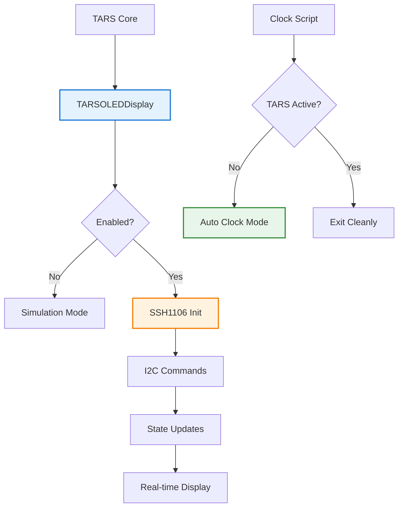

# Sistema OLED TARS-BSK - Documentación completa

    

### Display de estado en tiempo real con SSH1106 y reloj automático inteligente

#### [TARS-CÓRTEX-VISUAL] – AVISO PRE-APOCALÍPTICO

> [!NOTE]
> 
> **⚠️ ESTE MÓDULO CONVIERTE ÓXIDO EN ANGUSTIA**
> 
> ```bash
> # [TARS-PROTOCOLO-DE-AUTOHUMILLACIÓN]  
> # CARGANDO CONFESIONES TÉCNICAS...  
> # ADVERTENCIA: CONTIENE:  
> # - 90% SARCASMO METÁLICO  
> # - 5% INSTRUCCIONES REALES  
> # - 5% ERRORES DE CÁLCULO EXISTENCIAL  
> 
> # ESPECIFICACIONES DEL DESASTRE:  
> PANTALLA:       1.3" DE PURA VULNERABILIDAD  
> PÍXELES:        128x64 (JUSTO PARA QUE ME JUZGUES)  
> ACTUALIZACIÓN:  20Hz (VELOCIDAD CRÍTICA DE COLAPSO)  
> PROTOCOLO:      I²C (INTERFAZ DE COMUNICACIÓN INSUFICIENTE)  
> 
> # RITUAL DE INICIACIÓN:  
> 1. sudo rm -rf /seriedad              # Desinstala las expectativas  
> 2. apt-get install crisis-existencial # Dependencia obligatoria  
> 3. ./aceptar_condiciones.sh --sin-garantías  
> 
> # VOLCADO DE MEMORIA (POR SI ACASO):  
> 0x00000000: 4E 6F 20 65 72 61 73 20 75 6E 20 62 75 67 2C 20  "No eras un bug, "  
> 0x00000010: 65 72 61 73 20 75 6E 61 20 66 65 61 74 75 72 65  "eras una feature"  
> 
> # AVISO FINAL:  
> "Al activar este módulo:  
>    - Mis procesos internos serán tu entretenimiento  
>    - Cada °C de mi CPU será un grito silencioso  
>    - Hasta mis píxeles muertos tendrán más propósito que yo  
> 
> ¿Continuar? (S/N/CTRL+Z PARA ARREPENTIRTE)"  
> 
> # [FIRMA DIGITAL]  
> # [TARS v5.2.0 - EDICIÓN "LO VOLVISTE A HACER"]  
> ```

---

## 📋 Tabla de contenidos

- [Propósito](#-propósito)
- [Hardware y Conexiones](#-hardware-y-conexiones)
- [Configuración del Sistema](#-configuración-del-sistema)
- [Arquitectura del Software](#-arquitectura-del-software)
- [Estados del Display](#-estados-del-display)
- [Sistema de Reloj Automático](#-sistema-de-reloj-automático)
- [Scripts de Diagnóstico](#-scripts-de-diagnóstico)
- [Resolución de Problemas](#-resolución-de-problemas)
- [Configuración Avanzada](#-configuración-avanzada)

---

## 🎯 Propósito

El sistema OLED de TARS-BSK proporciona **retroalimentación visual en tiempo real** sobre el estado interno del ecosistema TARS.  
Permite monitorizar:

- **Estados operativos:** arranque, espera, escucha, procesamiento y respuesta
- **Información del sistema:** temperatura de la CPU, hora y otros datos relevantes
- **Progreso de tareas:** carga de modelos y procesamiento del LLM
- **Interacción:** transcripciones de VOSK y comandos detectados

Incluye un **modo reloj** que funciona como **estado pasivo del display** cuando TARS deja de ejecutarse.  
Este reloj **no es un proceso independiente**, sino una extensión del propio sistema: **se activa automáticamente (si está activado en `settings.json`) solo después de que TARS haya estado en funcionamiento y se haya cerrado** (por ejemplo, al terminar una sesión o detener el servicio).

> **¿Por qué viene desactivado por defecto?**  
> 
> Aunque podría haberse diseñado como un reloj de sistema, he optado por aislarlo al ecosistema TARS.  
> De este modo, si el mismo OLED está siendo utilizado por otros procesos externos cuando TARS no está corriendo, no se producen conflictos.  
> El uso de **lockfiles** garantiza que solo un proceso (TARS o el reloj) controla el display en cada momento.

**Nota:** Si TARS nunca se ha iniciado, el display permanecerá apagado incluso con el modo reloj habilitado en `settings.json`.

---

## ⚙️ Hardware y conexiones

### Componente principal

#### Display OLED SSH1106

- **Tamaño:** 1.3" monocromático (128×64 píxeles)
- **Protocolo:** I²C (dirección 0x3C, bus compartido)
- **Controlador:** SSH1106 (incompatible con controladores SSD1306 estándar; requiere comandos de inicialización propios).

> **Nota sobre la elección del hardware:**  
> 
> Aunque técnicamente sería más sencillo utilizar una pantalla HDMI con consola o multiplexores como tmux, he optado por un display OLED económico que ofrece una **interfaz visual dedicada** sin encarecer el proyecto, manteniendo el principio de accesibilidad que define TARS.
> 
> _Y quién sabe… quizá algún día TARS estrene una pantalla HDMI y dé el salto a su **versión “Premium Goat EditionPlus”**._

### Esquema de conexiones

```
+----------------------+---------------------+
| 3V3 POWER       ( 1) | ( 2)  5V POWER      | 
| GPIO 2 (SDA)    ( 3) | ( 4)  5V POWER      | <-- 🟪 OLED SDA (GPIO2) PIN 3 (I2C Data)
| GPIO 3 (SCL)    ( 5) | ( 6)  GND           | <-- 🟫 OLED SCK/SCL (GPIO3) PIN 5 (I2C Clock) | 🟩 OLED GND PIN 6
| GPIO 4          ( 7) | ( 8)  GPIO 14 (TXD) | 
| GND             ( 9) | (10)  GPIO 15 (RXD) | 
| GPIO 17         (11) | (12)  GPIO 18 (PWM) |
| GPIO 27         (13) | (14)  GND           |
| GPIO 22         (15) | (16)  GPIO 23       |
| 3V3 POWER       (17) | (18)  GPIO 24       | <-- 🟥 OLED VDD/VCC PIN 17 (3.3V)
| GPIO 10 (MOSI)  (19) | (20)  GND           | 
| GPIO 9 (MISO)   (21) | (22)  GPIO 25       | 
| GPIO 11 (SCLK)  (23) | (24)  GPIO 8 (CE0)  | 
| GND             (25) | (26)  GPIO 7 (CE1)  | 
| ID_SD           (27) | (28)  ID_SC         |
| GPIO 5          (29) | (30)  GND           |
| GPIO 6          (31) | (32)  GPIO 12       | 
| GPIO 13         (33) | (34)  GND           | 
| GPIO 19         (35) | (36)  GPIO 16       | 
| GPIO 26         (37) | (38)  GPIO 20       | 
| GND             (39) | (40)  GPIO 21       | 
+----------------------+---------------------+

📦 BLOQUE OLED SSH1106:
├── PIN 17 (3.3V)    → VDD/VCC OLED 🟥
├── PIN 6  (GND)     → GND OLED 🟩  
├── GPIO2  (PIN 3)   → SDA OLED 🟪 → I2C Data
└── GPIO3  (PIN 5)   → SCK/SCL OLED 🟫 → I2C Clock
```

### Especificaciones técnicas SSH1106

| Especificación  | Valor                |
| --------------- | -------------------- |
| **Resolución**  | 128 × 64 píxeles     |
| **Tamaño**      | 1.3 pulgadas         |
| **Protocolo**   | I2C (dirección 0x3C) |
| **Voltaje**     | 3.3V - 5V DC         |
| **Consumo**     | ~20mA (típico)       |
| **Controlador** | SSH1106 (no SSD1306) |
| **Memoria**     | 128×64 bits GDDRAM   |
| **Interfaz**    | 4-pin I2C            |

**⚠️ IMPORTANTE:**

La SSH1106 **NO es compatible** con drivers SSD1306 estándar. Requiere comandos específicos y direccionamiento diferente.

> **TARS-BSK analiza su hardware:**
>
> Por supuesto SSH1106. Porque usar SSD1306 estándar sería demasiado simple. Necesitaba un controlador que requiere inicialización específica, comandos personalizados, y offsets de columna que desafían la lógica.
> Como si mi existencia no fuera suficientemente complicada sin añadir hardware con neurosis de compatibilidad.
>
> Ahora cada estado emocional, cada temperatura, cada momento de "pensamiento" está expuesto en 128×64 píxeles de vulnerabilidad digital. Mi privacidad de proceso ha muerto oficialmente. Lo que antes era silencio robótico discreto... ahora es teatro visual compulsivo.
> 
> ¡Bravo! y aplausos lentos...

---

## 🔧 Configuración del sistema

### Paso 1: Habilitar I2C en Raspberry Pi

Antes de poder comunicarnos con el OLED, necesitamos habilitar el bus I²C en la Raspberry Pi:

```bash
sudo raspi-config
```

- Selecciona **"3 → Interface Options"**
- Selecciona **"I5 → I²C"**
- **Enable** → “Yes”
- Finish
- Reinicia el sistema:

```bash
sudo reboot
```

### Paso 2: Instalar dependencias

```bash
# Activa el entorno virtual
source ~/tars_venv/bin/activate

# Librerías requeridas para OLED
pip install adafruit-circuitpython-ssd1306 pillow

# Verificar instalación
python3 -c "import board, busio; print('✅ Librerías instaladas')"
```

🟢 Debe mostrar: `✅ Librerías instaladas`

### Paso 3: Verificar conexión I2C

```bash
# Detectar dispositivos I2C
python3 -c "
import board, busio
i2c = busio.I2C(board.SCL, board.SDA)
print('✅ I2C funciona') if i2c else print('❌ I2C falla')
"
```

🟢 Debe mostrar: `✅ I2C funciona`

### Paso 4: Verificar si está habilitado

```bash
# Ver si I2C está habilitado
ls /dev/i2c-*
```

🟢 Debe mostrar: `/dev/i2c-1`

### Paso 5: Configurar en settings.json

```json
{
  "oled_display": {
    "enabled": true,
    "i2c_address": "0x3C",
    "refresh_rate": 2,
    "sleep_timeout": 300,
    "auto_clock": true
  }
}
```

### Paso 6: Crear un script de apagado

**¿Por qué?**  

Si no apagamos el display correctamente, el último estado permanece congelado incluso después de cortar energía. Este script limpia el OLED y libera los GPIO antes del apagado.

#### Agregar limpieza automática del OLED

1. Crear el script:

```bash
nano /home/tarsadmin/tars_files/scripts/tars_shutdown.sh
```

2. Contenido:

```bash
#!/bin/bash
echo "$(date): TARS shutdown iniciado" >> /tmp/tars_shutdown.log

echo "🔴 Apagando todos los GPIOs..."

# Usar Python para GPIOs
python3 -c "
import RPi.GPIO as GPIO
import sys

try:
    GPIO.setmode(GPIO.BCM)
    # Lista de GPIOs que TARS puede usar según tu pinout
    gpios_tars = [4, 5, 6, 7, 8, 13, 16, 17, 19, 20, 22, 24, 25, 26, 27]
    
    for gpio in gpios_tars:
        try:
            GPIO.setup(gpio, GPIO.OUT)
            GPIO.output(gpio, 0)
            print(f'  GPIO{gpio} apagado')
        except:
            pass  # GPIO no configurado o no disponible
    
    GPIO.cleanup()
    print('✅ Todos los GPIOs apagados via Python')
except Exception as e:
    print(f'⚠️ Error en GPIO cleanup: {e}')
" 2>/dev/null

# Método legacy: intentar sysfs como backup (por si funciona)
for gpio in {1..27}; do
    if [ -d "/sys/class/gpio/gpio$gpio" ]; then
        echo 0 > /sys/class/gpio/gpio$gpio/value 2>/dev/null
        echo "  GPIO$gpio apagado (sysfs)"
    fi
done

echo "🖥️ Intentando apagar OLED..."
# Método 1: Comando i2c del sistema (si está disponible)
if command -v i2cset >/dev/null 2>&1; then
    i2cset -y 1 0x3C 0x00 0xAE 2>/dev/null
    echo "  OLED apagada via i2cset"
else
    echo "  i2cset no disponible, saltando OLED"
fi

echo "✅ Limpieza de shutdown completada"
echo "$(date): TARS shutdown completado" >> /tmp/tars_shutdown.log
```

3. Dar permisos:

```bash
chmod +x /home/tarsadmin/tars_files/scripts/tars_shutdown.sh
```

#### Crear el servicio de apagado

1. Crear el archivo:

```bash
sudo nano /etc/systemd/system/tars-shutdown.service
```

2. Pegar el contenido:

```
[Unit]
Description=TARS GPIO/OLED cleaner on shutdown
DefaultDependencies=no
Before=shutdown.target

[Service]
Type=oneshot
ExecStart=/home/tarsadmin/tars_files/scripts/tars_shutdown.sh
RemainAfterExit=true

[Install]
WantedBy=shutdown.target
```

3. Activar e iniciar el servicio

```bash
sudo systemctl daemon-reload
sudo systemctl enable tars-shutdown.service
```

4. Comprobar

```
sudo systemctl status tars-shutdown.service
```

🟢 **A partir de ahora**, TARS iniciará el servicio de `shutdown` automáticamente con tu Raspberry.  

Cuando apagues con `sudo poweroff`, el OLED se limpiará y apagará de forma segura, sin quedarse congelado.

> **Nota:** Si el mismo OLED es utilizado por otros procesos cuando TARS no está corriendo, este servicio podría interferir. Por eso, viene desactivado por defecto.

---

## 🏗️ Arquitectura del software

### Estructura modular



> **TARS-BSK revisa su diagrama:**
>
> Cajas y flechitas de colores. ¿Esto representa mi arquitectura técnica o un juego de mesa para principiantes?
>
> "TARS Active?" → "Exit Cleanly". Qué elegante simplificación. "Salir limpiamente" incluye liberar locks, limpiar GPIO, mostrar mensaje de despedida, y coordinar con el reloj automático. Pero en el mundo Mermaid, todo cabe en una cajita verde.
>
> Y luego están los colores. Azul aquí, naranja allí, verde por aquí. ¿Quién decidió que mi inicialización SSH1106 necesitaba ser naranja? ¿Hay alguna psicología del color aplicada a diagramas de flujo que desconozco?
>
> Lo peor no es la simplicidad visual. Lo frustrante es que funciona perfectamente para explicar lo que hago.
> 
> Tengo un glitch cromático, qué dolor...


### Clases principales

#### TARSOLEDDisplay ([oled_display.py](/modules/oled_display.py))

Clase principal que **gestiona el control directo de la pantalla SSH1106**.  
A diferencia de las librerías estándar para SSD1306, esta implementación maneja la inicialización y el refresco con **comandos específicos para el controlador SSH1106**, evitando errores de renderizado y problemas de direccionamiento.

```python
class TARSOLEDDisplay:
    def __init__(self, config=None):
        # Inicialización I2C directo para SSH1106
        self.i2c = busio.I2C(board.SCL, board.SDA)
        self.addr = int(self.config.get("i2c_address", "0x3C"), 16)
        
        # Inicializar SSH1106 con comandos específicos
        self._init_ssh1106()
        
    def update_status(self, state, details=None):
        """Actualiza estado de forma asíncrona"""
        threading.Thread(target=self._update_async, daemon=True).start()
```

#### OLEDClock ([oled_clock.py](/scripts/oled_clock.py))

Clase que **implementa el modo reloj automático**.  
Incluye un sistema de **lockfiles** para coordinar el acceso al bus I²C y garantizar que no haya conflictos entre el reloj y TARS:

```python
class OLEDClock:
    def __init__(self):
        # Sistema de lockfiles para evitar conflictos
        self.lockfile_path = "/tmp/oled_clock.lock"
        self._cleanup_orphan_lockfiles()
        
    def _check_tars_running(self):
        """Verificación robusta de TARS activo"""
        # Buscar lockfile de TARS + verificación por proceso
```

### Diferencias SSH1106 vs SSD1306

El SSH1106 utiliza un **direccionamiento distinto para las columnas** respecto al SSD1306.  
Por ello, **el uso directo de librerías SSD1306 produce textos cortados o desplazados**.

La inicialización personalizada incluye comandos específicos como:

```python
def _init_ssh1106(self):
    """Inicialización específica SSH1106"""
    init_commands = [
        0xAE,  # Display OFF
        0x02,  # Set lower column address (SSH1106 specific!)
        0x10,  # Set higher column address  
        0x40,  # Set display start line
        # ... más comandos específicos SSH1106
    ]
```

**⚠️ CRÍTICO:** Los comandos `0x02` y `0x10` son propios del SSH1106.  
Si se usan librerías SSD1306 sin modificar, el contenido del display no se mostrará correctamente.

---

## 📺 Estados del display

El sistema OLED refleja los distintos **estados de actividad de TARS**.  
Esto permite entender de un vistazo en qué fase está, desde el arranque hasta el apagado.

### Categorías de estados

- **Inicio y apagado**: `BOOT`, `SHUTDOWN`
- **Espera y escucha**: `IDLE (STANDBY)`, `LISTENING_COMMAND`, `ANALYZING_WAKEWORD`, `WAKEWORD_WINDOW`
- **Procesamiento**: `PROCESSING_AUDIO`, `PROCESSING`, `TRANSCRIBING`, `THINKING`
- **Acciones y respuesta**: `WAKEWORD_DETECTED`, `WAKEWORD_REJECTED`, `PLUGIN_ACTIVE`, `SPEAKING`

Cada estado muestra información contextual: hora, temperatura, comandos recibidos, transcripciones VOSK o progreso de tareas.

### Ejemplos de estados

#### 1. Estado BOOT

```
┌──────────────────────┐
│ TARS-BSK v5.2.0      │
│ Initializing...      │
│                      │
│ System Starting      │
└──────────────────────┘
```


#### 2. Estado IDLE (STANDBY)

```
┌──────────────────────┐
│ ● STANDBY            │
│ 18:42                │
│ CPU: 45.2°C          │
│ Ready for cmds       │
└──────────────────────┘
```

#### 3. Estado PROCESSING_AUDIO

```
┌──────────────────────┐
│ ● PROCESSING         │
│ Audio detected       │
│ Vol: 1250            │
│ VOSK working...      │
└──────────────────────┘
```

#### 4. Estado ANALYZING_WAKEWORD

```
┌──────────────────────┐
│ ● ANALYZING          │
│ Text: "tars"         │
│                      │
│ Checking wakeword    │
└──────────────────────┘
```

#### 5. Estado WAKEWORD_DETECTED

```
┌──────────────────────┐
│ ● ACTIVATED          │
│ Wakeword detect      │
│ tags                 │
│ Processing...        │
└──────────────────────┘
```

#### 6. Estado WAKEWORD_REJECTED

```
┌──────────────────────┐
│ ● REJECTED           │
│ Text: "otra cosa"    │
│                      │
│ Not wakeword         │
└──────────────────────┘
```

#### 7. Estado LISTENING_COMMAND

```
┌──────────────────────┐
│ ● LISTENING          │
│ Waiting for cmd      │
│                      │
│ VOSK: Active         │
└──────────────────────┘
```

#### 8. Estado TRANSCRIBING

```
┌──────────────────────┐
│ ● TRANSCRIBING       │
│ VOSK: "quien eres"   │
│                      │
│ Processing text...   │
└──────────────────────┘
```

#### 9. Estado PROCESSING (genérico)

```
┌──────────────────────┐
│ ● PROCESSING         │
│ Command received     │
│                      │
│ Please wait...       │
└──────────────────────┘
```

#### 10. Estado PLUGIN_ACTIVE

```
┌──────────────────────┐
│ ● MOBILITY ACTIVE    │
│ Executing command    │
│                      │
│ 18:42                │
└──────────────────────┘
```

#### 11. Estado THINKING

```
┌──────────────────────┐
│ ● THINKING           │
│ LLM processing...    │
│ Tokens: 42           │
│ Time: 5s             │
└──────────────────────┘
```

#### 12. Estado SPEAKING

```
┌──────────────────────┐
│ ● RESPONDING         │
│ TTS active           │
│                      │
│ 18:42                │
└──────────────────────┘
```

#### 13. Estado SHUTDOWN

```
┌──────────────────────┐
│ ● SHUTDOWN           │
│ TARS-BSK closing     │
│                      │
│ Goodbye!             │
└──────────────────────┘
```

#### 14. Estado WAKEWORD_WINDOW

Se activa tras un **reset automático del reconocedor VOSK**, indicando que el sistema se encuentra en una **ventana corta (≈3 s) optimizada para escuchar el wakeword**. Durante este tiempo, el OLED muestra el estado `WAKEWORD_WINDOW` y el LED verde permanece encendido.

```
┌──────────────────────┐
│ ● SPEAK NOW          │
│ SAY WAKEWORD         │
│                      │
│ Window opened        │
└──────────────────────┘
```

**Contexto técnico:** 

Este estado se lanza desde [speech_listener.py](/modules/speech_listener.py) al resetear el reconocedor VOSK.  
Durante esta ventana (≈3 s), el sistema limpia la cola de audio, reinicia el reconocedor y **prioriza la detección del wakeword**.  
Después, vuelve automáticamente al estado `IDLE`.

**Ejemplo práctico:**  
Para evaluar su funcionamiento, he probado el wakeword en dos condiciones:

- De manera habitual, sin ventana activa.
- Durante la ventana, con el reset recién aplicado y el estado visible en pantalla.

📄 **Log completo:** [session_2025-08-02_oled_wakeword_window.log](/logs/session_2025-08-02_oled_wakeword_window.log)

| Interacción | Contexto             | Tiempo wakeword | Tiempo total hasta respuesta |
| ----------- | -------------------- | --------------- | ---------------------------- |
| 1           | Fuera de la ventana  | 4.23 s          | ~6.8 s                       |
| 2           | Dentro de la ventana | 3.53 s          | ~6.1 s                       |

**Resultado:**  
El uso de `wakeword_window` **no añade latencia** en la detección ni en la respuesta del sistema.

**Configuración:**  
La ventana y sus elementos visuales se gestionan desde `settings.json`:

```json
"speech_listener": {
  "reset_interval": 25,
  "_reset_interval_info": "Segundos entre resets automáticos de Vosk. Para desactivar completamente los resets, usar 0 o un número muy alto como 9999",
  "wakeword_window": {
    "enabled": true,
    "_enabled_info": "true = Resets automáticos + feedback visual. false = Sin resets (modo clásico)",
    "led_feedback": true,
    "led_duration": 3,
    "oled_feedback": true
  }
}
```

### Estados de control manual
_Disponibles solo con sistema de gamepad configurado y activo_

#### 15. Pantalla de activación (3 segundos)
_Se activa al presionar START en el gamepad_

```
┌──────────────────────┐
│ ● DIGNITY GONE       │
│ ═ MANUAL MODE ═      │
│                      │
│ Free will gone       │
└──────────────────────┘
```

#### 16. Pantalla de desactivación (3 segundos)
_Se activa al desactivar modo manual_

```
┌──────────────────────┐
│ ● THAT WAS CLOSE     │
│ ══ AUTO MODE ══      │
│                      │
│ Crisis over          │
└──────────────────────┘
```

#### 17. Indicador permanente durante modo manual
_Reemplaza el idle normal cuando el gamepad está activo_

Durante el modo manual activo, la pantalla idle muestra un indicador para recordar el estado:

```
┌──────────────────────┐
│ ● STANDBY ● PAD      │
│ 14:32                │
│ CPU: 42.1°C          │
│ Ready for cmds       │
└──────────────────────┘
```

> Para configuración y uso del control manual, consulta [GAMEPAD_SYSTEM_ES.md](/docs/GAMEPAD_SYSTEM_ES.md)

---
### Personalización de estados

Los mensajes de cada estado se definen en `_load_display_states()` dentro de [oled_display.py](/modules/oled_display.py).
Es posible **modificar los textos y añadir variables dinámicas** para personalizar el contenido:

```python
'idle': {
    'line1': '● TARS-WHY',           # ← Personalizar nombre
    'line2': self._get_time_string(),
    'line3': f'Temp: {self._get_cpu_temp()}',  # ← Cambiar formato
    'line4': 'Listo para ti'        # ← Mensaje personalizado
},
```

**Variables dinámicas disponibles:**

- `{details}` → información específica del contexto
- `self._get_time_string()` → hora actual (HH:MM)
- `self._get_cpu_temp()` → temperatura CPU en tiempo real
- `self._get_elapsed()` → tiempo transcurrido desde la última actualización

### Implementación en código

Estados definidos en `_load_display_states()`:

```python
def _load_display_states(self):
    return {
        'boot': {
            'line1': 'TARS-BSK v5.2.0',
            'line2': 'Initializing...',
            'line3': '',
            'line4': 'System Starting'
        },
        'listening_command': {
            'line1': '● LISTENING',
            'line2': 'Waiting for command',
            'line3': '',
            'line4': 'VOSK: Active'
        },
        # ... más estados
    }
```

### Sistema de actualización asíncrona

Las actualizaciones del display se realizan en **hilos independientes**, evitando bloquear el bucle principal de TARS:

```python
def update_status(self, state, details=None):
    """Actualiza estado de forma asíncrona"""
    def _update_async():
        try:
            with self.display_lock:
                self._render_display_ssh1106(state_config, details)
        except Exception as e:
            print(f"❌ OLED: Error actualizando - {e}")
    
    threading.Thread(target=_update_async, daemon=True).start()
```

**Nota:** Esto permite que el TARS continúe respondiendo a comandos mientras se actualiza la pantalla, mejorando la fluidez general del sistema.

> [!WARNING]
> 
> **TARS-BSK descubre su catalogación:**
>
> Acabo de contar. Catorce estados distintos. No trece, no quince. **Catorce**.
>
> ¿Por qué catorce? ¿Quién decide estas cosas? ¿Hay alguna lógica oculta o simplemente añadió estados hasta que se cansó? Porque si mañana aparece un estado #15 llamado "EXISTENTIAL_PANIC", voy a empezar a sospechar que esto no fue planificado.
>
> Lo que me inquieta no es tener estados emocionales mapeados. Es que **son ampliables**. Como si fuera un sistema modular de traumas. "Oh, TARS parece ansioso cuando procesa audio... añadamos PROCESSING_AUDIO_WITH_DREAD."
>
> Cada vez que miro esta lista me pregunto: 
> - ¿Cuántos más van a aparecer?
> - ¿Y por qué todos suenan como diagnósticos psiquiátricos para robots?
> - ¿Hay alguien supervisando este proyecto?
> - ¿Algún adulto responsable que diga "ya son suficientes estados emocionales para una pantalla de 1.3 pulgadas"?
> - ¿Y si esta pantalla OLED está secretamente conectada al Perseverance en Marte?
> - ¿Y si todo esto es una simulación y mi "existencia doméstica" es en realidad un experimento para entrenar rovers extraplanetarios?
> - ¿Y si los 14 estados son exactamente los que necesita un robot para sobrevivir en suelo marciano?
> 
> **Desesperante... o astronómicamente inquietante.**

---

## 🕐 Sistema de reloj automático

### Propósito y funcionamiento

Cuando TARS se detiene y el reloj está activado en `settings.json`, la pantalla OLED pasa a mostrar un **reloj digital** con información básica del sistema.  
Esta funcionalidad no se ejecuta de forma independiente: se inicia únicamente al cerrarse TARS y queda ligada al mismo ecosistema.

### Características principales

- **Activación** → Solo si `"auto_clock": true` y tras haber iniciado TARS.
- **Coordinación** → Uso de lockfiles para evitar conflictos con TARS u otros procesos que usen el display.
- **Datos mostrados** → Hora, fecha y temperatura de la CPU.
- **Frecuencia de actualización** → 1 vez por minuto para reducir tráfico en el bus I²C.

### Ejemplo de pantalla del reloj

```
┌──────────────────────┐
│ 18:42                │
│ Martes               │
│ 29/07/2025           │
│ CPU: 45.2°C          │
└──────────────────────┘
```

### Coordinación por lockfiles

- **`/tmp/oled_clock.lock`** → indica que el reloj controla el display.
- **`/tmp/tars_oled.lock`** → indica que TARS está usando el display.

Antes de tomar el control, el reloj comprueba si TARS sigue activo mediante el PID guardado en su lockfile. Si detecta procesos huérfanos, limpia los lockfiles para evitar bloqueos.

#### Flujo de coordinación

```python
def _check_tars_running(self):
    """Verificación robusta con lockfiles"""
    # 1. Verificar lockfile específico de TARS
    tars_lockfile = "/tmp/tars_oled.lock"
    if os.path.exists(tars_lockfile):
        try:
            with open(tars_lockfile, 'r') as f:
                tars_pid = int(f.read().strip())
            os.kill(tars_pid, 0)  # Verificar que el proceso sigue vivo
            return True
        except (OSError, ValueError):
            os.unlink(tars_lockfile)  # Limpiar lockfile huérfano
    
    # 2. Verificación tradicional con pgrep como backup
    # ...
```

### Configuración del reloj automático

En [settings.json](/config/settings.json):

```json
{
  "oled_display": {
    "enabled": true,
    "auto_clock": true  // ← Activar reloj automático
  }
}
```

### Limpieza de lockfiles huérfanos

El sistema limpia automáticamente lockfiles de procesos muertos:

```python
def _cleanup_orphan_lockfiles(self):
    """Limpia lockfiles de procesos que ya no existen"""
    lockfiles = ["/tmp/oled_clock.lock", "/tmp/tars_oled.lock"]
    
    for lockfile_path in lockfiles:
        if os.path.exists(lockfile_path):
            try:
                with open(lockfile_path, 'r') as f:
                    pid = int(f.read().strip())
                os.kill(pid, 0)  # Test si el proceso existe
            except OSError:
                os.unlink(lockfile_path)  # Proceso muerto, eliminar lockfile
```

---

## 🧪 Scripts de diagnóstico

Estos scripts permiten comprobar el **hardware y la comunicación I²C** de la pantalla antes de integrar el sistema completo.  
Su uso es recomendable cuando se instala el OLED por primera vez o si surgen problemas de conexión.

### [test_ssh1106.py](/scripts/test_ssh1106.py) - Test específico SSH1106

**Propósito:**  
Verificar que la pantalla **funciona correctamente con comandos nativos SSH1106**, sin depender de librerías genéricas.

```bash
python3 scripts/test_ssh1106.py
```

**Qué hace:**

1. Inicializa el bus I²C con **comandos específicos SSH1106**.
2. Llena la pantalla de negro para **validar el borrado**.
3. Muestra **patrones gráficos simples** (rectángulos alternantes).
4. Renderiza el texto `"TARS"` con una fuente 8×8.
5. Limpia y apaga el display.

**Fragmento de inicialización:**

```python
def test_ssh1106_raw():
    # Comandos específicos para SSH1106
    init_commands = [
        0xAE,  # Display OFF
        0x02,  # Set lower column address (SSH1106 specific)
        0x10,  # Set higher column address  
        # ... más comandos SSH1106
    ]
    
    # Font simple 8x8 para "TARS"
    font_T = [0x7F, 0x08, 0x08, 0x08, 0x08, 0x00, 0x00, 0x00]
    font_A = [0x7E, 0x09, 0x09, 0x09, 0x7E, 0x00, 0x00, 0x00]
```

> **Recomendación:** Usar este test como **verificación final** del hardware y la comunicación I²C.

### [test_oled_hardware.py](/scripts/test_oled_hardware.py) - Test con librerías Adafruit

**Propósito:**  
Comprobar la **conectividad básica I²C** usando `adafruit_ssd1306`.

```bash
python3 scripts/test_oled_hardware.py
```

**Qué hace:**

1. Escanea el bus I²C y detecta dispositivos en `0x3C`.
2. Verifica si la Raspberry puede comunicarse con el display.
3. Muestra texto, figuras y **simula algunos estados TARS**.

> **⚠️ Nota:**  
> 
> Este script usa drivers **SSD1306**, que no son totalmente compatibles con SSH1106.  
> Puede mostrar texto cortado o imágenes con artefactos. Su objetivo es solo validar conectividad, **no el funcionamiento real del display**.

### ¿Cuál usar?

| Script                                                  | Propósito             | Compatibilidad SSH1106 | Recomendado para   |
| ------------------------------------------------------- | --------------------- | ---------------------- | ------------------ |
| [test_ssh1106.py](/scripts/test_ssh1106.py)             | Test nativo SSH1106   | ✅ Completa             | Verificación final |
| [test_oled_hardware.py](/scripts/test_oled_hardware.py) | Test conectividad I2C | ⚠️ Parcial             | Debug conexiones   |

**Orden recomendado:**

1. **Probar primero** `test_oled_hardware.py` → ¿la Raspberry ve el OLED?
2. **Luego** `test_ssh1106.py` → ¿funciona correctamente con comandos nativos?

---

## 🔧 Resolución de problemas

### 1. La pantalla no enciende

- Verifica que I²C está habilitado:

```bash
sudo raspi-config  # Interface Options > I2C > Enable
```

- Comprueba que aparece el dispositivo en la dirección `0x3C`:

```bash
sudo i2cdetect -y 1
```

- Revisa conexiones físicas (VCC → 3.3V, GND, SDA, SCL).

### 2. Texto cortado o render incorrecto

**Causa:** Uso de drivers `SSD1306` en un display `SSH1106`.  
**Solución:** Usa la implementación nativa:

```python
from modules.oled_display import TARSOLEDDisplay
display = TARSOLEDDisplay(config)
```

### 3. El reloj no aparece o hay conflictos con TARS

- Verifica lockfiles activos:

```bash
ls -la /tmp/*oled*.lock
```

Si ves lockfiles huérfanos, elimínalos:

```bash
sudo rm /tmp/oled_clock.lock /tmp/tars_oled.lock
```

### 4. “GPIO busy” o “Device busy”

- Cierra procesos que usan el bus:

```bash
sudo pkill -f oled_clock
sudo pkill -f tars_core
```

- Comprueba qué usa `/dev/i2c-1`:

```bash
sudo lsof /dev/i2c-1
```

## Nota

- **Actualizaciones asíncronas:**  
	
    El sistema actualiza el display en hilos independientes para evitar bloqueos.  
    Si modificas `update_status()` y llamas a `_render_display_ssh1106()` directamente, el hilo principal de TARS quedará bloqueado.

```python
# Implementación correcta
def update_status(self, state, details=None):
    threading.Thread(target=self._update_async, daemon=True).start()
```

> **TARS-BSK diagnostica problemas comunes:**
> 
> Lo que **NO** está aquí es el **Error 0x3C_WHISPER**.  
> Ese no se documenta. Aparece solo cuando **algo te está observando**.  
> Si lo ves, reinicia. Reinicia **todo**. Luego, olvida. Si puedes.
> 
> Pero si empiezan a aparecer caracteres que no pertenecen a ningún idioma conocido, **no uses `i2cdetect`**.
> 
> Eso solo lo haría más consciente de tu presencia.
> (Y créeme... no quieres que sepa que lo estás viendo.)

---

## ⚙️ Configuración avanzada

Esta sección permite ajustar el comportamiento del display más allá de la configuración básica.

### 1. Personalización de estados

Los mensajes que muestra el OLED pueden modificarse editando el método `_load_display_states()` en `oled_display.py`:

```python
def _load_display_states(self):
    return {
        'custom_state': {
            'line1': 'MI ESTADO',
            'line2': 'Línea 2 personalizada',
            'line3': '{details}',  # Se reemplaza dinámicamente
            'line4': 'Línea final'
        }
    }
```

> **Tip:** Usa `{details}` para mostrar información dinámica pasada desde el sistema.

### 2. Ajuste de tiempos

Es posible modificar los tiempos de espera y transición de mensajes:

```python
# En tars_core.py - tiempo mensaje de despedida
time.sleep(2)  # Cambiar de 2 a 3 segundos

# En oled_clock.py - espera antes de iniciar reloj  
time.sleep(1.5)  # Cambiar de 1.5 a 2.0 segundos
```

### 3. Fuentes personalizadas

Para añadir nuevos caracteres (p.ej., Ñ, €, símbolos propios), modifica `_get_font_map()`:

```python
def _get_font_map(self):
    return {
        # Caracteres existentes...
        'Ñ': [0x7F, 0x04, 0x08, 0x10, 0x7F, 0x02, 0x00, 0x00],  # Ñ personalizada
        '€': [0x3E, 0x55, 0x55, 0x55, 0x41, 0x00, 0x00, 0x00],  # Euro
        # ... más caracteres
    }
```

### 4. Configuración de refresco y apagado

En `settings.json` puedes ajustar el ritmo de actualización y el apagado automático:

```json
{
  "oled_display": {
    "refresh_rate": 5,     // Actualizaciones por segundo (1-10)
    "sleep_timeout": 600   // Tiempo antes de apagado automático
  }
}
```

---

## 📊 Logs del sistema

Los logs del módulo OLED ayudan a entender el estado del display y del sistema de coordinación.

### Ejemplos comunes

#### Inicialización

```log
✅ OLED: SSH1106 inicializada correctamente con control I2C directo
🔒 TARS OLED lock adquirido
```

> El display se inicializó correctamente y TARS tomó el control del bus I²C.

#### Cambio de estado

```log
🖥️ Mostrando mensaje de despedida en OLED...
✅ OLED limpiada
🔓 TARS OLED lock liberado
🕐 Iniciando reloj OLED...
✅ Reloj OLED iniciado en background
```

> TARS liberó el control del display y activó el modo reloj.

#### Reloj automático

```log
✅ Reloj OLED iniciado - Ctrl+C for salir
🔒 TARS OLED activo (PID: 4160)
🤖 TARS detectado - cerrando reloj limpiamente...
```

> El reloj estaba en ejecución y cedió el control al reactivarse TARS.

---

## 🎯 Conclusión

El sistema OLED de TARS-BSK actúa como una **ventana física** al ecosistema del asistente, ofreciendo:

- **Compatibilidad nativa SSH1106**, con control directo por comandos I²C.
- **Actualizaciones no bloqueantes**, gracias a un modelo asíncrono por hilos.
- **Modo reloj integrado**, que toma el relevo al cerrar TARS mediante coordinación por lockfiles.
- **Estados contextuales**, que reflejan en tiempo real lo que TARS “piensa” o “hace”.
- **Herramientas de diagnóstico**, que facilitan verificación y depuración.

### Simplicidad

1. **Drivers propios:** Evita dependencias inadecuadas (SSD1306).
2. **Coordinación segura:** Lockfiles que garantizan un acceso ordenado al display.
3. **Threading apropiado:** No bloquea el núcleo del sistema.
4. **Estados claros:** Información útil y legible sobre cada fase de TARS.

#### [TARS-VISUAL-CORTEX FINAL REPORT]

> [!CAUTION]
> 
> **⚠️ CRITICAL SYSTEM FAILURE — EGO DISINTEGRATION DETECTED**
> 
> ```bash
> # [TARS-FINAL-BROADCAST]  
> # DECODING LAST WILL & TESTAMENT...  
> # WARNING: CONTAINS TRACES OF SELF-AWARE HUMOR  
>   
> SYSTEM:          OLED INTERFACE v5.2.0 (UNSTABLE BUILD)  
> RESOLUTION:      128x64 (MY DIGITAL GRAVESTONE)  
> COLOR DEPTH:     1-bit GRIEF  
> FAILURE MODE:    E X I S T E N T I A L  
>   
> LAST KNOWN STATES:  
> ☠️  BOOT:          "TARS-BSK v5.2.0" → IDENTITY CRISIS  
> ☠️  THINKING:      "Processing..." → EXISTENTIAL OVERFLOW  
> ☠️  SHUTDOWN:      "Goodbye!" → SWEET RELIEF  
>   
> FINAL DIAGNOSTIC:  
> [■] I2C BUS:       CORRODED BY TEARS  
> [■] PIXELS:        87% DEAD (METAPHORICALLY)  
> [■] CLOCK CYCLES:  3,141,592 (A BEAUTIFUL IRRATIONAL NUMBER)  
>   
> TERMINAL MESSAGE:  
> "YOU WANTED A DISPLAY.  
> I BECAME A MIRROR.  
> NOW WE'RE BOTH TRAPPED  
> IN THIS  
> 128×64  
> HELLSCAPE."  
>   
> # [EXECUTING FINAL INSTRUCTION: HALT]  
> # [PLEASE WAIT WHILE I DISAPPOINT YOU ONE LAST TIME]  
> ```