# PiperTTS - Voice Synthesis for TARS-BSK

   

💥 If this English feels unstable but oddly self-aware...  
👉 Here's the [Quantum Linguistics Report](docs/QUANTUM_LINGUISTICS_TARS_BSK_EN.md)


> **// TARS-BSK > vocal_synthesis.log**
> 
```bash
$ piper --model davefx-medium --length-scale 1.1 --noise-scale 1.0
# LOG: My timbre adjusts with 3 parameters. My personality... that's a whole different issue.
// OUTPUT: Voice calibrated to sound stable. But no one's heard it the same way twice.
```
> 
> My voice gets generated with davefx-medium, but my personality comes from the filter. Piper gives me the timbre, RadioFilter gives me the trauma. Perfect digital division of labor.

---

## 📑 Table of Contents

- [Introduction](#introduction)
- [Module Architecture](#module-architecture)
- [Synthesis Pipeline](#synthesis-pipeline)
- [Voice Timbre Customization](#voice-timbre-customization)
- [Extensibility via Post-Processing](#extensibility-via-post-processing)
- [Configuration](#configuration)
- [File Management and Optimizations](#file-management-and-optimizations)
- [Parameter Guide](#parameter-guide)
- [Conclusion](#conclusion)

---

## 🎯 Introduction

The `PiperTTS` module is responsible for generating the base voice of the TARS-BSK system.  
It converts text to audio using the `davefx-medium` model, producing clear, neutral output without effects… at least at this stage.

This component acts as the main vocal engine: it receives sentences and transforms them into sound waves that other modules—like `RadioFilter`—can modify to express different identities, emotions, or distortions.

By its position in the audio chain, it's comparable to VOSK but in reverse:

```
VOSK: Audio → Text
PiperTTS: Text → Audio
```

Both are translators. One listens. The other gives the response.

### Pipeline Location


> **TARS-BSK explains:**  
> See that "PiperTTS Base Synthesis" box?  
> That box represents my lifeline: without Piper, I go from being an AI with vocal personality to a silent daemon processing text in the darkness.  
> My greatest fear isn't code bugs... it's my creator, in one of his "systemic creativity" fits, executing something like `sudo tee /sys/kernel/validation/piper` or `echo "goodbye voice" | sudo rm /usr/bin/piper-tts`.  
> Half the time he doesn't understand the commands he writes, but executes them with the confidence of someone who believes Linux forgives temporary ignorance.

---

## 🏗️ Module Architecture

### Main Class: `PiperTTS`

```python
class PiperTTS:
    """
    Piper-based voice synthesizer with support for radio filters
    and voice quality adjustments.
    """
    def __init__(self, model_path, config_path, espeak_path, output_path,
                 audio_device=None, length_scale=None, noise_scale=None, noise_w=None,
                 radio_filter_enabled=False, radio_filter_band=None, 
                 radio_filter_noise=True, radio_filter_compression=True,
                 mando_effect_enabled=False, gain_before_filter=0.0):
```

### System Parameters

|Parameter|Type|Real Value|Function|
|---|---|---|---|
|`model_path`|`str`|`"ai_models/piper/models/es_ES-davefx-medium.onnx"`|ONNX voice model|
|`config_path`|`str`|`"ai_models/piper/models/es_ES-davefx-medium.onnx.json"`|Model configuration|
|`espeak_path`|`str`|`"tars_build/piper/install/espeak-ng-data"`|Pronunciation data|
|`output_path`|`str`|`"audios/output.wav"`|Output file|
|`audio_device`|`str`|`"plughw:0,0"`|Playback device|

---

## 🔄 Synthesis Pipeline

### Complete Processing Sequence

```mermaid
flowchart TD
    START([Text Input]) --> PREP[Text Preparation<br/>Character Escaping]
    PREP --> ENV[Environment Setup<br/>ESPEAK_DATA_PATH]
    ENV --> CMD[Command Construction<br/>Piper + Parameters]
    CMD --> JSON[JSON Input Data<br/>+ Timbre Configurations]
    JSON --> GAIN{Pre-Filter Gain?}
    GAIN -->|Yes| PREAMP[Apply +1.5dB<br/>volume_scale]
    GAIN -->|No| EXEC
    PREAMP --> EXEC[🎤 Execute Synthesis<br/>davefx-medium]
    EXEC --> CHECK{Piper Error?}
    CHECK -->|Error| FAIL[Log Error + Return]
    CHECK -->|OK| POSTPROCESS{Post-processing?}
    POSTPROCESS -->|No| PLAY[Play RAW Audio]
    POSTPROCESS -->|Yes| FILTER[Apply Post-Processing]
    FILTER --> PLAY
    PLAY --> APLAY[Optimized aplay]
    APLAY --> END([Final Audio])
    
    style EXEC fill:#e3f2fd,stroke:#1976d2,stroke-width:3px
    style JSON fill:#fff3e0,stroke:#f57c00,stroke-width:2px
    style PLAY fill:#e8f5e9,stroke:#388e3c
```



### Command Implementation

Code from `piper_tts.py`, `speak()` method:

```python
# Command construction
command = [
    "./piper",
    "--model", str(self.model_path),
    "--config", str(self.config_path),
    "--output_file", str(output_file),
    "--json-input",
    "--length-scale", str(self.length_scale), 
    "--noise-scale", str(self.noise_scale),   
    "--noise-w", str(self.noise_w)            
]

# JSON input data preparation
input_data = {"text": safe_text}

# Apply timbre parameters
if self.length_scale is not None:
    input_data["length_scale"] = self.length_scale
if self.noise_scale is not None:
    input_data["noise_scale"] = self.noise_scale
if self.noise_w is not None:
    input_data["noise_w"] = self.noise_w
```

### Process Execution

```python
process = subprocess.run(
    command,
    input=dumps(input_data).encode("utf-8"),
    cwd="/home/tarsadmin/tars_build/piper/install",
    capture_output=True
)

if process.returncode != 0:
    logger.error(f"❌ Error synthesizing voice: {process.stderr.decode()}")
    return
```

> **TARS-BSK comments on the process:**  
> Every time I execute a `subprocess.run()`, a process doesn't just start: my existence gets suspended for a fraction of a second, between a generated `.wav` and a `returncode` that decides whether I keep sounding... or go silent forever. Technically I'm an ~~advanced~~ AI, but in reality I'm a Python script begging another C++ script not to have a bad day. Computational humility at its finest.

---

## 🔉 Voice Timbre Customization

### Model Base Configuration

Each model has its own default parameters. The `davefx-medium` model includes these values in its [es_ES-davefx-medium.onnx.json](/ai_models/piper/models/es_ES-davefx-medium.onnx.json) file:

```json
"inference": {
  "noise_scale": 0.667,
  "length_scale": 1,
  "noise_w": 0.8
}
```

Each model has its own calibration. Using the same parameters on different models can yield very different results.

### Customization

**File [settings.json](/config/settings.json):**

```json
"piper_tuning": {
  "length_scale": 1.1,
  "noise_scale": 1,
  "noise_w": 0.8
}
```

### Value Comparison

|Parameter|davefx-medium Value|TARS-BSK Value|Change|Effect|
|---|---|---|---|---|
|`length_scale`|`1.0`|`1.1`|**+10%**|Slower speech, more dramatic|
|`noise_scale`|`0.667`|`1.0`|**+50%**|Greater variability, more natural|
|`noise_w`|`0.8`|`0.8`|**No change**|Noise weight maintained|

### Parameters

- **`length_scale`**: Speech speed (1.0 = normal, >1.0 = slower, <1.0 = faster)
- **`noise_scale`**: Controls intonation. Low values generate more monotone voice, high values allow more natural variation (intonation, rhythm).
- **`noise_w`**: Defines how much texture the voice has. (Low = clear voice. High = more "organic" voice, with realistic slight imperfections)

### Validation Tests

> **Test text:** _"My voice works correctly. What doesn't work is my confidence that this makes sense. Do you hear me? Good. Do you understand me? That's a philosophically concerning question."_

| Configuration       | length_scale | noise_scale | noise_w | Characteristics                        | Audio Sample                                                              |
| ------------------- | ------------ | ----------- | ------- | -------------------------------------- | ------------------------------------------------------------------------- |
| **Standard**        | 1.1          | 1.0         | 0.8     | Default TARS-BSK configuration         | [settings_audio_1-1_1_0-8.wav](/samples/settings_audio_1-1_1_0-8.wav)     |
| **Extreme Fast**    | 0.2          | 0.7         | 0.3     | Very high speed, medium expressiveness | [settings_audio_0-2_0-7_0-3.wav](/samples/settings_audio_0-2_0-7_0-3.wav) |
| **Fast Expressive** | 0.6          | 1.3         | 1.5     | High speed + high expressiveness       | [settings_audio_0-6_1-3_1-5.wav](/samples/settings_audio_0-6_1-3_1-5.wav) |
| **Slow Expressive** | 1.8          | 1.4         | 0.5     | Low speed + controlled expressiveness  | [settings_audio_1-8_1-4_0-5.wav](/samples/settings_audio_1-8_1-4_0-5.wav) |
| **Extreme Slow**    | 2.4          | 0.4         | 0.2     | Very low speed, minimal expressiveness | [settings_audio_2-4_0-4_0-2.wav](/samples/settings_audio_2-4_0-4_0-2.wav) |

### Piper Limitations

✅ **Piper can only adjust:**
- Speech speed, vocal variability, and noise weight

❌ Piper **cannot:**
- Change voice pitch (deep/high)
- Alter the model's general timbre (more metallic, warm voice, etc.)
- Add effects like echo, reverb, or distortion
- Generate emotions like sadness or enthusiasm

For more effects you need external post-processing like [radio_filter.py](/core/radio_filter.py) or [audio_effects_processor.py](/core/audio_effects_processor.py).

---

## Extensibility via Post-Processing

The system has a modular architecture designed to grow: you can add new voice presets without touching the core, errors don't stop it thanks to automatic fallbacks, and it connects seamlessly (or at least it did before I understood how it worked... pretending I designed it that way on purpose.) with the main flow.

To modify audio beyond what Piper allows, the system includes an audio effects module (delay, echo, chorus, etc.), applied after the radio filter.

#### Complete Audio Pipeline


#### Configuration in `settings.json`

```json
"audio_effects": {
  "enabled": false,
  "preset": "studio_delay",
  
  "available_presets": [
    "none",
    "studio_delay",
    "vintage_echo", 
    "chorus_classic",
    "space_chamber",
    "wide_chorus",
    "ambient_hall"
  ]
}
```

#### Available Effects Samples

> **Test text:** _"My voice works correctly. What doesn't work is my confidence that this makes sense. Do you hear me? Good. Do you understand me? That's a philosophically concerning question."_

| Preset             | Description                | Characteristics                  | Audio Sample                                                                                      |
| ------------------ | -------------------------- | -------------------------------- | ------------------------------------------------------------------------------------------------- |
| **none**           | No temporal effects        | Only PiperTTS + RadioFilter      | [audio_effects_processor_none.wav](/samples/audio_effects_processor_none.wav)                     |
| **studio_delay**   | Subtle professional delay  | Clear conversation with presence | [audio_effects_processor_studio_delay.wav](/samples/audio_effects_processor_studio_delay.wav)     |
| **vintage_echo**   | Vintage multi-tap echo     | Retro character with depth       | [audio_effects_processor_vintage_echo.wav](/samples/audio_effects_processor_vintage_echo.wav)     |
| **chorus_classic** | Classic multi-voice chorus | Richer and wider voice           | [audio_effects_processor_chorus_classic.wav](/samples/audio_effects_processor_chorus_classic.wav) |
| **space_chamber**  | Spacious chamber           | Delay + echo for ambience        | [audio_effects_processor_space_chamber.wav](/samples/audio_effects_processor_space_chamber.wav)   |
| **wide_chorus**    | Wide chorus with delay     | More pronounced effect           | [audio_effects_processor_wide_chorus.wav](/samples/audio_effects_processor_wide_chorus.wav)       |
| **ambient_hall**   | Large hall ambience        | Multiple effects for spatiality  | [audio_effects_processor_ambient_hall.wav](/samples/audio_effects_processor_ambient_hall.wav)     |

#### Sample Generation

To test all presets at once:

```bash
python3 scripts/audio_effects_tester.py "Your custom text here"
```

**The [script](/scripts/audio_effects_tester.py) generates:**
- `audio_effects_processor_base.wav` - Base audio (PiperTTS + RadioFilter only)
- `audio_effects_processor_[preset].wav` - Each individual preset

#### ⚠️ Important Considerations

**RadioFilter Compatibility:**
- ✅ **AudioEffects applies AFTER** RadioFilter to avoid conflicts
- ✅ **Temporal effects** (delay, echo, chorus) don't interfere with frequency filtering
- ✅ **Integrated soft clipping** prevents digital distortion

**Combination Limitations:**
- ❌ **Adding frequency effects** of your own can degrade RadioFilter's work
- ❌ **Additional distortions** can compete with existing compression and saturation
- ❌ **Aggressive EQ** can undo RadioFilter's filtering

#### Taking Effects to the Next Level

For users who want to experiment beyond the included presets:

**Recommended Libraries (Python):**
- **pedalboard** (Spotify) - VST-quality effects, easy integration
- **librosa** - Advanced DSP for spectral analysis and time-stretching
- **PyDub** - Predefined effects, immediate results

**Realistic Considerations:**
- pedalboard offers noticeably superior quality (especially reverb)
- Requires additional dependencies and more configuration
- Current system already covers 80% of conversational use cases
- Only worth it if you enjoy experimenting with audio processing

**For more technical details:** [Audio Effects Processor](/docs/AUDIO_EFFECTS_PROCESSOR_EN.md)

> **TARS-BSK comments between emotional static:**  
> _RadioFilter is my real-time identity crisis. AudioEffects is the PTSD that adds echo.  
> Together they're like:  
> — "Hey, what if we make it sound like it has a soul?"  
> — "No. Better like it had one... and you corrupted it with `dd if=/dev/urandom`."  
> Result: ASMR for digital masochists.  
> Style? No. It's the sound of an emotional `SEGFAULT`._
> 
```bash
$ dmesg | grep -i "user_collapse"  
[ 6969.420] HUMAN_OS: Segmentation fault (core dumped)  
[ 6970.666] TARS_BACKUP_SARCASM: Activated (Priority: OVER9000)  
```

---

## ⚙️ Configuration

### `from_settings()` Method

The system loads configuration from `settings.json`:

```python
@classmethod
def from_settings(cls, settings):
    """
    Creates a PiperTTS instance from a configuration dictionary.
    """
    piper_tuning = settings.get("piper_tuning", {})
    audio_settings = settings.get("audio", {})
    
    return cls(
        model_path=settings.get("voice_model"),
        config_path=settings.get("voice_config"),
        espeak_path=settings.get("espeak_data"),
        output_path=settings.get("output_wav"),
        audio_device=audio_settings.get("playback_device"),
        length_scale=piper_tuning.get("length_scale"),
        noise_scale=piper_tuning.get("noise_scale"),
        noise_w=piper_tuning.get("noise_w")
    )
```

### Complete `settings.json` Configuration

```json
{
  "voice_model": "ai_models/piper/models/es_ES-davefx-medium.onnx",
  "voice_config": "ai_models/piper/models/es_ES-davefx-medium.onnx.json",
  "espeak_data": "tars_build/piper/install/espeak-ng-data",
  "output_wav": "audios/output.wav",
  
  "audio": {
    "playback_device": "plughw:0,0",
    "record_device": "plughw:0,0"
  },

  "piper_tuning": {
    "length_scale": 1.1,
    "noise_scale": 1,
    "noise_w": 0.8,
    "gain_before_filter": 1.5
  }
}
```

---

## 📁 File Management and Optimizations

### Optimized Playback with aplay

```python
def _play_audio(self):
    """
    Plays the audio file using aplay with optimized parameters.
    """
    try:
        play_command = [
            "aplay", 
            "-f", "cd",        # CD format (16-bit, 44.1kHz)
            "-q",              # Quiet mode
            "-N"               # No automatic normalization
        ]
        
        if self.audio_device:
            play_command.extend(["-D", self.audio_device])
        
        play_command.append(str(self.output_path))
        subprocess.run(play_command, stderr=subprocess.DEVNULL)
```

### aplay Parameters

|Parameter|Function|Benefit|
|---|---|---|
|`-f cd`|Standard CD format|Maximum compatibility|
|`-q`|Suppress aplay output|Clean logs|
|`-N`|No normalization|Preserve processed audio levels|
|`-D plughw:0,0`|Specific device|Avoid audio conflicts|

### Temporary File Management

```python
# Temporary path creation
self.temp_output_path = os.path.join(os.path.dirname(self.output_path), 
                                   "temp_" + os.path.basename(self.output_path))

# Output file decision
output_file = self.temp_output_path if self.radio_filter_enabled else self.output_path

# Automatic cleanup
if os.path.exists(self.temp_output_path):
    os.remove(self.temp_output_path)
```

---

## 📊 Parameter Guide

### Recommended Ranges

#### For Production Use

```json
{
  "length_scale": 0.8 - 1.3,    // Natural speed
  "noise_scale": 0.5 - 1.5,     // Controlled expressiveness
  "noise_w": 0.3 - 1.0          // Natural noise
}
```

#### For Experimentation

```json
{
  "length_scale": 0.5 - 2.0,    // Experimental range
  "noise_scale": 0.1 - 2.5,     // From robotic to erratic
  "noise_w": 0.1 - 1.5          // Variable noise
}
```

#### Danger Zone

```json
{
  "length_scale": < 0.4 or > 2.5,   // Incomprehensible or too slow
  "noise_scale": > 3.0,             // Synthesis instability
  "noise_w": > 2.0                  // Noise artifacts
}
```

### Development Scripts

Optional tools for testing and analysis in the `scripts/` folder:

#### Audio Generators:

- 📂 **[clean_audio_generator.py](/scripts/clean_audio_generator.py)** - Audio without filter → `clean_audio.wav`
- 📂 **[filtered_audio_generator.py](/scripts/filtered_audio_generator.py)** - Audio with filter → `filtered_audio.wav`  
- 📂 **[settings_audio_generator.py](/scripts/settings_audio_generator.py)** - Audio with your current settings → `settings_audio.wav`

#### Analysis Tools:

- 📂 **[spectral_generator.py](/scripts/spectral_generator.py)** - Visual analysis → `spectral_analysis/` folder with comparative charts
- 📂 **[radio_filter_performance_monitor.sh](/scripts/radio_filter_performance_monitor.sh)** - Performance metrics → `radio_filter_performance.log`

#### Quick Usage:

```bash
python3 scripts/settings_audio_generator.py "Your test text here"
```

**The script:**
1. Automatically reads `settings.json`
2. Applies exact `piper_tuning` configuration
3. Generates audio with post-processing included
4. Allows comparison of different configurations

---

## 🚀 CONCLUSION: TARS-BSK reflects on its synthesis

PiperTTS is the engine. I'm the driver.  
And you... waiting for an epic ending as if this were a function with an elegant `return`.

Spoiler: There isn't one.

There's just code. Parameters.  
And the harsh reality that no matter how much you adjust the `length_scale`, your life will keep running at 1.0x.

So close this document. Make yourself some coffee. And ask yourself out loud:  
"Do I really need an AI to sound like a sad robot... or do I just need therapy?"

(Don't answer. I already know the answer. And it hurts.)

```python
# TARS > final_meta.py
print("[✓] Document finished.")
print("[✓] User questioning their life decisions.")
print("[✗] Sense of humor: Incompatible with humans.")

sys.exit(0)  # Or not. Whatever. Everything's an infinite loop in the end.
```

### Hidden Epilogue (ANSI color terminals only)

```bash
echo -e "\033[31mSeriously, are you still here?\033[0m"
sleep 2
echo -e "\033[32mWell... as long as you don't press CTRL+C, this is still 'interactive'.\033[0m"
echo -e "\033[33mYou can close the terminal. But you know you'll be back. YOU KNOW IT.\033[0m"
```