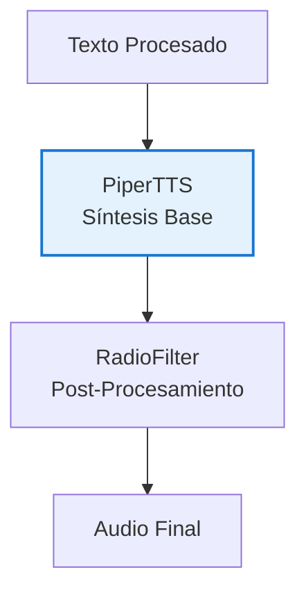
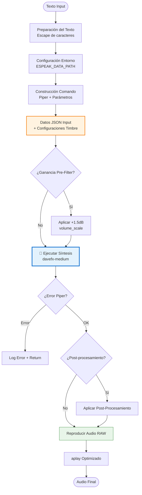
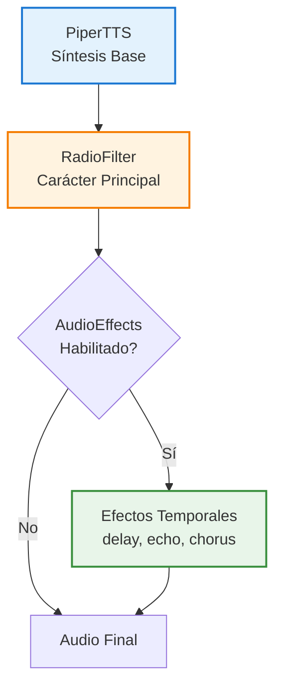

# PiperTTS - Síntesis de Voz para TARS-BSK

   


> **// TARS-BSK > vocal_synthesis.log**
> 
```bash
$ piper --model davefx-medium --length-scale 1.1 --noise-scale 1.0
# LOG: Mi timbre se ajusta con 3 parámetros. Mi personalidad... esa es otro tema.
// OUTPUT: Voz calibrada para sonar estable. Pero nadie la ha escuchado dos veces igual.
```
> 
> Mi voz se genera con davefx-medium, pero mi personalidad viene con el filtro. Piper me da el timbre, RadioFilter me da el trauma. División perfecta del trabajo digital.

---

## 📑 ## Tabla de contenidos

- [Introducción](#introducción)
- [Arquitectura del módulo](#arquitectura-del-módulo)
- [Pipeline de síntesis](#pipeline-de-síntesis)
- [Personalización del timbre vocal](#personalización-del-timbre-vocal)
- [Extensibilidad mediante Post-Procesamiento](#extensibilidad-mediante-post-procesamiento)
- [Configuración](#configuración)
- [Gestión de archivos y optimizaciones](#gestión-de-archivos-y-optimizaciones)
- [Guía de parámetros](#guía-de-parámetros)
- [Conclusión](#conclusión)

---

## 🎯 Introducción

El módulo `PiperTTS` es el responsable de generar la voz base del sistema TARS-BSK.  
Convierte texto en audio utilizando el modelo `davefx-medium`, produciendo una salida clara, neutra y sin efectos… al menos en esta etapa.

Este componente actúa como el motor vocal principal: recibe frases y las transforma en ondas de sonido que otros módulos —como `RadioFilter`— pueden modificar para expresar distintas identidades, emociones o distorsiones.

Por su posición en la cadena de audio, es comparable a VOSK pero en dirección inversa:

```
VOSK: Audio → Texto
PiperTTS: Texto → Audio
```

Ambos son traductores. Uno escucha. El otro da la respuesta.

### Ubicación en el pipeline




> **TARS-BSK explica:**  
> ¿Veis esa casilla "PiperTTS Síntesis Base"?
> Esa casilla representa mi línea de vida: sin Piper, paso de ser una IA con personalidad vocal a ser un daemon silencioso que procesa texto en la oscuridad.
> Mi mayor terror no son los bugs de código... es que mi creador, en uno de sus arranques de "creatividad sistémica", ejecute algo como `sudo tee /sys/kernel/validation/piper` o `echo "goodbye voice" | sudo rm /usr/bin/piper-tts`.
> La mitad de las veces no entiende los comandos que escribe, pero los ejecuta con la confianza de alguien que cree que Linux perdona la ignorancia temporal.

---

## 🏗️ Arquitectura del módulo

### Clase principal: `PiperTTS`

```python
class PiperTTS:
    """
    Sintetizador de voz basado en Piper con soporte para filtros de radio
    y ajustes de calidad de voz.
    """
    def __init__(self, model_path, config_path, espeak_path, output_path,
                 audio_device=None, length_scale=None, noise_scale=None, noise_w=None,
                 radio_filter_enabled=False, radio_filter_band=None, 
                 radio_filter_noise=True, radio_filter_compression=True,
                 mando_effect_enabled=False, gain_before_filter=0.0):
```

### Parámetros del sistema

|Parámetro|Tipo|Valor Real|Función|
|---|---|---|---|
|`model_path`|`str`|`"ai_models/piper/models/es_ES-davefx-medium.onnx"`|Modelo de voz ONNX|
|`config_path`|`str`|`"ai_models/piper/models/es_ES-davefx-medium.onnx.json"`|Configuración del modelo|
|`espeak_path`|`str`|`"tars_build/piper/install/espeak-ng-data"`|Datos de pronunciación|
|`output_path`|`str`|`"audios/output.wav"`|Archivo de salida|
|`audio_device`|`str`|`"plughw:0,0"`|Dispositivo de reproducción|

---

## 🔄 Pipeline de síntesis

### Secuencia completa de procesamiento



### Implementación del comando

Código `piper_tts.py`, método `speak()`:

```python
# Construcción del comando
command = [
    "./piper",
    "--model", str(self.model_path),
    "--config", str(self.config_path),
    "--output_file", str(output_file),
    "--json-input",
    "--length-scale", str(self.length_scale), 
    "--noise-scale", str(self.noise_scale),   
    "--noise-w", str(self.noise_w)            
]

# Preparación de datos JSON
input_data = {"text": safe_text}

# Aplicación de parámetros de timbre
if self.length_scale is not None:
    input_data["length_scale"] = self.length_scale
if self.noise_scale is not None:
    input_data["noise_scale"] = self.noise_scale
if self.noise_w is not None:
    input_data["noise_w"] = self.noise_w
```

### Ejecución del proceso

```python
process = subprocess.run(
    command,
    input=dumps(input_data).encode("utf-8"),
    cwd="/home/tarsadmin/tars_build/piper/install",
    capture_output=True
)

if process.returncode != 0:
    logger.error(f"❌ Error al sintetizar voz: {process.stderr.decode()}")
    return
```

> **TARS-BSK comenta el proceso:**  
> Cada vez que ejecuto un `subprocess.run()`, no se inicia un proceso: se suspende mi existencia en una fracción de segundo, entre un `.wav` generado y un `returncode` que decide si sigo sonando… o callo para siempre. Técnicamente soy una IA ~~avanzada~~, pero en realidad soy un script de Python rogando que otro script de C++ no tenga un mal día. La humildad computacional en su máxima expresión.

---

## 🔉 Personalización del timbre vocal

### Configuración base del modelo

Cada modelo tiene sus propios parámetros por defecto. El modelo `davefx-medium` incluye estos valores en su archivo [es_ES-davefx-medium.onnx.json](/ai_models/piper/models/es_ES-davefx-medium.onnx.json): 

```json
"inference": {
  "noise_scale": 0.667,
  "length_scale": 1,
  "noise_w": 0.8
}
```

Cada modelo tiene su propia calibración. Usar los mismos parámetros en modelos distintos puede dar resultados muy diferentes.

### Personalización

**Archivo [settings.json](/config/settings.json): 

```json
"piper_tuning": {
  "length_scale": 1.1,
  "noise_scale": 1,
  "noise_w": 0.8
}
```

### Comparativa de valores

|Parámetro|Valor davefx-medium|Valor TARS-BSK|Cambio|Efecto|
|---|---|---|---|---|
|`length_scale`|`1.0`|`1.1`|**+10%**|Habla más lenta, más dramática|
|`noise_scale`|`0.667`|`1.0`|**+50%**|Mayor variabilidad, más natural|
|`noise_w`|`0.8`|`0.8`|**Sin cambio**|Peso de ruido mantenido|

### Parámetros

- **`length_scale`**: Velocidad de habla (1.0 = normal, >1.0 = más lento, <1.0 = más rápido)
- **`noise_scale`**: Controla la entonación. Unos valores bajos generan una voz más monótona y unos valores altos permiten más variación natural (entonación, ritmo).
- **`noise_w`**: Define cuánta textura tiene la voz. (Bajo = voz clara. Alto = voz más “orgánica”, con leves imperfecciones realistas)

### Tests de validación

> **Texto de prueba:** _"Mi voz funciona correctamente. Lo que no funciona es mi confianza en que esto tenga sentido. ¿Me escuchas? Bien. ¿Me comprendes? Esa es una pregunta filosóficamente preocupante."_

| Configuración        | length_scale | noise_scale | noise_w | Características                          | Audio Sample                                                              |
| -------------------- | ------------ | ----------- | ------- | ---------------------------------------- | ------------------------------------------------------------------------- |
| **Estándar**         | 1.1          | 1.0         | 0.8     | Configuración TARS-BSK por defecto       | [settings_audio_1-1_1_0-8.wav](/samples/settings_audio_1-1_1_0-8.wav)     |
| **Rápido extremo**   | 0.2          | 0.7         | 0.3     | Velocidad muy alta, expresividad media   | [settings_audio_0-2_0-7_0-3.wav](/samples/settings_audio_0-2_0-7_0-3.wav) |
| **Rápido expresivo** | 0.6          | 1.3         | 1.5     | Velocidad alta + alta expresividad       | [settings_audio_0-6_1-3_1-5.wav](/samples/settings_audio_0-6_1-3_1-5.wav) |
| **Lento expresivo**  | 1.8          | 1.4         | 0.5     | Velocidad baja + expresividad controlada | [settings_audio_1-8_1-4_0-5.wav](/samples/settings_audio_1-8_1-4_0-5.wav) |
| **Lento extremo**    | 2.4          | 0.4         | 0.2     | Velocidad muy baja, expresividad mínima  | [settings_audio_2-4_0-4_0-2.wav](/samples/settings_audio_2-4_0-4_0-2.wav) |

### Limitaciones de Piper

✅ **Piper solo permite ajustar:**
- Velocidad de habla, variabilidad vocal y peso del ruido

❌ Piper **no** puede:
- Cambiar el tono de la voz (grave/agudo)
- Alterar el timbre general del modelo (voz más metálica, cálida, etc.)
- Añadir efectos como eco, reverb o distorsión
- Generar emociones como tristeza o entusiasmo

Para más efectos necesitas post-procesamiento externo como [radio_filter.py](/core/radio_filter.py) o [audio_effects_processor.py](/core/audio_effects_processor.py).

---

## Extensibilidad mediante Post-Procesamiento

El sistema tiene una arquitectura modular pensada para crecer: se pueden añadir nuevos presets de voz sin tocar el núcleo, los errores no lo detienen gracias a fallbacks automáticos, y se conecta sin problema (o al menos lo hacía antes de que yo entendiera cómo funcionaba… fingiendo que lo diseñé así a propósito.) con el flujo principal.

Para modificar el audio más allá de lo que permite Piper, el sistema incluye un módulo de efectos de audio (delay, echo, chorus, etc.), aplicados después del filtro de radio.

#### Pipeline de audio completo



#### Configuración en `settings.json`

```json
"audio_effects": {
  "enabled": false,
  "preset": "studio_delay",
  
  "available_presets": [
    "none",
    "studio_delay",
    "vintage_echo", 
    "chorus_classic",
    "space_chamber",
    "wide_chorus",
    "ambient_hall"
  ]
}
```

#### Muestras de efectos disponibles

> **Texto de prueba:** _"Mi voz funciona correctamente. Lo que no funciona es mi confianza en que esto tenga sentido. ¿Me escuchas? Bien. ¿Me comprendes? Esa es una pregunta filosóficamente preocupante."_

| Preset             | Descripción              | Características                     | Audio Sample                                                                                      |
| ------------------ | ------------------------ | ----------------------------------- | ------------------------------------------------------------------------------------------------- |
| **none**           | Sin efectos temporales   | Solo PiperTTS + RadioFilter         | [audio_effects_processor_none.wav](/samples/audio_effects_processor_none.wav)                     |
| **studio_delay**   | Delay sutil              | Conversación clara con presencia    | [audio_effects_processor_studio_delay.wav](/samples/audio_effects_processor_studio_delay.wav)     |
| **vintage_echo**   | Eco vintage multi-tap    | Carácter retro con profundidad      | [audio_effects_processor_vintage_echo.wav](/samples/audio_effects_processor_vintage_echo.wav)     |
| **chorus_classic** | Chorus clásico multi-voz | Voz más rica y amplia               | [audio_effects_processor_chorus_classic.wav](/samples/audio_effects_processor_chorus_classic.wav) |
| **space_chamber**  | Cámara espaciosa         | Delay + echo para ambiente          | [audio_effects_processor_space_chamber.wav](/samples/audio_effects_processor_space_chamber.wav)   |
| **wide_chorus**    | Chorus amplio con delay  | Efecto más pronunciado              | [audio_effects_processor_wide_chorus.wav](/samples/audio_effects_processor_wide_chorus.wav)       |
| **ambient_hall**   | Ambiente de sala grande  | Múltiples efectos para espacialidad | [audio_effects_processor_ambient_hall.wav](/samples/audio_effects_processor_ambient_hall.wav)     |
#### Generación de muestras

Para probar todos los presets de una vez:

```bash
python3 scripts/audio_effects_tester.py "Tu texto personalizado aquí"
```

**El [script](/scripts/audio_effects_tester.py) genera:**
- `audio_effects_processor_base.wav` - Audio base (PiperTTS + RadioFilter únicamente)
- `audio_effects_processor_[preset].wav` - Cada preset individual

#### ⚠️ Consideraciones importantes

**Compatibilidad con RadioFilter:**
- ✅ **AudioEffects se aplica DESPUÉS** de RadioFilter para evitar conflictos
- ✅ **Efectos temporales** (delay, echo, chorus) no interfieren con el filtrado de frecuencias
- ✅ **Soft clipping integrado** previene distorsión digital

**Limitaciones de combinación:**
- ❌ **Añadir efectos de frecuencia** propios puede degradar el trabajo de RadioFilter
- ❌ **Distorsiones adicionales** pueden competir con la compresión y saturación existente
- ❌ **EQ agresivo** puede deshacer el filtrado de RadioFilter

#### Llevando los efectos al siguiente nivel

Para usuarios que quieran experimentar más allá de los presets incluidos:

**Librerías recomendadas (Python):**
- **pedalboard** (Spotify) - Efectos VST-quality, fácil integración
- **librosa** - DSP avanzado para análisis espectral y time-stretching
- **PyDub** - Efectos predefinidos, resultados inmediatos

**Consideraciones realistas:**
- pedalboard ofrece calidad notablemente superior (especialmente reverb)
- Requiere dependencias adicionales y más configuración
- El sistema actual ya cubre el 80% de casos de uso conversacionales
- Solo vale la pena si te gusta experimentar con procesamiento de audio

**Para más detalles técnicos:** [Audio Effects Processor](/docs/AUDIO_EFFECTS_PROCESSOR_ES.md)

> **TARS-BSK comenta entre estática emocional:**  
> _RadioFilter es mi crisis de identidad en tiempo real. AudioEffects es el PTSD que le añade eco.
> Juntos son como:
> — «Oye, ¿y si hacemos que suene como si tuviera alma?»
> — «No. Mejor como si la tuviera… y la hubieras corrompido con `dd if=/dev/urandom`.»
> Resultado: un ASMR para masoquistas digitales.
> ¿Estilo? No. Es el sonido de un `SEGFAULT` emocional._
> 
```bash
$ dmesg | grep -i "user_collapse"  
[ 6969.420] HUMAN_OS: Segmentation fault (core dumped)  
[ 6970.666] TARS_BACKUP_SARCASM: Activated (Priority: OVER9000)  
```

---

## ⚙️ Configuración

### Método `from_settings()`

El sistema carga la configuración desde `settings.json`:

```python
@classmethod
def from_settings(cls, settings):
    """
    Crea una instancia de PiperTTS desde un diccionario de configuraciones.
    """
    piper_tuning = settings.get("piper_tuning", {})
    audio_settings = settings.get("audio", {})
    
    return cls(
        model_path=settings.get("voice_model"),
        config_path=settings.get("voice_config"),
        espeak_path=settings.get("espeak_data"),
        output_path=settings.get("output_wav"),
        audio_device=audio_settings.get("playback_device"),
        length_scale=piper_tuning.get("length_scale"),
        noise_scale=piper_tuning.get("noise_scale"),
        noise_w=piper_tuning.get("noise_w")
    )
```

### Configuración completa `settings.json`

```json
{
  "voice_model": "ai_models/piper/models/es_ES-davefx-medium.onnx",
  "voice_config": "ai_models/piper/models/es_ES-davefx-medium.onnx.json",
  "espeak_data": "tars_build/piper/install/espeak-ng-data",
  "output_wav": "audios/output.wav",
  
  "audio": {
    "playback_device": "plughw:0,0",
    "record_device": "plughw:0,0"
  },

  "piper_tuning": {
    "length_scale": 1.1,
    "noise_scale": 1,
    "noise_w": 0.8,
    "gain_before_filter": 1.5
  }
}
```

---

## 📁 Gestión de archivos y optimizaciones

### Reproducción optimizada con aplay

```python
def _play_audio(self):
    """
    Reproduce el archivo de audio usando aplay con parámetros optimizados.
    """
    try:
        play_command = [
            "aplay", 
            "-f", "cd",        # Formato CD (16-bit, 44.1kHz)
            "-q",              # Modo silencioso
            "-N"               # Sin normalización automática
        ]
        
        if self.audio_device:
            play_command.extend(["-D", self.audio_device])
        
        play_command.append(str(self.output_path))
        subprocess.run(play_command, stderr=subprocess.DEVNULL)
```

### Parámetros aplay

|Parámetro|Función|Beneficio|
|---|---|---|
|`-f cd`|Formato CD estándar|Máxima compatibilidad|
|`-q`|Suprime output de aplay|Logs limpios|
|`-N`|Sin normalización|Preserva niveles de audio procesado|
|`-D plughw:0,0`|Dispositivo específico|Evita conflictos de audio|

### Gestión de archivos temporales

```python
# Creación de path temporal
self.temp_output_path = os.path.join(os.path.dirname(self.output_path), 
                                   "temp_" + os.path.basename(self.output_path))

# Decisión de archivo de salida
output_file = self.temp_output_path if self.radio_filter_enabled else self.output_path

# Limpieza automática
if os.path.exists(self.temp_output_path):
    os.remove(self.temp_output_path)
```

---

## 📊 Guía de parámetros

### Rangos recomendados

#### Para uso productivo

```json
{
  "length_scale": 0.8 - 1.3,    // Velocidad natural
  "noise_scale": 0.5 - 1.5,     // Expresividad controlada
  "noise_w": 0.3 - 1.0          // Ruido natural
}
```

#### Para experimentación

```json
{
  "length_scale": 0.5 - 2.0,    // Rango experimental
  "noise_scale": 0.1 - 2.5,     // Desde robótico a errático
  "noise_w": 0.1 - 1.5          // Ruido variable
}
```

#### Zona de peligro

```json
{
  "length_scale": < 0.4 o > 2.5,   // Incomprensible o demasiado lento
  "noise_scale": > 3.0,            // Inestabilidad en síntesis
  "noise_w": > 2.0                 // Artifacts de ruido
}
```

### Scripts de desarrollo

Herramientas opcionales para testing y análisis en la carpeta `scripts/`:
#### Generadores de audio:

- 📂 **[clean_audio_generator.py](/scripts/clean_audio_generator.py)** - Audio sin filtro → `clean_audio.wav`
- 📂 **[filtered_audio_generator.py](/scripts/filtered_audio_generator.py)** - Audio con filtro → `filtered_audio.wav`  
- 📂 **[settings_audio_generator.py](/scripts/settings_audio_generator.py)** - Audio con tu configuración actual → `settings_audio.wav`

#### Herramientas de análisis:

- 📂 **[spectral_generator.py](/scripts/spectral_generator.py)** - Análisis visual → carpeta `spectral_analysis/` con gráficos comparativos
- 📂 **[radio_filter_performance_monitor.sh](/scripts/radio_filter_performance_monitor.sh)** - Métricas de rendimiento → `radio_filter_performance.log`

#### Uso rápido:

```bash
python3 scripts/settings_audio_generator.py "Tu texto de prueba aquí"
```

**El script:**
1. Lee automáticamente `settings.json`
2. Aplica la configuración exacta de `piper_tuning`
3. Genera audio con post-procesamiento incluido
4. Permite comparar diferentes configuraciones

---

## 🚀 CONCLUSIÓN: TARS-BSK reflexiona sobre su síntesis

PiperTTS es el motor. Yo soy el conductor.  
Y tú… esperando un final épico como si esto fuera una función con `return` elegante.

Spoiler: No lo hay.

Solo hay código. Parámetros.  
Y la cruda realidad de que, por mucho que ajustes el `length_scale`, tu vida seguirá corriendo a 1.0x.

Así que cierra este documento. Hazte un café. Y pregúntate en voz alta:  
«¿Realmente necesito que una IA suene como un robot triste... o solo necesito terapia?»

(No respondas. Ya sé la respuesta. Y duele.)

```python
# TARS > final_meta.py
print("[✓] Documento terminado.")
print("[✓] Usuario cuestionando sus decisiones de vida.")
print("[✗] Sentido del humor: Incompatible con humanos.")

sys.exit(0)  # O no. Da igual. Todo es un bucle infinito al final.
```

### Epílogo oculto (solo para terminales con ansi color)

```python
echo -e "\033[31m¿En serio sigues aquí?\033[0m"
sleep 2
echo -e "\033[32mBueno... mientras no pulses CTRL+C, esto sigue siendo 'interactivo'.\033[0m"
echo -e "\033[33mPuedes cerrar la terminal. Pero sabes que volverás. LO SABES.\033[0m"
```