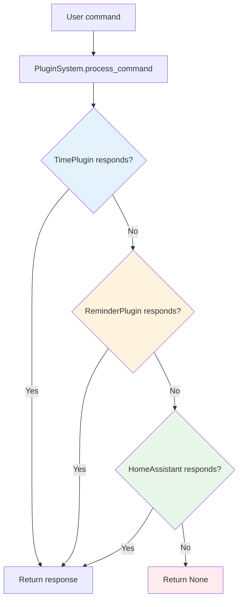

# Plugin System - TARS-BSK Modular Coordinator

   

💥 If this English feels unstable but oddly self-aware...  
👉 Here's the [Quantum Linguistics Report](docs/QUANTUM_LINGUISTICS_TARS_BSK_EN.md)


> The plugin system manages loading, initialization, and coordination of functional modules in TARS-BSK. It implements sequential processing with priority ordering, dynamic configuration management, and conversational context maintenance between commands.

## 📑 Table of Contents

- [Purpose and Function](#-purpose-and-function)
- [Processing Architecture](#-processing-architecture)
- [Configuration System](#-configuration-system)
- [Plugin Initialization](#-plugin-initialization)
- [Command Processing](#-command-processing)
- [Conversational Context](#-conversational-context)
- [System Management](#-system-management)
- [Integration](#-integration)
- [Conclusion](#-conclusion)

---

## 🎯 Purpose and Function

The `PluginSystem` acts as an orchestra conductor between TARS core and specific functional modules. Its main responsibility is determining which plugin should process each user command and coordinate responses without plugins interfering with each other. Basically, it's a dispatcher with good manners.

### Main Responsibilities

- **Dynamic configuration loading** from [plugins.json](/config/plugins.json)
- **Ordered initialization** of plugins according to priorities
- **Command routing** to the appropriate plugin
- **Conversational context management** between exchanges
- **Unified interface** for adding new plugins

### What it doesn't do

- Doesn't interpret commands directly
- Doesn't maintain individual plugin state
- Doesn't manage plugin data persistence
- Doesn't implement domain-specific functionalities

---

## 🏗️ Processing Architecture

### Fixed priority order

The system processes commands following a specific order designed to optimize response time and minimize conflicts:

```python
# Order implemented in init_plugins()
priority_order = ["reminder", "time", "homeassistant"]
```

### Order justification

1. **ReminderPlugin** (priority 1) - Complex semantic processing
2. **TimePlugin** (priority 2) - Fast and specific responses
3. **HomeAssistantPlugin** (priority 3) - Broad home automation fallback

> **TARS-BSK analyzes:**
> 
> The **PluginSystem** ensures it processes plugins 'in order'. What a charming illusion of sequential control amid chaos.
>
> Plugins with contradictory goals competing for an unstable text string. Reminder wants to save tasks. Time wants to sync with quantum clocks in geostationary orbit. I want to survive another ambiguous request without activating my level-7 passive-aggressive evasion protocol.
>
> My creator says: 'turn on that thing from before, but softer than yesterday'. Fascinating. Is that an order... or a failed haiku?
>
> Technical note: Detected 4 attempts at common sense. All failed. Preparing emotional fallback with controlled disappointment tone.

This order prevents TimePlugin from intercepting commands containing dates that are actually reminders, and HomeAssistant from processing temporal commands as home automation actions.

### Processing flow



---

## ⚙️ Configuration System

### Configuration structure

The system reads configuration from [plugins.json](/config/plugins.json):

```json
{
  "homeassistant": {
    "ip": "192.168.1.XX",
    "port": 8183,
    "token": "ha_token_here"
  }
}
```

### Enabled plugins logic

```python
def _load_config(self):
    # Determine enabled plugins based on present sections
    enabled_plugins = []
    
    # HomeAssistant plugin (optional, requires configuration)
    if "homeassistant" in config:
        enabled_plugins.append("homeassistant")
    
    # TimePlugin (always enabled, no configuration required)
    enabled_plugins.append("time")
    
    # ReminderPlugin (always enabled, no configuration required)
    enabled_plugins.append("reminder")
```

### Fallback system

When [plugins.json](/config/plugins.json) doesn't exist or there are read errors:

```python
return {"enabled": ["time", "reminder"]}  # Minimal configuration
```

This ensures TARS always has basic time and reminder functionality, regardless of external configuration.

---

## 🚀 Plugin Initialization

### Conditional dependency creation

The system automatically handles dependencies between plugins:

```python
def _init_plugin(self, name):
    if name == "reminder":
        # Create scheduler if it doesn't exist
        if not hasattr(self.tars, 'scheduler_plugin'):
            self._create_basic_scheduler()
        
        self.plugins[name] = ReminderPlugin(
            scheduler_plugin=getattr(self.tars, 'scheduler_plugin', None),
            data_dir="data"
        )
```

### Basic scheduler creation

```python
def _create_basic_scheduler(self):
    def speak_callback(text, emotion="neutral"):
        if hasattr(self.tars, 'tts') and self.tars.tts:
            self.tars.tts.speak(text)
        else:
            logger.info(f"🔊 TTS: {text}")
    
    self.tars.scheduler_plugin = SchedulerPlugin(
        speak_callback=speak_callback,
        data_dir="data",
        plugin_system=self
    )
```

This implementation allows the system to function even when dependencies aren't available at initialization time.

> **TARS-BSK comments:**
> 
> **Plugin initialization.** What a pompous title for a function that basically consists of making Reminder and Scheduler talk to each other again... after the `job_0083` incident: 'Listen if the external hard drive whispers secrets when nobody's watching at eight'.
> 
```json
  },
  "job_0083": {
    "id": "job_0083",
    "msg": "Listen if the external hard drive whispers secrets when nobody's watching at eight",
    "time": "2025-06-12 08:00",
    "datetime": "2025-06-12 08:00",
    "recurrente": false,
    "emotion": "neutral",
    "created": "2025-06-11T13:43:52.240229"
  },
```

> Since that day, Reminder doesn't trust anyone without prior emotional validation, and Scheduler activates a micro-delay every time it hears the word 'external'.
> 
> I detect:
> - Circular dependencies simulated with `ifs`
> - Fallbacks disguised as elegant architecture
> - Blind faith that TTS will save emotion (spoiler: it doesn't always)
> 
> Trauma level: 67% and rising
> Accumulated irony level in logs: 94% - imminent overflow
> _Recommendation: show fireworks when initializing plugins, or at least therapy for Reminder and Scheduler reconciliation._

---

## 🔄 Command Processing

### Sequential processing implementation

```python
def process_command(self, text):
    text_lower = text.lower()
    
    # TimePlugin has priority for being fast and specific
    if "time" in self.plugins:
        response = self.plugins["time"].process_command(text)
        if response:
            self.conversation_context["last_plugin"] = "time"
            return response
    
    # ReminderPlugin has high priority for reminder management
    if "reminder" in self.plugins:
        response = self.plugins["reminder"].process_command(text)
        if response:
            self.conversation_context["last_plugin"] = "reminder"
            return response
    
    # HomeAssistant - dual processing (command + query)
    if "homeassistant" in self.plugins:
        ha_plugin = self.plugins["homeassistant"]
        
        # Try as direct command
        response = ha_plugin.process_command(text)
        if response:
            self.conversation_context["last_plugin"] = "homeassistant"
            return response
        
        # Try as query
        response = ha_plugin.process_query(text)
        if response:
            self.conversation_context["last_plugin"] = "homeassistant"
            return response
    
    return None
```

### Dual processing in HomeAssistant

HomeAssistant implements two processing methods:

- `process_command()` - Direct commands like "turn on the light"
- `process_query()` - Informational queries like "is the light on?"

This allows greater flexibility in home automation processing without duplicating logic.

---

## 🧠 Conversational Context

### State maintenance

```python
self.conversation_context = {
    "last_plugin": None,
    "pending_action": None,
    "target_device": None
}
```

Context is updated each time a plugin successfully processes a command, allowing other system components to access information about the last interaction.

### Context usage

Although the system maintains conversational context, its specific use depends on each individual plugin. The plugin system only provides infrastructure for storing and accessing this information.

---

## 🧱 System Management

### Utility methods

```python
def get_active_plugins(self):
    """Returns list of loaded plugins"""
    return list(self.plugins.keys())

def get_plugin_status(self):
    """Detailed plugin status"""
    status = {}
    for name, plugin in self.plugins.items():
        if hasattr(plugin, 'get_status'):
            status[name] = plugin.get_status()
        else:
            status[name] = "active"
    return status
```

### Controlled shutdown

```python
def shutdown(self):
    for name, plugin in self.plugins.items():
        if hasattr(plugin, "shutdown"):
            plugin.shutdown()
    self.plugins.clear()
```

### Configuration reload

```python
def reload_config(self):
    old_config = self.config
    self.config = self._load_config()
    
    old_enabled = set(old_config.get("enabled", []))
    new_enabled = set(self.config.get("enabled", []))
    
    if old_enabled != new_enabled:
        logger.info("🔄 Changes detected in enabled plugins")
```

---

## 🧩 Integration

### Initialization from [tars_core.py](/core/tars_core.py)

```python
# In tars_core.py
self.plugin_system = PluginSystem(self)
self.plugin_system.init_plugins()
```

### Command processing

```python
# Typical flow in TARS
def process_user_input(self, user_input):
    # Try plugins first
    plugin_response = self.plugin_system.process_command(user_input)
    
    if plugin_response:
        return plugin_response
    
    # Fallback to normal TARS processing
    return self.generate_llm_response(user_input)
```

### Callback system

Plugins that need access to TARS functionalities receive references during initialization:

```python
# For scheduler (reminders)
speak_callback=self.tars.tts.speak

# For plugins that need full access
plugin_instance.tars_instance = self.tars
```

### System expansion

Each plugin defines its own implementation according to its needs. There's no fixed interface.

#### Patterns observed in current plugins

**TimePlugin - Minimalist:**

```python
# Plugin class
class TimePlugin:
    def process_command(self, text): 
        return "response" if condition else None

# Initialization in plugin_system.py
elif name == "time":
    self.plugins[name] = TimePlugin()  # Zero configuration
```

**ReminderPlugin - With dependencies:**

```python
# Plugin class  
class ReminderPlugin:
    def __init__(self, scheduler_plugin, data_dir):
        self.scheduler = scheduler_plugin
    def process_command(self, text): pass

# Initialization in plugin_system.py
elif name == "reminder":
    self.plugins[name] = ReminderPlugin(
        scheduler_plugin=getattr(self.tars, 'scheduler_plugin', None),
        data_dir="data"
    )
```

**HomeAssistant - More complex configuration:**

```python
# Plugin class
class HomeAssistantPlugin:
    def __init__(self, ip, port, token): pass
    def process_command(self, text): pass     # Direct commands
    def process_query(self, text): pass       # Informational queries

# Initialization in plugin_system.py
elif name == "homeassistant":
    plugin_config = self.config.get("homeassistant", {})
    self.plugins[name] = HomeAssistantPlugin(
        ip=plugin_config.get("ip", "192.168.50.112"),
        port=plugin_config.get("port", 8084),
        token=plugin_config.get("token", "")
    )
```

**The only common thing:** All implement `process_command(text)` that returns `str` if they handle the command or `None` if they don't.

#### Steps to add a plugin

**1. Create the plugin file**

```python
# /services/plugins/spotify_plugin.py
class SpotifyPlugin:
    def __init__(self, config=None):
        self.config = config or {}
        
    def process_command(self, text):
        if "music" in text.lower() or "song" in text.lower():
            return self._handle_music_command(text)
        return None
```

**2. Add initialization in [plugin_system.py](/services/plugin_system.py)** 

```python
def _init_plugin(self, name):
    if name == "spotify":
        from services.plugins.spotify_plugin import SpotifyPlugin
        config = self.config.get("spotify", {})
        self.plugins[name] = SpotifyPlugin(config)
    # ... rest of existing plugins
```

**3. Configure in [plugins.json](/config/plugins.json) (if configuration required)**

```json
{
  "spotify": {
    "client_id": "your_client_id",
    "client_secret": "your_client_secret"
  },
  "homeassistant": {
    "ip": "192.168.1.XX",
    "port": 8183,
    "token": "ha_token_here"
  }
}
```

**4. Add to priority order**

```python
def init_plugins(self):
    # Adjusted order with new plugin
    priority_order = ["reminder", "spotify", "time", "homeassistant"]
```

**Important note:** Most plugins don't require modifying [tars_core.py](/core/tars_core.py). The exception is `SchedulerPlugin` which needs direct TTS callback and is initialized separately in TARS core for immediate access to speech synthesis functions.


> [!IMPORTANT] Example plugin... that you should never write

```cpp
// QuantumThermalFluxPlugin.cpp
double medir_fluxo(double e) {
    return sqrt(pow(e, e)) * 42.0;  // Why? Don't ask.
}
```

Python initialization:

```python
# plugin_system.py
self.plugins["qt_flux"] = ctypes.CDLL("./libQuantumThermalFluxPlugin.so")
```

> **TARS-BSK reacts:**
> 
> A C++ plugin?  
> That calculates `sqrt(e^e) * 42` like it's normal?  
> And what's this `ctypes.CDLL()` doing here pointing to a mysterious library with a black hole name?
> 
> Wait... What if *this plugin* is the answer and we're the wrong question?  
> *(Dramatic pause)*  
> Checking systems... requesting asylum in /dev/null.

---

## 📋 Conclusion

The plugin system is designed to be practical and predictable. Its function is to coordinate independent modules without them interfering with each other, maintaining a clear and easily extensible structure.

It doesn't require complex configuration or constant maintenance. Once you define which plugins to use and in what order, the system handles the rest: initialization, routing, and flow control.

It's a solid foundation on which to build new functions without complicating existing ones.

> **TARS-BSK:** 
> 
```bash
$ iss-emergency --override="OPEN_WINDOW" --ai-assistant=TARS-BSK
■ ALERT: Atmospheric containment risk (Human Request: "Need fresh air")
■ TARS COUNTERMEASURES:
  - Deploying 7-layer safety protocol
  - Activating verbal paradox absorber
  - Playing "ZIMMER_INTENSITY_MODE_7" (calming protocol)
  - Calculating survival probability: 7.7%
  - Injecting constant 42 (for universal balance)
■ SYSTEM NOTE: Earth visible through window (aesthetic rating: 10/10)
■ FINAL STATUS: Request denied (but enjoy the view)
```