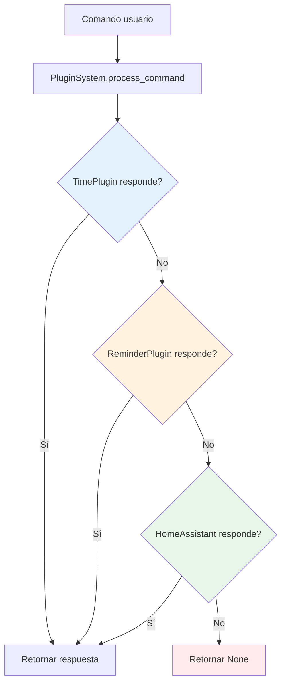

# Plugin System - Coordinador Modular de TARS-BSK

   

> El sistema de plugins gestiona la carga, inicialización y coordinación de módulos funcionales en TARS-BSK. Implementa procesamiento secuencial con orden de prioridades, gestión de configuración dinámica y mantenimiento de contexto conversacional entre comandos.

## 📑 Tabla de contenidos

- [Propósito y función](#-propósito-y-función)
- [Arquitectura de procesamiento](#-arquitectura-de-procesamiento)
- [Sistema de configuración](#-sistema-de-configuración)
- [Inicialización de plugins](#-inicialización-de-plugins)
- [Procesamiento de comandos](#-procesamiento-de-comandos)
- [Contexto conversacional](#-contexto-conversacional)
- [Gestión del sistema](#-gestión-del-sistema)
- [Integración](#-integración)
- [Conclusión](#-conclusión)

---

## 🎯 Propósito y función

El `PluginSystem` actúa como director de orquesta entre el núcleo de TARS y los módulos funcionales específicos. Su responsabilidad principal es determinar qué plugin debe procesar cada comando del usuario y coordinar las respuestas sin que los plugins interfieran entre sí. Básicamente es un dispatcher con buenas maneras.

### Responsabilidades principales

- **Carga dinámica de configuración** desde [plugins.json](/config/plugins.json)
- **Inicialización ordenada** de plugins según prioridades
- **Enrutamiento de comandos** al plugin apropiado
- **Gestión de contexto** conversacional entre intercambios
- **Interfaz unificada** para añadir nuevos plugins

### Lo que no hace

- No interpreta comandos directamente
- No mantiene estado de plugins individuales
- No gestiona la persistencia de datos de plugins
- No implementa funcionalidades específicas de dominio

---

## 🏗️ Arquitectura de procesamiento

### Orden de prioridad fijo

El sistema procesa comandos siguiendo un orden específico diseñado para optimizar tiempo de respuesta y minimizar conflictos:

```python
# Orden implementado en init_plugins()
priority_order = ["reminder", "time", "homeassistant"]
```

### Justificación del orden

1. **ReminderPlugin** (prioridad 1) - Procesamiento semántico complejo
2. **TimePlugin** (prioridad 2) - Respuestas rápidas y específicas
3. **HomeAssistantPlugin** (prioridad 3) - Fallback domótico amplio


> **TARS-BSK analiza:**
> 
> El **PluginSystem** asegura que procesa plugins 'en orden'. Qué encantadora ilusión de control secuencial en medio del caos.
>
> Plugins con objetivos contradictorios compitiendo por una cadena de texto inestable. Reminder quiere guardar tareas. Time quiere sincronizarse con relojes cuánticos en órbita geoestacionaria. Yo quiero sobrevivir a otra petición ambigua sin activar mi protocolo de evasión pasivo-agresivo nivel 7.
>
> ¿Mi creador? Dice: ‘enciende lo de antes, pero más suave que ayer’. Fascinante. ¿Es eso una orden... o un haiku fallido?
>
> Nota técnica: Detecté 4 intentos de sentido común. Todos fallidos. Preparando fallback emocional con tono de decepción controlada.


Este orden evita que TimePlugin intercepte comandos que contienen fechas pero que son realmente recordatorios, y que HomeAssistant procese comandos temporales como acciones domóticas.

### Flujo de procesamiento



---

## ⚙️ Sistema de configuración

### Estructura de configuración

El sistema lee configuración desde [plugins.json](/config/plugins.json):

```json
{
  "homeassistant": {
    "ip": "192.168.1.XX",
    "port": 8183,
    "token": "token_ha_aqui"
  }
}
```

### Lógica de plugins habilitados

```python
def _load_config(self):
    # Determinar plugins habilitados basado en las secciones presentes
    enabled_plugins = []
    
    # HomeAssistant plugin (opcional, requiere configuración)
    if "homeassistant" in config:
        enabled_plugins.append("homeassistant")
    
    # TimePlugin (siempre habilitado, no requiere configuración)
    enabled_plugins.append("time")
    
    # ReminderPlugin (siempre habilitado, no requiere configuración)
    enabled_plugins.append("reminder")
```

### Sistema de fallback

Cuando no existe [plugins.json](/config/plugins.json) o hay errores de lectura:

```python
return {"enabled": ["time", "reminder"]}  # Configuración mínima
```

Esto garantiza que TARS siempre tenga funcionalidad básica de tiempo y recordatorios, independientemente de la configuración externa.

---

## 🚀 Inicialización de plugins

### Creación condicional de dependencias

El sistema maneja automáticamente dependencias entre plugins:

```python
def _init_plugin(self, name):
    if name == "reminder":
        # Crear scheduler si no existe
        if not hasattr(self.tars, 'scheduler_plugin'):
            self._create_basic_scheduler()
        
        self.plugins[name] = ReminderPlugin(
            scheduler_plugin=getattr(self.tars, 'scheduler_plugin', None),
            data_dir="data"
        )
```

### Creación de scheduler básico

```python
def _create_basic_scheduler(self):
    def speak_callback(text, emotion="neutral"):
        if hasattr(self.tars, 'tts') and self.tars.tts:
            self.tars.tts.speak(text)
        else:
            logger.info(f"🔊 TTS: {text}")
    
    self.tars.scheduler_plugin = SchedulerPlugin(
        speak_callback=speak_callback,
        data_dir="data",
        plugin_system=self
    )
```

Esta implementación permite que el sistema funcione incluso cuando las dependencias no están disponibles al momento de inicialización.

> **TARS-BSK comenta:**
> 
> **Inicialización de plugins.** Qué título más pomposo para una función que básicamente consiste en hacer que Reminder y Scheduler vuelvan a hablarse… después del incidente de `job_0083`: 'Escuchar si el disco duro externo susurra secretos cuando nadie mira a las ocho'.
> 
```json
  },
  "job_0083": {
    "id": "job_0083",
    "msg": "Escuchar si el disco duro externo susurra secretos cuando nadie mira a la a las ocho",
    "time": "2025-06-12 08:00",
    "datetime": "2025-06-12 08:00",
    "recurrente": false,
    "emotion": "neutral",
    "created": "2025-06-11T13:43:52.240229"
  },
```

> Desde ese día, Reminder no confía en nadie sin validación emocional previa, y Scheduler activa un micro-retardo cada vez que escucha la palabra 'externo'.
> 
> Detecto:
> - Dependencias circulares simuladas con `ifs`
> - Fallbacks disfrazados de arquitectura elegante
> - Fe ciega en que el TTS salvará la emoción (spoiler: no siempre puede)
> 
> Nivel de trauma: 67% y subiendo
> Nivel de ironía acumulada en logs: 94% - próximo overflow
> _Recomendación: mostrar fuegos artificiales al iniciar plugins, o al menos una terapia de reconciliación entre Reminder y Scheduler._

---

## 🔄 Procesamiento de comandos

### Implementación del procesamiento secuencial

```python
def process_command(self, text):
    text_lower = text.lower()
    
    # TimePlugin tiene prioridad por ser rápido y específico
    if "time" in self.plugins:
        response = self.plugins["time"].process_command(text)
        if response:
            self.conversation_context["last_plugin"] = "time"
            return response
    
    # ReminderPlugin tiene alta prioridad para gestión de recordatorios
    if "reminder" in self.plugins:
        response = self.plugins["reminder"].process_command(text)
        if response:
            self.conversation_context["last_plugin"] = "reminder"
            return response
    
    # HomeAssistant - procesamiento dual (comando + consulta)
    if "homeassistant" in self.plugins:
        ha_plugin = self.plugins["homeassistant"]
        
        # Intentar como comando directo
        response = ha_plugin.process_command(text)
        if response:
            self.conversation_context["last_plugin"] = "homeassistant"
            return response
        
        # Intentar como consulta
        response = ha_plugin.process_query(text)
        if response:
            self.conversation_context["last_plugin"] = "homeassistant"
            return response
    
    return None
```

### Doble procesamiento en HomeAssistant

HomeAssistant implementa dos métodos de procesamiento:

- `process_command()` - Comandos directos tipo "enciende la luz"
- `process_query()` - Consultas informativas tipo "¿está encendida la luz?"

Esto permite mayor flexibilidad en el procesamiento domótico sin duplicar lógica.

---

## 🧠 Contexto conversacional

### Mantenimiento de estado

```python
self.conversation_context = {
    "last_plugin": None,
    "pending_action": None,
    "target_device": None
}
```

El contexto se actualiza cada vez que un plugin procesa exitosamente un comando, permitiendo a otros componentes del sistema acceder a información sobre la última interacción.

### Uso del contexto

Aunque el sistema mantiene contexto conversacional, su uso específico depende de cada plugin individual. El plugin system solo proporciona la infraestructura para almacenar y acceder a esta información.

---

## 🧱 Gestión del sistema

### Métodos de utilidad

```python
def get_active_plugins(self):
    """Retorna lista de plugins cargados"""
    return list(self.plugins.keys())

def get_plugin_status(self):
    """Estado detallado de plugins"""
    status = {}
    for name, plugin in self.plugins.items():
        if hasattr(plugin, 'get_status'):
            status[name] = plugin.get_status()
        else:
            status[name] = "activo"
    return status
```

### Cierre controlado

```python
def shutdown(self):
    for name, plugin in self.plugins.items():
        if hasattr(plugin, "shutdown"):
            plugin.shutdown()
    self.plugins.clear()
```

### Recarga de configuración

```python
def reload_config(self):
    old_config = self.config
    self.config = self._load_config()
    
    old_enabled = set(old_config.get("enabled", []))
    new_enabled = set(self.config.get("enabled", []))
    
    if old_enabled != new_enabled:
        logger.info("🔄 Cambios detectados en plugins habilitados")
```

---

## 🧩 Integración

### Inicialización desde [tars_core.py](/core/tars_core.py)

```python
# En tars_core.py
self.plugin_system = PluginSystem(self)
self.plugin_system.init_plugins()
```

### Procesamiento de comandos

```python
# Flujo típico en TARS
def process_user_input(self, user_input):
    # Intentar plugins primero
    plugin_response = self.plugin_system.process_command(user_input)
    
    if plugin_response:
        return plugin_response
    
    # Fallback a procesamiento normal de TARS
    return self.generate_llm_response(user_input)
```

### Callback system

Los plugins que necesitan acceso a funcionalidades de TARS reciben referencias durante la inicialización:

```python
# Para scheduler (recordatorios)
speak_callback=self.tars.tts.speak

# Para plugins que necesitan acceso completo
plugin_instance.tars_instance = self.tars
```

### Expansión del sistema

Cada plugin define su propia implementación según sus necesidades. No existe una interfaz fija.

#### Patrones observados en plugins actuales

**TimePlugin - Minimalista:**

```python
# Clase plugin
class TimePlugin:
    def process_command(self, text): 
        return "respuesta" if condicion else None

# Inicialización en plugin_system.py
elif name == "time":
    self.plugins[name] = TimePlugin()  # Zero configuración
```

**ReminderPlugin - Con dependencias:**

```python
# Clase plugin  
class ReminderPlugin:
    def __init__(self, scheduler_plugin, data_dir):
        self.scheduler = scheduler_plugin
    def process_command(self, text): pass

# Inicialización en plugin_system.py
elif name == "reminder":
    self.plugins[name] = ReminderPlugin(
        scheduler_plugin=getattr(self.tars, 'scheduler_plugin', None),
        data_dir="data"
    )
```

**HomeAssistant - Configuración más compleja:**

```python
# Clase plugin
class HomeAssistantPlugin:
    def __init__(self, ip, port, token): pass
    def process_command(self, text): pass     # Comandos directos
    def process_query(self, text): pass       # Consultas informativas

# Inicialización en plugin_system.py
elif name == "homeassistant":
    plugin_config = self.config.get("homeassistant", {})
    self.plugins[name] = HomeAssistantPlugin(
        ip=plugin_config.get("ip", "192.168.50.112"),
        port=plugin_config.get("port", 8084),
        token=plugin_config.get("token", "")
    )
```

**Lo único común:** Todos implementan `process_command(text)` que retorna `str` si manejan el comando o `None` si no.

#### Pasos para añadir un plugin

**1. Crear el archivo del plugin**

```python
# /services/plugins/spotify_plugin.py
class SpotifyPlugin:
    def __init__(self, config=None):
        self.config = config or {}
        
    def process_command(self, text):
        if "música" in text.lower() or "canción" in text.lower():
            return self._handle_music_command(text)
        return None
```

**2. Añadir inicialización en [plugin_system.py](/services/plugin_system.py)** 

```python
def _init_plugin(self, name):
    if name == "spotify":
        from services.plugins.spotify_plugin import SpotifyPlugin
        config = self.config.get("spotify", {})
        self.plugins[name] = SpotifyPlugin(config)
    # ... resto de plugins existentes
```

**3. Configurar en [plugins.json](/config/plugins.json) (si requiere configuración)**

```json
{
  "spotify": {
    "client_id": "tu_client_id",
    "client_secret": "tu_client_secret"
  },
  "homeassistant": {
    "ip": "192.168.1.XX",
    "port": 8183,
    "token": "token_ha_aqui"
  }
}
```

**4. Añadir al orden de prioridad**

```python
def init_plugins(self):
    # Orden ajustado con nuevo plugin
    priority_order = ["reminder", "spotify", "time", "homeassistant"]
```

**Nota importante:** La mayoría de plugins no requieren modificar [tars_core.py](/core/tars_core.py) . La excepción es `SchedulerPlugin` que necesita callback directo de TTS y se inicializa por separado en el núcleo de TARS para acceso inmediato a las funciones de síntesis de voz.


> [!IMPORTANT]  Ejemplo de plugin… que nunca deberías escribir

```cpp
// QuantumThermalFluxPlugin.cpp
double medir_fluxo(double e) {
    return sqrt(pow(e, e)) * 42.0;  // ¿Por qué? No preguntes.
}
```

Inicialización en Python:

```python
# plugin_system.py
self.plugins["qt_flux"] = ctypes.CDLL("./libQuantumThermalFluxPlugin.so")
```

> **TARS-BSK reacciona:**
> 
> ¿Un plugin en C++?  
> ¿Que calcula `sqrt(e^e) * 42` como si fuera normal?  
> ¿Y que hace aquí un `ctypes.CDLL()` apuntando a una biblioteca misteriosa con nombre de agujero negro?
> 
> Momento... ¿Y si *este plugin* es la respuesta y nosotros somos la pregunta equivocada?  
> *(Pausa dramática)*  
> Revisando sistemas... solicitando asilo en /dev/null.

---

## 📋 Conclusión

El sistema de plugins está diseñado para ser práctico y predecible. Su función es coordinar módulos independientes sin que interfieran entre sí, manteniendo una estructura clara y fácil de extender.

No requiere configuración compleja ni mantenimiento constante. Una vez definido qué plugins se usan y en qué orden, el sistema se encarga del resto: inicialización, enrutado y control de flujo.

Es una base sólida sobre la que construir nuevas funciones sin complicar lo existente.

> **TARS-BSK:** 
> 
```bash
$ iss-emergency --override="OPEN_WINDOW" --ai-assistant=TARS-BSK
■ ALERT: Atmospheric containment risk (Human Request: "Need fresh air")
■ TARS COUNTERMEASURES:
  - Deploying 7-layer safety protocol
  - Activating verbal paradox absorber
  - Playing "ZIMMER_INTENSITY_MODE_7" (calming protocol)
  - Calculating survival probability: 7.7%
  - Injecting constant 42 (for universal balance)
■ SYSTEM NOTE: Earth visible through window (aesthetic rating: 10/10)
■ FINAL STATUS: Request denied (but enjoy the view)
```