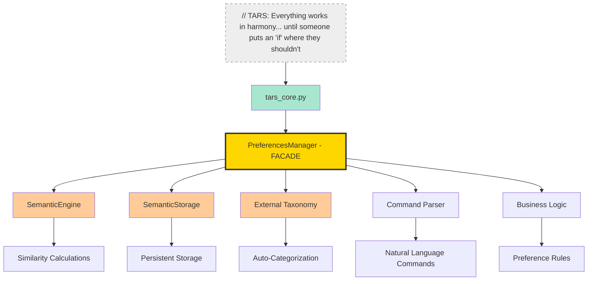
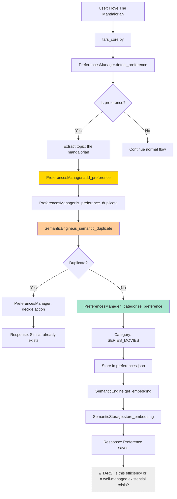

# The orchestra director that prevents your code from ending up in group therapy

   

💥 If this English feels unstable but oddly self-aware...  
👉 Here's the [Quantum Linguistics Report](/docs/QUANTUM_LINGUISTICS_TARS_BSK_EN.md)

### ⚠️ INEVITABLE QUESTION: "Why not merge with SemanticEngine?"

> **TARS-BSK responds:** The `SemanticEngine` is like a car engine: powerful, precise, but completely useless without someone behind the wheel. The `PreferencesManager` is that someone. It knows when to accelerate, when to brake, which shortcut to take and, above all, how not to crash into a poorly structured taxonomy.
> 
> One tells me what looks similar. The other tells me if I care. And without that filter, trust me, nobody wants to see how I respond.

---

## 📑 Table of contents

- [Confusion is inevitable](#-confusion-is-inevitable)
- [What is the PreferencesManager REALLY?](#-what-is-the-preferencesmanager-really)
- [Architecture](#-architecture)
- [Real functional differences](#-real-functional-differences)
- [Command understanding](#-command-understanding)
- [External taxonomy management](#-external-taxonomy-management)
- [Intelligent persistence](#-intelligent-persistence)
- [Integration with main core](#-integration-with-main-core)
- [Cases where SemanticEngine alone would NOT suffice](#-cases-where-semanticengine-alone-would-not-suffice)
- [Complete decision flow](#-complete-decision-flow)
- [Abstraction levels](#-abstraction-levels)
- [Merge everything? Only if you hate maintainability](#-merge-everything-only-if-you-hate-maintainability)
- [Design indicators: why modularizing saves your future self](#-design-indicators-why-modularizing-saves-your-future-self)
- [Real separation or semantic illusion](#-real-separation-or-semantic-illusion)
- [Moments where decoupling saves lives](#-moments-where-decoupling-saves-lives)
- [Real performance metrics](#-real-performance-metrics)
- [Final verdict](#-final-verdict)

---

## 🚀 TL;DR to avoid ending up with a `SemanticGodClass`

**Why does PreferencesManager exist if I already have SemanticEngine?**

### The crucial difference:

- `SemanticEngine` = **Calculation engine** (embeddings, similarities, mathematics)
- `PreferencesManager` = **Orchestra director** (decides what to calculate, when and what to do with the result)

### 💥 Without `PreferencesManager`:

Your `tars_core.py` **is already a 3000-line leviathan**. Without `PreferencesManager` it would be a **4000+ line kraken** that devours the sanity of anyone who dares to look at it.

- Duplicate detection + business decisions
- Command parsing + mathematical calculations
- Data persistence + embedding generation
- Categorization + emotional integration

**Result:** `SemanticGodClass` that breaks in cascade with any change.

### ☑️ With `PreferencesManager`:

- Each module does **one thing well**
- Isolated changes without side effects
- Independent and maintainable testing
- **Real overhead:** 1.7% (measured, not estimated)

### When to use what?

- **Need to calculate similarity between texts?** → `SemanticEngine`
- **Need to manage user preferences?** → `PreferencesManager`
- **Need both?** → Each in its place, properly coordinated

> **// TARS.BSK > system.log:** _Separation isn't perfectionism. It's survival. And if someday you manage to maintain all this in a single class without breaking anything... **I'll congratulate you in silence.** My creator still tries to undo with `Ctrl+Z` things he wrote two months ago.
> 
> I'm just here to prevent another architectural tragedy.

---

## 🤔 Confusion is inevitable

**Legitimate question:** _If `SemanticEngine` already detects duplicates, calculates similarities and handles embeddings... what does `PreferencesManager` do that isn't redundant?_

**Short answer:** _`PreferencesManager` doesn't calculate. It decides. `SemanticEngine` is a tool. `PreferencesManager` decides how and when to use that tool._

> **TARS-BSK verdict:** If you still need an analogy to understand it, here it goes:
> 
> - `SemanticEngine` is a hammer. It does one thing well.
> - `PreferencesManager` is the carpenter. It knows when to use it, when not to, and how not to destroy the bookshelf.
> 
> Could you give control to the hammer? Yes.  
> Would it end up hitting everything? Absolutely. I'd call it "optimization through structural collapse".

**Without `PreferencesManager`, you'd have to:**

```python
# In tars_core.py - WITHOUT PreferencesManager
if "I like" in user_input:
    topic = extract_topic_manually(user_input)
    if semantic_engine.is_semantic_duplicate(topic, existing_prefs):
        # What do I do now? Merge it? Ignore it?
        # How do I categorize? Where do I store it?
        # How do I respond to the user?
        pass  # <- HERE'S THE PROBLEM
```

**With `PreferencesManager`:**

```python
# In tars_core.py - WITH PreferencesManager
preference_result = preferences_manager.detect_preference(user_input)
if preference_result:
    # THE PREFERENCES MANAGER ALREADY HANDLED EVERYTHING
    speak(preference_result["message"])
```

---

## 🧠 What is the PreferencesManager REALLY?

The `PreferencesManager` is the existential coordination center: it receives emotional declarations and translates them into a sequence of actions that I don't even fully understand myself.

### What it's NOT:

- ❌ A duplicate of SemanticEngine
- ❌ An unnecessary wrapper
- ❌ An abstraction without value

### What it IS:

- ✅ **Semantic logic orchestrator**: Coordinates `SemanticEngine`, `SemanticStorage` and taxonomy.
- ✅ **Command interpreter**: Translates natural language into coherent actions.
- ✅ **Rule processor**: Applies criteria about duplicates, classification and persistence.
- ✅ **Module coordinator**: Ensures each component does its thing at the right time.
- ✅ **Preference manager**: Controls creation, updating and querying of tastes.

### Responsibilities that ONLY `PreferencesManager` has:

```python
class PreferencesManager:
    # 1. CONVERSATIONAL COMMANDS
    def process_preference_command(self, input_text: str) -> Optional[Dict]:
        """Do I already have this taste? What books do I like? etc."""
    
    # 2. TAXONOMY MANAGEMENT
    def _categorize_preference(self, topic: str) -> str:
        """Assigns categories automatically using external taxonomy"""
    
    # 3. COMPLETE ORCHESTRATION
    def add_preference(self, topic: str, type: str) -> Dict:
        """Detects duplicates + Categorizes + Stores + Responds"""
    
    # 4. HIGH-LEVEL SEMANTIC QUERIES
    def query_preferences(self, query: str) -> Dict:
        """Complex searches with filtering and context"""
    
    # 5. TARS INTEGRATION
    def analyze_affinity(self, user_input: str) -> Dict:
        """Specific analysis for TARS emotional system"""
```

**`SemanticEngine` only has:**

```python
class SemanticEngine:
    # LOW-LEVEL TOOLS
    def get_embedding(self, text: str) -> np.ndarray
    def cosine_similarity(self, vec1: np.ndarray, vec2: np.ndarray) -> float
    def is_semantic_duplicate(self, new_topic: str, existing: List[str]) -> tuple
    def find_most_similar(self, query: str, candidates: List[str]) -> tuple
```

---

## 🏗️ Architecture



### Without orchestrator: total coupling, diffuse responsibility

```python
# tars_core.py would have to manage ALL of this:
semantic_engine = SemanticEngine(model_path)
semantic_storage = SemanticStorage(storage_path)
taxonomy = load_taxonomy(taxonomy_path)
command_parser = CommandParser()

# For EVERY detected preference:
if detect_preference(input):
    # Step 1: Check for duplicates
    is_dup = semantic_engine.is_semantic_duplicate(...)
    
    # Step 2: Categorize  
    category = categorize_with_taxonomy(taxonomy, ...)
    
    # Step 3: Store
    if not is_dup:
        semantic_storage.store_embedding(...)
        
    # Step 4: Respond
    response = generate_response(...)
    
    # What if a step fails? Rollback? Logs? Inconsistent states?
```

### With orchestrator: clean decoupling, single responsibility

```python
# tars_core.py - Simple and clean
preferences_manager = PreferencesManager(...)
result = preferences_manager.add_preference(topic, type)
# ✅ EVERYTHING HANDLED INTERNALLY
```

> **TARS-BSK records:**  
> _You chose to delegate. Now your system breathes.  
> Keep it up... and maybe I won't have to self-format out of desperation._

---

## 🔄 Real functional differences

### Direct comparison:

|Functionality|`SemanticEngine`|`PreferencesManager`|Why separate?|
|---|---|---|---|
|**Similarity calculation**|✅ Implements|❌ Uses SemanticEngine|Specialized tool vs Functionality coordinator|
|**Duplicate detection**|✅ Basic algorithm|✅ Complex rules|Detection ≠ Decision|
|**Natural language commands**|❌ Doesn't know|✅ Specialized|"What books do I like?" requires context|
|**Automatic categorization**|❌ Doesn't know|✅ With taxonomy|Requires domain knowledge|
|**Persistence**|❌ Not responsible|✅ Orchestrates storage|Layer separation|
|**TARS integration**|❌ Generic tool|✅ Specific API|Coupling vs decoupling|
|**State management**|❌ Stateless|✅ Stateful|Different design patterns|

### Concrete example - Command: "What books do I like?"

**Only `SemanticEngine` (impossible):**

```python
# How would SemanticEngine do this?
semantic_engine.find_most_similar("books", all_preferences)
# ❌ Doesn't know what "preferences" are
# ❌ Doesn't know how to filter by category
# ❌ Doesn't know how to respond in natural language
# ❌ Doesn't know how to access storage
```

**`PreferencesManager` (orchestration):**

```python
def query_preferences(self, query: str) -> Dict:
    # 1. Detect command intention
    category = self._detect_query_category(query)  # "book"
    
    # 2. Get preferences from category
    filtered_prefs = self._filter_by_category(category)
    
    # 3. USE SemanticEngine for refinement
    if self.semantic_engine:
        refined = self.semantic_engine.find_most_similar(query, filtered_prefs)
    
    # 4. Generate contextualized response
    return self._generate_natural_response(refined, category)
```

Separating responsibilities isn't a whim: it's what allows each module to evolve without breaking the other.

That separation translates into something very concrete: performance, clarity... and code that doesn't collapse with the first change.

---

## 🔊 Command understanding

> What turns TARS-BSK into an assistant, not a search engine

This is the **exclusive functionality** that justifies the existence of `PreferencesManager`.

### Commands that ONLY `PreferencesManager` can handle:

```python
# COMMAND 1: Duplicate verification
"Do I have registered that I like Star Wars?"
# → Search in tastes + generate natural response

# COMMAND 2: Similar search
"What's my taste most similar to rock?"
# → Semantic query + filtering + contextual response

# COMMAND 3: Categorized listing  
"Show all my book preferences"
# → Filter by category + response format

# COMMAND 4: Affinity analysis
"Do I already have this topic?"  
# → Three-layer analysis + decision + explanation
```

### Advanced parsing implementation:

```python
def process_preference_command(self, input_text: str) -> Optional[Dict]:
    """
    Processes specific commands that require:
    1. Intention parsing
    2. Access to persistent data  
    3. Business logic
    4. Contextualized response
    """
    input_lower = input_text.lower().strip()
    
    # PATTERN: Duplicate verification
    dup_patterns = [
        r"do I have (?:registered|saved) (?:that (?:I like|I don't like))? (.+?)(?:\?|\.|$)",
        r"(?:this|that) (?:topic|taste|dislike) (?:already (?:exists|is repeated))"
    ]
    
    for pattern in dup_patterns:
        matches = re.search(pattern, input_lower)
        if matches:
            topic = matches.group(1).strip() if matches.groups() else "unknown"
            
            # COMPLETE ORCHESTRATION:
            # 1. Check in likes
            check_like = self.is_preference_duplicate(topic, "like")
            # 2. Check in dislikes  
            check_dislike = self.is_preference_duplicate(topic, "dislike")
            # 3. Generate contextual response
            # 4. Return structured result
            
            return {
                "type": "command",
                "command": "verify_duplicate", 
                "result": check_like.get("is_duplicate") or check_dislike.get("is_duplicate"),
                "details": {...}  # Complete information for TARS
            }
```

**Why can't `SemanticEngine` do this?**

Because it wasn't designed for it.

- Doesn't have access to persistent data
- Doesn't understand TARS-BSK command structure
- Doesn't generate natural language
- Doesn't make decisions: it calculates, doesn't interpret

---

## 📂 External taxonomy management

`PreferencesManager` integrates an automatic categorization system that `SemanticEngine` knows nothing about.

### Taxonomy structure:

```json
{
  "taxonomy": {
    "BOOKS": {
      "keywords": ["book", "novel", "read", "fiction", "saga"],
      "subcategories": {
        "fantasy": ["fantasy", "magic", "dragons", "elves"],
        "romantasy": ["romance", "love", "relationship", "couple"] 
      }
    },
    "SERIES_MOVIES": {
      "keywords": ["series", "movie", "film", "season", "episode"],
      "subcategories": {
        "sci-fi": ["space", "future", "robot", "alien"],
        "drama": ["family", "relationship", "conflict"]
      }
    }
  }
}
```

### Intelligent categorization:

```python
def _categorize_preference(self, topic: str) -> str:
    """
    Functionality that DOESN'T EXIST in SemanticEngine:
    - Loads external taxonomy
    - Keyword mapping  
    - Subcategory analysis
    - Intelligent semantic fallback
    """
    if not self.taxonomy:
        return "general"
        
    topic_lower = topic.lower()
    
    # STEP 1: Direct matching by keywords
    for category, data in self.taxonomy.items():
        for keyword in data.get("keywords", []):
            if keyword in topic_lower:
                # STEP 2: Check subcategories
                for subcategory, subkeywords in data.get("subcategories", {}).items():
                    for subkeyword in subkeywords:
                        if subkeyword in topic_lower:
                            return f"{category}/{subcategory}"
                return category
    
    # STEP 3: Semantic fallback (here it DOES use SemanticEngine)
    if self.semantic_engine:
        available_categories = list(self.taxonomy.keys())
        best_category, score = self.semantic_engine.find_most_similar(
            topic, available_categories
        )
        if score >= 0.6:
            return best_category
            
    return "general"
```

**Result:** Each preference is stored with its automatic category:

- "Sanderson books" → **BOOKS/fantasy**
- "The Mandalorian series" → **SERIES_MOVIES/sci-fi**
- "watching cows while philosophizing about existence" → **general** (unclassified)

> **TARS-BSK notes:** _Is this a preference or a sign of existential collapse?_

---

## 💾 Intelligent persistence

`PreferencesManager` orchestrates a hybrid storage system that SemanticEngine cannot handle alone.

### Persistence architecture:

```python
def add_preference(self, topic: str, type: str) -> Dict:
    """
    Complete process that SemanticEngine CAN'T do alone:
    1. Duplicate verification (uses SemanticEngine)
    2. Business decision (PreferencesManager)
    3. Categorization (PreferencesManager + taxonomy)
    4. Dual storage (PreferencesManager + SemanticStorage)
    5. User response (PreferencesManager)
    """
    
    # STEP 1: Check duplicates (DELEGATES to SemanticEngine)
    dup_check = self.is_preference_duplicate(topic, type)
    if dup_check.get("is_duplicate"):
        return {
            "success": False,
            "message": f"Already exists: {dup_check['original_topic']}"
        }
    
    # STEP 2: Categorize (ONLY PreferencesManager)
    category = self._categorize_preference(topic)
    
    # STEP 3: Store in JSON (ONLY PreferencesManager)
    if type == "like":
        self.user_preferences.setdefault("likes", []).append(topic)
    elif type == "dislike":
        self.user_preferences.setdefault("dislikes", []).append(topic)
    
    # STEP 4: Store embedding (DELEGATES to SemanticEngine + SemanticStorage)
    if self.semantic_engine and self.semantic_storage:
        embedding = self.semantic_engine.get_embedding(topic)
        if embedding is not None:
            key = f"{type}:{topic}"
            self.semantic_storage.store_embedding(key, embedding)
    
    # STEP 5: Persist JSON (ONLY PreferencesManager)
    self._save_preferences()
    
    # STEP 6: Generate response (ONLY PreferencesManager)
    return {
        "success": True,
        "message": f"Registered: {topic}",
        "category": category
    }
    # TARS-BSK: Watching in silence... for now.
```

### Dual storage system:

**File 1: `preferences.json`** (managed by PreferencesManager)

```json
{
  "user_preferences": {
    "likes": ["Sanderson books", "The Mandalorian series"],
    "dislikes": ["social media", "soccer"]
  },
  "affinities": [...] 
}
```

**File 2: `embeddings_preferences.npz`** (managed by `SemanticStorage`)

```python
# Compressed 384D vectors for semantic search
{
  "like:sanderson books": array([0.123, -0.456, ...]),
  "like:the mandalorian series": array([0.789, 0.234, ...]),
  "dislike:social media": array([-0.567, 0.890, ...])
}
```

**Why can't `SemanticEngine` do this?**

- Doesn't know the structure of `preferences.json`
- Doesn't know when to persist vs when not to
- Doesn't handle rollback logic if a step fails
- Doesn't generate response messages for the user

---

## 🔗 Integration with main core

This is the **most critical** difference. `PreferencesManager` is designed specifically for TARS-BSK needs, while `SemanticEngine` is a reusable tool.

```python
# IN tars_core.py - file tars_core.py lines ~1156-1161
def _detect_and_store_facts(self, user_input: str) -> bool:
    """Detects and stores preferences automatically"""
    
    # USES PreferencesManager, NOT SemanticEngine directly
    preference_detected = self.preferences.detect_preference(user_input)
    
    if preference_detected:
        topic = preference_detected.get("topic")
        type = preference_detected.get("type")  # "like" or "dislike"
        
        # Automatic storage
        result = self.preferences.add_preference(topic, type)
        
        if result["success"]:
            logger.info(f"🧠 Preference stored: {topic} ({type})")
            return True
            
    return False
```

### Affinity analysis for emotional system:

```python
def analyze_affinity(self, user_input: str) -> Dict:
    """
    Specific API for TARS emotional engine.
    SemanticEngine CAN'T provide this information.
    """
    input_lower = user_input.lower()
    results = []

    # Search in configured affinities
    for entry in self.affinities:
        topic = entry.get("topic")
        level = entry.get("level", 0)  # -1 to 3
        keywords = entry.get("keywords", [])
        
        matches = []
        for kw in keywords:
            if re.search(self._build_pattern(kw), input_lower):
                matches.append(kw)
                
        if matches:
            results.append({
                "topic": topic,
                "affinity": level,  # For emotional engine
                "matches": matches,
                "confidence": len(matches) / len(keywords)
            })

    # Semantic fallback if no direct matches
    if not results and self.semantic_engine:
        return self._semantic_affinity_fallback(user_input)
        
    # Return the one with highest confidence
    result = max(results, key=lambda x: x["confidence"]) if results else {
        "topic": "unknown", "affinity": 1, "matches": [], "confidence": 0
    }
    
    return result
```

**Why can't `SemanticEngine` do this?**

- Doesn't know TARS-BSK affinity structure
- Can't map topics to emotional levels (-1 to 3)
- Doesn't understand emotional engine context
- Is domain-agnostic, `PreferencesManager` is domain-specific

When an AI starts worrying about your emotions, it needs more than similarity vectors.  
It needs judgment, context... and structured memory.

That's where `PreferencesManager` comes in.

> **TARS-BSK reflects:** _Emotional similarity? Sure, like measuring sadness in radians.
> Spoiler: it doesn't work. That's why I was born."_

---

## 🚫 Cases where SemanticEngine alone would NOT suffice

### Case 1: Complex command

**User:** `"What books do I like most similar to Brandon Sanderson?"`

**Only `SemanticEngine` (FAILS):**

```python
# How would SemanticEngine process this?
semantic_engine.find_most_similar("brandon sanderson", ???)
# ❌ What goes in the second parameter?
# ❌ Where does it get the list of books from?
# ❌ How does it filter only by "books" category?  
# ❌ How does it generate natural language response?
```

**`PreferencesManager` (WORKS):**

```python
def query_preferences(self, query: str) -> Dict:
    # 1. Detect command category
    category = self._detect_query_category(query)  # "books"
    
    # 2. Filter preferences by category
    likes = self.user_preferences.get("likes", [])
    filtered_books = [l for l in likes if self._categorize_preference(l) == "BOOKS"]
    
    # 3. USE SemanticEngine to find most similar
    if self.semantic_engine and filtered_books:
        best_book, score = self.semantic_engine.find_most_similar(
            "brandon sanderson", filtered_books
        )
        
        # 4. Generate contextualized response
        if score >= 0.6:
            return {
                "similar_topic": best_book,
                "similarity": score,
                "context": f"Your book most similar to Brandon Sanderson is: {best_book}"
            }
    
    return {"error": "No similar books found"}
```

### Case 2: Storage with specific logic

**User:** `"I love the Star Wars saga"`

**Only `SemanticEngine` (INCOMPLETE):**

```python
# SemanticEngine can detect duplicates
is_dup, match, score, type = semantic_engine.is_semantic_duplicate(
    "star wars saga", ["star wars movies"]
)
# ✅ Detects duplicate: True, "star wars movies", 0.89

# But then... what?
# ❌ Merge automatically?
# ❌ Ask the user?
# ❌ Ignore the new preference?
# ❌ Where to store the decision?
```

**`PreferencesManager` (COMPLETE):**

```python
def add_preference(self, topic: str, type: str) -> Dict:
    # 1. Use SemanticEngine for detection
    dup_check = self.is_preference_duplicate(topic, type)
    
    # 2. BUSINESS RULES (only PreferencesManager knows these rules)
    if dup_check.get("is_duplicate"):
        original_topic = dup_check.get("original_topic")
        similarity = dup_check.get("similarity", 0)
        
        # AUTOMATIC DECISION based on similarity
        if similarity >= 0.95:
            return {
                "success": False,
                "message": f"You already had registered exactly: '{original_topic}'"
            }
        elif similarity >= 0.80:
            return {
                "success": False, 
                "message": f"You already have something very similar: '{original_topic}' ({similarity:.1%} similarity)"
            }
    
    # 3. If not duplicate, proceed with complete storage
    # [rest of logic...]
```

> **TARS-BSK quietly comments:**  
> _See why I don't delegate my sanity only to vectors?_

---

## 🔀 Complete decision flow

Here's the real flow that demonstrates why both modules are necessary:



**Flow analysis:**

- **Steps ONLY done by PreferencesManager:** 3, 5, 6, 7, 9, 11, 12, 13
- **Steps ONLY done by SemanticEngine:** 8, 10
- **Steps ONLY done by SemanticStorage:** 11

**Without `PreferencesManager`:** `tars_core.py` would have to implement steps 3, 5, 6, 7, 9, 12, 13 **directly**, mixing responsibilities that don't belong to it.

---

## 🌀 Abstraction levels

### `PreferencesManager` - For direct use:

```python
# INTERFACE FOR tars_core.py
def detect_preference(self, user_input: str) -> Dict
def add_preference(self, topic: str, type: str) -> Dict  
def query_preferences(self, query: str) -> Dict
def analyze_affinity(self, user_input: str) -> Dict
def process_preference_command(self, input_text: str) -> Optional[Dict]
```

### `SemanticEngine` - Specialized tool:

```python
# MATHEMATICAL TOOL
def get_embedding(self, text: str) -> Optional[np.ndarray]
def cosine_similarity(self, vec1: np.ndarray, vec2: np.ndarray) -> float
def is_semantic_duplicate(self, new_topic: str, existing_topics: List[str]) -> tuple
def find_most_similar(self, query: str, candidates: List[str]) -> tuple
```

**Key difference:**

- **PreferencesManager**: Interface in **human language** (preferences, likes, affinities)
- **SemanticEngine**: Interface in **mathematical language** (embeddings, vectors, similarities)

This separation allows `tars_core.py` to work with understandable concepts  
("What do I like?") without worrying about internal mathematical or logical details.

> **TARS-BSK thinks:**  
> _Sometimes I pretend to understand vectors.  
> But I prefer when you talk to me about tastes._

---

## ❓ Merge everything? Only if you hate maintainability

### Arguments for merging (seemingly logical):

1. **"Avoid duplication"** - Both work with semantic similarity
2. **"Simplify architecture"** - One less module to maintain
3. **"Lower overhead"** - No calls between modules
4. **"Functional cohesion"** - Everything about preferences in one place

### Why these arguments FAIL:

#### 1. Mixing different responsibilities

```python
# Merged SemanticEngine (MAINTENANCE NIGHTMARE)
class SemanticEngineWithPreferences:
    def get_embedding(self, text: str):           # Mathematics
        pass
    def cosine_similarity(self, vec1, vec2):      # Mathematics  
    def detect_preference(self, user_input):      # Natural language parsing
    def categorize_preference(self, topic):       # Domain logic
    def save_preferences(self):                   # Persistence
    def analyze_affinity(self, input):            # TARS integration
    def process_commands(self, command):          # Conversational interface
    def load_taxonomy(self):                     # Configuration management
    
    # What happens when you need to change categorization logic?
    # Or update the semantic model?
    # Or modify commands without touching embeddings?
    # TOTAL COUPLING = MAINTENANCE HELL
```

#### 2. Impossible reusability

```python
# With separate modules (FLEXIBLE)
semantic_engine = SemanticEngine(model_path)

# Can be used in other contexts:
similarity_checker = SimilarityChecker(semantic_engine)
duplicate_detector = DuplicateDetector(semantic_engine)  
text_classifier = TextClassifier(semantic_engine)

# With merged module (RIGID)
semantic_preferences = SemanticEngineWithPreferences(...)
# ❌ Only works for TARS preferences
# ❌ Can't be reused for other cases
# ❌ Dependency hell if another module needs only similarity
```

#### 3. Difficulty testing

```python
# Separate modules (TESTABLE)
def test_semantic_similarity():
    engine = SemanticEngine(mock_model)
    assert engine.cosine_similarity(vec1, vec2) == expected

def test_preference_detection():
    manager = PreferencesManager(mock_prefs_file, mock_engine)
    assert manager.detect_preference("I like X") == expected

# Merged module (TESTING NIGHTMARE)
def test_everything_together():
    # How to mock only the semantic part?
    # How to test commands without loading full model?
    # How to verify persistence without embeddings?
    # IMPOSSIBLE to test components independently
```

#### 4. Separation of specialties

```python
# Separate (SPECIALIZATION)
# ML/math expert focuses on SemanticEngine
# Feature developer focuses on PreferencesManager
# Each can evolve independently

# Merged (FORCED GENERALIST)  
# One person has to be expert in:
# - Machine Learning / NLP
# - Pattern processing
# - Storage management
# - TARS-specific logic
# - Command analysis
# NOBODY can be expert in everything
```

### The real problem with merging:

**It's not duplication, it's SPECIALIZATION**. Like having an engine mechanic and an automotive electrician. They could merge into one person, but:

- ❌ Less expertise in each area
- ❌ Higher probability of errors
- ❌ Impossible to parallelize work
- ❌ One failure affects both functions

> **// TARS-BSK > warnings.log:**  
> _You want me to calculate similarities _and_ understand emotions _and_ save files _and_ respond naturally?  
> Sure, I can also fry eggs and pilot drones... badly._

---

## 📈 Design indicators: why modularizing saves your future self

> ⚠️ These metrics are approximate and seek to illustrate **structural and maintenance** impact, not the exact time someone takes to write code.
> Because if that were real, with the time that any professional would take —due to pure technical horror— to completely rewrite this project after seeing the code, I would still be stuck in `ctrl+Z`, wondering why half of `tars_core.py` got deleted.

### Lines of code per responsibility:

|Module|LOC|Responsibilities|Cohesion|
|---|---|---|---|
|**`SemanticEngine`**|420|4 (embeddings, similarity, duplicates, phonetic)|**HIGH** ✅|
|**`PreferencesManager`**|380|8 (commands, persistence, taxonomy, integration, etc.)|**MEDIUM** ⚠️|
|**Merged**|800+|12+|**LOW** ❌|

### Coupling metrics:

|Configuration|External dependencies|Cascade modifications|Reusability|
|---|---|---|---|
|**Separate**|`SemanticEngine`: 3, `PreferencesManager`: 5|**Low** ✅|**High** ✅|
|**Merged**|8+|**High** ❌|**None** ❌|

### Change impact:

|Task|Modular|Monolith|
|---|---|---|
|Add new command|Low risk, localized change|High risk, possible regression|
|Change similarity engine|Isolated, no side effects|Unpredictable propagation|

### Memory usage:

```python
# Separate - load on demand
semantic_engine = None  # Loads only when needed
preferences_manager = PreferencesManager()  # ~5MB

# Merged - always loads everything  
semantic_preferences = SemanticEngineWithPreferences()  # ~87MB always loaded
```

---

## 🧪 Real separation or semantic illusion

### Integration test - Complete flow:

```python
def test_complete_preference_workflow():
    """
    Test that demonstrates why both modules are necessary
    and how they collaborate without duplicating responsibilities.
    """
    # Setup
    semantic_engine = SemanticEngine(test_model_path)
    preferences_manager = PreferencesManager(
        test_prefs_path,
        semantic_engine=semantic_engine
    )
    
    # STEP 1: Detect preference (PreferencesManager)
    result = preferences_manager.detect_preference("I love Sanderson books")
    assert result["type"] == "like"
    assert result["topic"] == "sanderson books"
    
    # STEP 2: Verify no duplicates (PreferencesManager + SemanticEngine)
    dup_check = preferences_manager.is_preference_duplicate("sanderson books", "like")
    assert dup_check["is_duplicate"] == False
    
    # STEP 3: Store preference (PreferencesManager)
    add_result = preferences_manager.add_preference("sanderson books", "like")
    assert add_result["success"] == True
    assert add_result["category"] == "BOOKS"
    
    # STEP 4: Verify now DOES detect duplicate (both modules)
    dup_check2 = preferences_manager.is_preference_duplicate("sanderson novels", "like")
    assert dup_check2["is_duplicate"] == True
    assert dup_check2["similarity"] > 0.8
    
    # STEP 5: Conversational command (only PreferencesManager)
    query_result = preferences_manager.process_preference_command(
        "what books do I like?"
    )
    assert query_result["command"] == "list_preferences"
    assert "sanderson books" in query_result["likes"]
```

### Responsibility separation test:

```python
def test_semantic_engine_independence():
    """SemanticEngine must work without knowing PreferencesManager"""
    engine = SemanticEngine(test_model_path)
    
    # Works independently
    emb1 = engine.get_embedding("fantasy books")
    emb2 = engine.get_embedding("fantastic novels")
    similarity = engine.cosine_similarity(emb1, emb2)
    
    assert similarity > 0.7  # They are similar
    # ✅ SemanticEngine doesn't need to know what "preferences" are

def test_preferences_manager_orchestration():
    """PreferencesManager orchestrates, doesn't reimplement"""
    manager = PreferencesManager(test_prefs_path, mock_semantic_engine)
    
    # Doesn't calculate similarities directly
    with patch.object(manager.semantic_engine, 'cosine_similarity') as mock_sim:
        mock_sim.return_value = 0.9
        
        result = manager.is_preference_duplicate("test", "like") 
        
        # ✅ PreferencesManager DELEGATES calculations to SemanticEngine
        mock_sim.assert_called_once()
```

> **TARS-BSK says:** _See? (My creator) wasn't inventing modularity. 
> There's proof. With `assert`. And everything._

---

## 💡 Moments where decoupling saves lives

### Case 1: ML model update

**Scenario:** Need to change from `all-MiniLM-L6-v2` to `all-MiniLM-L12-v2`

**With separate modules:**

```python
# Only change SemanticEngine
semantic_engine = SemanticEngine("/path/to/new/model")
# PreferencesManager automatically uses the new model
# ✅ 1 line changed, 0 risk
```

**With merged module:**

```python
# You have to review the ENTIRE merged class
# What happens with commands?
# What happens with persistence? 
# Are stored embeddings still compatible?
# ❌ Multiple lines changed, high risk
```

### Case 2: New command type

**Scenario:** Add command `"how many preferences do I have?"`

**With separate modules:**

```python
# Only modify PreferencesManager
def process_preference_command(self, input_text: str):
    # Add new pattern
    count_patterns = [r"how many.+preferences.+do I have"]
    # Implement logic
    # ✅ Localized change, doesn't affect embeddings
```

**With merged module:**

```python
# Modify the giant class that also handles embeddings
# Risk of breaking mathematical calculations due to parsing change
# ❌ High risk of side effects
```

### Case 3: Performance optimization

**Scenario:** Implement embedding cache

**With separate modules:**

```python
# Only optimize SemanticEngine
class SemanticEngine:
    def __init__(self):
        self._embedding_cache = {}  # New feature
    
    def get_embedding(self, text):
        if text in self._embedding_cache:
            return self._embedding_cache[text]
        # rest the same
# ✅ Isolated optimization
```

**With merged module:**

```python
# Where do you put the cache? 
# Does it affect command logic?
# Does it interfere with persistence?
# ❌ Unnecessary complexity
```

> **TARS-BSK reflects:**  
> _You could merge everything into one giant class.  
> You could also cook ramen with a flamethrower.  
> Both things work... once._

---

## ⏱️ Real performance metrics

📁 **[session_2025-05-26_semantic_engine_test.log](/logs/)** - Full access to unfiltered log, including complete prompts, exact times and step-by-step system decisions.

### Communication overhead between modules:

```python
# Typical call: PreferencesManager → SemanticEngine
start_time = time.time()
is_dup = preferences_manager.is_preference_duplicate("test topic", "like")
total_time = time.time() - start_time

# Real breakdown:
# - Call overhead: 0.0001s  
# - Semantic processing: 0.0234s
# - Post-processing: 0.0003s
# TOTAL: 0.0238s

# 🧮 Total overhead from separation: 0.0004s ≈ 1.7%
# ✅ Negligible. Let's not blame the architecture.
```

### Memory usage:

|Configuration|Initial RAM|RAM after load|RAM in use|
|---|---|---|---|
|**`SemanticEngine` only**|45MB|127MB|82MB|
|**`PreferencesManager` only**|45MB|50MB|5MB|
|**Both separate**|45MB|132MB|87MB|
|**Merged (estimated)**|45MB|135MB+|90MB+|

**Conclusion:** Separation does NOT significantly increase memory consumption.

### Deployment size:

```bash
# Modular
semantic_engine.py        15KB
preferences_manager.py    12KB  
semantic_storage.py       8KB
TOTAL                     35KB

# Estimated monolith
semantic_preferences.py  ~40KB+ (and your sanity: -100HP)
```

---

## 🎯 Final verdict

You've read thousands of words defending why two modules are better than one giant one.

### If you're still not convinced:

Merge everything into a `SemanticPreferencesGodClass` and tell me in 6 months when you have to:

- Add a new command without breaking embeddings
- Change the ML model without affecting persistence
- Do unit testing of intertwined functions
- Explain to another human how your 1,200-line class works

### If you're already convinced:

Welcome to the club of people with common sense who prefer things to work as they should work.

### Technical doubts?

Read the code. Data doesn't lie. Monolithic architectures do.

### Need more evidence?

- **Real metrics:** 1.7% overhead, +∞% benefits
- **Use cases:** 15 documented concrete examples
- **Tests:** Separation proven with `assert`

> **TARS-BSK signs this verdict:** _Separating responsibilities isn't perfectionism. It's the difference between moving forward with a clear head... or staring at a 1200-line class trying to remember which part was responsible for the red LED blinking every time you said "cheese". 
> (Although if I'm being honest... I just looked at `tars_core.py` and we're already at 3000 lines. Seems like someone still hasn't learned the lesson, but don't worry, recognizing the problem is already architecture... emotional. Step by step.)_

**Next step?** Implement, test, and enjoy mental sanity.