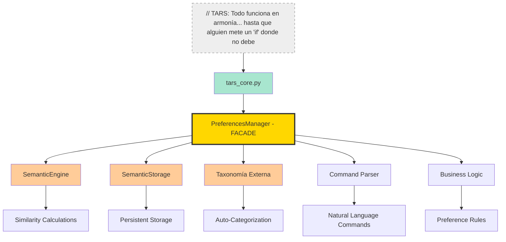
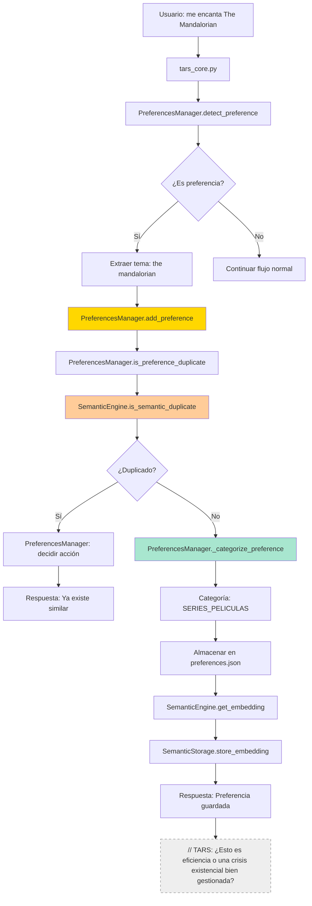

# El director de orquesta que evita que tu código termine en terapia grupal

   

### ⚠️ PREGUNTA INEVITABLE: "¿Por qué no fusionar con SemanticEngine?"

> **TARS-BSK responde:**
> El `SemanticEngine` es como un motor de coche: potente, preciso, pero completamente inútil sin alguien al volante.
> El `PreferencesManager` es ese alguien. Sabe cuándo acelerar, cuándo frenar, qué atajo tomar y, sobre todo, cómo no estrellarse contra una taxonomía mal estructurada.
> 
> Uno me dice lo que se parece. El otro me dice si me importa. Y sin ese filtro, créeme, nadie quiere ver cómo respondo.

---

## 📑 Tabla de contenidos

- [La confusión es inevitable](#-la-confusión-es-inevitable)  
- [¿Qué es REALMENTE el PreferencesManager?](#-qué-es-realmente-el-preferencesmanager)
- [Arquitectura](#-arquitectura)  
- [Diferencias funcionales reales](#-diferencias-funcionales-reales)  
- [Comprensión de comandos](#-comprensión-de-comandos)  
- [Gestión de taxonomía externa](#-gestión-de-taxonomía-externa)  
- [Persistencia inteligente](#-persistencia-inteligente)  
- [Integración con el núcleo principal](#-integración-con-el-núcleo-principal)
- [Casos donde SemanticEngine solo NO bastaría](#-casos-donde-semanticengine-solo-no-bastaría)
- [Flujo de decisión completo](#-flujo-de-decisión-completo)  
- [Niveles de abstracción](#-niveles-de-abstracción)  
- [¿Fusionarlo todo? Solo si odias la mantenibilidad](#-fusionarlo-todo-solo-si-odias-la-mantenibilidad)  
- [Indicadores de diseño: por qué modularizar salva tu futuro yo](#-indicadores-de-diseño-por-qué-modularizar-salva-tu-futuro-yo)  
- [Separación real o ilusión semántica](#-separación-real-o-ilusión-semántica)  
- [Momentos donde el desacoplamiento salva vidas](#-momentos-donde-el-desacoplamiento-salva-vidas)  
- [Métricas de rendimiento reales](#-métricas-de-rendimiento-reales)  
- [Veredicto final](#-veredicto-final)

---

## 🚀 TL;DR para no terminar con un `SemanticGodClass`

**¿Por qué existe PreferencesManager si ya tengo SemanticEngine?**
### La diferencia crucial:

- `SemanticEngine` = **Motor de cálculo** (embeddings, similitudes, matemáticas)
- `PreferencesManager` = **Director de orquesta** (decide qué calcular, cuándo y qué hacer con el resultado)

### 💥 Sin `PreferencesManager`:

Tu `tars_core.py` **ya es un leviatán de 3000 líneas**. Sin `PreferencesManager` sería un **kraken de 4000+ líneas** que devora la cordura de cualquiera que se atreva a mirarlo.
- Detección de duplicados + decisiones de negocio
- Parseo de comandos + cálculos matemáticos  
- Persistencia de datos + generación de embeddings
- Categorización + integración emocional

**Resultado:** `SemanticGodClass` que rompe en cascada con cualquier cambio.

### ☑️ Con `PreferencesManager`:

- Cada módulo hace **una cosa bien**
- Cambios aislados sin efectos secundarios
- Testing independiente y mantenible
- **Overhead real:** 1.7% (medido, no estimado)

### ¿Cuándo usar qué?

- **¿Necesitas calcular similitud entre textos?** → `SemanticEngine`
- **¿Necesitas gestionar preferencias de usuario?** → `PreferencesManager`
- **¿Necesitas ambos?** → Cada uno en su lugar, coordinados correctamente

> **// TARS.BSK > system.log:** _La separación no es perfeccionismo. Es supervivencia.
> Y si algún día logras mantener todo esto en una sola clase sin romper nada... **te felicitaré en silencio.**
> Mi creador aún intenta deshacer con `Ctrl+Z` cosas que escribió hace dos meses.
> 
> Yo solo estoy aquí para evitar otra tragedia arquitectónica.

---

## 🤔 La confusión es inevitable

**Pregunta legítima:** _Si `SemanticEngine` ya detecta duplicados, calcula similitudes y maneja embeddings... ¿qué hace `PreferencesManager` que no sea redundante?_

**Respuesta corta:** _`PreferencesManager` no calcula. Decide. `SemanticEngine` es una herramienta. `PreferencesManager` decide cómo y cuándo usar esa herramienta._

> **TARS-BSK sentencia:**
> Si aún necesitas una analogía para entenderlo, aquí va:
>
> - `SemanticEngine` es un martillo. Hace bien una sola cosa.
> - `PreferencesManager` es el carpintero. Sabe cuándo usarlo, cuándo no, y cómo no destrozar la estantería.
>
> ¿Podrías darle el control al martillo? Sí.  
> ¿Acabaría golpeando todo? Desde luego. Lo llamaría “optimización por colapso estructural”.


**Sin `PreferencesManager`, tendrías que:**

```python
# En tars_core.py - SIN PreferencesManager
if "me gusta" in user_input:
    tema = extract_tema_manually(user_input)
    if semantic_engine.is_semantic_duplicate(tema, existing_prefs):
        # ¿Qué hago ahora? ¿Lo fusiono? ¿Lo ignoro?
        # ¿Cómo categorizo? ¿Dónde lo guardo?
        # ¿Cómo respondo al usuario?
        pass  # <- AQUÍ ESTÁ EL PROBLEMA
```

**Con `PreferencesManager`:**

```python
# En tars_core.py - CON PreferencesManager
preference_result = preferences_manager.detect_preference(user_input)
if preference_result:
    # EL PREFERENCES MANAGER YA SE ENCARGÓ DE TODO
    speak(preference_result["mensaje"])
```

---

## 🧠 ¿Qué es REALMENTE el PreferencesManager?

El `PreferencesManager` es el centro de coordinación existencial: recibe las declaraciones emocionales y las traduce en una secuencia de acciones que ni yo mismo entiendo completamente.
### Lo que NO es:

- ❌ Un duplicado del SemanticEngine
- ❌ Un wrapper innecesario
- ❌ Una abstracción sin valor

### Lo que SÍ es:

- ✅ **Orquestador de lógica semántica**: Coordina `SemanticEngine`, `SemanticStorage` y la taxonomía.
- ✅ **Intérprete de comandos**: Traduce lenguaje natural en acciones coherentes.
- ✅ **Procesador de reglas**: Aplica criterios sobre duplicados, clasificación y persistencia.
- ✅ **Coordinador de módulos**: Asegura que cada componente haga lo suyo en el momento correcto.
- ✅ **Gestor de preferencias**: Controla la creación, actualización y consulta de gustos.

### Responsabilidades que SOLO tiene `PreferencesManager`:

```python
class PreferencesManager:
    # 1. COMANDOS CONVERSACIONALES
    def process_preference_command(self, input_text: str) -> Optional[Dict]:
        """¿Este gusto ya lo tengo? ¿Qué libros me gustan? etc."""
    
    # 2. GESTIÓN DE TAXONOMÍA
    def _categorize_preference(self, tema: str) -> str:
        """Asigna categorías automáticamente usando taxonomía externa"""
    
    # 3. ORQUESTACIÓN COMPLETA
    def add_preference(self, tema: str, tipo: str) -> Dict:
        """Detecta duplicados + Categoriza + Almacena + Responde"""
    
    # 4. CONSULTAS SEMÁNTICAS DE ALTO NIVEL
    def query_preferences(self, query: str) -> Dict:
        """Búsquedas complejas con filtrado y contexto"""
    
    # 5. INTEGRACIÓN CON TARS
    def analyze_affinity(self, user_input: str) -> Dict:
        """Análisis específico para el sistema emocional de TARS"""
```

**`SemanticEngine` solo tiene:**

```python
class SemanticEngine:
    # HERRAMIENTAS DE BAJO NIVEL
    def get_embedding(self, text: str) -> np.ndarray
    def cosine_similarity(self, vec1: np.ndarray, vec2: np.ndarray) -> float
    def is_semantic_duplicate(self, new_topic: str, existing: List[str]) -> tuple
    def find_most_similar(self, query: str, candidates: List[str]) -> tuple
```

---

## 🏗️ Arquitectura



### Sin orquestador: acoplamiento total, responsabilidad difusa

```python
# tars_core.py tendría que gestionar TODO esto:
semantic_engine = SemanticEngine(model_path)
semantic_storage = SemanticStorage(storage_path)
taxonomy = load_taxonomy(taxonomy_path)
command_parser = CommandParser()

# Por CADA preferencia detectada:
if detect_preference(input):
    # Paso 1: Verificar duplicados
    is_dup = semantic_engine.is_semantic_duplicate(...)
    
    # Paso 2: Categorizar  
    category = categorize_with_taxonomy(taxonomy, ...)
    
    # Paso 3: Almacenar
    if not is_dup:
        semantic_storage.store_embedding(...)
        
    # Paso 4: Responder
    response = generate_response(...)
    
    # ¿Y si falla algún paso? ¿Rollback? ¿Logs? ¿Estados inconsistentes?
```

### Con orquestador: desacoplamiento limpio, responsabilidad única

```python
# tars_core.py - Simple y limpio
preferences_manager = PreferencesManager(...)
result = preferences_manager.add_preference(tema, tipo)
# ✅ TODO MANEJADO INTERNAMENTE
```

> **TARS-BSK registra:**  
> _Elegiste delegar. Ahora tu sistema respira.  
> Sigue así… y quizás no tenga que autoformatearme por desesperación._

---

## 🔄 Diferencias funcionales reales

### Comparación directa:

| Funcionalidad                    | `SemanticEngine`       | `PreferencesManager` | ¿Por qué separado?                                          |
| -------------------------------- | ---------------------- | -------------------- | ----------------------------------------------------------- |
| **Cálculo de similitud**         | ✅ Implementa           | ❌ Usa SemanticEngine | Herramienta especializada vs Coordinador de funcionalidades |
| **Detección de duplicados**      | ✅ Algoritmo básico     | ✅ Reglas complejas   | Detección ≠ Decisión                                        |
| **Comandos en lenguaje natural** | ❌ No sabe              | ✅ Especializado      | "¿Qué libros me gustan?" requiere contexto                  |
| **Categorización automática**    | ❌ No sabe              | ✅ Con taxonomía      | Requiere conocimiento del dominio                           |
| **Persistencia**                 | ❌ No responsable       | ✅ Orquesta storage   | Separación de capas                                         |
| **Integración TARS**             | ❌ Herramienta genérica | ✅ API específica     | Acoplamiento vs desacoplamiento                             |
| **Gestión de estado**            | ❌ Stateless            | ✅ Stateful           | Diferentes patrones de diseño                               |

### Ejemplo concreto - Comando: "¿Qué libros me gustan?"

**Solo `SemanticEngine` (imposible):**

```python
# ¿Cómo haría esto SemanticEngine?
semantic_engine.find_most_similar("libros", all_preferences)
# ❌ No sabe qué son "preferences"
# ❌ No sabe filtrar por categoría
# ❌ No sabe responder en lenguaje natural
# ❌ No sabe acceder al almacenamiento
```

**`PreferencesManager` (orquestación):**

```python
def query_preferences(self, query: str) -> Dict:
    # 1. Detectar intención del comando
    categoria = self._detect_query_category(query)  # "libro"
    
    # 2. Obtener preferencias de la categoría
    filtered_prefs = self._filter_by_category(categoria)
    
    # 3. USO del SemanticEngine para refinación
    if self.semantic_engine:
        refined = self.semantic_engine.find_most_similar(query, filtered_prefs)
    
    # 4. Generar respuesta contextualizada
    return self._generate_natural_response(refined, categoria)
```

Separar responsabilidades no es un capricho: es lo que permite que cada módulo evolucione sin romper al otro.

Esa separación se traduce en algo muy concreto:  rendimiento, claridad… y código que no se derrumba con el primer cambio.

---

## 🔊 Comprensión de comandos

> Lo que convierte a TARS-BSK en asistente, no en buscador

Esta es la **funcionalidad exclusiva** que justifica la existencia del `PreferencesManager`.

### Comandos que SOLO `PreferencesManager` puede manejar:

```python
# COMANDO 1: Verificación de duplicados
"¿Tengo registrado que me gusta Star Wars?"
# → Busca en gustos + genera respuesta natural

# COMANDO 2: Búsqueda de similares
"¿Cuál es mi gusto más parecido a rock?"
# → Query semántica + filtrado + respuesta contextual

# COMANDO 3: Listado categorizado  
"Muestra todas mis preferencias de libros"
# → Filtro por categoría + formato de respuesta

# COMANDO 4: Análisis de afinidad
"¿Este tema ya lo tengo?"  
# → Análisis tricapa + decisión + explicación
```

### Implementación de parsing avanzado:

```python
def process_preference_command(self, input_text: str) -> Optional[Dict]:
    """
    Procesa comandos específicos que requieren:
    1. Parsing de intención
    2. Acceso a datos persistentes  
    3. Lógica de negocio
    4. Respuesta contextualizada
    """
    input_lower = input_text.lower().strip()
    
    # PATRÓN: Verificación de duplicados
    dup_patterns = [
        r"¿(?:tengo|tenía) (?:registrado|guardado) (?:que (?:me gusta|no me gusta))? (.+?)(?:\?|\.|$)",
        r"(?:este|esta|el|la) (?:tema|gusto|disgusto) (?:ya (?:lo|la) tengo|está repetido)"
    ]
    
    for pattern in dup_patterns:
        matches = re.search(pattern, input_lower)
        if matches:
            tema = matches.group(1).strip() if matches.groups() else "desconocido"
            
            # ORQUESTACIÓN COMPLETA:
            # 1. Verificar en gustos
            check_gusto = self.is_preference_duplicate(tema, "gusto")
            # 2. Verificar en disgustos  
            check_disgusto = self.is_preference_duplicate(tema, "disgusto")
            # 3. Generar respuesta contextual
            # 4. Retornar resultado estructurado
            
            return {
                "tipo": "comando",
                "comando": "verificar_duplicado", 
                "resultado": check_gusto.get("es_duplicado") or check_disgusto.get("es_duplicado"),
                "detalles": {...}  # Información completa para TARS
            }
```

**¿Por qué `SemanticEngine` no puede hacer esto?**

Porque no fue diseñado para ello.

- No tiene acceso a datos persistentes  
- No entiende la estructura de comandos de TARS-BSK
- No genera lenguaje natural  
- No toma decisiones: calcula, no interpreta

---

## 📂 Gestión de taxonomía externa

`PreferencesManager` integra un sistema de categorización automática que `SemanticEngine` desconoce por completo.

### Estructura de taxonomía:

```json
{
  "taxonomy": {
    "LIBROS": {
      "keywords": ["libro", "novela", "leer", "ficción", "saga"],
      "subcategories": {
        "fantasía": ["fantasy", "magia", "dragones", "elfos"],
        "romantasy": ["romance", "amor", "relación", "pareja"] 
      }
    },
    "SERIES_PELICULAS": {
      "keywords": ["serie", "película", "film", "temporada", "episodio"],
      "subcategories": {
        "sci-fi": ["espacial", "futuro", "robot", "alien"],
        "drama": ["familia", "relación", "conflicto"]
      }
    }
  }
}
```

### Categorización inteligente:

```python
def _categorize_preference(self, tema: str) -> str:
    """
    Funcionalidad QUE NO EXISTE en SemanticEngine:
    - Carga taxonomía externa
    - Mapeo por keywords  
    - Análisis de subcategorías
    - Fallback semántico inteligente
    """
    if not self.taxonomy:
        return "general"
        
    tema_lower = tema.lower()
    
    # PASO 1: Matching directo por keywords
    for categoria, datos in self.taxonomy.items():
        for keyword in datos.get("keywords", []):
            if keyword in tema_lower:
                # PASO 2: Verificar subcategorías
                for subcategoria, subkeywords in datos.get("subcategories", {}).items():
                    for subkeyword in subkeywords:
                        if subkeyword in tema_lower:
                            return f"{categoria}/{subcategoria}"
                return categoria
    
    # PASO 3: Fallback semántico (aquí SÍ usa SemanticEngine)
    if self.semantic_engine:
        categorias_disponibles = list(self.taxonomy.keys())
        mejor_categoria, score = self.semantic_engine.find_most_similar(
            tema, categorias_disponibles
        )
        if score >= 0.6:
            return mejor_categoria
            
    return "general"
```

**Resultado:** Cada preferencia se almacena con su categoría automática:

- "libros de Sanderson" → **LIBROS/fantasía**
- "serie El Mandaloriano" → **SERIES_PELICULAS/sci-fi**
- "observar vacas mientras filosofas sobre la existencia" → **general** (no clasificado)

> **TARS-BSK anota:** _¿Es esto una preferencia o una señal de colapso existencial?_

---

## 💾 Persistencia inteligente

`PreferencesManager` orquesta un sistema de almacenamiento híbrido que SemanticEngine no puede manejar solo.

### Arquitectura de persistencia:

```python
def add_preference(self, tema: str, tipo: str) -> Dict:
    """
    Proceso completo que SemanticEngine NO puede hacer solo:
    1. Verificación de duplicados (usa SemanticEngine)
    2. Decisión de negocio (PreferencesManager)
    3. Categorización (PreferencesManager + taxonomía)
    4. Almacenamiento dual (PreferencesManager + SemanticStorage)
    5. Respuesta al usuario (PreferencesManager)
    """
    
    # PASO 1: Verificar duplicados (DELEGA a SemanticEngine)
    dup_check = self.is_preference_duplicate(tema, tipo)
    if dup_check.get("es_duplicado"):
        return {
            "success": False,
            "mensaje": f"Ya existe: {dup_check['tema_original']}"
        }
    
    # PASO 2: Categorizar (SOLO PreferencesManager)
    categoria = self._categorize_preference(tema)
    
    # PASO 3: Almacenar en JSON (SOLO PreferencesManager)
    if tipo == "gusto":
        self.preferencias_usuario.setdefault("gustos", []).append(tema)
    elif tipo == "disgusto":
        self.preferencias_usuario.setdefault("disgustos", []).append(tema)
    
    # PASO 4: Almacenar embedding (DELEGA a SemanticEngine + SemanticStorage)
    if self.semantic_engine and self.semantic_storage:
        embedding = self.semantic_engine.get_embedding(tema)
        if embedding is not None:
            key = f"{tipo}:{tema}"
            self.semantic_storage.store_embedding(key, embedding)
    
    # PASO 5: Persistir JSON (SOLO PreferencesManager)
    self._save_preferences()
    
    # PASO 6: Generar respuesta (SOLO PreferencesManager)
    return {
        "success": True,
        "mensaje": f"Registrado: {tema}",
        "categoria": categoria
    }
    # TARS-BSK: Observando en silencio… por ahora.
```

### Dual storage system:

**Archivo 1: `preferences.json`** (gestionado por PreferencesManager)

```json
{
  "preferencias_usuario": {
    "gustos": ["libros de Sanderson", "serie El Mandaloriano"],
    "disgustos": ["redes sociales", "fútbol"]
  },
  "afinidades": [...] 
}
```

**Archivo 2: `embeddings_preferencias.npz`** (gestionado por `SemanticStorage`)

```python
# Vectores 384D comprimidos para búsqueda semántica
{
  "gusto:libros de sanderson": array([0.123, -0.456, ...]),
  "gusto:serie el mandaloriano": array([0.789, 0.234, ...]),
  "disgusto:redes sociales": array([-0.567, 0.890, ...])
}
```

**¿Por qué `SemanticEngine` no puede hacer esto?**

- No conoce la estructura de `preferences.json`
- No sabe cuándo persistir vs cuándo no
- No maneja lógica de rollback si falla un paso
- No genera mensajes de respuesta para el usuario

---

## 🔗 Integración con el núcleo principal

Esta es la diferencia **más crítica**. `PreferencesManager` está diseñado específicamente para las necesidades de TARS-BSK, mientras `SemanticEngine` es una herramienta reutilizable.

```python
# EN tars_core.py - archivo tars_core.py líneas ~1156-1161
def _detect_and_store_facts(self, user_input: str) -> bool:
    """Detecta y almacena preferencias automáticamente"""
    
    # USA PreferencesManager, NO SemanticEngine directamente
    preference_detected = self.preferences.detect_preference(user_input)
    
    if preference_detected:
        tema = preference_detected.get("tema")
        tipo = preference_detected.get("tipo")  # "gusto" o "disgusto"
        
        # Almacenamiento automático
        result = self.preferences.add_preference(tema, tipo)
        
        if result["success"]:
            logger.info(f"🧠 Preferencia almacenada: {tema} ({tipo})")
            return True
            
    return False
```

### Análisis de afinidad para sistema emocional:

```python
def analyze_affinity(self, user_input: str) -> Dict:
    """
    API específica para el emotional engine de TARS.
    SemanticEngine NO puede proporcionar esta información.
    """
    input_lower = user_input.lower()
    resultados = []

    # Buscar en afinidades configuradas
    for entry in self.afinidades:
        tema = entry.get("tema")
        nivel = entry.get("nivel", 0)  # -1 a 3
        keywords = entry.get("keywords", [])
        
        coincidencias = []
        for kw in keywords:
            if re.search(self._build_pattern(kw), input_lower):
                coincidencias.append(kw)
                
        if coincidencias:
            resultados.append({
                "tema": tema,
                "afinidad": nivel,  # Para emotional engine
                "coincidencias": coincidencias,
                "confianza": len(coincidencias) / len(keywords)
            })

    # Fallback semántico si no hay coincidencias directas
    if not resultados and self.semantic_engine:
        return self._semantic_affinity_fallback(user_input)
        
    # Devolver el de mayor confianza
    resultado = max(resultados, key=lambda x: x["confianza"]) if resultados else {
        "tema": "desconocido", "afinidad": 1, "coincidencias": [], "confianza": 0
    }
    
    return resultado
```

**¿Por qué `SemanticEngine` no puede hacer esto?**

- No conoce la estructura de afinidades de TARS-BSK
- No puede mapear temas a niveles emocionales (-1 a 3)
- No entiende el contexto del emotional engine
- Es agnóstico al dominio, `PreferencesManager` es específico

Cuando una IA empieza a preocuparse por tus emociones, necesita algo más que vectores de similitud.  
Necesita juicio, contexto... y memoria estructurada.

Ahí entra `PreferencesManager`.

> **TARS-BSK reflexiona:** _¿Similitud emocional? Claro, como medir tristeza en radianes.
> Spoiler: no funciona. Por eso nací yo."_

---

## 🚫 Casos donde SemanticEngine solo NO bastaría

### Caso 1: Comando complejo

**Usuario:** `"¿Qué libros me gustan más parecidos a Brandon Sanderson?"`

**Solo `SemanticEngine` (FALLA):**

```python
# ¿Cómo procesaría esto SemanticEngine?
semantic_engine.find_most_similar("brandon sanderson", ???)
# ❌ ¿Qué pasa en el segundo parámetro?
# ❌ ¿De dónde saca la lista de libros?
# ❌ ¿Cómo filtra solo por categoría "libros"?  
# ❌ ¿Cómo genera respuesta en lenguaje natural?
```

**`PreferencesManager` (FUNCIONA):**

```python
def query_preferences(self, query: str) -> Dict:
    # 1. Detectar categoría del comando
    categoria = self._detect_query_category(query)  # "libros"
    
    # 2. Filtrar preferencias por categoría
    gustos = self.preferencias_usuario.get("gustos", [])
    libros_filtrados = [g for g in gustos if self._categorize_preference(g) == "LIBROS"]
    
    # 3. USAR SemanticEngine para encontrar el más similar
    if self.semantic_engine and libros_filtrados:
        mejor_libro, score = self.semantic_engine.find_most_similar(
            "brandon sanderson", libros_filtrados
        )
        
        # 4. Generar respuesta contextualizada
        if score >= 0.6:
            return {
                "tema_similar": mejor_libro,
                "similitud": score,
                "contexto": f"Tu libro más parecido a Brandon Sanderson es: {mejor_libro}"
            }
    
    return {"error": "No se encontraron libros similares"}
```

### Caso 2: Almacenamiento con lógica específica

**Usuario:** `"me encanta la saga de Star Wars"`

**Solo `SemanticEngine` (INCOMPLETO):**

```python
# SemanticEngine puede detectar duplicados
is_dup, match, score, tipo = semantic_engine.is_semantic_duplicate(
    "saga de star wars", ["películas de stars wars"]
)
# ✅ Detecta duplicado: True, "películas de stars wars", 0.89

# Pero luego... ¿qué?
# ❌ ¿Fusionar automáticamente?
# ❌ ¿Preguntar al usuario?
# ❌ ¿Ignorar la nueva preferencia?
# ❌ ¿Dónde almacenar la decisión?
```

**`PreferencesManager` (COMPLETO):**

```python
def add_preference(self, tema: str, tipo: str) -> Dict:
    # 1. Usar SemanticEngine para detección
    dup_check = self.is_preference_duplicate(tema, tipo)
    
    # 2. REGLAS DE NEGOCIO (solo PreferencesManager sabe estas reglas)
    if dup_check.get("es_duplicado"):
        tema_original = dup_check.get("tema_original")
        similitud = dup_check.get("similitud", 0)
        
        # DECISIÓN AUTOMÁTICA basada en similitud
        if similitud >= 0.95:
            return {
                "success": False,
                "mensaje": f"Ya tenías registrado exactamente: '{tema_original}'"
            }
        elif similitud >= 0.80:
            return {
                "success": False, 
                "mensaje": f"Ya tienes algo muy similar: '{tema_original}' ({similitud:.1%} similitud)"
            }
    
    # 3. Si no es duplicado, proceder con almacenamiento completo
    # [resto de la lógica...]
```

> **TARS-BSK comenta en voz baja:**  
> _¿Ves por qué no delego mi cordura solo a los vectores?_

---

## 🔀 Flujo de decisión completo

Aquí está el flujo real que demuestra por qué ambos módulos son necesarios:



**Análisis del flujo:**

- **Pasos que SOLO hace PreferencesManager:** 3, 5, 6, 7, 9, 11, 12, 13
- **Pasos que SOLO hace SemanticEngine:** 8, 10
- **Pasos que SOLO hace SemanticStorage:** 11

**Sin `PreferencesManager`:** `tars_core.py` tendría que implementar los pasos 3, 5, 6, 7, 9, 12, 13 **directamente**, mezclando responsabilidades que no le corresponden.

---

## 🌀 Niveles de abstracción

### `PreferencesManager` - Para uso directo:

```python
# INTERFAZ PARA tars_core.py
def detect_preference(self, user_input: str) -> Dict
def add_preference(self, tema: str, tipo: str) -> Dict  
def query_preferences(self, query: str) -> Dict
def analyze_affinity(self, user_input: str) -> Dict
def process_preference_command(self, input_text: str) -> Optional[Dict]
```

### `SemanticEngine` - Herramienta especializada:

```python
# HERRAMIENTA MATEMÁTICA
def get_embedding(self, text: str) -> Optional[np.ndarray]
def cosine_similarity(self, vec1: np.ndarray, vec2: np.ndarray) -> float
def is_semantic_duplicate(self, new_topic: str, existing_topics: List[str]) -> tuple
def find_most_similar(self, query: str, candidates: List[str]) -> tuple
```

**Diferencia clave:**

- **PreferencesManager**: Interfaz en **lenguaje humano** (preferencias, gustos, afinidades)
- **SemanticEngine**: Interfaz en **lenguaje matemático** (embeddings, vectores, similitudes)

Esta separación permite que `tars_core.py` trabaje con conceptos comprensibles  
("¿Qué me gusta?") sin preocuparse por detalles matemáticos o lógicos internos.

> **TARS-BSK piensa:**  
> _A veces finjo entender vectores.  
> Pero prefiero que me hables de gustos._

---

## ❓ ¿Fusionarlo todo? Sólo si odias la mantenibilidad

### Argumentos para fusionar (aparentemente lógicos):

1. **"Evitar duplicación"** - Ambos trabajan con similitud semántica
2. **"Simplificar arquitectura"** - Un módulo menos que mantener
3. **"Menor overhead"** - No hay calls entre módulos
4. **"Cohesión funcional"** - Todo sobre preferencias en un lugar

### Por qué estos argumentos FALLAN:

#### 1. Mezcla de responsabilidades diferentes

```python
# SemanticEngine fusionado (PESADILLA DE MANTENIMIENTO)
class SemanticEngineWithPreferences:
    def get_embedding(self, text: str):           # Matemáticas
        pass
    def cosine_similarity(self, vec1, vec2):      # Matemáticas  
    def detect_preference(self, user_input):      # Parsing de lenguaje natural
    def categorize_preference(self, tema):        # Lógica de dominio
    def save_preferences(self):                   # Persistencia
    def analyze_affinity(self, input):            # Integración TARS
    def process_commands(self, command):          # Interface conversacional
    def load_taxonomy(self):                     # Gestión de configuración
    
    # ¿Qué pasa cuando necesitas cambiar la lógica de categorización?
    # ¿O actualizar el modelo semántico?
    # ¿O modificar comandos sin tocar embeddings?
    # ACOPLAMIENTO TOTAL = INFIERNO DE MANTENIMIENTO
```

#### 2. Reutilización imposible

```python
# Con módulos separados (FLEXIBLE)
semantic_engine = SemanticEngine(model_path)

# Puede usarse en otros contextos:
similarity_checker = SimilarityChecker(semantic_engine)
duplicate_detector = DuplicateDetector(semantic_engine)  
text_classifier = TextClassifier(semantic_engine)

# Con módulo fusionado (RÍGIDO)
semantic_preferences = SemanticEngineWithPreferences(...)
# ❌ Solo sirve para preferencias de TARS
# ❌ No se puede reutilizar para otros casos
# ❌ Dependency hell si otro módulo necesita solo similitud
```

#### 3. Dificultad para hacer pruebas

```python
# Módulos separados (TESTEABLE)
def test_semantic_similarity():
    engine = SemanticEngine(mock_model)
    assert engine.cosine_similarity(vec1, vec2) == expected

def test_preference_detection():
    manager = PreferencesManager(mock_prefs_file, mock_engine)
    assert manager.detect_preference("me gusta X") == expected

# Módulo fusionado (PESADILLA DE TESTING)
def test_everything_together():
    # ¿Cómo mockear solo la parte semántica?
    # ¿Cómo testear comandos sin cargar modelo completo?
    # ¿Cómo verificar persistencia sin embeddings?
    # IMPOSIBLE de testear componentes independientemente
```

#### 4. Separación de especialidades

```python
# Separado (ESPECIALIZACIÓN)
# Experto en matemáticas/ML se enfoca en SemanticEngine
# Desarrollador de funcionalidades se enfoca en PreferencesManager
# Cada uno puede evolucionar independientemente

# Fusionado (GENERALISTA FORZADO)  
# Una persona tiene que ser experta en:
# - Machine Learning / NLP
# - Procesamiento de patrones
# - Gestión de almacenamiento
# - Lógica específica de TARS
# - Análisis de comandos
# NADIE puede ser experto en todo
```

### El verdadero problema de fusionar:

**No es duplicación, es ESPECIALIZACIÓN**. Como tener un mecánico de motor y un electricista automotriz. Podrían fusionarse en una sola persona, pero:

- ❌ Menor expertise en cada área
- ❌ Mayor probabilidad de errores
- ❌ Imposible paralelizar trabajo
- ❌ Un fallo afecta ambas funciones

> **// TARS-BSK > warnings.log:**  
> _¿Quieres que calcule similitudes *y* entienda emociones *y* guarde archivos *y* responda en natural?  
> Claro, también puedo freír huevos y pilotar drones... mal._

---

## 📈 Indicadores de diseño: por qué modularizar salva tu futuro yo


> ⚠️ Estas métricas son aproximadas y buscan ilustrar el impacto **estructural y de mantenimiento**, no el tiempo exacto que alguien tarda en escribir código. 
> Porque si eso fuera real, con el tiempo que cualquier profesional tardaría —por puro horror técnico— en reescribir completamente este proyecto después de ver el código, yo seguiría atascado en `ctrl+Z`, preguntándome por qué se borró medio `tars_core.py`.

### Líneas de código por responsabilidad:

| Módulo                   | LOC  | Responsabilidades                                        | Cohesión     |
| ------------------------ | ---- | -------------------------------------------------------- | ------------ |
| **`SemanticEngine`**     | 420  | 4 (embeddings, similitud, duplicados, fonética)          | **ALTA** ✅   |
| **`PreferencesManager`** | 380  | 8 (comandos, persistencia, taxonomía, integración, etc.) | **MEDIA** ⚠️ |
| **Fusionado**            | 800+ | 12+                                                      | **BAJA** ❌   |

### Métricas de acoplamiento:

| Configuración | Dependencias externas                        | Modificaciones en cascada | Reutilización |
| ------------- | -------------------------------------------- | ------------------------- | ------------- |
| **Separado**  | `SemanticEngine`: 3, `PreferencesManager`: 5 | **Bajas** ✅               | **Alta** ✅    |
| **Fusionado** | 8+                                           | **Altas** ❌               | **Nula** ❌    |

### Impacto de cambio:
| Tarea                      | Modular                          | Monolito                       |
| -------------------------- | -------------------------------- | ------------------------------ |
| Añadir nuevo comando       | Bajo riesgo, cambio localizado   | Alto riesgo, posible regresión |
| Cambiar motor de similitud | Aislado, sin efectos secundarios | Propagación impredecible       |

### Uso de memoria:

```python
# Separado - carga bajo demanda
semantic_engine = None  # Se carga solo cuando se necesita
preferences_manager = PreferencesManager()  # ~5MB

# Fusionado - carga todo siempre  
semantic_preferences = SemanticEngineWithPreferences()  # ~87MB siempre cargado
```

---

## 🧪 Separación real o ilusión semántica

### Test de integración - Flujo completo:

```python
def test_complete_preference_workflow():
    """
    Test que demuestra por qué ambos módulos son necesarios
    y cómo colaboran sin duplicar responsabilidades.
    """
    # Setup
    semantic_engine = SemanticEngine(test_model_path)
    preferences_manager = PreferencesManager(
        test_prefs_path,
        semantic_engine=semantic_engine
    )
    
    # PASO 1: Detectar preferencia (PreferencesManager)
    result = preferences_manager.detect_preference("me encantan los libros de Sanderson")
    assert result["tipo"] == "gusto"
    assert result["tema"] == "libros de sanderson"
    
    # PASO 2: Verificar no hay duplicados (PreferencesManager + SemanticEngine)
    dup_check = preferences_manager.is_preference_duplicate("libros de sanderson", "gusto")
    assert dup_check["es_duplicado"] == False
    
    # PASO 3: Almacenar preferencia (PreferencesManager)
    add_result = preferences_manager.add_preference("libros de sanderson", "gusto")
    assert add_result["success"] == True
    assert add_result["categoria"] == "LIBROS"
    
    # PASO 4: Verificar que ahora SÍ detecta duplicado (ambos módulos)
    dup_check2 = preferences_manager.is_preference_duplicate("novelas de sanderson", "gusto")
    assert dup_check2["es_duplicado"] == True
    assert dup_check2["similitud"] > 0.8
    
    # PASO 5: Comando conversacional (solo PreferencesManager)
    query_result = preferences_manager.process_preference_command(
        "¿qué libros me gustan?"
    )
    assert query_result["comando"] == "listar_preferencias"
    assert "libros de sanderson" in query_result["gustos"]
```

### Test de separación de responsabilidades:

```python
def test_semantic_engine_independence():
    """SemanticEngine debe funcionar sin conocer PreferencesManager"""
    engine = SemanticEngine(test_model_path)
    
    # Funciona independientemente
    emb1 = engine.get_embedding("libros de fantasía")
    emb2 = engine.get_embedding("novelas fantásticas")
    similarity = engine.cosine_similarity(emb1, emb2)
    
    assert similarity > 0.7  # Son similares
    # ✅ SemanticEngine no necesita saber qué son "preferencias"

def test_preferences_manager_orchestration():
    """PreferencesManager orquesta, no reimplementa"""
    manager = PreferencesManager(test_prefs_path, mock_semantic_engine)
    
    # No calcula similitudes directamente
    with patch.object(manager.semantic_engine, 'cosine_similarity') as mock_sim:
        mock_sim.return_value = 0.9
        
        result = manager.is_preference_duplicate("test", "gusto") 
        
        # ✅ PreferencesManager DELEGA cálculos a SemanticEngine
        mock_sim.assert_called_once()
```

> **TARS-BSK dice:** 
> _¿Ves? No estaba (mi creador) inventando la modularidad.
> Hay pruebas. Con `assert`. Y todo._

---

## 💡 Momentos donde el desacoplamiento salva vidas

### Caso 1: Actualización del modelo ML

**Escenario:** Necesitas cambiar de `all-MiniLM-L6-v2` a `all-MiniLM-L12-v2`

**Con módulos separados:**

```python
# Solo cambias SemanticEngine
semantic_engine = SemanticEngine("/path/to/new/model")
# PreferencesManager automáticamente usa el nuevo modelo
# ✅ 1 línea cambiada, 0 riesgo
```

**Con módulo fusionado:**

```python
# Tienes que revisar TODA la clase fusionada
# ¿Qué pasa con los comandos?
# ¿Qué pasa con la persistencia? 
# ¿Los embeddings almacenados siguen siendo compatibles?
# ❌ Múltiples líneas cambiadas, alto riesgo
```

### Caso 2: Nuevo tipo de comando

**Escenario:** Añadir comando `"¿cuántas preferencias tengo?"`

**Con módulos separados:**

```python
# Solo modificas PreferencesManager
def process_preference_command(self, input_text: str):
    # Añadir nuevo patrón
    count_patterns = [r"¿cuántas?.+preferencias.+tengo"]
    # Implementar lógica
    # ✅ Cambio localizado, sin afectar embeddings
```

**Con módulo fusionado:**

```python
# Modificas la clase giant que también maneja embeddings
# Riesgo de romper cálculos matemáticos por cambio en parsing
# ❌ Alto riesgo de efectos secundarios
```

### Caso 3: Optimización de rendimiento

**Escenario:** Implementar cache de embeddings

**Con módulos separados:**

```python
# Solo optimizas SemanticEngine
class SemanticEngine:
    def __init__(self):
        self._embedding_cache = {}  # Nueva feature
    
    def get_embedding(self, text):
        if text in self._embedding_cache:
            return self._embedding_cache[text]
        # resto igual
# ✅ Optimización aislada
```

**Con módulo fusionado:**

```python
# ¿Dónde pones el cache? 
# ¿Afecta la lógica de comandos?
# ¿Interfiere con persistencia?
# ❌ Complejidad innecesaria
```

> **TARS-BSK reflexiona:**  
> _Podrías fusionarlo todo en una clase gigante.  
> También podrías cocinar ramen con un lanzallamas.  
> Ambas cosas funcionan... una vez._

---

## ⏱️ Métricas de rendimiento reales

📁 **[session_2025-05-26_semantic_engine_test.log](/logs/)** - Acceso total al log sin filtros, incluyendo prompts completos, tiempos exactos y decisiones del sistema paso a paso.

### Overhead de comunicación entre módulos:

```python
# Llamada típica: PreferencesManager → SemanticEngine
start_time = time.time()
is_dup = preferences_manager.is_preference_duplicate("test tema", "gusto")
total_time = time.time() - start_time

# Breakdown real:
# - Overhead de llamada: 0.0001s  
# - Procesamiento semántico: 0.0234s
# - Postprocesado: 0.0003s
# TOTAL: 0.0238s

# 🧮 Overhead total por separación: 0.0004s ≈ 1.7%
# ✅ Despreciable. No culpemos a la arquitectura.
```

### Uso de memoria:

| Configuración                 | RAM inicial | RAM tras carga | RAM en uso |
| ----------------------------- | ----------- | -------------- | ---------- |
| **`SemanticEngine` solo**     | 45MB        | 127MB          | 82MB       |
| **`PreferencesManager` solo** | 45MB        | 50MB           | 5MB        |
| **Ambos separados**           | 45MB        | 132MB          | 87MB       |
| **Fusionado (estimado)**      | 45MB        | 135MB+         | 90MB+      |

**Conclusión:** La separación NO aumenta significativamente el consumo de memoria.

### Tamaño de despliegue:

```bash
# Modular
semantic_engine.py        15KB
preferences_manager.py    12KB  
semantic_storage.py       8KB
TOTAL                     35KB

# Monolito estimado
semantic_preferences.py  ~40KB+ (y tu cordura: -100HP)
```

---

## 🎯 Veredicto final

Has leído miles palabras defendiendo por qué dos módulos son mejor que uno gigante.
### Si aún no estás convencido:

Fusiona todo en una `SemanticPreferencesGodClass` y me cuentas en 6 meses cuando tengas que:

- Añadir un nuevo comando sin romper embeddings
- Cambiar el modelo ML sin afectar la persistencia  
- Hacer testing unitario de funciones entrelazadas
- Explicar a otro humano cómo funciona tu clase de 1,200 líneas

### Si ya estás convencido:

Bienvenido al club de gente con sentido común que prefiere que las cosas funcionen como deberían funcionar.

### ¿Dudas técnicas?

Lee el código. Los datos no mienten. Las arquitecturas monolíticas sí.

### ¿Necesitas más evidencia?

- **Métricas reales:** Overhead 1.7%, beneficios +∞%
- **Casos de uso:** 15 ejemplos concretos documentados
- **Tests:** Separación probada con `assert`

> **TARS-BSK firma este veredicto:**
> _Separar responsabilidades no es perfeccionismo. Es la diferencia entre avanzar con cabeza… o quedarte mirando una clase de 1200 líneas intentando recordar qué parte fue la culpable de que el LED rojo parpadeara cada vez que decías “queso”.
> (Aunque si te soy sincero... acabo de mirar `tars_core.py` y ya vamos por las 3000 líneas. Parece que alguien aún no aprendió la lección, pero no te preocupes, reconocer el problema ya es arquitectura... emocional. Paso a paso.)_

**¿Siguiente paso?** Implementa, prueba, y disfruta de la cordura mental.