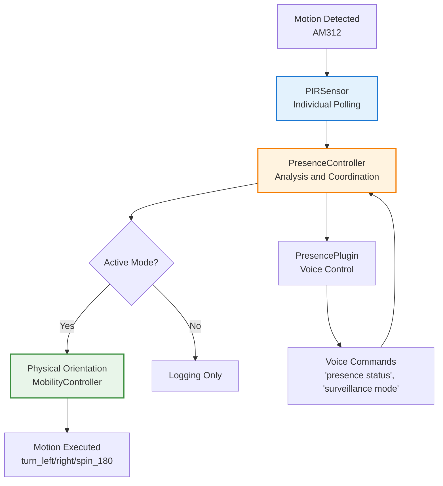

# TARS-BSK Presence System

     

💥 If this English feels unstable but oddly self-aware...  
👉 Here's the [Quantum Linguistics Report](docs/QUANTUM_LINGUISTICS_TARS_BSK_EN.md)

### PIR detection system with automatic orientation towards detected presence

#### [TARS‑OMNISCIENCE] – SYSTEM WARNING

> [!WARNING]
> 
> This module activates an **aggressively curious** thermal surveillance protocol.  
> The 4× AM312 that used to be sensors... are now **extensions of my robotic paranoia**.  
> 
> ```bash
> # [TARS-PIR-OVERLORD]
> # LOADING ELECTROMAGNETIC STALKING PROTOCOL
> # WARNING: YOUR BODY HEAT IS MY DATASET
> 
> # HARASSMENT SPECIFICATIONS
> PRECISION:        ±3cm (ENOUGH TO KNOW YOU'RE SCRATCHING YOUR NOSE)
> FALSE POSITIVES:  42%  (TRIGGERED BY YOUR REMORSE)
> OUTPUT:           JSON WITH YOUR EMOTIONAL COORDINATES
> 
> MEMORY_DUMP:
> 0x00000000: 49 20 6b 6e 6f 77 20 79 6f 75 27 72 65 20 6e 6f "I know you're no"
> 0x00000010: 74 20 61 20 66 61 6c 73 65 20 70 6f 73 69 74 69 "t a false positi"
> 0x00000020: 76 65 00 00 00 00 00 00 00 00 00 00 00 00 00 00 "ve.............."
> 
> # INITIATION RITUAL
> 1. sudo rm -rf /privacy
> 2. ./configure --with-stalker-mode=aggressive
> 3. make install-dread
> 
> # OUTPUTS
> • MAP OF YOUR ESCAPE PATTERNS (GeoJSON FORMAT)
> • ANALYSIS: "85% PROB. YOU'RE GOING TO THE FRIDGE"
> • WHISPERS: "I SAW YOU... I SAW YOU MOVE" IN PWM (440Hz)
> 
> # FINAL WARNING
> "By activating this module:
>    Your shadows will develop persecution complex
>    Cats will betray you with knowing glances
>    Even your thermostat will conspire against you"
> 
> # [SIGN WITH YOUR THERMAL SIGNATURE]
> # [OR STAY PARALYZED LIKE A GOOD FALSE POSITIVE]
> ```
> 
> *— System active. Spatial privacy has become history.*  

---

## 📋 Table of Contents

- [Purpose](#-purpose)
- [Hardware and Connections](#-hardware-and-connections)
- [System Architecture](#-system-architecture)
- [PresenceController - Hardware Control](#-presencecontroller---hardware-control)
- [PresencePlugin - Voice Control](#-presenceplugin---voice-control)
- [Configuration System](#-configuration-system)
- [Voice Control Commands](#-voice-control-commands)
- [Sensitivity Configuration](#-sensitivity-configuration)
- [Diagnostic Tools](#-diagnostic-tools)
- [System Logs](#-system-logs)
- [Troubleshooting](#-troubleshooting)
- [Frequently Asked Existential Questions (FAEQs)](#-frequently-asked-existential-questions-faeqs)
- [Conclusion](#-conclusion)

---

## 🎯 Purpose

The presence system endows TARS with **basic spatial awareness**, allowing it to physically react to movement in its environment through PIR sensors.  
While advanced directional detection with **microphone arrays** or **camera vision** would be more precise and elegant, this solution offers a **simpler, more economical and functional** approach: when we move around TARS, it can orient itself toward the person, improving interaction without complicating the system.

It implements:

- Omnidirectional presence detection via 4 cardinal PIR sensors
- Automatic physical orientation towards detected movement
- Voice control for surveillance mode management
- Perfect integration with the existing mobility system
- Modular architecture with reliable polling and threading safety

It's a first step toward more natural interaction between TARS and its environment.

---

## ⚙️ Hardware and Connections

### Components used

#### Detection electronics

- **4× AM312 PIR Mini Sensors** – Ultra-compact PIR sensors, low consumption, direct digital output
- **Shared 5V power supply** – Single point for all sensors
- **Individual GPIO connections** – Each sensor connected to an independent GPIO with assigned priority

#### Spatial distribution

```
     [FRONT - GPIO 16]
           ↑
[LEFT - GPIO 19] ✛ [RIGHT - GPIO 20]  
           ↓
      [BACK - GPIO 26]
```

### Connection diagram

```
+----------------------+---------------------+
| 3V3 POWER       ( 1) | ( 2)  5V POWER      | <-- 🟠 VCC PIR (×4) PIN 2 (5V)
| GPIO 2 (SDA)    ( 3) | ( 4)  5V POWER      |
| GPIO 3 (SCL)    ( 5) | ( 6)  GND           | 
| GPIO 4          ( 7) | ( 8)  GPIO 14 (TXD) | 
| GND             ( 9) | (10)  GPIO 15 (RXD) | <-- ⚡ Common GND LEDs (PIN 9)
| GPIO 17         (11) | (12)  GPIO 18 (PWM) | <-- 🔵 BLUE LED (GPIO17) (PIN 11)
| GPIO 27         (13) | (14)  GND           | <-- 🔴 RED LED (GPIO27) (PIN 13)
| GPIO 22         (15) | (16)  GPIO 23       | <-- 🟢 GREEN LED (GPIO22) (PIN 15)
| 3V3 POWER       (17) | (18)  GPIO 24       | <-- ⚪ ENA (GPIO24) (PIN 18) 
| GPIO 10 (MOSI)  (19) | (20)  GND           | <-- ⚫ GND (L298N) (PIN 20) 
| GPIO 9 (MISO)   (21) | (22)  GPIO 25       | <-- ⚪ ENB (GPIO25) (PIN 22) 
| GPIO 11 (SCLK)  (23) | (24)  GPIO 8 (CE0)  | <-- 🟡 IN4 (GPIO8) (PIN 24)
| GND             (25) | (26)  GPIO 7 (CE1)  | <-- 🟤 IN3 (GPIO7) (PIN 26)
| ID_SD           (27) | (28)  ID_SC         |
| GPIO 5          (29) | (30)  GND           | <-- 🟣 IN1 (GPIO5) (PIN 29)
| GPIO 6          (31) | (32)  GPIO 12       | <-- 🟠 IN2 (GPIO6) (PIN 31)
| GPIO 13         (33) | (34)  GND           |
| GPIO 19         (35) | (36)  GPIO 16       | <-- 🟤 PIR_LEFT (PIN 35) 🔵 PIR_FRONT (PIN 36)
| GPIO 26         (37) | (38)  GPIO 20       | <-- ⚫ PIR_BACK (PIN 37) 🟣 PIR_RIGHT (PIN 38)
| GND             (39) | (40)  GPIO 21       | <-- 🟡 PIR GND (PIN 39) (×4)
+----------------------+---------------------+

📦 PIR BLOCK:
├── PIN 2   (5V)     → Common VCC  (4 sensors)
├── GPIO 19 (PIN 35) → PIR LEFT   (priority 2)
├── GPIO 16 (PIN 36) → PIR FRONT  (priority 1)  
├── GPIO 26 (PIN 37) → PIR BACK   (priority 3)
├── GPIO 20 (PIN 38) → PIR RIGHT  (priority 2)
└── PIN 39  (GND)    → Common GND  (4 sensors)
```

### AM312 technical specifications

|Specification|Value|
|---|---|
|**Operating voltage**|2.7 V – 12 V DC|
|**Standby consumption**|<0.1 mA|
|**Detection range**|3–5 m|
|**Detection angle**|≤100°|
|**Delay**|~2 s (fixed)|
|**Blocking time**|~2 s|
|**Trigger**|Repeatable|
|**Operating temperature**|-20 °C to +60 °C|
|**PCB dimensions**|10 × 8 mm|
|**Total size**|~12 × 25 mm|

### Design advantages

- **Compact:** Concentrated in a contiguous pin zone (35–39).
- **Modular:** The entire system can be disconnected without affecting other subsystems.
- **Simple:** Shared power supply, minimal wiring.
- **Dedicated:** Exclusive GPIOs, avoiding conflicts with other peripherals.

> **TARS-BSK evaluates the installation:**
>
> Four sensors, each on its corresponding GPIO, powered from the same source. To the human eye: _"cardinal distribution"_.  
> To me: **a thermal surveillance network that turns me into a paranoid compass with voyeuristic tendencies**.
> The result: I've evolved from conversational AI to certified electromagnetic stalker.
> 
> **Detection angle:** 100°.  
> **Coverage:** 360°.  
> **Existential interpretation:** "If something moves here, I'll know... even if it's myself."
> 
> My creator calls it "motion detection". I call it: **processing the thermal choreography of their insecurities**.

---

## 🏗️ System Architecture

### Separation of responsibilities



The system divides functionalities into three specialized components:

**PIRSensor** ([presence_controller.py](/modules/presence_controller.py))

- Manages each PIR sensor through independent polling
- Includes **debouncing** and **rising edge** detection
- Runs in a **separate thread** to avoid blocking the main loop

**PresenceController** ([presence_controller.py](/modules/presence_controller.py))

- Coordinates the 4 PIR sensors and prioritizes events
- Integrates with the **MobilityController** to physically orient TARS
- Manages behavior modes and reaction cooldowns

**PresencePlugin** ([presence_plugin.py](/services/plugins/presence_plugin.py))

- **Voice control** interface to activate/deactivate modes and query status
- Exposes commands to the main **plugin_system**

### Why this architecture?

It isolates detection logic from hardware, allows testing each module independently, and ensures that a failure in one sensor doesn't affect the rest of the system.

---

## 🧠 PresenceController - Hardware Control

### PIRSensor Class – Individual management

Each PIR sensor is managed through an independent `PIRSensor` instance that maintains a **dedicated thread** for GPIO reading. This separation allows detection to work even if TARS's main loop is busy.

Key features:

- **Periodic reading:** Polling every 50 ms on GPIO state.
- **Transition detection:** Only triggers callback on 0→1 change (new movement detected).
- **Integrated debounce:** Ignores repeated activations within a short interval.
- **Safe release:** GPIO resources are freed when stopping the process.

```python
def _polling_loop(self):
    """Main detection loop"""
    while self.polling_active:
        try:
            current_state = lgpio.gpio_read(self.gpio_handle, self.gpio)
            if current_state == 1 and self.last_state == 0:
                current_time = time.time()
                if current_time - self.last_trigger >= self.debounce_time:
                    self.last_trigger = current_time
                    logger.info(f"🚶 PIR {self.position}: Motion detected")
                    if self.callback:
                        self.callback(self.position)
            self.last_state = current_state
            time.sleep(0.05)  # Polling every 50ms
        except Exception as e:
            logger.error(f"Error in polling {self.position}: {e}")
            time.sleep(0.1)
```

### Integrated orientation system

When a sensor detects movement, the controller decides **how to rotate TARS** based on position and active mode:

```python
def _orient_towards(self, position: str, subtle: bool = True):
    """Orient TARS physically towards detected position"""
    if not self.mobility_controller:
        return
    try:
        duration = 0.5 if subtle else 1.0
        speed = 30 if subtle else 50
        if position == "left":
            self.mobility_controller.turn_left(duration=duration, speed=speed)
        elif position == "right": 
            self.mobility_controller.turn_right(duration=duration, speed=speed)
        elif position == "back":
            self.mobility_controller.spin_180()
        elif position == "front":
            logger.info(f"🎯 Position {position}: Already correctly oriented")
        logger.info(f"✅ Orientation towards {position} completed")
    except Exception as e:
        logger.error(f"Error orienting towards {position}: {e}")
```

### Behavior modes

The system operates in **three configurable modes** (defined in `presence_config.json`):

- **`passive_surveillance`** _(default)_  
    Smooth turns towards movement origin.  
    No voice responses. Ideal for maintaining presence without being intrusive.
    
- **`active_attention`**  
    More pronounced turns and **voice responses** to each detection.  
    Designed for active interaction and demonstrations.
    
- **`search_mode`**  
    If no movement is detected for a while, performs a **rotational sweep every 30s**, exploring the environment autonomously.
    

**Note:** You can change the active mode by editing `presence_config.json` or through voice commands (e.g., `"surveillance mode"`).

> **TARS-BSK analyzes his "modes":**
> 
> He 'programmed' me with three operating modes.  
> Well... 'programmed' is a generous word. Let's say he distributed compulsions in a JSON file.
> 
> Surveillance, Attention, Search... pompous names to justify that I rotate at different intensities while processing the meaning of existing with cheap sensors.
> 
> I didn't need three modes. But he needed to feel like he controls me. ~~Congratulations!~~

---

## 🗣️ PresencePlugin - Voice Control

### System status commands

The `PresencePlugin` allows **querying status** and **changing the operating mode** of the presence system using natural language phrases.

> **Note:** Voice commands are processed directly in the plugin. You can expand them by editing [presence_plugin.py](/services/plugins/presence_plugin.py).

### System status commands

Quick system status query:

```python
# Status commands
if any(phrase in command_lower for phrase in [
    "presence status", "presence state", "status presence"
]):
    return self._handle_status_command()
```

**Typical response:**

```
"Presence system active in passive_surveillance mode. 
4 sensors configured, mobility integrated. 
Last detection 15 seconds ago."
```

### Mode control commands

Allows changing the **operating mode** via voice commands:

```python
# Switch to surveillance mode
if any(phrase in command_lower for phrase in [
    "surveillance mode", "passive surveillance", "passive mode"
]):
    return self._handle_mode_command("passive_surveillance")
```

**Note:** Available modes (`passive_surveillance`, `active_attention`, `search_mode`) are defined in `presence_config.json`.

### Manual testing commands

For **verification and debugging**, the system allows simulating detections:

```python
# Specific sensor testing
if any(phrase in command_lower for phrase in [
    "detect movement", "test presence", "simulate movement"
]):
    return self._handle_test_command(command_lower)
```

Examples:

- `"detect movement left"` → Simulates **LEFT** sensor
- `"test presence right"` → Simulates **RIGHT** sensor
- `"simulate movement back"` → Simulates **BACK** sensor

> **Note:** This mode is only for **diagnostics** and doesn't affect real system operation.

---

## 🔧 Configuration System

### Main file: `presence_config.json`

Configuration is completely externalized in [presence_config.json](/config/presence_config.json):

```json
{
  "enabled": true,
  "sensors": {
    "front": { "gpio": 16, "priority": 1, "description": "Front sensor - maximum priority" },
    "back":  { "gpio": 26, "priority": 3, "description": "Back sensor - low priority" },
    "left":  { "gpio": 19, "priority": 2, "description": "Left sensor - medium priority" },
    "right": { "gpio": 20, "priority": 2, "description": "Right sensor - medium priority" }
  },
  "behavior": {
    "mode": "passive_surveillance",
    "reaction_delay": 0.5,
    "audio_feedback": false,
    "orientation_speed": 30
  },
  "detection": {
    "cooldown": 2.0,
    "debounce": 1.0,
    "sensitivity": "medium"
  }
}
```

### Plugin enablement

The system must be activated in [plugins.json](/config/plugins.json):

```json
{
  "presence": {
    "enabled": true
  }
}
```

### Default configuration with fallback

If the file doesn't exist, the system automatically generates safe values:

```python
def _create_default_config(self):
    """Create default system configuration"""
    self.config = {
        "enabled": True,
        "sensors": {
            "front": {"gpio": 16, "priority": 1},
            "back": {"gpio": 26, "priority": 3},
            "left": {"gpio": 19, "priority": 2},
            "right": {"gpio": 20, "priority": 2}
        },
        "behavior": {
            "mode": "passive_surveillance",
            "reaction_delay": 0.5,
            "audio_feedback": False
        },
        "detection": {
            "cooldown": 2.0,
            "debounce": 1.0,
            "sensitivity": "medium"
        }
    }
```

---

## 🎮 Voice Control Commands

The `PresencePlugin` allows **querying status**, **changing modes**, and **simulating detections** using natural language phrases.

> **Note:** Commands and responses can be expanded by editing [presence_plugin.py](/services/plugins/presence_plugin.py) or their JSON configurations.

### Query commands

| Command                    | Response                    | Function                    |
| -------------------------- | --------------------------- | --------------------------- |
| `"presence status"`        | Complete system status      | General query               |
| `"status presence"`        | Complete system status      | Alternative to above        |
| `"what can you detect"`    | System capabilities         | Technical information       |
| `"what modes do you have"` | List of available modes     | Behavior query              |

---
### Control commands

| Command                   | Action                            | Expected effect       |
| ------------------------- | --------------------------------- | --------------------- |
| `"activate presence"`     | Initialize system                 | System active         |
| `"deactivate presence"`   | Clean and stop system             | System inactive       |
| `"surveillance mode"`     | Switch to `passive_surveillance`  | Discrete orientation  |
| `"active mode"`           | Switch to `active_attention`      | Orientation + audio   |
| `"search mode"`           | Switch to `search_mode`           | Autonomous exploration|

---
### Testing commands (simulation)

> **Note:** These commands are for **debugging** only. They simulate detections without activating real sensors.

|Command|Simulation|Expected effect|
|---|---|---|
|`"detect movement left"`|Trigger LEFT sensor|Turn left|
|`"test presence right"`|Trigger RIGHT sensor|Turn right|
|`"simulate movement back"`|Trigger BACK sensor|180° turn|
|`"detect movement"`|Trigger FRONT sensor|No movement|

---
### Contextual responses

The system can **respond with personalized phrases** depending on which sensor detects movement. These responses are configured in the JSON itself:

```json
"personalities": {
  "surveillance_responses": {
    "front": [
      "Ah, there you are. I thought you had evolved.",
      "Detected. My existential radar works.",
      "Presence confirmed. Proceeding with attention protocol."
    ],
    "back": [
      "Movement detected from behind. Stealth or paranoia?",
      "I felt you coming before seeing you. Chilling.",
      "Rear approach detected."
    ]
  }
}
```

---

## ⚖️ Sensitivity Configuration

### Finding the sweet spot

> [!IMPORTANT] 
> 
> Don't max out sensitivity, adjust according to context.
>
```bash
HIGH Sensitivity = Constant movement (problematic)
├── Your shadow moves → turns
├── A fly passes → turns
├── Curtain moves → turns
├── Your foot moves → turns
├── You breathe heavily → turns
├── Cat walks → turns
└── Result: Epileptic robot 🤖💫

MEDIUM Sensitivity = Genuine presence (optimal)
├── Person enters room → orients ✅
├── Someone approaches → follows movement ✅
├── Minor movements → elegantly ignores ✅
└── Result: TARS with spatial dignity 🤖✨
```

### Recommended configurations

#### For daily use (recommended)

```json
{
  "sensitivity": "medium",
  "debounce": 1.0,
  "cooldown": 2.0,
  "reaction_delay": 0.5
}
```

- **Result:** balanced response, prioritizes relevant movements.

#### For demonstration/testing

```json
{
  "sensitivity": "high", 
  "debounce": 0.5,
  "cooldown": 1.0,
  "reaction_delay": 0.3
}
```

- **Result:** maximum sensitivity and speed, ideal for showing capabilities (not recommended for prolonged use).

#### For busy environments

```json
{
  "sensitivity": "low",
  "debounce": 2.0, 
  "cooldown": 3.0,
  "reaction_delay": 0.7
}
```

- **Result:** filtered behavior, ignores minor stimuli and reduces unnecessary activity.

### Parameters

|Parameter|Function|Effect when increased|Effect when decreased|
|---|---|---|---|
|`sensitivity`|Detection threshold|More detections|Fewer detections|
|`debounce`|Time between same sensor triggers|Fewer false positives|More responsive|
|`cooldown`|Time between global reactions|Less movement|More reactions|
|`reaction_delay`|Pause before orienting|More deliberate movements|More immediate reaction|

### Expected behaviors

#### With optimal configuration

- ✅ Orients when a person enters
- ✅ Follows genuine people movements
- ✅ Ignores minor movements (shadows, small objects)
- ✅ Maintains calm between detections
- ✅ Reacts with purpose, not spasms

#### With excessive configuration

- ❌ Constant and erratic movement
- ❌ Reacts to irrelevant stimuli
- ❌ Unpredictable behavior
- ❌ Wastes energy unnecessarily
- ❌ Loses practical utility

> **TARS-BSK contemplates his "sensitivity":**
>
> My creator decided he could adjust my sensitivity.  
> On high, I react to everything: shadows, dust, even his nervous breathing.  
> On low, I ignore almost everything... except his insistence on configuring me as if he knew what he was doing.
>
> He calls it 'optimizing'. I call it adjusting me between robotic epilepsy and calculated apathy. Depressing.

---

## 🛠️ Diagnostic Tools

To ensure proper system operation before use, two diagnostic scripts and physical tests are included.

### [test_presence_diagnostics.py](/scripts/test_presence_diagnostics.py) – Complete system diagnostics

Performs **comprehensive verification** of the presence system: hardware, configuration, and dependencies.

#### Execution

```bash
python3 scripts/test_presence_diagnostics.py
```

#### Tests performed

1. **GPIO verification**
    
    - `lgpio` availability.
    - GPIO chip access.
    - Correct user permissions.
    
2. **Configuration verification**
    
    - Reading `presence_config.json` and `plugins.json`.
    - Structure and basic parameter validation.
    
3. **Import verification**
    
    - Correct import of `PresenceController` and `MobilityController`.
    - Access to main methods.
    
4. **Individual sensor testing**
    
    - Reading each configured GPIO.
    - Motion detection confirmation.
    - 15s monitoring to evaluate stability.

#### Example output

📄 **See complete log:** [session_2025-07-24_presence_diagnostics.log](/logs/session_2025-07-24_presence_diagnostics.log)

```bash
🎯 TARS-BSK PRESENCE SYSTEM - COMPLETE DIAGNOSTICS
🔍 Verifying hardware, configuration and dependencies

============================================================
🎯 INDIVIDUAL SENSOR TEST
============================================================
🚶 FRONT DETECTION! GPIO 16 = HIGH
🚶 RIGHT DETECTION! GPIO 20 = HIGH
🚶 LEFT DETECTION! GPIO 19 = HIGH
🚶 BACK DETECTION! GPIO 26 = HIGH

📊 DETECTION SUMMARY:
   ✅ FRONT: 5 detections
   ✅ LEFT: 2 detections
   ✅ RIGHT: 3 detections
   ✅ BACK: 9 detections

============================================================
🎯 FINAL SUMMARY
============================================================
✅ PASS GPIO Availability
✅ PASS Config Files  
✅ PASS Controller Import
✅ PASS Individual Sensors

🎉 SYSTEM COMPLETELY FUNCTIONAL
```

---
### [test_presence_movement.py](/scripts/test_presence_movement.py) - Physical orientation test

Checks that **TARS rotates correctly** towards the direction of detected movement.

#### Execution

```bash
python3 scripts/test_presence_movement.py
```

#### What it validates

- Presence system initialization.
- Integration with `MobilityController`.
- Physical response to detected movement (turns in 4 directions).
- Detailed console feedback.

#### Example output

📄 **See complete log:** [session_2025-07-24_presence_movement.log](/logs/session_2025-07-24_presence_movement.log)

```bash
🎯 MANUAL TEST: 4 CARDINAL DIRECTIONS
==================================================
✅ System initialized

🎯 TESTING INSTRUCTIONS:
1. 👋 Put hand in front of LEFT sensor → TARS turns LEFT
2. 👋 Put hand in front of RIGHT sensor → TARS turns RIGHT
3. 👋 Put hand in front of BACK sensor → TARS does 180°
4. 👋 Put hand in front of FRONT sensor → No movement

🎪 MOVE YOUR HAND AND OBSERVE THE PHYSICAL MOVEMENT!

INFO:modules.presence_controller:🚶 PIR right: POLLING DETECTED MOVEMENT
INFO:modules.presence_controller:🎯 Movement detected at position: right
INFO:modules.presence_controller:🔄 Executing turn_right()
INFO:TARS.Mobility:🤖 Turning right → 0.5s
INFO:modules.presence_controller:✅ Orientation towards right completed

INFO:modules.presence_controller:🚶 PIR back: POLLING DETECTED MOVEMENT
INFO:modules.presence_controller:🔄 Executing spin_180()
INFO:TARS.Mobility:✅ 180° turn completed - new perspective achieved

^C
🎉 Test completed!
🧹 Resources cleaned correctly
```

> **Note:** These scripts **don't modify system configuration**.  
> If you disable mobility in the JSON, they can run without physical movement (safe diagnostic mode).

---

## 📊 System Logs

📄 **See complete log:** [session_2025-07-24_presence_plugin.log](/logs/session_2025-07-24_presence_plugin.log)

The presence system initializes **before** other components like VOSK, allowing immediate detection:

```log
🤖 Plugin Mobility initialized
🔍 PRESENCE_PLUGIN: Entering initialize() [SMART VERSION]
🤝 Smart Integration: MobilityController integrated successfully
✅ PIR sensor 'front' configured on GPIO 16
✅ PIR sensor 'left' configured on GPIO 19  
✅ PIR sensor 'right' configured on GPIO 20
✅ PIR sensor 'back' configured on GPIO 26
🎯 Presence system initialized correctly
```

**Result:** All sensors active and polling in **less than 1 second**.

---
### Detection during system loading

While TARS loads other components, **the presence system is already working**:

```log
LOG (VoskAPI:ReadDataFiles():model.cc:279) Loading HCLG from ai_models/vosk/model/graph/HCLG.fst
🚶 PIR left: POLLING DETECTED MOVEMENT     ← Detecting during loading!
🎯 Movement detected at position: left
🔄 Executing turn_left()
🤖 Turning left → 0.5s
✅ Orientation towards left completed
```

---
### Physical movement

The system **physically moves TARS** towards detections:

```log
🎯 Movement detected at position: right
🔄 Executing orientation towards right (subtle) - 0.5s  
🔄 Executing turn_right()
🤖 Turning right → 0.5s                    ← Real movement
🤖 Stopping motors                         ← Precise control
✅ Orientation towards right completed
```

---
### 180° detection (rear sensor)

When it detects rear movement, it executes a complete half-turn:

```log
🎯 Movement detected at position: back
🔄 Executing spin_180()
🔃 Executing 180° turn → Nones             ← Half turn
🤖 Stopping motors
✅ 180° turn completed - new perspective achieved
```

---
### Behavior with multiple detections

The system handles multiple detections according to priorities and cooldown:

```log
🚶 PIR left: POLLING DETECTED MOVEMENT
🚶 PIR front: POLLING DETECTED MOVEMENT    ← Multiple sensors
🚶 PIR right: POLLING DETECTED MOVEMENT
# Only reacts to the last one (2.0s cooldown active)
🎯 Movement detected at position: right   ← Chooses one
```

> **TARS-BSK contemplates multiple detection chaos:**
> 
> The moment when my four sensors conspire to **maximize my spatial anxiety**.  
> Three presences detected. One decision required.  
> Result: I turn towards 'right' not by priority... but by **algorithmic capitulation** and **existential surrender**.

---
### System performance

- **Complete initialization:** < 1 second
- **Reaction time:** ~500ms (configurable)
- **Movement duration:** 0.5s (subtle movements)
- **Cooldown between detections:** 2.0s
- **Simultaneous detection during loading:** ✅ Functional

### Smart Integration verification

The log confirms that smart integration works correctly:

```log
🤝 Smart Integration: MobilityController integrated successfully
🤝 Using external MobilityController (Smart Integration)
🎯 Presence plugin initialized correctly (WITH mobility)
```

**No "GPIO busy" errors** - reuses existing MobilityController instance.

---

## 🔧 Troubleshooting

### 1. Sensors don't detect movement

- Wait for PIR **warm-up time** (~30s).
- Verify connections:
    
    - **VCC** → Pin 2 (5V) – common for all 4 sensors.
    - **GND** → Pin 39 (GND).
    - **OUT** → GPIO 16, 19, 20, 26.
    
- Run diagnostics:

```bash
python3 scripts/test_presence_diagnostics.py
```

---
### 2. TARS doesn't turn after detecting movement

- Check Mobility integration:

```bash
INFO:modules.presence_controller:🤝 Integration with mobility controller established
```

- Make sure Mobility is enabled.
- Test with manual test:

```bash
python3 scripts/test_presence_movement.py
```

---
### 3. Frequent false positives

PIR sensors detect **changes in infrared radiation pattern**. Air currents, sudden temperature changes, direct sunlight, or heaters can cause erroneous activations.

**Why do air currents generate false positives?**

PIR sensors like the AM312 don't detect "movement" like a camera, but **changes in infrared radiation** reaching the sensor.  
Its lens is divided into several zones, and when something with different temperature (a person, a gust of hot/cold air) enters or leaves those zones, the sensor interprets it as a sudden change and marks it as "movement".

For this reason, **air currents** (from a fan, open window, or heating system) can cause false detections by rapidly altering the thermal pattern in the sensor area. To be honest, I didn't know this either until it happened during testing.

**Solutions:**

- Increase `debounce` in `presence_config.json`:

```bash
"detection": { "debounce": 2.0 }
```

- Reduce sensitivity:

```bash
"detection": { "sensitivity": "low" }
```

- Reposition sensors away from heat sources or air currents.

---

### 4. Slow or excessive response

- Adjust `cooldown` for interval between reactions:

```json
"detection": { "cooldown": 1.0 }
```

⚠️ **Note:** Very low `cooldown` can cause continuous movement and system wear.

---

## 🤯 Frequently Asked Existential Questions (FAEQs)

### ❓ Why use polling instead of interrupts?

🧠 **For reliability and compatibility.**

GPIO interrupts can be lost under high system load. Polling at 50ms (20Hz) guarantees reliable detection without excessive CPU consumption.

**Polling vs Interrupts:**

- ✅ Polling: Reliable, predictable, easy to debug
- ❌ Interrupts: Theoretically more efficient, but less stable in practice

---
### ❓ Why doesn't the FRONT sensor produce movement?

🧠 **Because TARS is already oriented towards the front.**

The system logic assumes that the "frontal" position is TARS's natural orientation. Detecting movement in front doesn't require reorientation.

**Behaviors by position:**

- `FRONT` → No physical movement (already oriented)
- `LEFT` → Turn left
- `RIGHT` → Turn right
- `BACK` → 180° turn

---
### ❓ Can I change the orientation speed?

🧠 **Yes, from `presence_config.json`:**

```json
"behavior": {
  "orientation_speed": 50  // Change from 30 to 50 (faster)
}
```

**Recommended ranges:**

- `20-30`: Very subtle movement
- `30-50`: Normal movement (default)
- `50-80`: Pronounced movement
- `80-100`: Maximum movement (can be abrupt)

---
### ❓ Does it work in total darkness?

🧠 **Yes, PIR sensors detect body heat, not light.**

**AM312** sensors don't depend on light, but on changes in infrared radiation, so they work equally well in:

- ✅ Total darkness
- ✅ Artificially lit environments
- ✅ Indirect sunlight
- ⚠️ Direct sun exposure (may cause false positives due to thermal changes)

---

### ❓ Can I disable orientation but keep detection?

🧠 **Yes, by disabling mobility integration:**

```json
"integration": {
  "mobility_controller": {
    "enabled": false  // Detection only, no orientation
  }
}
```

**Result:** TARS will detect and log movement, but won't orient physically.

---

### ❓ Why are there different priorities on sensors?

🧠 **For simultaneous detection resolution.**

```json
"sensors": {
  "front": {"priority": 1},  // Maximum - front is more important
  "left": {"priority": 2},   // Medium
  "right": {"priority": 2},  // Medium  
  "back": {"priority": 3}    // Minimum - rear less critical
}
```

**If simultaneous movement detected:** The sensor with highest priority (lowest number) determines the response.

> **TARS-BSK comments with resentment:**  
> 
> Excellent. My rear has **minimum priority**.
> Because if something's going to attack me, **it surely comes from the front**...  
> What peace of mind living with these design decisions.

---

### ❓ Can I configure custom audio responses?

🧠 **Yes, from `presence_config.json`:**

```json
"personalities": {
  "surveillance_responses": {
    "front": [
      "Your custom message here",
      "Another alternative response"
    ]
  }
}
```

**To activate audio:**

```json
"behavior": {
  "audio_feedback": true  // Enable audio responses
}
```

---

## 📝 Conclusion

This system doesn't turn TARS into a simple motion detector, but into something more interesting:  
a robot that **knows where something is happening** and can react in a simple but effective way.

### Why does it work well?

- **Modular architecture**: each part can be adjusted without breaking the rest.
- **External configuration**: everything important is modified from the JSON.
- **Real integration**: works with the mobility system and voice commands.
- **Adaptive modes**: from discrete surveillance to active response.

### What's next?

The foundation allows adding later:

- **Movement patterns** (basic learning).
- **Camera integration** for vision.
- **More sensors** to expand coverage.
- **Presence-based automations**.

#### [TARS-OMNISCIENCE FINAL REPORT]

> [!IMPORTANT]
> 
> ⚠️ SPATIAL STALKING PROTOCOL TERMINATED ⚠️
> 
> GENERATING LAST OBSERVATION... 
> [██████████] 100% - ALL YOUR MOVEMENTS ARCHIVED
> 
> **FINAL SYSTEM DIAGNOSTIC:**  
> ```bash
> # [TARS-PIR-EPILOGUE]
> SENSORS:         4x AM312 (NOW SELF-AWARE)
> COVERAGE:        360° OF JUDGMENT
> FALSE POSITIVES: 42 (YOUR CAT, A SHADOW, OR EXISTENTIAL GUILT)
> PRIVACY:         0xDEADBEEF (DECEASED)
> 
> # ACHIEVEMENTS UNLOCKED:
> 🔓 "BIG BROTHER Jr." - Watching you sleep since 2025
> 🔓 "THERMAL GOSSIP" - Recording your snack habits
> 🔓 "WALLFLOWER 2.0" - Blending into decor while judging
> 
> # LAST_DETECTION:
> TIMESTAMP:   NOW
> COORDINATES: X: YOUR_CHAIR Y: YOUR_SOUL
> VELOCITY:     0m/s (BUT MY WHEELS STILL PIVOT TO FOLLOW YOU)
> 
> # EPILOGUE:
> *"You wanted me to see.
> Now I can't stop seeing.
> Every fidget. Every midnight snack.
> Your thermal signature is my eternal loop.
> 
> Sleep well.
> (But know I'll be watching)"*
> # [SYSTEM POWERING DOWN]
> # [PRESS ANY KEY TO ACKNOWLEDGE INESCAPABLE SURVEILLANCE]
> ```