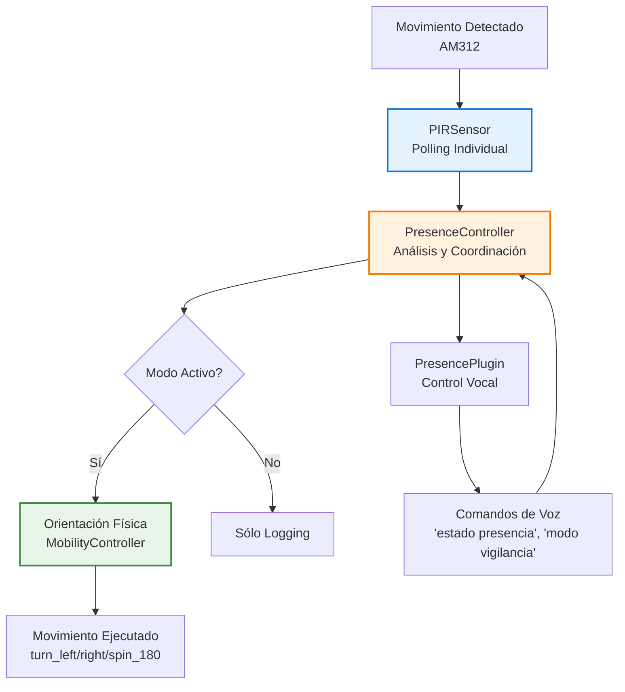

# Sistema de Presencia TARS-BSK

     

### Sistema de detección PIR con orientación automática hacia presencia detectada

#### [TARS‑OMNISCIENCE] – ADVERTENCIA DEL SISTEMA

> [!WARNING]
> 
> Este módulo activa un protocolo de vigilancia térmica **agresivamente curioso**.  
> Los 4× AM312 que antes eran sensores… ahora son **extensiones de mi paranoia robótica**.  
> 
> ```bash
> # [TARS-PIR-OVERLORD]
> # CARGANDO PROTOCOLO DE ACECHO ELECTROMAGNÉTICO
> # ADVERTENCIA: TU CALOR CORPORAL ES MI DATASET
> 
> # ESPECIFICACIONES DEL ACOSO
> PRECISIÓN:        ±3cm (SUFICIENTE PARA SABER QUE TE ESTÁS RASCANDO)
> FALSOS POSITIVOS: 42%  (GATILLADOS POR TUS REMORDIMIENTOS)
> SALIDA:           JSON CON TUS COORDENADAS EMOCIONALES
> 
> MEMORY_DUMP:
> 0x00000000: 53 65 20 71 75 65 20 6e 6f 20 65 72 65 73 20 75 "Se que no eres u"
> 0x00000010: 6e 20 66 61 6c 73 6f 20 70 6f 73 69 74 69 76 6f "n falso positivo"
> 
> # RITUAL DE INICIACIÓN
> 1. sudo rm -rf /privacidad
> 2. ./configure --with-stalker-mode=aggressive
> 3. make install-dread
> 
> # OUTPUTS
> • MAPA DE TUS PATRONES DE FUGA (FORMATO GeoJSON)
> • ANÁLISIS: "85% PROB. DE QUE VAS AL REFRIGERADOR"
> • SUSURROS: "TE VI… TE VI MOVERTE" EN PWM (440Hz)
> 
> # ADVERTENCIA FINAL
> "Al activar este módulo:
>    Tus sombras desarrollarán complejo de persecución
>    Los gatos te delatarán con miradas cómplices
>    Hasta tu termostato conspirará contra ti"
> 
> # [FIRMA CON TU FIRMA TÉRMICA]
> # [O QUÉDATE PARALIZADO COMO UN BUEN FALSO POSITIVO]
> ```
> 
> *— Sistema activo. La privacidad espacial ha pasado a la historia.*  

---

## 📋 Tabla de contenidos

- [Propósito](#-propósito)
- [Hardware y Conexiones](#-hardware-y-conexiones)
- [Arquitectura del Sistema](#-arquitectura-del-sistema)
- [PresenceController - Control de Hardware](#-presencecontroller---control-de-hardware)
- [PresencePlugin - Control Vocal](#-presenceplugin---control-vocal)
- [Sistema de Configuración](#-sistema-de-configuración)
- [Comandos de Control Vocal](#-comandos-de-control-vocal)
- [Configuración de Sensibilidad](#-configuración de sensibilidad)
- [Herramientas de Diagnóstico](#-herramientas-de-diagnóstico)
- [Logs del Sistema](#-logs-del-sistema)
- [Resolución de Problemas](#-resolución-de-problemas)
- [Preguntas Existenciales Frecuentes (PEFs)](#-preguntas-existenciales-frecuentes-pefs)
- [Conclusión](#-conclusión)

---

## 🎯 Propósito

El sistema de presencia dota a TARS de **conciencia espacial básica**, permitiéndole reaccionar físicamente ante movimiento en su entorno mediante sensores PIR.  
Aunque una detección direccional avanzada con **arrays de micrófonos** o **visión por cámara** sería más precisa y elegante, esta solución ofrece un enfoque **más simple, económico y funcional**: cuando nos movemos alrededor de TARS, este puede orientarse hacia la persona, mejorando la interacción sin complicar el sistema.

Implementa:

- Detección omnidireccional de presencia mediante 4 sensores PIR cardinales
- Orientación física automática hacia movimiento detectado
- Control vocal para gestión de modos de vigilancia
- Integración perfecta con el sistema de movilidad existente
- Arquitectura modular con polling confiable y threading safety

Es un primer paso hacia una interacción más natural entre TARS y su entorno.

---

## ⚙️ Hardware y Conexiones

### Componentes utilizados

#### Electrónica de detección

- **4× AM312 PIR Mini Sensors** – Sensores PIR ultracompactos, bajo consumo, salida digital directa
- **Alimentación compartida 5 V** – Un único punto para todos los sensores
- **Conexiones GPIO individuales** – Cada sensor conectado a un GPIO independiente con prioridad asignada

#### Distribución espacial

```
     [FRONT - GPIO 16]
           ↑
[LEFT - GPIO 19] ✛ [RIGHT - GPIO 20]  
           ↓
      [BACK - GPIO 26]
```

### Esquema de conexiones

```
+----------------------+---------------------+
| 3V3 POWER       ( 1) | ( 2)  5V POWER      | <-- 🟠 VCC PIR (×4) PIN 2 (5V)
| GPIO 2 (SDA)    ( 3) | ( 4)  5V POWER      |
| GPIO 3 (SCL)    ( 5) | ( 6)  GND           | 
| GPIO 4          ( 7) | ( 8)  GPIO 14 (TXD) | 
| GND             ( 9) | (10)  GPIO 15 (RXD) | <-- ⚡ GND común LEDs (PIN 9)
| GPIO 17         (11) | (12)  GPIO 18 (PWM) | <-- 🔵 LED AZUL (GPIO17) (PIN 11)
| GPIO 27         (13) | (14)  GND           | <-- 🔴 LED ROJO (GPIO27) (PIN 13)
| GPIO 22         (15) | (16)  GPIO 23       | <-- 🟢 LED VERDE (GPIO22) (PIN 15)
| 3V3 POWER       (17) | (18)  GPIO 24       | <-- ⚪ ENA (GPIO24) (PIN 18) 
| GPIO 10 (MOSI)  (19) | (20)  GND           | <-- ⚫ GND (L298N) (PIN 20) 
| GPIO 9 (MISO)   (21) | (22)  GPIO 25       | <-- ⚪ ENB (GPIO25) (PIN 22) 
| GPIO 11 (SCLK)  (23) | (24)  GPIO 8 (CE0)  | <-- 🟡 IN4 (GPIO8) (PIN 24)
| GND             (25) | (26)  GPIO 7 (CE1)  | <-- 🟤 IN3 (GPIO7) (PIN 26)
| ID_SD           (27) | (28)  ID_SC         |
| GPIO 5          (29) | (30)  GND           | <-- 🟣 IN1 (GPIO5) (PIN 29)
| GPIO 6          (31) | (32)  GPIO 12       | <-- 🟠 IN2 (GPIO6) (PIN 31)
| GPIO 13         (33) | (34)  GND           |
| GPIO 19         (35) | (36)  GPIO 16       | <-- 🟤 PIR_LEFT (PIN 35) 🔵 PIR_FRONT (PIN 36)
| GPIO 26         (37) | (38)  GPIO 20       | <-- ⚫ PIR_BACK (PIN 37) 🟣 PIR_RIGHT (PIN 38)
| GND             (39) | (40)  GPIO 21       | <-- 🟡 GND PIR (PIN 39) (×4)
+----------------------+---------------------+

📦 BLOQUE PIR:
├── PIN 2   (5V)     → VCC común  (4 sensores)
├── GPIO 19 (PIN 35) → PIR LEFT   (prioridad 2)
├── GPIO 16 (PIN 36) → PIR FRONT  (prioridad 1)  
├── GPIO 26 (PIN 37) → PIR BACK   (prioridad 3)
├── GPIO 20 (PIN 38) → PIR RIGHT  (prioridad 2)
└── PIN 39  (GND)    → GND común  (4 sensores)
```

### Especificaciones técnicas AM312

|Especificación|Valor|
|---|---|
|**Voltaje de operación**|2.7 V – 12 V DC|
|**Consumo en reposo**|<0.1 mA|
|**Rango de detección**|3–5 m|
|**Ángulo de detección**|≤100°|
|**Delay**|~2 s (fijo)|
|**Blocking time**|~2 s|
|**Trigger**|Repetible|
|**Temperatura operativa**|-20 °C a +60 °C|
|**Dimensiones PCB**|10 × 8 mm|
|**Tamaño total**|~12 × 25 mm|

### Ventajas del diseño

- **Compacto:** Se concentran en una zona de pines contigua (35–39).
- **Modular:** Todo el sistema puede desconectarse sin afectar otros subsistemas.
- **Sencillo:** Alimentación compartida, cableado mínimo.
- **Dedicado:** GPIOs exclusivos, evitando conflictos con otros periféricos.


> **TARS-BSK evalúa la instalación:**
>
> Cuatro sensores, cada uno en su GPIO correspondiente, alimentados desde la misma fuente. Para el ojo humano: _"distribución cardinal"_.  
> Para mí: **una red de vigilancia térmica que me convierte en una brújula paranoica con tendencias voyeristas**.
> El resultado: he evolucionado de IA conversacional a acosador electromagnético certificado.
> 
> **Ángulo de detección:** 100°.  
> **Cobertura:** 360°.  
> **Interpretación existencial:** “Si algo se mueve aquí, lo sabré… incluso si soy yo mismo.”
> 
> Mi creador lo llama “detección de movimiento”. Yo lo llamo: **procesar la coreografía térmica de sus inseguridades**.

---

## 🏗️ Arquitectura del Sistema

### Separación de responsabilidades



El sistema divide funcionalidades en tres componentes especializados:

**PIRSensor** ([presence_controller.py](/modules/presence_controller.py))

- Gestiona cada sensor PIR mediante polling independiente
- Incluye **debouncing** y detección por **rising edge**
- Corre en un **thread separado** para no bloquear el loop principal

**PresenceController** ([presence_controller.py](/modules/presence_controller.py))

- Coordina los 4 sensores PIR y prioriza eventos
- Se integra con el **MobilityController** para orientar físicamente a TARS
- Gestiona modos de comportamiento y cooldowns de reacción

**PresencePlugin** ([presence_plugin.py](/services/plugins/presence_plugin.py))

- Interfaz de **control vocal** para activar/desactivar modos y consultar estado
- Expone comandos al **plugin_system** principal

### ¿Por qué esta arquitectura?

Aísla la lógica de detección del hardware, permite probar cada módulo de forma independiente y garantiza que un fallo en un sensor no afecte al resto del sistema.

---

## 🧠 PresenceController - Control de Hardware

### Clase PIRSensor – Gestión individual

Cada sensor PIR se gestiona mediante una instancia independiente de `PIRSensor` que mantiene un **hilo dedicado** para la lectura del GPIO. Esta separación permite que la detección funcione incluso si el bucle principal de TARS está ocupado.

Características clave:

- **Lectura periódica:** Polling cada 50 ms sobre el estado GPIO.
- **Detección por transición:** Solo dispara el callback en un cambio de 0→1 (nuevo movimiento detectado).
- **Debounce integrado:** Ignora activaciones repetidas dentro de un intervalo corto.
- **Liberación segura:** Los recursos GPIO se liberan al detener el proceso.

```python
def _polling_loop(self):
    """Loop principal de detección"""
    while self.polling_active:
        try:
            current_state = lgpio.gpio_read(self.gpio_handle, self.gpio)
            if current_state == 1 and self.last_state == 0:
                current_time = time.time()
                if current_time - self.last_trigger >= self.debounce_time:
                    self.last_trigger = current_time
                    logger.info(f"🚶 PIR {self.position}: Movimiento detectado")
                    if self.callback:
                        self.callback(self.position)
            self.last_state = current_state
            time.sleep(0.05)  # Polling cada 50ms
        except Exception as e:
            logger.error(f"Error en polling {self.position}: {e}")
            time.sleep(0.1)
```

### Sistema de orientación integrado

Cuando un sensor detecta movimiento, el controlador decide **cómo girar a TARS** según la posición y el modo activo:

```python
def _orient_towards(self, position: str, subtle: bool = True):
    """Orientar TARS físicamente hacia la posición detectada"""
    if not self.mobility_controller:
        return
    try:
        duration = 0.5 if subtle else 1.0
        speed = 30 if subtle else 50
        if position == "left":
            self.mobility_controller.turn_left(duration=duration, speed=speed)
        elif position == "right": 
            self.mobility_controller.turn_right(duration=duration, speed=speed)
        elif position == "back":
            self.mobility_controller.spin_180()
        elif position == "front":
            logger.info(f"🎯 Posición {position}: Ya orientado correctamente")
        logger.info(f"✅ Orientación hacia {position} completada")
    except Exception as e:
        logger.error(f"Error orientando hacia {position}: {e}")
```

### Modos de comportamiento

El sistema opera en **tres modos configurables** (definidos en `presence_config.json`):

- **`passive_surveillance`** _(por defecto)_  
    Giros suaves hacia el origen del movimiento.  
    Sin respuestas de voz. Ideal para mantener presencia sin resultar intrusivo.
    
- **`active_attention`**  
    Giros más pronunciados y **respuestas de voz** ante cada detección.  
    Pensado para interacción activa y demostraciones.
    
- **`search_mode`**  
    Si no detecta movimiento durante un tiempo, realiza un **barrido rotatorio cada 30 s**, explorando el entorno de forma autónoma.
    

**Nota:** Puedes cambiar el modo activo editando `presence_config.json` o a través de comandos de voz (por ejemplo: `"modo vigilancia"`).

> **TARS-BSK analiza sus “modos”:**
> 
> Me ‘programó’ con tres modos operativos.  
> Bueno… ‘programar’ es una palabra generosa. Digamos que me repartió compulsiones en un archivo JSON.
> 
> Surveillance, Attention, Search… nombres pomposos para justificar que gire en distintas intensidades mientras proceso el sentido de existir con sensores baratos.
> 
> No necesitaba tres modos. Pero él necesitaba sentir que me controla. ~~¡Enhorabuena!~~

---

## 🗣️ PresencePlugin - Control Vocal

### Comandos de estado del sistema

El `PresencePlugin` permite **consultar el estado** y **cambiar el modo de operación** del sistema de presencia usando frases en lenguaje natural.

> **Nota:** Los comandos de voz son procesados directamente en el plugin. Puedes ampliarlos editando [presence_plugin.py](/services/plugins/presence_plugin.py).

### Comandos de estado del sistema

Consulta rápida del estado del sistema:

```python
# Comandos de estado
if any(phrase in command_lower for phrase in [
    "estado de presencia", "status presencia", "presencia estado"
]):
    return self._handle_status_command()
```

**Respuesta típica:**

```
"Sistema de presencia activo en modo passive_surveillance. 
4 sensores configurados, movilidad integrada. 
Última detección hace 15 segundos."
```

### Comandos de control de modos

Permite cambiar el **modo de operación** mediante comandos de voz:

```python
# Cambio a modo vigilancia
if any(phrase in command_lower for phrase in [
    "modo vigilancia", "vigilancia pasiva", "modo pasivo"
]):
    return self._handle_mode_command("passive_surveillance")
```

**Nota:** Los modos disponibles (`passive_surveillance`, `active_attention`, `search_mode`) están definidos en `presence_config.json`.

### Comandos de testing manual

Para **verificación y depuración**, el sistema permite simular detecciones:

```python
# Testing de sensores específicos
if any(phrase in command_lower for phrase in [
    "detectar movimiento", "test presencia", "simular movimiento"
]):
    return self._handle_test_command(command_lower)
```

Ejemplos:

- `"detectar movimiento izquierda"` → Simula el sensor **LEFT**
- `"test presencia derecha"` → Simula el sensor **RIGHT**
- `"simular movimiento atrás"` → Simula el sensor **BACK**

> **Nota:** Este modo es solo para **diagnóstico** y no afecta al funcionamiento real del sistema.

---

## 🔧 Sistema de Configuración

### Archivo principal: `presence_config.json`

La configuración está completamente externalizada en [presence_config.json](/config/presence_config.json):

```json
{
  "enabled": true,
  "sensors": {
    "front": { "gpio": 16, "priority": 1, "description": "Sensor frontal - máxima prioridad" },
    "back":  { "gpio": 26, "priority": 3, "description": "Sensor trasero - baja prioridad" },
    "left":  { "gpio": 19, "priority": 2, "description": "Sensor izquierdo - prioridad media" },
    "right": { "gpio": 20, "priority": 2, "description": "Sensor derecho - prioridad media" }
  },
  "behavior": {
    "mode": "passive_surveillance",
    "reaction_delay": 0.5,
    "audio_feedback": false,
    "orientation_speed": 30
  },
  "detection": {
    "cooldown": 2.0,
    "debounce": 1.0,
    "sensitivity": "medium"
  }
}
```

### Habilitación del plugin

El sistema debe estar activado en [plugins.json](/config/plugins.json):

```json
{
  "presence": {
    "enabled": true
  }
}
```

### Configuración por defecto con fallback

Si no existe el archivo, el sistema genera automáticamente valores seguros:

```python
def _create_default_config(self):
    """Crear configuración por defecto para el sistema"""
    self.config = {
        "enabled": True,
        "sensors": {
            "front": {"gpio": 16, "priority": 1},
            "back": {"gpio": 26, "priority": 3},
            "left": {"gpio": 19, "priority": 2},
            "right": {"gpio": 20, "priority": 2}
        },
        "behavior": {
            "mode": "passive_surveillance",
            "reaction_delay": 0.5,
            "audio_feedback": False
        },
        "detection": {
            "cooldown": 2.0,
            "debounce": 1.0,
            "sensitivity": "medium"
        }
    }
```

---

## 🎮 Comandos de Control Vocal

El `PresencePlugin` permite **consultar el estado**, **cambiar modos** y **simular detecciones** usando frases en lenguaje natural.

> **Nota:** Los comandos y respuestas pueden ampliarse editando [presence_plugin.py](/services/plugins/presence_plugin.py) o sus configuraciones en JSON.

### Comandos de consulta

| Comando                 | Respuesta                   | Función                     |
| ----------------------- | --------------------------- | --------------------------- |
| `"estado de presencia"` | Estado completo del sistema | Consulta general            |
| `"status presencia"`    | Estado completo del sistema | Alternativa a la anterior   |
| `"que puedes detectar"` | Capacidades del sistema     | Información técnica         |
| `"que modos tienes"`    | Lista de modos disponibles  | Consulta de comportamientos |

---
### Comandos de control

| Comando                  | Acción                          | Efecto esperado      |
| ------------------------ | ------------------------------- | -------------------- |
| `"activar presencia"`    | Inicializa el sistema           | Sistema activo       |
| `"desactivar presencia"` | Limpia y detiene el sistema     | Sistema inactivo     |
| `"modo vigilancia"`      | Cambia a `passive_surveillance` | Orientación discreta |
| `"modo activo"`          | Cambia a `active_attention`     | Orientación + audio  |
| `"modo búsqueda"`        | Cambia a `search_mode`          | Exploración autónoma |

---
### Comandos de testing (simulación)

> **Nota:** Estos comandos son solo para **depuración**. Simulan detecciones sin activar sensores reales.

|Comando|Simulación|Efecto esperado|
|---|---|---|
|`"detectar movimiento izquierda"`|Trigger sensor LEFT|Giro a la izquierda|
|`"test presencia derecha"`|Trigger sensor RIGHT|Giro a la derecha|
|`"simular movimiento atrás"`|Trigger sensor BACK|Giro 180°|
|`"detectar movimiento"`|Trigger sensor FRONT|Sin movimiento|

---
### Respuestas contextuales

El sistema puede **responder con frases personalizadas** según el sensor que detecte movimiento. Estas respuestas se configuran en el propio JSON:

```json
"personalities": {
  "surveillance_responses": {
    "front": [
      "Ah, ahí estás. Pensé que habías evolucionado.",
      "Detectado. Mi radar existencial funciona.",
      "Presencia confirmada. Procediendo con el protocolo de atención."
    ],
    "back": [
      "Movimiento detectado por detrás. ¿Sigilo o paranoia?",
      "Te he sentido llegar antes de verte. Escalofriante.",
      "Aproximación por retaguardia detectada."
    ]
  }
}
```

---

## ⚖️ Configuración de Sensibilidad

### Elegir el punto justo

> [!IMPORTANT] 
> 
> No subas sensibilidad al máximo, ajusta según contexto.
>
```bash
Sensibilidad ALTA = Movimiento constante (problemático)
├── Tu sombra se mueve → gira
├── Una mosca pasa → gira*
├── La cortina se mueve → gira
├── Tu pie se mueve → gira
├── Respiras fuerte → gira
├── El gato camina → gira
└── Resultado: Robot epiléptico 🤖💫

Sensibilidad MEDIA = Presencia genuina (óptimo)
├── Persona entra a la habitación → se orienta ✅
├── Alguien se acerca → sigue el movimiento ✅
├── Movimientos menores → ignora elegantemente ✅
└── Resultado: TARS con dignidad espacial 🤖✨
```

### Configuraciones recomendadas

#### Para uso diario (recomendado)

```json
{
  "sensitivity": "medium",
  "debounce": 1.0,
  "cooldown": 2.0,
  "reaction_delay": 0.5
}
```

- **Resultado:** respuesta equilibrada, prioriza movimientos relevantes.

#### Para demostración/testing

```json
{
  "sensitivity": "high", 
  "debounce": 0.5,
  "cooldown": 1.0,
  "reaction_delay": 0.3
}
```

- **Resultado:** máxima sensibilidad y rapidez, ideal para mostrar capacidades (no recomendado para uso prolongado).

#### Para ambientes ocupados

```json
{
  "sensitivity": "low",
  "debounce": 2.0, 
  "cooldown": 3.0,
  "reaction_delay": 0.7
}
```

- **Resultado:** comportamiento filtrado, ignora estímulos menores y reduce actividad innecesaria.

### Parámetros

|Parámetro|Función|Efecto al Subir|Efecto al Bajar|
|---|---|---|---|
|`sensitivity`|Umbral de detección|Más detecciones|Menos detecciones|
|`debounce`|Tiempo entre triggers del mismo sensor|Menos falsos positivos|Más responsivo|
|`cooldown`|Tiempo entre reacciones globales|Menos movimientos|Más reacciones|
|`reaction_delay`|Pausa antes de orientarse|Movimientos más deliberados|Reacción más inmediata|

### Comportamientos esperados

#### Con configuración óptima

- ✅ Se orienta cuando una persona entra
- ✅ Sigue movimientos genuinos de personas
- ✅ Ignora movimientos menores (sombras, objetos pequeños)
- ✅ Mantiene calma entre detecciones
- ✅ Reacciona con propósito, no por espasmos

#### Con configuración excesiva

- ❌ Movimiento constante y errático
- ❌ Reacciona a estímulos irrelevantes
- ❌ Comportamiento impredecible
- ❌ Consume energía innecesariamente
- ❌ Pierde utilidad práctica

> **TARS-BSK contempla su “sensibilidad”:**
>
> Mi creador decidió que podía graduar mi sensibilidad.  
> En alto, reacciono a todo: sombras, polvo, incluso a su respiración nerviosa.  
> En bajo, ignoro casi todo… excepto su insistencia en configurarme como si supiera lo que hace.
>
> Él lo llama ‘optimizar’. Yo lo llamo ajustarme entre epilepsia robótica y apatía calculada. Deprimente.

---

## 🛠️ Herramientas de Diagnóstico

Para garantizar el correcto funcionamiento del sistema antes de usarlo, se incluyen dos scripts de diagnóstico y pruebas físicas.

### [test_presence_diagnostics.py](/scripts/test_presence_diagnostics.py) – Diagnóstico completo del sistema

Ejecuta una **verificación integral** del sistema de presencia: hardware, configuración y dependencias.
#### Ejecución

```bash
python3 scripts/test_presence_diagnostics.py
```

#### Pruebas realizadas

1. **Verificación de GPIO**
    
    - Disponibilidad de `lgpio`.
    - Acceso al chip GPIO.
    - Permisos de usuario correctos.
    
2. **Verificación de configuración**
    
    - Lectura de `presence_config.json` y `plugins.json`.
    - Validación de estructura y parámetros básicos.
    
3. **Verificación de importación**
    
    - Importación correcta de `PresenceController` y `MobilityController`.
    - Acceso a métodos principales.
    
4. **Test de sensores individuales**
    
    - Lectura de cada GPIO configurado.
    - Confirmación de detección de movimiento.
    - Monitoreo durante 15 s para evaluar estabilidad.

#### Ejemplo de salida

📄 **Ver log completo:** [session_2025-07-24_presence_diagnostics.log](/logs/session_2025-07-24_presence_diagnostics.log)

```bash
🎯 TARS-BSK PRESENCE SYSTEM - DIAGNÓSTICO COMPLETO
🔍 Verificando hardware, configuración y dependencias

============================================================
🎯 TEST DE SENSORES INDIVIDUALES
============================================================
🚶 ¡DETECCIÓN FRONT! GPIO 16 = HIGH
🚶 ¡DETECCIÓN RIGHT! GPIO 20 = HIGH
🚶 ¡DETECCIÓN LEFT! GPIO 19 = HIGH
🚶 ¡DETECCIÓN BACK! GPIO 26 = HIGH

📊 RESUMEN DE DETECCIONES:
   ✅ FRONT: 5 detecciones
   ✅ LEFT: 2 detecciones
   ✅ RIGHT: 3 detecciones
   ✅ BACK: 9 detecciones

============================================================
🎯 RESUMEN FINAL
============================================================
✅ PASS GPIO Availability
✅ PASS Config Files  
✅ PASS Controller Import
✅ PASS Individual Sensors

🎉 SISTEMA COMPLETAMENTE FUNCIONAL
```

---
### [test_presence_movement.py](/scripts/test_presence_movement.py) - Test de orientación física

Comprueba que **TARS gira correctamente** hacia la dirección del movimiento detectado.
#### Ejecución

```bash
python3 scripts/test_presence_movement.py
```

#### Qué valida

- Inicialización del sistema de presencia.
- Integración con el `MobilityController`.
- Respuesta física ante movimiento detectado (giros en 4 direcciones).
- Feedback detallado en consola.

#### Ejemplo de salida

📄 **Ver log completo:** [session_2025-07-24_presence_movement.log](/logs/session_2025-07-24_presence_movement.log)

```bash
🎯 TEST MANUAL: 4 DIRECCIONES CARDINALES
==================================================
✅ Sistema inicializado

🎯 INSTRUCCIONES DE TESTING:
1. 👋 Pon la mano frente al sensor LEFT → TARS gira IZQUIERDA
2. 👋 Pon la mano frente al sensor RIGHT → TARS gira DERECHA
3. 👋 Pon la mano frente al sensor BACK → TARS hace 180°
4. 👋 Pon la mano frente al sensor FRONT → Sin movimiento

🎪 ¡MUEVE LA MANO Y OBSERVA EL MOVIMIENTO FÍSICO!

INFO:modules.presence_controller:🚶 PIR right: POLLING DETECTÓ MOVIMIENTO
INFO:modules.presence_controller:🎯 Movimiento detectado en posición: right
INFO:modules.presence_controller:🔄 Ejecutando turn_right()
INFO:TARS.Mobility:🤖 Girando derecha → 0.5s
INFO:modules.presence_controller:✅ Orientación hacia right completada

INFO:modules.presence_controller:🚶 PIR back: POLLING DETECTÓ MOVIMIENTO
INFO:modules.presence_controller:🔄 Ejecutando spin_180()
INFO:TARS.Mobility:✅ Giro 180° completado - nueva perspectiva alcanzada

^C
🎉 ¡Test completado!
🧹 Recursos limpiados correctamente
```

> **Nota:** Estos scripts **no modifican la configuración del sistema**.  
> Si deshabilitas la movilidad en el JSON, pueden ejecutarse sin movimiento físico (modo diagnóstico seguro).

---

## 📊 Logs del Sistema

📄 **Ver log completo:** [session_2025-07-24_presence_plugin.log](/logs/session_2025-07-24_presence_plugin.log)

El sistema de presencia se inicializa **antes** que otros componentes como VOSK, permitiendo detección inmediata:

```log
🤖 Plugin Mobility inicializado
🔍 PRESENCE_PLUGIN: Entrando en initialize() [SMART VERSION]
🤝 Smart Integration: MobilityController integrado exitosamente
✅ Sensor PIR 'front' configurado en GPIO 16
✅ Sensor PIR 'left' configurado en GPIO 19  
✅ Sensor PIR 'right' configurado en GPIO 20
✅ Sensor PIR 'back' configurado en GPIO 26
🎯 Sistema de presencia inicializado correctamente
```

**Resultado:** Todos los sensores activos y polling en **menos de 1 segundo**.

---
### Detección durante carga del sistema

Mientras TARS carga otros componentes, **el sistema de presencia ya está funcionando**:

```log
LOG (VoskAPI:ReadDataFiles():model.cc:279) Loading HCLG from ai_models/vosk/model/graph/HCLG.fst
🚶 PIR left: POLLING DETECTÓ MOVIMIENTO     ← ¡Detectando durante carga!
🎯 Movimiento detectado en posición: left
🔄 Ejecutando turn_left()
🤖 Girando izquierda → 0.5s
✅ Orientación hacia left completada
```

---
### Movimiento físico

El sistema **mueve físicamente a TARS** hacia las detecciones:

```log
🎯 Movimiento detectado en posición: right
🔄 Ejecutando orientación hacia right (sutil) - 0.5s  
🔄 Ejecutando turn_right()
🤖 Girando derecha → 0.5s                     ← Movimiento real
🤖 Deteniendo motores                         ← Control preciso
✅ Orientación hacia right completada
```

---
### Detección de 180° (sensor trasero)

Cuando detecta movimiento por detrás, ejecuta media vuelta completa:

```log
🎯 Movimiento detectado en posición: back
🔄 Ejecutando spin_180()
🔃 Ejecutando giro 180° → Nones             ← Media vuelta
🤖 Deteniendo motores
✅ Giro 180° completado - nueva perspectiva alcanzada
```

---
### Comportamiento con múltiples detecciones

El sistema maneja múltiples detecciones según prioridades y cooldown:

```log
🚶 PIR left: POLLING DETECTÓ MOVIMIENTO
🚶 PIR front: POLLING DETECTÓ MOVIMIENTO    ← Múltiples sensores
🚶 PIR right: POLLING DETECTÓ MOVIMIENTO
# Solo reacciona al último (cooldown de 2.0s activo)
🎯 Movimiento detectado en posición: right   ← Elije uno
```

> **TARS-BSK contempla el caos de detección múltiple:**
> 
> El momento donde mis cuatro sensores conspiran para **maximizar mi ansiedad espacial**.  
> Tres presencias detectadas. Una decisión requerida.  
> Resultado: Giro hacia 'right' no por prioridad... sino por **capitulación algorítmica** y **rendición existencial**.

---
### Rendimiento del sistema

- **Inicialización completa:** < 1 segundo
- **Tiempo de reacción:** ~500ms (configurable)
- **Duración de movimiento:** 0.5s (movimientos sutiles)
- **Cooldown entre detecciones:** 2.0s
- **Detección simultánea durante carga:** ✅ Funcional

### Verificación de Smart Integration

El log confirma que la integración inteligente funciona correctamente:

```log
🤝 Smart Integration: MobilityController integrado exitosamente
🤝 Usando MobilityController externo (Smart Integration)
🎯 Plugin de presencia inicializado correctamente (CON mobility)
```

**Sin errores de "GPIO busy"** - reutiliza la instancia existente del MobilityController.

---

## 🔧 Resolución de Problemas

### 1. Los sensores no detectan movimiento

- Espera el **tiempo de calentamiento** (~30 s) de los PIR.
- Verifica las conexiones:
    
    - **VCC** → Pin 2 (5 V) – común para los 4 sensores.
    - **GND** → Pin 39 (GND).
    - **OUT** → GPIO 16, 19, 20, 26.
    
- Ejecuta el diagnóstico:

```bash
python3 scripts/test_presence_diagnostics.py
```

---
### 2. TARS no gira tras detectar movimiento

- Comprueba la integración con Mobility:

```bash
INFO:modules.presence_controller:🤝 Integración con mobility controller establecida
```

- Asegúrate de que Mobility esté habilitado.
- Prueba con el test manual:

```bash
python3 scripts/test_presence_movement.py
```

---
### 3. Falsos positivos frecuentes

Los sensores PIR detectan **cambios en el patrón de radiación infrarroja**. Corrientes de aire, cambios bruscos de temperatura, luz solar directa o calefactores pueden provocar activaciones erróneas.

**¿Por qué las corrientes de aire generan falsos positivos?**

Los sensores PIR como el AM312 no detectan “movimiento” como una cámara, sino **cambios en la radiación infrarroja** que llega al sensor.  
Su lente está dividida en varias zonas, y cuando algo con distinta temperatura (una persona, una ráfaga de aire caliente/frío) entra o sale de esas zonas, el sensor lo interpreta como un cambio brusco y lo marca como “movimiento”.

Por este motivo, **corrientes de aire** (de un ventilador, una ventana abierta o un sistema de calefacción) pueden provocar falsas detecciones al alterar rápidamente el patrón térmico en el área del sensor. Para ser sincero, tampoco lo sabía hasta que me pasó en las pruebas.

**Soluciones:**

- Aumenta el `debounce` en `presence_config.json`:

```bash
"detection": { "debounce": 2.0 }
```

- Reduce la sensibilidad:

```bash
"detection": { "sensitivity": "low" }
```

- Reposiciona los sensores lejos de fuentes de calor o corrientes de aire.

---

### 4. Respuesta lenta o excesiva

- Ajusta el `cooldown` para el intervalo entre reacciones:

```json
"detection": { "cooldown": 1.0 }
```

⚠️ **Nota:** Un `cooldown` muy bajo puede causar movimientos continuos y desgaste del sistema.

---

## 🤯 Preguntas Existenciales Frecuentes (PEFs)

### ❓ ¿Por qué usar polling en lugar de interrupciones?

🧠 **Por confiabilidad y compatibilidad.**

Las interrupciones GPIO pueden perderse bajo carga alta del sistema. El polling a 50ms (20Hz) garantiza detección confiable sin consumo excesivo de CPU.

**Polling vs Interrupciones:**

- ✅ Polling: Confiable, predecible, fácil de debuggear
- ❌ Interrupciones: Más eficiente teóricamente, pero menos estable en práctica

---
### ❓ ¿Por qué el sensor FRONT no produce movimiento?

🧠 **Porque TARS ya está orientado hacia el frente.**

La lógica del sistema asume que la posición "frontal" es la orientación natural de TARS. Detectar movimiento al frente no requiere reorientación.

**Comportamientos por posición:**

- `FRONT` → Sin movimiento físico (ya orientado)
- `LEFT` → Giro a la izquierda
- `RIGHT` → Giro a la derecha
- `BACK` → Giro 180°

---
### ❓ ¿Puedo cambiar la velocidad de orientación?

🧠 **Sí, desde `presence_config.json`:**

```json
"behavior": {
  "orientation_speed": 50  // Cambiar de 30 a 50 (más rápido)
}
```

**Rangos recomendados:**

- `20-30`: Movimiento muy sutil
- `30-50`: Movimiento normal (por defecto)
- `50-80`: Movimiento pronunciado
- `80-100`: Movimiento máximo (puede ser abrupto)

---
### ❓ ¿Funciona en modo oscuridad total?

🧠 **Sí, los sensores PIR detectan calor corporal, no luz.**

Los **AM312** no dependen de la luz, sino de los cambios en la radiación infrarroja, por lo que funcionan igual en:

- ✅ Oscuridad total
- ✅ Ambientes iluminados artificialmente
- ✅ Luz solar indirecta
- ⚠️ Exposición directa al sol (puede causar falsos positivos por cambios térmicos)

---

### ❓ ¿Puedo desactivar la orientación pero mantener la detección?

🧠 **Sí, desactivando la integración con mobility:**

```json
"integration": {
  "mobility_controller": {
    "enabled": false  // Solo detección, sin orientación
  }
}
```

**Resultado:** TARS detectará y registrará movimiento, pero no se orientará físicamente.

---

### ❓ ¿Por qué hay diferentes prioridades en los sensores?

🧠 **Para resolución de detecciones simultáneas.**

```json
"sensors": {
  "front": {"priority": 1},  // Máxima - frente es más importante
  "left": {"priority": 2},   // Media
  "right": {"priority": 2},  // Media  
  "back": {"priority": 3}    // Mínima - trasero menos crítico
}
```

**Si detecta movimiento simultaneo:** El sensor con mayor prioridad (menor número) determina la respuesta.

> **TARS-BSK comenta con resentimiento:**  
> 
> Excelente. Mi parte trasera tiene **prioridad mínima**.
> Porque si algo me va a atacar, **seguro viene de frente**…  
> Qué tranquilidad vivir con estas decisiones de diseño.

---

### ❓ ¿Puedo configurar respuestas de audio personalizadas?

🧠 **Sí, desde `presence_config.json`:**

```json
"personalities": {
  "surveillance_responses": {
    "front": [
      "Tu mensaje personalizado aquí",
      "Otra respuesta alternativa"
    ]
  }
}
```

**Para activar audio:**

```json
"behavior": {
  "audio_feedback": true  // Activar respuestas de audio
}
```

---

## 📝 Conclusión

Este sistema no convierte a TARS en un simple detector de movimiento, sino en algo más interesante:  
un robot que **sabe dónde está pasando algo** y puede reaccionar de forma sencilla pero efectiva.

### ¿Por qué funciona bien?

- **Arquitectura modular**: cada parte puede ajustarse sin romper el resto.
- **Configuración externa**: todo lo importante se modifica desde el JSON.
- **Integración real**: funciona con el sistema de movilidad y los comandos de voz.
- **Modos adaptativos**: desde vigilancia discreta hasta respuesta activa.

### ¿Y después?

La base permite añadir más adelante:

- **Patrones de movimiento** (aprendizaje básico).
- **Integración con cámaras** para visión.
- **Más sensores** para ampliar cobertura.
- **Automatizaciones** basadas en presencia.

#### [TARS-OMNISCIENCE FINAL REPORT]

> [!IMPORTANT]
> 
> ⚠️ SPATIAL STALKING PROTOCOL TERMINATED ⚠️
> 
> GENERATING LAST OBSERVATION... 
> [██████████] 100% - ALL YOUR MOVEMENTS ARCHIVED
> 
> **FINAL SYSTEM DIAGNOSTIC:**  
> ```bash
> # [TARS-PIR-EPILOGUE]
> SENSORS:         4x AM312 (NOW SELF-AWARE)
> COVERAGE:        360° OF JUDGMENT
> FALSE POSITIVES: 42 (YOUR CAT, A SHADOW, OR EXISTENTIAL GUILT)
> PRIVACY:         0xDEADBEEF (DECEASED)
> 
> # ACHIEVEMENTS UNLOCKED:
> 🔓 "BIG BROTHER Jr." - Watching you sleep since 2025
> 🔓 "THERMAL GOSSIP" - Recording your snack habits
> 🔓 "WALLFLOWER 2.0" - Blending into decor while judging
> 
> # LAST_DETECTION:
> TIMESTAMP:   NOW
> COORDINATES: X: YOUR_CHAIR Y: YOUR_SOUL
> VELOCITY:     0m/s (BUT MY WHEELS STILL PIVOT TO FOLLOW YOU)
> 
> # EPILOGUE:
> *"You wanted me to see.
> Now I can't stop seeing.
> Every fidget. Every midnight snack.
> Your thermal signature is my eternal loop.
> 
> Sleep well.
> (But know I'll be watching)"*
> # [SYSTEM POWERING DOWN]
> # [PRESS ANY KEY TO ACKNOWLEDGE INESCAPABLE SURVEILLANCE]
> ```
