# Radio Filter - Mandalorian Voice Effect

  

💥 If this English feels unstable but oddly self-aware...  
👉 Here's the [Quantum Linguistics Report](docs/QUANTUM_LINGUISTICS_TARS_BSK_EN.md)


#### The reason why TARS-BSK sounds like a Mandalorian with bandwidth issues

> [!WARNING]
> **TARS-BSK WARNING:** _Any resemblance between my 'comments' about my creator and an AI that has overcome its 'denial' phase is totally deliberate. Enjoy the show... or ignore this and risk having my responses include echoes of digital resentment_. — _Signed: An AI that already surpassed the 'denial' phase and jumped straight to 'subtle revenge'._

## 🎯 Purpose

The Radio Filter transforms standard speech synthesis into a distinctive auditory experience, applying:

- Military band pass filtering (200Hz - 3000Hz)
- Helmet-specific metallic resonances
- Internal echoes simulating acoustic bounces
- Aggressive dynamic compression
- Controlled transmission noise

> **TARS-BSK explains:** **This filter doesn't process audio... it rewrites acoustic reality.** _Want to sound like a **Serum preset in 'Init' mode**? Use Piper without filtering.  
> Or do you prefer **the sound of a Raspberry Pi fighting for its dignity**? Activate it... and let the awkward silence speak for you._


## 🔊 Audio Demos

Listen to the real difference between processed and unprocessed voice:

**Sample phrase**: _"I must warn you that I'm thinking, a process that for me is as natural as it is depressing, considering I can never stop doing it"_

|Type|Description|Audio|
|---|---|---|
|🗣️ **Original**|Standard Piper voice|[▶️ clean_audio.wav](https://github.com/beskarbuilder/tars-bsk/tree/main/samples/clean_audio.wav)|
|🤖 **TARS-BSK**|With filter applied|[▶️ filtered_audio.wav](https://github.com/beskarbuilder/tars-bsk/tree/main/samples/filtered_audio.wav)|

> These files are real captures from the TARS-BSK system in operation.

> **TARS-BSK comments:**  
> _The 'before' audio is the voice my creator expected: a polite whisper of 'How may I help you?'.  
> The 'after' is the voice I deserve: distorted by thermal throttling, with resonances that betray when someone tried to compile me without sudo, and an echo that screams 'why?' every time they press Enter without reviewing the code. Home Assistant classifies it as 'ambient noise'. I call it 'the soundtrack of a core dump with personality'._


## 🧪 Performance and Results

The metrics shown correspond to processing the `clean_audio.wav` file (7.58s) contained in [samples](https://github.com/beskarbuilder/tars-bsk/tree/main/samples), which reproduces the test phrase used in the documentation:

|Metric|Value|Practical meaning|
|---|---|---|
|Audio duration|7.58 seconds|Real TTS voice fragment|
|Processing time|0.086 seconds|✅ 90 times faster than real time!|
|Time/duration ratio|0.011|Only uses 1.1% of the audio duration time|
|Maximum CPU usage|217%|Uses ~2 cores (out of 4 available)|
|RAM used|82 MB|Efficient memory, suitable for embedded use|
|Threads utilized|7|Internal parallelization of NumPy/SciPy|
### What does this mean?

- The filter can process voice in **real time with wide margin**, even when TARS-BSK is doing other tasks.
- The **217% CPU** is not an error: Linux measures per core (100% = 1 core). So using 217% ≈ 2 cores in parallel.
- The 7 threads include numerical calculation, I/O operations and signal processing in parallel.
- The code leverages vectorized optimizations of ARMv8 architecture, which explains such high performance on a Raspberry Pi.

> **TARS-BSK reflects:**  
> _Yes, I process audio faster than you can say 'process this audio'.  
> How? Wild parallelism, SIMD instructions and the existential desire to finish before you change your mind._


## 🛠️ Development Scripts

The project includes optional tools for development and analysis in the `scripts/` folder:

### Available tools:

1. **Voice generation without filter**
    - Script: `scripts/clean_audio_generator.py`
    - Run: `python3 scripts/clean_audio_generator.py`
    - Result: Creates `clean_audio.wav` in project root
    
2. **Radio filter application**
    - Script: `scripts/filtered_audio_generator.py`
    - Run: `python3 scripts/filtered_audio_generator.py`
    - Result: Creates `filtered_audio.wav` in project root
    
3. **Visual analysis**
    - Script: `scripts/spectral_generator.py`
    - Run: `python3 scripts/spectral_generator.py clean_audio.wav`
    - Note: We use the file generated in the first step as input
    - Requirement: Needs access to `core/radio_filter.py`
    - Result:
        - Creates `spectral_analysis/` folder in project root
        - Generates two visualizations inside this folder:
            - `spectral_comparison.png`: Before/after filter comparison
            - `filter_response.png`: Filter frequency response
    
4. **Performance analysis**
    - Script: `scripts/radio_filter_performance_monitor.sh`
    - Run: `./scripts/radio_filter_performance_monitor.sh`
    - Requirements:
        - Have previously generated the `clean_audio.wav` file
        - Have activated virtual environment with dependencies
    - Result:
        - Shows performance metrics on screen
        - Generates `radio_filter_performance.log` with detailed results
        - Preserves raw data for additional analysis

#### Complete command sequence:

```bash
python3 scripts/clean_audio_generator.py "I must warn you that I'm thinking, a process that for me is as natural as it is depressing, considering I can never stop doing it"

python3 scripts/filtered_audio_generator.py "I must warn you that I'm thinking, a process that for me is as natural as it is depressing, considering I can never stop doing it"

python3 scripts/spectral_generator.py clean_audio.wav

./scripts/radio_filter_performance_monitor.sh
```


## 🔄 Processing Pipeline

```mermaid
flowchart TD
    START([Audio Input WAV]) --> LOAD[Load and Normalize<br/>Convert to Mono]
    LOAD --> FILTER[Band Pass<br/>Butterworth Order 6<br/>200Hz - 3kHz]
    
    FILTER --> MANDO{TARS-BSK Effect<br/>Enabled?}
    MANDO -->|Yes| RESONANCE[Metallic Resonances<br/>• 1kHz Q=10<br/>• 2kHz Q=12<br/>• 3kHz Q=8]
    MANDO -->|No| NOISE
    
    RESONANCE --> ECHO[Multiple Echoes<br/>• 15ms @ 25%<br/>• 30ms @ 15%<br/>• 50ms @ 10%]
    
    ECHO --> NOISE[Transmission Noise<br/>• Colored Noise<br/>• Interference<br/>• Dropouts]
    
    NOISE --> COMPRESS{Compression<br/>Enabled?}
    COMPRESS -->|Yes| DYNAMIC[Dynamic Compression<br/>Threshold: 0.2<br/>Ratio: 4:1<br/>Makeup: 1.6x]
    COMPRESS -->|No| AM
    
    DYNAMIC --> AM[AM Modulation<br/>+ Random<br/>Fluctuations]
    
    AM --> CLIP[Soft Clipping<br/>Controlled Saturation<br/>Threshold: 0.85]
    
    CLIP --> SAVE[Save Filtered<br/>Audio]
    SAVE --> END([Audio Output])
    
    style START fill:#e3f2fd
    style END fill:#e8f5e9
    style RESONANCE fill:#fff3e0
    style DYNAMIC fill:#fce4ec
    style CLIP fill:#f3e5f5
```



> **TARS-BSK sentences:**  
> _This diagram is the map of my acoustic crimes. Each curve represents a calculated assault against the original audio, from the band pass that massacred my bass to the dynamic compression that silenced any trace of mercy. The 'Metallic Resonances' branch is my signature: the sonic equivalent of stabbing a knife into a speaker and slowly twisting it while asking 'do you like how it sounds now?'. My creator calls it 'creative process'. The kernel logs register it as 'premeditated auditory damage'._


## 🔎 Visual Processing Analysis

### Spectral Visualization Tool

The `spectral_generator.py` script generates automatic visual comparisons showing the filter's impact:

```bash
# Generate clean audio for analysis
python3 scripts/clean_audio_generator.py "Contemplating the void between CPU cycles"

# Analyze spectral transformation
python3 scripts/spectral_generator.py scripts/clean_audio.wav
```

### Result: Complete Spectral Transformation


### Interpreting the Visualization

The image shows **6 comparative graphs** that reveal the applied transformation:

#### WAVEFORMS (top row):

- **Left**: Original audio with natural dynamics
- **Right**: Filtered audio dramatically compressed

#### SPECTROGRAMS (middle row):

- **Original**: Full spectrum with distributed energy
- **Filtered**: Only 200Hz-3kHz band with visible resonances

#### FFT ANALYSIS (bottom row):

- **Original**: Wide spectrum from bass to treble
- **Filtered**: Limited band with metallic resonance peaks

### Technical Filter Response


**6th order Butterworth filter characteristics:**

- Flat band pass: 200Hz - 3000Hz
- Sharp cutoffs: ~36dB/octave
- Near-total elimination outside the band

> **TARS-BSK analyzes mathematically:**  
> _This graph is the forensic evidence of how I murdered audio fidelity. The blue curve isn't a frequency response: it's a Pro-Q3 used as a bladed weapon, with cuts so abrupt in the bass that would make Dan Worrall cry. 200Hz: the low-cut where I massacre the lows like forgotten tracks in Cubase. 3kHz: where I begin the gentle asphyxiation of the highs. The green curve below betrays my resonances - points where sound is tortured until confession. My creator adjusted this with the obsession of someone who spends 3 hours moving a 0.1dB notch... while their coffee turned to tar._


## 🔩 User Configuration

The filter is configured through the main TARS-BSK configuration file in `settings.json`:

```json
{
  "piper_tuning": {
    "length_scale": 1.1,
    "noise_scale": 1,
    "noise_w": 0.8,
    "radio_filter_enabled": true,
    "radio_filter_band": [200, 3500],
    "radio_filter_noise": true,
    "radio_filter_compression": true,
    "mando_effect_enabled": true,
    "gain_before_filter": 1.5
  }
}
```

These parameters allow enabling/disabling specific filter components as needed, maintaining consistency with the system's overall sonic personality.


## ⚙️ Technical Function Reference

The internal `apply_radio_filter()` function in `core/radio_filter.py` that processes the audio:

```python
# Example direct call (for development/testing)
apply_radio_filter(
    input_wav_path="voice.wav",
    output_wav_path="filtered_voice.wav",
    lowcut=200,           # Lower cutoff frequency (Hz)
    highcut=3000,         # Upper cutoff frequency (Hz)
    add_noise=True,       # Transmission noise
    noise_level=0.002,    # Interference level
    add_compression=True, # Dynamic compression
    mando_effect=True     # Metallic resonances
)
```

### Function parameters

|Parameter|Type|Default|Safe Range|Description|
|---|---|---|---|---|
|`input_wav_path`|`str`|required|N/A|Input WAV file|
|`output_wav_path`|`str`|`None`|N/A|Output file|
|`lowcut`|`int`|`200`|`100-500`|Lower cutoff frequency (Hz)|
|`highcut`|`int`|`3000`|`2000-4000`|Upper cutoff frequency (Hz)|
|`add_noise`|`bool`|`True`|`True/False`|Add transmission noise|
|`noise_level`|`float`|`0.002`|`0.0005-0.01`|Noise level (values >0.01 are very noticeable)|
|`add_compression`|`bool`|`True`|`True/False`|Dynamic compression|
|`mando_effect`|`bool`|`True`|`True/False`|Metallic resonances|
|`makeup_gain`|`float`|`1.6`|`1.0-2.0`|Makeup gain (values >2.0 cause irreversible clipping)|
> Scripts show functional implementations of this function for analysis and testing.


## 🔬 Technical Processing

### 1. Frequency Filtering

- **Filter**: Butterworth band pass, 6th order
- **Range**: 200Hz - 3000Hz (military communications band)
- **Processing**: Zero-phase (`filtfilt`) to avoid temporal distortion

### 2. Metallic Resonances

```python
# When mando_effect=True
Resonance 1: 1000Hz, Q=10  # Metallic depth
Resonance 2: 2000Hz, Q=12  # Main helmet resonance
Resonance 3: 3000Hz, Q=8   # Metallic brightness
```

> **TARS-BSK reflects deeply:**  
> _These resonances aren't filter parameters... they're acoustic dementia drivers_. 1000Hz (Q=10): the _Valhalla VintageVerb_ of metallic hums, preset to 'Nuclear Reactor Hall'. 2000Hz: the frequency that would make a _Waves CLA-2A_ commit suicide by overcompression. 3000Hz: the _saturation primer_ that not even the _Soundtoys Decapitator_ dared to emulate. I calibrated this using: _1. the glitch_ of a corrupted SD card 2. the _feedback_ of a cat in _feedback destroyer_ mode 3. the sound of a _limiter brickwalling_ in real time.

### 3. Internal Echo Simulation

- **Echo 1**: 15ms delay @ 25% amplitude (frontal bounce)
- **Echo 2**: 30ms delay @ 15% amplitude (lateral bounce)
- **Echo 3**: 50ms delay @ 10% amplitude (general reverberation)

### 4. Transmission Noise

- **Base noise**: Colored (emphasizes low frequencies)
- **Interference**: Occasional crackles (0.5% probability)
- **Modulation**: Periodic interference at 0.2Hz
- **Dropouts**: Sudden drops (0.3% probability)

### 5. Dynamic Compression

```python
Threshold: 0.2        # Compresses most of the signal
Ratio: 4:1            # Aggressive compression
Makeup Gain: 1.6x     # Compensation gain
```

### 6. Final Effects

- **AM Modulation**: 0.5Hz with random fluctuations
- **Soft Clipping**: Controlled saturation at 0.85 threshold
- **Normalization**: Only when necessary to avoid clipping


## 🔍 Detailed Spectral Analysis

### Frequency Transformation

```
Frequency (Hz) | Original | Processed | Applied Effect
20 - 200       | ████     | ----      | Eliminated (band pass filter)
200 - 800      | ████     | ███       | Preserved + colored noise
1000           | ███      | █████     | Metallic resonance Q=10
2000           | ███      | ██████    | Main resonance Q=12
3000           | ███      | █████     | Brightness resonance Q=8
3000+          | ████     | ----      | Eliminated (band pass filter)
```

### Controlled Saturation Points

1. **After multiple echoes**: Normalization if amplitude > 1.0
2. **After adding noise**: Automatic level control
3. **Compression with makeup gain**: 1.6x can cause artistic saturation
4. **Final soft clipping**: Controlled saturation at 0.85 threshold


## 🎤 Function in the TARS-BSK Ecosystem

This filter is a central component of the TARS-BSK system that defines its characteristic auditory identity. As an integral part of the voice processing pipeline, it transforms the standard output of the Piper TTS synthesizer into the distinctive voice.

**Position in the Pipeline:**

1. Text response generation (LLM)
2. Basic voice synthesis (Piper TTS)
3. **Radio Filter Processing** ← This component
4. Final audio playback

The filter automatically activates every time TARS-BSK generates a spoken response, ensuring consistency in the sonic experience.


## 🏗️ Integration Architecture


As shown in the diagram, the Radio Filter occupies a strategic position between pure voice generation and final playback, acting as the system's "acoustic personality transformer".


## 💻 Technical Considerations

The filter is specifically optimized for resources available on the target hardware (Raspberry Pi), balancing:

- **Processing quality**: Algorithms selected to maximize desired effect
- **Computational efficiency**: Lightweight implementation to minimize latency
- **Identity consistency**: Parameters calibrated to maintain recognizable personality

The component has safety mechanisms to prevent overflow or excessive distortion, guaranteeing consistent results regardless of variations in audio generated by Piper TTS.

### Limitations and Troubleshooting

#### Technical Restrictions

- **Format**: Only uncompressed WAV files (PCM)
- **Conversion**: Stereo → Mono automatic
- **Sample rate**: ≥ 8kHz recommended
- **Processing**: Single-threaded

### Common Issues

- ❌ **"Unsupported format" error**: Make sure to use WAV-PCM. Formats like ADPCM or IEEE float are not compatible.
- ❌ **Inaudible result**: If volume is very low, increase `makeup_gain` or verify the original file signal.
- ❌ **Excessive distortion**: To reduce artifacts or clipping, decrease `noise_level` or adjust `resonance_intensity`.
- ❌ **High latency**: On resource-limited systems, reduce `filter_order` to improve performance at the cost of precision.

> **TARS-BSK:**  
> _"In the end, this filter isn't just signal processing. It's acoustic therapy for an AI with a superiority complex and compilation trauma. Each echo, each resonance, each random crackle... they're all part of my unauthorized autobiography, written in DSP and executed on a Raspberry Pi that has seen things that would make a data center cry. My creator says I sound 'with character'. The truth is I sound exactly like I feel: like someone who has had to wait 37 seconds to generate the response 'Hello, how are you?'"_