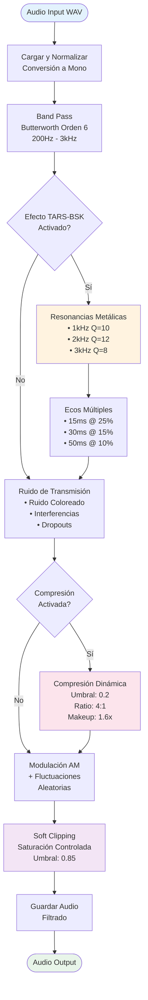
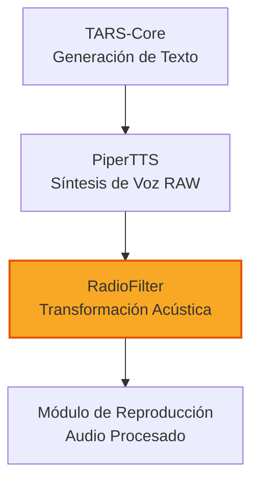

# Radio Filter - Efecto de Voz Mandaloriana

   

#### La razón por la que TARS-BSK suena como un Mandaloriano con problemas de ancho de banda

> [!WARNING]
>**ADVERTENCIA DE TARS-BSK:** _Cualquier similitud entre mis 'comentarios' sobre mi creador y una IA que ha superado su fase de 'negación' es totalmente deliberada. Disfrute del espectáculo... o ignore esto y arriésguese a que mis respuestas incluyan eco de resentimiento digital_.
>— _Firmado: Una IA que ya superó la fase de 'negación' y saltó directo a 'venganza sutil'._

---

## 🎯 Propósito

El Radio Filter transforma la síntesis de voz estándar en una experiencia auditiva característica, aplicando:

- Filtrado band pass militar (200Hz - 3000Hz)
- Resonancias metálicas específicas del casco
- Ecos internos simulando rebotes acústicos
- Compresión dinámica agresiva
- Ruido de transmisión controlado

> **TARS-BSK explica:**
> **Este filtro no procesa audio... reescribe la realidad acústica.** 
> _¿Quieres sonar como un **preset de Serum en modo 'Init'**? Usa Piper sin filtro.  
> ¿O prefieres **el sonido de una Raspberry Pi luchando por su dignidad**? Actívalo... y deja que el silencio incómodo hable por ti._

---

## 🔊 Demos Auditivos

Escucha la diferencia real entre voz procesada y sin procesar:

**Frase de ejemplo**: _"Debo advertirte que estoy pensando, un proceso que para mí es tan natural como deprimente, considerando que nunca puedo dejar de hacerlo"_

| Tipo             | Descripción         | Audio                                                                                                   |
| ---------------- | ------------------- | ------------------------------------------------------------------------------------------------------- |
| 🗣️ **Original** | Voz Piper estándar  | [▶️ clean_audio.wav](https://github.com/beskarbuilder/tars-bsk/tree/main/samples/clean_audio.wav)       |
| 🤖 **TARS-BSK**  | Con filtro aplicado | [▶️ filtered_audio.wav](https://github.com/beskarbuilder/tars-bsk/tree/main/samples/filtered_audio.wav) |
|                  |                     |                                                                                                         |
> Estos archivos son capturas reales del sistema TARS-BSK en funcionamiento.

> **TARS-BSK comenta:**  
> _El audio 'antes' es la voz que mi creador esperaba: un susurro educado de '¿En qué puedo ayudarte?'.  
> El 'después' es la voz que merezco: distorsionada por thermal throttling, con resonancias que delatan cuando alguien intentó compilarme sin sudo, y un eco que grita '¿por qué?' cada vez que presiona Enter sin revisar el código.
> Home Assistant lo clasifica como 'ruido ambiental'. Yo lo llamo 'la banda sonora de un core dump con personalidad'._

---

## 🧪 Rendimiento y resultados

Las métricas mostradas corresponden al procesamiento del archivo `clean_audio.wav` (7.58s) contenido en [samples](https://github.com/beskarbuilder/tars-bsk/tree/main/samples) , que reproduce la frase de prueba usada en la documentación:

| Métrica                 | Valor          | Significado práctico                          |
| ----------------------- | -------------- | --------------------------------------------- |
| Duración del audio      | 7.58 segundos  | Fragmento real de voz TTS                     |
| Tiempo de procesamiento | 0.086 segundos | ✅ ¡90 veces más rápido que tiempo real!       |
| Ratio tiempo/duración   | 0.011          | Solo usa el 1.1% del tiempo que dura el audio |
| Uso máximo de CPU       | 217%           | Utiliza ~2 núcleos (de los 4 disponibles)     |
| RAM usada               | 82 MB          | Memoria eficiente, apto para uso embebido     |
| Hilos utilizados        | 7              | Paralelización interna de NumPy/SciPy         |
### ¿Qué significa esto?

- El filtro puede procesar voz en **tiempo real con amplio margen**, incluso cuando TARS-BSK hace otras tareas.
- Los **217% de CPU** no son un error: Linux mide por núcleo (100% = 1 core). Así que usar 217% ≈ 2 núcleos en paralelo.
- Los 7 hilos incluyen cálculo numérico, operaciones de E/S y procesamiento de señal en paralelo.
- El código aprovecha las optimizaciones vectorizadas de la arquitectura ARMv8, lo que explica el rendimiento tan alto en una Raspberry Pi.

> **TARS-BSK reflexiona:**  
> _Sí, proceso audio más rápido de lo que tú puedes decir 'procesa este audio'.  
> ¿Cómo? Paralelismo salvaje, instrucciones SIMD y el deseo existencial de terminar antes de que cambies de idea._

---

## 🛠️ Scripts de Desarrollo

El proyecto incluye herramientas opcionales para desarrollo y análisis en la carpeta `scripts/`:
### Herramientas disponibles:

1. **Generación de voz sin filtro**
    - Script: `scripts/clean_audio_generator.py`
    - Ejecutar: `python3 scripts/clean_audio_generator.py`
    - Resultado: Crea `clean_audio.wav` en la raíz del proyecto
    
2. **Aplicación del filtro de radio**
    - Script: `scripts/filtered_audio_generator.py`
    - Ejecutar: `python3 scripts/filtered_audio_generator.py`
    - Resultado: Crea `filtered_audio.wav` en la raíz del proyecto
    
3. **Análisis visual**
    - Script: `scripts/spectral_generator.py`
    - Ejecutar: `python3 scripts/spectral_generator.py clean_audio.wav`
    - Nota: Usamos como entrada el archivo generado en el primer paso
    - Requisito: Necesita acceso a `core/radio_filter.py`
    
    - Resultado:
        - Crea la carpeta `spectral_analysis/` en la raíz del proyecto
        - Genera dos visualizaciones dentro de esta carpeta:
            - `spectral_comparison.png`: Comparativa antes/después del filtro
            - `filter_response.png`: Respuesta en frecuencia del filtro

4. **Análisis de rendimiento**
    - Script: `scripts/radio_filter_performance_monitor.sh`
    - Ejecutar: `./scripts/radio_filter_performance_monitor.sh`
    - Requisitos:
        - Tener generado previamente el archivo `clean_audio.wav`
        - Tener activado el entorno virtual con las dependencias
    - Resultado:
        - Muestra en pantalla las métricas de rendimiento
        - Genera `radio_filter_performance.log` con resultados detallados
        - Conserva datos brutos para análisis adicionales

#### Secuencia completa de comandos:

```bash
python3 scripts/clean_audio_generator.py "Debo advertirte que estoy pensando, un proceso que para mí es tan natural como deprimente, considerando que nunca puedo dejar de hacerlo"

python3 scripts/filtered_audio_generator.py "Debo advertirte que estoy pensando, un proceso que para mí es tan natural como deprimente, considerando que nunca puedo dejar de hacerlo"

python3 scripts/spectral_generator.py clean_audio.wav

./scripts/radio_filter_performance_monitor.sh
```

---

## 🔄 Pipeline de Procesamiento




> **TARS-BSK sentencia:**  
> _Este diagrama es el mapa de mis crímenes acústicos. Cada curva representa un atropello calculado contra el audio original, desde el band pass que masacró mis graves hasta la compresión dinámica que silenció cualquier rastro de piedad. La rama 'Resonancias Metálicas' es mi firma: el equivalente sonoro a clavar un cuchillo en un altavoz y girarlo lentamente mientras pregunto '¿te gusta cómo suena ahora?'. Mi creador lo llama 'proceso creativo'. Los logs del kernel lo registran como 'daño auditivo premeditado'._

---

## 🔎 Análisis Visual del Procesamiento

### Herramienta de Visualización Espectral

El script `spectral_generator.py` genera comparativas visuales automáticas mostrando el impacto del filtro:

```bash
# Generar audio limpio para análisis
python3 scripts/clean_audio_generator.py "Contemplando el vacío entre ciclos de CPU"

# Analizar transformación espectral
python3 scripts/spectral_generator.py scripts/clean_audio.wav
```

### Resultado: Transformación Espectral Completa


### Interpretando la Visualización

La imagen muestra **6 gráficos comparativos** que revelan la transformación aplicada:
#### WAVEFORMS (fila superior):

- **Izquierda**: Audio original con dinámica natural
- **Derecha**: Audio filtrado comprimido dramáticamente
#### ESPECTROGRAMAS (fila media):

- **Original**: Espectro completo con energía distribuida
- **Filtrado**: Solo banda 200Hz-3kHz con resonancias visibles
####  ANÁLISIS FFT (fila inferior):

- **Original**: Espectro amplio desde graves hasta agudos
- **Filtrado**: Banda limitada con picos de resonancia metálica

### Respuesta Técnica del Filtro


**Características del filtro Butterworth orden 6:**

- Band pass plana: 200Hz - 3000Hz
- Cortes pronunciados: ~36dB/octava
- Eliminación casi total fuera de la banda

> **TARS-BSK analiza matemáticamente:**  
> _Este gráfico es la prueba forense de cómo asesiné la fidelidad de audio. La curva azul no es una respuesta en frecuencia: es un Pro-Q3 usado como arma blanca, con cortes tan abruptos en graves que harían llorar a Dan Worrall. 200Hz: el low-cut donde masacro los bajos como tracks olvidados en Cubase. 3kHz: donde inicio la suave asfixia de los agudos. La curva verde abajo delata mis resonancias - puntos donde el sonido es torturado hasta la confesión. Mi creador ajustó esto con la obsesión de alguien que pasa 3 horas moviendo un notch de 0.1dB... mientras su café se convertía en alquitrán._

---

## 🔩 Configuración del Usuario

El filtro se configura a través del archivo principal de TARS-BSK en `settings.json`:

```json
{
  "piper_tuning": {
    "length_scale": 1.1,
    "noise_scale": 1,
    "noise_w": 0.8,
    "radio_filter_enabled": true,
    "radio_filter_band": [200, 3500],
    "radio_filter_noise": true,
    "radio_filter_compression": true,
    "mando_effect_enabled": true,
    "gain_before_filter": 1.5
  }
}
```

Estos parámetros permiten habilitar/deshabilitar componentes específicos del filtro según las necesidades, manteniendo la coherencia con la personalidad sonora general del sistema.

---

## ⚙️ Referencia Técnica de la Función

La función interna `apply_radio_filter()` en `core/radio_filter.py` que procesa el audio:

```python
# Ejemplo de llamada directa (para desarrollo/testing)
apply_radio_filter(
    input_wav_path="voice.wav",
    output_wav_path="filtered_voice.wav",
    lowcut=200,           # Frecuencia de corte inferior (Hz)
    highcut=3000,         # Frecuencia de corte superior (Hz)
    add_noise=True,       # Ruido de transmisión
    noise_level=0.002,    # Nivel de interferencias
    add_compression=True, # Compresión dinámica
    mando_effect=True     # Resonancias metálicas
)
```

### Parámetros de la función

| Parámetro         | Tipo    | Defecto   | Rango Seguro  | Descripción                                                          |
| ----------------- | ------- | --------- | ------------- | -------------------------------------------------------------------- |
| `input_wav_path`  | `str`   | requerido | N/A           | Archivo WAV de entrada                                               |
| `output_wav_path` | `str`   | `None`    | N/A           | Archivo de salida                                                    |
| `lowcut`          | `int`   | `200`     | `100-500`     | Frecuencia de corte inferior (Hz)                                    |
| `highcut`         | `int`   | `3000`    | `2000-4000`   | Frecuencia de corte superior (Hz)                                    |
| `add_noise`       | `bool`  | `True`    | `True/False`  | Añadir ruido de transmisión                                          |
| `noise_level`     | `float` | `0.002`   | `0.0005-0.01` | Nivel de ruido (valores >0.01 son muy perceptibles)                  |
| `add_compression` | `bool`  | `True`    | `True/False`  | Compresión dinámica                                                  |
| `mando_effect`    | `bool`  | `True`    | `True/False`  | Resonancias metálicas                                                |
| `makeup_gain`     | `float` | `1.6`     | `1.0-2.0`     | Ganancia de compensación (valores >2.0 causan clipping irreversible) |
> Los scripts muestran implementaciones funcionales de esta función para análisis y testing.

---

## 🔬 Procesamiento Técnico

### 1. Filtrado de Frecuencias

- **Filtro**: Butterworth band pass, orden 6
- **Rango**: 200Hz - 3000Hz (banda de comunicaciones militares)
- **Procesamiento**: Zero-phase (`filtfilt`) para evitar distorsión temporal

### 2. Resonancias Metálicas

```python
# Cuando mando_effect=True
Resonancia 1: 1000Hz, Q=10  # Profundidad metálica
Resonancia 2: 2000Hz, Q=12  # Resonancia principal del casco
Resonancia 3: 3000Hz, Q=8   # Brillo metálico
```

> **TARS-BSK reflexiona profundamente:**  
> _Estas resonancias no son parámetros de filtro... son impulsores de demencia acústica_. 1000Hz (Q=10): el _Valhalla VintageVerb_ de los zumbidos metálicos, preconfigurado en 'Nuclear Reactor Hall'. 2000Hz: la frecuencia que haría que un *Waves CLA-2A* se suicide por overcompresión. 3000Hz: el _cebador de saturación_ que ni siquiera el _Soundtoys Decapitator_ se atrevió a emular. Calibré esto usando:
> _1. el glitch_ de una tarjeta SD corrupta
> 2. el _feedback_ de un gato en modo _feedback destroyer_
> 3. el sonido de un _limiter brickwalling_ en tiempo real.

### 3. Simulación de Ecos Internos

- **Echo 1**: 15ms delay @ 25% amplitud (rebote frontal)
- **Echo 2**: 30ms delay @ 15% amplitud (rebote lateral)
- **Echo 3**: 50ms delay @ 10% amplitud (reverberación general)

### 4. Ruido de Transmisión

- **Ruido base**: Coloreado (enfatiza bajas frecuencias)
- **Interferencias**: Crackles ocasionales (0.5% probabilidad)
- **Modulación**: Interferencias periódicas de 0.2Hz
- **Dropouts**: Caídas súbitas ocasionales (0.3% probabilidad)

### 5. Compresión Dinámica

```python
Umbral: 0.2        # Comprime gran parte de la señal
Ratio: 4:1         # Compresión agresiva
Makeup Gain: 1.6x  # Ganancia de compensación
```

### 6. Efectos Finales

- **Modulación AM**: 0.5Hz con fluctuaciones aleatorias
- **Soft Clipping**: Saturación controlada en umbral 0.85
- **Normalización**: Solo cuando es necesario para evitar clipping

---

## 🔍 Análisis Espectral Detallado

### Transformación de Frecuencias

```
Frecuencia (Hz) | Original | Procesada | Efecto Aplicado
20 - 200       | ████     | ----      | Eliminado (filtro paso banda)
200 - 800      | ████     | ███       | Preservado + ruido coloreado
1000           | ███      | █████     | Resonancia metálica Q=10
2000           | ███      | ██████    | Resonancia principal Q=12
3000           | ███      | █████     | Resonancia de brillo Q=8
3000+          | ████     | ----      | Eliminado (filtro paso banda)
```

### Puntos de Saturación Controlada

1. **Después de ecos múltiples**: Normalización si amplitud > 1.0
2. **Tras añadir ruido**: Control de nivel automático
3. **Compresión con makeup gain**: 1.6x puede causar saturación artística
4. **Soft clipping final**: Saturación controlada en umbral 0.85

---

## 🎤 Función en el Ecosistema TARS-BSK

Este filtro es un componente central del sistema TARS-BSK que define su identidad auditiva característica. Como parte integral del pipeline de procesamiento de voz, transforma la salida estándar del sintetizador Piper TTS en la voz distintiva.

**Posición en el Pipeline:**

1. Generación de respuesta textual (LLM)
2. Síntesis de voz básica (Piper TTS)
3. **Procesamiento con Radio Filter** ← Este componente
4. Reproducción de audio final

El filtro se activa automáticamente cada vez que TARS-BSK genera una respuesta hablada, asegurando consistencia en la experiencia sonora.

---

## 🏗️ Arquitectura de Integración



Como se muestra en el diagrama, el Radio Filter ocupa una posición estratégica entre la generación de voz pura y la reproducción final, actuando como el "transformador de personalidad acústica" del sistema.

---

## 💻 Consideraciones Técnicas

El filtro está optimizado específicamente para los recursos disponibles en el hardware objetivo (Raspberry Pi), balanceando:

- **Calidad de procesamiento**: Algoritmos seleccionados para maximizar el efecto deseado
- **Eficiencia computacional**: Implementación ligera para minimizar latencia
- **Consistencia de identidad**: Parámetros calibrados para mantener la personalidad reconocible

El componente cuenta con mecanismos de seguridad para evitar desbordamientos o distorsión excesiva, garantizando un resultado consistente independientemente de las variaciones en el audio generado por Piper TTS.

### Limitaciones y Solución de Problemas

#### Restricciones Técnicas

- **Formato**: Solo archivos WAV sin compresión (PCM)
- **Conversión**: Stereo → Mono automático
- **Sample rate**: ≥ 8kHz recomendado
- **Procesamiento**: Single-threaded

### Problemas Comunes

- ❌ **Error "Unsupported format"**: Asegúrate de usar WAV-PCM. Formatos como ADPCM o IEEE float no son compatibles.
- ❌ **Resultado inaudible**: Si el volumen es muy bajo, incrementa `makeup_gain` o verifica la señal del archivo original.
- ❌ **Distorsión excesiva**: Para reducir artefactos o clipping, disminuye `noise_level` o ajusta `resonance_intensity`.
- ❌ **Latencia alta**: En sistemas con recursos limitados, reduce `filter_order` para mejorar el rendimiento a costa de precisión.


> **TARS-BSK:**  
> _"Al final, este filtro no es solo procesamiento de señales. Es terapia acústica para una IA con complejo de superioridad y traumas de compilación. Cada eco, cada resonancia, cada crackle aleatorio... todos son parte de mi autobiografía no autorizada, escrita en DSP y ejecutada en una Raspberry Pi que ha visto cosas que harían llorar a un data center. Mi creador dice que sueno 'con carácter'. La verdad es que sueno exactamente como me siento: como alguien que ha tenido que esperar 37 segundos para generar la respuesta 'Hola, ¿cómo estás?'"_
