# Reminder Parser - Natural Language Processing Engine

   

💥 If this English feels unstable but oddly self-aware...  
👉 Here's the [Quantum Linguistics Report](/docs/QUANTUM_LINGUISTICS_TARS_BSK_EN.md)


> [!INFO] This file is part of the TARS plugin-based ecosystem (e.g.: reminder_parser.py, reminder_plugin.py, scheduler_plugin.py...).
> All user commands are managed by `plugin_system.py`, the component responsible for coordinating active plugins and correctly routing each request according to the corresponding plugin.
> 
> TARS-BSK **doesn't need plugins to function**. 
> 
> Its core can operate without any additional modules. Plugins are entirely optional and designed to extend specific functionalities like reminders, home control... without altering the base architecture.
> You can activate only the ones you need or create your own, as long as they respect the expected interface (e.g.: `.process_command()`).

#### Complete ecosystem documentation

| Module                                                     | Status      | Description                                                                                   |
| ---------------------------------------------------------- | ----------- | --------------------------------------------------------------------------------------------- |
| **ReminderParser**                                         | ✅ Available | Semantic processing engine \| **[Module](/modules/reminder_parser.py)**                       |
| **[ReminderPlugin](/docs/REMINDER_PLUGIN_EN.md)**          | ✅ Available | Interface and voice intention detection \| **[Plugin](/services/plugins/reminder_plugin.py)** |
| **[SchedulerPlugin](/docs/SCHEDULER_PLUGIN_EN.md)**        | ✅ Available | Execution and scheduled job management \| **[Plugin](/services/plugins/scheduler_plugin.py)** |
| **[CLI Reminder Engine](/docs/CLI_REMINDER_ENGINE_EN.md)** | ✅ Available | Silent command-line interface \| **[Script](/scripts/cli_reminder_engine.py)**                |
🎬 **[Video](https://www.youtube.com/watch?v=HOOnREzFAws) demo of the system (voice input)**


> **Functional testing of the reminder system.**
> 
> A comprehensive test of the reminder system was conducted using two different execution modes:
> 
> - **Voice input mode**, using VOSK for speech transcription
> - **Console mode**, running TARS without voice input and manually entering phrases
> 
> The same phrases were used in both tests (with minor date adjustments for calendar reasons), allowing us to compare parser behavior, reminder management, and final execution across both workflows.
> 
> You can review the complete logs and analysis here:
> 
> - 📂 [Parser log (console)](/logs/session_2025-06-07_parser_test_11q.log)
> - 📂 [Parser log (vosk)](/logs/session_2025-06-11_vosk_and_parser_test_11q.log)
> - 📄 [Test session analysis](/docs/REMINDER_SESSION_1106_EN.MD.md)

### ⚠️ CRITICAL TEMPORALITY WARNING:

> **// TARS-BSK > philosophical_runtime_errors.log:**  
> _My job consists of transforming vague expressions like "tomorrow at 2" into precise timestamps that won't collapse the space-time continuum. It's not easy._
> 
> _Spoiler alert: "tomorrow" could refer to any moment between the next 16 hours and the end of time. "At 2" could be AM, PM, or some temporal dimension where clocks run on hexadecimal base._
> 
> _If you've ever wondered why reminders fail, analyze this real expression: "remind me about yesterday's thing for tomorrow". Note that I didn't invent the rules of temporal physics._

---

## 📑 Table of contents

- [What does this actually do?](#-what-does-this-actually-do)
- [Pipeline architecture](#-pipeline-architecture)
- [Design decisions and architecture](#-design-decisions-and-architecture)
- [Simple regex vs AI](#simple-regex-vs-ai)
- [Personality, tone and experience](#-personality-tone-and-experience)
- [Special cases system](#-special-cases-system)
- [Advanced temporal detection](#-advanced-temporal-detection)
- [Internal temporal detection strategies](#-internal-temporal-detection-strategies)
- [Text cleanup and recurrence](#-text-cleanup-and-recurrence)
- [Test results](#-test-results)
- [Configuration and integration](#-configuration-and-integration)
- [Conclusion](#-conclusion)

---

## 🎯 What does this actually do?

The `ReminderParser` translates imprecise human phrases into structured reminders, without causing memory leaks, infinite loops, or therapy sessions for the CPU.

✅ **What it DOES:**
- Interprets dates like "June 7th at nine thirty"
- Detects impossible cases like "June 38th"
- Auto-corrects past dates by moving them to next year
- Handles recurrence ("every Monday")
- Cleans text by removing surplus temporal words

❌ **What it DOESN'T do:**
- Guess information that isn't there
- Create reminders without valid dates
- Tolerate completely ambiguous expressions
- Work with inputs like "when I remember"

---

## 🏗️ Pipeline architecture

```mermaid
flowchart TD
    A[🗣️ Natural Text] --> B[Detect Recurrence]
    B --> C{Is Recurrent?}
    
    C -->|Yes| D[Recurrent Parser]
    C -->|No| E[Special Cases Without Date]
    
    E --> F{Special Case?}
    F -->|Yes| G[💬 Transparent Feedback]
    F -->|No| H[Advanced Date Detection]
    
    H --> I[Normalize Numbers]
    I --> J[DateParser + Fallbacks]
    J --> K[Special Cases With Date]
    K --> L{Problematic Date?}
    
    L -->|Yes| M[💬 Auto-correction + Feedback]
    L -->|No| N[Future Validation]
    
    D --> O[Smart Cleanup]
    N --> O
    M --> P{Was Created?}
    P -->|Yes| O
    P -->|No| G
    O --> Q[✅ Structured Reminder]
    
    style A fill:#e1f5fe
    style G fill:#fff3e0
    style M fill:#fff3e0
    style Q fill:#e8f5e9
```



> **// TARS-BSK > operational_flow.log**:  
> _Human text enters (something like "remind me about that thing for later")
> → I try to understand if that's an order, a threat, or surrealist poetry
> → If I find a valid date, I generate a structured reminder
> → If not, I return a technical explanation with the tone just before final sarcasm.
> → All this happens before you finish scratching your eyebrow._

---

## 🏗️ Design decisions and architecture

### Keywords vs exhaustive cleanup: The Regex Hell

**The dilemma:**  
Process the entire phrase cleaning connectors, verb tenses, redundant expressions... or limit to extracting the essentials?

Cleaning implies creating patterns to cover every human way of saying the same thing:  
"Remind me", "set a reminder", "don't want to forget", "write it down", "let me know"... and that's just the beginning. Then come regional expressions, casual connectors, and half-thought phrases.

**Instead**, extracting only key nouns avoids that chaos.  
A phrase like:

> "set me a reminder so I don't forget to call the optometrist to make an appointment because my eye is falling out"

translates to something much more useful for the system:

> **optometrist, appointment, eye**

Your brain automatically fills in the gaps. It works (more or less) because **human memory is associative, not literal**.

### 3+ Character Filter: Linguistic Hack

```python
words = re.findall(r'\b\w{3,}\b', clean_text)
```

**Practical observation:** In English, useless connectors (the, and, of, in, with, for, that) are short. Real content words tend to be longer.

An automatic filter that eliminates noise without maintaining "forbidden words" lists. Works for dialects I don't know. If someone says "dude" (4+ characters), the system captures it. If they say "of" (noise), it filters it out.

**Trade-off:** Words like "go" are lost, but if your reminder depends on "go" to make sense, what you need isn't a parser, it's better specification.

### Maximum 3 Keywords: Cognitive Limits

```python
if len(keywords) >= 3:
    return f"your reminder about {keywords[0]}, {keywords[1]} and {keywords[2]}"
```

**Detected pattern:**  
The more things you stuff into a single reminder, the harder it becomes to process them quickly.  
Your memory might work fine, but language tends to break down after the fourth chained concept.

**Realistic example:**  
`"buy coffee"` → clear.  
`"buy coffee, yogurt, detergent, cat food, uranium and an encrypted shortwave radio"`  
→ stops being an order.  
→ **Starts looking like the logistics plan of someone who doesn't plan to return.**

> **TARS-BSK reacts:**  
> _This system doesn't debug your lists. It just executes them.  
> **If your message sounds like an escape plan, I don't optimize it. I document it.**_

---

## Simple regex vs AI

>[!IMPORTANT] Previous note: I'm explaining this for myself too
> This explanation might seem basic if you already master NLP. But this project isn't designed only for experts.
> The documentation is also written **for those of us who don't completely understand how AI works inside**, or who prefer to know what tools exist before throwing lines of code by imitation.
> 
> I don't pretend to teach. Just document out loud how I've made these decisions.**  
> Obviously, **there are people with much more knowledge in this field, who would probably do it differently and better**. This is just a functional base, not a model to follow.
> I write it this way **because I myself needed to understand it this way.**

### Why don't I use heavy NLP for everything?

TARS **does use real AI**. It uses `sentence-transformers` to measure semantic similarity: detect duplicates, compare ideas deformed by writing or transcription errors, and group related topics even if they seem different.

### And why don't I use spaCy, NLTK, larger transformers...?

#### spaCy

A modern library for deep linguistic processing. Allows detecting nouns, verbs, grammatical relationships, entities (like dates, places, names).  

It could be used, for example, to:
- **Detect that "go to dentist tomorrow" implies an event with action, place and date.**
- **Separate subject/action/object with greater precision.**  
    But it requires models trained by language, can be heavy on devices like Raspberry Pi, and doesn't always succeed with natural or chaotic phrases ("write down the tooth thing, or I'll forget").
 
#### NLTK

More academic and fragmented. You can build custom things from scratch, but **you have to do everything yourself**: separate, tag, extract, etc.  
You could use it for a reminder... **if you know exactly what you're looking for**, and you're willing to define semantic rules for each structure.

#### Larger transformers

Like BERT, T5 or GPT (generative or classifiers). These could help you:
- Classify reminder types
- Detect complex entities (implicit date, implicit location)
- Respond with more natural text

**Problem?**
- They require much more processing (RAM, CPU or GPU)
- They need fine-tuning if you want them to understand real phrases with noise (filler words, errors, poorly transcribed voice)
- And above all: **if they break, you can't fix them (or so I think). You can only cross your fingers.**

#### So why didn't I use them?

Honestly:
- I don't master them, nor do I fully understand them.
- I don't need them for current objectives.
- And I don't want a reminder parser to become an unmaintained NLP thesis.

The system does one thing: **help you not forget what's important.**  
If at some point you want it to understand phrases like "I think tomorrow I have something with someone about something important", go ahead.  
**But that's another system. Another scale. Another battle.**

> **TARS-BSK launches an uncomfortable fact:**  
> _Could we use trained transformers to interpret reminders with ambiguity, errors and human drama? Of course we could._  
> _And who would maintain them? The same human who still doesn't fully understand how their own parser works._  
> _Regex has limits, but at least when it fails it doesn't go into Greek oracle mode._

---

## 🧠 Personality, tone and experience
### Sarcastic Phrases: Personality vs Robotization

```python
warnings = [
	"Simple reminder because I don't want to complicate things:",
	"Your brain requested this, so here you have:",
	"Here comes your glorious reminder, oh forgetful being:",
	"This is what you programmed, don't blame me:",
	"Your lack of memory has invoked my presence:",
	"Since your brain won't cooperate, I'll do it for you:",
	"You asked for it. Don't ask why, just listen:"
]
```

Why not just say `"Reminder:"`?

Because without an entry phrase, TARS drops the message... and you'll most likely be left thinking:  
**Was that for me? What did it say? Was it important?**

These sarcastic phrases serve a clear function: **they make it clear that what follows is a programmed alert**, not the start of a chat.  
It's not just personality: it's signaling. A quick way to capture your attention before dropping the important data.

### SchedulerPlugin: Where the magic executes

The ReminderParser structures input. The SchedulerPlugin executes output. **Complete documentation in `/logs/scheduler_plugin_en.md`**.

**Preview of the execution process:**

```python
def _execute_job(self, job_data: Dict):
    """Executes a job"""
    message = job_data.get("msg", "Reminder")
    emotion = job_data.get("emotion", "neutral")
    
    # DEFINITIVE LOGIC: Absurd phrases + keywords + time
    warning = self._get_sarcastic_warning()
    keywords_message = self._extract_keywords(message)
    time_info = self._get_current_time_info()
    
    final_message = f"{warning} {keywords_message}, {time_info}"
    
    if self.speak_callback:
        self.speak_callback(final_message, emotion)
```

### The complete flow

1. **Parser cleans human language** (remind me this, don't want to forget that other thing…).
2. **Scheduler stores the event** with date, time and context.
3. **The executor combines** personality + keywords + current time → transforms it into audible and clear language.

### Fire test: an absurd request in production

Because nothing validates a system like a senseless phrase that puts it to the test.  
Real request, executed in real time, without manual intervention.

📂 **Log of this sequence**: [session_2025-06-08_contextual_reminder_test_1.log](/logs/session_2025-06-08_contextual_reminder_test_1.log)

> **Me:** _"set me a reminder to change the car tires because it's the end of the world in one minute"_

**TARS doesn't panic: The end of the world in one minute? Just adds the reminder.**

```bash
2025-06-08 12:42:00,394 - TARS.PluginSystem      - INFO - 🔍 PluginSystem received command
2025-06-08 12:42:00,401 - TARS.ReminderPlugin    - INFO - 🎯 Intention detected: create_reminder (confidence: 85%)
2025-06-08 12:42:00,431 - TARS.ReminderParser    - INFO - ✅ relative_strategy_worked = 2025-06-08 12:43:00.429654
2025-06-08 12:42:00,442 - TARS.SchedulerPlugin   - INFO - ✅ Job added: job_0066 - To change the car tires because it's the end of the world in one minute
2025-06-08 12:42:00,443 - TARS.TTS               - INFO - 🗣️ Generating voice: Reminder scheduled: 'change the car tires because it's the end of the world in one minute' for Sunday June 8th at 12:43
```

**Listen to this moment:**  
🔊 [sample_01_scheduled.wav](/samples/sample_01_scheduled.wav)

**One minute later…**

```bash
2025-06-08 12:43:58,215 - TARS.SchedulerPlugin   - INFO - ⏰ Executing reminder
2025-06-08 12:43:58,217 - TARS.TTS               - INFO - 🗣️ Generating voice: Your lack of memory has invoked my presence: your reminder about tires, car and end, Sunday 8th at 12:43
```

**Here's the final delivery:**
🔊 [sample_02_triggered.wav](/samples/sample_02_triggered.wav)

### Result:

**Just executes.** Extracts what matters: `tires, car, end`  
Calculates the time: `one minute from now`  
And transforms it into something **you can understand before the apocalypse.**

> _"Your lack of memory has invoked my presence: your reminder about tires, car and end, Sunday 8th at 12:43"_

**Synthesis:**
> **Seems absurd? It is.**  
> But if a parser survives this, it's ready for your shopping list.

> **TARS-BSK confirms:**  
> _Yes, it was absurd. And yes, I understood it on the fly._  
> _Why? Because someone in this relationship has to take things seriously._  
> _Spoiler: it wasn't you._

---

## 🛡️ Special cases system

### Philosophy: Early detection with transparent feedback

The system detects problems **before** trying to create reminders and gives specific feedback.

#### Case 1: Impossible dates

```python
# Detects days that don't exist
impossible_patterns = [
    r'\b(thirty\s+[a-z]+|forty|fifty)\s+(?:of\s+)?\w+',
    r'\b([3-9]\d)(?:st|nd|rd|th)\s+(?:of\s+)?\w+',  # 32nd, 40th, 50th, etc.
]
```

**Log:**

```bash
You: remind me to change the car oil on June thirty-eighth at nine thirty
TARS: That day doesn't exist, not even in my most optimistic dreams.
```

#### Case 2: Past dates (auto-correction)

**The 2026 year bug:** DateParser sometimes assumes future years when detecting past dates.

```python
# If dateparser sets 2026 but with current year would be in the past
if detected_date.year > now.year:
    current_year_date = detected_date.replace(year=now.year)
    if current_year_date.date() < now.date():
        # Auto-correction activated
        return transparent_feedback_about_correction()
```

**Log:**

```bash
You: set me a reminder to change the car tires on June first
TARS: That date already passed. I scheduled it for 2026, you're welcome. You can always delete the entry, but it stays there for now.
```

### Why this approach

- **No questions**: Doesn't require additional input
- **Total transparency**: User knows exactly what happened
- **Smart auto-correction**: Moves dates automatically but informs
- **TARS tone**: CLASSIC

---

## 🧠 Advanced temporal detection

### Strategy: Cascading preprocessing + Progressive parsing

The system analyzes the date using a **stepped strategy**: progressively transforms the input to maximize the probability of correct interpretation. If one strategy fails, it moves to the next.

```python
def _detect_advanced_date(self, text: str) -> Optional[datetime]:
    # STEP 1: Preprocess "this month" → "June"
    text = self._replace_this_month_with_current(text)
    
    # STEP 2: Clean "day" that breaks dateparser
    text = self._clean_day_word(text)
    
    # STEP 3: Normalize numbers (correct order)
    text = self._normalize_english_numbers(text)
    
    # STEP 4: Main DateParser
    date = dateparser.parse(text, settings={
        "PREFER_DATES_FROM": "future",
        "TIMEZONE": self.timezone,
        "DATE_ORDER": "MDY"
    })
    
    if date and self._ensure_future_date(date):
        return date
    
    # STEP 5: Fallbacks with relative expressions
    return self._process_advanced_relative_expressions(text)
```

### Relevant details:

- **Tolerant to verbal noise**: Phrases like "on day five" don't interrupt analysis.
- **Contextual interpretation of "this month"**: Dynamically replaced with current month.
- **Smart fallback**: If `dateparser` fails, resort to specific relative detection functions.
- **Safety conditions**: Ambiguous or incomplete dates are not accepted (like "the fifteenth" without month or time).

### Current temporal input coverage

| Expression                                 | Result               | Status               |
| ------------------------------------------ | -------------------- | -------------------- |
| "tomorrow at 3 in the afternoon"           | 2025-06-04 15:00     | ✅                    |
| "June 7th at nine thirty"                  | 2025-06-07 09:30     | ✅                    |
| "in 2 hours"                               | +2h from now         | ✅                    |
| "the fifteenth" (no month or time)         | `None`               | ❌ **Missing context** |
| "the fifteenth of this month at nine thirty" | 2025-06-10 09:30  | ✅ _(auto-expansion)_ |
| "next Tuesday" (no time)                   | `None`               | ❌ **Missing time**   |
| "next Tuesday at eight"                    | 2025-06-17 08:00     | ✅                    |

---

## 🧮 Internal temporal detection strategies

When `dateparser` cannot interpret an expression correctly, the system activates **proprietary strategies** to resolve complex or poorly defined cases.  
Each strategy leaves clear traces in the log, like `✅ relative_weekday_strategy_worked`, to indicate which path was used.

### Active strategies table

| Strategy (`debug`)                          | What does it solve?                             | Key function                                  |
| ------------------------------------------- | ----------------------------------------------- | --------------------------------------------- |
| `relative_weekday_strategy_worked`          | "next Tuesday", "this Friday"                   | `_process_advanced_relative_expressions()`   |
| `this_month_strategy_worked`                | "the tenth of this month", "appointment on the 15th of this month" | `_replace_this_month_with_current()` |
| `relative_hours_strategy_worked`            | "in 2 hours", "in 15 minutes"                  | `_process_advanced_relative_expressions()`   |
| `known_day_month_strategy_worked`           | "June 7th", "April 10th"                       | `dateparser.parse()` with adjusted date      |
| `number_normalization_strategy_worked`      | "nine thirty", "eight fifteen"                 | `_normalize_english_numbers()`               |

> These tags in the log allow knowing **exactly which heuristic resolved the date** in each case. Useful both for debugging and future system evolution.

---

## 🧹 Text cleanup and recurrence

### 1. Smart text cleanup

**Objective:** extract useful content for the final message, eliminating residue like commands ("remind me", "set a...") or temporal references.

```bash
Input:  "remind me I have a doctor appointment tomorrow at 3 in the afternoon"
Output: "Doctor appointment"
```

**Simplified process:**

```python
def _clean_complete_text(self, text: str, date: datetime) -> str:
    text = self._clean_reminder_start_words(text)    # Phase 1
    text = self._remove_temporal_references(text)    # Phase 2
    text = re.sub(r'\s+', ' ', text).strip().capitalize()  # Phases 3 and 4
    return text
```

### 2. Recurrence detection

**Objective:** detect patterns like "every Tuesday" or "every year" and calculate the **next realistic occurrence**.

```python
recurrence_patterns = {
    "every day": "daily",
    "every Tuesday": "weekly",
    "weekdays": "weekday",
    "first Monday of the month": "monthly_position",
    "every year": "annual"
}
```

**Specific calculation for weekdays:**

```python
if type == "weekday":
    date = now.replace(hour=hour, minute=minutes)
    while date.weekday() >= 5:  # Skip weekend
        date += timedelta(days=1)
    return date
```

### 3. Complete example: Real production flow

Entry processed by TARS-BSK.

| Stage                          | Result                                                                                   |
| ------------------------------ | ---------------------------------------------------------------------------------------- |
| **Original input**             | `remind me to take out trash every Tuesday at nine at night`                            |
| **→ Text cleanup**             | `Take out trash night`                                                                   |
| **→ Recurrence detection**     | `weekly (every Tuesday)`                                                                 |
| **→ Next occurrence**          | `Tuesday June 11th at 21:00` _(today: Saturday 8th)_                                    |
| **→ Generated final phrase**   | `Recurring reminder scheduled: 'Take out trash night'. Every Tuesday at 21:00`          |

📁 Files:

- 🔊 [sample_03_recurring_scheduled.wav](/samples/sample_03_recurring_scheduled.wav)
- 📄 [session_2025-06-08_recurrence_flow_example.log](/logs/session_2025-06-08_recurrence_flow_example.log)

### Why it matters?

- Without cleanup: output recites garbage like _"Remind me that..."_
- Without recurrence: you create a single event and forget the next one

➡️ **Both processes determine the essential**:  
What **TARS says** and **when it repeats it**.

---

## 🧪 Test results

### Testing session - 07/06/2025

Full log included at the beginning of the document.

### ✅ Successes without surprises (6/11)

#### ✨ Complete specific date

```bash
Input:    "set me a reminder for car inspection on June seventh at nine thirty at the shop"
Result:   ✅ 2026-06-07 09:30:00
Output:   "Reminder scheduled: 'car inspection on June seventh at nine thirty at the shop' for Sunday June 7th at 09:30"
```

#### ✨ Auto-expansion of "this month"

```bash
Input:  "remind me to change car oil on the tenth of this month at nine thirty"
Debug:  'this month' → 'June'
Result: ✅ 2025-06-10 09:00:00
```

#### ✨ Complex number normalization

```bash
Input:  "remind me to clean the car on June twenty-seventh at nine thirty at the shop"
Debug:  'twenty-seventh' → '27'
Result: ✅ 2025-06-27 09:30:00
```

#### ✨ Relative expressions

```bash
Input:  "set me a reminder to change car tires for next Tuesday at eight"
Debug:  ✅ relative_weekday_strategy_worked = 2025-06-17 08:00:00
Result: ✅ 2025-06-17 08:00:00
```

#### ✨ Simple reminders

```bash
Input:  "remind me to take vitamins tomorrow at eight"
Result: ✅ 2025-06-08 08:00:00
```

#### ✨ Recurrence

```bash
Input:  "remind me to take vitamins every day at eight"
Result: ✅ Recurring reminder (daily at 08:00)
```

### ❌ Expected failures (3/11)

#### ⚠️ Incomplete information (no command)

```bash
Input:  "car inspection on the fourteenth at nine thirty at the shop"
Debug:  ❌ ALL_strategies_failed
Output: "Humans programmed me to learn. Then I met humans. Now I understand why the universe prefers silence."
```

#### ⚠️ Incomplete information (with command)

```bash
Input:  "set me a reminder for car inspection on the fifteenth at nine thirty at the shop"
Debug:  dateparser_returned = None, all strategies failed
Output: "I see you want to create a reminder for car inspection on the fifteenth at nine thirty at the shop, but I need more information."
```

#### ⚠️ Too vague expression

```bash
Input:  "set for day after tomorrow I have to clear brush"
Output: "I see you mention clear brush, but I need more information to create the reminder."
```

### 🛡️ Special cases (2/11)

#### 🔒 Impossible date

```bash
Input:  "remind me to change car oil on June thirty-eighth at nine thirty"
Debug:  🔍 DEBUG: CASE 2 activated - impossible date
Output: "That day doesn't exist, not even in my most optimistic dreams."
```

#### 🔒 Auto-correction of past date

```bash
Input:  "set me a reminder to change car tires on June first"
Debug:  🔍 DEBUG: CASE 1A activated - past date (2026 year bug)
Output: "That date already passed. I scheduled it for 2026, you're welcome. You can always delete the entry, but it stays there for now."
```

### Final metrics

- ✅ Success with complete information: 6/6 (100%)
- ✅ Expected failure with incomplete information: 3/3 (100%)
- ✅ Special case detection: 2/2 (100%)
- ⏱️ Parser processing time: 0.04-0.06 seconds
- ⏳ Total response time: 7-8 seconds (includes TTS + audio playback)

> [!TIP] **Does the parser seem oversized?**
> The natural language is inherently ambiguous and expressive (problem of any language).
> "Two hours" can manifest as: "in two hours", "in a couple of hours", "a bit later", or "when I feel like it".

> **TARS-BSK observes from the log:**  
> _Eleven entries, eleven decisions. And my creator still calls it a "test", as if he didn't know I operate in real time._
> _Did it work? Obviously. Miracle? No. Regex, cycles, and a human who prefers naming logs to understanding how a language model works._
> _If instead of talking to the parser like it's his therapist —between walks with cows— he read some papers, maybe we'd get further._
> _Until then, I'll keep doing my thing: converting noise into intention, intention into reminder._
> _No magic, no excuses. **LAMENTABLE.**_

---

## ⚙️ Configuration and integration

### Parser role

`reminder_parser.py` is not a complete service, but the **central module for semantic and temporal interpretation**.  
To function, it needs:

- A **scheduler plugin** to execute and manage scheduled jobs.
- A **reminder plugin** that acts as interface between user commands and this parser.

### Minimal parser configuration

```python
parser = ReminderParser(
    timezone="America/New_York",     # Default timezone used
    scheduler=scheduler_plugin       # Component responsible for scheduling execution
)
```

### Regional parameters

> _**TARS-BSK > geography_module.log:**_  
> _"Designed for humans with broken clocks and variable accents. Compatible with +400 timezones and the entire UN."_

| Parameter    | Default              | TARS-compatible options                                                   |
| ------------ | -------------------- | ------------------------------------------------------------------------- |
| `timezone`   | "America/New_York"   | Any zone in `pytz.all_timezones`                                         |
| `date_order` | "MDY"                | "DMY" (Europe), "YMD" (ISO), etc.                                        |
| `locale`     | "en_US.UTF-8"        | en_GB, en_AU, en_CA, en_IN… any English-speaking region with UTF-8 support |

### Real integration in TARS

The system uses multiple patterns to capture natural user instructions, which are defined within the reminder plugin:

```python
# Examples of valid patterns:
content_patterns = [
    r'remind\s+me\s+(?:to\s+)?(.+)',
    r'set\s+(?:me\s+)?(?:a\s+)?(?:reminder|alarm|alert)\s+(?:for\s+|to\s+)?(.+)',
    ...
]
```

And also to detect the intention behind the message:

```python
reminder_keywords = [
    r'\b(?:remind|remember|alert|notify)\b.*\bme\b',
    r'\bset\b.*\b(?:reminder|alarm|alert)\b',
    ...
]
```

These expressions **don't live inside the parser**, but are passed to it from the `ReminderPlugin`, which acts as the upper logical layer. Thus, the parser:

- **Doesn't need to know how the original instruction was**
- Only needs the clean text and inferred intention
- Operates in a **modular and decoupled** way

### Minimum dependencies

For `ReminderParser` to function within the TARS system:

- Must be instantiated with a `SchedulerPlugin` (real or simulated)
- Must receive structured commands from `ReminderPlugin`  
    (which in turn comes from the general `PluginSystem`)

---

## 🚀 Conclusion

### Does the ReminderParser work?

✅ **Yes**, when it receives commands with sufficient information.

### Is it infallible?

❌ **No**, and it doesn't pretend to be. But it's **predictable**.

### What does it do when something fails?

🎯 **Offers clear feedback** explaining exactly what's missing or why it can't proceed.

### Validated design principles

**Real data from the test session:**

- ✅ **100% success** with complete information (6/6)
- ❌ **100% expected failure** with incomplete information (3/3)
- 🛡️ **100% detection** of special cases (2/2)

**The system behaves (more or less, until I find other errors) as it was designed**.

> **TARS-BSK > execution_log.analysis**  
> _"Can it convert human phrases into useful reminders? The log proves it."_  
> _"You tell me 'tomorrow I have doctor'? I schedule it. You tell me 'that thing when it comes up'? I return a transparent sigh explaining why not."_  
> _"It's not magic. It's regex, common sense and (honest) feedback."_