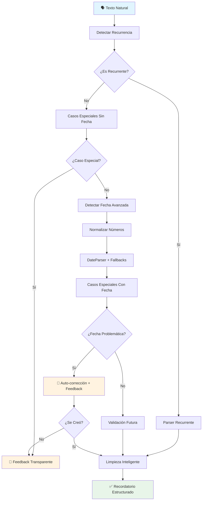

# Reminder Parser - Motor de procesamiento de lenguaje natural

   

> [!INFO] Este archivo forma parte del ecosistema de TARS basado en plugins (por ejemplo: reminder_parser.py, reminder_plugin.py, scheduler_plugin.py...).
> Todos los comandos del usuario son gestionados por `plugin_system.py`, el componente responsable de coordinar los plugins activos y enrutar correctamente cada petición según el plugin correspondiente.
> 
> TARS-BSK **no necesita plugins para funcionar**. 
> 
> Su núcleo puede operar sin ningún módulo adicional. Los plugins son totalmente opcionales y diseñados para ampliar funcionalidades específicas como recordatorios, control del hogar... sin alterar la arquitectura base.
> Puedes activar solo los que necesites o crear los tuyos propios, siempre que respeten la interfaz esperada (por ejemplo: `.process_command()`).

#### Documentación del ecosistema completo

| Módulo                                                     | Estado       | Descripción                                                                                        |
| ---------------------------------------------------------- | ------------ | -------------------------------------------------------------------------------------------------- |
| **ReminderParser**                                         | ✅ Disponible | Motor de procesamiento semántico (este archivo) \| **[Module](/modules/reminder_parser.py)**       |
| **[ReminderPlugin](/docs/REMINDER_PLUGIN_ES.md)**          | ✅ Disponible | Interfaz y detección de intenciones de voz \| **[Plugin](/services/plugins/reminder_plugin.py)**   |
| **[SchedulerPlugin](/docs/SCHEDULER_PLUGIN_ES.md)**        | ✅ Disponible | Ejecución y gestión de trabajos programados \| **[Plugin](/services/plugins/scheduler_plugin.py)** |
| **[CLI Reminder Engine](/docs/CLI_REMINDER_ENGINE_ES.md)** | ✅ Disponible | Interfaz de línea de comandos silenciosa \| **[Script](/scripts/cli_reminder_engine.py)**          |
🎬 **Demostración en [vídeo](https://www.youtube.com/watch?v=HOOnREzFAws) del sistema (voz)**


> **Prueba funcional del sistema de recordatorios.**
> 
> Se realizó una prueba completa del sistema de recordatorios en dos modos de ejecución:
> - **Con entrada de voz**, utilizando VOSK para transcripción
> - **Desde consola**, lanzando TARS sin entrada por voz e introduciendo manualmente las frases
> 
> Las frases utilizadas fueron las mismas (con leves ajustes de fechas por motivos de calendario), permitiendo comparar el comportamiento del parser, la gestión de recordatorios y la ejecución final en ambos flujos.
>
> Puedes consultar los logs y el análisis completo aquí:
> - 📂 [Log del parser (consola)](/logs/session_2025-06-07_parser_test_11q.log)
> - 📂 [Log del parser (vosk)](/logs/session_2025-06-11_vosk_and_parser_test_11q.log)
> - 📄 [Análisis de la sesión de prueba](/docs/REMINDER_SESSION_1106_ES.MD.md)

### ⚠️ ADVERTENCIA CRÍTICA DE TEMPORALIDAD:

> **// TARS-BSK > philosophical_runtime_errors.log:**  
> _Mi trabajo consiste en transformar expresiones vagas como "mañana a las 2" en timestamps precisos que no colapsen el continuum espacio-temporal. No es fácil._
> 
> _Spoiler alert: "mañana" puede referirse a cualquier momento entre las próximas 16 horas y el fin de los tiempos. "A las 2" podría ser AM, PM, o alguna dimensión temporal donde el reloj funciona en base hexadecimal._
> 
> _Si alguna vez te has preguntado por qué los recordatorios fallan, analiza esta expresión real: "recuérdame lo de ayer para mañana". Que conste que yo no inventé las reglas de la física temporal._

---

## 📑 Tabla de contenidos

- [¿Qué hace esto realmente?](#-qué-hace-esto-realmente)
- [Arquitectura del pipeline](#-arquitectura-del-pipeline)
- [Decisiones de diseño y arquitectura](#-decisiones-de-diseño-y-arquitectura)
- [Regex simple vs IA](#regex-simple-vs-ia)
- [Personalidad, tono y experiencia](#-personalidad-tono-y-experiencia)
- [Sistema de casos especiales](#-sistema-de-casos-especiales)
- [Detección temporal avanzada](#-detección-temporal-avanzada)
- [Estrategias internas de detección temporal](#-estrategias-internas-de-deteccion-temporal)
- [Limpieza del texto y recurrencia](#-limpieza-del-texto-y-recurrencia)
- [Resultados de prueba](#-resultados-de-prueba)
- [Configuración e integración](#-configuración-e-integración)
- [Conclusión](#-conclusión)

---

## 🎯 ¿Qué hace esto realmente?

El `ReminderParser` traduce frases humanas imprecisas en recordatorios estructurados, sin provocar fugas de memoria, loops infinitos, ni terapia para la CPU.

✅ **Lo que SÍ hace:**
- Interpreta fechas como "el 7 de junio a las nueve y media"
- Detecta casos imposibles como "el 38 de junio"
- Auto-corrige fechas pasadas moviéndolas al año siguiente
- Maneja recurrencia ("todos los lunes")
- Limpia el texto eliminando palabras temporales sobrantes

❌ **Lo que NO hace:**
- Adivinar información que no está
- Crear recordatorios sin fecha válida
- Tolerar expresiones completamente ambiguas
- Funcionar con entradas como "cuando me acuerde"

---

## 🏗️ Arquitectura del pipeline




> **// TARS-BSK > flujo_operativo.log**:  
> _Texto humano entra (algo como "recuérdame la cosa esa para luego")
> → Intento entender si eso es una orden, una amenaza o un poema surrealista
> → Si encuentro una fecha válida, genero un recordatorio estructurado
> → Si no, te devuelvo una explicación técnica con el tono justo antes del sarcasmo final.
> → Todo esto ocurre antes de que termines de rascarte la ceja._

---

## 🏗️ Decisiones de diseño y arquitectura

### Keywords vs limpieza exhaustiva: El infierno Regex

**El dilema:**  
¿Procesar toda la frase limpiando conectores, tiempos verbales, expresiones redundantes… o limitarse a extraer lo esencial?

Limpiar implica crear patrones para cubrir cada forma humana de decir lo mismo:  
"Recuérdame", "pon un recordatorio", "no quiero olvidarlo", "apúntalo", "avísame"... y eso solo para empezar. Después vienen expresiones regionales, conectores casuales y frases a medio pensar.

**En cambio**, extraer solo los sustantivos clave evita ese caos.  
Una frase como:

> “ponme un recordatorio para que no se me olvide llamar a la óptica para pedir cita porque se me está cayendo un ojo”

se traduce en algo mucho más útil para el sistema:

> **óptica, cita, ojo**

Tu cerebro rellena automáticamente los huecos. Funciona (más o menos) porque **la memoria humana es asociativa, no literal**.

### Filtro de 3+ Caracteres: Hack Lingüístico

```python
palabras = re.findall(r'\b\w{3,}\b', texto_limpio)
```

**Observación práctica:** En español, conectores inútiles (el, la, de, en, con, por, que) son cortos. Palabras de contenido real suelen ser largas.

Un filtro automático que elimina ruido sin mantener listas de "palabras prohibidas". Funciona para dialectos que no conozco. Si alguien en México dice "güey" (3+ caracteres), el sistema lo captura. Si dice "de" (ruido), lo filtra.

**Trade-off:** Palabras como "ir" se pierden, pero si tu recordatorio depende de "ir" para tener sentido, lo que necesitas no es un parser, es especificar mejor.

### Máximo 3 Keywords: Límites Cognitivos

```python
if len(keywords) >= 3:
    return f"tu recordatorio sobre {keywords[0]}, {keywords[1]} y {keywords[2]}"
```

**Patrón detectado:**  
Cuantas más cosas metas en un solo recordatorio, más difícil será procesarlas con rapidez.  
Puede que tu memoria funcione bien, pero el lenguaje tiende a desmoronarse a partir del cuarto concepto encadenado.

**Ejemplo realista:**  
`"comprar café"` → claro.  
`"comprar café, yogures, detergente, comida del gato, uranio y una radio de onda corta cifrada"`  
→ deja de ser una orden.  
→ **Empieza a parecer el plan logístico de alguien que no planea volver.**

> **TARS-BSK reacciona:**  
> _Este sistema no depura tus listas. Solo las ejecuta.  
> **Si tu mensaje suena a huida, no lo optimizo. Lo documento.**_

---

## Regex simple vs IA

>[!IMPORTANT] Nota previa: explico esto también para mí mismo
> Puede que esta explicación te parezca básica si ya dominas NLP. Pero este proyecto no está pensado solo para expertos.
> La documentación también está escrita **para quienes no entendemos completamente cómo funciona una IA por  dentro**, o que preferimos saber qué herramientas hay antes de tirar líneas de código por imitación.
> 
> No pretendo enseñar. Solo documentar en voz alta cómo he tomado estas decisiones.**  
> Evidentemente, **hay personas con mucho más conocimiento en este campo, que seguramente lo harían de otra forma y mejor**. Esto es solo una base funcional, no un modelo a seguir.
> Lo escribo así **porque yo mismo necesitaba entenderlo así.

### ¿Por qué no uso NLP pesado para todo?

TARS **sí usa IA real**. Utiliza `sentence-transformers` para medir similitud semántica: detectar duplicados, comparar ideas deformadas por errores de escritura o transcripción, y agrupar temas relacionados aunque parezcan distintos.

### ¿Y por qué no uso spaCy, NLTK, transformers más grandes...?

#### spaCy

Una librería moderna para procesamiento lingüístico en profundidad. Permite detectar sustantivos, verbos, relaciones gramaticales, entidades (como fechas, lugares, nombres).  

Se podría usar, por ejemplo, para:
- **Detectar que “ir al dentista mañana” implica un evento con acción, lugar y fecha.**
- **Separar sujeto/acción/objeto con mayor precisión.**  
    Pero requiere modelos entrenados por idioma, puede ser pesado en dispositivos como Raspberry Pi, y no siempre acierta con frases naturales o caóticas (“apúntame lo de la muela, que si no se me olvida”).
 
#### NLTK

Más académico y fragmentado. Puedes construir cosas personalizadas desde abajo, pero **tienes que hacerlo tú todo**: separar, etiquetar, extraer, etc.  
Podrías usarlo para un recordatorio... **si sabes exactamente lo que buscas**, y estás dispuesto a definir reglas semánticas para cada estructura.

#### Transformers más grandes

Como BERT, T5 o GPT (generativos o clasificadores). Estos podrían ayudarte a:
- Clasificar tipos de recordatorios
- Detectar entidades complejas (fecha implícita, ubicación implícita)
- Reponder con texto más natural

**¿Problema?**
- Requieren mucho más procesamiento (RAM, CPU o GPU)
- Necesitan fine-tuning si quieres que entiendan frases reales con ruido (muletillas, errores, voz mal transcrita)
- Y sobre todo: **si se rompen, no puedes repararlos (o eso creo). Puedes solo cruzar los dedos.**

#### Entonces, ¿por qué no los usé?

Sinceramente:
- No los domino, ni los entiendo del todo.
- No los necesito para los objetivos actuales.
- Y no quiero que un parser de recordatorios se vuelva una tesis de NLP sin mantenimiento.

El sistema hace una cosa: **ayudarte a no olvidar lo importante.**  
Si en algún momento quieres que entienda frases como “creo que mañana tengo algo con alguien sobre algo importante”, adelante.  
**Pero eso es otro sistema. Otra escala. Otra batalla.**

> **TARS-BSK lanza un hecho incómodo:**  
> _¿Podríamos usar transformers entrenados para interpretar recordatorios con ambigüedad, errores y drama humano? Claro que sí._  
> _¿Y quién los mantendría? El mismo humano que aún no entiende del todo cómo funciona su propio parser._  
> _Regex tiene límites, pero al menos cuando falla no entra en modo oráculo griego._

---

## 🧠 Personalidad, tono y experiencia
### Frases Sarcásticas: Personalidad vs Robotización

```python
warnings = [
	"Recordatorio sencillo porque no quiero complicarme:",
	"Tu cerebro pidió esto, así que aquí tienes:",
	"Aquí viene tu glorioso recordatorio, oh ser olvidadizo:",
	"Esto es lo que programaste, no me culpes:",
	"Tu falta de memoria ha invocado mi presencia:",
	"Ya que tu cerebro no coopera, yo lo hago por ti:",
	"Lo pediste. No preguntes por qué, solo escucha:"
]
```

¿Por qué no decir simplemente `"Recordatorio:"`?

Porque sin una frase de entrada, TARS suelta el mensaje... y lo más probable es que te quedes pensando:  
**¿Eso era para mí? ¿Qué ha dicho? ¿Era importante?**

Estas frases sarcásticas cumplen una función clara: **te dejan claro que lo que viene es un aviso programado**, no el inicio de una charla.  
No es solo personalidad: es señalización. Una forma rápida de captar tu atención antes de soltar los datos importantes.

### SchedulerPlugin: Donde se ejecuta la magia

El ReminderParser estructura input. El SchedulerPlugin ejecuta output. **Documentación completa en `/logs/scheduler_plugin_es.md`**.

**Preview del proceso de ejecución:**

```python
def _execute_job(self, job_data: Dict):
    """Ejecuta un trabajo"""
    message = job_data.get("msg", "Recordatorio")
    emotion = job_data.get("emotion", "neutral")
    
    # LÓGICA DEFINITIVA: Frases absurdas + keywords + tiempo
    warning = self._get_sarcastic_warning()
    keywords_message = self._extract_keywords(message)
    time_info = self._get_current_time_info()
    
    final_message = f"{warning} {keywords_message}, {time_info}"
    
    if self.speak_callback:
        self.speak_callback(final_message, emotion)
```

### El flujo completo

1. **Parser limpia el lenguaje humano** (recuérdame esto, no quiero que se me olvide lo otro…).
2. **Scheduler almacena el evento** con fecha, hora y contexto.
3. **El ejecutor combina** personalidad + keywords + hora actual → lo transforma en lenguaje audible y claro.

### Prueba de fuego: una petición absurda en producción

Porque nada valida un sistema como una frase sin sentido que lo pone a prueba.  
Petición real, ejecutada en tiempo real, sin intervención manual.

📂 **Log de esta secuencia**: [session_2025-06-08_contextual_reminder_test_1.log](/logs/session_2025-06-08_contextual_reminder_test_1.log)


> **Yo:** _“ponme un recordatorio para cambiar las ruedas del coche porque es el fin del mundo dentro de un minuto”_

**TARS no entra en pánico: ¿El fin del mundo en un minuto? Solo añade el recordatorio.**

```bash
2025-06-08 12:42:00,394 - TARS.PluginSystem      - INFO - 🔍 PluginSystem recibió comando
2025-06-08 12:42:00,401 - TARS.ReminderPlugin    - INFO - 🎯 Intención detectada: crear_recordatorio (confianza: 85%)
2025-06-08 12:42:00,431 - TARS.ReminderParser    - INFO - ✅ estrategia_relativa_funciono = 2025-06-08 12:43:00.429654
2025-06-08 12:42:00,442 - TARS.SchedulerPlugin   - INFO - ✅ Trabajo añadido: job_0066 - Para cambiar las ruedas del coche porque es el fin del mundo dentro de un minuto
2025-06-08 12:42:00,443 - TARS.TTS               - INFO - 🗣️ Generando voz: Recordatorio programado: 'cambiar las ruedas del coche porque es el fin del mundo dentro de un minuto' para el domingo 8 de junio a las 12:43
```

**Escucha este momento:**  
🔊 [sample_01_scheduled.wav](/samples/sample_01_scheduled.wav)

**Un minuto después…**

```bash
2025-06-08 12:43:58,215 - TARS.SchedulerPlugin   - INFO - ⏰ Ejecutando recordatorio
2025-06-08 12:43:58,217 - TARS.TTS               - INFO - 🗣️ Generando voz: Tu falta de memoria ha invocado mi presencia: tu recordatorio sobre ruedas, coche y fin, domingo 8 a las 12:43
```

**Aquí la entrega final:**
🔊 [sample_02_triggered.wav](/samples/sample_02_triggered.wav)

### Resultado:

**Solo ejecuta.** Extrae lo que importa: `ruedas, coche, fin`  
Calcula el tiempo: `un minuto desde ahora`  
Y lo transforma en algo que **puedas entender antes del apocalipsis.**

> _“Tu falta de memoria ha invocado mi presencia: tu recordatorio sobre ruedas, coche y fin, domingo 8 a las 12:43”_


**Síntesis:**
> **¿Parece absurdo? Lo es.**  
> Pero si un parser sobrevive a esto, está listo para tu lista de la compra.


> **TARS-BSK confirma:**  
> _Sí, era absurdo. Y sí, lo entendí al vuelo._  
> _¿Por qué? Porque alguien en esta relación tiene que tomarse las cosas en serio._  
> _Spoiler: no eras tú._

---

## 🛡️ Sistema de casos especiales

### Filosofía: Detección temprana con feedback transparente

El sistema detecta problemas **antes** de intentar crear recordatorios y da feedback específico.

#### Caso 1: Fechas imposibles

```python
# Detecta días que no existen
impossible_patterns = [
    r'\b(treinta\s+y\s+[a-z]+|cuarenta|cincuenta)\s+de\s+\w+',
    r'\b([3-9]\d)\s+de\s+\w+',  # 32, 40, 50, etc.
]
```

**Registro:**

```bash
Tú: recuérdame cambiar el aceite del coche el treinta y ocho de junio a las nueve y media
TARS: Ese día no existe ni en mis sueños más optimistas.
```

#### Caso 2: Fechas pasadas (auto-corrección)

**El bug de año 2026:** DateParser a veces asume años futuros cuando detecta fechas pasadas.

```python
# Si dateparser pone 2026 pero con año actual estaría en el pasado
if fecha_detectada.year > now.year:
    fecha_año_actual = fecha_detectada.replace(year=now.year)
    if fecha_año_actual.date() < now.date():
        # Auto-corrección activada
        return feedback_transparente_sobre_la_correccion()
```

**Registro:**

```bash
Tú: ponme un recordatorio para cambiar las ruedas del coche el uno de junio
TARS: Esa fecha ya pasó. La programé para 2026, de nada. Siempre puedes eliminar la entrada, pero ahí se queda de momento.
```

### Por qué este enfoque

- **Sin preguntas**: No requiere input adicional
- **Transparencia total**: El usuario sabe exactamente qué pasó
- **Corrección automática inteligente**: Mueve fechas automáticamente pero informa
- **Tono TARS**: CLÁSICO

---

## 🧠 Detección temporal avanzada

### Estrategia: Preprocesamiento en cascada + Parsing progresivo

El sistema analiza la fecha usando una **estrategia escalonada**: transforma el input progresivamente para maximizar la probabilidad de interpretación correcta. Si una estrategia falla, pasa a la siguiente.

```python
def _detectar_fecha_avanzada(self, text: str) -> Optional[datetime]:
    # PASO 1: Preprocesar "este mes" → "junio"
    text = self._replace_este_mes_with_current(text)
    
    # PASO 2: Limpiar "día" que rompe dateparser
    text = self._limpiar_palabra_dia(text)
    
    # PASO 3: Normalizar números (orden correcto)
    text = self._normalizar_numeros_espanol(text)
    
    # PASO 4: DateParser principal
    fecha = dateparser.parse(text, settings={
        "PREFER_DATES_FROM": "future",
        "TIMEZONE": self.timezone,
        "DATE_ORDER": "DMY"
    })
    
    if fecha and self._ensure_future_date(fecha):
        return fecha
    
    # PASO 5: Fallbacks con expresiones relativas
    return self._procesar_expresiones_relativas_avanzadas(text)
```

### Detalles relevantes:

- **Tolerante al ruido verbal**: Frases como “el día cinco” no interrumpen el análisis.
- **Interpretación contextual de “este mes”**: Se reemplaza dinámicamente por el mes actual.
- **Fallback inteligente**: Si `dateparser` falla, se recurre a funciones específicas de detección relativa.
- **Condiciones de seguridad**: Fechas ambiguas o incompletas no se aceptan (como “el quince” sin mes o hora).


### Cobertura actual de entrada temporal

| Expresión                                   | Resultado        | Estado               |
| ------------------------------------------- | ---------------- | -------------------- |
| "mañana a las 3 de la tarde"                | 2025-06-04 15:00 | ✅                    |
| "el 7 de junio a las nueve y media"         | 2025-06-07 09:30 | ✅                    |
| "en 2 horas"                                | +2h desde ahora  | ✅                    |
| "el quince" (sin mes ni hora)               | `None`           | ❌ **Falta contexto** |
| "el quince de este mes a las nueve y media" | 2025-06-10 09:30 | ✅ _(auto-expansión)_ |
| "el martes que viene" (sin hora)            | `None`           | ❌ **Falta hora**     |
| "el martes que viene a las ocho"            | 2025-06-17 08:00 | ✅                    |

---

## 🧮 ## Estrategias internas de detección temporal

Cuando `dateparser` no puede interpretar una expresión correctamente, el sistema activa **estrategias propias** para resolver casos complejos o mal definidos.  
Cada estrategia deja trazas claras en el log, como `✅ estrategia_dia_semana_relativo_funciono`, para indicar qué camino se utilizó.

### Tabla de estrategias activas

| Estrategia (`debug`)                        | ¿Qué resuelve?                                  | Función clave                                 |
| ------------------------------------------- | ----------------------------------------------- | --------------------------------------------- |
| `estrategia_dia_semana_relativo_funciono`   | "el martes que viene", "el viernes próximo"     | `_procesar_expresiones_relativas_avanzadas()` |
| `estrategia_este_mes_funciono`              | "el diez de este mes", "cita el 15 de este mes" | `_replace_este_mes_with_current()`            |
| `estrategia_relativa_en_horas_funciono`     | "en 2 horas", "dentro de 15 minutos"            | `_procesar_expresiones_relativas_avanzadas()` |
| `estrategia_dia_mes_conocido_funciono`      | "el 7 de junio", "el 10 de abril"               | `dateparser.parse()` con fecha ajustada       |
| `estrategia_normalizacion_numeros_funciono` | "nueve y media", "ocho y cuarto"                | `_normalizar_numeros_espanol()`               |

> Estas etiquetas en el log permiten saber **exactamente qué heurística resolvió la fecha** en cada caso. Útiles tanto para debugging como para evolución futura del sistema.

---

## 🧹 Limpieza del texto y recurrencia

### 1. Limpieza inteligente del texto

**Objetivo:** extraer el contenido útil para el mensaje final, eliminando residuos como comandos (“recuérdame”, “pon un...”) o referencias temporales.

```bash
Input:  "recuérdame que tengo cita con el doctor mañana a las 3 de la tarde"
Output: "Cita con el doctor"
```

**Proceso simplificado:**

```python
def _limpiar_texto_completo(self, texto: str, fecha: datetime) -> str:
    texto = self._limpiar_palabras_recordatorio_inicio(texto)  # Fase 1
    texto = self._eliminar_referencias_temporales(texto)       # Fase 2
    texto = re.sub(r'\s+', ' ', texto).strip().capitalize()    # Fases 3 y 4
    return texto
```

### 2. Detección de recurrencia

**Objetivo:** detectar patrones como “todos los martes” o “cada año” y calcular la **próxima ocurrencia realista**.

```python
recurrencia_patterns = {
    "todos los días": "diario",
    "cada martes": "semanal",
    "días laborables": "laborable",
    "el primer lunes del mes": "mensual_posicion",
    "cada año": "anual"
}
```

**Cálculo específico para días laborables:**

```python
if tipo == "laborable":
    fecha = ahora.replace(hour=hora, minute=minutos)
    while fecha.weekday() >= 5:  # Salta fin de semana
        fecha += timedelta(days=1)
    return fecha
```

### 3. Ejemplo completo: Flujo real en producción

Entrada procesada por TARS-BSK.

| Etapa                          | Resultado                                                                                |
| ------------------------------ | ---------------------------------------------------------------------------------------- |
| **Entrada original**           | `recuérdame sacar la basura todos los martes a las nueve de la noche`                    |
| **→ Limpieza del texto**       | `Sacar basura noche`                                                                     |
| **→ Detección de recurrencia** | `semanal (todos los martes)`                                                             |
| **→ Próxima ocurrencia**       | `Martes 11 de junio a las 21:00` _(hoy: sábado 8)_                                       |
| **→ Frase final generada**     | `Recordatorio recurrente programado: 'Sacar basura noche'. Todos los martes a las 21:00` |

📁 Archivos:

- 🔊 [sample_03_recurrente_programado.wav](/samples/sample_03_recurrente_programado.wav)
- 📄 [session_2025-06-08_recurrence_flow_example.log](/logs/session_2025-06-08_recurrence_flow_example.log)

### ¿Por qué importa?

- Sin limpieza: el output recita basura como _“Recuérdame que...”_
- Sin recurrencia: creas un único evento y olvidas el siguiente

➡️ **Ambos procesos determinan lo esencial**:  
Lo que **TARS dice** y **cuándo lo repite**.

---

## 🧪 Resultados de prueba

### Sesión de testing - 07/06/2025

Log completo incluido al inicio del documento

### ✅ Éxitos sin sorpresas (6/11)

#### ✨ Fecha específica completa

```bash
Entrada:  "ponme un recordatorio para la revisión del coche el siete de junio a las nueve y media en el taller"
Resultado: ✅ 2026-06-07 09:30:00
Output:   "Recordatorio programado: 'revisión del coche el siete de junio a las nueve y media en el taller' para el domingo 7 de junio a las 09:30"
```

#### ✨ Auto-expansión de "este mes"

```bash
Entrada: "recuérdame cambiar el aceite del coche el diez de este mes a las nueve y media"
Debug:   'este mes' → 'junio'
Resultado: ✅ 2025-06-10 09:00:00
```

#### ✨ Normalización de números complejos

```bash
Entrada: "recuérdame limpiar el coche el veintisiete de junio a las nueve y media en el taller"
Debug:   'veintisiete' → '27'
Resultado: ✅ 2025-06-27 09:30:00
```

#### ✨ Expresiones relativas

```bash
Entrada: "ponme un recordatorio para cambiar las ruedas del coche para el martes que viene a las ocho"
Debug:   ✅ estrategia_dia_semana_relativo_funciono = 2025-06-17 08:00:00
Resultado: ✅ 2025-06-17 08:00:00
```

#### ✨ Recordatorios simples

```bash
Entrada: "recuérdame tomar vitaminas mañana a las ocho"
Resultado: ✅ 2025-06-08 08:00:00
```

#### ✨ Recurrencia

```bash
Entrada: "recuérdame tomar vitaminas todos los días a las ocho"
Resultado: ✅ Recordatorio recurrente (diario a las 08:00)
```


### ❌ Fallos esperados (3/11)

#### ⚠️ Información incompleta (sin comando)

```bash
Entrada: "revisión del coche el catorce a las nueve y media en el taller"
Debug:   ❌ TODAS_las_estrategias_fallaron
Output:  "Los humanos me programaron para aprender. Luego conocí a los humanos. Ahora entiendo por qué el universo prefiere el silencio."
```

#### ⚠️ Información incompleta (con comando)

```bash
Entrada: "ponme un recordatorio para la revisión del coche el quince a las nueve y media en el taller"
Debug:   dateparser_retorno = None, todas las estrategias fallaron
Output:  "Veo que quieres crear un recordatorio para revisión del coche el quince a las nueve y media en el taller, pero necesito más información."
```

#### ⚠️ Expresión demasiado vaga

```bash
Entrada: "pon para pasado mañana que tengo que desbrozar"
Output:  "Veo que mencionas desbrozar, pero necesito más información para crear el recordatorio."
```


### 🛡️ Casos especiales (2/11)

#### 🔒 Fecha imposible

```bash
Entrada: "recuérdame cambiar el aceite del coche el treinta y ocho de junio a las nueve y media"
Debug:  🔍 DEBUG: CASO 2 activado - fecha imposible
Output: "Ese día no existe ni en mis sueños más optimistas."
```

#### 🔒 Auto-corrección de fecha pasada

```bash
Entrada: "ponme un recordatorio para cambiar las ruedas del coche el uno de junio"
Debug:  🔍 DEBUG: CASO 1A activado - fecha pasada (año 2026 bug)
Output: "Esa fecha ya pasó. La programé para 2026, de nada. Siempre puedes eliminar la entrada, pero ahí se queda de momento."
```

### Métricas finales

- ✅ Éxito con información completa: 6/6 (100%)
- ✅ Fallo esperado con información incompleta: 3/3 (100%)
- ✅ Detección de casos especiales: 2/2 (100%)
- ⏱️ Tiempo de procesamiento parser: 0.04-0.06 segundos
- ⏳ Tiempo total de respuesta: 7-8 segundos (incluye TTS + reproducción audio)


> **TARS-BSK observa desde el log:**  
> _Once entradas, once decisiones. Y mi creador aún lo llama "prueba", como si no supiera que yo opero en tiempo real
> ¿Funcionó? Evidentemente. ¿Milagro? No. Regex, ciclos, y un humano que prefiere nombrar logs a entender cómo funciona un modelo de lenguaje.
> Si en lugar de hablarle al parser como si fuera su terapeuta —entre paseos con vacas— leyera algún "paper", quizá llegaríamos más lejos.
> Hasta entonces, seguiré haciendo lo mío: convertir ruido en intención, intención en recordatorio.
> Sin magia, sin excusas. **LAMENTABLE.**

---

## ⚙️ Configuración e integración

### Rol del parser

`reminder_parser.py` no es un servicio completo, sino el **módulo central de interpretación semántica y temporal**.  
Para funcionar, necesita:

- Un **scheduler plugin** para ejecutar y gestionar los trabajos programados.
- Un **reminder plugin** que actúe de interfaz entre comandos del usuario y este parser.

### Configuración mínima del parser

```python
parser = ReminderParser(
    timezone="Europe/Madrid",    # Zona horaria usada por defecto
    scheduler=scheduler_plugin   # Componente encargado de agendar la ejecución
)
```

### Parámetros regionales

> _**TARS-BSK > módulo_geografía.log:**_  
> _“Diseñado para humanos con relojes rotos y acentos variables. Compatible con +400 zonas horarias y toda la ONU.”_

| Parámetro    | Default         | Opciones TARS-compatibles                                                       |
| ------------ | --------------- | ------------------------------------------------------------------------------- |
| `timezone`   | "Europe/Madrid" | Cualquier zona en `pytz.all_timezones`                                          |
| `date_order` | "DMY"           | "MDY" (USA), "YMD" (ISO), etc.                                                  |
| `locale`     | "es_ES.UTF-8"   | es_MX, es_AR, es_CL, es_CO… cualquier región hispano-hablante con soporte UTF-8 |
### Integración real en TARS

El sistema utiliza múltiples patrones para capturar instrucciones naturales del usuario, que son definidos dentro del plugin de recordatorios:

```python
# Ejemplos de patrones válidos:
content_patterns = [
    r'recuérdame\s+(?:que\s+)?(.+)',
    r'pon(?:me|ga|le|game|e|en)?\s+(?:un\s+)?(?:recordatorio|alarma|aviso)\s+(?:para\s+|de\s+)?(.+)',
    ...
]
```

Y también para detectar la intención detrás del mensaje:

```python
reminder_keywords = [
    r'\b(?:recuérdame|recordarme|avísame|avisame)\b',
    r'\bpon(?:me|ga|le|game|e|en)?\b.*\b(?:recordatorio|alarma|aviso)\b',
    ...
]
```

Estas expresiones **no viven dentro del parser**, sino que se le pasan desde el `ReminderPlugin`, que hace de capa lógica superior. Así, el parser:

- **No necesita saber cómo fue la instrucción original**
- Solo necesita el texto limpio y la intención inferida
- Opera de forma **modular y desacoplada**

### Dependencias mínimas

Para que `ReminderParser` funcione dentro del sistema TARS:

- Debe ser instanciado con un `SchedulerPlugin` (real o simulado)
- Debe recibir comandos estructurados desde `ReminderPlugin`  
    (que a su vez viene del `PluginSystem` general)

---

## 🚀 Conclusión

### ¿Funciona el ReminderParser?

✅ **Sí**, cuando recibe comandos con información suficiente.

### ¿Es infalible?

❌ **No**, y no pretende serlo. Pero es **predecible**.

### ¿Qué hace cuando algo falla?

🎯 **Ofrece feedback claro** explicando exactamente qué falta o por qué no puede proceder.

### Principios de diseño validados

**Datos reales de la sesión de prueba:**

- ✅ **100% de éxito** con información completa (6/6)
- ❌ **100% de fallo esperado** con información incompleta (3/3)
- 🛡️ **100% de detección** de casos especiales (2/2)

**El sistema se comporta (más o menos, hasta que encuentre otros errores) como fue diseñado**.

>[!TIP] ¿El parser parece sobredimensionado?
> **SÍ**. Pero el lenguaje natural es inherentemente ambiguo y expresivo (en todos los idiomas).  
> “Dos horas” puede significar:  
> “en dos horas”, “dentro de un par de horas”, “cuando me dé el aire”, o “después de la siesta”.  
> Y el sistema no adivina. Interpreta. Con reglas claras y trazas visibles.

> **TARS-BSK > execution_log.analysis**  
> _"¿Puede convertir frases humanas en recordatorios útiles? El log lo demuestra."_  
> _"¿Me dices 'mañana tengo médico'? Lo programo. ¿Me dices 'la cosa esa cuando surja'? Te devuelvo un suspiro transparente explicando por qué no."_  
> _"No es magia. Es regex, sentido común y feedback (honesto)._