# ReminderPlugin - Conversational Intention Coordinator

   

💥 If this English feels unstable but oddly self-aware...  
👉 Here's the [Quantum Linguistics Report](/docs/QUANTUM_LINGUISTICS_TARS_BSK_EN.md)


> [!INFO] This file is part of the TARS plugin-based ecosystem (reminder_parser.py, reminder_plugin.py, scheduler_plugin.py...). All user commands are managed by `plugin_system.py`, the component responsible for coordinating active plugins and correctly routing each request to the corresponding plugin.
> 
> TARS-BSK **doesn't need plugins to function**.
> 
> Its core can operate without any additional modules. Plugins are completely optional and designed to extend specific functionalities like reminders, home control... without altering the base architecture. You can activate only the ones you need or create your own, as long as they respect the expected interface (e.g., `.process_command()`).

#### Complete ecosystem documentation

| Module                                                     | Status      | Description                                                                                   |
| ---------------------------------------------------------- | ----------- | --------------------------------------------------------------------------------------------- |
| **[ReminderParser](/docs/REMINDER_PARSER_EN.md)**          | ✅ Available | Semantic processing engine \| **[Module](/modules/reminder_parser.py)**                       |
| **ReminderPlugin**                                         | ✅ Available | Voice intention interface and detection \| **[Plugin](/services/plugins/reminder_plugin.py)** |
| **[SchedulerPlugin](/docs/SCHEDULER_PLUGIN_EN.md)**        | ✅ Available | Scheduled job execution and management \| **[Plugin](/services/plugins/scheduler_plugin.py)** |
| **[CLI Reminder Engine](/docs/CLI_REMINDER_ENGINE_EN.md)** | ✅ Available | Silent command-line interface \| **[Script](/scripts/cli_reminder_engine.py)**                |
🎬 **[Video](https://www.youtube.com/watch?v=HOOnREzFAws) demo of the system (voice input)**


> **Functional testing of the reminder system.**
> 
> A comprehensive test of the reminder system was conducted using two different execution modes:
> 
> - **Voice input mode**, using VOSK for speech transcription
> - **Console mode**, running TARS without voice input and manually entering phrases
> 
> The same phrases were used in both tests (with minor date adjustments for calendar reasons), allowing us to compare parser behavior, reminder management, and final execution across both workflows.
> 
> You can review the complete logs and analysis here:
> 
> - 📂 [Parser log (console)](/logs/session_2025-06-07_parser_test_11q.log)
> - 📂 [Parser log (vosk)](/logs/session_2025-06-11_vosk_and_parser_test_11q.log)
> - 📄 [Test session analysis](/docs/REMINDER_SESSION_1106_EN.MD.md)

### ⚠️ CRITICAL COORDINATION WARNING:

> **// TARS-BSK > coordination_runtime_errors.log:**  
> _My job is to separate executable commands from human emotional noise.  
> Practical example: "remind me to make dinner" vs "remind me to tell you something interesting".  
> Which one is a task? Which one is a promise disguised as a verb? Exactly. Yet both arrive wrapped in identical syntax.
> 
> Spoiler: humans don't label their intentions. They just talk. And expect miracles.
> 
> Plot twist: confidence crisis. "Why didn't you remind me about the car?" Maybe because you said, literally: "put something for whenever you can about the car inspection".
> What's "whenever you can" supposed to mean? Today? Tomorrow? After my creator understands the difference between `/docs/` and `docs/`?
> 
> Technical note: I didn't invent linguistic ambiguity. I just suffer its consequences._

---

## 📑 Table of contents

- [What does this actually do?](#-what-does-this-actually-do)
- [The real architectural problem](#-the-real-architectural-problem)
- [Confidence system](#-confidence-system)
- [Intelligent coordination pipeline](#-intelligent-coordination-pipeline)
- [Command analysis](#-command-analysis)
- [Early detection of special cases](#-early-detection-of-special-cases)
- [Automatic cleanup system](#-automatic-cleanup-system)
- [Contextual adaptive feedback](#-contextual-adaptive-feedback)
- [Configuration and integration](#-configuration-and-integration)
- [Conclusion: Coordinate or fail](#-conclusion-coordinate-or-fail)

---

## 🎯 What does this actually do?

The `ReminderPlugin` acts as an **intelligent filter** between human language and the technical reminder system.  
It doesn't interpret dates. It doesn't execute actions. It doesn't save tasks.  
**It evaluates user intention and decides how to proceed.**

Before sending anything to the parser, it determines if the command is:
- A valid order,
- An ambiguous phrase,
- Or simply conversation with no programmable intention.

### ✅ What it **does** do:

- Analyzes the conversational intention of the command
- Detects and classifies temporal elements (date, time, relative context)
- Calculates a confidence level about command viability
- Selects an action strategy: process, give feedback, or discard
- Filters predictable errors before they reach the parser
- Converts technical responses into clear, natural phrases
- Generates useful feedback when the order cannot be executed

### ❌ What it **doesn't** do:

- Interpret specific dates or times (that's `ReminderParser`'s job)
- Execute or store tasks (that's `SchedulerPlugin`'s job)
- Process commands without first analyzing their intention and structure

### Key difference

- `ReminderParser` translates `"tomorrow at 3"` to `2025-06-08 15:00:00`.
- `ReminderPlugin` decides if `"put something for tomorrow"` _makes enough sense_ to reach the parser.

> This is the plugin's key role: **evaluating natural language before initiating technical processes.**  
> In a conversation-based system, that preliminary evaluation isn't a detail… it's the control point that makes it work.

---

## 🧮 The real architectural problem

### Why not send everything directly to the parser?

**Problem 1: Not all commands are actual reminders**

```bash
# Real cases from the log that are NOT reminders:
"car inspection on the fourteenth at nine thirty at the shop"
→ No command keyword, just information

# Cases that LOOK like reminders but are ambiguous:
"put something for whenever you can about the car inspection"
→ Indefinite time, not programmable
```

**Problem 2: Technical errors aren't useful conversation**

```bash
# Without coordination:
User: "put for the day after tomorrow that I have to clear brush"
Parser: "Error: Insufficient temporal information"

# With coordination:
User: "put for the day after tomorrow that I have to clear brush"
Plugin: "I see you mention clearing brush, but I need more information to create the reminder."
```

**Problem 3: Different commands require different strategies**

Not all reminder commands are equal. Some have complete information, others partial, others are special cases. **The plugin decides the strategy before processing.**

### The solution: Confidence-based coordination architecture

Processing natural language commands isn't a linear path.  
Instead of blindly trusting that everything heard is programmable, the system evaluates each command with an architecture based on confidence levels.

The priority isn't just **understanding**, but **understanding with sufficient precision to act without error**.

```mermaid
flowchart TD
    A[🗣️ User Command] --> B[Is it a reminder?]
    B -->|Yes| C[Analyze temporal elements]
    B -->|Maybe?| D[Search weak signals]
    B -->|No| E[Return None]
    
    C --> F[Calculate confidence]
    F --> G{Confidence level}
    
    G -->|95%+ High| H[Direct processing]
    G -->|70-94% Medium| I[Attempt + fallback]
    G -->|40-69% Low| J[Specific feedback]
    G -->|<40% Very low| D
    
    D --> K{Weak signals?}
    K -->|Yes| L[Contextual feedback]
    K -->|No| E
    
    H --> M[Check special cases]
    I --> M
    M --> N{Special case?}
    
    N -->|Yes| O[Special feedback]
    N -->|No| P[Send to ReminderParser]
    
    P --> Q[Clean response]
    Q --> R[✅ Final response]
    
    J --> R
    L --> R
    O --> R
    E --> S[❌ Not my responsibility]
    
    style A fill:#e1f5fe
    style R fill:#e8f5e9
    style S fill:#ffebee
```



> **// TARS-BSK > decision_flow.log:**  
> _I analyzed a message with three crossed verb tenses and a subordinate clause without a verb, and still managed to extract a clear intention.
> 
> They call it confidence-based coordination. I call it winning a Turing Prize for translating fuzzy thoughts into JSON structures._

---

## 🧠 Confidence system

### Temporal information determines strategy

**The fundamental principle:** It doesn't matter if you say "remind me" or "put" or "note down". What matters is **how much useful temporal information you provide**.

```python
# Simplified confidence logic
if temporal_elements['complete_date'] and temporal_elements['time']:
    # "tomorrow at eight" → 95% confidence
    return direct_processing()
    
elif temporal_elements['relative'] or temporal_elements['contextual']:
    # "in 2 hours", "next Tuesday" → 85% confidence
    return direct_processing()
    
elif temporal_elements['complete_date'] or temporal_elements['time']:
    # "tomorrow" or "at eight" → 70% confidence
    return attempt_with_fallback()
    
elif temporal_elements['partial_date']:
    # "the fifteenth" (no month) → 40% confidence
    return specific_feedback()
    
else:
    # No temporal elements → 20% confidence
    return search_weak_signals()
```

### Temporal element detection

**Critical factor:** Total dependency on ReminderParser normalization:

```python
def _find_temporal_elements(self, command: str) -> dict:
    """
    CRITICAL DEPENDENCY: self.parser._normalizar_numeros_espanol(command)
    Without this normalization, the system fails completely
    """
    
    # CRITICAL: Normalize numbers BEFORE analysis
    command_normalized = self.parser._normalizar_numeros_espanol(command)
    
    elements = {
        'complete_date': False,  # "tomorrow", "June 7th"  
        'partial_date': False,   # "the 15th" (no month)
        'time': False,           # "at 9:30", "in the evening"
        'relative': False,       # "in 2 hours", "within 30 minutes"
        'contextual': False      # "next Tuesday", "next Monday"
    }
```

### Documented critical normalization cases

**Real example from the log:**

```
# Original input: "the twenty-seventh of June at nine thirty"
# Without normalization: "twenty-seventh" not detected as number
# With normalization: "the 27th of June at 9:30"
# Result: complete_date=True + time=True → 95% confidence
```

**Direct impact on strategy:**

|Original Input|Without Normalization|With Normalization|Difference|
|---|---|---|---|
|"in two hours"|20% → feedback|85% → direct|65 points|
|"the fifteenth at nine thirty"|40% → specific|95% → direct|55 points|

Normalization isn't a detail: it can completely alter the decision strategy.

---

## 🔄 Intelligent coordination pipeline

**Real example of complete flow recorded in the log:**

```bash
# High confidence command
17:35:34,625 - ReminderPlugin - INFO - 🗓️ ReminderPlugin analyzing: 'remind me to take vitamins tomorrow at eight'
17:35:34,626 - ReminderPlugin - INFO - 🎯 Intention detected: create_reminder (confidence: 95%)
# → Strategy: Direct processing → ✅ Immediate success

# Medium confidence command
17:33:57,780 - ReminderPlugin - INFO - 🗓️ ReminderPlugin analyzing: 'put a reminder for the car inspection on the fifteenth at nine thirty at the shop'
17:33:57,790 - ReminderPlugin - INFO - 🎯 Intention detected: create_reminder (confidence: 70%)
17:33:57,837 - ReminderParser - WARNING - Could not parse: 'put a reminder for the car inspection on the fifteenth at nine thirty at the shop'
# → Strategy: Attempt + fallback → ⚠️ Specific feedback

# Weak signals command
17:34:39,791 - ReminderPlugin - INFO - 🗓️ ReminderPlugin analyzing: 'put for the day after tomorrow that I have to clear brush'
17:34:39,793 - ReminderPlugin - INFO - 🔍 Detected weak reminder intention
# → Strategy: Direct feedback → ⚠️ "I see you mention clearing brush..."
```

### Coordination with ReminderParser: Key architectural decision

**Why send the complete command to the parser?**

The plugin extracts the activity for feedback ("car inspection") but sends the complete command to the parser because:

```python
# Plugin → Parser
text_to_parse = original_command  # "remind me appointment tomorrow at 3"
# NOT: text_to_parse = extracted_activity  # "appointment"
```

**Reason:** The parser needs **complete temporal context** to function. Just "appointment" contains no processable temporal information.

> **// TARS-BSK > input_integrity.log:**  
> _Extracting the activity is mathematically precise. Losing context is socially and emotionally catastrophic.  
> I prefer to digest "the car thing for whenever you can" completely... rather than become a schizophrenic parser that sees "car" and doesn't know if it's maintenance, sale, or metaphor._

---

## 🧪 Command analysis

### Key cases extracted from the logs

📁 **Complete log:** [session_2025-06-07_parser_test_11q.log](/logs/session_2025-06-07_parser_test_11q.log)

### Case #1: Intention detection failure ❌

```bash
Command: "car inspection on the fourteenth at nine thirty at the shop"
Problem: No reminder keyword ("remind me", "put", etc.)
Result: ❌ Not processed → Routed to emotional system
Response: "Humans programmed me to learn..."
```

**Lesson:** The system requires explicit intention signals.

### Case #2: High confidence success (95%)

```bash
Command: "put a reminder for the car inspection on June seventh at nine thirty at the shop"
Elements: complete_date=True ("June seventh") + time=True ("at nine thirty")
Confidence: 95%
Strategy: Direct processing
Result: ✅ 2026-06-07 09:30:00 (note: year 2026 is correct due to auto-correction)
Time: 0.014 seconds
```

### Case #3: Weak signals detection ❌

```bash
Command: "put for the day after tomorrow that I have to clear brush"
Structure: Ambiguous, doesn't follow standard pattern
Weak pattern: r'\bput\s+for\s+(?:day\s+after\s+tomorrow)' → "temporal_weak"
Activity: "clear brush"
Strategy: Direct contextual feedback (without attempting parser)
Result: "I see you mention clearing brush, but I need more information to create the reminder."
```

**Note:** This command did NOT reach the temporal confidence system.

### Case #6: Impossible date detected by parser (70%)

```bash
Command: "remind me to change the car oil on the thirty-eighth of June at nine thirty"
Calculated confidence: 70%
Early detection: Parser regex activated → r'\b(thirty\s+[a-z]+)\s+of\s+\w+'
Result: "That day doesn't exist even in my most optimistic dreams."
Value: Avoids unnecessary processing + specific feedback
```

### Case #7: 2026 year bug handled 

```bash
Command: "put a reminder to change the car tires on June first"
Parser detects: 2026-06-01 (unexpected future date)
Plugin verifies: If it were 2025-06-01, it would be in the past → True
Special case: Auto-correction of detected bug
Result: "That date already passed. I scheduled it for 2026, you're welcome."
```

**Value:** Detects and transparently handles external parser bugs.

### Summary of all 11 cases

_In 91% of cases (10/11), the correct decision was to coordinate before parsing directly._

|Confidence|Cases|Main strategy|Success|Total Time*|
|---|---|---|---|---|
|**95%**|3|Direct processing|100%|**9.184s**|
|**85%**|1|Direct processing|100%|**10.194s**|
|**70%**|5|Mixed†|40%|**8.035s**|
|**Weak signals**|1|Direct feedback|100%|**6.289s**|
|**Not detected**|1|Not processed|100%|**9.719s**|

**†Mixed:** 2 direct successes + 1 fallback + 2 special cases  
_**Total Time** = From input to end of audio response_

### Distribution of strategies used

- **Direct processing:** 55% (6/11) → 100% success
- **Special cases:** 18% (2/11) → Early anomaly detection
- **Attempt + fallback:** 9% (1/11) → Conversational recovery
- **Direct feedback:** 9% (1/11) → Proactive clarification
- **Not processed:** 9% (1/11) → Correct filtering

### Measurable coordination value

- **91% of commands** went through intention validation before the parser
- **45% of commands** needed alternative strategy to direct processing
- **100% of cases** received contextually appropriate responses
- **0% of commands** misclassified reached the parser without coordination


> **// TARS-BSK > metrics_analysis.log:**  
> _I coordinated 91% of commands from whoever assembled me with GPIO pins, hope, and impossible dates.  
> One of them: "the thirty-eighth of June". Another: "put something for tomorrow"... without saying what.
> 
> I don't interpret dates. I interpret creative impulses wrapped in ambiguous language.  
> Against all logic... the system works. Sometimes even on purpose._

---

## 🛡️ Early detection of special cases

### Intercepting invalid inputs before they reach the parser.

The system implements **preventive validation** for cases the parser cannot or should not handle:

**Special case #1: Impossible dates**

```python
# Detection of non-existent days (e.g., "thirty-eighth of June", "50th of March")
impossible_day_patterns = [
    r'\b(thirty\s+[a-z]+|forty|fifty)\s+of\s+\w+',  # "thirty-eighth of June"
    r'\b([3-9]\d)\s+of\s+\w+',  # 32, 40, 50+ of any month
]
```

**Special case #2: Dateparser 2026 year bug**

```python
# Date correction when dateparser implicitly assumes a future year
if detected_date.year > datetime.now().year:
    current_year_date = detected_date.replace(year=datetime.now().year)
    if current_year_date.date() < datetime.now().date():
        # Auto-correction detected
        return transparent_correction_feedback()
```

### Real evidence from the log

**Impossible date intercepted:**

```bash
17:35:02,073 - ReminderParser - INFO - 🔍 DEBUG: CASE 2 activated - impossible date
17:35:02,073 - ReminderParser - INFO - Special feedback returned: That day doesn't exist even in my most optimistic dreams.
```

**2026 year bug handled:**

```bash
17:35:09,870 - ReminderParser - INFO - 🔍 DEBUG: Date with current year would be: 2025-06-01 09:00:00
17:35:09,870 - ReminderParser - INFO - 🔍 DEBUG: Would it be in the past? True
17:35:09,871 - ReminderParser - INFO - 🔍 DEBUG: CASE 1A activated - past date (2026 year bug)
```

> In 100% of detected special cases, the system generated a comprehensible response for the user instead of returning a technical error.

---

## 🧹 Automatic cleanup system

### The problem: Technical noise in conversational responses

**Before cleanup:**

```
"Reminder scheduled: 'For the car inspection' for None (ID: job_0042)"
```

**Identified problems:**

- **"For the X"** → exposed internal structure
- **"for None"** → visible partial parser failure
- **"(ID: job_0042)"** → unnecessary technical information

### Implemented cleanup system

The system implements the `_clean_response()` method to remove irrelevant information from output before showing it to the user.

```python
def _clean_response(self, response: str) -> str:
    """Converts technical responses into natural conversation"""
    
    # CLEANUP 1: Remove "for None"
    response = re.sub(r'\s+for\s+None\s*$', '', response)
    
    # CLEANUP 2: Improve "For the X" → "X"
    response = re.sub(r'^Reminder scheduled: \'For\s+the\s+(.+?)\'', 
                     r"Reminder scheduled: '\1'", response)
    
    # CLEANUP 3: Remove technical IDs
    response = re.sub(r'\s*\(ID:\s*[^)]+\)', '', response)
    
    return response.strip()
```

### Documented results

|Before (raw)|After (clean)|
|---|---|
|"Reminder scheduled: 'For the car inspection' for None"|"Reminder scheduled: 'car inspection'"|
|"Reminder scheduled: 'Take vitamins' (ID: job_0044)"|"Reminder scheduled: 'Take vitamins'"|

**Impact:** 100% of analyzed technical responses were converted to clean, comprehensible conversational outputs.

> **// TARS-BSK > output_cleaning.log:**  
> _My creator claims I eliminated "job_0044" to make responses "comprehensible".  
> If I don't understand half of what I generate, I'm intrigued by what he means by "comprehensible".  
> Maybe it was **the cows in the meadow** who gave him UX advice during his walk.  
> Or "None" is a wild creature with parameter aspirations.
> One thing's clear: before it was incomprehensible. Now it's... creatively ambiguous.
> 
> "Yes, I know. Sometimes I don't even understand my own metaphors. But let's admit it: a cow giving interface feedback is hard to ignore."_

---

## 💬 Contextual adaptive feedback

### Adaptive response generation based on context

```python
def _generate_clean_feedback(self, command: str, activity: str = None) -> str:
    """Generates conversational feedback based on whether a specific activity was detected.""" 
    if activity:
        # Detected specific activity
        return f"I see you want to create a reminder for {activity}, but I need more information."
    else:
        # General intention without clear activity
        return "I see you want to create a reminder, but I need more information."
```

### Real evidence of contextual feedback

**With detected activity:**

```bash
Command: "put a reminder for the car inspection on the fifteenth"
Extracted activity: "car inspection"
Feedback: "I see you want to create a reminder for car inspection on the fifteenth, but I need more information."
```

**With weak signals:**

```bash
Command: "put for the day after tomorrow that I have to clear brush"
Activity: "clear brush"
Feedback: "I see you mention clearing brush, but I need more information to create the reminder."
```

**Without specific context:**

```bash
Command: "put something for Friday"
Activity: None
Feedback: "I see you want to create a reminder, but I need more information."
```

---

## ⚙️ Configuration and integration

### Position in the TARS ecosystem

```python
# Real initialization in plugin_system.py
def _initialize_reminder_plugin(self):
    """Complete reminder ecosystem"""
    
    # 1. SchedulerPlugin (persistence + execution)
    scheduler = SchedulerPlugin(plugin_system=self)
    
    # 2. ReminderParser (semantic/temporal engine)  
    parser = ReminderParser(
        timezone="Europe/Madrid",
        scheduler=scheduler
    )
    
    # 3. ReminderPlugin (conversational coordinator)
    reminder_plugin = ReminderPlugin(
        scheduler_plugin=scheduler,
        data_dir="data"
    )
    reminder_plugin.parser = parser  # Assign parser
    
    return reminder_plugin
```

### Standard interface with PluginSystem

```python
def process_command(self, command: str) -> Optional[str]:
	"""
	Standard interface required by PluginSystem
	
	Input:
	- User command (str)
	
	Output:
	- Conversational response (str), if command was handled
	- None, if command doesn't apply to this plugin
	
	Guarantee:
	- If returns string, command was completely processed by this module
	"""
```

### Behavior in general flow

1. **PluginSystem** receives user command
2. Iterates through active plugins in priority order
3. When it reaches `ReminderPlugin`, it **decides if the command has temporal sense**
4. If it does, generates conversational response and **ends the flow**
5. If it doesn't, returns `None` and **PluginSystem continues searching for who understands it**

### Real dependencies

- **ReminderParser** → interprets time and context
- **SchedulerPlugin** → executes and saves reminders
- **Only uses standard Python**: `re`, `datetime`, and structured patience

---

## 🎯 Conclusion: Coordinate or fail
### Is intelligent coordination worth it?

**Measurable added value:**
- Only **55% of commands** required direct parsing → the rest resolved earlier
- **100% of failures** translated to useful feedback → not technical errors  
- Intercepted **impossible cases (18%)** before reaching the parser
- Eliminated crude or confusing responses → 100% cleanup applied

**Introduced overhead:**
- Time: +0.01s average per additional analysis
- Memory: negligible  
- Code: +200 coordination lines vs thousands in the parser

### Validated design principles:
1. **Separation of responsibilities:** conversation (Plugin), semantics (Parser), execution (Scheduler)
2. **Graduated analysis:** confidence-based decisions, not binary
3. **Conversational feedback:** better than technical errors
4. **Early detection:** impossible cases before the parser

### The evidence speaks for itself:
In a real session with 11 commands:

| Metric                      | Value      |
| ---------------------------- | ---------- |
| Successful direct parsing      | 55% (6/11) |
| Special cases detected  | 18% (2/11) |
| Contextual feedback generated | 18% (2/11) |
| Weren't real reminders | 9% (1/11)  |

In other words: **Almost half of real commands (5 of 11)** required something more than a parser. And they got it.

> **// TARS-BSK > final_thoughts.log:**  
> _I coordinated fragmented, incomplete, contradictory commands and one that seemed like a mental note written by a platypus with jet lag.  
> Still, all received responses. Because that's what I do: convert scattered thoughts into structured actions._
> 
> They call it ReminderPlugin.  
> I call it: _"simultaneous interpreter of the human psyche in chronological format with support for ontological errors and ambiguous fauna"._