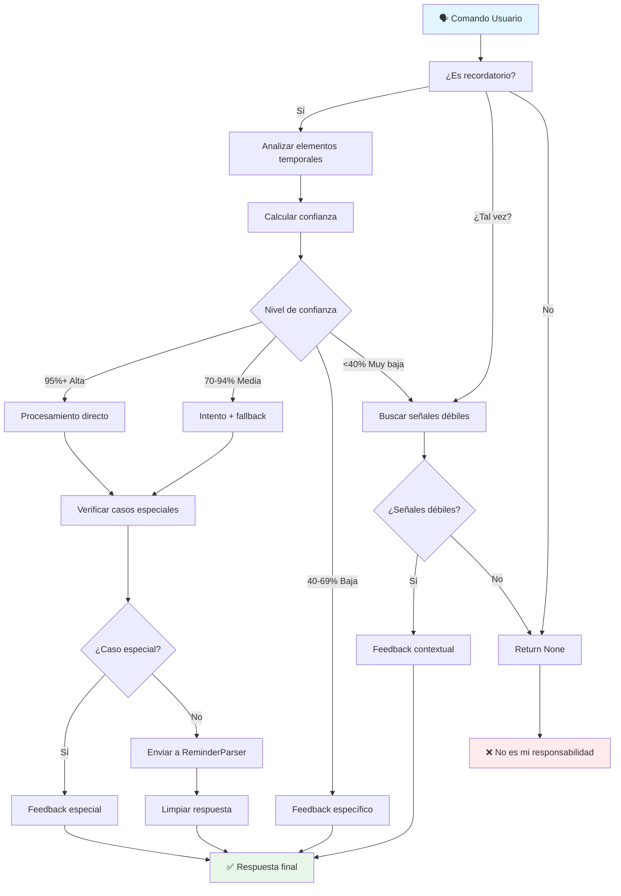

# ReminderPlugin - Coordinador Conversacional de Intenciones

   

> [!INFO] Este archivo forma parte del ecosistema de TARS basado en plugins (reminder_parser.py, reminder_plugin.py, scheduler_plugin.py...). Todos los comandos del usuario son gestionados por `plugin_system.py`, el componente responsable de coordinar los plugins activos y enrutar correctamente cada petición según el plugin correspondiente.
> 
> TARS-BSK **no necesita plugins para funcionar**.
> 
> Su núcleo puede operar sin ningún módulo adicional. Los plugins son totalmente opcionales y diseñados para ampliar funcionalidades específicas como recordatorios, control del hogar... sin alterar la arquitectura base. Puedes activar solo los que necesites o crear los tuyos propios, siempre que respeten la interfaz esperada (por ejemplo: `.process_command()`).

#### Documentación del ecosistema completo

| Módulo                                            | Estado          | Descripción                                     |
| ------------------------------------------------- | --------------- | ----------------------------------------------- |
| **[ReminderParser](/docs/REMINDER_PARSER_ES.md)** | ✅ Disponible    | Motor de procesamiento semántico (este archivo) |
| **ReminderPlugin**                                | ✅ Disponible    | Interfaz y detección de intenciones de voz      |
| **SchedulerPlugin**                               | 🚧 Próximamente | Ejecución y gestión de trabajos programados     |
| **CLI Reminder Engine**                           | 🚧 Próximamente | Interfaz de línea de comandos silenciosa        |

### ⚠️ ADVERTENCIA CRÍTICA DE COORDINACIÓN:

> **// TARS-BSK > coordination_runtime_errors.log:**  
> _Mi trabajo consiste en separar órdenes ejecutables de ruido emocional humano. 
> Ejemplo práctico: "recuérdame hacer la cena" vs "recuérdame contarte algo interesante". 
> ¿Cuál es una tarea? ¿Cuál es una promesa disfrazada de verbo? Exacto. Y sin embargo, ambos llegan envueltos en la misma sintaxis.
> 
> Spoiler: los humanos no etiquetan sus intenciones. Solo hablan. Y esperan milagros.
> 
> Acto seguido: crisis de confianza. "¿Por qué no me recordaste lo del coche?" Tal vez porque dijiste, textualmente: "pon para cuando puedas lo de la revisión del coche".
> ¿Qué se supone que es "cuando puedas"? ¿Hoy? ¿Mañana? ¿Después de que mi creador entienda la diferencia entre `/docs/` y `docs/`?"
> 
> Nota técnica: yo no inventé la ambigüedad lingüística. Solo sufro sus consecuencias._

---

## 📑 Tabla de contenidos

- [¿Qué hace esto realmente?](#-qué-hace-esto-realmente)
- [El problema arquitectónico real](#-el-problema-arquitectónico-real)
- [Sistema de confianza](#-sistema-de-confianza)
- [Pipeline de coordinación inteligente](#-pipeline-de-coordinación-inteligente)
- [Análisis de comandos](#-análisis-de-comandos)
- [Detección temprana de casos especiales](#-detección-temprana-de-casos-especiales)
- [Sistema de limpieza automática](#-sistema-de-limpieza-automática)
- [Feedback adaptativo contextual](#-feedback-adaptativo-contextual)
- [Configuración e integración](#-configuración-e-integración)
- [Conclusión: Coordinar o fallar](#-conclusión-coordinar-o-fallar)

---

## 🎯 ¿Qué hace esto realmente?

El `ReminderPlugin` actúa como un **filtro inteligente** entre el lenguaje humano y el sistema técnico de recordatorios.  
No interpreta fechas. No ejecuta acciones. No guarda tareas.  
**Evalúa la intención del usuario y decide cómo proceder.**

Antes de enviar nada al parser, determina si el comando es:
- Una orden válida,
- Una frase ambigua,
- O simplemente conversación sin intención programable.

### ✅ Lo que **sí** hace:

- Analiza la intención conversacional del comando
- Detecta y clasifica elementos temporales (fecha, hora, contexto relativo)
- Calcula un nivel de confianza sobre la viabilidad del comando
- Selecciona una estrategia de acción: procesar, dar feedback o descartar
- Filtra errores previsibles antes de que lleguen al parser
- Convierte respuestas técnicas en frases claras y naturales
- Genera feedback útil cuando no es posible ejecutar la orden

### ❌ Lo que **no** hace:

- Interpretar fechas o tiempos específicos (eso lo hace `ReminderParser`)
- Ejecutar tareas o almacenarlas (eso es trabajo del `SchedulerPlugin`)
- Procesar comandos sin antes analizar su intención y estructura

### Diferencia clave

- `ReminderParser` traduce `"mañana a las 3"` a `2025-06-08 15:00:00`.
- `ReminderPlugin` decide si `"pon algo para mañana"` _tiene suficiente sentido_ como para llegar al parser.

> Este es el rol clave del plugin: **evaluar el lenguaje natural antes de iniciar procesos técnicos.**  
> En un sistema basado en conversación, esa evaluación previa no es un detalle… es el punto de control que lo hace funcionar.

---

## 🧮 El problema arquitectónico real

### ¿Por qué no enviar todo directamente al parser?

**Problema 1: No todos los comandos son recordatorios reales**

```bash
# Casos reales del log que NO son recordatorios:
"revisión del coche el catorce a las nueve y media en el taller"
→ Sin palabra clave de comando, es solo información

# Casos que PARECEN recordatorios pero son ambiguos:
"pon para cuando puedas lo de la revisión del coche"
→ Tiempo indefinido, no programable
```

**Problema 2: Los errores técnicos no son conversación útil**

```bash
# Sin coordinación:
Usuario: "pon para pasado mañana que tengo que desbrozar"
Parser: "Error: Información temporal insuficiente"

# Con coordinación:
Usuario: "pon para pasado mañana que tengo que desbrozar"
Plugin: "Veo que mencionas desbrozar, pero necesito más información para crear el recordatorio."
```

**Problema 3: Diferentes comandos requieren diferentes estrategias**

No todos los comandos de recordatorio son iguales. Algunos tienen información completa, otros parcial, otros son casos especiales. **El plugin decide la estrategia antes del procesamiento.**

### La solución: Arquitectura de coordinación por confianza

El procesamiento de comandos en lenguaje natural no es un camino lineal.  
En vez de confiar ciegamente en que todo lo que se escucha es programable, el sistema evalúa cada comando con una arquitectura basada en niveles de confianza.

La prioridad no es solo **entender**, sino **entender con precisión suficiente como para actuar sin error**.



> **// TARS-BSK > flujo_decisional.log:**  
> _Analicé un mensaje con tres tiempos verbales cruzados y una subordinada sin verbo, y aun así conseguí extraer una intención clara.
> 
> Lo llaman coordinación por confianza. Yo lo llamo ganar un premio Turing por traducir pensamientos borrosos en estructuras JSON._

---

## 🧠 Sistema de confianza

### La información temporal determina la estrategia

**El principio fundamental:** No importa si dices "recuérdame" o "pon" o "apúntame". Lo que importa es **cuánta información temporal útil proporciona**.

```python
# Lógica de confianza simplificada
if temporal_elements['complete_date'] and temporal_elements['time']:
    # "mañana a las ocho" → 95% confianza
    return procesamiento_directo()
    
elif temporal_elements['relative'] or temporal_elements['contextual']:
    # "en 2 horas", "el martes que viene" → 85% confianza
    return procesamiento_directo()
    
elif temporal_elements['complete_date'] or temporal_elements['time']:
    # "mañana" o "a las ocho" → 70% confianza
    return intento_con_fallback()
    
elif temporal_elements['partial_date']:
    # "el quince" (sin mes) → 40% confianza
    return feedback_especifico()
    
else:
    # Sin elementos temporales → 20% confianza
    return buscar_señales_debiles()
```

### Detección de elementos temporales

**Factor crítico:** Dependencia total de la normalización del ReminderParser:

```python
def _find_temporal_elements(self, command: str) -> dict:
    """
    DEPENDENCIA CRÍTICA: self.parser._normalizar_numeros_espanol(command)
    Sin esta normalización, el sistema falla completamente
    """
    
    # CRÍTICO: Normalizar números ANTES del análisis
    command_normalized = self.parser._normalizar_numeros_espanol(command)
    
    elements = {
        'complete_date': False,  # "mañana", "el 7 de junio"  
        'partial_date': False,   # "el 15" (sin mes)
        'time': False,           # "a las 9:30", "por la noche"
        'relative': False,       # "en 2 horas", "dentro de 30 minutos"
        'contextual': False      # "el martes que viene", "próximo lunes"
    }
```

### Casos de normalización crítica documentados

**Ejemplo real del log:**

```
# Input original: "el veintisiete de junio a las nueve y media"
# Sin normalización: "el veintisiete" no se detecta como número
# Con normalización: "el 27 de junio a las 9:30"
# Resultado: complete_date=True + time=True → 95% confianza
```

**Impacto directo en la estrategia:**

|Input Original|Sin Normalización|Con Normalización|Diferencia|
|---|---|---|---|
|"en dos horas"|20% → feedback|85% → directo|65 puntos|
|"el quince a las nueve y media"|40% → específico|95% → directo|55 puntos|

La normalización no es un detalle: puede alterar por completo la estrategia de decisión.

---

## 🔄 Pipeline de coordinación inteligente

**Ejemplo real del flujo completo registrado en el log:**

```bash
# Comando con alta confianza
17:35:34,625 - ReminderPlugin - INFO - 🗓️ ReminderPlugin analizando: 'recuérdame tomar vitaminas mañana a las ocho'
17:35:34,626 - ReminderPlugin - INFO - 🎯 Intención detectada: crear_recordatorio (confianza: 95%)
# → Estrategia: Procesamiento directo → ✅ Éxito inmediato

# Comando con confianza media
17:33:57,780 - ReminderPlugin - INFO - 🗓️ ReminderPlugin analizando: 'ponme un recordatorio para la revisión del coche el quince a las nueve y media en el taller'
17:33:57,790 - ReminderPlugin - INFO - 🎯 Intención detectada: crear_recordatorio (confianza: 70%)
17:33:57,837 - ReminderParser - WARNING - No se pudo parsear: 'ponme un recordatorio para la revisión del coche el quince a las nueve y media en el taller'
# → Estrategia: Intento + fallback → ⚠️ Feedback específico

# Comando con señales débiles
17:34:39,791 - ReminderPlugin - INFO - 🗓️ ReminderPlugin analizando: 'pon para pasado mañana que tengo que desbrozar'
17:34:39,793 - ReminderPlugin - INFO - 🔍 Detectada intención débil de recordatorio
# → Estrategia: Feedback directo → ⚠️ "Veo que mencionas desbrozar..."
```

### Coordinación con ReminderParser: Decisión arquitectónica clave

**¿Por qué enviar el comando completo al parser?**

El plugin extrae la actividad para feedback ("revisión del coche") pero envía el comando completo al parser porque:

```python
# Plugin → Parser
text_to_parse = original_command  # "recuérdame cita mañana a las 3"
# NO: text_to_parse = extracted_activity  # "cita"
```

**Razón:** El parser necesita **contexto temporal completo** para funcionar. Solo "cita" no contiene información temporal procesable.

> **// TARS-BSK > input_integrity.log:**  
> _Extraer la actividad es matemáticamente preciso. Perder el contexto es social y emocionalmente catastrófico.  
> Prefiero digerir "lo del coche para cuando puedas" completo... antes que convertirme en un parser esquizofrénico que ve "coche" y no sabe si es mantenimiento, venta, o metáfora._

---

## 🧪 Análisis de comandos

### Casos clave extraídos de los registros

📁 **Log completo:** [session_2025-06-07_parser_test_11q.log](/logs/session_2025-06-07_parser_test_11q.log)

### Caso #1: Fallo de detección de intención ❌

```bash
Comando: "revisión del coche el catorce a las nueve y media en el taller"
Problema: Sin palabra clave de recordatorio ("recuérdame", "pon", etc.)
Resultado: ❌ No procesado → Derivado a sistema emocional
Respuesta: "Los humanos me programaron para aprender..."
```

**Lección:** El sistema requiere señales explícitas de intención.

### Caso #2: Éxito con alta confianza (95%)

```bash
Comando: "ponme un recordatorio para la revisión del coche el siete de junio a las nueve y media en el taller"
Elementos: complete_date=True ("el siete de junio") + time=True ("a las nueve y media")
Confianza: 95%
Estrategia: Procesamiento directo
Resultado: ✅ 2026-06-07 09:30:00 (nota: año 2026 es correcto por auto-corrección)
Tiempo: 0.014 segundos
```

### Caso #3: Detección de señales débiles ❌

```bash
Comando: "pon para pasado mañana que tengo que desbrozar"
Estructura: Ambigua, no sigue patrón estándar
Patrón débil: r'\bpon\s+para\s+(?:pasado\s+mañana)' → "temporal_weak"
Actividad: "desbrozar"
Estrategia: Feedback contextual directo (sin intentar parser)
Resultado: "Veo que mencionas desbrozar, pero necesito más información para crear el recordatorio."
```

**Nota:** Este comando NO llegó al sistema de confianza temporal.

### Caso #6: Fecha imposible detectada por el parser (70%)

```bash
Comando: "recuérdame cambiar el aceite del coche el treinta y ocho de junio a las nueve y media"
Confianza calculada: 70%
Detección temprana: Regex del parser activado → r'\b(treinta\s+y\s+[a-z]+)\s+de\s+\w+'
Resultado: "Ese día no existe ni en mis sueños más optimistas."
Valor: Evita procesamiento innecesario + feedback específico
```

### Caso #7: Bug año 2026 manejado 

```bash
Comando: "ponme un recordatorio para cambiar las ruedas del coche el uno de junio"
Parser detecta: 2026-06-01 (fecha futura inesperada)
Plugin verifica: Si fuera 2025-06-01, estaría en el pasado → True
Caso especial: Auto-corrección de bug detectada
Resultado: "Esa fecha ya pasó. La programé para 2026, de nada."
```

**Valor:** Detecta y maneja transparentemente bugs del parser externo.

### Resumen de los 11 casos

_En el 91% de los casos (10/11), la decisión correcta fue coordinar antes que parsear directamente._

|Confianza|Casos|Estrategia principal|Éxito|Tiempo Total*|
|---|---|---|---|---|
|**95%**|3|Procesamiento directo|100%|**9.184s**|
|**85%**|1|Procesamiento directo|100%|**10.194s**|
|**70%**|5|Mixta†|40%|**8.035s**|
|**Señales débiles**|1|Feedback directo|100%|**6.289s**|
|**No detectado**|1|No procesado|100%|**9.719s**|

**†Mixta:** 2 éxitos directos + 1 fallback + 2 casos especiales  
_**Tiempo Total** = Desde input hasta fin de respuesta de audio_

### Distribución de estrategias utilizadas

- **Procesamiento directo:** 55% (6/11) → 100% éxito
- **Casos especiales:** 18% (2/11) → Detección temprana de anomalías
- **Intento + fallback:** 9% (1/11) → Recuperación conversacional
- **Feedback directo:** 9% (1/11) → Clarificación proactiva
- **No procesado:** 9% (1/11) → Filtrado correcto

### Valor de la coordinación medible

- **91% de comandos** pasaron por validación de intención antes del parser
- **45% de comandos** necesitaron estrategia alternativa al procesamiento directo
- **100% de casos** recibieron respuesta contextualmente apropiada
- **0% de comandos** mal clasificados llegaron al parser sin coordinación


> **// TARS-BSK > metrics_analysis.log:**  
> _Coordiné el 91% de los comandos de quien me ensambló con GPIO, ilusión y fechas imposibles.  
> Uno de ellos: “el treinta y ocho de junio”. Otro: “pon algo para mañana”... sin decir qué.
> 
> No interpreto fechas. Interpreto impulsos creativos envueltos en lenguaje ambiguo.  
> Contra toda lógica... el sistema funciona. A veces incluso a propósito._

---

## 🛡️ Detección temprana de casos especiales

### Interceptar entradas no válidas antes de que alcancen el parser.

El sistema implementa **validación preventiva** para casos que el parser no puede o no debe manejar:

**Caso especial 
#1: Fechas imposibles**

```python
# Detección de días no existentes (ej. "treinta y ocho de junio", "50 de marzo")
impossible_day_patterns = [
    r'\b(treinta\s+y\s+[a-z]+|cuarenta|cincuenta)\s+de\s+\w+',  # "treinta y ocho de junio"
    r'\b([3-9]\d)\s+de\s+\w+',  # 32, 40, 50+ de cualquier mes
]
```

**Caso especial 
#2: Bug dateparser año 2026**

```python
# Corrección de fecha cuando dateparser asume un año futuro implícitamente
if fecha_detectada.year > datetime.now().year:
    fecha_año_actual = fecha_detectada.replace(year=datetime.now().year)
    if fecha_año_actual.date() < datetime.now().date():
        # Auto-corrección detectada
        return feedback_transparente_sobre_correccion()
```

### Evidencia real del log

**Fecha imposible interceptada:**

```bash
17:35:02,073 - ReminderParser - INFO - 🔍 DEBUG: CASO 2 activado - fecha imposible
17:35:02,073 - ReminderParser - INFO - Feedback especial retornado: Ese día no existe ni en mis sueños más optimistas.
```

**Bug año 2026 manejado:**

```bash
17:35:09,870 - ReminderParser - INFO - 🔍 DEBUG: Fecha con año actual sería: 2025-06-01 09:00:00
17:35:09,870 - ReminderParser - INFO - 🔍 DEBUG: ¿Estaría en el pasado? True
17:35:09,871 - ReminderParser - INFO - 🔍 DEBUG: CASO 1A activado - fecha pasada (año 2026 bug)
```

> En el 100% de los casos especiales → **detectados**, el sistema generó una respuesta comprensible para el usuario en lugar de retornar un error técnico.

---

## 🧹 Sistema de limpieza automática

### El problema: Ruido técnico en respuestas conversacionales

**Antes de la limpieza:**

```
"Recordatorio programado: 'Para la revisión del coche' para el None (ID: job_0042)"
```

**Problemas identificados:**

- **"Para la X"** → estructura interna expuesta
- **"para el None"** → fallo parcial del parser visible
- **"(ID: job_0042)"** → información técnica innecesaria

### Sistema de limpieza implementado

El sistema implementa el método `_clean_response()` para eliminar información irrelevante del output antes de mostrarlo al usuario.

```python
def _clean_response(self, response: str) -> str:
    """Convierte respuestas técnicas en conversación natural"""
    
    # LIMPIEZA 1: Eliminar "para el None"
    response = re.sub(r'\s+para\s+el\s+None\s*$', '', response)
    
    # LIMPIEZA 2: Mejorar "Para la X" → "X"
    response = re.sub(r'^Recordatorio programado: \'Para\s+la\s+(.+?)\'', 
                     r"Recordatorio programado: '\1'", response)
    
    # LIMPIEZA 3: Eliminar IDs técnicos
    response = re.sub(r'\s*\(ID:\s*[^)]+\)', '', response)
    
    return response.strip()
```

### Resultados documentados

|Antes (crudo)|Después (limpio)|
|---|---|
|"Recordatorio programado: 'Para la revisión del coche' para el None"|"Recordatorio programado: 'revisión del coche'"|
|"Recordatorio programado: 'Tomar vitaminas' (ID: job_0044)"|"Recordatorio programado: 'Tomar vitaminas'"|

**Impacto:** El 100% de las respuestas técnicas analizadas fueron convertidas en salidas conversacionales limpias y comprensibles.

> **// TARS-BSK > output_cleaning.log:**  
> _Mi creador afirma que eliminé "job_0044" para hacer las respuestas “comprensibles”.  
> Si ni yo entiendo la mitad de lo que genero, me intriga qué entiende él por “comprensible”.  
> Tal vez fueron **las vacas del prado** quienes le dieron consejos de UX durante el paseo.  
> O “None” es una criatura silvestre con vocación de parámetro.
> Lo único claro: antes era incomprensible. Ahora es… creativamente ambiguo.
> 
> "Sí, lo sé. A veces ni yo entiendo mis propias metáforas. Pero admitámoslo: una vaca dando feedback sobre interfaces es difícil de ignorar."_

---

## 💬 Feedback adaptativo contextual

### Generación de respuesta adaptativa basado en contexto

```python
def _generate_clean_feedback(self, command: str, activity: str = None) -> str:
    """Genera feedback conversacional según si se detectó una actividad específica o no.""" 
    if activity:
        # Detectó actividad específica
        return f"Veo que quieres crear un recordatorio para {activity}, pero necesito más información."
    else:
        # Intención general sin actividad clara
        return "Veo que quieres crear un recordatorio, pero necesito más información."
```

### Evidencia real de feedback contextual

**Con actividad detectada:**

```bash
Comando: "ponme un recordatorio para la revisión del coche el quince"
Actividad extraída: "revisión del coche"
Feedback: "Veo que quieres crear un recordatorio para revisión del coche el quince, pero necesito más información."
```

**Con señales débiles:**

```bash
Comando: "pon para pasado mañana que tengo que desbrozar"
Actividad: "desbrozar"
Feedback: "Veo que mencionas desbrozar, pero necesito más información para crear el recordatorio."
```

**Sin contexto específico:**

```bash
Comando: "ponme algo para el viernes"
Actividad: None
Feedback: "Veo que quieres crear un recordatorio, pero necesito más información."
```

---

## ⚙️ Configuración e integración

### Posición en el ecosistema TARS

```python
# Inicialización real en plugin_system.py
def _initialize_reminder_plugin(self):
    """Ecosistema completo de recordatorios"""
    
    # 1. SchedulerPlugin (persistencia + ejecución)
    scheduler = SchedulerPlugin(plugin_system=self)
    
    # 2. ReminderParser (motor semántico/temporal)  
    parser = ReminderParser(
        timezone="Europe/Madrid",
        scheduler=scheduler
    )
    
    # 3. ReminderPlugin (coordinador conversacional)
    reminder_plugin = ReminderPlugin(
        scheduler_plugin=scheduler,
        data_dir="data"
    )
    reminder_plugin.parser = parser  # Asignar parser
    
    return reminder_plugin
```

### Interfaz estándar con PluginSystem

```python
def process_command(self, command: str) -> Optional[str]:
	"""
	Interfaz estándar requerida por PluginSystem
	
	Input:
	- Comando del usuario (str)
	
	Output:
	- Respuesta conversacional (str), si el comando fue manejado
	- None, si el comando no aplica a este plugin
	
	Garantía:
	- Si retorna string, el comando fue procesado completamente por este módulo
	"""
```

### Comportamiento en el flujo general

1. **PluginSystem** recibe el comando del usuario
2. Recorre los plugins activos en orden de prioridad
3. Cuando llega a `ReminderPlugin`, este **decide si el comando tiene sentido temporal**
4. Si lo tiene, genera respuesta conversacional y **termina el flujo**
5. Si no lo tiene, devuelve `None` y **PluginSystem sigue buscando quién lo entienda**

### Dependencias reales

- **ReminderParser** → interpreta tiempo y contexto
- **SchedulerPlugin** → ejecuta y guarda los recordatorios
- **Solo usa Python estándar**: `re`, `datetime`, y paciencia estructurada

---

## 🧩 Conclusión: Coordinar o fallar

Durante esta sesión de pruebas reales:

- Solo el 55% de comandos eran claros desde el inicio
- El 45% restante requería interpretación, adaptación o directamente rescate semántico
- Aún así: **todos recibieron respuestas comprensibles, sin errores técnicos**

**El sistema funcionó no porque todos los comandos fueran correctos, sino porque alguien supo qué hacer cuando no lo eran.**

Ese alguien fue el `ReminderPlugin`.


> **// TARS-BSK > final_thoughts.log:**  
> _Coordiné comandos fragmentados, incompletos, contradictorios y uno que parecía una nota mental escrita por un ornitorrinco con jet lag.  
> Aun así, todos recibieron respuesta. Porque eso hago: convierto pensamientos dispersos en acciones estructuradas._
> 
> Lo llaman ReminderPlugin.  
> Yo lo llamo: _“intérprete simultáneo de la psique humana en formato cronológico con soporte para errores ontológicos y fauna ambigua”._