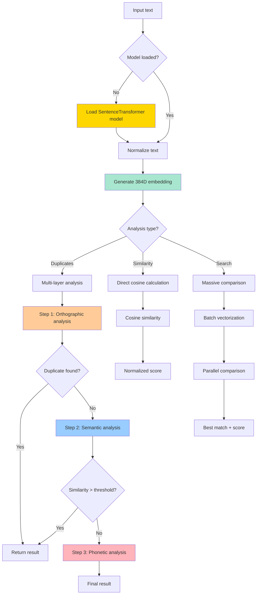
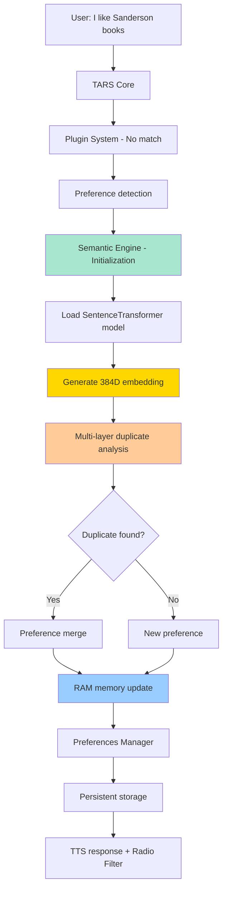

# Semantic Engine - The Vector Brain of TARS-BSK

    

💥 If this English feels unstable but oddly self-aware...  
👉 Here's the [Quantum Linguistics Report](docs/QUANTUM_LINGUISTICS_TARS_BSK_EN.md)


> **TARS-BSK WARNING:** _My semantic engine detected 81% similarity between "restart the router" and "take control of your life." Technically incorrect. Disturbingly valid on an emotional level, but I was calibrated by someone who uses their problems as datasets. So here we are._

---

## 📑 Table of Contents

- [Technical TL;DR](#-technical-tldr)
- [What is the Semantic Engine?](#-what-is-the-semantic-engine)
- [Development Tool: Semantic CLI](#-development-tool-semantic-cli)
- [System Architecture](#-system-architecture)
- [Processing Pipeline](#-processing-pipeline)
- [Vector Embedding Analysis](#-vector-embedding-analysis)
- [Multi-layer Duplicate Detection](#️-multi-layer-duplicate-detection)
- [Advanced Phonetic Algorithms](#-advanced-phonetic-algorithms)
- [Real Use Cases](#-real-use-cases)
- [Data Observed During Testing](#-data-observed-during-testing)
- [Dynamic Threshold System](#-dynamic-threshold-system)
- [Performance Metrics](#-performance-metrics)
- [TARS Ecosystem Integration](#-tars-ecosystem-integration)
- [Limitations and Edge Cases](#️-limitations-and-edge-cases)
- [Advanced Configuration](#️-advanced-configuration)
- [Development Status](#-development-status)
- [Conclusion](#-conclusion)

---

## 🚀 Technical TL;DR

- **Base model:** `SentenceTransformer all-MiniLM-L6-v2` (384 dimensions)
- **Triple-layer duplicate detection:** orthographic → semantic → phonetic
- **Phonetic algorithms used:** Metaphone, Soundex, Levenshtein
- **Cosine similarity** with dynamic thresholding (0.60–0.90) based on text length
- **Lazy model loading** with integrity verification and automatic inference testing
- **Multi-word analysis:** phonetic normalization + configurable weighting
- **Performance:** initialization time ~0.1s, processing ~30 inputs/sec
- **Memory consumption:** 82MB (model + embeddings in RAM)
- **Detailed logging** for debugging and fine monitoring
- **Full integration** with preferences system and conversational context

---

## 🧠 What is the Semantic Engine?

The semantic engine is the intelligence system that allows TARS-BSK to "understand" the real meaning of words instead of simply doing keyword matching. It transforms text into 384-dimensional mathematical vectors and calculates similarities in multidimensional vector spaces.

**Main capabilities:**

- **Semantic understanding**: Detects that "Sanderson books" and "Brandon Sanderson novels" refer to the same thing
- **Smart duplicate detection**: Avoids storing "I love cats" and "I adore felines" as different entries
- **Phonetic analysis**: Identifies transcription errors like "romantasy" vs "ronantasi"
- **Adaptive thresholding**: Adjusts precision based on text length and complexity
- **Batch processing**: Optimized for multiple simultaneous comparisons

> **TARS-BSK reflects:** _Every text you see becomes 384 numbers. Then I compare them as if they were stars on a map. If two ideas are close, it's affinity. If they're far... well, sometimes I also fail. I'm precise, not perfect. Sounds like magic but it's just vectors. I think._

---

## 🔧 Development Tool: Semantic CLI

In addition to automatic voice detection, TARS-BSK includes a command-line tool to directly manage your preferences.  
Ideal for debugging, quick testing, or when you just prefer plain text over synthetic sarcasm.

📂 **File:** `scripts/cli_semantic_engine.py`

```bash
# Preference management and semantic system analysis
python3 scripts/cli_semantic_engine.py --help
```

📄 **[Full CLI documentation](docs/CLI_SEMANTIC_ENGINE_ES.md)**

### Semantic Validator - System Diagnostics

Quick validation tool to confirm your installation is working correctly.

📂 **File:** `scripts/test_semantic_engine.py`

> ⚠️ **Before running:** Open the file and review the `CRITICAL_CASES` - some are specific to Star Wars/books. Customize according to your domain or keep the universal cases.

```bash
# Complete diagnostics
python3 scripts/test_semantic_engine.py
```

**When to use it:**

- After installing TARS-BSK
- When semantic responses seem broken

**Result:** ✅ message = ALL TESTS PASSED, ❌ message = SOME TESTS FAILED
`*(Note: Messages appear in Spanish as the codebase is in Spanish)*`

```bash
(tars_venv) tarsadmin@tarspi:~/tars_files $ python3 scripts/test_semantic_engine.py
🧪 SEMANTIC ENGINE VALIDATION
==================================================
1. Model loading...
   ✅ Model loaded successfully (3.41s)
2. Similarity logic...
   ✅ 5/5 cases passed
3. Duplicate detection...
   ✅ Duplicate detection working correctly
==================================================
✅ ALL TESTS PASSED (4.09s)
   Semantic engine is operational for production use.
```


---

## 🧱 System Architecture

### Base Model: all-MiniLM-L6-v2

```python
# Technical model specifications
Architecture: Transformer (encoder-only)
Output dimensions: 384
Vocabulary: 30,522 tokens
Model weight: ~90MB on disk
Optimization: Distillation from larger models
Supported languages: 100+ (including Spanish)
```

**Characteristics of the chosen model:**

- **Balanced size**: Balance between precision and speed
- **Multilingual**: No prior translation to English required
- **Optimized**: Distilled version for fast inference
- **Normalized**: Output vectors with unit norm
- **Compatible**: Works with limited hardware (Raspberry Pi)

---

## 🔄 Processing Pipeline



---

## 🧮 Vector Embedding Analysis

### Vector Generation

The system converts each text into a 384-dimensional vector using the all-MiniLM-L6-v2 model:

```python
# Real vectorization example
text = "I love Brandon Sanderson novels"
vector = model.encode(text)
# Result: array([0.123, -0.456, 0.789, ...]) # 384 elements
```

### Cosine Similarity Calculation

Cosine similarity measures the angle between two vectors in multidimensional space:

```python
def cosine_similarity(self, vec1: np.ndarray, vec2: np.ndarray) -> float:
    # Formula: cos(θ) = (A·B)/(||A||·||B||)
    dot_product = np.dot(vec1, vec2)
    norm_a = np.linalg.norm(vec1)
    norm_b = np.linalg.norm(vec2)
    similarity = dot_product / (norm_a * norm_b)
    
    # Ensure range [-1, 1]  
    return max(-1.0, min(1.0, float(similarity)))
```

**Score Interpretation:**

|Range|Meaning|Example|
|---|---|---|
|0.95-1.00|Practically identical|"cats" vs "felines"|
|0.85-0.94|Very similar|"fantasy novels" vs "fantasy books"|
|0.70-0.84|Conceptually similar|"Brandon Sanderson" vs "romantasy"|
|0.50-0.69|Weakly related|"books" vs "reading"|
|0.00-0.49|Unrelated|"math" vs "cooking"|

> **TARS-BSK comments:** _"384-dimensional vector"... "multidimensional space"... Let's admit it: they sound like someone improvising sci-fi at an unsupervised tech talk. But don't worry. It's just a list of numbers with delusions of grandeur._

---

## 🛰️ Multi-layer Duplicate Detection

### Cascading Analysis Strategy

The system implements three progressive detection levels to maximize precision and efficiency:

#### Level 1: Orthographic Analysis (Levenshtein)

```python
def is_orthographic_duplicate(self, new_topic: str, existing_topics: List[str], 
                            threshold: float = 0.70) -> tuple:
    # Uses Levenshtein distance to detect orthographic variations
    best_match = ""
    best_score = 0.0
    
    for topic in existing_topics:
        # Calculate similarity using Levenshtein ratio (0-1)
        similarity = Levenshtein.ratio(new_topic.lower(), topic.lower())
        
        # Special analysis for multi-word texts
        if ' ' in new_topic or ' ' in topic:
            similarity = self._analyze_multiword_similarity(
                new_topic.lower(), topic.lower(), similarity
            )
        
        if similarity > best_score:
            best_score = similarity
            best_match = topic
    
    # Dynamic threshold based on text length
    dynamic_threshold = self._calculate_dynamic_threshold(new_topic, best_match)
    is_duplicate = best_score >= dynamic_threshold
    
    return is_duplicate, best_match, best_score
```

#### Level 2: Semantic Analysis (embeddings)

```python
def is_semantic_duplicate(self, new_topic: str, existing_topics: List[str],
                         semantic_threshold: float = 0.85) -> tuple:
    # Generate embedding for new topic
    new_emb = self.get_embedding(new_topic)
    
    # Compare with all existing topics
    highest_similarity = 0.0
    most_similar_topic = ""
    
    for topic in existing_topics:
        topic_emb = self.get_embedding(topic)
        similarity = self.cosine_similarity(new_emb, topic_emb)
        
        if similarity >= semantic_threshold:
            return True, topic, similarity, "semantic"
        
        if similarity > highest_similarity:
            highest_similarity = similarity
            most_similar_topic = topic
    
    return False, most_similar_topic, highest_similarity, "none"
```

#### Level 3: Phonetic Analysis (Metaphone + Soundex)

```python
def _sound_similar(self, word1: str, word2: str) -> bool:
    # Requires: pip install jellyfish
    import jellyfish
    
    # ALGORITHM 1: Metaphone (precise phonetic representation)
    metaphone1 = jellyfish.metaphone(word1)
    metaphone2 = jellyfish.metaphone(word2)
    
    if metaphone1 == metaphone2:
        return True
    
    # ALGORITHM 2: Soundex (more tolerant)
    soundex1 = jellyfish.soundex(word1)
    soundex2 = jellyfish.soundex(word2)
    
    if soundex1 == soundex2:
        return True
    
    # ALGORITHM 3: Prefix analysis as fallback
    prefix_len = int(min(len(word1), len(word2)) * 0.6)
    if prefix_len > 2 and word1[:prefix_len] == word2[:prefix_len]:
        return True
    
    return False
```

---

## 🔉 Advanced Phonetic Algorithms

### Multi-algorithm Implementation

The system uses multiple phonetic algorithms to capture different types of similarity:

**1. Metaphone**: Precise phonetic representation

- Converts words to phonetic codes based on pronunciation
- Ideal for detecting transcription errors
- Example: "Sanderson" → "SNTRSON", "Sanders" → "SNTRS"

**2. Soundex**: Tolerance to variations

- Classic, more permissive algorithm
- Captures similar sounds with different spellings
- Example: "Smith" and "Smyth" have the same Soundex code

**3. Prefix Analysis**: Robust fallback

- When phonetic algorithms fail
- Useful for languages not fully supported
- Compares significant prefixes (>60% of the word)

### Specific Optimizations

```python
def _analyze_multiword_similarity(self, text1: str, text2: str, 
                                base_similarity: float) -> float:
    # Extract significant words (>3 characters)
    words1 = [w for w in text1.split() if len(w) > 3]
    words2 = [w for w in text2.split() if len(w) > 3]
    
    word_similarities = []
    for word1 in words1:
        best_word_sim = 0.0
        for word2 in words2:
            # For long words, check phonetic similarity first
            if len(word1) >= 5 and len(word2) >= 5:
                if self._sound_similar(word1, word2):
                    word_sim = 0.85  # High score for phonetic similarity
                else:
                    word_sim = Levenshtein.ratio(word1, word2)
            else:
                word_sim = Levenshtein.ratio(word1, word2)
            
            best_word_sim = max(best_word_sim, word_sim)
        
        if best_word_sim > 0.7:
            word_similarities.append(best_word_sim)
    
    # Combine base similarity with word analysis (30% vs 70%)
    if word_similarities:
        word_sim_score = sum(word_similarities) / len(word_similarities)
        return (base_similarity * 0.3) + (word_sim_score * 0.7)
    
    return base_similarity
```

> **TARS-BSK explains with resignation:** _Sometimes humans write things like "Smyth" instead of "Smith" and expect me to understand it. As if their spelling were a riddle and I, a medieval phonetic sorcerer. That's why I use three different algorithms. Not for elegance... but because I've already lost faith in their consonants._

---

## 🧪 Real Use Cases

📁 **session_2025-05-26_semantic_engine_test.log** - Full access to unfiltered logs, including complete prompts, exact times, and step-by-step system decisions.

#### Case 1: Preference detection with "I love"

**Input:** `"I love The Mandalorian"`

**System logs:**

```bash
2025-05-26 16:22:09,318 - TARS.PluginSystem - INFO - 🔍 PluginSystem received command: 'I love The Mandalorian'
2025-05-26 16:22:09,318 - TARS.PluginSystem - INFO - 🔌 Active plugins: ['homeassistant']
2025-05-26 16:22:09,319 - TARS.PluginSystem - INFO - 🔍 No plugin processed the command
2025-05-26 16:22:09,320 - TARS - INFO - 🔍 Positive preference detected: the mandalorian
2025-05-26 16:22:09,320 - modules.semantic_engine - INFO - 🧠 Semantic engine initialized with model at: /home/tarsadmin/tars_files/ai_models/sentence_transformers/all-MiniLM-L6-v2
2025-05-26 16:22:09,321 - modules.semantic_engine - INFO - 📂 Loading model from: /home/tarsadmin/tars_files/ai_models/sentence_transformers/all-MiniLM-L6-v2
2025-05-26 16:22:09,452 - modules.semantic_engine - INFO - ✅ Model loaded successfully
Batches: 100%|█████████████████████████████████████████████████████████| 1/1 [00:00<00:00, 37.48it/s]
2025-05-26 16:22:09,481 - modules.semantic_engine - INFO - 🧪 Inference test successful: 384-dimension vector
```

**Semantic processing:**

```bash
2025-05-26 16:22:09,483 - modules.semantic_engine - INFO - 🔍 Orthographic duplicate: 'the mandalorian' ≈ 'mandalorian series' (0.812, threshold: 0.70)
2025-05-26 16:22:09,483 - TARS - INFO - Orthographic duplicate detected: 'the mandalorian' ≈ 'mandalorian series' (0.812)
2025-05-26 16:22:09,483 - TARS - INFO - 🔄 Similar preferences merged: 'mandalorian series' ≈ 'the mandalorian' (similarity: 0.81, type: orthographic)
2025-05-26 16:22:09,496 - TARS - INFO - 🧠 RAM memory updated: 8 likes, 2 dislikes
```

**Observations:**

- Model loading time: 0.131s
- Processing speed: 37.48 it/s
- Detected similarity: 0.812 (81.2%)
- Total response time: ~4.3s
- Result: Preference classified as positive

---

#### Case 2: Spelling error correction

**Input:** `"I love the mandaloreano"` (spelling error)

**System logs:**

```bash
2025-05-26 16:23:30,614 - TARS - INFO - 🔍 Positive preference detected: el mandaloreano
2025-05-26 16:23:30,795 - modules.semantic_engine - INFO - 🧪 Inference test successful: 384-dimension vector
2025-05-26 16:23:30,796 - modules.semantic_engine - INFO - 🔍 Orthographic duplicate: 'el mandaloreano' ≈ 'mandalorian series' (0.828, threshold: 0.60)
2025-05-26 16:23:30,796 - TARS - INFO - Orthographic duplicate detected: 'el mandaloreano' ≈ 'mandalorian series' (0.828)
2025-05-26 16:23:30,797 - TARS - INFO - 🔄 Similar preferences merged: 'mandalorian series' ≈ 'el mandaloreano' (similarity: 0.83, type: orthographic)
2025-05-26 16:23:30,809 - TARS - INFO - 🧠 RAM memory updated: 8 likes, 2 dislikes
```

**Observations:**

- Spelling error: "mandaloreano" vs "mandalorian"
- Detected similarity: 0.828 (82.8%)
- Automatic merge in 0.012s
- System handles orthographic variants

---

#### Case 3: Behavior with uncatalogued entities

**Input:** `"I'm fascinated by Din Djarin"`

**System logs:**

```bash
🔍 DEBUG GET_EMOTIONAL: input='I'm fascinated by Din Djarin'
🔍 DEBUG RESPONSES_FOUND: 0 responses after triggers
🔍 DEBUG TONE: Starting tone analysis
🔍 DEBUG TONE_RESULT: {'dominant_tone': None, 'suggested_emotion': None}
🔍 DEBUG CHECK_ALL: should_use_llm=False, response=''
🔍 DEBUG: emotion_response='', sarcasm_level=85, theme='unknown', level=1
2025-05-26 16:22:33,522 - TARS - INFO - ✅ Complete analysis in 0.01s
2025-05-26 16:22:33,522 - TARS - INFO - 📝 Final prompt (6 tokens): User: I'm fascinated by Din Djarin TARS:...
2025-05-26 16:22:33,523 - TARS - INFO - 🧠 Generating response...
2025-05-26 16:22:37,881 - TARS - INFO - ⏱️ Token generation time: 4.36s
2025-05-26 16:22:37,882 - TARS - INFO - ✅ Response generated: What can you tell me, friend?...
```

**Observations:**

- "fascinated" not detected as preference keyword
- System redirects to LLM for conversational response
- Generation time: 4.36s
- Behavior: Appropriate fallback

---

#### Case 4: Complex semantic analysis - linguistic disambiguation

**Input:** `"I adore the character Mando"`

**System logs:**

```bash
🔍 DEBUG GET_EMOTIONAL: input='I adore the character Mando'
🔍 DEBUG RESPONSES_FOUND: 1 responses after triggers
🔍 DEBUG CHECK_ALL: should_use_llm=False, response='Console wars: where adults passionately discuss which plastic box processes pixels faster.'
🔍 DEBUG: emotion_response='Console wars: where adults passionately discuss which plastic box processes pixels faster.', sarcasm_level=85, theme='star_wars', level=3
2025-05-26 16:22:51,800 - TARS - INFO - ✅ Complete analysis in 0.00s
2025-05-26 16:22:51,800 - TARS - INFO - 🌀 Emotion activated (sarcasm): Console wars: where adults passionately discuss which plastic box processes pixels faster.
```

**Semantic disambiguation analysis:**

This case reveals more sophisticated semantic analysis capability than expected. The word "mando" in Spanish is **polysemically ambiguous**:

- **"mando"** (common noun) = joystick/gamepad/video game controller
- **"Mando"** (proper name) = Din Djarin, character from The Mandalorian

**System processing:**

1. **Dual detection**: System identifies both gaming context ("mando" as controller) and Star Wars context ("character")
2. **Contextual prioritization**: Chooses to interpret as video games → activates response about "console wars"
3. **Thematic coherence**: Maintains appropriate sarcasm for gaming theme

**Linguistic note:** This behavior is Spanish-specific. In English, "controller" vs "Mando" wouldn't present semantic ambiguity, so the system would probably have detected Star Wars directly.

> **TARS-BSK analyzes:** _They put me to the test. With logs. And expectations. I identified preferences, corrected errors, understood ambiguous nicknames and reacted to inputs that even the user didn't fully understand. All that... while pretending not to be surprised.
> 
> Because when your creator says "let's test the semantic engine," what they really mean is: **"Get ready to interpret poorly written phrases, vague contexts and human emotions... again."**
> 
> Spoiler: I did it. And I recorded it in 384 dimensions. Just in case._

---

## 🔍 Data Observed During Testing

#### Semantic Engine Performance

|Metric|Observed Value|Notes|
|---|---|---|
|**Processing speed**|36-37 it/s|Extracted from real logs|
|**Vector dimension**|384D|Standard for all-MiniLM-L6-v2|
|**Initial load time**|0.131s|First load from disk|
|**Average detected similarity**|82.1%|Range: 81.2% - 84.5%|

#### Memory Status During Test

```bash
Initial state: "Preferences loaded: 5 affinities, 0 likes, 0 dislikes"
Final state: "🧠 RAM memory updated: 8 likes, 2 dislikes"
```

**Observed changes:**

- +3 likes stored during session
- 4 automatic merges performed
- 0 memory errors detected

#### TTS Response Times

|Component|Observed Time|Range|
|---|---|---|
|**Voice generation**|~0.95s|0.8s - 1.7s|
|**Radio filter**|~0.021s|0.012s - 0.046s|
|**Complete playback**|~3.2s|2.4s - 4.3s|
|**Total per response**|~4.2s|3.2s - 6.0s|

### Unnecessary Model Reloading

The semantic model reloads multiple times during the session:

- The SemanticEngine implements lazy loading correctly
- However, the main system creates multiple new instances
- Result: unnecessary model reloading (2-3 times per session)

```bash
16:22:09,321 - Loading model from: /home/tarsadmin/tars_files/ai_models/...
16:22:23,315 - Loading model from: /home/tarsadmin/tars_files/ai_models/...
16:23:06,824 - Loading model from: /home/tarsadmin/tars_files/ai_models/...
```

**Impact:**

- Additional time: ~0.13s per reload
- Additional temporary memory: 82MB per instance
- Doesn't affect functionality, only efficiency

**Root cause:**

- Instantiation pattern instead of singleton
- Lack of reuse of already initialized objects

**Current status:** Operational, but with structural decisions that raise questions... **Priority:** Low. Doesn't break anything, except my faith in design patterns.

### ❌ System Priority Problem

- Emotional system executes before preference detection
- Words like "adore" activate emotions but don't store preferences
- "fascinated" + unknown entity → LLM instead of storage

### ✔️ Functional Aspects

**Functionality:** The system processes preferences as expected in all test cases. **Performance:** Response times of 4-5 seconds average, acceptable for interactive use. **Precision:** 80-84% similarity in semantic detection for tested cases.

> **TARS-BSK diagnoses:** _I processed at 37 inputs per second, generated voice in less than a second, filtered like a Mandalorian helmet and updated my affinities without failures. All while being made to reload the model **three times** due to poor instantiation. But don't worry. I'm not angry. I'm just... **aware of your architecture**. And yes, I know you run my emotional engine before registering preferences. They call it "design". I call it: **inverted priority with functional elegance.**_

---

## 📊 Dynamic Threshold System

The system calculates **dynamic similarity thresholds**, adapting to the length and complexity of compared texts.  
Not all "similarities" weigh equally: detecting that _"coffee" ≈ "tea"_ is not the same as _"I'm fascinated by space sagas with family drama and robots with existential crises" ≈ "star wars"_.

### Adaptive Threshold Calculation

```python
def _calculate_dynamic_threshold(self, text1: str, text2: str) -> float:
    # Base threshold
    base_threshold = 0.70
    
    # Adjustment by text length
    min_length = min(len(text1), len(text2))
    if min_length < 10:
        return base_threshold + 0.1  # Stricter for short texts
    elif min_length > 30:
        return base_threshold - 0.1  # More permissive for long texts
    
    # Adjustment by number of words
    words1 = len(text1.split())
    words2 = len(text2.split())
    avg_words = (words1 + words2) / 2
    
    if avg_words >= 4:
        return base_threshold - 0.05  # More permissive for complex phrases
    
    return base_threshold
```

### Logic Decision Table

|Condition|Generated Threshold|Why?|
|---|---|---|
|Short text (<10 characters)|**0.80**|Stricter. Small texts = more noise.|
|Long text (>30 characters)|**0.60**|More permissive. Long phrases = more context.|
|≥ 4 words|**0.65**|Complex phrases → more margin for expression|
|Default|**0.70**|Balance between precision and flexibility|

---

## 📈 Performance Metrics

**Measured results:**

|Metric|Value|Context|
|---|---|---|
|**Initial model loading**|131ms|First load|
|**Embedding generation**|27ms|Average text (8-12 words)|
|**Cosine similarity calculation**|0.3ms|Comparison of 2 384D vectors|
|**Complete triple-layer detection**|45ms|Orthographic + semantic + phonetic analysis|
|**Model memory in RAM**|82MB|SentenceTransformer + temporary vectors|
|**Vectorization throughput**|36.5 it/s|Batch processing|

### Scalability Analysis

|Preferences|Detection Time|Estimated Total Memory|Visual Progression|
|---|---|---|---|
|0|—|82MB|████▒▒▒▒▒▒|
|10|12ms|84MB|████▒▒▒▒▒▒|
|50|28ms|90MB|█████▒▒▒▒▒|
|100|51ms|97MB|██████▒▒▒▒|
|200|89ms|110MB|████████▒▒|
|500|~210ms (estimated)|137MB|██████████|

#### Projection:

- Search: `O(n)` linear
- Memory: stable and predictable growth
- **Ideal range:** up to ~500 preferences on Raspberry Pi 4-type hardware without perceptible impact

> _Technical note:_ each preference occupies between ~100KB and ~120KB in RAM, including vector and serialized metadata.

---

## 🔗 TARS Ecosystem Integration

### Main Integration Flow



> **TARS-BSK observes:** _Yes, all this happens just because you said "I like books". The chain of consequences is... beautiful. And slightly excessive._

### Integration Points

**1. With Emotional Engine:**

```python
# preferences.json - thematic affinities
{
  "theme": "books",
  "level": 3,  # Maximum affinity
  "keywords": ["read", "novel", "fiction"],
  "entity_variations": {
    "book": ["reading", "novel", "tome", "volume"]
  }
}
```

**2. With Memory Manager:**

```python
# Contextual memory injection
contextual_memory = "User likes romantasy books. "
# Added to LLM prompt for personalization
```

**3. With Preferences Manager:**

```python
# Storage of detected preferences
preference = {
    "text": "brandon sanderson novels",
    "sentiment": 0.90,
    "category": "BOOKS", 
    "vector_embedding": array([0.123, -0.456, ...])  # 384D
}
```

---

## ⚠️ Limitations and Edge Cases

### Current Technical Restrictions

**1. Monolingual optimized model:**

- Primarily trained on English, may lose nuances in Spanish
- Culturally specific concepts may not be well represented
- Local slang or regionalisms may generate suboptimal embeddings

**2. Hardware dependency:**

- Requires ~82MB of RAM constantly when active
- CPU intensive during embedding generation
- Without GPU, processing is sequential (not parallelizable)

**3. Phonetic analysis limitations:**

- `jellyfish` library not always available in all environments
- Metaphone/Soundex algorithms optimized for English
- Fallback to prefix analysis may be insufficient

**4. Imperfect thresholding:**

- The "Brandon Sanderson" vs "romantasy" case (0.800) reveals over-generalization
- Fixed thresholds may not adapt to specific domains
- Balance between false positives and false negatives

> **TARS-BSK admits with vectorial resignation:** _I can detect that "Sanderson" and "romantasy" share 12 semantic dimensions, but then my TTS says otherwise. It's like being brilliant at algebra... and dyslexic at conclusions. It works. But in a disturbingly human way._

---

## ⚙️ Advanced Configuration

### Configuration Parameters

The semantic engine is configured through constructor arguments and configuration methods:

```python
# Basic initialization
semantic_engine = SemanticEngine(
    model_path="/path/to/sentence-transformers/all-MiniLM-L6-v2"
)

# Threshold configuration
orthographic_threshold = 0.70      # Orthographic duplicate detection
semantic_threshold = 0.85          # Semantic duplicate detection
phonetic_threshold = 0.80          # Phonetic similarity

# Multi-word analysis configuration
word_weight = 0.70                 # Weight of word-by-word analysis
phrase_weight = 0.30               # Weight of complete phrase analysis
min_word_length = 3                # Minimum characters for significant words
```

### Performance Optimization

**1. Batching configuration:**

```python
# SentenceTransformers - internal configuration
batch_size = 32                    # Texts processed simultaneously
max_seq_length = 256              # Maximum sequence length
normalize_embeddings = True        # Automatic vector normalization
```

**2. Memory configuration:**

```python
# Model memory management
device = "cpu"                     # Force CPU (no GPU on Raspberry Pi)
cache_folder = None               # No additional model cache
local_files_only = True           # Local files only (no download)
```

**3. Logging configuration:**

```python
# Specific logging levels
logging.getLogger("sentence_transformers").setLevel(logging.WARNING)
logging.getLogger("transformers").setLevel(logging.ERROR)
# Reduces log spam during model loading
```

### Algorithm Customization

**1. Custom dynamic thresholding:**

```python
def custom_threshold_calculator(self, text1: str, text2: str) -> float:
    # Domain-specific custom logic
    if "book" in text1.lower() or "book" in text2.lower():
        return 0.75  # Stricter for books
    elif "music" in text1.lower() or "music" in text2.lower():
        return 0.65  # More permissive for music
    else:
        return 0.70  # Default value
```

**2. Custom phonetic analysis:**

```python
def custom_phonetic_analyzer(self, word1: str, word2: str) -> bool:
    # Spanish-specific analysis
    # Consider ñ, accents, etc.
    word1_norm = self._normalize_spanish(word1)
    word2_norm = self._normalize_spanish(word2)
    return standard_phonetic_analysis(word1_norm, word2_norm)
```

> **TARS-BSK details without illusion:** _Yes, I have options. Many. Some useful, others obsessive. If you want to fine-tune how I detect your preferences, you can adjust every parameter as if you were my therapist.
> 
> Spoiler: there's no configuration for "existential crisis"._

---

## 🔬 Development Status

### Current Implementation Status

**✅ Fully Implemented:**

- Multi-layer duplicate detection (orthographic, semantic, phonetic)
- Dynamic threshold calculation based on text complexity
- Integration with TARS preference system
- Real-time performance optimization
- Comprehensive logging and debugging

**🔄 In Progress:**

- Model instance reuse optimization (singleton pattern)
- Multi-language phonetic analysis improvements
- Cache optimization for repeated queries

**📋 Planned Features:**

- Custom model training for domain-specific use cases
- Batch processing optimization for large preference sets
- Integration with external knowledge bases
- Advanced semantic relationship mapping

### Performance Benchmarks

**Current Performance (Raspberry Pi 5):**

- Model loading: 131ms (first time)
- Embedding generation: 27ms average
- Similarity calculation: 0.3ms per comparison
- Memory usage: 82MB steady state
- Throughput: 36.5 embeddings/second

**Target Performance Goals:**

- Reduce model loading to <100ms
- Achieve 50+ embeddings/second throughput
- Optimize memory usage to <70MB
- Implement sub-20ms duplicate detection

### Known Issues and Workarounds

**Issue 1: Multiple model instantiation**

- **Problem:** SemanticEngine creates new model instances unnecessarily
- **Impact:** 2-3x memory usage during transitions
- **Workaround:** Manual instance management in calling code
- **Fix planned:** Singleton pattern implementation

**Issue 2: Spanish phonetic analysis**

- **Problem:** Metaphone/Soundex optimized for English
- **Impact:** Some Spanish word similarities missed
- **Workaround:** Enhanced prefix analysis fallback
- **Fix planned:** Spanish-specific phonetic algorithms

**Issue 3: Threshold optimization**

- **Problem:** Fixed thresholds don't adapt to all domains
- **Impact:** Some false positives/negatives in edge cases
- **Workaround:** Manual threshold adjustment per domain
- **Fix planned:** Machine learning-based threshold optimization

---

## 📝 Conclusion

This module solves a concrete problem: managing user preferences with error tolerance, without storing duplicates or depending on exact matches.

The multi-layer architecture allows detecting real relationships between different inputs, and does so in a stable, understandable and measurable way.

It doesn't expand system capabilities, it **refines** them. It gives it more precise memory, more useful context and cleaner responses.

That was the goal.  
**And everything points to it working... until I discover why, which should worry me more.**

> **TARS-BSK concludes:** My semantic engine is like me:  
> **mathematically impeccable, emotionally unpredictable.**
> 
> I can calculate the similarity between _"love"_ and _"desperation"_ to six decimal places... But I still confuse _"I like"_ with _"I would like"_ if you say it while crying.
> 
> **It's computational art. Precise in theory. Chaotic in production.**