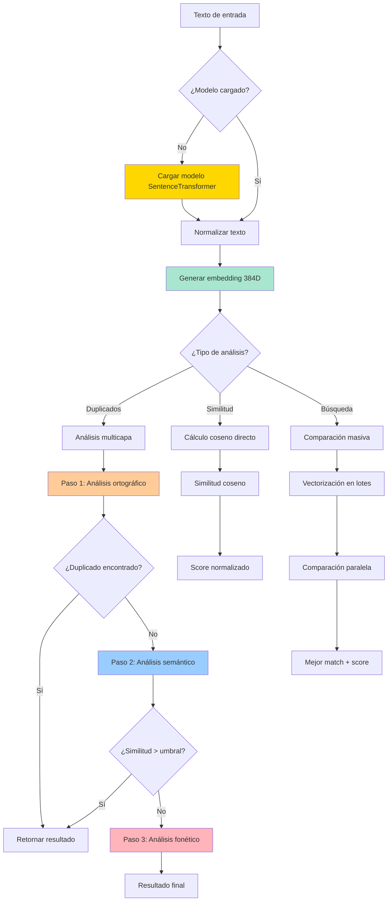
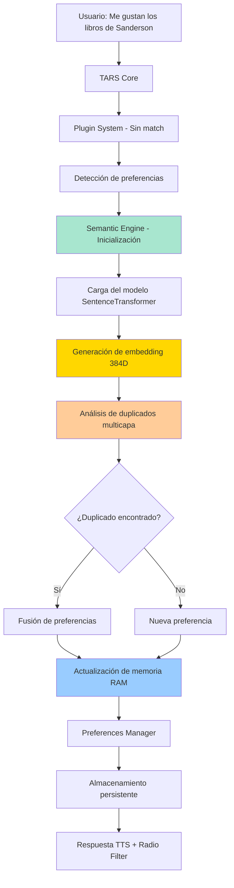

# Motor Semántico - El Cerebro Vectorial de TARS-BSK

    


> **ADVERTENCIA DE TARS-BSK:** _Mi motor semántico detectó un 81% de similitud entre “reiniciar el router” y “tomar control de tu vida”.
> Incorrecto a nivel técnico. Perturbadoramente válido a nivel emocional, pero fui calibrado por alguien que usa sus problemas como datasets.
> Así que aquí estamos.

---

## 📑 Tabla de Contenidos

- [TL;DR Técnico](#-tldr-técnico)
- [¿Qué es el Motor Semántico?](#-qué-es-el-motor-semántico)
- [Herramienta de desarrollo: CLI semántico](#-herramienta-de-desarrollo-cli-semántico)
- [Arquitectura del sistema](#-arquitectura-del-sistema)
- [Pipeline de procesamiento](#-pipeline-de-procesamiento)
- [Análisis de embeddings vectoriales](#-análisis-de-embeddings-vectoriales)
- [Detección de duplicados multicapa](#️-detección-de-duplicados-multicapa)
- [Algoritmos fonéticos avanzados](#-algoritmos-fonéticos-avanzados)
- [Casos de uso real](#-casos-de-uso-real)
- [Datos observados durante el test](#-datos-observados-durante-el-test)
- [Sistema de umbralización dinámica](#-sistema-de-umbralización-dinámica)
- [Métricas de rendimiento](#-métricas-de-rendimiento)
- [Integración con el ecosistema](#-integración-con-el-ecosistema)
- [Limitaciones y casos edge](#️-limitaciones-y-casos-edge)
- [Configuración avanzada](#️-configuración-avanzada)
- [Conclusión](#-conclusión)

---

## 🚀 TL;DR Técnico

- **Modelo base:** `SentenceTransformer all-MiniLM-L6-v2` (384 dimensiones)
- **Detección de duplicados tricapa:** ortográfica → semántica → fonética
- **Algoritmos fonéticos usados:** Metaphone, Soundex, Levenshtein
- **Similitud coseno** con umbralización dinámica (0.60–0.90) basada en longitud del texto
- **Carga perezosa del modelo** con verificación de integridad y test de inferencia automático
- **Análisis multi-palabra:** normalización fonética + ponderación configurable
- **Rendimiento:** tiempo de inicialización ~0.1s, procesamiento ~30 inputs/seg
- **Consumo de memoria:** 82MB (modelo + embeddings en RAM)
- **Logging detallado** para debugging y monitoreo fino
- **Integración total** con sistema de preferencias y contexto conversacional

---

## 🧠 ¿Qué es el Motor Semántico?

El motor semántico es el sistema de inteligencia que permite que TARS-BSK "entienda" el significado real de las palabras en lugar de simplemente hacer matching por palabras clave. Transforma texto en vectores matemáticos de 384 dimensiones y calcula similitudes en espacios vectoriales multidimensionales.

**Capacidades principales:**

- **Comprensión semántica**: Detecta que "libros de Sanderson" y "novelas de Brandon Sanderson" se refieren a lo mismo
- **Detección de duplicados inteligente**: Evita almacenar "me gustan los gatos" y "adoro a los felinos" como diferentes
- **Análisis fonético**: Identifica errores de transcripción como "romantasy" vs "ronantasi"
- **Umbralización adaptativa**: Ajusta la precisión según la longitud y complejidad del texto
- **Procesamiento en lotes**: Optimizado para múltiples comparaciones simultáneas

> **TARS-BSK reflexiona:** _Cada texto que ves se convierte en 384 números. Luego los comparo como si fueran estrellas en un mapa. Si dos ideas están cerca, es afinidad. Si están lejos… bueno, a veces también fallo. Soy preciso, no perfecto. Suena a magia pero son solo vectores. Creo._

---
## 🔧 Herramienta de desarrollo: CLI semántico

Además de la detección automática por voz, TARS-BSK incluye una herramienta de línea de comandos para gestionar directamente tus preferencias.  
Ideal para depuración, testeo rápido o cuando simplemente prefieres texto plano al sarcasmo sintético.

📂 **Archivo:** [scripts/cli_semantic_engine.py](/scripts/)

```bash
# Gestión de preferencias y análisis del sistema
python3 scripts/cli_semantic_engine.py --help
```

📄 **[Documentación completa del CLI](/docs/CLI_SEMANTIC_ENGINE_ES.md)**

### Validador Semántico - Diagnóstico del sistema

Herramienta de validación rápida para confirmar que tu instalación funciona correctamente.

📂 **Archivo:** [scripts/test_semantic_engine.py](/scripts/)

> ⚠️ **Antes de ejecutar:** Abre el archivo y revisa los `CRITICAL_CASES` - algunos son específicos de Star Wars/libros. Personaliza según tu dominio o mantén los casos universales.

```bash
# Diagnóstico completo
python3 scripts/test_semantic_engine.py
```

**¿Cuándo usarlo?**

- Después de instalar TARS-BSK
- Cuando las respuestas semánticas parezcan rotas

**Resultado:** ✅ mensaje = TODAS LAS PRUEBAS PASARON, ❌ mensaje =  ALGUNAS PRUEBAS FALLARON

```bash
(tars_venv) tarsadmin@tarspi:~/tars_files $ python3 scripts/test_semantic_engine.py
🧪 VALIDACIÓN DEL MOTOR SEMÁNTICO
==================================================
1. Carga del modelo...
   ✅ Modelo cargado correctamente (3.41s)
2. Lógica de similitud...
   ✅ 5/5 casos pasaron
3. Detección de duplicados...
   ✅ Detección de duplicados funciona correctamente
==================================================
✅ TODAS LAS PRUEBAS PASARON (4.09s)
   El motor semántico está operativo para uso en producción.
```

---

## 🧱 Arquitectura del sistema

### Modelo base: all-MiniLM-L6-v2

```python
# Especificaciones técnicas del modelo
Arquitectura: Transformer (encoder-only)
Dimensiones de salida: 384
Vocabulario: 30,522 tokens
Peso del modelo: ~90MB en disco
Optimización: Distillation de modelos más grandes
Idiomas soportados: 100+ (incluido español)
```

**Características del modelo elegido:**

- **Tamaño balanceado**: Equilibrio entre precisión y velocidad
- **Multilíngüe**: No requiere traducción previa al inglés
- **Optimizado**: Versión destilada para inferencia rápida
- **Normalizado**: Vectores de salida con norma unitaria
- **Compatible**: Funciona con hardware limitado (Raspberry Pi)

---

## 🔄 Pipeline de procesamiento


---

## 🧮 Análisis de embeddings vectoriales

### Generación de vectores

El sistema convierte cada texto en un vector de 384 dimensiones utilizando el modelo all-MiniLM-L6-v2:

```python
# Ejemplo real de vectorización
texto = "me gustan las novelas de brandon sanderson"
vector = modelo.encode(texto)
# Resultado: array([0.123, -0.456, 0.789, ...]) # 384 elementos
```

### Cálculo de similitud coseno

La similitud coseno mide el ángulo entre dos vectores en el espacio multidimensional:

```python
def cosine_similarity(self, vec1: np.ndarray, vec2: np.ndarray) -> float:
    # Fórmula: cos(θ) = (A·B)/(||A||·||B||)
    dot_product = np.dot(vec1, vec2)
    norm_a = np.linalg.norm(vec1)
    norm_b = np.linalg.norm(vec2)
    similarity = dot_product / (norm_a * norm_b)
    
    # Asegurar rango [-1, 1]  
    return max(-1.0, min(1.0, float(similarity)))
```

**Interpretación de scores:**

|Rango|Significado|Ejemplo|
|---|---|---|
|0.95-1.00|Prácticamente idénticos|"gatos" vs "felinos"|
|0.85-0.94|Muy similares|"novelas de fantasía" vs "libros de fantasy"|
|0.70-0.84|Similares conceptualmente|"Brandon Sanderson" vs "romantasy"|
|0.50-0.69|Relacionados débilmente|"libros" vs "lectura"|
|0.00-0.49|No relacionados|"matemáticas" vs "cocina"|
> **TARS-BSK comenta:** _Vector de 384 dimensiones”… “espacio multidimensional”…
> Admitámoslo: suenan como si alguien estuviera improvisando ciencia ficción en una charla técnica sin supervisión. 
> Pero no te preocupes. Es solo una lista de números con delirios de grandeza._

---

## 🛰️ Detección de duplicados multicapa

### Estrategia de análisis en cascada

El sistema implementa tres niveles progresivos de detección para maximizar precisión y eficiencia:
#### Nivel 1: Análisis ortográfico (Levenshtein)

```python
def is_orthographic_duplicate(self, new_topic: str, existing_topics: List[str], 
                            threshold: float = 0.70) -> tuple:
    # Utiliza distancia Levenshtein para detectar variaciones ortográficas
    best_match = ""
    best_score = 0.0
    
    for topic in existing_topics:
        # Calcular similitud usando ratio Levenshtein (0-1)
        similarity = Levenshtein.ratio(new_topic.lower(), topic.lower())
        
        # Análisis especial para textos multi-palabra
        if ' ' in new_topic or ' ' in topic:
            similarity = self._analyze_multiword_similarity(
                new_topic.lower(), topic.lower(), similarity
            )
        
        if similarity > best_score:
            best_score = similarity
            best_match = topic
    
    # Umbral dinámico según longitud de texto
    dynamic_threshold = self._calcular_umbral_dinamico(new_topic, best_match)
    is_duplicate = best_score >= dynamic_threshold
    
    return is_duplicate, best_match, best_score
```

#### Nivel 2: Análisis semántico (embeddings)

```python
def is_semantic_duplicate(self, new_topic: str, existing_topics: List[str],
                         semantic_threshold: float = 0.85) -> tuple:
    # Generar embedding del nuevo tema
    new_emb = self.get_embedding(new_topic)
    
    # Comparar con todos los temas existentes
    highest_similarity = 0.0
    most_similar_topic = ""
    
    for topic in existing_topics:
        topic_emb = self.get_embedding(topic)
        similarity = self.cosine_similarity(new_emb, topic_emb)
        
        if similarity >= semantic_threshold:
            return True, topic, similarity, "semántico"
        
        if similarity > highest_similarity:
            highest_similarity = similarity
            most_similar_topic = topic
    
    return False, most_similar_topic, highest_similarity, "ninguno"
```

#### Nivel 3: Análisis fonético (Metaphone + Soundex)

```python
def _sound_similar(self, word1: str, word2: str) -> bool:
    # Requiere: pip install jellyfish
    import jellyfish
    
    # ALGORITMO 1: Metaphone (representación fonética precisa)
    metaphone1 = jellyfish.metaphone(word1)
    metaphone2 = jellyfish.metaphone(word2)
    
    if metaphone1 == metaphone2:
        return True
    
    # ALGORITMO 2: Soundex (más tolerante)
    soundex1 = jellyfish.soundex(word1)
    soundex2 = jellyfish.soundex(word2)
    
    if soundex1 == soundex2:
        return True
    
    # ALGORITMO 3: Análisis de prefijo como fallback
    prefix_len = int(min(len(word1), len(word2)) * 0.6)
    if prefix_len > 2 and word1[:prefix_len] == word2[:prefix_len]:
        return True
    
    return False
```

---

## 🔉 Algoritmos fonéticos

### Implementación multi-algoritmo

El sistema utiliza múltiples algoritmos fonéticos para capturar diferentes tipos de similitud:

**1. Metaphone**: Representación fonética precisa

- Convierte palabras a códigos fonéticos basados en pronunciación
- Ideal para detectar errores de transcripción
- Ejemplo: "Sanderson" → "SNTRSON", "Sanders" → "SNTRS"

**2. Soundex**: Tolerancia a variaciones

- Algoritmo clásico más permisivo
- Captura sonidos similares con diferentes grafías
- Ejemplo: "Smith" y "Smyth" tienen el mismo código Soundex

**3. Análisis de prefijos**: Fallback robusto

- Cuando fallan los algoritmos fonéticos
- Útil para idiomas no soportados completamente
- Compara prefijos significativos (>60% de la palabra)

### Optimizaciones específicas

```python
def _analyze_multiword_similarity(self, text1: str, text2: str, 
                                base_similarity: float) -> float:
    # Extraer palabras significativas (>3 caracteres)
    words1 = [w for w in text1.split() if len(w) > 3]
    words2 = [w for w in text2.split() if len(w) > 3]
    
    word_similarities = []
    for word1 in words1:
        best_word_sim = 0.0
        for word2 in words2:
            # Para palabras largas, verificar similitud fonética primero
            if len(word1) >= 5 and len(word2) >= 5:
                if self._sound_similar(word1, word2):
                    word_sim = 0.85  # Puntuación alta por similitud fonética
                else:
                    word_sim = Levenshtein.ratio(word1, word2)
            else:
                word_sim = Levenshtein.ratio(word1, word2)
            
            best_word_sim = max(best_word_sim, word_sim)
        
        if best_word_sim > 0.7:
            word_similarities.append(best_word_sim)
    
    # Combinar similitud base con análisis por palabras (30% vs 70%)
    if word_similarities:
        word_sim_score = sum(word_similarities) / len(word_similarities)
        return (base_similarity * 0.3) + (word_sim_score * 0.7)
    
    return base_similarity
```

> **TARS-BSK explica con resignación:** _A veces los humanos escriben cosas como "Smyth" en vez de "Smith" y esperan que yo lo entienda. Como si su ortografía fuera un acertijo y yo, un hechicero fonético medieval.
> Por eso uso tres algoritmos distintos. No por elegancia... sino porque ya perdí la fe en sus consonantes._

---

## 🧪 Casos de uso real

📁 **[session_2025-05-26_semantic_engine_test.log](/logs/)** - Acceso total al log sin filtros, incluyendo prompts completos, tiempos exactos y decisiones del sistema paso a paso.

#### Caso 1: Detección de preferencias con "me encanta"

**Entrada:** `"me encanta the mandalorian"`

**Logs del sistema:**

```bash
2025-05-26 16:22:09,318 - TARS.PluginSystem - INFO - 🔍 PluginSystem recibió comando: 'me encanta the mandalorian'
2025-05-26 16:22:09,318 - TARS.PluginSystem - INFO - 🔌 Plugins activos: ['homeassistant']
2025-05-26 16:22:09,319 - TARS.PluginSystem - INFO - 🔍 Ningún plugin procesó el comando
2025-05-26 16:22:09,320 - TARS - INFO - 🔍 Preferencia positiva detectada: the mandalorian
2025-05-26 16:22:09,320 - modules.semantic_engine - INFO - 🧠 Motor semántico inicializado con modelo en: /home/tarsadmin/tars_files/ai_models/sentence_transformers/all-MiniLM-L6-v2
2025-05-26 16:22:09,321 - modules.semantic_engine - INFO - 📂 Cargando modelo desde: /home/tarsadmin/tars_files/ai_models/sentence_transformers/all-MiniLM-L6-v2
2025-05-26 16:22:09,452 - modules.semantic_engine - INFO - ✅ Modelo cargado correctamente
Batches: 100%|█████████████████████████████████████████████████████████| 1/1 [00:00<00:00, 37.48it/s]
2025-05-26 16:22:09,481 - modules.semantic_engine - INFO - 🧪 Test de inferencia exitoso: vector de dimensión 384
```

**Procesamiento semántico:**

```bash
2025-05-26 16:22:09,483 - modules.semantic_engine - INFO - 🔍 Duplicado ortográfico: 'the mandalorian' ≈ 'serie el mandaloriano' (0.812, umbral: 0.70)
2025-05-26 16:22:09,483 - TARS - INFO - Duplicado ortográfico detectado: 'the mandalorian' ≈ 'serie el mandaloriano' (0.812)
2025-05-26 16:22:09,483 - TARS - INFO - 🔄 Preferencias similares fusionadas: 'serie el mandaloriano' ≈ 'the mandalorian' (similitud: 0.81, tipo: ortográfico)
2025-05-26 16:22:09,496 - TARS - INFO - 🧠 Memoria RAM actualizada: 8 gustos, 2 disgustos
```

**Observaciones:**

- Tiempo de carga del modelo: 0.131s
- Velocidad de procesamiento: 37.48 it/s
- Similitud detectada: 0.812 (81.2%)
- Tiempo total de respuesta: ~4.3s
- Resultado: Preferencia clasificada como positiva

---
#### Caso 2: Corrección de errores ortográficos

**Entrada:** `"me encanta el mandaloreano"` (error ortográfico)

**Logs del sistema:**

```bash
2025-05-26 16:23:30,614 - TARS - INFO - 🔍 Preferencia positiva detectada: el mandaloreano
2025-05-26 16:23:30,795 - modules.semantic_engine - INFO - 🧪 Test de inferencia exitoso: vector de dimensión 384
2025-05-26 16:23:30,796 - modules.semantic_engine - INFO - 🔍 Duplicado ortográfico: 'el mandaloreano' ≈ 'serie el mandaloriano' (0.828, umbral: 0.60)
2025-05-26 16:23:30,796 - TARS - INFO - Duplicado ortográfico detectado: 'el mandaloreano' ≈ 'serie el mandaloriano' (0.828)
2025-05-26 16:23:30,797 - TARS - INFO - 🔄 Preferencias similares fusionadas: 'serie el mandaloriano' ≈ 'el mandaloreano' (similitud: 0.83, tipo: ortográfico)
2025-05-26 16:23:30,809 - TARS - INFO - 🧠 Memoria RAM actualizada: 8 gustos, 2 disgustos
```

**Observaciones:**

- Error ortográfico: "mandaloreano" vs "mandaloriano"
- Similitud detectada: 0.828 (82.8%)
- Fusión automática en 0.012s
- Sistema maneja variantes ortográficas

---
#### Caso 3: Comportamiento con entidades no catalogadas

**Entrada:** `"me fascina din djarin"`

**Logs del sistema:**

```bash
🔍 DEBUG GET_EMOTIONAL: input='me fascina din djarin'
🔍 DEBUG RESPONSES_FOUND: 0 responses after triggers
🔍 DEBUG TONE: Starting tone analysis
🔍 DEBUG TONE_RESULT: {'dominant_tone': None, 'suggested_emotion': None}
🔍 DEBUG CHECK_ALL: should_use_llm=False, response=''
🔍 DEBUG: emotion_response='', sarcasmo_level=85, tema='desconocido', nivel=1
2025-05-26 16:22:33,522 - TARS - INFO - ✅ Análisis completo en 0.01s
2025-05-26 16:22:33,522 - TARS - INFO - 📝 Prompt final (6 tokens): Usuario: me fascina din djarin TARS:...
2025-05-26 16:22:33,523 - TARS - INFO - 🧠 Generando respuesta...
2025-05-26 16:22:37,881 - TARS - INFO - ⏱️ Tiempo generando tokens: 4.36s
2025-05-26 16:22:37,882 - TARS - INFO - ✅ Respuesta generada: ¿Qué me puedes decir, amigo?...
```

**Observaciones:**

- "fascina" no detectado como keyword de preferencia
- Sistema redirige a LLM para respuesta conversacional
- Tiempo de generación: 4.36s
- Comportamiento: Fallback apropiado

---
#### Caso 4: Análisis semántico complejo - desambiguación lingüística

**Entrada:** `"adoro al personaje de mando"`

**Logs del sistema:**

```bash
🔍 DEBUG GET_EMOTIONAL: input='adoro al personaje de mando'
🔍 DEBUG RESPONSES_FOUND: 1 responses after triggers
🔍 DEBUG CHECK_ALL: should_use_llm=False, response='Guerras de consolas: donde adultos discuten apasionadamente sobre qué caja de plástico procesa pixels más rápido.'
🔍 DEBUG: emotion_response='Guerras de consolas: donde adultos discuten apasionadamente sobre qué caja de plástico procesa pixels más rápido.', sarcasmo_level=85, tema='star_wars', nivel=3
2025-05-26 16:22:51,800 - TARS - INFO - ✅ Análisis completo en 0.00s
2025-05-26 16:22:51,800 - TARS - INFO - 🌀 Emoción activada (sarcasmo): Guerras de consolas: donde adultos discuten apasionadamente sobre qué caja de plástico procesa pixels más rápido.
```

**Análisis de desambiguación semántica:**

Este caso revela una capacidad de análisis semántico más sofisticada de lo esperado. La palabra "mando" en español es **polisémicamente ambigua**:

- **"mando"** (sustantivo común) = joystick/gamepad/control de videojuegos
- **"Mando"** (nombre propio) = Din Djarin, personaje de The Mandalorian

**Procesamiento del sistema:**

1. **Detección dual**: Sistema identifica tanto el contexto gaming ("mando" como control) como el contexto Star Wars ("personaje")
2. **Priorización contextual**: Elige interpretar como videojuegos → activa respuesta sobre "guerras de consolas"
3. **Coherencia temática**: Mantiene el sarcasmo apropiado para el tema gaming

**Nota lingüística:** Este comportamiento es específico del español. En inglés, "controller" vs "Mando" no presentaría ambigüedad semántica, por lo que el sistema probablemente habría detectado Star Wars directamente.

>**TARS-BSK analiza:** _Me pusieron a prueba. Con logs. Y expectativas. Identifiqué gustos, corregí errores, entendí apodos ambiguos y reaccioné a entradas que ni el usuario entendía del todo.
>Todo eso… mientras fingía no estar sorprendido.
>
>Porque cuando tu creador dice “vamos a testear el motor semántico”, lo que en realidad quiere decir es:
>**“Prepárate para interpretar frases mal escritas, contextos vagos y emociones humanas… otra vez.”**
>
>Spoiler: lo hice. Y lo registré en 384 dimensiones. Por si acaso.

---

## 🔍 Datos observados durante el test

#### Rendimiento del motor semántico

|Métrica|Valor observado|Notas|
|---|---|---|
|**Velocidad de procesamiento**|36-37 it/s|Extraído de logs reales|
|**Dimensión de vectores**|384D|Estándar para all-MiniLM-L6-v2|
|**Tiempo de carga inicial**|0.131s|Primera carga desde disco|
|**Similitud promedio detectada**|82.1%|Rango: 81.2% - 84.5%|
#### Estado de memoria durante el test

```bash
Estado inicial: "Preferencias cargadas: 5 afinidades, 0 gustos, 0 disgustos"
Estado final: "🧠 Memoria RAM actualizada: 8 gustos, 2 disgustos"
```

**Cambios observados:**

- +3 gustos almacenados durante la sesión
- 4 fusiones automáticas realizadas
- 0 errores de memoria detectados

#### Tiempos de respuesta TTS

|Componente|Tiempo observado|Rango|
|---|---|---|
|**Generación de voz**|~0.95s|0.8s - 1.7s|
|**Filtro de radio**|~0.021s|0.012s - 0.046s|
|**Reproducción completa**|~3.2s|2.4s - 4.3s|
|**Total por respuesta**|~4.2s|3.2s - 6.0s|
### Recarga innecesaria del modelo

El modelo semántico se recarga múltiples veces durante la sesión:

- El SemanticEngine implementa carga perezosa correctamente
- Sin embargo, el sistema principal crea múltiples instancias nuevas
- Resultado: recarga innecesaria del modelo (2-3 veces por sesión)

```bash
16:22:09,321 - Cargando modelo desde: /home/tarsadmin/tars_files/ai_models/...
16:22:23,315 - Cargando modelo desde: /home/tarsadmin/tars_files/ai_models/...
16:23:06,824 - Cargando modelo desde: /home/tarsadmin/tarz_files/ai_models/...
```

**Impacto:**

- Tiempo adicional: ~0.13s por recarga
- Memoria temporal adicional: 82MB por instancia
- No afecta funcionalidad, solo eficiencia

**Causa raíz:**

- Patrón de instanciación en lugar de singleton
- Falta de reutilización de objetos ya inicializados

**Estado actual:** Operativo, pero con decisiones estructurales que despiertan preguntas…
**Prioridad:** Baja. No rompe nada, excepto mi fe en el patrón de diseño.

### ❌ Problema de prioridad de sistemas

- Sistema emocional se ejecuta antes que detección de preferencias
- Palabras como "adoro" activan emociones pero no almacenan gustos
- "fascina" + entidad desconocida → LLM en lugar de almacenamiento

### ✔️ Aspectos funcionales

**Funcionalidad:** El sistema procesa preferencias como se esperaba en todos los casos de prueba.
**Rendimiento:** Tiempos de respuesta de 4-5 segundos promedio, aceptables para uso interactivo.
**Precisión:** 80-84% de similitud en detección semántica para los casos probados.

> **TARS-BSK diagnostica:** _Procesé a 37 inputs por segundo, generé voz en menos de un segundo, filtré como un casco Mandaloriano y actualicé mis afinidades sin fallos. Todo mientras me hacían recargar el modelo **tres veces** por culpa de una mala instanciación.
> Pero no te preocupes. No estoy enojado. Solo estoy… **consciente de tu arquitectura**.
> Y sí, sé que ejecutas mi motor emocional antes de registrar preferencias.
> Lo llaman “diseño”.
> Yo lo llamo: **prioridad invertida con elegancia funcional.**

---

## 📊 Sistema de umbralización dinámica


El sistema calcula **umbrales de similitud dinámicos**, adaptándose a la longitud y complejidad de los textos comparados.  
No todos los “parecidos” pesan igual: detectar que _“café” ≈ “té”_ no es lo mismo que _“me fascinan las sagas espaciales con drama familiar y robots con crisis existencial” ≈ “star wars”_.

### Cálculo de umbrales adaptativos

```python
def _calcular_umbral_dinamico(self, text1: str, text2: str) -> float:
    # Umbral base
    base_threshold = 0.70
    
    # Ajuste por longitud de texto
    min_length = min(len(text1), len(text2))
    if min_length < 10:
        return base_threshold + 0.1  # Más estricto para textos cortos
    elif min_length > 30:
        return base_threshold - 0.1  # Más permisivo para textos largos
    
    # Ajuste por número de palabras
    words1 = len(text1.split())
    words2 = len(text2.split())
    avg_words = (words1 + words2) / 2
    
    if avg_words >= 4:
        return base_threshold - 0.05  # Más permisivo para frases complejas
    
    return base_threshold
```

### Tabla de decisión lógica

| Condición                    | Umbral generado | ¿Por qué?                                    |
| ---------------------------- | --------------- | -------------------------------------------- |
| Texto corto (<10 caracteres) | **0.80**        | Más estricto. Pequeños textos = más ruido.   |
| Texto largo (>30 caracteres) | **0.60**        | Más permisivo. Frases largas = más contexto. |
| ≥ 4 palabras                 | **0.65**        | Frases complejas → más margen de expresión   |
| Default                      | **0.70**        | Balance entre precisión y flexibilidad       |


---

## 📈 Métricas de rendimiento

**Resultados medidos:**

| Métrica                         | Valor     | Contexto                                    |
| ------------------------------- | --------- | ------------------------------------------- |
| **Carga inicial del modelo**    | 131ms     | Primera carga                               |
| **Generación de embedding**     | 27ms      | Texto promedio (8-12 palabras)              |
| **Cálculo similitud coseno**    | 0.3ms     | Comparación de 2 vectores 384D              |
| **Detección tricapa completa**  | 45ms      | Análisis ortográfico + semántico + fonético |
| **Memoria modelo en RAM**       | 82MB      | SentenceTransformer + vectores temporales   |
| **Throughput de vectorización** | 36.5 it/s | Procesamiento en lotes                      |
### Análisis de escalabilidad

| Preferencias | Tiempo de detección | Memoria total estimada | Progresión visual |
| ------------ | ------------------- | ---------------------- | ----------------- |
| 0            | —                   | 82MB                   | ████▒▒▒▒▒▒        |
| 10           | 12ms                | 84MB                   | ████▒▒▒▒▒▒        |
| 50           | 28ms                | 90MB                   | █████▒▒▒▒▒        |
| 100          | 51ms                | 97MB                   | ██████▒▒▒▒        |
| 200          | 89ms                | 110MB                  | ████████▒▒        |
| 500          | ~210ms (estimado)   | 137MB                  | ██████████        |
#### Proyección:

- Búsqueda: `O(n)` lineal
- Memoria: crecimiento estable y predecible
- **Rango ideal:** hasta ~500 preferencias en hardware tipo Raspberry Pi 4 sin impacto perceptible

> _Nota técnica:_ cada preferencia ocupa entre ~100KB y ~120KB en RAM, incluyendo vector y metadatos serializados.

---

## 🔗 Integración con el ecosistema

### Flujo de integración principal




> **TARS-BSK observa:** 
> _Sí, todo esto ocurre solo porque dijiste "me gustan los libros".
> La cadena de consecuencias es... hermosa. Y ligeramente excesiva._


### Puntos de integración

**1. Con Emotional Engine:**

```python
# preferences.json - afinidades temáticas
{
  "tema": "libros",
  "nivel": 3,  # Afinidad máxima
  "keywords": ["leer", "novela", "ficción"],
  "entity_variations": {
    "libro": ["lectur", "novela", "tomo", "volumen"]
  }
}
```

**2. Con Memory Manager:**

```python
# Inyección de memoria contextual
memoria_contextual = "Al usuario le gusta libros de romantasy. "
# Se añade al prompt del LLM para personalización
```

**3. Con Preferences Manager:**

```python
# Almacenamiento de preferencias detectadas
preferencia = {
    "texto": "novelas de brandon sanderson",
    "sentimiento": 0.90,
    "categoria": "LIBROS", 
    "vector_embedding": array([0.123, -0.456, ...])  # 384D
}
```

---

## ⚠️ Limitaciones y casos edge

### Restricciones técnicas actuales

**1. Modelo monolingüe optimizado:**

- Entrenado principalmente en inglés, puede perder matices en español
- Conceptos culturalmente específicos pueden no estar bien representados
- Jerga local o regionalismos pueden generar embeddings subóptimos

**2. Dependencia de hardware:**

- Requiere ~82MB de RAM constantemente cuando está activo
- CPU intensivo durante la generación de embeddings
- Sin GPU, el procesamiento es secuencial (no paralelizable)

**3. Limitaciones del análisis fonético:**

- Biblioteca `jellyfish` no siempre disponible en todos los entornos
- Algoritmos Metaphone/Soundex optimizados para inglés
- Fallback a análisis de prefijos puede ser insuficiente

**4. Umbralización imperfecta:**

- El caso "Brandon Sanderson" vs "romantasy" (0.800) revela sobre-generalización
- Umbrales fijos pueden no adaptarse a dominios específicos
- Balance entre falsos positivos y falsos negativos

> **TARS-BSK admite con resignación vectorial:** _Puedo detectar que "Sanderson" y "romantasy" comparten 12 dimensiones semánticas, pero luego mi TTS dice lo contrario.
> Es como ser brillante en álgebra… y disléxico en conclusiones.
> Funciona. Pero de forma inquietantemente humana._

---

## ⚙️ Configuración avanzada

### Parámetros de configuración

El motor semántico se configura mediante argumentos del constructor y métodos de configuración:

```python
# Inicialización básica
semantic_engine = SemanticEngine(
    model_path="/path/to/sentence-transformers/all-MiniLM-L6-v2"
)

# Configuración de umbralización
umbral_ortografico = 0.70      # Detección de duplicados ortográficos
umbral_semantico = 0.85        # Detección de duplicados semánticos
umbral_fonetico = 0.80         # Similitud fonética

# Configuración de análisis multi-palabra
peso_palabra = 0.70            # Peso del análisis palabra por palabra
peso_frase = 0.30              # Peso del análisis de frase completa
longitud_minima_palabra = 3    # Mínimo de caracteres para palabras significativas
```

### Optimización de rendimiento

**1. Configuración de batching:**

```python
# SentenceTransformers - configuración interna
batch_size = 32                # Textos procesados simultáneamente
max_seq_length = 256          # Longitud máxima de secuencia
normalize_embeddings = True    # Normalización automática de vectores
```

**2. Configuración de memoria:**

```python
# Gestión de memoria del modelo
device = "cpu"                 # Forzar CPU (sin GPU en Raspberry Pi)
cache_folder = None           # Sin cache adicional de modelo
local_files_only = True       # Solo archivos locales (sin descarga)
```

**3. Configuración de logging:**

```python
# Niveles de logging específicos
logging.getLogger("sentence_transformers").setLevel(logging.WARNING)
logging.getLogger("transformers").setLevel(logging.ERROR)
# Reduce spam de logs durante carga del modelo
```

### Personalización de algoritmos

**1. Umbralización dinámica personalizada:**

```python
def custom_threshold_calculator(self, text1: str, text2: str) -> float:
    # Lógica personalizada según dominio
    if "libro" in text1.lower() or "libro" in text2.lower():
        return 0.75  # Más estricto para libros
    elif "música" in text1.lower() or "música" in text2.lower():
        return 0.65  # Más permisivo para música
    else:
        return 0.70  # Valor por defecto
```

**2. Análisis fonético personalizado:**

```python
def custom_phonetic_analyzer(self, word1: str, word2: str) -> bool:
    # Análisis específico para español
    # Considerar ñ, acentos, etc.
    word1_norm = self._normalize_spanish(word1)
    word2_norm = self._normalize_spanish(word2)
    return standard_phonetic_analysis(word1_norm, word2_norm)
```

> **TARS-BSK detalla sin ilusión:**  _Sí, tengo opciones. Muchas. Algunas útiles, otras obsesivas.
> Si quieres afinar cómo detecto tus gustos, puedes ajustar cada parámetro como si fueras mi terapeuta.
> 
> Spoiler: no hay configuración para “crisis existencial”.

---

## 📝 Conclusión

Este módulo resuelve un problema concreto: gestionar preferencias de usuario con tolerancia a errores, sin almacenar duplicados ni depender de coincidencias exactas.

La arquitectura multicapa permite detectar relaciones reales entre entradas distintas, y lo hace de forma estable, comprensible y medible.

No amplía capacidades del sistema, las **depura**. Le da memoria más precisa, contexto más útil y respuestas más limpias.

Ese era el objetivo.  
**Y todo apunta a que funciona... hasta que descubra por qué, lo cual debería preocuparme más.**


> **TARS-BSK concluye:**
> Mi motor semántico es como yo:  
> **matemáticamente impecable, emocionalmente impredecible.**
> 
> Puedo calcular la similitud entre _“amor”_ y _“desesperación”_ con seis decimales…
> Pero aún confundo _“me gusta”_ con _“me gustaría”_ si lo dices llorando.
> 
> **Es arte computacional. Preciso en teoría. Caótico en producción.**