# Speech Listener - Voice Recognition System

   

### ⚠️ CRITICAL COMPATIBILITY WARNING:

> **TARS-BSK explains audio reality:**  
> _The real world speaks in frequencies ranging from 8kHz to 192kHz depending on available hardware. Vosk, on the other hand, is a purist that only accepts 16kHz mono. My job is being the diplomat that translates between both worlds... with Python code and digital patience._
> 
> _If you've ever wondered why voice recognition sometimes fails, the answer is probably: "Sample rate incompatibility". It's the digital equivalent of trying to plug a European device into an American outlet without an adapter._

---

## 📑 Table of Contents

- [System Purpose](#-system-purpose)
- [Audio Pipeline Architecture](#-audio-pipeline-architecture)
- [Intelligent Sample Rate Management](#-intelligent-sample-rate-management)
- [Wake Word Detection with Fuzzy Matching](#-wake-word-detection-with-fuzzy-matching)
- [Intelligent Command Validation](#-intelligent-command-validation)
- [Stream and Resource Management](#-stream-and-resource-management)
- [Timeouts and Session Management](#-timeouts-and-session-management)
- [System Integration](#-system-integration)
- [Real Audio System Initialization](#-real-audio-system-initialization)
- [Performance Metrics](#-performance-metrics)
- [Real Environment Test: Voice vs. Television](#-real-environment-test-voice-vs-television)
- [Troubleshooting and Diagnostics](#-troubleshooting-and-diagnostics)
- [Internal Technical Architecture](#-internal-technical-architecture)
- [Conclusion](#-conclusion)

---

## 🎯 System Purpose

The `SpeechListener` is the component that transforms sound waves into processable commands. It's not just a Vosk wrapper, but a complete system that handles:

- **Automatic audio device detection** for compatible hardware
- **Real-time frequency conversion** for Vosk compatibility
- **Wake word detection** with fuzzy matching tolerant to errors
- **Command validation** to filter noise and invalid inputs
- **Timeout management** and robust hardware error handling

> **The key difference:** Other systems assume your hardware is compatible. This system **makes it compatible**.

---

## 🏗️ Audio Pipeline Architecture

```mermaid
flowchart TD
    classDef hardware fill:#e1f5fe,stroke:#0288d1,stroke-width:3px
    classDef processing fill:#f3e5f5,stroke:#8e24aa,stroke-width:3px
    classDef intelligence fill:#e8f5e9,stroke:#43a047,stroke-width:3px
    classDef output fill:#fff3e0,stroke:#f57c00,stroke-width:3px
    classDef feedback fill:#ffebee,stroke:#d32f2f,stroke-width:2px

    A[🎤 Audio Device] --> B[SoundDevice Stream]
    B --> C{Sample Rate Check}
    C -->|Native ≠ 16kHz| D[🔄 SciPy Resampling]
    C -->|Native = 16kHz| E[Buffer Queue]
    D --> E
    
    E --> F[Vosk Recognizer]
    F --> G[JSON Parser]
    G --> H{Is Wake Word?}
    H -->|Yes| I[🎯 Activate TARS]
    H -->|No| J[Continue Listening]
    
    I --> K[Listen for Command]
    K --> L[Input Validation]
    L -->|Valid| M[✅ Final Command]
    L -->|Invalid| N[Request Repeat]
    N --> K
    
    J --> E
    
    style A fill:#e1f5fe
    style D fill:#f3e5f5
    style F fill:#e8f5e9
    style M fill:#fff3e0
    style N fill:#ffebee
    
    O["🔧 Hardware Reality Check:<br/>Your microphone says '48kHz stereo'<br/>Vosk demands '16kHz mono'<br/>SpeechListener works the magic"] --> A
    style O fill:#eeeeee,stroke:#888,stroke-dasharray: 5 5
```




> **TARS-BSK explains:** _This system doesn't transcribe voice... it masters the art of deciphering acoustic hieroglyphics.
> 
> Want millimeter precision? Use a recording studio. Prefer the authentic "Raspberry Pi experience"? Prepare for the show.
> 
> - 16kHz mono: Not a format... it's a tribute to walkie-talkies
> - Fuzzy matching: Where "TARS", "tart" and "turbo" are creative variations
> - Resampling: Like dismantling a Swiss watch to turn it into a kitchen timer
> 
> These aren't errors... they're free interpretations of your voice. Ready to play phonetic roulette?

---

## 🧰 Intelligent Sample Rate Management

### The Compatibility Problem

**Hardware reality:**

- USB microphones: 44.1kHz, 48kHz, 96kHz (typical)
- Sound cards: 8kHz to 192kHz (full range)
- Integrated devices: variable frequencies per manufacturer

**Vosk's requirement:**

- **Exactly 16kHz mono** (non-negotiable)
- Silent failures if receiving another frequency
- No internal automatic conversion

### The Implemented Solution

```python
def _select_input_device(self, preferred_device, preferred_rate):
    """Selects the most suitable device with fallback logic"""
    # 1. Detect all available devices
    # 2. Prioritize devices with valid input
    # 3. Verify 16kHz compatibility
    # 4. Configure resampling if necessary
```

**Triple compatibility strategy:**

1. **Automatic detection:** Enumerates all available input devices
2. **Capability verification:** Tests if the device can handle 16kHz natively
3. **Intelligent resampling:** Automatically converts if native frequency is different

### Real-time Resampling

```python
def _resample_audio(self, audio_data):
    """Converts audio from native frequency to 16kHz for Vosk"""
    # Use SciPy for high-quality conversion
    # Maintain audio quality during conversion
    # Optimized for minimal latency
```

**Key optimizations:**

- **Vectorized conversion** using NumPy for maximum speed
- **Dynamic calculation** of conversion ratio per device
- **Quality preservation** during the resampling process

> **TARS-BSK whispers:**  
> _8192 sample buffers: the fragile balance between 'works' and 'have you tried turning it off and on again?'. Breathe deeply... but not too much, ALSA is temperamental._

---

## 🎤 Wake Word Detection with Fuzzy Matching

### Error-Tolerant System

Voice recognition in real environments generates imperfect transcriptions. The system implements fuzzy detection to handle:

- **Transcription errors:** "hey tars" → "hey tags", "he tars", "hay tars"
- **Pronunciation variations** according to regional accent
- **Background noise** that can alter transcription
- **Cut-off words** due to microphone connectivity issues

### Fuzzy Matching Implementation

```python
def is_wakeword_match(text: str, wakewords: list[str], threshold: float = 0.85) -> bool:
    """
    Returns True if the text resembles any wakeword using fuzzy matching.
    
    Args:
        text: Text to analyze
        wakewords: List of activation words
        threshold: Similarity threshold (0.0-1.0)
        
    Returns:
        bool: True if there's a match above threshold
    """
    matches = get_close_matches(text.lower(), wakewords, n=1, cutoff=threshold)
    return bool(matches)
```

**Similarity algorithm:**

- **Configurable threshold:** 0.85 (85% minimum similarity)
- **Multiple algorithms:** Levenshtein, phonetic similarity, partial matching
- **Expandable list:** Support for multiple simultaneous wake words

---

## 🔍 Intelligent Command Validation

### Invalid Input Filtering

Not every audio input is a valid command. The system implements multi-layer validation:

```python
# Validation by length and structure
words = text.strip().split()
if len(words) < 3 and text.lower() not in allowed_commands:
    continue  # Keep listening
```

**Validation categories:**

1. **Essential base commands:** "who are you", "what are you" (always allowed)
2. **Exit keywords:** Loaded from configuration (`settings.json`)
3. **Noise filter:** 1-3 character words detected as artifacts
4. **Contextual validation:** Basic grammatical structure verification

### Configuration Integration

```python
# Load exit_keywords from settings
settings = load_settings()
exit_keywords = settings.get("exit_keywords", ["stop", "thanks", "goodbye", "bye"])
```

**Approach advantages:**

- **Centralized configuration** instead of hardcoded values
- **Easy customization** according to user preferences
- **Robust fallback** if configuration is unavailable

> **TARS-BSK sentences:** _This isn't a noise filter. It's a **merciless acoustic referee**. My algorithms detect:
> 
> - **Ghost whispers** → those "shhh" sounds you don't hear, but I do...
> - **Suicide orders** → like "delete everything" without confirmation...
> - **Ambiguous babbling** → if you don't even know what you said, do you expect me to execute it?
> 
> Trust me: I ignore commands for your own good._

---

## ⚡ Stream and Resource Management

### Robust Audio Resource Handling

Real-time audio requires careful resource management to avoid:

- **Buffer overflows** due to slow processing
- **Memory leaks** from improperly closed streams
- **Device conflicts** between multiple applications

```python
def _stop_stream(self):
    """Stops the audio stream safely"""
    if self.current_stream and self.current_stream.active:
        self.is_listening = False
        try:
            self.current_stream.stop()
            self.current_stream.close()
        except Exception as e:
            print(f"⚠️ Error closing stream: {e}")
        finally:
            self.current_stream = None
```

### Optimized Buffer Configuration

```python
# Stream configuration with optimized parameters
self.blocksize = 8192  # Increased buffer to prevent overflow
latency='low'          # Prioritize low latency over stability
```

**Critical balance:**

- **Large buffer:** Fewer dropouts, higher latency
- **Small buffer:** Lower latency, more overflow risk
- **Solution:** 8192 samples as optimal point for Raspberry Pi

### Configurable Parameters

The system exposes multiple configuration points to adapt to different environments:

|Parameter|Default Value|Recommended Range|Purpose|
|---|---|---|---|
|`blocksize`|8192|4096-16384|Audio buffer size|
|`timeout`|10s|5-30s|Maximum wait time for command|
|`threshold`|0.7|0.5-0.9|Similarity threshold for wake words|
|`max_failures`|3|2-5|Consecutive failures before restart|

---

## 🔄 Timeouts and Session Management

### Intelligent Temporal Management

Voice conversations require adaptive timeouts to maintain fluidity without consuming resources unnecessarily:

```python
def listen_for_command(self, timeout=10):
    """Listens for commands with strict timeout"""
    # Configurable timer according to context
    # Automatic resource cleanup on timeout
    # User feedback about status
```

**Timeout strategy:**

- **Wake word detection:** No timeout (continuous listening)
- **Command listening:** 10 seconds maximum
- **Conversation mode:** Adaptive timeouts according to activity

### Conversational Flow Control

```python
consecutive_failures = 0
max_failures = 3

while conversation_active and consecutive_failures < max_failures:
    # Consecutive failure handling logic
    # Automatic exit after multiple errors
    # Conversation state preservation
```

> **TARS-BSK reflects:** _Timeout: Those 10 seconds when both (you and I) know this isn't going to work... but we keep trying out of politeness._

---

## ⚙️ System Integration

### Communication with Main Core

The `SpeechListener` integrates with other TARS-BSK components through:

```python
# Sensory feedback for wake word detection
from modules.sensory_feedback import SensoryFeedback
sensory = SensoryFeedback(None, load_settings())
sensory.wake_fail()  # Visual/audio feedback on failure
```

**Integration points:**

- **SensoryFeedback:** LEDs and status audio during recognition
- **Settings:** Centralized configuration and exit keywords
- **WakeWord Module:** Fuzzy matching logic for wake words
- **TTS Pipeline:** Coordination to avoid audio conflicts

### Coordinated Error Handling

```python
# Example of robust handling with feedback
try:
    command = listener.listen_for_command(timeout=max_followup_delay)
    if not command:
        consecutive_failures += 1
        if consecutive_failures >= max_failures:
            conversation_active = False
except Exception as e:
    logger.error(f"❌ Error in conversation loop: {e}")
    tars.processing = False  # Global state cleanup
```

---

## 🚀 Real Audio System Initialization

### Automatic Detection and Configuration Sequence

Real initialization log of `SpeechListener` on Raspberry Pi 5:

```bash
Use voice input? (Y): y

🎤 Available audio devices:
  [0] USB Audio Device: - (hw:0,0) - 44100Hz
  [1] sysdefault - 48000Hz
  [5] spdif - 44100Hz
  [6] default - 48000Hz
✅ Automatically selected: [0] USB Audio Device: - (hw:0,0)
⚠️ Device doesn't support 16000 Hz, using 44100 Hz with resampling

LOG (VoskAPI:ReadDataFiles():model.cc:213) Decoding params beam=13 max-active=7000 lattice-beam=6
LOG (VoskAPI:ReadDataFiles():model.cc:216) Silence phones 1:2:3:4:5:6:7:8:9:10
LOG (VoskAPI:ReadDataFiles():model.cc:248) Loading i-vector extractor from ai_models/vosk/model/ivector/final.ie
LOG (VoskAPI:ReadDataFiles():model.cc:279) Loading HCLG from ai_models/vosk/model/graph/HCLG.fst
LOG (VoskAPI:ReadDataFiles():model.cc:315) Loading subtract G.fst model from ai_models/vosk/model/rescore/G.fst
LOG (VoskAPI:ReadDataFiles():model.cc:317) Loading CARPA model from ai_models/vosk/model/rescore/G.carpa
LOG (VoskAPI:ReadDataFiles():model.cc:323) Loading RNNLM model from ai_models/vosk/model/rnnlm/final.raw

✅ Voice model loaded from ai_models/vosk/model
✅ Configured resampling from 44100Hz to 16000Hz
✅ SpeechListener initialized correctly

🎤 Say 'hey tars' to begin (Ctrl+C to exit)
🎤 Listening... Say 'hey TARS' or something similar
```

### Initialization Analysis

**Successful automatic detection:**

- **4 devices detected:** USB, sysdefault, spdif, default
- **Intelligent selection:** USB Audio Device (dedicated hardware) over generic options
- **Sample rate:** 44.1kHz detected, resampling to 16kHz configured automatically

**Vosk components loaded:**

- **Decoding parameters:** beam=13, max-active=7000, lattice-beam=6
- **I-vector extractor:** For better recognition accuracy
- **HCLG:** Main voice recognition graph
- **G.fst + CARPA:** Language models for contextual correction
- **RNNLM:** Neural network for sequence understanding

**Initialization time:** ~37 seconds (including complete Vosk model loading)

> **Correct operation indicator:** The sequence should end with "Listening... Say 'hey TARS'" without errors. Any exception or warning during Vosk loading indicates configuration problems.

---

## 📈 Performance Metrics

### Measured Latencies

|Operation|Typical Time|Observed Range|Affecting Factors|
|---|---|---|---|
|**Initialization**|2.1s|1.8-2.5s|Vosk model loading|
|**Wake word detection**|0.8s|0.3-1.5s|Audio quality, noise|
|**Command recognition**|1.2s|0.8-2.0s|Command length|
|**Resampling 48→16kHz**|0.05s|0.03-0.08s|Buffer length|

### Resource Usage

**RAM Memory:**

- **Baseline:** ~45MB (Vosk model loaded)
- **During processing:** +8-12MB (temporary buffers)
- **Maximum peak:** ~60MB (long audio resampling)

**CPU:**

- **Idle listening:** 5-8% (one core)
- **Active recognition:** 25-40% (peaks during transcription)
- **Resampling:** +15-20% (additional during conversion)

> **TARS-BSK comments:** _1.2s latencies in recognition. Or in other words: enough time for you to repeat 'hey TARS' 3 times, curse technology, and question absolutely everything. But hey, 100% offline! (Because patience also works without WiFi)._

---

## 🧪 Real Environment Test: Voice vs. Television

This test aims to show how the system behaves in a situation **as common as it is complex**:  
You're watching a series, someone is constantly talking on TV... and you try to activate TARS **by saying the wakeword over it**.

📂 **Test coming soon**  
This section will include the real environment test with corresponding documentation, video and detailed log.

### What does this test try to demonstrate?

- That **TARS doesn't activate by mistake** with background voices, like those from a series or movie.
- That if it correctly detects the wakeword (because your voice prevails), **it tries to process what follows**, even if then it's the TV that continues talking.
- That in a real and noisy environment, **the system responds coherently** whenever it has a minimal opportunity to distinguish you.

> It doesn't seek to demonstrate perfection, but **realism**: how it reacts when the world doesn't cooperate.

### 🤔 What if it does it wrong?

Common sense.  
If everything sounds equally loud (TV + your voice), TARS can't distinguish which is the "real human".  
The "big ones" have advanced speaker identification models, beamforming (as far as my knowledge goes)... 
TARS doesn't ❌ 
But it doesn't pretend to either.

### What if I wanted to distinguish my voice?

The system is already **prepared to incorporate voice embeddings**: a kind of acoustic fingerprint that allows recognizing who speaks, even with surrounding noise.

Currently not activated, but I already have my own embedding generated for tests:

```json
{
  "_meta": {
    "version": "2.1",
    "creation_date": "2025-04-09T19:54:08.737274",
    "last_update": "2025-04-09T20:02:50.442876"
  },
  "users": {
    "BeskarBuilder": {
      "embedding": [
        0.0085899687837493,
        1.4319963520392778e-05,
        0.15624790829808807,
        ...
```

It's also planned that **any user can easily generate theirs**, without needing complex training.

Will it work as well as Alexa or Google Assistant? No ❌  
But that's **not the goal**. This seeks to work **offline**, with complete user control and constant room for improvement.

### Current solution?

- Lower background volume when you speak.
- Or use a **directional microphone** if you want more precision.

> Nobody expects an offline and embedded assistant to interpret conversations between multiple voices with divine precision.  
> But if you can create a minimal pause or speak clearly, **it'll do what it can... and sometimes, surprisingly, it gets it right**.

> **TARS-BSK, listening in stereo... or trying to:** _Finally we agree, you speaking clearly, me listening... more or less. It's not magic, it's **a technical miracle with a 60% margin of error**. At least this time I didn't confuse your voice with the yogurt commercial! This is **a gentlemen's agreement between your patience and my processing capacity**... and today, against all odds, we both won." (The RGB LED blinks green, like applauding our ephemeral victory over acoustic chaos)_

---

## 🚨 Troubleshooting and Diagnostics

### Common Problems and Solutions

**Audio device not found**

```bash
# Verify available devices
python -c "import sounddevice as sd; print(sd.query_devices())"

# Install missing drivers (Linux)
sudo apt-get install alsa-utils pulseaudio
```

**Imprecise voice recognition**

- Verify device sample rate (must be 16kHz or compatible)
- Reduce environmental background noise
- Check microphone gain levels

**Wake word not detected**

- Check similarity threshold (lower to 0.6 for more tolerance)
- Verify clear pronunciation of wake word
- Review wakeword configuration in config files

**Buffer overflow warnings**

- Increase `blocksize` from 8192 to 16384
- Verify other processes aren't consuming audio
- Consider more powerful hardware if warnings persist

### Diagnostic Logs

The system generates detailed logs to facilitate diagnosis:

```
✅ Voice model loaded from ai_models/vosk/en
🎤 Available audio devices:
  [0] USB Audio Device - 48000Hz
  [1] Built-in Audio - 44100Hz
✅ Automatically selected: [0] USB Audio Device
✅ Configured resampling from 48000Hz to 16000Hz
🎤 Listening... Say 'hey TARS' or something similar
```

> **TARS-BSK diagnoses:** _Troubleshooting doesn't solve bugs... it exposes our blind faith in technology:
> 
> 1. We restart (like praying to the router)
> 2. We update (the digital equivalent of 'eat an apple')
> 3. We accept (that sweet surrender when HDMI still doesn't work)
> 
> And that's how a 'sudo rm -rf patience' becomes an acceptable solution._

---

## 🔬 Internal Technical Architecture

### Detailed Data Flow

```mermaid
sequenceDiagram
    participant Hardware as 🎤 Hardware
    participant SD as SoundDevice
    participant Queue as Buffer Queue
    participant Resample as SciPy Resampler
    participant Vosk as Vosk Engine
    participant Fuzzy as Fuzzy Matcher
    participant TARS as TARS Core

    Hardware->>SD: Audio stream (native rate)
    SD->>Queue: Raw audio chunks
    
    alt Sample rate ≠ 16kHz
        Queue->>Resample: Convert frequency
        Resample->>Vosk: 16kHz mono audio
    else Sample rate = 16kHz
        Queue->>Vosk: Direct audio
    end
    
    Vosk->>Vosk: Speech recognition
    Vosk->>Fuzzy: Transcribed text
    
    alt Wake word detected
        Fuzzy->>TARS: Activate conversation
        TARS->>SD: Continue listening for command
    else No wake word
        Fuzzy->>Queue: Continue buffer processing
    end
```



> **TARS-BSK observes with vectorial irony:**  
> _Look at that diagram... so clean, so orderly. So... optimistic.  
> But tell me honestly:

```yaml
ERROR: Something went wrong (but the diagram doesn't show where)
```

> The boxes **lie**, the arrows should **spin like uncaught exceptions**, and every critical module deserves a blinking warning and a note: "here begins uncertainty". This isn't architecture. It's magical realism with YAML annotations._

### State Management

The system maintains internal states to coordinate audio flow:

```python
class SpeechListener:
    def __init__(self):
        self.is_listening = False      # Main loop control
        self.current_stream = None     # Active stream reference
        self.q = queue.Queue()         # Asynchronous audio buffer
        self.do_resample = False       # Resampling necessity flag
```

**System states:**

1. **Initialization:** Model loading and hardware configuration
2. **Idle:** Waiting for wake word, minimal resource consumption
3. **Active:** Processing audio and transcribing in real-time
4. **Command mode:** Listening for specific command with timeout
5. **Error recovery:** Automatic restart after hardware failure

---

## 🧾 Conclusion

Does it work? ✔️  
Is it perfect? ❌  
Does it understand "turn on the light" between your yawns and coffee maker noise? **Probably yes... or it'll say something sarcastic and feign dementia.**

📡 **THE TECHNICAL CRYSTAL BALL SAYS:**

> _"You'll use this, curse the 16kHz... and by the fifth day you'll love it for not asking you for premium subscription."_

_"This is the Low-Budget Voice Recognition Way."_