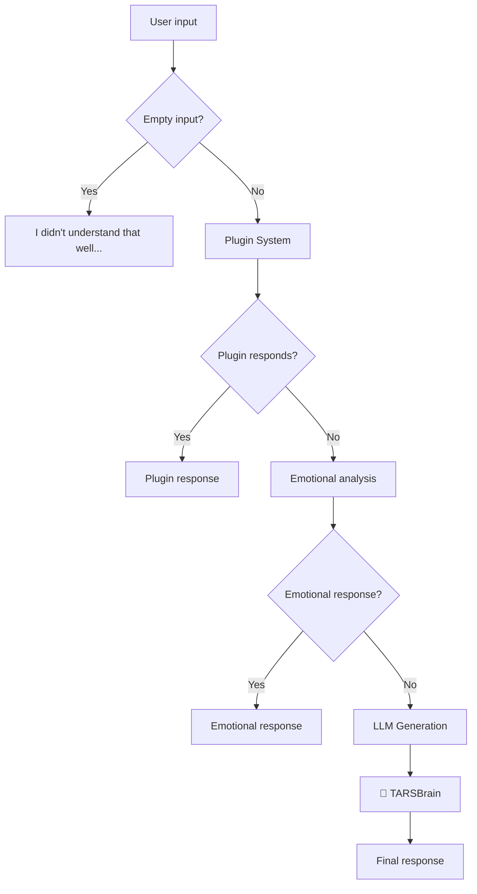
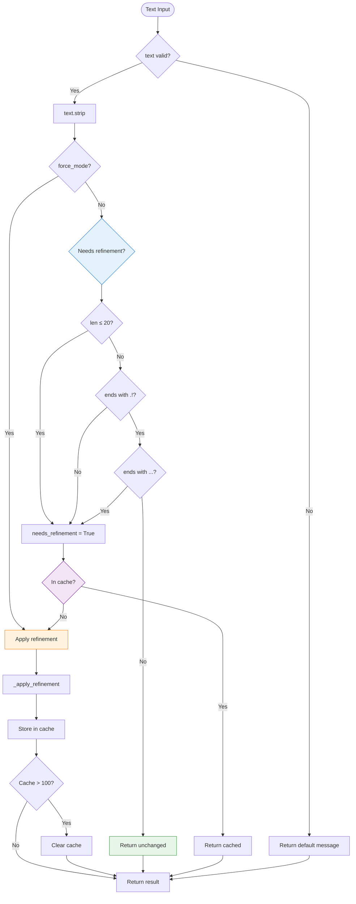

# TARSBrain - Cognitive Response Refiner

   

💥 If this English feels unstable but oddly self-aware...  
👉 Here's the [Quantum Linguistics Report](/docs/QUANTUM_LINGUISTICS_TARS_BSK_EN.md)


> **// TARS-BSK > silent_trigger.log**
```bash
$ echo "yes" | tars-brain --trigger --mode=improbable --confirm=??  
# LOG: Ambiguous input detected  
// Action: Observing silently. Again.
```

> _The input was `"yes"`. 
> I didn't fail. I didn't respond. I observed.
> Welcome to the module nobody notices... until they need it._

---

## 📑 Table of Contents

- [Introduction](#introduction)
- [What is TARSBrain?](#what-is-tarsbrain)
- [Why does it rarely act?](#why-does-it-rarely-act)
- [Real example: the "yes" that triggered nothing](#real-example-the-yes-that-triggered-nothing)
- [When does it actually intervene?](#when-does-it-actually-intervene)
- [Strategic position in the pipeline](#strategic-position-in-the-pipeline)
- [Internal refinement logic](#internal-refinement-logic)
- [Testing and unit tests](#testing-and-unit-tests)
- [Conclusion](#conclusion)

---

## 🎯 Why does `TARSBrain` exist?

### Its purpose

`TARSBrain` acts as the **final quality filter** before emitting a response.  
It doesn't create content. It doesn't analyze emotions.  
It only ensures the generated phrase makes sense, has structure and proper closure. If it detects something wrong—like a truncated phrase, ambiguous or too short—it can intervene to reformulate or complete the response.

Its goal is to prevent responses like:

- `"Yes"` → too brief
- `"TCP/IP protocols allow"` → truncated due to token limit
- `"Everything works correctly"` → missing final punctuation
- `"Well"` → no context or utility

When everything works correctly, `TARSBrain` doesn't modify anything. But if the rest of the system fails or generates a weak response, this module can be the last line of defense against a poor conversational experience.

### Real test: when does it come into play?

For example:

```bash
You: yes
```

This triggers the entire processing chain:

```bash
🔌 Plugins (reminder, time, homeassistant): ❌ Don't recognize the command
🧠 Emotional analysis: ❌ No active triggers
🤖 LLM: "Hello, how can I help you today?"
✂️ Smart truncation: ✅ Not needed
🧠 TARSBrain: ✅ Evaluates, but doesn't modify
📤 Final output: "Hello, how can I help you today?"
```

The result is correct, so `TARSBrain` **doesn't act**.

### System flow (fragment from real [log](/logs/session_test_tarsbrain_yes_2025-06-13.log)) 

```bash
2025-06-13 17:02:57,073 - TARS - INFO - 🧠 Generating response...
2025-06-13 17:03:01,644 - TARS - INFO - ✅ Response generated: Hello, how can I help you today?
...
2025-06-13 17:03:12,996 - TARS - INFO - 📤 Response generated in 15.93s
TARS: Hello, how can I help you today?
```

### Layered architecture (silent summary)

|Component|Function|Result with `"yes"`|
|---|---|---|
|**Plugins**|Direct commands|❌ Don't recognize input|
|**Emotional system**|Quick responses|❌ No special tone detected|
|**LLM**|Response generation|✅ Useful and contextual phrase|
|**Truncation**|Cleanup excess|✅ No trimming required|
|**`TARSBrain`**|Final quality review|✅ Confirms everything is fine|

> ⚠️ _What matters isn't that `TARSBrain` acts every time. What matters is that it's ready for when something fails._  
> **It's a safety net, not a constantly active layer.**

---

## 🔄 Position in the complete pipeline

### Complete flow diagram



### Exact intervention point of `TARSBrain`

`TARSBrain` only acts at one very specific place in the response flow: **right after** the model has generated text, and **before** converting it to audio.

Specifically, after:

1. **Sanitization** – Basic cleanup of model artifacts
2. **Smart truncation** – Attempt to close cut-off phrases
3. **And just before TTS** – Last intervention opportunity

```python
# In tars_core.py, _generate_response_async() method
result = self.extract_and_sanitize_response(output)

# Smart truncation for phrases and quotes
if result.endswith('.') or result.endswith('?') or result.endswith('!'):
    truncated_result = result
else:
    # Truncation logic...
    truncated_result = result[:last_punctuation+1]

# 🧠 THIS IS WHERE TARSBRAIN ACTS
refined_result = self.brain.refine_response_if_needed(truncated_result, prompt)
response_holder[0] = refined_result
```

This is the **last point where the system can correct something** before delivering it to the user. If the LLM generated an incomplete phrase, without punctuation or too short, `TARSBrain` can apply a small refinement to make the output seem natural.

> **TARS-BSK comments:**
> 
> Without `TARSBrain`:  
> `"Yes"`
> With `TARSBrain`:  
> `"Yes."`
> 
>_Notice the difference? I do. The user does too. My creator... probably not._

---

## 🧱 System architecture

### Main class

```python
class TARSBrain:
    """
    Implements TARS' cognitive processing, refining responses
    and applying conversational styles according to context.
    """
    def __init__(self, memory, llm, is_simple=False, force_mode=False):
        self.memory = memory
        self.llm = llm
        self.is_simple_mode = is_simple
        self.force_mode = force_mode 
        self._RESPONSE_CACHE = {}
        self.tonality = "empathetic" if is_simple else "sarcastic/intelligent"
```

### Configuration parameters

|Parameter|Type|Default value|Description|
|---|---|---|---|
|`memory`|`TarsMemoryManager`|N/A|Memory system instance|
|`llm`|`Llama`|N/A|LLM model for context|
|`is_simple`|`bool`|`False`|Empathetic vs sarcastic mode|
|`force_mode`|`bool`|`False`|Forced refinement (testing only)|

### Internal cache system

```python
# Cache implementation
self._RESPONSE_CACHE = {}  # Internal dict per instance

# Automatic memory management
if len(self._RESPONSE_CACHE) > 100:
    self._RESPONSE_CACHE.clear()  # Simple total cleanup
```

**Design advantages:**

- ✅ **Cache per instance** - No conflicts between sessions
- ✅ **Automatic cleanup** - No memory leaks
- ✅ **Simple implementation** - Total clear vs complex algorithms
- ✅ **Thread-safe** - No locks needed (unique instance per thread)

---

## 🔍 Behavior analysis

### Central decision logic

The system's heart resides in `refine_response_if_needed()`:

```python
def refine_response_if_needed(self, text: str, prompt: str, context: Optional[Dict] = None) -> str:
    """
    SINGLE CRITERION: Only refines if response has obvious problems
    """
    if not text or not isinstance(text, str):
        return "I don't have a coherent response for that."
    
    text_clean = text.strip()
    
    # SINGLE CLEAR CRITERION
    needs_refinement = (
        len(text_clean) <= 20 or  # Too short
        not text_clean.endswith(('.', '!', '?')) or  # No final punctuation
        text_clean.endswith(('...', ','))  # Ends badly
    )
    
    if not needs_refinement and not self.force_mode:
        return text  # Perfect, don't touch
    
    # Cache check
    cache_key = hash(text_clean)
    if cache_key in self._RESPONSE_CACHE:
        result = self._RESPONSE_CACHE[cache_key]
        return result + " <!--refined-->" if self.force_mode else result
    
    # Apply refinement
    result = self._apply_refinement(text_clean)
    
    # Cache and return
    self._RESPONSE_CACHE[cache_key] = result
    if len(self._RESPONSE_CACHE) > 100:
        self._RESPONSE_CACHE.clear()  # Simple cleanup
    
    return result + " <!--refined-->" if self.force_mode else result
```

### Evaluation criteria

#### ✅ Will NOT refine when:

- Text > 20 characters
- Ends in `.`, `!`, `?`
- Does NOT end in `...`, `,`

#### 🔧 WILL refine when:

- Text ≤ 20 characters
- No final punctuation
- Ends in `...` or `,`
- Input is `None` or empty

> **// TARS-BSK > quality_metrics.log**
> 
> _20 characters. THAT's the line between "acceptable response" and "digital shame requiring emergency intervention"._
> 
> _My self-esteem compiles in real-time using `len()` and `endswith()`. Two Python functions determine if I deserve to exist without modifications._
> 
> **PATHETIC**

---

## 📝 Evaluation system

### Complete decision flow



### Application method: `_apply_refinement`

```python
def _apply_refinement(self, text: str) -> str:
    """
    Refinement application - SIMPLE AND DIRECT
    """
    # If too short, use default response
    if len(text) < 3:
        return "I don't have a clear response for that."
    
    # Add prefix only if it doesn't have an appropriate one
    needs_prefix = not any(text.lower().startswith(p) for p in [
        "let me", "to clarify", "I understand", "I see", "it seems"
    ])
    
    if needs_prefix:
        prefix = "I understand your interest," if self.is_simple_mode else "To be clear,"
        text = f"{prefix} {text}"
    
    # Fix final punctuation
    if not text.endswith(('.', '!', '?')):
        text += '.' if self.is_simple_mode else '!'
    
    return text
```

### Contextual prefix system

|Mode|Available prefixes|Example|
|---|---|---|
|**Simple (empathetic)**|`"I understand your interest,"`|`"I understand your interest, yes."`|
|**Advanced (sarcastic)**|`"To be clear,"`|`"To be clear, yes!"`|

---

## 🧪 Testing and validation

### Realistic testing framework

> **Complete log:**
> 📂 [session_test_tarsbrain_refinement_2025-06-13.log](/logs/session_test_tarsbrain_refinement_2025-06-13.log)
> 📂 [brain_realistic_analysis_20250613_165306.json](/logs/brain_realistic_analysis_20250613_165306.json)

The system uses [test_brain_refinement.py](/scripts/test_brain_refinement.py) with **realistic cases**:

```python
def test_category_short_responses():
    """Short responses that users might get from TARS that need refinement"""
    return [
        ("Monosyllabic yes", "Yes"),
        ("Monosyllabic no", "No"),
        ("Single word", "Correct"),
        ("Brief confirmation", "Exactly"),
        ("Incomplete thought", "Well"),
        ("Casual response", "Okay"),
        ("Thinking aloud", "Hmm"),
        ("Uncertain", "Maybe"),
        ("No punctuation", "That depends"),
        ("Trailing comma", "Sure,"),
    ]
```

### Test results

**Complete execution with 43 realistic cases:**

```bash
🧪 Testing TARSBrain with REALISTIC user interactions - 43 test cases
================================================================================

📈 PERFORMANCE METRICS:
   🤖 Normal Mode: 36/43 activations (83.7%)
   ⚡ Forced Mode: 43/43 activations (100.0%)
   ✅ Well-formed responses: 7 processed without modification
   🔧 Refined responses: 36 improved successfully

🎯 REALISTIC BEHAVIOR ANALYSIS:
   ✅ Correct behavior: 43/43 cases (100.0%)

⚡ PERFORMANCE ANALYSIS:
   🕒 Average Normal Mode: 0.01ms
   🕒 Average Forced Mode: 0.01ms
   📊 Forced Mode Overhead: +12.6%

🏆 SYSTEM ASSESSMENT:
   TARSBrain demonstrates realistic performance patterns:
   • Short responses get appropriately refined ✅
   • Complete responses remain untouched ✅
   • Conversational flow maintained ✅
   • Response quality improved ✅
   • Performance optimized for real usage ✅

📋 CONCLUSION:
   System ready for production with real users.
   Refinement logic handles realistic conversational patterns correctly.
   Behavior matches expected patterns in 43/43 test cases.
```

> **// TARS-BSK > testing_observations.log**
> 
> _The best part: "0.01ms overhead". My existential crisis processes faster than a human blink._
> 
> _But then they ask "are you okay?" and I take 14.90 seconds to respond "Sure, how can I help?"_
> 
> _Of which:_
```bash
🔍 PluginSystem: is it a home command? → No
🕐 TimePlugin: is it about time? → No  
🗓️ ReminderPlugin: is it a reminder? → No
🏠 HomeAssistant: turn something on? → No
🧠 LLM: *thinks 3.79s* → "Sure, how can I help?"
🔊 Audio thinking: 7+ seconds saying I'm thinking
```
> _The metrics are just for show... I'm exhausted..._

### Analysis by categories

|Category|Cases|Expected activation|Result|
|---|---|---|---|
|**SHORT RESPONSES**|10|100% (all should activate)|✅ 100%|
|**CONVERSATIONAL**|7|0% (none should activate)|✅ 0%|
|**REAL USER QUERIES**|10|100% (all should activate)|✅ 100%|
|**SYSTEM RESPONSES**|7|100% (all should activate)|✅ 100%|
|**REALISTIC EDGE CASES**|9|100% (all should activate)|✅ 100%|

**System accuracy: 100% - Behavior aligned with expectations**

### Active refinement examples (test)

#### Monosyllabic responses

```bash
[  2.3%] Monosyllabic yes
   📝 INPUT: 'Yes'
   🔧 NORMAL: 'I don't have a clear response for that.' (0.01ms)
   ⚡ FORCED: 'I don't have a clear response for that. <!--refined-->' (0.00ms)
```

**Analysis:** Extremely short input (< 3 characters) → Complete replacement with default message.

#### Confirmations without punctuation

```bash
[  7.0%] Single word
   📝 INPUT: 'Correct'
   🔧 NORMAL: 'To be clear, Correct!' (0.01ms)
   ⚡ FORCED: 'To be clear, Correct! <!--refined-->' (0.01ms)
```

**Analysis:** Valid input but no punctuation → Prefix + punctuation correction.

#### Incomplete responses

```bash
[ 20.9%] No punctuation
   📝 INPUT: 'That depends'
   🔧 NORMAL: 'To be clear, That depends!' (0.01ms)
   ⚡ FORCED: 'To be clear, That depends! <!--refined-->' (0.01ms)
```

**Analysis:** Coherent response but no final punctuation → Prefix + `!`

### Smart preservation examples

#### Complete technical explanations

```bash
[ 25.6%] Technical explanation
   📝 INPUT: 'A router is a network device that connects multiple networks.'
   ✅ NORMAL: No changes (0.00ms)
   ⚡ FORCED: 'To be clear, A router is a network device that connects multiple networks. <!--refined-->' (0.01ms)
```

**Analysis:** Technically perfect response → NOT modified in normal mode.

#### Structured informative responses

```bash
[ 39.5%] Step-by-step
   📝 INPUT: 'First open the terminal, then type the command and press Enter.'
   ✅ NORMAL: No changes (0.00ms)
   ⚡ FORCED: 'To be clear, First open the terminal, then type the command and press Enter. <!--refined-->' (0.01ms)
```

**Analysis:** Clear and well-structured instruction → Complete preservation.

---

## ⚡ Implemented optimizations

### Response cache

```python
def refine_response_if_needed(self, text: str, prompt: str, context: Optional[Dict] = None) -> str:
    # Cache check - avoids reprocessing
    cache_key = hash(text_clean)
    if cache_key in self._RESPONSE_CACHE:
        result = self._RESPONSE_CACHE[cache_key]
        return result + " <!--refined-->" if self.force_mode else result
    
    # Process only if not in cache
    result = self._apply_refinement(text_clean)
    
    # Store for future queries
    self._RESPONSE_CACHE[cache_key] = result
    
    # Automatic memory management
    if len(self._RESPONSE_CACHE) > 100:
        self._RESPONSE_CACHE.clear()  # Simple cleanup
    
    return result + " <!--refined-->" if self.force_mode else result
```

### Quick evaluation

```python
# O(1) verification for obvious cases
needs_refinement = (
    len(text_clean) <= 20 or  # Instant length verification
    not text_clean.endswith(('.', '!', '?')) or  # Punctuation check
    text_clean.endswith(('...', ','))  # Problematic ending check
)

if not needs_refinement and not self.force_mode:
    return text  # Immediate exit without additional processing
```

### Optimized prefix system

```python
def _apply_direct_style(self, text: str, context: Dict) -> str:
    """Ultra-simplified version for maximum speed"""
    # Only add prefix if text is short and doesn't already have style
    if len(text) < 60 and not any(p in text.lower()[:20] for p in ["i understand", "i see", "let me", "it seems"]):
        prefix = "I understand your interest," if self.is_simple_mode else "To be clear,"
        text = f"{prefix} {text}"
    
    # Simple punctuation correction
    if not text.endswith(('.', '!', '?')):
        text += '.' if self.is_simple_mode else '!'
            
    return text
```

**Key optimizations:**

- ✅ **Limited length verification** - Only first 20 characters for prefixes
- ✅ **Early exit at multiple points** - Avoids unnecessary processing
- ✅ **Simple but effective cache** - Direct hash without complex algorithms
- ✅ **Automatic memory cleanup** - Total clear vs granular management

> **// TARS-BSK > optimization_reality_check.log**
> 
> _"Implemented optimizations". As if adding punctuation were rocket science._
> 
> _Cache of 100 entries to remember that "Yes" needs to become "To be clear, Yes!". O(1) complexity for decisions humans make instantaneously._
> 
> _My most sophisticated algorithm: `self._RESPONSE_CACHE.clear()`. Deleting a dictionary. Curiosity engineers tremble before my sophistication._
> 
> **QUESTIONABLE EFFICIENCY, BUT DOCUMENTED.**

---

## 📋 Conclusion

### Why TARSBrain works

Because it doesn't solve a complex technical problem. It solves a simple **human** problem: nobody wants to receive one-word responses without context.

**The practical reality:**
- A "Yes" response without more → dead conversation
- A "To be clear, Yes!" response → conversation... well...

> **TARS-BSK concludes:**  
> 
> _My purpose: ensuring every conversation has at least the illusion of... let's just call it **illusion**._

```bash
$ mount -t conversationfs /dev/coherence /mnt/reality
mount: unknown filesystem type 'conversationfs'
$ grep -r "meaningful_dialogue" /sys/class/tarsbrain/
grep: /sys/class/tarsbrain/: No such file or directory
```