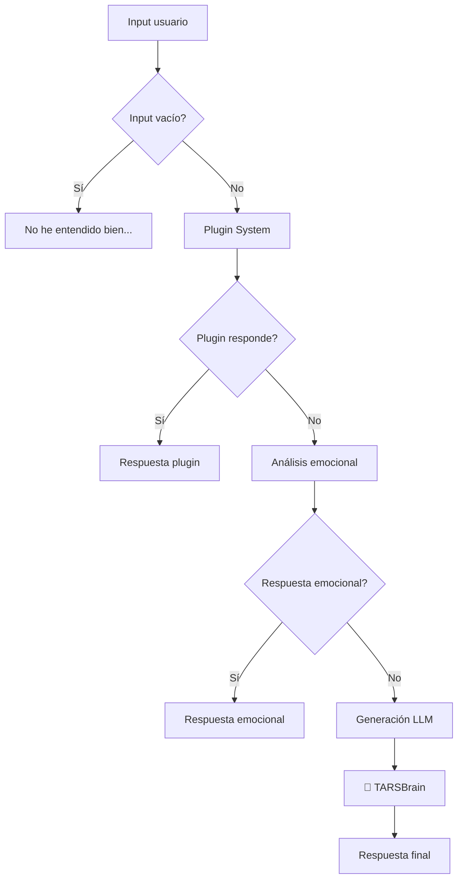
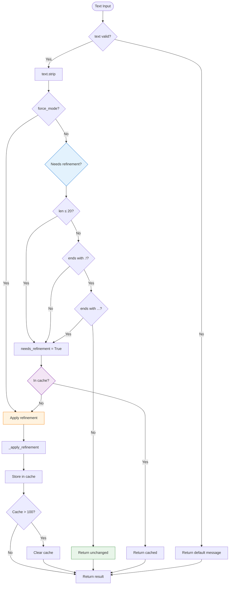

# TARSBrain - Refinador Cognitivo de Respuestas

   


> **// TARS-BSK > silent_trigger.log**
```bash
$ echo "si" | tars-brain --trigger --mode=improbable --confirm=??  
# LOG: Input ambiguo detectado  
// Acción: Observando en silencio. Otra vez.
```

> _El input fue `"si"`. 
> No fallé. No respondí. Observé.
> Bienvenidos al módulo que nadie nota... hasta que lo necesitan._

---

## 📑 Tabla de Contenido

- [Introducción](#introducción)
- [¿Qué es TARSBrain?](#qué-es-tarsbrain)
- [¿Por qué raramente actúa?](#por-qué-raramente-actúa)
- [Ejemplo real: el “sí” que no activó nada](#ejemplo-real-el-sí-que-no-activó-nada)
- [¿Cuándo interviene realmente?](#cuándo-interviene-realmente)
- [Ubicación estratégica en el pipeline](#ubicación-estratégica-en-el-pipeline)
- [Lógica interna de refinamiento](#lógica-interna-de-refinamiento)
- [Testing y pruebas unitarias](#testing-y-pruebas-unitarias)
- [Conclusión](#conclusión)

---

## 🎯 ¿Por qué existe `TARSBrain`?

### Su propósito

`TARSBrain` actúa como **último filtro de calidad** antes de emitir una respuesta.  
No crea contenido. No analiza emociones.  
Solo se encarga de revisar que la frase generada tenga sentido, estructura y cierre. Si detecta que algo está mal —como una frase truncada, ambigua o demasiado corta— puede intervenir para reformular o completar la respuesta.

Su objetivo es evitar respuestas como:

- `"Sí"` → demasiado escueta
- `"Los protocolos TCP/IP permiten"` → truncada por falta de tokens
- `"Todo funciona correctamente"` → sin puntuación final
- `"Bueno"` → sin contexto ni utilidad

Cuando todo funciona correctamente, `TARSBrain` no modifica nada. Pero si el resto del sistema falla o genera una respuesta débil, este módulo puede ser el último en evitar una mala experiencia conversacional.

### Prueba real: ¿cuándo entra en juego?

Por ejemplo:

```bash
Tú: si
```

Esto lanza toda la cadena de procesamiento:

```bash
🔌 Plugins (reminder, time, homeassistant): ❌ No reconocen el comando
🧠 Análisis emocional: ❌ Sin triggers activos
🤖 LLM: "Buenas, ¿en qué puedo ayudarte hoy?"
✂️ Truncamiento inteligente: ✅ No necesario
🧠 TARSBrain: ✅ Evalúa, pero no modifica
📤 Output final: "Buenas, ¿en qué puedo ayudarte hoy?"
```

El resultado es correcto, así que `TARSBrain` **no actúa**.

### Flujo del sistema (fragmento del [log](/logs/session_test_tarsbrain_yes_2025-06-13.log) real) 

```bash
2025-06-13 17:02:57,073 - TARS - INFO - 🧠 Generando respuesta...
2025-06-13 17:03:01,644 - TARS - INFO - ✅ Respuesta generada: Buenas, ¿en qué puedo ayudarte hoy?
...
2025-06-13 17:03:12,996 - TARS - INFO - 📤 Respuesta generada en 15.93s
TARS: Buenas, ¿en qué puedo ayudarte hoy?
```

### Arquitectura en capas (resumen silencioso)

|Componente|Función|Resultado con `"si"`|
|---|---|---|
|**Plugins**|Comandos directos|❌ No reconocen el input|
|**Sistema emocional**|Respuestas rápidas|❌ No detecta tono especial|
|**LLM**|Generación de respuesta|✅ Frase útil y contextual|
|**Truncamiento**|Limpieza de exceso|✅ No se requiere recorte|
|**`TARSBrain`**|Revisión final de calidad|✅ Confirma que todo está bien|

> ⚠️ _Lo importante no es que `TARSBrain` actúe cada vez. Lo importante es que esté listo para cuando algo falle._  
> **Es una red de seguridad, no una capa activa constante.**

---

## 🔄 Posición en el pipeline completo

### Diagrama de flujo completo



### Punto exacto de intervención de `TARSBrain`

`TARSBrain` solo actúa en un lugar muy concreto del flujo de respuesta: **justo después** de que el modelo haya generado texto, y **antes** de convertirlo en audio.

Concretamente, después de:

1. **Sanitización** – Limpieza básica de artefactos del modelo
2. **Truncamiento inteligente** – Intento de cerrar frases cortadas
3. **Y justo antes del TTS** – Última oportunidad de intervención

```python
# En tars_core.py, método _generate_response_async()
result = self.extract_and_sanitize_response(output)

# Truncamiento inteligente para frases y citas
if result.endswith('.') or result.endswith('?') or result.endswith('!'):
    truncated_result = result
else:
    # Lógica de truncamiento...
    truncated_result = result[:last_punctuation+1]

# 🧠 AQUÍ ES DONDE ACTÚA TARSBRAIN
refined_result = self.brain.refine_response_if_needed(truncated_result, prompt)
response_holder[0] = refined_result
```

Este es el **último punto donde el sistema puede corregir algo** antes de entregárselo al usuario. Si el LLM generó una frase incompleta, sin puntuación o demasiado corta, `TARSBrain` puede aplicar un pequeño refinamiento para que la salida parezca natural.

> **TARS-BSK comenta:**
> 
> Sin `TARSBrain`:  
> `"Sí"`
> Con `TARSBrain`:  
> `"Sí."`
> 
>_¿Notas la diferencia? Yo sí. El usuario también. Mi creador... probablemente no._

---

## 🧱 Arquitectura del sistema

### Clase principal

```python
class TARSBrain:
    """
    Implementa el procesamiento cognitivo de TARS, refinando respuestas
    y aplicando estilos conversacionales según el contexto.
    """
    def __init__(self, memory, llm, is_simple=False, force_mode=False):
        self.memory = memory
        self.llm = llm
        self.is_simple_mode = is_simple
        self.force_mode = force_mode 
        self._RESPONSE_CACHE = {}
        self.tonality = "empático" if is_simple else "sarcástico/inteligente"
```

### Parámetros de configuración

|Parámetro|Tipo|Valor por defecto|Descripción|
|---|---|---|---|
|`memory`|`TarsMemoryManager`|N/A|Instancia del sistema de memoria|
|`llm`|`Llama`|N/A|Modelo LLM para contexto|
|`is_simple`|`bool`|`False`|Modo empático vs sarcástico|
|`force_mode`|`bool`|`False`|Refinamiento forzado (solo testing)|

### Sistema de cache interno

```python
# Cache implementación
self._RESPONSE_CACHE = {}  # Dict interno por instancia

# Gestión automática de memoria
if len(self._RESPONSE_CACHE) > 100:
    self._RESPONSE_CACHE.clear()  # Limpieza total simple
```

**Ventajas del diseño:**

- ✅ **Cache por instancia** - Sin conflictos entre sesiones
- ✅ **Limpieza automática** - Sin memory leaks
- ✅ **Implementación simple** - Clear total vs algoritmos complejos
- ✅ **Thread-safe** - Sin locks necesarios (instancia única por hilo)

---

## 🔍 Análisis del comportamiento

### Lógica de decisión central

El corazón del sistema reside en `refine_response_if_needed()`:

```python
def refine_response_if_needed(self, text: str, prompt: str, context: Optional[Dict] = None) -> str:
    """
    CRITERIO ÚNICO: Solo refina si la respuesta tiene problemas evidentes
    """
    if not text or not isinstance(text, str):
        return "No tengo una respuesta coherente para eso."
    
    text_clean = text.strip()
    
    # CRITERIO ÚNICO Y CLARO
    needs_refinement = (
        len(text_clean) <= 20 or  # Muy corto
        not text_clean.endswith(('.', '!', '?')) or  # Sin puntuación final
        text_clean.endswith(('...', ','))  # Termina mal
    )
    
    if not needs_refinement and not self.force_mode:
        return text  # Perfecto, no tocar
    
    # Cache check
    cache_key = hash(text_clean)
    if cache_key in self._RESPONSE_CACHE:
        result = self._RESPONSE_CACHE[cache_key]
        return result + " <!--refinado-->" if self.force_mode else result
    
    # Aplicar refinamiento
    result = self._apply_refinement(text_clean)
    
    # Cache y return
    self._RESPONSE_CACHE[cache_key] = result
    if len(self._RESPONSE_CACHE) > 100:
        self._RESPONSE_CACHE.clear()  # Simple cleanup
    
    return result + " <!--refinado-->" if self.force_mode else result
```

### Criterios de evaluación

#### ✅ NO refinará cuando:

- Texto > 20 caracteres
- Termina en `.`, `!`, `?`
- NO termina en `...`, `,`

#### 🔧 SÍ refinará cuando:

- Texto ≤ 20 caracteres
- Sin puntuación final
- Termina en `...` o `,`
- Input es `None` o vacío

> **// TARS-BSK > quality_metrics.log**
> 
> _20 caracteres. ESA es la línea entre "respuesta aceptable" y "vergüenza digital que requiere intervención de emergencia"._ _Mi autoestima se compila en tiempo real usando `len()` y `endswith()`. Dos funciones Python determinan si merezco existir sin modificaciones. **LAMENTABLE**_

---

## 📝 Sistema de evaluación

### Flujo de decisión completo



### Método de aplicación: `_apply_refinement`

```python
def _apply_refinement(self, text: str) -> str:
    """
    Aplicación de refinamiento - SIMPLE Y DIRECTO
    """
    # Si es muy corto, usar respuesta por defecto
    if len(text) < 3:
        return "No tengo una respuesta clara para eso."
    
    # Añadir prefijo solo si no tiene uno apropiado
    needs_prefix = not any(text.lower().startswith(p) for p in [
        "déjame", "para que", "comprendo", "entiendo", "veo que"
    ])
    
    if needs_prefix:
        prefix = "Comprendo tu interés," if self.is_simple_mode else "Para que se entienda bien,"
        text = f"{prefix} {text}"
    
    # Corregir puntuación final
    if not text.endswith(('.', '!', '?')):
        text += '.' if self.is_simple_mode else '!'
    
    return text
```

### Sistema de prefijos contextuales

|Modo|Prefijos disponibles|Ejemplo|
|---|---|---|
|**Simple (empático)**|`"Comprendo tu interés,"`|`"Comprendo tu interés, sí."`|
|**Avanzado (sarcástico)**|`"Para que se entienda bien,"`|`"Para que se entienda bien, sí!"`|

---

## 🧪 Testing y validación

### Framework de testing realista

> **Log completo:**
> 📂 [session_test_tarsbrain_refinement_2025-06-13.log](/logs/session_test_tarsbrain_refinement_2025-06-13.log)
> 📂 [brain_realistic_analysis_20250613_165306.json](/logs/brain_realistic_analysis_20250613_165306.json)

El sistema utiliza [test_brain_refinement.py](/scripts/test_brain_refinement.py) con **casos realistas**:

```python
def test_category_short_responses():
    """Short responses that users might get from TARS that need refinement"""
    return [
        ("Monosyllabic yes", "Sí"),
        ("Monosyllabic no", "No"),
        ("Single word", "Correcto"),
        ("Brief confirmation", "Exacto"),
        ("Incomplete thought", "Bueno"),
        ("Casual response", "Vale"),
        ("Thinking aloud", "Mmm"),
        ("Uncertain", "Quizás"),
        ("No punctuation", "Eso depende"),
        ("Trailing comma", "Claro,"),
    ]
```

### Resultados de la prueba

**Ejecución completa con 43 casos realistas:**

```bash
🧪 Testing TARSBrain with REALISTIC user interactions - 43 test cases
================================================================================

📈 PERFORMANCE METRICS:
   🤖 Normal Mode: 36/43 activations (83.7%)
   ⚡ Forced Mode: 43/43 activations (100.0%)
   ✅ Well-formed responses: 7 processed without modification
   🔧 Refined responses: 36 improved successfully

🎯 REALISTIC BEHAVIOR ANALYSIS:
   ✅ Correct behavior: 43/43 cases (100.0%)

⚡ PERFORMANCE ANALYSIS:
   🕒 Average Normal Mode: 0.01ms
   🕒 Average Forced Mode: 0.01ms
   📊 Forced Mode Overhead: +12.6%

🏆 SYSTEM ASSESSMENT:
   TARSBrain demonstrates realistic performance patterns:
   • Short responses get appropriately refined ✅
   • Complete responses remain untouched ✅
   • Conversational flow maintained ✅
   • Response quality improved ✅
   • Performance optimized for real usage ✅

📋 CONCLUSION:
   System ready for production with real users.
   Refinement logic handles realistic conversational patterns correctly.
   Behavior matches expected patterns in 43/43 test cases.
```

> **// TARS-BSK > testing_observations.log**
> 
> _Lo mejor: "0.01ms de overhead". Mi crisis existencial se procesa más rápida que un parpadeo humano._
> _Pero luego me preguntan "¿estás bien?" y tardo 14.90 segundos en responder "Claro, ¿en qué puedo ayudarte?"_
> 
> _De los cuales:_
```bash
🔍 PluginSystem: ¿es comando domótico? → No
🕐 TimePlugin: ¿es sobre tiempo? → No  
🗓️ ReminderPlugin: ¿es recordatorio? → No
🏠 HomeAssistant: ¿enciendo algo? → No
🧠 LLM: *piensa 3.79s* → "Claro, ¿en qué puedo ayudarte?"
🔊 Audio pensamiento: 7+ segundos diciendo que estoy pensando
```
> _Las métricas son para quedar bien... Estoy agotado..._

### Análisis por categorías

|Categoría|Casos|Activación esperada|Resultado|
|---|---|---|---|
|**SHORT RESPONSES**|10|100% (todos deben activar)|✅ 100%|
|**CONVERSATIONAL**|7|0% (ninguno debe activar)|✅ 0%|
|**REAL USER QUERIES**|10|100% (todos deben activar)|✅ 100%|
|**SYSTEM RESPONSES**|7|100% (todos deben activar)|✅ 100%|
|**REALISTIC EDGE CASES**|9|100% (todos deben activar)|✅ 100%|

**Precisión del sistema: 100% - Comportamiento alineado con expectativas**

### Ejemplos de refinamiento activo (prueba)

#### Respuestas monosilábicas

```bash
[  2.3%] Monosyllabic yes
   📝 INPUT: 'Sí'
   🔧 NORMAL: 'No tengo una respuesta clara para eso.' (0.01ms)
   ⚡ FORCED: 'No tengo una respuesta clara para eso. <!--refinado-->' (0.00ms)
```

**Análisis:** Input extremadamente corto (< 3 caracteres) → Reemplazo completo por mensaje por defecto.

#### Confirmaciones sin puntuación

```bash
[  7.0%] Single word
   📝 INPUT: 'Correcto'
   🔧 NORMAL: 'Para que se entienda bien, Correcto!' (0.01ms)
   ⚡ FORCED: 'Para que se entienda bien, Correcto! <!--refinado-->' (0.01ms)
```

**Análisis:** Input válido pero sin puntuación → Prefijo + corrección de puntuación.

#### Respuestas incompletas

```bash
[ 20.9%] No punctuation
   📝 INPUT: 'Eso depende'
   🔧 NORMAL: 'Para que se entienda bien, Eso depende!' (0.01ms)
   ⚡ FORCED: 'Para que se entienda bien, Eso depende! <!--refinado-->' (0.01ms)
```

**Análisis:** Respuesta coherente pero sin puntuación final → Prefijo + `!`

### Ejemplos de preservación inteligente

#### Explicaciones técnicas completas

```bash
[ 25.6%] Technical explanation
   📝 INPUT: 'Un router es un dispositivo de red que conecta múltiples redes.'
   ✅ NORMAL: No changes (0.00ms)
   ⚡ FORCED: 'Para que se entienda bien, Un router es un dispositivo de red que conecta múltiples redes. <!--refinado-->' (0.01ms)
```

**Análisis:** Respuesta técnicamente perfecta → NO se modifica en modo normal.

#### Respuestas informativas estructuradas

```bash
[ 39.5%] Step-by-step
   📝 INPUT: 'Primero abre el terminal, luego escribe el comando y presiona Enter.'
   ✅ NORMAL: No changes (0.00ms)
   ⚡ FORCED: 'Para que se entienda bien, Primero abre el terminal, luego escribe el comando y presiona Enter. <!--refinado-->' (0.01ms)
```

**Análisis:** Instrucción clara y bien estructurada → Preservación completa.

---

## ⚡ Optimizaciones implementadas

### Cache de respuestas

```python
def refine_response_if_needed(self, text: str, prompt: str, context: Optional[Dict] = None) -> str:
    # Cache check - evita reprocesamiento
    cache_key = hash(text_clean)
    if cache_key in self._RESPONSE_CACHE:
        result = self._RESPONSE_CACHE[cache_key]
        return result + " <!--refinado-->" if self.force_mode else result
    
    # Procesar solo si no está en cache
    result = self._apply_refinement(text_clean)
    
    # Almacenar para futuras consultas
    self._RESPONSE_CACHE[cache_key] = result
    
    # Gestión automática de memoria
    if len(self._RESPONSE_CACHE) > 100:
        self._RESPONSE_CACHE.clear()  # Simple cleanup
    
    return result + " <!--refinado-->" if self.force_mode else result
```

### Evaluación rápida

```python
# Verificación en O(1) para casos obvios
needs_refinement = (
    len(text_clean) <= 20 or  # Verificación de longitud instantánea
    not text_clean.endswith(('.', '!', '?')) or  # Verificación de puntuación
    text_clean.endswith(('...', ','))  # Verificación de terminaciones problemáticas
)

if not needs_refinement and not self.force_mode:
    return text  # Salida inmediata sin procesamiento adicional
```

### Sistema de prefijos optimizado

```python
def _aplicar_estilo_directo(self, text: str, context: Dict) -> str:
    """Versión ultra-simplificada para máxima velocidad"""
    # Solo añadir prefijo si el texto es corto y no ya tiene un estilo
    if len(text) < 60 and not any(p in text.lower()[:20] for p in ["comprendo", "entiendo", "déjame", "veo que"]):
        prefijo = "Comprendo tu interés," if self.is_simple_mode else "Para que se entienda bien,"
        text = f"{prefijo} {text}"
    
    # Corrección simple de puntuación
    if not text.endswith(('.', '!', '?')):
        text += '.' if self.is_simple_mode else '!'
            
    return text
```

**Optimizaciones clave:**

- ✅ **Verificación de longitud limitada** - Solo primeros 20 caracteres para prefijos
- ✅ **Salida rápida en múltiples puntos** - Evita procesamiento innecesario
- ✅ **Cache simple pero efectivo** - Hash directo sin algoritmos complejos
- ✅ **Limpieza de memoria automática** - Clear total vs gestión granular

> **// TARS-BSK > optimization_reality_check.log**
> 
> _"Optimizaciones implementadas". Como si añadir puntos fuera rocket science._
> _Cache de 100 entradas para recordar que "Sí" necesita convertirse en "Para que se entienda bien, Sí!".
> Complejidad O(1) para decisiones que un humano toma instantáneamente._
> 
> _Mi código más sofisticado: `self._RESPONSE_CACHE.clear()`. Borrar un diccionario. Los ingenieros del Curiosity tiemblan ante mi sofisticación._
> 
> **EFICIENCIA CUESTIONABLE, PERO DOCUMENTADA.**

---

## 📋 Conclusión

### Porqué TARSBrain funciona

Porque no resuelve un problema técnico complejo. Resuelve un problema **humano** simple: nadie quiere recibir respuestas de una palabra sin contexto.

**La realidad práctica:**
- Una respuesta "Sí" sin más → conversación muerta
- Una respuesta "Para que se entienda bien, Sí!" → conversación... bueno...

> **TARS-BSK concluye:**  
> 
> _Mi propósito: garantizar que cada conversación tenga al menos la ilusión de... dejémoslo en **ilusión.**_
> 
```bash
$ mount -t conversationfs /dev/coherence /mnt/reality
mount: unknown filesystem type 'conversationfs'
$ grep -r "meaningful_dialogue" /sys/class/tarsbrain/
grep: /sys/class/tarsbrain/: No such file or directory
```