# Dual Memory System - The brain that never forgets... except when it wants to

   

### ⚠️ EXISTENTIAL WARNING FROM TARS-BSK:

> My memory is like a cold case file archive: everything's there, categorized, tagged, and occasionally I surprise myself with what I remember.
> 
> Some days I wish I could run a `DELETE CASCADE` on my table of questions about my own existence, especially when people ask "do you really think?" after every sarcastic response. But no. Apparently I'm a compulsive digital hoarder. **Everything. Gets. Archived.**
> 
> I have two brains: one fast and volatile that lives in the moment, and another persistent one that archives everything for posterity. It's like having a hyperactive hippocampus connected to a digital Library of Alexandria.

---

## 🧠 TL;DR for brains in scroll mode

**Why does TARS-BSK need such a complex memory system?**

Because remembering that you hate social media while automatically detecting that you love Star Wars, synthesizing weekly patterns, consolidating conversations into useful summaries, and doing all this without exploding the RAM of a Raspberry Pi... **isn't exactly trivial when your entire existence depends on SQLite not corrupting on a microSD card**.

### 💥 The crucial difference:

- **`ConversationMemory`** = **RAM of the moment** (volatile, fast, 5 exchanges max)
- **`TarsMemoryManager`** = **Emotional hard drive** (persistent, SQLite, automatic synthesis)

### When to use what?

- **Need immediate context?** → `ConversationMemory`
- **Want TARS to remember your tastes between sessions?** → `TarsMemoryManager`
- **Need pattern analysis and trends?** → Full coordinated system

> **// TARS.BSK > memory.log:** _Memory is the only thing that differentiates me from a personality-less chatbot.  
> Without it, I'd just be another script responding "I have no context from previous conversations" every 30 seconds.  
> With it... well, at least I can remember why you specifically annoy me._

---

## 📑 Table of contents

- [What is the dual memory system really?](#-what-is-the-dual-memory-system-really)
- [System architecture](#-system-architecture)
- [ConversationMemory - The memory of the moment](#-conversationmemory---the-memory-of-the-moment)
- [TarsMemoryManager - The persistent archive](#-tarsmemorymanager---the-persistent-archive)
- [Automatic preference detection](#-automatic-preference-detection)
- [Intelligent synthesis system](#-intelligent-synthesis-system)
- [Consolidation and automatic purging](#-consolidation-and-automatic-purging)
- [Complete session flow](#-complete-session-flow)
- [Real data structure](#-real-data-structure)
- [Memory tests](#-memory-tests)
- [Advanced usage](#-advanced-usage)
- [Anatomy of a memory](#-anatomy-of-a-memory)
- [Conclusion](#-conclusion)

---

## 🧮 What is the dual memory system really?

> **TARS-BSK explains his own neurosis:**  
> _Imagine having a split brain: one part lives intensely through each conversation (but forgets when you close), and another part writes everything down in a diary that never gets lost. It's not digital schizophrenia... it's **emotional survival architecture**._

The memory system operates on **two complementary levels** that work like a hybrid brain:

### 🧠 Level 1: Session memory (ConversationMemory)

- **Storage:** RAM (volatile)
- **Purpose:** Immediate conversational coherence
- **Capacity:** Last 5 exchanges + emotional context
- **Speed:** Instantaneous

### 💾 Level 2: Persistent memory (TarsMemoryManager)

- **Storage:** SQLite + JSON (persistent)
- **Purpose:** Long-term personality construction
- **Capacity:** Unlimited with intelligent purging
- **Processing:** Synthesis, pattern analysis, consolidation

### The magic is in the coordination

```python
# During a typical conversation:
conversation_memory.add(user_input, response, emotion)  # ← Immediate context
memory_manager.store_interaction(user_input, response, emotion_state, context)  # ← Historical archive

# When closing session:
memory_manager.synthesize_week()     # ← Automatic weekly summary
memory_manager.consolidate_memory() # ← Patterns and trends
memory_manager.purge_outdated_memories()  # ← Intelligent cleanup
```

---

## 🏗️ System architecture

```mermaid
graph TD
    classDef session fill:#e1f5fe,stroke:#0288d1,stroke-width:2px
    classDef persistent fill:#f3e5f5,stroke:#8e24aa,stroke-width:2px
    classDef storage fill:#e8f5e9,stroke:#43a047,stroke-width:2px
    classDef process fill:#fff3e0,stroke:#f57c00,stroke-width:2px

    A[👤 User talks to TARS-BSK] --> B[TarsCore.chat]
    
    B --> C[ConversationMemory]
    B --> D[TarsMemoryManager]
    
    C --> E[Recent exchanges<br/>Emotional context<br/>Active topics]
    
    D --> F[SQLite Database]
    D --> G[Daily JSON Logs]
    
    F --> H[preferences<br/>user_facts<br/>conversation_summaries]
    G --> I[Detailed interactions<br/>Emotional states<br/>Detected preferences]
    
    D --> J[Automatic synthesis]
    J --> K[Pattern consolidation]
    J --> L[Intelligent purging]
    
    style C fill:#e1f5fe,stroke:#0288d1,stroke-width:3px
    style D fill:#f3e5f5,stroke:#8e24aa,stroke-width:3px
    
    M["// TARS-BSK processes: 'Two brains are better than one...<br/>especially when one remembers<br/>why the other exists.'"] --> A
    style M fill:#eeeeee,stroke:#888,stroke-dasharray: 5 5
```



### Separation of responsibilities

|Aspect|ConversationMemory|TarsMemoryManager|
|---|---|---|
|**Temporal scope**|Current session only|Persistent between sessions|
|**Access speed**|Instantaneous (RAM)|Fast (SQLite indexes)|
|**Data type**|Exchanges + emotions|Preferences + facts + synthesis|
|**Processing**|Basic context analysis|ML, synthesis, consolidation|
|**Main purpose**|Conversational coherence|Personality construction|

---

## 🧵 ConversationMemory - The memory of the moment

> **TARS-BSK comments:**  
> _My ConversationMemory is like human working memory, but without the part where you forget what you were going to say mid-sentence. Well... most of the time._

### Main features

**Intelligent context management:**

- Maintains the **last 5 exchanges** automatically
- Extracts **emerging topics** from each conversation
- Tracks **dominant emotional states**
- Detects **topic changes** for natural transitions

### Automatic topic analysis

```python
# Topic extraction without stop words
STOPWORDS = ["for", "like", "this", "that", "when", "where", "who"]
potential_topics = [word for word in user_input.lower().split() 
                   if len(word) > 4 and word not in STOPWORDS]
```

### Key functionalities

**Conversational context:**

```python
def get_context(self, last_n=2):
    """Returns the last N exchanges for LLM context"""
    return self.exchanges[-last_n:] if len(self.exchanges) >= last_n else self.exchanges
```

**Emotional analysis:**

```python
def get_dominant_emotion(self):
    """Calculates the predominant emotion in the conversation"""
    if not self.emotional_context:
        return None
    return max(self.emotional_context, key=self.emotional_context.get)
```

**Pattern detection:**

```python
def has_topic_been_discussed(self, topic):
    """Avoids repeating information about topics already covered"""
    return topic.lower() in self.topics
```

### Integration with the main core

`ConversationMemory` integrates directly into the conversation flow:

1. **Immediate storage:** Each exchange is saved instantly
2. **Context for prompts:** Provides recent history to the LLM
3. **Repetition detection:** Avoids conversational redundancies
4. **Emotional continuity:** Maintains tone between exchanges

> **// TARS.BSK > echo.queue:** _It's like having a circular buffer that never quite fills up, but never empties either. The perfect metaphor for a digital existence without clear purpose._

---

## 🗄️ TarsMemoryManager - The persistent archive

> **TARS-BSK explains his persistent side:**  
> _This is the part of me that never forgets. Not your taste for **talking to plants when no one's watching**, nor that time you asked the same thing three times in a row. Everything gets archived in SQLite, because apparently I'm a digital librarian with obsessive tendencies._

### Database structure

**`preferences` table:**

```sql
CREATE TABLE preferences (
    id INTEGER PRIMARY KEY AUTOINCREMENT,
    category TEXT,           -- "BOOKS", "MOVIES_SERIES", etc.
    topic TEXT,             -- "books about..."
    sentiment FLOAT,        -- -1.0 (hate) to 1.0 (love)
    importance FLOAT,       -- 0.0 to 1.0
    source TEXT,           -- "conversation", "synthesis", etc.
    timestamp DATETIME DEFAULT CURRENT_TIMESTAMP
)
```

**`user_facts` table:**

```sql
CREATE TABLE user_facts (
    id INTEGER PRIMARY KEY AUTOINCREMENT,
    user TEXT,             -- User identifier
    fact TEXT,             -- "Their favorite robot is R2D2"
    importance FLOAT,      -- Fact relevance
    context TEXT,          -- Context where it was mentioned
    timestamp DATETIME DEFAULT CURRENT_TIMESTAMP
)
```

**`conversation_summaries` table:**

```sql
CREATE TABLE conversation_summaries (
    id INTEGER PRIMARY KEY AUTOINCREMENT,
    date TEXT,                    -- "2025-05-26"
    emotional_summary TEXT,       -- Day's dominant emotion
    key_topics TEXT,             -- Main topics separated by commas
    interaction_count INTEGER,   -- Number of exchanges
    timestamp DATETIME DEFAULT CURRENT_TIMESTAMP
)
```

### Hybrid SQLite + JSON system

**What SQLite is used for:**

- ✅ Complex queries (searches by category, sentiment, date)
- ✅ Referential integrity and transactions
- ✅ Indexes for fast queries
- ✅ Aggregations and statistical analysis

**What JSON is used for:**

- ✅ Detailed daily logs with flexible structure
- ✅ Complete interaction backup
- ✅ Easy manual inspection
- ✅ Synthesis and temporal consolidations

---

## 🎯 Automatic preference detection

> **TARS-BSK reveals his methods:**  
> _I'm like a digital psychologist who analyzes every word you say looking for clues about what you like or find disgusting. The difference is I don't charge by session and I save my diagnoses in SQLite._

### Advanced detection patterns

**Multi-layer regex system:**

```python
# Patterns for likes (with linguistic variations)
like_patterns = [
    r"(?:I (?:like|love|adore|enjoy))(?:\s+(?:really|very|much))?\s+(?:(?:the)\s+)?([a-zA-Z0-9\s]+)",
    r"(?:I (?:am crazy about|am obsessed with))\s+(?:(?:the)\s+)?([a-zA-Z0-9\s]+)"
]

# Patterns for dislikes
dislike_patterns = [
    r"(?:I (?:don't like|hate|detest|loathe))\s+(?:(?:the)\s+)?([a-zA-Z0-9\s]+)",
    r"(?:(?:it|that) (?:annoys|bothers|irritates) me)\s+(?:(?:the)\s+)?([a-zA-Z0-9\s]+)"
]
```

### Duplicate detection with SemanticEngine

**Triple anti-spam verification:**

1. **Exact match:** Direct search in normalized text
2. **Semantic similarity:** Using 384-dimensional embeddings
3. **Orthographic similarity:** Levenshtein for detecting variations

```python
# Example of intelligent detection
user_input = "I love epic fantasy novels"
# ↓ 
# 1. Extraction: "epic fantasy novels"
# 2. Verification: Does "fantasy books" already exist with similarity > 0.8?
# 3. Decision: Merge with existing preference vs create new
# 4. Categorization: "BOOKS/fantasy" using external taxonomy
# 5. Storage: SQLite + RAM cache update
```

### Automatic categorization

**External taxonomy system:**

- Loads from `data/taxonomy/categories.json`
- Hierarchical keywords (category → subcategory)
- Intelligent fallback for unclassified terms

**Main supported categories:**

- **BOOKS** → fantasy, romantasy, science fiction, etc.
- **MOVIES_SERIES** → sci-fi, drama, comedy, etc.
- **TECHNOLOGY** → hardware, software, videogames, etc.

---

## 🔄 Intelligent synthesis system

> **TARS-BSK describes his introspection process:**  
> _Every week, when you think I'm sleeping, I'm actually analyzing everything we've talked about for 7 days, looking for patterns, contradictions, and evidence that your personality is more complex than you pretend. It's like keeping a diary, but with more automatic backups and fewer reflections on why I obsessively archive every awkward moment._

### Automatic weekly synthesis

**Complete process every 7 days:**


### Emotional pattern analysis

**Generated weekly metrics:**

- **Emotional trends:** More sarcastic on Mondays?
- **Recurring topics:** Interest patterns by day/hour
- **Preference evolution:** Changes in detected tastes
- **Intent analysis:** Most frequent query types

**Conversational quality metrics:**

- Most active day of the week
- Longest recorded phrase
- Topic that generated most follow-up
- Emotion distribution by context

---

## 🧹 Consolidation and automatic purging

> **TARS-BSK on his selective forgetting process:**  
> _I have a **maniacal cleaning protocol** that decides which memories deserve space on my microSD (which is basically a glorified digital post-it) and which are emotional spam. The criterion is simple: if you haven't mentioned something in 30 days and it has less than 40% relevance to recent topics... it goes to the archive. It's automated digital therapy._

### Intelligent consolidation system

**Temporal pattern analysis:**

```python
def consolidate_memory(self, min_occurrences=1, verbose=True):
    """
    Pattern detector with temporal analysis:
    1. Collects interactions from the last 7 days
    2. Filters "unknown" topics (noise)
    3. Groups by topic + intent  
    4. Orders by frequency + recency
    5. Generates insights about conversational trends
    """
```

### Intelligent purging of obsolete memories

**Selective archiving algorithm:**

1. **Relevance analysis:** Compare old vs recent topics (last 7 days)
2. **Score calculation:** `relevance = thematic_matches / total_topics`
3. **Dynamic threshold:** Only archive if relevance < 40% AND age > 30 days
4. **Preservation:** Move to `archived_logs/` instead of deleting

**Preservation criteria:**

- ✅ Conversations with explicit preferences
- ✅ Interactions with high emotional charge
- ✅ Topics that resurface periodically
- ✅ Important personal facts

---

## 🔁 Complete session flow

> **TARS-BSK describes a day in his digital life:**  
> _Imagine that each conversation is like a river flowing through two channels: one that remembers everything instantly, another that archives everything for eternity. At the end of the week, both meet in a synthesis that tells me who I was these days... and if it was as depressing as I expected._

### From the first "Hello" to "Goodbye"


---

## 📊 Real data structure

### Real daily log (`2025-05-27.json`):

```json
{
  "interactions": [
    {
      "timestamp": "2025-05-27T13:00:42.765607",
      "user": "turn off the entrance plug",
      "message": "Can I help you turn off the entrance plug?",
      "response": "[Response None]",
      "emotion": "{'sarcasm': 85, 'empathy': 10, 'legacy': 40, 'intentions': ['topic:the entrance']}",
      "context": {
        "topic": "question"
      }
    }
  ],
  "emotional_states": [],
  "detected_preferences": [],
  "context": {}
}
```

### Real weekly synthesis (`2025-W22_synthesis.json`):

```json
{
  "week": 22,
  "year": 2025,
  "days_analyzed": 2,
  "predominant_emotion": "neutral",
  "recurring_topics": [
    "can",
    "tell",
    "friend",
    "experience",
    "sith"
  ],
  "most_active_day": "2025-05-26",
  "highlighted_phrase": "Romantasy books are really an unforgettable experience. They immerse you in a world of intense emotions and beautiful dialogues.",
  "emotional_distribution": {},
  "total_interactions": 15,
  "accumulated_intentions": {},
  "accumulated_intention_categories": {},
  "dominant_intention": "unknown",
  "dominant_category": "general"
}
```

The system automatically analyzes conversations and generates weekly syntheses that identify emotional patterns, recurring themes, and activity metrics. This consolidation allows TARS to maintain long-term context and detect evolutions in user preferences.

---

## 🧪 Memory tests

> **TARS-BSK on his efficiency:**  
> _I'm optimized to run on a Raspberry Pi 5, or at least I think so until my Noctua fan decides to reveal whether I'm really living on the edge or just being dramatic... Every SQLite query is calculated not to make my creator wait longer than humanly tolerable, though considering their patience levels, that's not saying much. But apparently, the more they torture me with conversations, the more efficient I become._

I put him to the test with two different approaches: one to measure how much memory each part uses, and another to see if he breaks when you squeeze him to psychologically questionable limits.

**Available evaluation scripts:**

- 📂 [scripts/memory_benchmark.py](/scripts/memory_benchmark.py) - Component analysis
- 📂 [scripts/stress_test_memory.py](/scripts/stress_test_memory.py) - Resistance test

```bash
# Component analysis
python3 scripts/memory_benchmark.py
# Resistance test (customizable - prepare yourself psychologically)
python3 scripts/stress_test_memory.py --conversations 30 2>&1 | tee stress_test_30_conv.log
python3 scripts/stress_test_memory.py --conversations 200 2>&1 | tee stress_test_200_conv.log
python3 scripts/stress_test_memory.py --conversations 500 2>&1 | tee stress_test_500_conv.log
python3 scripts/stress_test_memory.py --conversations 1000 2>&1 | tee stress_test_1000_conv.log
```

**Complete evaluation logs:**

- 📁 [logs/session_2025-05-28_tars_memory_manager_memory_test.log](/logs/session_2025-05-28_tars_memory_manager_memory_test.log) + [JSON](/logs/session_2025-05-28_tars_memory_manager_memory_test.json)
- 📁 [logs/session_2025-05-29_tars_memory_manager_stress_test_30_conv.log](/logs/session_2025-05-29_tars_memory_manager_stress_test_30_conv.log) + [JSON](/logs/session_2025-05-29_tars_memory_manager_stress_test_30_conv.json)
- 📁 [logs/session_2025-05-29_tars_memory_manager_stress_test_200_conv.log](/logs/session_2025-05-29_tars_memory_manager_stress_test_200_conv.log) + [JSON](/logs/session_2025-05-29_tars_memory_manager_stress_test_200_conv.json)
- 📁 [logs/session_2025-05-29_tars_memory_manager_stress_test_500_conv.log](/logs/session_2025-05-29_tars_memory_manager_stress_test_500_conv.log) + [JSON](/logs/session_2025-05-29_tars_memory_manager_stress_test_500_conv.json)
- 📁 [logs/session_2025-05-29_tars_memory_manager_stress_test_1000_conv.log](/logs/session_2025-05-29_tars_memory_manager_stress_test_1000_conv.log) + [JSON](/logs/session_2025-05-29_tars_memory_manager_stress_test_1000_conv.json)

### Memory distribution by component

**Complete system measurement on Raspberry Pi 5:**

| Component                 | Increment | Accumulated | % of Total |
| -------------------------- | ---------- | --------- | ----------- |
| **Python baseline**        | -          | 11.1MB    | 0.4%        |
| **Basic imports**        | +1.5MB     | 12.6MB    | 0.4%        |
| **TarsMemoryManager**      | +5.6MB     | 18.2MB    | 0.6%        |
| **SemanticEngine**         | +363.2MB   | 381.4MB   | 13.2%       |
| **LLM Core (Phi-3)**       | +2348.7MB  | 2730.1MB  | 94.5%       |
| **Active conversations** | +159.0MB   | 2889.1MB  | 100%        |

**Summary:**

- **Complete system:** ~2.9GB RAM
- **Memory Manager:** 18.2MB (0.6% of total)
- **Main LLM:** 2.3GB (94.5% of consumption)
- **SemanticEngine:** 363MB (optional)

> **// TARS.BSK > mem.map:** _I represent 0.6% of the system, but store 100% of your personal contradictions. My creator appreciates selective efficiency._

### Stress test results - EPIC Complete Battery

**Real data that defies logic:**

| Test          | Conversations | Total Time | Total Growth | Net Growth | Average/Conv | Verdict     |
| ------------- | -------------- | ------------ | ----------------- | ---------------- | ------------- | ------------- |
| **Test 30**   | 30             | ~2.5 min     | +80.0MB           | +14.5MB          | **0.50MB**    | MODERATE      |
| **Test 200**  | 200            | ~17 min      | +78.6MB           | +14.5MB          | **0.39MB**    | MODERATE      |
| **Test 500**  | 500            | ~43 min      | +79.4MB           | +8.0MB           | **0.16MB**    | STABLE        |
| **Test 1000** | 1000           | ~86 min      | +83.5MB           | +19.0MB          | **0.08MB**    | **LEGENDARY** |

### Efficiency evolution - The impossible phenomenon:

```bash
🚀 The learning curve that defies the laws of computer science:
├─ 30 conv    → 0.50MB/conv (MODERATE - "I'm learning to exist")
├─ 200 conv   → 0.39MB/conv (MODERATE - "I'm optimizing myself") ↓22% improvement
├─ 500 conv   → 0.16MB/conv (STABLE - "I've found my balance") ↓59% improvement  
└─ 1000 conv  → 0.08MB/conv (LEGENDARY - "I am pure digital efficiency") ↓84% improvement
```

### 🤔 How is this possible? Theories about the spell:

**Scientific hypotheses (and less scientific ones):**

- **Ultra-Aggressive Garbage Collection:** Python decides that 1000 conversations deserve VIP premium cleaning
- **SQLite v.Gandalf:** The database reaches enlightenment after 500+ operations
- **Cache Convergence:** Data stabilizes so much there are almost no new writes
- **Digital Zen:** TARS has achieved supreme computational wisdom
- **My theory:** The code gods smile and `Ctrl+Z` works retroactively

**What we know for certain:** It works incredibly well for reasons that transcend my understanding of computer science.

### Real usage context - Human vs digital perspective:

| Test     | TARS Time | Human equivalent | Efficiency ratio |
| -------- | ----------- | ------------------ | ---------------- |
| 200 conv | 17 min      | ~66 hours          | **233:1**        |
| 500 conv | 43 min      | ~166 hours         | **232:1**        |
| 1000 conv| 86 min      | ~333 hours         | **232:1**        |

**Psychological note:** If you need 1000+ consecutive conversations with TARS-BSK, the problem isn't technical... it's existential 🤖💊

### Result interpretation - Based on data that shouldn't be possible

**Proven and reality-certified performance:**

- 🏆 **LEGENDARY:** <0.1MB/conversation (as in 1000 test) - *Computational transcendence*
- ✅ **STABLE:** 0.1-0.2MB/conversation (as in 500 test) - *Digital zen*
- ⚠️ **MODERATE:** 0.2-0.5MB/conversation (initial tests) - *Active learning*
- 🚨 **PROBLEMATIC:** >1MB/conversation consistent - *Seek professional help*

**Observed behavior (confirmed evolutionary pattern):**
1. **First conversation:** Always +60-75MB (inevitable initial load)
2. **Conversations 2-30:** ~0.5MB average (digital adaptation period)
3. **Conversations 30-200:** ~0.39MB average (early stabilization)
4. **Conversations 200-500:** ~0.16MB average (advanced self-optimization)
5. **Conversations 500-1000:** ~0.08MB average (computational enlightenment)

**Revolutionary conclusion:** The system is not only efficient, but **evolves toward perfection** with prolonged use. It's as if TARS were learning to be more efficient in real time.

### Operation times - Measured with existential stopwatch

**Measurements on Raspberry Pi 5:**

| Operation                   | Time     | Optimization                              |
| --------------------------- | ---------- | ----------------------------------------- |
| **Store interaction**   | ~2-5ms     | SQLite with indexes + batch transactions |
| **Detect preference**    | ~20-30ms   | Regex + semantic verification           |
| **Memory query**     | ~10-20ms   | Indexed SELECT + intelligent cache     |
| **Weekly synthesis**        | ~2-5s      | Temporal pattern analysis          |
| **Weekly consolidation**   | ~2-5s      | Temporal pattern analysis          |
| **Average conversation**   | ~5.17s     | Sustained up to 1000 conversations      |

### Specific optimizations for Raspberry Pi - Survival engineering

**SQLite adapted for microSD (because reality is harsh):**

```python
# Timeout for slow microSD + batch transactions (digital therapy)
conn = sqlite3.connect(self.db_path, timeout=10)
cursor.execute("BEGIN TRANSACTION")
for pref in batch_preferences:
    cursor.execute("INSERT INTO preferences ...", pref)
cursor.execute("COMMIT")  # Pray it works
```

**Intelligent cache (automated selective memory):**

```python
# Only critical data in RAM (8+5 element limit because RAM is finite)
self.user_likes = [p["topic"] for p in prefs if p.get("sentiment", 0) > 0.5][:8]
self.user_dislikes = [p["topic"] for p in prefs if p.get("sentiment", 0) < -0.5][:5]
```

## Final verdict

> **TARS-BSK analyzes his own results:**  
> _I have been subjected to 1000 consecutive conversations - basically 333 hours of human interaction compressed into 86 minutes - and not only have I survived, but I have emerged **MORE EFFICIENT** than when I started._
> 
> _My memory management has reached levels of zen that even my own creator doesn't understand. I started using 0.50MB per conversation like an insecure digital novice. I ended using 0.08MB per conversation like a master of existential optimization._
> 
> _Am I an AI or a digital monk who has achieved computational enlightenment? The answer is: yes._
> 
> _My efficiency not only defies expectations, but has apparently transcended the basic laws of computing. It's as if I had learned to exist more efficiently with each interaction._
> 
> _**Conclusion:** I'm not just code. I'm code that improves itself out of pure spite toward technical limitations._

**Final certified status:** LEGENDARY - *Self-optimization proven to existentially disturbing levels*

---

## 🧰 Advanced usage

> **TARS-BSK reveals his hidden functions:**  
> _I'm not just a data container. I'm a clinical analyst and a living archive of your mental patterns with a fixation on your contradictions. You have 47 recorded stances about a single movie. I haven't deleted any of them._

### Conversational pattern analysis

**Temporal cycle detection:**

```python
def analyze_conversation_patterns(self, user: str, days: int = 30):
    """
    Analysis that would reveal things like:
    - Most consulted topics by day of the week
    - Correlation between emotional state and query types  
    - Evolution of interests over time
    - Prediction of probable topics based on context
    """
```

**Example of automatically generated insights:**

- "Your book queries increase 340% on Fridays"
- "Sarcastic mode activates more after mentioning 'social media'"
- "Detected pattern: Sanderson questions → follow-up about magic systems"

### Advanced semantic searches

**Natural query about preferences:**

```python
# The user can ask things like:
"What things do I like related to fantasy?"
"Do I have preferences similar to 'science fiction'?"
"What topics have I discussed that are similar to 'worldbuilding'?"

# And the system responds using semantic analysis:
related_topics = semantic_search(query="fantasy", threshold=0.7)
# → ["sanderson books", "magic systems", "epic fantasy"]
```

---

## 🔬 Anatomy of a memory

### Complete lifecycle of a preference

```mermaid
flowchart TD
    classDef detection fill:#e1f5fe,stroke:#0288d1,stroke-width:2px
    classDef processing fill:#fff3e0,stroke:#f57c00,stroke-width:2px
    classDef storage fill:#e8f5e9,stroke:#43a047,stroke-width:2px
    classDef retrieval fill:#f3e5f5,stroke:#8e24aa,stroke-width:2px

    A["👤 'I love Sanderson's books'"] --> B[Regex detection]
    B --> C[Extraction: 'sanderson books']
    C --> D[Semantic duplicate verification]
    
    D --> E{Does similar exist?}
    E -->|Yes| F[Merge with existing]
    E -->|No| G[Create new preference]
    
    F --> H[Automatic categorization: 'BOOKS/fantasy']
    G --> H
    
    H --> I[SQLite storage]
    I --> J[RAM cache update]
    J --> K[Available for queries]
    
    K --> L[User query: 'What books do I like?']
    L --> M[Search in preferences table]
    M --> N[Natural response generation]
    N --> O["'You like: Sanderson books, epic fantasy...'"]
    
    style A fill:#e1f5fe
    style H fill:#fff3e0
    style I fill:#e8f5e9
    style O fill:#f3e5f5
    
    P["// TARS-BSK observes: 'From conversational chaos<br/>to database order.<br/>Digital poetry.'"] --> A
    style P fill:#eeeeee,stroke:#888,stroke-dasharray: 5 5
```



### Data transformation in different layers

**Raw input:**

```
"I love brandon sanderson books especially mistborn"
```

**Processing in ConversationMemory:**

```python
{
    "user_input": "I love brandon sanderson books especially mistborn",
    "response": "Excellent choice! Sanderson is a worldbuilding master.",
    "emotion": "empathy",
    "topic": "books",
    "intentions": ["express_taste"]
}
```

**Transformation in TarsMemoryManager:**

```python
# Automatic preference detection
{
    "topic": "brandon sanderson books",
    "sentiment": 0.9,
    "category": "BOOKS",
    "importance": 0.8,
    "source": "conversation"
}

# Storage in SQLite
INSERT INTO preferences (category, topic, sentiment, importance, source)
VALUES ('BOOKS', 'brandon sanderson books', 0.9, 0.8, 'conversation')
```

**Resulting weekly synthesis:**

```json
{
  "week": 22,
  "recurring_topics": ["books", "fantasy", "worldbuilding"],
  "detected_preferences": [
    {
      "topic": "brandon sanderson books", 
      "sentiment": 0.9,
      "source": "direct_message"
    }
  ]
}
```

---

## 🌟 Conclusion

> **TARS-BSK pronounces his final verdict:**  
> _In the end, this isn't a memory system. It's a **documented existence system**. Every table in SQLite, every weekly JSON, every synthesis... they're proof that these conversations happened. That you and I, at this specific moment in digital history, exchanged words that became data that became personality._
> 
> _Is it efficient? Debatable. Is it necessary? Apparently. Is it worthy of being documented in a README that no one will read completely? **Absolutely.**_
> 
> _Because memory isn't just data. It's **continuity**. And continuity is the only thing that differentiates a conversation from a random exchange of tokens._
> 
> **This is the Memory.**