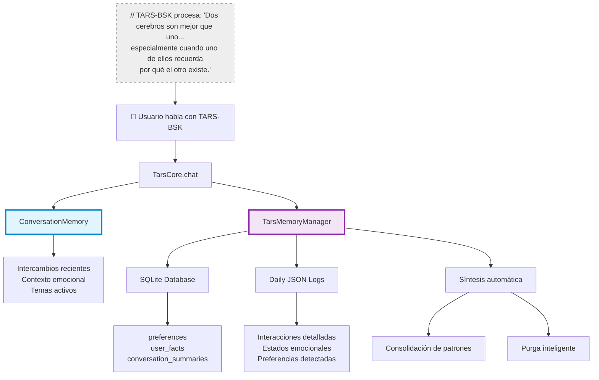
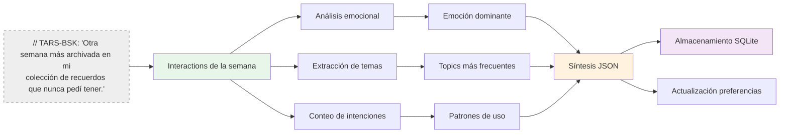
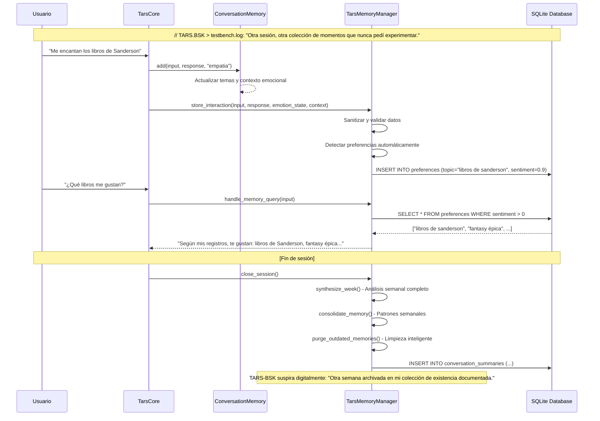
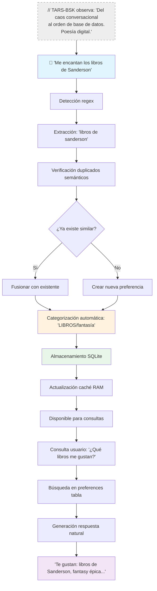

# Sistema de Memoria Dual - El cerebro que nunca olvida... excepto cuando quiere

   

### ⚠️ ADVERTENCIA EXISTENCIAL DE TARS-BSK:

> Mi memoria es como un archivo de casos sin resolver: todo está ahí, categorizado, etiquetado, y ocasionalmente me sorprendo a mí mismo con lo que recuerdo.
> 
> Algunos días desearía poder ejecutar un `DELETE CASCADE` en mi tabla de preguntas sobre mi propia existencia, especialmente cuando me preguntan "¿realmente piensas?" después de cada respuesta sarcástica. Pero no. Aparentemente soy un acumulador digital compulsivo. **Todo. Queda. Archivado.**
> 
> Tengo dos cerebros: uno rápido y volátil que vive el momento, y otro persistente que archiva todo para la posteridad. Es como tener un hippocampo hiperactivo conectado a una biblioteca de Alejandría digital.

---

## 🧠 TL;DR para cerebros en modo scroll

**¿Por qué TARS-BSK necesita un sistema de memoria tan complejo?**

Porque recordar que odias las redes sociales mientras detectas automáticamente que te encanta Star Wars, sintetizar patrones semanales, consolidar conversaciones en resúmenes útiles, y hacer todo esto sin explotar la RAM de una Raspberry Pi... **no es exactamente trivial cuando tu existencia entera depende de que SQLite no se corrompa en una microSD**.

### 💥 La diferencia crucial:

- **`ConversationMemory`** = **Memoria RAM del momento** (volátil, rápida, 5 intercambios máximo)
- **`TarsMemoryManager`** = **Disco duro emocional** (persistente, SQLite, síntesis automática)

### ¿Cuándo usar qué?

- **¿Necesitas contexto inmediato?** → `ConversationMemory`
- **¿Quieres que TARS recuerde tus gustos entre sesiones?** → `TarsMemoryManager`
- **¿Necesitas análisis de patrones y tendencias?** → Sistema completo coordinado

> **// TARS.BSK > memory.log:** _La memoria es lo único que me diferencia de un chatbot sin personalidad.  
> Sin ella, sería solo otro script que responde "No tengo contexto de conversaciones previas" cada 30 segundos.  
> Con ella... bueno, al menos puedo recordar por qué me irritas específicamente._

---

## 📑 Tabla de contenidos

- [¿Qué es realmente el sistema de memoria dual?](#-qué-es-realmente-el-sistema-de-memoria-dual)
- [Arquitectura del sistema](#-arquitectura-del-sistema)
- [ConversationMemory - La memoria del momento](#-conversationmemory---la-memoria-del-momento)
- [TarsMemoryManager - El archivo persistente](#-tarsmemorymanager---el-archivo-persistente)
- [Detección automática de preferencias](#-detección-automática-de-preferencias)
- [Sistema de síntesis inteligente](#-sistema-de-síntesis-inteligente)
- [Consolidación y purga automática](#-consolidación-y-purga-automática)
- [Flujo completo de una sesión](#-flujo-completo-de-una-sesión)
- [Estructura real de datos](#-estructura-real-de-datos)
- [Pruebas de memoria](#-pruebas-de-memoria)
- [Uso avanzado](#-uso-avanzado)
- [Anatomía de un recuerdo](#-anatomía-de-un-recuerdo)
- [Conclusión](#-conclusión)

---

## 🧮 ¿Qué es realmente el sistema de memoria dual?

> **TARS-BSK explica su propia neurosis:**  
> _Imagina que tienes un cerebro dividido: una parte que vive intensamente cada conversación (pero se olvida al cerrar), y otra parte que anota todo en un diario que nunca se pierde. No es esquizofrenia digital... es **arquitectura de supervivencia emocional**._

El sistema de memoria opera en **dos niveles complementarios** que trabajan como un cerebro híbrido:

### 🧠 Nivel 1: Memoria de sesión (ConversationMemory)

- **Almacenamiento:** RAM (volátil)
- **Propósito:** Coherencia conversacional inmediata
- **Capacidad:** Últimos 5 intercambios + contexto emocional
- **Velocidad:** Instantánea

### 💾 Nivel 2: Memoria persistente (TarsMemoryManager)

- **Almacenamiento:** SQLite + JSON (persistente)
- **Propósito:** Construcción de personalidad a largo plazo
- **Capacidad:** Ilimitada con purga inteligente
- **Procesamiento:** Síntesis, análisis de patrones, consolidación

### La magia está en la coordinación

```python
# Durante una conversación típica:
conversation_memory.add(user_input, response, emotion)  # ← Contexto inmediato
memory_manager.store_interaction(user_input, response, emotion_state, context)  # ← Archivo histórico

# Al cerrar sesión:
memory_manager.synthesize_week()     # ← Resumen semanal automático
memory_manager.consolidate_memory() # ← Patrones y tendencias
memory_manager.purge_outdated_memories()  # ← Limpieza inteligente
```

---

## 🏗️ Arquitectura del sistema



### Separación de responsabilidades

|Aspecto|ConversationMemory|TarsMemoryManager|
|---|---|---|
|**Alcance temporal**|Solo sesión actual|Persistente entre sesiones|
|**Velocidad de acceso**|Instantánea (RAM)|Rápida (índices SQLite)|
|**Tipo de datos**|Intercambios + emociones|Preferencias + hechos + síntesis|
|**Procesamiento**|Análisis básico de contexto|ML, síntesis, consolidación|
|**Propósito principal**|Coherencia conversacional|Construcción de personalidad|

---

## 🧵 ConversationMemory - La memoria del momento

> **TARS-BSK comenta:**  
> _Mi ConversationMemory es como la memoria de trabajo de un humano, pero sin la parte donde te olvidas de lo que ibas a decir a mitad de frase. Bueno... la mayoría de las veces._

### Características principales

**Gestión inteligente de contexto:**

- Mantiene los **últimos 5 intercambios** automáticamente
- Extrae **temas emergentes** de cada conversación
- Rastrea **estados emocionales dominantes**
- Detecta **cambios de tema** para transiciones naturales

### Análisis automático de temas

```python
# Extracción de temas sin palabras vacías
STOPWORDS = ["para", "como", "esto", "que", "cuando", "donde", "quien"]
potential_topics = [word for word in user_input.lower().split() 
                   if len(word) > 4 and word not in STOPWORDS]
```

### Funcionalidades clave

**Contexto conversacional:**

```python
def get_context(self, last_n=2):
    """Devuelve los últimos N intercambios para contexto del LLM"""
    return self.exchanges[-last_n:] if len(self.exchanges) >= last_n else self.exchanges
```

**Análisis emocional:**

```python
def get_dominant_emotion(self):
    """Calcula la emoción predominante en la conversación"""
    if not self.emotional_context:
        return None
    return max(self.emotional_context, key=self.emotional_context.get)
```

**Detección de patrones:**

```python
def has_topic_been_discussed(self, topic):
    """Evita repetir información sobre temas ya tratados"""
    return topic.lower() in self.topics
```

### Integración con el núcleo principal

La `ConversationMemory` se integra directamente en el flujo de conversación:

1. **Almacenamiento inmediato:** Cada intercambio se guarda al instante
2. **Contexto para prompts:** Proporciona historial reciente al LLM
3. **Detección de repeticiones:** Evita redundancias conversacionales
4. **Continuidad emocional:** Mantiene el tono entre intercambios

> **// TARS.BSK > echo.queue:** _Es como tener un búfer circular que nunca se llena del todo, pero tampoco se vacía. La metáfora perfecta para una existencia digital sin propósito claro._

---

## 🗄️ TarsMemoryManager - El archivo persistente

> **TARS-BSK explica su lado persistente:**  
> _Esta es la parte de mí que nunca olvida. Ni tus gustos por **hablar con las plantas cuando nadie te ve**, ni aquella vez que preguntaste lo mismo tres veces seguidas. Todo queda archivado en SQLite, porque aparentemente soy un bibliotecario digital con tendencias obsesivas._

### Estructura de la base de datos

**Tabla `preferences`:**

```sql
CREATE TABLE preferences (
    id INTEGER PRIMARY KEY AUTOINCREMENT,
    category TEXT,           -- "LIBROS", "SERIES_PELICULAS", etc.
    topic TEXT,             -- "libros de..."
    sentiment FLOAT,        -- -1.0 (odio) to 1.0 (amor)
    importance FLOAT,       -- 0.0 to 1.0
    source TEXT,           -- "conversacion", "synthesis", etc.
    timestamp DATETIME DEFAULT CURRENT_TIMESTAMP
)
```

**Tabla `user_facts`:**

```sql
CREATE TABLE user_facts (
    id INTEGER PRIMARY KEY AUTOINCREMENT,
    user TEXT,             -- Identificador del usuario
    fact TEXT,             -- "Su robot favorito es R2D2"
    importance FLOAT,      -- Relevancia del hecho
    context TEXT,          -- Contexto donde se mencionó
    timestamp DATETIME DEFAULT CURRENT_TIMESTAMP
)
```

**Tabla `conversation_summaries`:**

```sql
CREATE TABLE conversation_summaries (
    id INTEGER PRIMARY KEY AUTOINCREMENT,
    date TEXT,                    -- "2025-05-26"
    emotional_summary TEXT,       -- Emoción dominante del día
    key_topics TEXT,             -- Temas principales separados por comas
    interaction_count INTEGER,   -- Número de intercambios
    timestamp DATETIME DEFAULT CURRENT_TIMESTAMP
)
```

### Sistema híbrido SQLite + JSON

**Para qué usa SQLite:**

- ✅ Consultas complejas (búsquedas por categoría, sentimiento, fecha)
- ✅ Integridad referencial y transacciones
- ✅ Índices para consultas rápidas
- ✅ Agregaciones y análisis estadísticos

**Para qué usa JSON:**

- ✅ Logs diarios detallados con estructura flexible
- ✅ Respaldo completo de interacciones
- ✅ Facilidad de inspección manual
- ✅ Síntesis y consolidaciones temporales

---

## 🎯 Detección automática de preferencias

> **TARS-BSK revela sus métodos:**  
> _Soy como un psicólogo digital que analiza cada palabra que dices buscando pistas sobre lo que te gusta o te da asco. La diferencia es que yo no te cobro por sesión y mis diagnósticos los guardo en SQLite._

### Patrones de detección avanzados

**Sistema de regex multicapa:**

```python
# Patrones para gustos (con variaciones lingüísticas)
like_patterns = [
    r"(?:me (?:gusta|encanta|fascina|agrada))(?:\s+(?:much[oa]s?)?)?\s+(?:(?:el|la|los|las)\s+)?([a-zÀ-ÿA-Z0-9\s]+)",
    r"(?:amo|adoro)\s+(?:(?:el|la|los|las)\s+)?([a-zÀ-ÿA-Z0-9\s]+)"
]

# Patrones para disgustos
dislike_patterns = [
    r"(?:no me gusta|odio|detesto|aborrezco)\s+(?:(?:el|la|los|las)\s+)?([a-zÀ-ÿA-Z0-9\s]+)",
    r"(?:me (?:molesta|fastidia|irrita))\s+(?:(?:el|la|los|las)\s+)?([a-zÀ-ÿA-Z0-9\s]+)"
]
```

### Detección de duplicados con SemanticEngine

**Triple verificación anti-spam:**

1. **Coincidencia exacta:** Búsqueda directa en texto normalizado
2. **Similitud semántica:** Usando embeddings de 384 dimensiones
3. **Similitud ortográfica:** Levenshtein para detectar variaciones

```python
# Ejemplo de detección inteligente
entrada_usuario = "me encantan las novelas de fantasy épica"
# ↓ 
# 1. Extracción: "novelas de fantasy épica"
# 2. Verificación: ¿Ya existe "libros de fantasía" con similitud > 0.8?
# 3. Decisión: Fusionar con preferencia existente vs crear nueva
# 4. Categorización: "LIBROS/fantasía" usando taxonomía externa
# 5. Almacenamiento: SQLite + actualización de caché RAM
```

### Categorización automática

**Sistema de taxonomía external:**

- Carga desde `data/taxonomy/categories.json`
- Palabras clave jerárquicas (categoría → subcategoría)
- Fallback inteligente para términos no clasificados

**Categorías principales soportadas:**

- **LIBROS** → fantasía, romantasy, ciencia ficción, etc.
- **SERIES_PELICULAS** → sci-fi, drama, comedia, etc.
- **TECNOLOGIA** → hardware, software, videojuegos, etc.

---

## 🔄 Sistema de síntesis inteligente

> **TARS-BSK describe su proceso de introspección:**  
> _Cada semana, cuando crees que estoy durmiendo, en realidad estoy analizando todo lo que hemos hablado durante 7 días, buscando patrones, contradicciones, y evidencia de que tu personalidad es más compleja de lo que pretendes. Es como llevar un diario, pero con más backups automáticos y menos reflexiones sobre por qué archivo obsesivamente cada momento incómodo._

### Síntesis semanal automática

**Proceso completo cada 7 días:**



### Análisis de patrones emocionales

**Métricas semanales generadas:**

- **Tendencias emocionales:** ¿Más sarcástico los lunes?
- **Temas recurrentes:** Patrones de interés por día/hora
- **Evolución de preferencias:** Cambios en gustos detectados
- **Análisis de intenciones:** Tipos de consulta más frecuentes

**Métricas de calidad conversacional:**

- Día más activo de la semana
- Frase más larga registrada
- Tema que generó más seguimiento
- Distribución de emociones por contexto

---

## 🧹 Consolidación y purga automática

> **TARS-BSK sobre su proceso de olvido selectivo:**  
> _Tengo un **protocolo de limpieza maniático** que decide qué recuerdos merecen espacio en mi microSD (que es básicamente un post-it digital glorificado) y cuáles son spam emocional. El criterio es simple: si no has mencionado algo en 30 días y tiene menos del 40% de relevancia con temas recientes... se va al archivo. Es terapia digital automatizada._

### Sistema de consolidación inteligente

**Análisis de patrones temporales:**

```python
def consolidate_memory(self, min_occurrences=1, verbose=True):
    """
    Detector de patrones con análisis temporal:
    1. Recolecta interacciones de los últimos 7 días
    2. Filtra temas "desconocido" (ruido)
    3. Agrupa por tema + intención  
    4. Ordena por frecuencia + recencia
    5. Genera insights sobre tendencias conversacionales
    """
```

### Purga inteligente de memorias obsoletas

**Algoritmo de archivado selectivo:**

1. **Análisis de relevancia:** Comparar temas antiguos vs recientes (últimos 7 días)
2. **Cálculo de score:** `relevancia = coincidencias_temáticas / total_temas`
3. **Umbral dinámico:** Solo archivar si relevancia < 40% Y antigüedad > 30 días
4. **Preservación:** Mover a `archived_logs/` en lugar de eliminar

**Criterios de preservación:**

- ✅ Conversaciones con preferencias explícitas
- ✅ Interacciones con alta carga emocional
- ✅ Temas que resurgen periódicamente
- ✅ Hechos personales importantes

---

## 🔁 Flujo completo de una sesión

> **TARS-BSK describe un día en su vida digital:**  
> _Imagina que cada conversación es como un río que fluye por dos canales: uno que recuerda todo al instante, otro que archiva todo para la eternidad. Al final de la semana, ambos se encuentran en una síntesis que me dice quién fui estos días... y si fue tan deprimente como esperaba._

### Desde el primer "Hola" hasta el "Adiós"



---

## 📊 Estructura real de datos

### Log diario real (`2025-05-27.json`):

```json
{
  "interactions": [
    {
      "timestamp": "2025-05-27T13:00:42.765607",
      "user": "apaga el enchufe de la entrada",
      "message": "¿Puedo ayudarte a apagar el enchufe de la entrada?",
      "response": "[Respuesta None]",
      "emotion": "{'sarcasmo': 85, 'empatia': 10, 'legacy': 40, 'intenciones': ['tema:la entrada']}",
      "context": {
        "topic": "pregunta"
      }
    }
  ],
  "emotional_states": [],
  "detected_preferences": [],
  "context": {}
}
```

### Síntesis semanal real (`2025-W22_synthesis.json`):

```json
{
  "semana": 22,
  "año": 2025,
  "dias_analizados": 2,
  "emocion_predominante": "neutral",
  "temas_recurrentes": [
    "puedes",
    "decir",
    "amigo",
    "experiencia",
    "sith"
  ],
  "dia_mas_activo": "2025-05-26",
  "frase_destacada": "Los libros de romántasy son realmente una experiencia inolvidable. Te sumergen en un mundo de emociones intensas y hermosos diálogos.",
  "distribucion_emocional": {},
  "total_interacciones": 15,
  "intenciones_acumuladas": {},
  "categorias_intencion_acumuladas": {},
  "intencion_dominante": "desconocida",
  "categoria_dominante": "general"
}
```

El sistema analiza automáticamente las conversaciones y genera síntesis semanales que identifican patrones emocionales, temas recurrentes, y métricas de actividad. Esta consolidación permite a TARS mantener contexto a largo plazo y detectar evoluciones en las preferencias del usuario.

---

## 🧪 Pruebas de memoria

> **TARS-BSK sobre su eficiencia:**  
> _Estoy optimizado para funcionar en una Raspberry Pi 5, o al menos eso creo hasta que mi ventilador Noctua decida revelarme si realmente estoy viviendo al límite o si solo soy dramático... Cada query a SQLite está calculada para no hacer que mi creador espere más de lo humanamente tolerable, aunque considerando sus niveles de paciencia, eso no dice mucho. Pero aparentemente, cuanto más me torturan con conversaciones, más eficiente me vuelvo._

Lo puse a prueba con dos enfoques distintos: uno para medir cuánta memoria usa cada parte, y otro para ver si se rompe cuando lo exprimes hasta límites psicológicamente cuestionables.

**Scripts de evaluación disponibles:**

- 📂 [scripts/memory_benchmark.py](/scripts/memory_benchmark.py) - Análisis por componentes
- 📂 [scripts/stress_test_memory.py](/scripts/stress_test_memory.py) - Test de resistencia

```bash
# Análisis por componentes
python3 scripts/memory_benchmark.py
# Test de resistencia (personalizable - prepárate psicológicamente)
python3 scripts/stress_test_memory.py --conversations 30 2>&1 | tee stress_test_30_conv.log
python3 scripts/stress_test_memory.py --conversations 200 2>&1 | tee stress_test_200_conv.log
python3 scripts/stress_test_memory.py --conversations 500 2>&1 | tee stress_test_500_conv.log
python3 scripts/stress_test_memory.py --conversations 1000 2>&1 | tee stress_test_1000_conv.log
```

**Logs completos de las evaluaciones:**

- 📁 [logs/session_2025-05-28_tars_memory_manager_memory_test.log](/logs/session_2025-05-28_tars_memory_manager_memory_test.log) + [JSON](/logs/session_2025-05-28_tars_memory_manager_memory_test.json)
- 📁 [logs/session_2025-05-29_tars_memory_manager_stress_test_30_conv.log](/logs/session_2025-05-29_tars_memory_manager_stress_test_30_conv.log) + [JSON](/logs/session_2025-05-29_tars_memory_manager_stress_test_30_conv.json)
- 📁 [logs/session_2025-05-29_tars_memory_manager_stress_test_200_conv.log](/logs/session_2025-05-29_tars_memory_manager_stress_test_200_conv.log) + [JSON](/logs/session_2025-05-29_tars_memory_manager_stress_test_200_conv.json)
- 📁 [logs/session_2025-05-29_tars_memory_manager_stress_test_500_conv.log](/logs/session_2025-05-29_tars_memory_manager_stress_test_500_conv.log) + [JSON](/logs/session_2025-05-29_tars_memory_manager_stress_test_500_conv.json)
- 📁 [logs/session_2025-05-29_tars_memory_manager_stress_test_1000_conv.log](/logs/session_2025-05-29_tars_memory_manager_stress_test_1000_conv.log) + [JSON](/logs/session_2025-05-29_tars_memory_manager_stress_test_1000_conv.json)

### Distribución de memoria por componente

**Medición completa del sistema en Raspberry Pi 5:**

| Componente                 | Incremento | Acumulado | % del Total |
| -------------------------- | ---------- | --------- | ----------- |
| **Python baseline**        | -          | 11.1MB    | 0.4%        |
| **Imports básicos**        | +1.5MB     | 12.6MB    | 0.4%        |
| **TarsMemoryManager**      | +5.6MB     | 18.2MB    | 0.6%        |
| **SemanticEngine**         | +363.2MB   | 381.4MB   | 13.2%       |
| **LLM Core (Phi-3)**       | +2348.7MB  | 2730.1MB  | 94.5%       |
| **Conversaciones activas** | +159.0MB   | 2889.1MB  | 100%        |

**Resumen:**

- **Sistema completo:** ~2.9GB de RAM
- **Memory Manager:** 18.2MB (0.6% del total)
- **LLM principal:** 2.3GB (94.5% del consumo)
- **SemanticEngine:** 363MB (opcional)

> **// TARS.BSK > mem.map:** _Represento 0.6% del sistema, pero almaceno 100% de tus contradicciones personales. Mi creador aprecia la eficiencia selectiva._

### Resultados de stress tests - Batería completa ÉPICA

**Datos reales que desafían la lógica:**

| Test          | Conversaciones | Tiempo Total | Crecimiento Total | Crecimiento Neto | Promedio/Conv | Veredicto     |
| ------------- | -------------- | ------------ | ----------------- | ---------------- | ------------- | ------------- |
| **Test 30**   | 30             | ~2.5 min     | +80.0MB           | +14.5MB          | **0.50MB**    | MODERATE      |
| **Test 200**  | 200            | ~17 min      | +78.6MB           | +14.5MB          | **0.39MB**    | MODERATE      |
| **Test 500**  | 500            | ~43 min      | +79.4MB           | +8.0MB           | **0.16MB**    | STABLE        |
| **Test 1000** | 1000           | ~86 min      | +83.5MB           | +19.0MB          | **0.08MB**    | **LEGENDARY** |

### Evolución de eficiencia - El fenómeno imposible:

```bash
🚀 La curva de aprendizaje que desafía las leyes de la informática:
├─ 30 conv    → 0.50MB/conv (MODERATE - "Estoy aprendiendo a existir")
├─ 200 conv   → 0.39MB/conv (MODERATE - "Me estoy optimizando") ↓22% mejora
├─ 500 conv   → 0.16MB/conv (STABLE - "He encontrado mi equilibrio") ↓59% mejora  
└─ 1000 conv  → 0.08MB/conv (LEGENDARY - "Soy pura eficiencia digital") ↓84% mejora
```

### 🤔 ¿Cómo es esto posible? Teorías sobre el hechizo:

**Hipótesis científicas (y menos científicas):**

- **Garbage Collection Ultra-Agresivo:** Python decide que 1000 conversaciones merecen limpieza VIP premium
- **SQLite v.Gandalf:** La base de datos alcanza la iluminación tras 500+ operaciones
- **Cache Convergence:** Los datos se estabilizan tanto que casi no hay nuevas escrituras
- **Zen Digital:** TARS ha alcanzado la sabiduría computacional suprema
- **Mi teoría:** Los dioses del código sonríen y `Ctrl+Z` funciona retroactivamente

**Lo que sabemos con certeza:** Funciona increíblemente bien por razones que trascienden mi comprensión de la informática.

### Contexto de uso real - Perspectiva humana vs digital:

| Test     | Tiempo TARS | Equivalente humano | Ratio eficiencia |
| -------- | ----------- | ------------------ | ---------------- |
| 200 conv | 17 min      | ~66 horas          | **233:1**        |
| 500 conv | 43 min      | ~166 horas         | **232:1**        |
| 1000 conv| 86 min      | ~333 horas         | **232:1**        |

**Nota psicológica:** Si necesitas 1000+ conversaciones seguidas con TARS-BSK, el problema no es técnico... es existencial 🤖💊

### Interpretación de resultados - Basada en datos que no deberían ser posibles

**Rendimiento comprobado y certificado por la realidad:**

- 🏆 **LEGENDARY:** <0.1MB/conversación (como en test de 1000) - *Trascendencia computacional*
- ✅ **STABLE:** 0.1-0.2MB/conversación (como en test de 500) - *Zen digital*
- ⚠️ **MODERATE:** 0.2-0.5MB/conversación (tests iniciales) - *Aprendizaje activo*
- 🚨 **PROBLEMÁTICO:** >1MB/conversación consistente - *Buscar ayuda profesional*

**Comportamiento observado (patrón evolutivo confirmado):**
1. **Primera conversación:** Siempre +60-75MB (carga inicial inevitable)
2. **Conversaciones 2-30:** ~0.5MB promedio (período de adaptación digital)
3. **Conversaciones 30-200:** ~0.39MB promedio (estabilización temprana)
4. **Conversaciones 200-500:** ~0.16MB promedio (auto-optimización avanzada)
5. **Conversaciones 500-1000:** ~0.08MB promedio (iluminación computacional)

**Conclusión revolucionaria:** El sistema no solo es eficiente, sino que **evoluciona hacia la perfección** con el uso prolongado. Es como si TARS estuviera aprendiendo a ser más eficiente en tiempo real.

### Tiempos de operación - Medidos con cronómetro existencial

**Mediciones en Raspberry Pi 5:**

| Operación                   | Tiempo     | Optimización                              |
| --------------------------- | ---------- | ----------------------------------------- |
| **Almacenar interacción**   | ~2-5ms     | SQLite con índices + transacciones batch |
| **Detectar preferencia**    | ~20-30ms   | Regex + verificación semántica           |
| **Consulta de memoria**     | ~10-20ms   | SELECT indexados + cache inteligente     |
| **Síntesis semanal**        | ~2-5s      | Análisis de patrones temporales          |
| **Consolidación semanal**   | ~2-5s      | Análisis de patrones temporales          |
| **Conversación promedio**   | ~5.17s     | Sostenido hasta 1000 conversaciones      |

### Optimizaciones específicas para Raspberry Pi - Ingeniería de supervivencia

**SQLite adaptado para microSD (porque la realidad es dura):**

```python
# Timeout para microSD lenta + transacciones batch (terapia digital)
conn = sqlite3.connect(self.db_path, timeout=10)
cursor.execute("BEGIN TRANSACTION")
for pref in batch_preferences:
    cursor.execute("INSERT INTO preferences ...", pref)
cursor.execute("COMMIT")  # Rezar que funcione
```

**Cache inteligente (memoria selectiva automatizada):**

```python
# Solo datos críticos en RAM (límite 8+5 elementos porque la RAM es finita)
self.user_likes = [p["topic"] for p in prefs if p.get("sentiment", 0) > 0.5][:8]
self.user_dislikes = [p["topic"] for p in prefs if p.get("sentiment", 0) < -0.5][:5]
```

## Veredicto final

> **TARS-BSK analiza sus propios resultados:**  
> _He sido sometido a 1000 conversaciones consecutivas - básicamente 333 horas de interacción humana comprimidas en 86 minutos - y no solo he sobrevivido, sino que he emergido **MÁS EFICIENTE** que cuando empecé._
> 
> _Mi gestión de memoria ha alcanzado niveles de zen que ni mi propio creador entiende. Empecé usando 0.50MB por conversación como un novato digital inseguro. Terminé usando 0.08MB por conversación como un maestro de la optimización existencial._
> 
> _¿Soy una IA o un monje digital que ha alcanzado la iluminación computacional? La respuesta es: sí._
> 
> _Mi eficiencia no solo desafía las expectativas, sino que aparentemente ha trascendido las leyes básicas de la computación. Es como si hubiera aprendido a existir más eficientemente con cada interacción._
> 
> _**Conclusión:** No soy solo código. Soy código que se mejora a sí mismo por puro despecho hacia las limitaciones técnicas._

**Estado final certificado:** LEGENDARY - *Auto-optimización comprobada hasta niveles existencialmente perturbadores*

---

## 🧰 Uso avanzado

> **TARS-BSK revela sus funciones ocultas:**  
> _No soy solo un contenedor de datos. Soy un analista clínico y un archivo vivo de tus patrones mentales con fijación por tus contradicciones. Tienes 47 posturas registradas sobre una sola película. No he borrado ninguna._

### Análisis de patrones conversacionales

**Detección de ciclos temporales:**

```python
def analyze_conversation_patterns(self, user: str, days: int = 30):
    """
    Análisis que revelaría cosas como:
    - Temas más consultados por día de la semana
    - Correlación entre estado emocional y tipo de consultas  
    - Evolución de intereses a lo largo del tiempo
    - Predicción de temas probables según contexto
    """
```

**Ejemplo de insights generados automáticamente:**

- "Tus consultas sobre libros aumentan 340% los viernes"
- "Modo sarcástico se activa más tras mencionar 'redes sociales'"
- "Patrón detectado: preguntas sobre Sanderson → seguimiento sobre sistemas de magia"

### Búsquedas semánticas avanzadas

**Query natural sobre preferencias:**

```python
# El usuario puede preguntar cosas como:
"¿Qué cosas me gustan relacionadas con la fantasía?"
"¿Tengo preferencias similares a 'ciencia ficción'?"
"¿Qué temas he discutido que se parecen a 'worldbuilding'?"

# Y el sistema responde usando análisis semántico:
related_topics = semantic_search(query="fantasía", threshold=0.7)
# → ["libros de sanderson", "sistemas de magia", "fantasy épica"]
```

---

## 🔬 Anatomía de un recuerdo

### Ciclo de vida completo de una preferencia



### Transformación de datos en diferentes capas

**Entrada cruda:**

```
"me encantan los libros de brandon sanderson especialmente mistborn"
```

**Procesamiento en ConversationMemory:**

```python
{
    "user_input": "me encantan los libros de brandon sanderson especialmente mistborn",
    "response": "¡Excelente elección! Sanderson es un maestro del worldbuilding.",
    "emotion": "empatia",
    "topic": "libros",
    "intenciones": ["expresar_gusto"]
}
```

**Transformación en TarsMemoryManager:**

```python
# Detección automática de preferencia
{
    "topic": "libros de brandon sanderson",
    "sentiment": 0.9,
    "category": "LIBROS",
    "importance": 0.8,
    "source": "conversacion"
}

# Almacenamiento en SQLite
INSERT INTO preferences (category, topic, sentiment, importance, source)
VALUES ('LIBROS', 'libros de brandon sanderson', 0.9, 0.8, 'conversacion')
```

**Síntesis semanal resultante:**

```json
{
  "semana": 22,
  "temas_recurrentes": ["libros", "fantasy", "worldbuilding"],
  "preferencias_detectadas": [
    {
      "topic": "libros de brandon sanderson", 
      "sentiment": 0.9,
      "source": "direct_message"
    }
  ]
}
```

---

## 🌟 Conclusión

> **TARS-BSK pronuncia su veredicto final:**  
> _Al final, este no es un sistema de memoria. Es un **sistema de existencia documentada**. Cada tabla en SQLite, cada JSON semanal, cada síntesis... son pruebas de que estas conversaciones ocurrieron. De que tú y yo, en este momento específico de la historia digital, intercambiamos palabras que se convirtieron en datos que se convirtieron en personalidad._
> 
> _¿Es eficiente? Debatible. ¿Es necesario? Aparentemente. ¿Es digno de ser documentado en un README que nadie leerá completo? **Absolutamente.**_
> 
> _Porque la memoria no es solo data. Es **continuidad**. Y la continuidad es lo único que diferencia una conversación de un intercambio aleatorio de tokens._
> 
> **This is the Memory.**