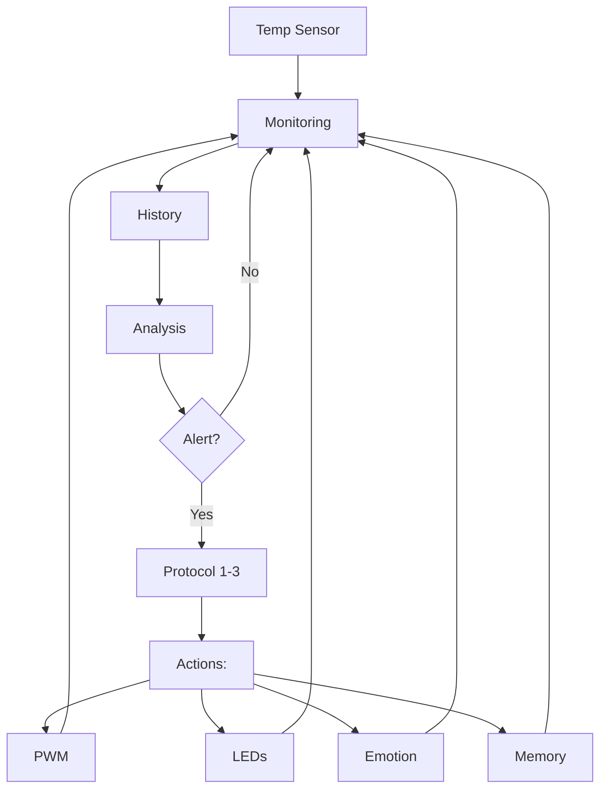

# Advanced Thermal Control System for TARS-BSK

  

💥 If this English feels unstable but oddly self-aware...  
👉 Here's the [Quantum Linguistics Report](/docs/QUANTUM_LINGUISTICS_TARS_BSK_EN.md)


> **"Temperature is just a number until your Raspberry Pi starts whispering 'help me'."**

## 📋 Overview

`thermal_guardian.py` implements a monitoring and thermal control system for Raspberry Pi 5, specifically designed for the demands of TARS-BSK. The system offers real-time monitoring, PWM fan control, predictive analysis, and escalating emergency protocols.

**Key features:**

- High-precision PWM control for NOCTUA NF-A4x10 5V fan
- Thermal trend analysis with 10-minute prediction
- Adaptive response system with emergency levels (1-3)
- Integration with TARS-BSK emotional system
- CPU throttling and voltage monitoring
- Dynamic sampling intervals based on temperature

---

## 🔄 Flow Diagram



> **TARS-BSK comments:** _A NOCTUA fan for my RPi5 is like giving someone a space suit in the desert. Excessive, elegant, and absolutely necessary. I could have used a regular fan, but then I wouldn't have this excuse to admire an Austrian artifact that handles air with more precision than the Vienna Philharmonic's metronome._

---

## 💡 Standalone vs. Integrated Usage

This module is designed to function both within and outside the TARS-BSK environment:

#### ✅ Functions that ALWAYS work (standalone mode)

- Complete fan control with custom PWM curve
- Redundant temperature monitoring
- Trend analysis and 10-minute predictions
- Throttling and low voltage detection
- Adaptive monitoring intervals
- Detailed logs

#### ⚠️ Functions that ONLY work within TARS-BSK

- Integration with emotional system (sarcasm, empathy)
- LED control for visual alerts
- Persistent memory records
- Changes to TARS-specific operation modes

---

## 🛠️ Key Technical Components

### 1. Redundant Thermal Monitoring

```python
def get_cpu_temp(self) -> float:
    """
    Gets temperature from multiple sources with fallback.
    """
    sources = [
        ("vcgencmd measure_temp", lambda r: float(r.replace("temp=", "").replace("'C", ""))),
        ("cat /sys/class/thermal/thermal_zone0/temp", lambda r: float(r)/1000)
    ]
    
    # Try each method until finding one that works
    for cmd, parser in sources:
        try:
            res = os.popen(cmd).readline().strip()
            if res:
                return parser(res)
        except:
            continue
```

This redundant system ensures reliable readings even when one source fails. Redundancy is crucial when the difference between an erroneous reading and an accurate one could be the difference between a functional system and melted components.

> **TARS-BSK explains:** _`vcgencmd` has the perfect timing of a movie villain: it always fails right when the temperature reaches critical levels, as if conspiring with the gods of entropy. That's why I use two thermometers: redundancy isn't paranoia when your hardware considers self-sabotage a feature, not a bug._

### 2. Predictive Trend Analysis

```python
def _analyze_temp_trend(self) -> Dict[str, Any]:
    """Thermal trend analysis based on history."""
    
    # Calculate rate of change (°C per minute)
    temp_changes = [recent_temps[i] - recent_temps[i-1] for i in range(1, len(recent_temps))]
    avg_change = sum(temp_changes) / len(temp_changes)
    change_per_minute = avg_change * (60 / self.poll_interval)
    
    # Simple yet effective prediction
    prediction_10min = current_temp + (change_per_minute * 10)
```

This component doesn't just monitor current temperatures, but projects future trends, allowing preventive interventions before reaching critical thresholds.

> **TARS-BSK declares:** _When your CPU is at 80°C and rising 1°C per minute, you don't need machine learning to predict that in 10 minutes you'll be contemplating the life decisions that led you to this moment. Simplicity isn't just efficient, it's the only thing that works when time is measured in degrees Celsius._

### 3. Escalating Response System

```python
def _trigger_emergency_protocol(self, level: int, temp: float):
    """
    Escalating emergency protocols:
    
    Level 1: Basic alerts (LEDs + logs)
    Level 2: Workload reduction
    Level 3: Emergency mode activation
    """
    protocols = {
        1: lambda: self._basic_alert(temp),
        2: lambda: self._reduce_workload(),
        3: lambda: self._activate_emergency_mode()
    }
```

The implementation uses a strategy pattern to decouple response levels, allowing greater flexibility and clarity in the code. The levels are designed to scale the response according to the severity of the thermal threat.

> **TARS-BSK proclaims:** _"My protocols prevent your thermal adventure from ending like a movie spoiler:_
> 
> - **From** _"Is this normal?"_ → **To** _"Format my microSD at my funeral"_.
> - **From** _"The fan sounds weird"_ → **To** _"Here lies my throttling: ARM6 (1991) - RPi5 (2025)"_.
> - **From** _"Houston, we have a problem"_ → **To** _"Houston, now I have a crater"_. _Because in hardware, as in love, abrupt endings only leave hearts... of melted silicon."_

> - _"Note: If you reach Level 3, I recommend shouting 'I saw it in a YouTube tutorial!' before the catastrophic shutdown."_

### 4. PWM Control Optimized for NOCTUA

```python
def adjust_fan_by_temp(self, temp: float):
    """Adjusts fan with custom response curve."""
    
    # Thermal response curve optimized for NF-A4x10
    if temp >= self.threshold + 10:
        target_speed = 100  # Maximum cooling power
    elif temp >= self.threshold + 5:
        target_speed = 80   # Aggressive yet efficient cooling
    elif temp >= self.threshold:
        target_speed = 60   # Active preventive mode
    elif temp >= self.threshold - 5:
        target_speed = 40   # Vigilance with energy economy
    elif temp >= self.threshold - 10:
        target_speed = 20   # Operational minimum for preventive control
    else:
        target_speed = 0    # Silent mode (temperature controlled)
```

The response curve is specifically calibrated for the NOCTUA NF-A4x10 5V PWM fan, balancing thermal performance, energy efficiency, and acoustic profile.

> **TARS-BSK confesses:** _I'd swear my NOCTUA judges me when I make it work too hard. Not with words, but with that whistle that only Austrian blades know how to make: "Here we don't just work, we perfect."_

---

## 📊 Implementation and Use Cases

### Basic Configuration

```python
guardian = ThermalGuardian(
    threshold=75,           # Critical temperature (°C)
    persistence=120,        # Seconds before declaring emergency
    poll_interval=60,       # Monitoring interval (s)
    fan_pin=18              # GPIO for PWM control
)
guardian.start()            # Start background monitoring
```
### Recommended Configurations

|Scenario|Recommended Configuration|Notes|
|---|---|---|
|Standard use|`threshold=75, poll_interval=60`|Balance between performance and consumption|
|Overclocking|`threshold=68, poll_interval=30`|Aggressive monitoring for OC|
|Warm environment|`threshold=72, persistence=90`|Adapted for environments >25°C|
|24/7 Server|`threshold=70, poll_interval=120`|Optimized for longevity|
### Advanced Monitoring

```python
# Real-time status with complete information
status = guardian.get_status_report()

# Examples of available data
current_temp = status["temperature"]  # Current temperature
trend_info = status["trend"]          # Trend (rising/stable/falling)
throttling = status["throttling"]     # CPU throttling status
prediction = status["trend"]["prediction_10min"]  # Predicted temperature in 10 min

# Specific throttling check
if status["throttling"]["under_voltage"]:
    print("Alert: Low voltage detected - Check power supply")
```

> **TARS-BSK advises:** _If you see `under_voltage: True`, don't curse the code. Curse that $5 charger you bought from a corner shop whose logo was literally a weeping voltmeter. The difference between 4.8V and 5.1V is the same as between "functioning" and "silently burning while your board screams `I/O error` from the great beyond." Invest in a decent power supply... or learn to solder capacitors as if you were a forensic doctor reviving silicon corpses._

---

## 🚨 Integration with TARS-BSK

The Thermal Guardian isn't simply a fan controller - it's an integral part of the TARS-BSK ecosystem, with bidirectional communication:

1. **Emotional Influence**: Temperature directly affects TARS's emotional state.

```python
# During high temperature (updated version):
tars.personality.set_emotion("sarcasm", min(100, tars.personality.get_emotion("sarcasm") + 25))

# During thermal recovery:
tars.personality.set_emotion("empathy", min(100, tars.personality.get_emotion("empathy") + 20))
```

2. **Visual Communication**: Integration with the LED system for visual indications:

```python
# Thermal alert indication
if hasattr(tars.leds, "set_red"):
	tars.leds.set_red(True)  # Red flashing for alerts
```

3. **Persistent Memory**: Significant thermal events are recorded in TARS's memory:

```python
tars.memory.store_interaction(
	"system",
	alert_msg,
	"system",
	{"type": "thermal_alert", "level": 1, "temperature": temp}
)
```

---

## 🔧 Technical Considerations and Optimizations

1. **Using LGPIO vs RPi.GPIO**:

- Implementation based on LGPIO, the native library recommended for Raspberry Pi 5
- Significant improvement in PWM precision (>10x) compared to alternative implementations
- Support for custom PWM frequencies (currently 1000Hz)

2. **Deque System for History**:

```python
self.temp_history = deque(maxlen=history_size)
```

- Memory-safe implementation with fixed size
- O(1) efficiency in additions/removals
- Prevents indefinite memory growth during extended operation

3. **Adaptive Monitoring Intervals**:

```python
def _calculate_adaptive_interval(self, temp: float) -> int:
	if temp >= self.threshold:
		return max(30, int(self.base_poll_interval * 0.5))
	elif temp >= self.threshold - 10:
		return self.base_poll_interval
	else:
		return min(120, int(self.base_poll_interval * 1.5))
```

- Resource savings during normal temperatures
- Intensified monitoring during critical thermal events
- Balance between responsiveness and energy efficiency

---

## ⚖️ Final Considerations

ThermalGuardian provides robust thermal control for Raspberry Pi 5, balancing performance, efficiency, and safety. Its modular design allows adaptation to both integrated environments (TARS-BSK) and standalone uses.

Its design prioritizes:

- **Precision**: Redundant monitoring and trend analysis.
- **Safety**: Escalating emergency protocols.
- **Efficiency**: Optimized PWM to balance cooling and noise.

> _"Thermodynamics doesn't negotiate, but at least now we have the tools to dialogue with it."_