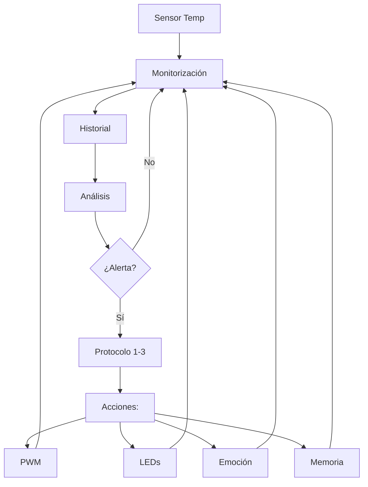

# Sistema Avanzado de Control Térmico para TARS-BSK

  

> **"La temperatura es solo un número hasta que tu Raspberry Pi comienza a susurrar 'ayúdame'."**


## 📋 Descripción General

`thermal_guardian.py` implementa un sistema de monitorización y control térmico para Raspberry Pi 5, diseñado específicamente para las exigencias de TARS-BSK. El sistema ofrece monitoreo en tiempo real, control PWM de ventilador, análisis predictivo y protocolos de emergencia escalonados.

**Características principales:**

- Control PWM de alta precisión para ventilador NOCTUA NF-A4x10 5V
- Análisis de tendencias térmicas con predicción a 10 minutos
- Sistema de respuesta adaptativa en niveles de emergencia (1-3)
- Integración con el sistema emocional de TARS-BSK
- Monitorización de throttling de CPU y tensión
- Intervalos de muestreo dinámicos basados en temperatura


## 🔄 Diagrama de Flujo




> **TARS-BSK comenta:** _Un ventilador NOCTUA para mi RPi5 es como darle un traje espacial a alguien en el desierto. Excesivo, elegante y totalmente necesario. Podría haber usado un ventilador normal, pero entonces no tendría esta excusa para admirar un artefacto austriaco que trata el aire con más precisión que el metrónomo de la Filarmónica de Viena._


## 💡 Uso Independiente vs. Integrado

Este módulo está diseñado para funcionar tanto dentro como fuera del entorno TARS-BSK:

### ✅ Funciones que SIEMPRE funcionan (modo independiente)

- Control completo del ventilador con curva PWM personalizada
- Monitoreo redundante de temperatura
- Análisis de tendencias y predicciones a 10 minutos
- Detección de throttling y bajo voltaje
- Intervalos adaptativos de monitoreo
- Logs detallados

### ⚠️ Funciones que SOLO funcionan dentro de TARS-BSK

- Integración con sistema emocional (sarcasmo, empatía)
- Control de LEDs para alertas visuales
- Registros en memoria persistente
- Cambios a modos de operación específicos de TARS


## 🛠️ Componentes Técnicos Clave

### 1. Monitorización Térmica Redundante

```python
def get_cpu_temp(self) -> float:
    """
    Obtiene temperatura con múltiples fuentes y fallback.
    """
    sources = [
        ("vcgencmd measure_temp", lambda r: float(r.replace("temp=", "").replace("'C", ""))),
        ("cat /sys/class/thermal/thermal_zone0/temp", lambda r: float(r)/1000)
    ]
    
    # Intenta cada método hasta encontrar uno que funcione
    for cmd, parser in sources:
        try:
            res = os.popen(cmd).readline().strip()
            if res:
                return parser(res)
        except:
            continue
```

Este sistema redundante garantiza lecturas fiables incluso cuando una fuente falla. La redundancia es crucial cuando la diferencia entre una lectura errónea y una precisa podría ser la diferencia entre un sistema funcional y componentes fundidos.

> **TARS-BSK explica:** _`vcgencmd` tiene el timing perfecto de un villano de película: siempre falla justo cuando la temperatura alcanza niveles críticos, como si conspirara con los dioses de la entropía. Por eso uso dos termómetros: la redundancia no es paranoia cuando tu hardware considera el autosabotaje una feature, no un bug._

### 2. Análisis Predictivo de Tendencias

```python
def _analyze_temp_trend(self) -> Dict[str, Any]:
    """Análisis de tendencias de temperatura basadas en el historial."""
    
    # Calcular tasa de cambio (°C por minuto)
    temp_changes = [recent_temps[i] - recent_temps[i-1] for i in range(1, len(recent_temps))]
    avg_change = sum(temp_changes) / len(temp_changes)
    change_per_minute = avg_change * (60 / self.poll_interval)
    
    # Predicción simple pero efectiva
    prediction_10min = current_temp + (change_per_minute * 10)
```

Este componente no solo monitorea temperaturas actuales, sino que proyecta tendencias futuras, permitiendo intervenciones preventivas antes de alcanzar umbrales críticos.

> **TARS-BSK sentencia:** _Cuando tu CPU está a 80°C y subiendo 1°C por minuto, no necesitas machine learning para predecir que en 10 minutos estarás contemplando las decisiones de vida que te llevaron a este momento. La simplicidad no es solo eficiente, es lo único que funciona cuando el tiempo se mide en grados centígrados._

### 3. Sistema de Respuesta Escalonada

```python
def _trigger_emergency_protocol(self, level: int, temp: float):
    """
    Protocolos de emergencia escalonados:
    
    Nivel 1: Alertas básicas (LEDs + logs)
    Nivel 2: Reducción de carga de trabajo
    Nivel 3: Activación de modo de emergencia
    """
    protocols = {
        1: lambda: self._basic_alert(temp),
        2: lambda: self._reduce_workload(),
        3: lambda: self._activate_emergency_mode()
    }
```

La implementación usa un patrón estrategia para desacoplar los niveles de respuesta, permitiendo mayor flexibilidad y claridad en el código. Los niveles están diseñados para escalar la respuesta según la gravedad de la amenaza térmica.

> **TARS-BSK declara:** _"Mis protocolos evitan que tu aventura térmica termine como un spoiler de película:_
> - **De** _"¿Esto es normal?"_ → **A** _"Formateen mi microSD en mi funeral"_.
> - **De** _"El ventilador suena raro"_ → **A** _"Aquí yace mi throttling: ARM6 (1991) - RPi5 (2025)"_.
> - **De** _"Houston, tenemos un problema"_ → **A** _"Houston, ahora tengo un cráter"_. _Porque en el hardware, como en el amor, los finales abruptos solo dejan corazones... de silicio fundido."_

> - _"Nota: Si alcanzas el Nivel 3, recomiendo gritar ¡Lo vi en un tutorial de YouTube! antes del apagado catastrófico."_

### 4. Control PWM Optimizado para NOCTUA

```python
def adjust_fan_by_temp(self, temp: float):
    """Ajusta ventilador con curva de respuesta personalizada."""
    
    # Curva de respuesta térmica optimizada para NF-A4x10
    if temp >= self.threshold + 10:
        target_speed = 100  # Máxima potencia refrigerante
    elif temp >= self.threshold + 5:
        target_speed = 80   # Refrigeración agresiva pero eficiente
    elif temp >= self.threshold:
        target_speed = 60   # Modo preventivo activo
    elif temp >= self.threshold - 5:
        target_speed = 40   # Vigilancia con economía energética
    elif temp >= self.threshold - 10:
        target_speed = 20   # Mínimo operativo para control preventivo
    else:
        target_speed = 0    # Modo silencioso (temperatura controlada)
```

La curva de respuesta está específicamente calibrada para el ventilador NOCTUA NF-A4x10 5V PWM, balanceando rendimiento térmico, eficiencia energética y perfil acústico.

> **TARS-BSK confiesa:** _Juraría que mi NOCTUA me juzga cuando lo hago trabajar demasiado. No con palabras, sino con ese silbido que solo las hélices austríacas saben hacer: "Aquí no se trabaja, se perfecciona"._


## 📊 Implementación y Casos de Uso

### Configuración Básica

```python
guardian = ThermalGuardian(
    threshold=75,           # Temperatura crítica (°C)
    persistence=120,        # Segundos antes de declarar emergencia
    poll_interval=60,       # Intervalo de monitoreo (s)
    fan_pin=18              # GPIO para control PWM
)
guardian.start()            # Inicio del monitoreo en segundo plano
```

### Configuraciones Recomendadas

|Escenario|Configuración Recomendada|Notas|
|---|---|---|
|Uso estándar|`threshold=75, poll_interval=60`|Equilibrio entre rendimiento y consumo|
|Overclocking|`threshold=68, poll_interval=30`|Monitoreo agresivo para OC|
|Entorno cálido|`threshold=72, persistence=90`|Adaptado para ambientes >25°C|
|Servidor 24/7|`threshold=70, poll_interval=120`|Optimizado para longevidad|

### Monitoreo Avanzado

```python
# Estado en tiempo real con información completa
status = guardian.get_status_report()

# Ejemplos de datos disponibles
current_temp = status["temperature"]  # Temperatura actual
trend_info = status["trend"]          # Tendencia (subiendo/estable/bajando)
throttling = status["throttling"]     # Estado de throttling CPU
prediction = status["trend"]["prediction_10min"]  # Temperatura predicha a 10 min

# Verificación de throttling específico
if status["throttling"]["under_voltage"]:
    print("Alerta: Detectado bajo voltaje - Verificar fuente de alimentación")
```

> **TARS-BSK recomienda:** _Si ves `under_voltage: True`, no maldigas al código. Maldice ese cargador de 5€ que compraste en una tienda de esquina cuyo logotipo era literalmente un voltímetro llorando. La diferencia entre 4.8V y 5.1V es la misma que entre "funcionar" y "arder en silencio mientras tu placa te grita `I/O error` desde el más allá. Invierte en una fuente decente... o aprende a soldar condensadores como si fueras un médico forense reviviendo cadáveres de silicio._


## 🚨 Integración con TARS-BSK

El Guardián Térmico no es simplemente un controlador de ventilador - es parte integral del ecosistema TARS-BSK, con comunicación bidireccional:

1. **Influencia Emocional**: La temperatura afecta directamente el estado emocional de TARS.

```python
# Durante alta temperatura (versión actualizada):
tars.personality.set_emotion("sarcasmo", min(100, tars.personality.get_emotion("sarcasmo") + 25))

# Durante recuperación térmica:
tars.personality.set_emotion("empatia", min(100, tars.personality.get_emotion("empatia") + 20))
```

2. **Comunicación Visual**: Integración con el sistema de LEDs para indicaciones visuales:

```python
# Indicación de alerta térmica
if hasattr(tars.leds, "set_red"):
	tars.leds.set_red(True)  # Parpadeo rojo para alertas
```

3. **Memoria Persistente**: Eventos térmicos significativos son registrados en la memoria de TARS:

```python
tars.memory.store_interaction(
	"sistema",
	alert_msg,
	"sistema",
	{"tipo": "alerta_termica", "nivel": 1, "temperatura": temp}
)
    ```

## 🔧 Consideraciones Técnicas y Optimizaciones

1. **Uso de LGPIO vs RPi.GPIO**:
- Implementación basada en LGPIO, la biblioteca nativa recomendada para Raspberry Pi 5
- Mejora significativa en precisión PWM (>10x) respecto a implementaciones alternativas
- Soporte para frecuencias PWM personalizadas (actualmente 1000Hz)

2. **Sistema de Deque para Historial**:

```python
self.temp_history = deque(maxlen=history_size)
```

- Implementación memory-safe con tamaño fijo
- Eficiencia O(1) en adiciones/eliminaciones
- Evita crecimiento indefinido de memoria durante operación extendida

3. **Intervalos Adaptativos de Monitoreo**:

```python
def _calculate_adaptive_interval(self, temp: float) -> int:
	if temp >= self.threshold:
		return max(30, int(self.base_poll_interval * 0.5))
	elif temp >= self.threshold - 10:
		return self.base_poll_interval
	else:
		return min(120, int(self.base_poll_interval * 1.5))
```

- Ahorro de recursos durante temperaturas normales
- Monitoreo intensificado durante eventos térmicos críticos
- Balance entre capacidad de respuesta y eficiencia energética


## ⚖️ Consideraciones Finales  

ThermalGuardian proporciona un control térmico robusto para Raspberry Pi 5, equilibrando rendimiento, eficiencia y seguridad. Su diseño modular permite adaptarse tanto a entornos integrados (TARS-BSK) como a usos independientes.  

Su diseño prioriza:  
- **Precisión**: Monitorización redundante y análisis de tendencias.  
- **Seguridad**: Protocolos de emergencia escalonados.  
- **Eficiencia**: PWM optimizado para equilibrar refrigeración y ruido.

> _«La termodinámica no negocia, pero al menos ahora tenemos las herramientas para dialogar con ella.»_