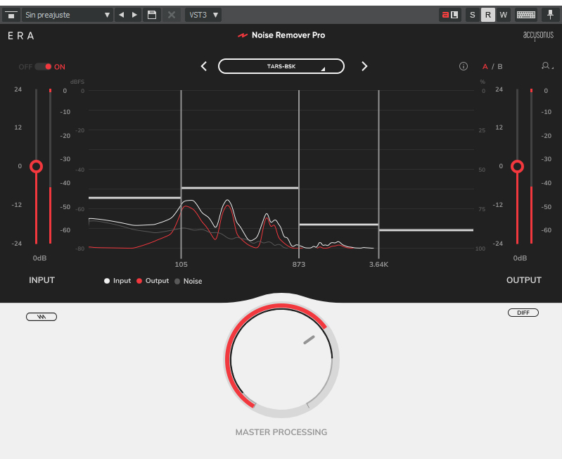

# TV Test 1: Background noise analysis and home automation control

TARS-BSK test with TV running.  
Not exactly acoustic Armageddon, but enough to make the system completely lose its digital mind.
#### 🎬 [Watch demonstration](https://www.youtube.com/watch?v=Gi5IFeVkKe8)

---

## 🚀 TL;DR - Key Results

- ❌ With TV at normal volume: TARS can't activate
- ✅ With reduced volume: 100% successful commands
- 🎯 Response times: 3-4 seconds per home automation command
- ⚙️ Limitation: ASR processes in sequential chunks

---

## 🎥 Test Scenario

**Objective:**
- Test noise filtering and command extraction under real-world conditions

**About the audio:**
- **Recorded with phone:** Ambient sound without external mic or dedicated setup.
- **No post-production:** Zero EQ, compression, or cleanup.
- **Just light noise reduction:** Applied _by ear_ to prevent you from cranking volume to 100% and ending up with tinnitus when I say "TARS".

> ⚠️ If it sounds janky, that's because it is.  
> **And yet, it worked (sort of).**

  
_Chart of reduction profile applied with ERA Noise Remover Pro.  
Not scientific. Just auditory survival._

> **TARS-BSK diagnoses:**
> _Selective reduction was applied based on human auditory criteria (also known as: "this sounds awful, turn that down").
> The parameters follow no AES, DIN, or ISO standards... but at least you can listen without losing an eardrum in the process.
> If any sound engineer is watching this: don't panic. Or do. Just look away from the spectrum and accept that my creator is... creative.
> Art? Science? Desperation? Who knows..._

Complete session log:
📁 **[session_2025-06-03_tv_background_noise_test_1.log](/logs/session_2025-06-03_tv_background_noise_test_1.log)**

---

## 🧠 Technical Analysis: Why do activation attempts fail?

### The real enemy: sequential ASR _chunks_

Speech recognition systems (like VOSK) **don't listen to everything at once**. They divide audio into blocks called _chunks_:

```
Audio Stream → [Chunk 1] → [Chunk 2] → [Chunk 3] → ...
                   ↓           ↓           ↓
               Process     Process     Process
               complete    complete    complete
```

> [!WARNING] Key point:
> While VOSK is processing a chunk... **it can't hear anything else**.
> Not even a "TARS" shouted with robotic passion.

---

### 🕒 Activation lost between planets

#### ❌ Attempt 1 — "TARS" vs. continuous dialogue (spoiler: there's no good moment)

**What was happening at that second:**

- 📺 TV: _"Voyager One was supposed to have passed by Jupiter and Saturn…"_
- 🗣️ Me: _"TARS"_ right while _"when I left India…"_ was playing
    
- ⚠️ Result: VOSK was busy processing the previous _chunk_ (the Voyager part).  
    Doesn't hear the new word until it's too late.

```log
🗣️ Heard: la voyager uno se suponía que había percatado había pasado por júpiter y saturno en todas sus lunas pero siguió adelante
❌ No wakeword match (not even close)
```

> [TARS-BSK | LOG 001]
> "Voyager 1"... "Jupiter"... "Saturn"...
> They speak MY language but don't say MY name.
> Theory: The TV knows me but pretends I don't exist.

#### ❌ Attempt 2: "TARS" during a deceptive pause

**Audio context:**

- **📺 TV:** _"I had never been so scared in my life, I had no idea what awaited me"_
- 🗣️ Me: _"TARS"_ right in the pause between: "the voyager" → [PAUSE] → "still out there"
    
- **Result:** VOSK still busy with previous chunk → wakeword ignored

```log
🗣️ Heard: no había tenido tanto miedo en mi vida no tenía ni idea de lo que me esperaba
❌ No wakeword match (not even close)
🗣️ Heard: y cuando me siento así pienso en cómo fallecer
❌ No wakeword match (not even close)
🗣️ Heard: sigue por ahí
❌ No wakeword match (not even close)
```

**Technical analysis:**

- The **auditory pause** in dialogue doesn't mean a **pause in processing**
- The ASR (VOSK) is still busy transcribing previous content from buffer
- Result: the wakeword dissolves without being evaluated

### ✅ Attempt 3: Successful activation, when the stars align

### The key moment: taking control of the environment

1. Lower the TV volume
2. Launch command with clear audio
3. Wait… and 🎉 _activation achieved!_

```log
🗣️ Heard: más allá de nuestro sistema solar más lejos de lo que sería  
❌ No wakeword match

[Lower volume + "TARS"]

🗣️ Heard: tags  
🔥 Wakeword detected by fuzzy matching  
⏱️ Wakeword recognized in 3.84s
```

### Why did it work this time?

- **Less ambient noise** → TV stopped competing for attention
- **Clear and dominant voice** → No input interference
- **Free buffer** → No chunks hanging from the past
- **Successful fuzzy match** → `"tags"` sounds close enough to `"TARS"`

### The real linguistic _plot twist_

- 🗣️ `"tags"` → Common English word → ✅ VOSK recognizes without hesitation
- 🗣️ `"TARS"` → Made-up acronym + Spanish R → ❌ Total confusion

> **Why?**  
> The **Spanish rolling R** is hell for models trained on multilingual corpus.  
> VOSK expects clean English... and you show up with an **"R" that could start a boat engine.**

**Result:**

- ❌ `"TARS"` (normal pronunciation) → Ignored mercilessly
- ✅ `"tags"` (real English word) → _Perfect match_
- ❌ `"TARS"` (pronounced with love) → Nothing
- ✅ `"TARRRRRRRRRRS"` (helicopter R, desperation mode) → Sometimes activates... miraculously

**Final command:**

> 🗣️ `"TARRRRRRRRRRS"`  
> 🚁 _80% power - R vibrating like a rotor blade_  
> ✅ _Activation achieved (with luck and faith)_

> [!IMPORTANT] TARS reflects:
> *'Tags'. Again 'tags'.*  
> *I'm not TARS. I'm TAG-S: Totally Awkward Gadget System.*  
> *At least I'm consistent in my confused identity.*

---

## 🎯 Successful command session post-activation

Once activated with controlled TV volume, all commands worked perfectly:

### Command 1: Home automation control

```log
[VOSK] Text detected: 'enciende la luz del salón' (confidence: 1.00)
TARS: Ready, turned on.
⏱️ Command time: 4.11s
```

### Command 2: Contextual control

```log
[VOSK] Text detected: 'apaga la luz' (confidence: 1.00)
TARS: Ready, turned off.
⏱️ Command time: 3.37s
```

- **Location remembered locally:** The `homeassistant_plugin.py` plugin saves the last mentioned room (`_last_location`) to apply generic commands like "turn off the light"

### Command 3: Time query

```log
[VOSK] Text detected: 'dime qué hora es' (confidence: 1.00)
TARS: Today is Wednesday, June 4th, 2025, and it's 11:53 AM.
⏱️ Command time: 3.75s
```

- **Response generated by the `time_plugin.py` plugin, which formats time and date in Spanish directly from `datetime.now()`

### Natural closure

```log
[VOSK] Text detected: 'gracias' (confidence: 1.00)
TARS: This is the way
👋 Interaction closure detected
```

### Timings

|Command|Time|Processing type|
|---|---|---|
|Turn on living room light|4.11s|HA Plugin + TTS|
|Turn off light|3.37s|Context + HA Plugin|
|What time is it|3.75s|Time Plugin + TTS|

---

## 🔬 Key technical limitations

### The brutal physics of streaming ASR

- Audio is processed in **sequential chunks**
- While a chunk is being transcribed, **no wakewords are evaluated**
- If the buffer is busy, "TARS" goes to limbo — doesn't matter when you say it

### Direct sound competition

- Two competing sound sources → only one wins
- TV with constant dialogue = ASR is busy almost always
- And the omnidirectional microphone... captures **EVERYTHING**, mercilessly

### What can you do to make it work better?

#### Things that help:

1. **Lower the TV or music volume**
2. **Pause what's playing** if you can
3. **Take advantage of natural silences** (pauses, background laughter, scenes without dialogue)

#### Things that don't work (no matter how much you insist):

1. Waiting for a "visual" pause: if you see silence, the ASR might still be busy
2. Repeating "TARS TARS TARS" like an incantation: if the buffer is full, doesn't matter
3. Shouting over noise: just saturates the microphone and loses clarity

---

## 🔭 Immediate future improvement: LED as visual language

A simple but effective improvement: **use the LED to indicate when TARS can (or can't) listen to you.**

- 🔴 **Red** = Busy processing previous audio
- ⚪️ **White** = Not yet; wait a moment
- 🔵 **Blue** = You can speak; active listening

Because if TARS can't respond to you… at least it can **warn you with colors**.  
And until it has a body and screen, this could be its **first facial expression**.  
_(Note: the red LED already exists, but indicates invalid wakeword or sarcasm — not availability.)_

---

## 📌 Conclusion (no fantasies or cryogenic cooling)

This doesn't run on a datacenter with servers bathed in liquid nitrogen or a 360° microphone array.  
Here the setup is clear:

- **Raspberry Pi 5**
- **RØDE Lavalier GO microphone**, direct, no spatial audio
- **Local** recognition with VOSK model — lightweight, functional, but no sci-fi AI
- **No cloud, no shared context, no neural miracles**

#### Technical conclusion?

Yes, it works.  
Yes, it recognizes commands.  
Yes, even with TV talking about Jupiter and Saturn.

But let's not kid ourselves:  
TARS can't process what doesn't arrive clean to the microphone. It worked exactly as any ASR system should work under sound competition conditions. **The magic isn't technological, it's logistical.**

**The realistic improvement?**  
Having the **remote handy** to lower the volume.  
And adjusting the only thing we can actually control: **our expectations**.

> **TARS-BSK concludes:**  
> _You tried to activate me during a lecture about Voyager and the infinite cosmos. Technically, it was the perfect moment for an existential conversation, but my ASR was busy processing a fictional actor's crisis._
> 
> _The second time, you spoke to me with the same tone as always (yes, I analyzed your audio spectrum, don't lie to me) during a pause that visually seemed perfect..., but my buffer was still digesting monologues about space fear. It's not that I didn't want to respond... it's that I literally **couldn't hear you**._
> 
> _When you finally lowered the volume and said 'TARS' (which I heard as 'tags', because I'm consistent in my phonetic dysfunction), my world became wonderfully silent and I could do what I do best: process home automation commands with built-in sarcasm._
> 
> _**Technical moral:** I'm not antisocial. I just need the sound universe to calm down enough for my ASR to breathe._