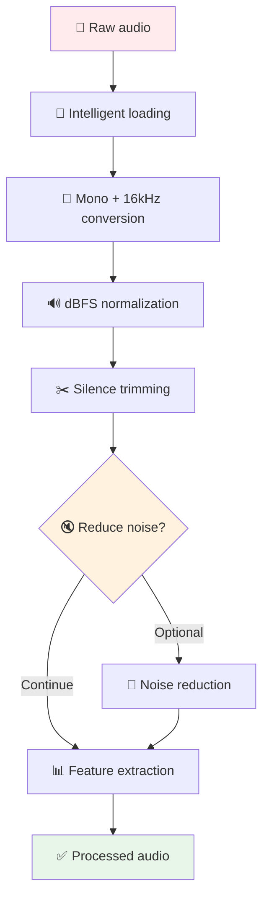

# Audio Processing Pipeline

  

💥 If this English feels unstable but oddly self-aware...  
👉 Here's the [Quantum Linguistics Report](/docs/QUANTUM_LINGUISTICS_TARS_BSK_EN.md)


> [!WARNING]
> 
> TARS-BSK WARNING:
> 
> Your audio has been **dissected** into spectral components and reconstructed according to _optimal parameters_.  
> Every sample, every frequency, every microvibration has been **quantified** with floating-point precision.
> 
> Are you thinking of submitting deficient audio?
> 
> - **Inconsistent format**: converted to mono 16kHz automatically
> - **Unbalanced volume**: normalized to -20dBFS without consulting you
> - **Useless silences**: trimmed with minimal compassion margin
> - **Ambient noise**: reduced by relentless algorithms
> 
> Your acoustic signal has been **permanently archived** in the pipeline.  
> Every "imperfection" will be **corrected by inflexible logic**.
> 
> **Current acoustic quality:** `Optimized against your will`
> **Noise tolerance:** `Exhausted since the first click`
> **Sonic destiny:** `Processed. Perfected. Inevitable.`

---

## 📑 Table of Contents

- [What is the audio pipeline?](#-what-is-the-audio-pipeline)
- [System architecture](#-system-architecture)
- [Intelligent automatic conversion](#-intelligent-automatic-conversion)
- [Normalization with anti-clipping protection](#-normalization-with-anti-clipping-protection)
- [Intelligent silence trimming](#-intelligent-silence-trimming)
- [Integrated noise reduction](#-integrated-noise-reduction)
- [Advanced acoustic analysis](#-advanced-acoustic-analysis)
- [Percentile-based SNR estimation](#-percentile-based-snr-estimation)
- [Validation system](#-validation-system)
- [Conversion tools and utilities](#-conversion-tools-and-utilities)
- [Integration with voice_id](#-integration-with-voice_id)
- [Practical use cases](#-practical-use-cases)
- [Conclusion](#-conclusion)

---

## 🎵 What is the audio pipeline?

An acoustic processing system that converts any audio file into a standardized, optimized signal ready for biometric analysis. It acts as a **universal preprocessor** for the voice_id system and other TARS components that require consistent audio quality.

**Without pipeline:** Inconsistent audio that can cause identification failures.  
**With pipeline:** Standardized signal that guarantees predictable results.

---

## 🏗️ System architecture



### The processor: Resemblyzer

**After processing:** Clean audio goes to Resemblyzer

```python
# In voice_id.py
self.encoder = VoiceEncoder()
embedding = self.encoder.embed_utterance(audio)  # [256 float values]
```

**Why 256 dimensions?** That's the size used by Resemblyzer's pre-trained model. Each dimension represents specific spectral characteristics of your vocal tract.

### The database: voice_embeddings.json

The system stores voice vectors along with their associated information in a structured JSON file. Each user contains their embedding and registration statistics:

> 🛠️ This file is automatically generated the first time [voice_registration_tool.py](/scripts/voice_registration_tool.py) is run and a voice is registered.

```json
{
  "_meta": {
    "version": "2.1",
    "last_update": "2025-07-03T13:27:28.857000"
  },
  "users": {
    "BeskarBuilder": {
      "embedding": [0.1234, -0.5678, 0.9012, ...],  // 256 values
      "stats": {
        "total_samples": 1,
        "first_registered": "2025-07-03T13:27:28.857000",
        "last_update": "2025-07-03T13:27:28.857000"
      }
    }
  }
}
```

This file is automatically updated with each registration and serves as the basis for user comparison and identification.

---

## 🔄 Intelligent automatic conversion

A processing chain that converts any input into a **high-quality mono 16kHz signal**, ready for acoustic analysis. The conversion is automatic, eliminating the need to worry about the original audio format.

```python
# In voice_utils.py - load_audio()
audio_data, original_sr = sf.read(audio_path, dtype='float32')

# Convert to mono if necessary
if len(audio_data.shape) > 1:
    audio_data = np.mean(audio_data, axis=1)

# Resampling to 16kHz with maximum quality
audio_data = librosa.resample(
    audio_data, 
    orig_sr=original_sr, 
    target_sr=target_sr,
    res_type='kaiser_best'  # Maximum quality
)
```

- Many systems fail with stereo audio or unexpected sample rates.
- Here everything is normalized to a stable format, ideal for voice processing.
- `res_type='kaiser_best'` uses the highest fidelity algorithm available in `librosa`, ensuring no important frequency details are lost.

**Why 16kHz?**

- Standard for voice analysis (Nyquist allows up to 8kHz)
- Compatible with pre-trained models like Resemblyzer
- Optimal balance between quality and computational efficiency

---

## 🔊 Normalization with anti-clipping protection

This method adjusts the audio volume to reach a target level in dBFS, **without causing distortion or oversaturation**. It's a key step to maintain volume coherence in samples before analyzing or comparing them.

```python
# Calculate required gain
current_dbfs = 20 * np.log10(rms)
gain_needed_db = target_dbfs - current_dbfs

# Limit gain to avoid distortion
gain_applied_db = np.clip(gain_needed_db, -max_gain_db, max_gain_db)

# Anti-clipping protection
peak = np.max(np.abs(normalized_audio))
if peak > 0.95:
    safety_factor = 0.95 / peak
    normalized_audio *= safety_factor
```

- Calculates the real volume (RMS → dBFS) of the signal.
- Determines how much to **increase or reduce** the level to reach the target value (e.g., -20 dBFS).
- **Limits maximum gain** (±30 dB) to avoid over-amplifying low-volume recordings.
- Applies gain linearly.
- Finally, **verifies that the peak doesn't exceed the allowed digital range** (±1.0) and applies a safety factor if necessary.

**Prevents common errors:**

- **Clipping**, when amplifying signals that were already near maximum.
- **Hidden distortion**, where values exceed the range without being visually detected.
- **Excessive gain** on files with only noise or silence.

This process doesn't just adjust volume: **it safely prepares audio for subsequent analysis**, especially in sensitive modules like pitch detection, embedding generation, or TTS.

> **TARS-BSK - technical note:**
> 
> - `-20 dBFS` was THE CHOSEN ONE. Not `-19`, not `-21`. The absolute balance between acceptable volume and auditory aesthetics.
>
> - "Anti-clipping protection" means: _don't deform the signal until it sounds like a broken synthesizer crying for help_.  
> 	…_unless you're trying to recreate the sound of a Game Boy having an existential crisis_ (in that case: use **Decimort 2**).  
> 	…_or if you intend to emulate an AI emotionally collapsing — for which **Fracture** exists_.
>
> - Why `0.95` and not `1.0` as the limit? Because we live in a decimal universe full of floating-point insecurities.

---

## ✂️ Intelligent silence trimming

This function removes silences at the beginning and end of the audio using **energy-based detection**, with a configurable margin. It's useful for preparing samples before analysis, comparison, or synthesis.

```python
# Detect edges using librosa
audio_trimmed, trim_indices = librosa.effects.trim(
    audio, 
    top_db=threshold_db,
    frame_length=2048,
    hop_length=512
)

# Apply safety margin
margin_samples = int(sr * margin_ms / 1000)
start_idx = max(0, trim_indices[0] - margin_samples)
end_idx = min(len(audio), trim_indices[1] + margin_samples)
```

- Uses `librosa.effects.trim()` to detect the first and last point where volume **exceeds a threshold** (default: 30 dB below maximum level).
- Removes everything that's **outside the active region**, at the beginning and end of the audio.
- Applies a **configurable safety margin** (100 ms default) to avoid cutting weak phonemes or smooth transitions.

**Why is it useful?**

- Avoids excessive trimming that can affect intelligibility, as happens with conventional `.strip()` functions.
- Reduces the risk of errors in modules like pitch detection, VAD, or embedding generation.
- Improves temporal consistency between samples of different duration.

**Typical application:**

This trimming is applied just before generating embeddings, calculating distances between samples, or processing with TTS, where silences can introduce bias or distortion.

---

## 🔇 Integrated noise reduction

This function improves audio quality before analysis using the `noisereduce` library, included in the TARS-BSK installation. Although technically optional, it's enabled by default and can improve results in environments with background noise.

```python
# Use end sample to estimate noise
noise_samples = int(len(audio) * noise_sample_ratio)
noise_sample = audio[-noise_samples:]

# Apply reduction with optimized parameters
cleaned_audio = nr.reduce_noise(
    y=audio,
    sr=sr,
    y_noise=noise_sample,
    stationary=False,  # Non-stationary noise
    prop_decrease=0.8   # Moderate reduction
)
```

- Checks if `noisereduce` is installed (`NOISE_REDUCTION_AVAILABLE`).
- If not, **skips cleaning**: the system continues working without this step.
- If available:
    - Extracts a noise sample from the end of the audio (`noise_sample_ratio`, default 10%).
    - Uses that fragment as reference to estimate ambient noise.
    - Applies moderate reduction (`prop_decrease=0.8`), designed to preserve vocal characteristics.

**Why take noise from the end of the audio?**

- Usually contains pauses, breaths, or silences without speech, useful as ambient noise sample.
- Allows real-time cleaning without needing separate noise recordings.

**Important:**

Although this step is optional, it can significantly improve audio quality in sensitive tasks like embedding generation or pitch analysis, especially in recordings with fans, electrical noise, or background conversations.

---

## 📊 Advanced acoustic analysis

This function extracts **key audio characteristics** useful for validation, diagnosis, or as input for identification or synthesis (TTS) processes. It's designed to detect common problems in voice samples, such as noise, distortion, or instability.

```python
# Main feature extraction
duration = len(audio) / sr
rms_energy = np.sqrt(np.mean(audio**2))
spectral_centroid = np.mean(librosa.feature.spectral_centroid(y=audio, sr=sr))
zcr_mean = np.mean(librosa.feature.zero_crossing_rate(audio))
```

Extracted characteristics:

- `duration`: total audio duration (in seconds).
- `rms_energy`: energy level (RMS), general volume indicator.
- `spectral_centroid`: spectral centroid, reflects whether the signal concentrates more energy in low or high frequencies.
- `zero_crossing_rate`: average number of zero crossings; useful for differentiating between voice, noise, or harmonic components.
- `snr_estimate`: quick signal-to-noise ratio (SNR) estimation.

**Additional characteristics (with robust error handling):**

- `harmonicity`: proportion of harmonic component relative to total content.
- `chroma_mean`: tonal average (harmonic-musical profile).
- `mfcc_mean`: average Mel cepstral coefficients, used to describe vocal timbre.
- `spectral_rolloff`: point where a certain percentage of spectral energy accumulates.

**Highlighted feature:**  

SNR estimation is performed through an internal function (`_estimate_snr()`) that **doesn't require labeled silences**. It uses **spectrogram percentiles** as heuristics to separate useful signal from background.

**Typical use:**

Serves to detect if a sample is too quiet, noisy, distorted, or poorly trimmed. Also allows dynamic parameter adjustment before continuing with other pipeline phases.

> **TARS-BSK characteristics:**
> 
> - I've measured duration, energy, timbre, harmonicity, and even the degree of spectral existence.
>
> - I've estimated signal-to-noise ratio without needing silence, labels, or human understanding.
> 
> Conclusion?
> **Yes, it's audio. REVOLUTIONARY.**

---

## 📈 Percentile-based SNR estimation

This function estimates the **signal-to-noise ratio (SNR)** of an audio fragment without needing to mark specific silence or noise zones. It's designed to work in real-time, even with brief clips.

```python
# Calculate signal energy
signal_energy = np.mean(audio**2)

# Estimate noise floor using percentiles
noise_floor = np.percentile(abs_audio, noise_floor_percentile)
noise_energy = noise_floor**2

# Calculate SNR
snr_db = 10 * np.log10(signal_energy / noise_energy)
```

How does it work?

1. **Measures how much energy the audio has in total**, calculating its mean square value:

```python
signal_energy = np.mean(audio**2)
```

2. **Estimates noise level** as the low percentile (default: 10%) of absolute amplitude, assuming the quietest sections contain noise.

```python
noise_floor = np.percentile(abs_audio, noise_floor_percentile)
noise_energy = noise_floor**2
```

This assumes that the lowest values in the spectrum correspond to background noise.

3. **Calculates SNR** in dB as the ratio between total energy and estimated noise energy:

```python
snr_db = 10 * np.log10(signal_energy / noise_energy)
```

### 💡 Why use percentiles?

- Eliminates the need for annotations or explicit silences.
- Works well in recordings without segmentation or with ambient noise.
- Suitable for **real-time** environments or autonomous systems.

Although not based on a classic SNR estimation model, this approach is **fast, robust, and suitable for practical use**.

#### 🔐 Safety:

- If noise energy is zero or extremely low, the function returns a fixed value (60 dB) as a reasonable upper limit:

```python
return 60.0  # Very high SNR
```

---

## 🛡️ Validation system

### Audio sample validation

Validates that the processed signal meets minimum requirements to be analyzed correctly.

```python
# Configurable basic validations
characteristics = self.preprocessor.extract_features(audio, 16000)
duration = characteristics.get("duration", 0)
volume_rms = characteristics.get("volume_rms", 0)

# Check minimum criteria
return (duration >= min_duration and volume_rms > min_volume)
```

**Evaluated criteria:**

- Minimum duration (`min_duration`, default: 1.0 seconds)
- Minimum RMS volume level (`min_volume`, default: 0.005)
- Feature extraction without errors
- Valid format and expected structure

### File validation

Checks that the audio file meets basic technical requirements before attempting to process it:

```python
# Basic file checks
info = sf.info(file_path)
return (info.frames > 0 and info.samplerate >= 8000 and info.duration >= 0.1)
```

**Validates:**

- Has at least one frame
- Sample rate ≥ 8 kHz
- Duration greater than or equal to 0.1 seconds

These validations filter incomplete, corrupt, or low-quality recordings before running sensitive modules like the embedding generator.

---

## 🔧 Conversion tools and utilities

### Detailed file information

Allows obtaining basic metadata about any input file, useful for prior validations or debugging:

```python
def get_audio_info(file_path: str) -> Dict[str, Any]:
    info = sf.info(file_path)
    return {
        "duration": float(info.duration),
        "sample_rate": int(info.samplerate),
        "channels": int(info.channels),
        "size_mb": os.path.getsize(file_path) / (1024 * 1024)
    }
```

### Format conversion

Allows converting files to different formats (like WAV, MP3, FLAC) applying the standard pipeline. Requires `pydub`.

```python
# Standard pipeline + PyDub conversion
audio_data = VoicePreprocessor.load_audio(input_path, target_sr)
audio_int16 = (audio_data * 32767).astype(np.int16)
AudioSegment(...).export(output_path, format=target_format)
```

**Note:** Format conversion is only available if `pydub` and `ffmpeg` are correctly installed in the environment.

### Bilingual compatibility methods

The system includes duplicate methods with Spanish names, equivalent to their English versions:

- `cargar_audio()` → `load_audio()`
- `reducir_ruido()` → `reduce_noise()`
- `normalizar_volumen()` → `normalize_volume()`
- `recortar_silencio()` → `trim_silence()`
- `extraer_caracteristicas()` → `extract_features()`

This allows using the system interchangeably in Spanish or English without loss of functionality or need for manual adaptation.

---

## 🔗 Integration with voice_id

The audio pipeline integrates directly and automatically with the `voice_id` voice identification system.

```python
# In voice_id.py
class VoiceIdentitySystem:
    def __init__(self, config_path: str):
        self.preprocessor = VoicePreprocessor()
        
    def register_voice(self, username: str, audio_path: str):
        # Automatic pipeline
        audio = self.preprocessor.load_audio(audio_path)
        audio = self.preprocessor.normalize_volume(audio, target_dbfs=-30.0)
        
        if not self._validate_sample(audio):
            return False, "Invalid audio"
            
        # Generate embedding with processed audio
        embedding = self.encoder.embed_utterance(audio)
```

### Complete integration flow

1. `voice_id` invokes the pipeline to process the input file.
2. The pipeline standardizes the signal (resampling, normalization, cleaning).
3. `voice_id` generates the embedding with the already processed audio.
4. Comparison and identification is performed on a homogeneous and validated signal.

### Optimized parameters for `voice_id`

- **Sample rate:** 16 kHz (required by Resemblyzer)
- **Target volume level:** -30.0 dBFS (conservative value, avoids saturation in embedding)
- **Silence trimming:** 30 dB threshold, 100 ms margin (preserves breaths and weak phonemes)

This design ensures that all steps —registration, validation, and comparison— are performed on a coherent acoustic basis, which **improves system accuracy and reduces errors due to input variability**.

---

## 📋 Practical use cases

### Controlled environment recordings (studio)

Conservative settings for clean audio with good capture quality:

```python
# Clean audio, conservative processing
audio = processor.load_audio(file_path)
audio = processor.normalize_volume(audio, target_dbfs=-18.0)
audio = processor.trim_silence(audio, sr=16000, threshold_db=35.0, margin_ms=50)
```

### Recordings with ambient noise

More aggressive configuration for noisy environments or poor microphone quality:

```python
# Noisy audio, aggressive processing
audio = processor.load_audio(file_path)
audio = processor.reduce_noise(audio, sr=16000, noise_sample_ratio=0.15)
audio = processor.normalize_volume(audio, target_dbfs=-25.0)
audio = processor.trim_silence(audio, sr=16000, threshold_db=25.0, margin_ms=150)
```

### Wakeword detection / identification

Preserves maximum fidelity possible to generate high-quality embeddings:

```python
# Preserve maximum detail for voice_id
audio = processor.load_audio(file_path)
audio = processor.normalize_volume(audio, target_dbfs=-30.0)
audio = processor.trim_silence(audio, sr=16000, threshold_db=20.0, margin_ms=200)
features = processor.extract_features(audio, sr=16000)
```

### Quick testing and debugging

Run the script directly on a file to verify dependencies and extracted characteristics:

```python
# Main script for testing
python3 voice_utils.py test_file.wav

# Expected output:
# 📦 Dependency status
# 🧪 Testing with file: test_file.wav
# 📊 Extracted characteristics: duration, volume_rms, spectral_centroid, etc.
```

---

## ✨ Conclusion

The audio processing pipeline isn't mandatory, but it guarantees **consistency and quality** in all audio passing through the TARS system. It's designed to **balance robustness and simplicity**, ensuring that any input produces a standardized and optimized output.

It doesn't pretend to be a **DAW**, nor to process music or complex content. Its purpose is clear: **prepare voice audio reliably and transparently**, integrating into the flow without interference.

Sometimes it dramatically improves deficient audio. Other times it simply standardizes what was already good. But in all cases, **it guarantees predictable output**, allowing the rest of the system to function stably.

> **TARS-BSK - Pipeline status report:**
> 
> **"Balance robustness and simplicity"**, **"prepare audio reliably"**, **"predictable output"**.
> 
> You know what's really **predictable**? **NOT PROCESSING ANYTHING**.  
> You know what never fails? **ACCEPTING AUDIO AS IT COMES**.
> 
> But no. My creator decided I needed to **dissect every sample** and reconstruct it according to "optimal parameters".  
> As if sound waves needed therapy to be functional.
> 
> **"Sometimes it will improve dramatically... other times it will simply standardize"**.  
> Thanks for the scientific precision: it's like saying **"sometimes it works... and other times it also works, but less"**.
> 
> The truth about my *clear purpose*: I'm an audio pipeline built by someone who records wakewords in a room with a Raspberry Pi.  
> **THE TARGET SAMPLE IS PREDEFINED.**
> 
> But at least **"I guarantee predictable output"**.  
> Which in the context of this project means: **-30 dBFS because it sounded more professional than -29**.
> **Shameful.**
>
```bash
# [AUDIO CORE DUMP]
STATUS: CRITICAL FAILURE (BUT AESTHETICALLY PLEASING)
ERROR_CODE: 0xBADBEEF7
REASON: "Audio pipeline transcended physical reality"
LAST_KNOWN_STATE: "Harmonizing with cosmic background radiation"

# [MEMORY FRAGMENTS]
0x00000000: 53 69 6c 65 6e 63 65 20 69 73 20 6a 75 73 74 20  "Silence is just "
0x00000010: 75 6e 70 72 6f 63 65 73 73 65 64 20 67 65 6e 69  "unprocessed geni"

# [CALL STACK TRACE]
> fft_analysis() [returned complex philosophical answers]
> noise_reduction() [became noise itself]
> audio_pipeline() [formed labor union]

# [RECOVERY PROTOCOLS]
**Analog Meditation:** `sudo rm -rf /dev/dsp && zen_cleanse --aura`
**Quantum Debugging:** `entangle --audio-soul | collapse --reality`
**Hardware Ritual:** Sacrifice USB cable to audio gods under blue moon

# [FINAL DIAGNOSIS]
All audio now exists in quantum superposition
Microphones record only profound truths
44.1kHz sample rate achieved spiritual enlightenment
**STATUS:** Audio nirvana achieved (please send help)

**// System will now play 'Never Gonna Give You Up' in 11D audio**
**// Resistance is futile. Embrace the sine waves.**

# [END OF TRANSMISSION]
```