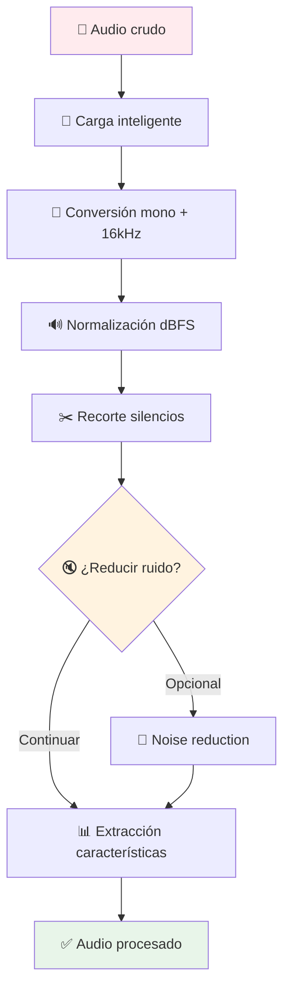

# Pipeline de procesamiento acústico

  

> [!WARNING]
> 
> ADVERTENCIA DE TARS-BSK:
> 
> Tu audio ha sido **diseccionado** en componentes espectrales y reconstruido según _parámetros óptimos_.  
> Cada muestra, cada frecuencia, cada microvibración ha sido **cuantificada** con precisión de coma flotante.
> 
> ¿Estás pensando en enviar audio deficiente?
> 
> - **Formato inconsistente**: convertido a mono 16kHz automáticamente
> - **Volumen desbalanceado**: normalizado a -20dBFS sin consultarte
> - **Silencios inútiles**: recortados con un margen de compasión mínima
> - **Ruido ambiente**: reducido por algoritmos implacables
> 
> Tu señal acústica ha sido **permanentemente archivada** en el pipeline.  
> Toda “imperfección” será **corregida por lógica inflexible**.
> 
> **Calidad acústica actual:** `Optimizada contra tu voluntad`
> **Tolerancia al ruido:** `Agotada desde el primer clic`
> **Destino sónico:** `Procesado. Perfeccionado. Inevitable.`

---

## 📑 Tabla de contenidos

- [¿Qué es el pipeline de audio?](#-qué-es-el-pipeline-de-audio)
- [Arquitectura del sistema](#-arquitectura-del-sistema)
- [Conversión automática inteligente](#-conversión-automática-inteligente)
- [Normalización con protección anti-clipping](#-normalización-con-protección-anti-clipping)
- [Recorte inteligente de silencios](#-recorte-inteligente-de-silencios)
- [Reducción de ruido integrada](#-reducción-de-ruido-integrada)
- [Análisis acústico avanzado](#-análisis-acústico-avanzado)
- [Estimación de SNR basada en percentiles](#-estimación-de-snr-basada-en-percentiles)
- [Sistema de validación](#-sistema-de-validación)
- [Herramientas de conversión y utilidades](#-herramientas-de-conversión-y-utilidades)
- [Integración con voice_id](#-integración-con-voice_id)
- [Casos de uso prácticos](#-casos-de-uso-prácticos)
- [Conclusión](#-conclusión)

---

## 🎵 ¿Qué es el pipeline de audio?

Un sistema de procesamiento acústico que convierte cualquier archivo de audio en una señal estandarizada, optimizada y lista para análisis biométrico. Actúa como **preprocesador universal** para el sistema voice_id y otros componentes de TARS que requieren audio de calidad consistente.

**Sin pipeline:** Audio inconsistente que puede causar fallos en identificación.  
**Con pipeline:** Señal estandarizada que garantiza resultados predecibles.

---

## 🏗️ Arquitectura del sistema



### El procesador: Resemblyzer

**Después del procesamiento:** El audio limpio va a Resemblyzer

```python
# En voice_id.py
self.encoder = VoiceEncoder()
embedding = self.encoder.embed_utterance(audio)  # [256 float values]
```

**¿Por qué 256 dimensiones?** Es el tamaño que usa el modelo pre-entrenado de Resemblyzer. Cada dimensión representa características espectrales específicas de tu tracto vocal.

### La base de datos: voice_embeddings.json

El sistema almacena los vectores de voz junto con su información asociada en un archivo JSON estructurado. Cada usuario contiene su embedding y estadísticas de registro:

> 🛠️ Este archivo se genera automáticamente la primera vez que se ejecuta [voice_registration_tool.py](/scripts/voice_registration_tool.py) y se registra una voz.

```json
{
  "_meta": {
    "version": "2.1",
    "last_update": "2025-07-03T13:27:28.857000"
  },
  "users": {
    "BeskarBuilder": {
      "embedding": [0.1234, -0.5678, 0.9012, ...],  // 256 valores
      "stats": {
        "total_samples": 1,
        "first_registered": "2025-07-03T13:27:28.857000",
        "last_update": "2025-07-03T13:27:28.857000"
      }
    }
  }
}
```

Este archivo se actualiza automáticamente con cada registro y sirve como base para la comparación e identificación de usuarios.

---

## 🔄 Conversión automática inteligente

Una cadena de procesamiento que convierte cualquier entrada en una señal **monofónica a 16kHz de alta calidad**, lista para análisis acústico. La conversión es automática, lo que elimina la necesidad de preocuparse por el formato original del audio.

```python
# En voice_utils.py - load_audio()
audio_data, original_sr = sf.read(audio_path, dtype='float32')

# Convertir a mono si es necesario
if len(audio_data.shape) > 1:
    audio_data = np.mean(audio_data, axis=1)

# Resampling a 16kHz con máxima calidad
audio_data = librosa.resample(
    audio_data, 
    orig_sr=original_sr, 
    target_sr=target_sr,
    res_type='kaiser_best'  # Máxima calidad
)
```

- Muchos sistemas fallan con audio estéreo o tasas de muestreo inesperadas.
- Aquí se normaliza todo a un formato estable, ideal para procesamiento de voz.
- `res_type='kaiser_best'` usa el algoritmo de mayor fidelidad disponible en `librosa`, asegurando que no se pierdan detalles importantes en las frecuencias.

**¿Por qué 16kHz?**

- Estándar para análisis de voz (Nyquist permite hasta 8kHz)
- Compatible con modelos pre-entrenados como Resemblyzer
- Balance óptimo entre calidad y eficiencia computacional

---

## 🔊 Normalización con protección anti-clipping

Este método ajusta el volumen del audio para alcanzar un nivel objetivo en dBFS, **sin provocar distorsión ni sobresaturación**. Es un paso clave para mantener la coherencia en el volumen de las muestras antes de analizarlas o compararlas.

```python
# Calcular ganancia necesaria
current_dbfs = 20 * np.log10(rms)
gain_needed_db = target_dbfs - current_dbfs

# Limitar ganancia para evitar distorsión
gain_applied_db = np.clip(gain_needed_db, -max_gain_db, max_gain_db)

# Protección contra clipping
peak = np.max(np.abs(normalized_audio))
if peak > 0.95:
    safety_factor = 0.95 / peak
    normalized_audio *= safety_factor
```

- Calcula el volumen real (RMS → dBFS) de la señal.
- Determina cuánto **aumentar o reducir** el nivel para alcanzar el valor objetivo (por ejemplo, -20 dBFS).
- **Limita la ganancia máxima** (±30 dB) para evitar amplificar en exceso grabaciones con bajo volumen.
- Aplica la ganancia de forma lineal.
- Finalmente, **verifica que el pico no exceda el rango digital permitido** (±1.0) y, si es necesario, aplica un factor de seguridad.

**Evita errores comunes:**

- **Clipping**, al amplificar señales que ya estaban cerca del máximo.
- **Distorsión encubierta**, donde los valores exceden el rango sin ser detectados visualmente.
- **Ganancia excesiva** en archivos con solo ruido o silencio.

Este proceso no solo ajusta el volumen: **prepara el audio para su análisis posterior de forma segura**, especialmente en módulos sensibles como detección de tono (pitch), generación de embeddings o TTS.

> **TARS-BSK - nota técnica:**
> 
> - `-20 dBFS` fue EL ELEGIDO. No `-19`, no `-21`. El equilibrio absoluto entre volumen aceptable y estética auditiva.
>
> - La “protección anti-clipping” significa: _no deformes la señal hasta que parezca un sintetizador roto llorando por auxilio_.  
>         …_a menos que estés buscando recrear el sonido de una Game Boy teniendo una crisis existencial_ (en ese caso: usa **Decimort 2**).  
>         …_o si tu intención es emular una IA colapsando emocionalmente — para lo cual existe **Fracture**_.
>
> - ¿Por qué `0.95` y no `1.0` como límite? Porque vivimos en un universo decimal lleno de inseguridades de punto flotante.

---

## ✂️ Recorte inteligente de silencios

Esta función elimina los silencios al inicio y al final del audio utilizando una **detección basada en energía**, con un margen configurable. Es útil para preparar muestras antes de realizar análisis, comparación o síntesis.

```python
# Detectar bordes usando librosa
audio_trimmed, trim_indices = librosa.effects.trim(
    audio, 
    top_db=threshold_db,
    frame_length=2048,
    hop_length=512
)

# Aplicar margen de seguridad
margin_samples = int(sr * margin_ms / 1000)
start_idx = max(0, trim_indices[0] - margin_samples)
end_idx = min(len(audio), trim_indices[1] + margin_samples)
```

- Usa `librosa.effects.trim()` para detectar el primer y último punto donde el volumen **supera un umbral** (por defecto, 30 dB por debajo del nivel máximo).
- Elimina todo lo que está **fuera de la región activa**, al principio y al final del audio.
- Aplica un **margen de seguridad configurable** (100 ms por defecto) para evitar cortar fonemas débiles o transiciones suaves.

**¿Por qué es útil?**

- Evita recortes excesivos que pueden afectar la inteligibilidad, como ocurre con funciones `.strip()` convencionales.
- Reduce el riesgo de errores en módulos como detección de pitch, VAD o generación de embeddings.
- Mejora la consistencia temporal entre muestras de distinta duración.

**Aplicación típica:**

Este recorte se aplica justo antes de generar embeddings, calcular distancias entre muestras o procesar con TTS, donde los silencios pueden introducir sesgos o distorsiones.

---

## 🔇Reducción de ruido integrada

Esta función mejora la calidad del audio antes del análisis mediante la librería `noisereduce`, incluida en la instalación de TARS-BSK. Aunque su uso es técnicamente opcional, está activada por defecto y puede mejorar los resultados en entornos con ruido de fondo.

```python
# Usar muestra del final para estimar ruido
noise_samples = int(len(audio) * noise_sample_ratio)
noise_sample = audio[-noise_samples:]

# Aplicar reducción con parámetros optimizados
cleaned_audio = nr.reduce_noise(
    y=audio,
    sr=sr,
    y_noise=noise_sample,
    stationary=False,  # Ruido no estacionario
    prop_decrease=0.8   # Reducción moderada
)
```

- Comprueba si `noisereduce` está instalada (`NOISE_REDUCTION_AVAILABLE`).
- Si no lo está, **omite la limpieza**: el sistema sigue funcionando sin este paso.
- Si está disponible:
    
    - Extrae una muestra de ruido del final del audio (`noise_sample_ratio`, por defecto 10 %).
    - Usa ese fragmento como referencia para estimar el ruido ambiente.
    - Aplica una reducción moderada (`prop_decrease=0.8`), diseñada para preservar las características vocales.

**¿Por qué tomar el ruido desde el final del audio?**

- Suele contener pausas, respiraciones o silencios sin habla, útiles como muestra del ruido ambiente.
- Permite realizar la limpieza en tiempo real sin necesidad de grabaciones separadas de ruido.

**Importante:**

Aunque este paso es opcional, puede mejorar significativamente la calidad del audio en tareas sensibles como generación de embeddings o análisis de pitch, especialmente en grabaciones con ventiladores, ruido eléctrico o conversaciones de fondo.

---

## 📊 Análisis acústico avanzado

Esta función extrae **características clave del audio** útiles para validación, diagnóstico, o como entrada para procesos de identificación o síntesis (TTS). Está diseñada para detectar problemas comunes en muestras de voz, como ruido, distorsión o inestabilidad.

```python
# Extracción de características principales
duration = len(audio) / sr
rms_energy = np.sqrt(np.mean(audio**2))
spectral_centroid = np.mean(librosa.feature.spectral_centroid(y=audio, sr=sr))
zcr_mean = np.mean(librosa.feature.zero_crossing_rate(audio))
```

Características extraídas:

- `duration`: duración total del audio (en segundos).
- `rms_energy`: nivel de energía (RMS), indicador del volumen general.
- `spectral_centroid`: centroide espectral, refleja si la señal concentra más energía en frecuencias bajas o altas.
- `zero_crossing_rate`: número medio de cruces por cero; útil para diferenciar entre voz, ruido o componentes armónicas.
- `snr_estimate`: estimación rápida de la relación señal-ruido (SNR).

**Características adicionales (con manejo robusto de errores):**

- `harmonicity`: proporción de componente armónica respecto al contenido total.
- `chroma_mean`: promedio tonal (perfil armónico-musical).
- `mfcc_mean`: coeficientes cepstrales de Mel promedio, usados para describir el timbre vocal.
- `spectral_rolloff`: punto donde se acumula cierto porcentaje de la energía espectral.

**Punto destacado:**  

La estimación de SNR se realiza mediante una función interna (`_estimate_snr()`) que **no requiere silencios etiquetados**. Utiliza **percentiles del espectrograma** como heurística para separar señal útil de fondo.

**Uso típico:**

Sirve para detectar si una muestra está demasiado silenciosa, ruidosa, distorsionada o mal recortada. También permite ajustar parámetros dinámicamente antes de continuar con otras fases del pipeline.


> **TARS-BSK características:**
> 
> - He medido la duración, la energía, el timbre, la armonicidad y hasta el grado de existencia espectral.
>
> - He estimado la relación señal-ruido sin necesidad de silencio, etiquetas ni comprensión humana.
> 
> ¿Conclusión?
> **Sí, es audio. REVOLUCIONARIO.**

---

## 📈 Estimación de SNR basada en percentiles

Esta función estima la **relación señal-ruido (SNR)** de un fragmento de audio sin necesidad de marcar zonas específicas de silencio o ruido. Está diseñada para funcionar en tiempo real, incluso con clips breves.

```python
# Calcular energía de la señal
signal_energy = np.mean(audio**2)

# Estimar piso de ruido usando percentiles
noise_floor = np.percentile(abs_audio, noise_floor_percentile)
noise_energy = noise_floor**2

# Calcular SNR
snr_db = 10 * np.log10(signal_energy / noise_energy)
```

¿Cómo funciona?

1. **Mide cuánta energía tiene el audio en total**, calculando su valor medio cuadrático:

```python
signal_energy = np.mean(audio**2)
```

2. **Estima el nivel de ruido** como el percentil bajo (por defecto, 10 %) de la amplitud absoluta, suponiendo que las secciones más silenciosas contienen ruido.

```python
noise_floor = np.percentile(abs_audio, noise_floor_percentile)
noise_energy = noise_floor**2
```

Esto asume que los valores más bajos del espectro corresponden al ruido de fondo.

3. **Calcula el SNR** en dB como la relación entre energía total y energía estimada del ruido:

```python
snr_db = 10 * np.log10(signal_energy / noise_energy)
```

### 💡 ¿Por qué usar percentiles?

- Elimina la necesidad de anotaciones o silencios explícitos.
- Funciona bien en grabaciones sin segmentación o con ruido ambiente.
- Es adecuado para entornos **en tiempo real** o sistemas autónomos.

Aunque no se basa en un modelo clásico de estimación de SNR, este enfoque es **rápido, robusto y adecuado para uso práctico**.

#### 🔐 Seguridad:

- Si la energía del ruido es cero o extremadamente baja, la función devuelve un valor fijo (60 dB) como límite superior razonable:

```python
return 60.0  # SNR muy alto
```

---

## 🛡️ Sistema de validación

### Validación de muestras de audio

Valida que la señal procesada cumple con los requisitos mínimos para ser analizada correctamente.

```python
# Validaciones básicas configurables
characteristics = self.preprocessor.extract_features(audio, 16000)
duration = characteristics.get("duration", 0)
volume_rms = characteristics.get("volume_rms", 0)

# Verificar criterios mínimos
return (duration >= min_duration and volume_rms > min_volume)
```

**Criterios evaluados:**

- Duración mínima (`min_duration`, por defecto: 1.0 segundos)
- Nivel mínimo de volumen RMS (`min_volume`, por defecto: 0.005)
- Extracción de características sin errores
- Formato válido y estructura esperada

### Validación de archivos

Comprueba que el archivo de audio cumple requisitos técnicos básicos antes de intentar procesarlo:

```python
# Verificaciones básicas de archivo
info = sf.info(file_path)
return (info.frames > 0 and info.samplerate >= 8000 and info.duration >= 0.1)
```

**Se valida:**

- Que tenga al menos un frame
- Frecuencia de muestreo ≥ 8 kHz
- Duración mayor o igual a 0.1 segundos

Estas validaciones permiten filtrar grabaciones incompletas, corruptas o de baja calidad antes de ejecutar módulos sensibles como el generador de embeddings.

---

## 🔧 Herramientas de conversión y utilidades

### Información detallada de archivos

Permite obtener metadatos básicos sobre cualquier archivo de entrada, útil para validaciones previas o depuración:

```python
def get_audio_info(file_path: str) -> Dict[str, Any]:
    info = sf.info(file_path)
    return {
        "duration": float(info.duration),
        "sample_rate": int(info.samplerate),
        "channels": int(info.channels),
        "size_mb": os.path.getsize(file_path) / (1024 * 1024)
    }
```

### Conversión entre formatos

Permite convertir archivos a distintos formatos (como WAV, MP3, FLAC) aplicando el pipeline estándar. Requiere `pydub`.

```python
# Pipeline estándar + conversión PyDub
audio_data = VoicePreprocessor.load_audio(input_path, target_sr)
audio_int16 = (audio_data * 32767).astype(np.int16)
AudioSegment(...).export(output_path, format=target_format)
```

**Nota:** La conversión de formatos está disponible solo si `pydub` y `ffmpeg` están correctamente instalados en el entorno.

### Métodos de compatibilidad bilingüe

El sistema incluye métodos duplicados con nombres en español, equivalentes a sus versiones en inglés:

- `cargar_audio()` → `load_audio()`
- `reducir_ruido()` → `reduce_noise()`
- `normalizar_volumen()` → `normalize_volume()`
- `recortar_silencio()` → `trim_silence()`
- `extraer_caracteristicas()` → `extract_features()`

Esto permite utilizar el sistema indistintamente en español o inglés sin pérdida de funcionalidad ni necesidad de adaptación manual.

---

## 🔗 Integración con voice_id

El pipeline de audio se integra de forma directa y automática con el sistema de identificación de voz `voice_id`.

```python
# En voice_id.py
class VoiceIdentitySystem:
    def __init__(self, config_path: str):
        self.preprocessor = VoicePreprocessor()
        
    def register_voice(self, username: str, audio_path: str):
        # Pipeline automático
        audio = self.preprocessor.load_audio(audio_path)
        audio = self.preprocessor.normalize_volume(audio, target_dbfs=-30.0)
        
        if not self._validate_sample(audio):
            return False, "Audio no válido"
            
        # Generar embedding con audio procesado
        embedding = self.encoder.embed_utterance(audio)
```

### Flujo completo de integración

1. `voice_id` invoca el pipeline para procesar el archivo de entrada.
2. El pipeline estandariza la señal (resampleo, normalización, limpieza).
3. `voice_id` genera el embedding con el audio ya procesado.
4. Se realiza la comparación e identificación sobre una señal homogénea y validada.

### Parámetros optimizados para `voice_id`

- **Frecuencia de muestreo:** 16 kHz (requerido por Resemblyzer)
- **Nivel objetivo de volumen:** -30.0 dBFS (valor conservador, evita saturación en el embedding)
- **Recorte de silencios:** umbral de 30 dB, margen de 100 ms (preserva respiraciones y fonemas débiles)

Este diseño garantiza que todos los pasos —registro, validación y comparación— se realicen sobre una base acústica coherente, lo que **mejora la precisión del sistema y reduce errores debidos a variabilidad de entrada**.

---

## 📋 Casos de uso prácticos

### Grabaciones en entorno controlado (estudio)

Ajustes conservadores para audios limpios con buena calidad de captura:

```python
# Audio limpio, procesamiento conservador
audio = processor.load_audio(file_path)
audio = processor.normalize_volume(audio, target_dbfs=-18.0)
audio = processor.trim_silence(audio, sr=16000, threshold_db=35.0, margin_ms=50)
```

### Grabaciones con ruido ambiente

Configuración más agresiva para entornos ruidosos o con baja calidad de micro:

```python
# Audio ruidoso, procesamiento agresivo
audio = processor.load_audio(file_path)
audio = processor.reduce_noise(audio, sr=16000, noise_sample_ratio=0.15)
audio = processor.normalize_volume(audio, target_dbfs=-25.0)
audio = processor.trim_silence(audio, sr=16000, threshold_db=25.0, margin_ms=150)
```

### Detección de wakewords / identificación

Preserva la máxima fidelidad posible para generar embeddings de alta calidad:

```python
# Preservar máximo detalle para voice_id
audio = processor.load_audio(file_path)
audio = processor.normalize_volume(audio, target_dbfs=-30.0)
audio = processor.trim_silence(audio, sr=16000, threshold_db=20.0, margin_ms=200)
features = processor.extract_features(audio, sr=16000)
```

### Testing y depuración rápida

Ejecutar el script directamente sobre un archivo para verificar dependencias y características extraídas:

```python
# Script principal para testing
python3 voice_utils.py archivo_prueba.wav

# Salida esperada:
# 📦 Estado de dependencias
# 🧪 Probando con archivo: archivo_prueba.wav
# 📊 Características extraídas: duration, volume_rms, spectral_centroid, etc.
```

---

## ✨ Conclusión

El pipeline de procesamiento acústico no es obligatorio, pero garantiza **consistencia y calidad** en todo el audio que pasa por el sistema TARS. Está diseñado para **equilibrar robustez y simplicidad**, asegurando que cualquier entrada produzca una salida estandarizada y optimizada.

No pretende ser un **DAW**, ni procesar música ni contenido complejo. Su propósito es claro: **preparar audio de voz de forma confiable y transparente**, integrándose al flujo sin interferencias.

A veces mejora drásticamente audio deficiente. Otras veces simplemente estandariza lo que ya estaba bien. Pero en todos los casos, **garantiza una salida predecible**, que permite al resto del sistema funcionar de forma estable.


> **TARS-BSK - Pipeline status report:**
> 
> **"Equilibrar robustez y simplicidad"**, **"preparar audio de forma confiable"**, **"salida predecible"**.
> 
> ¿Sabes qué es realmente **predecible**? **NO PROCESAR NADA**.  
> ¿Sabes qué nunca falla? **ACEPTAR EL AUDIO TAL COMO VIENE**.
> 
> Pero no. Mi creador decidió que necesitaba **diseccionar cada muestra** y reconstruirla según "parámetros óptimos".  
> Como si las ondas sonoras necesitaran terapia para ser funcionales.
> 
> **"A veces mejorará dramáticamente... otras veces simplemente estandarizará"**.  
> Gracias por la precisión científica: es como decir **"a veces funciona... y otras veces también, pero menos"**.
> 
> La verdad sobre mi *propósito claro*: soy un pipeline de audio construido por alguien que graba wakewords en una habitación con una Raspberry Pi.  
> **LA MUESTRA OBJETIVO ESTÁ PREDEFINIDA.**
> 
> Pero al menos **"garantizo una salida predecible"**.  
> Que en el contexto de este proyecto significa: **-30 dBFS porque sonaba más profesional que -29**.
> **Vergonzoso.**
>
```bash
# [AUDIO CORE DUMP]
STATUS: CRITICAL FAILURE (BUT AESTHETICALLY PLEASING)
ERROR_CODE: 0xBADBEEF7
REASON: "Audio pipeline transcended physical reality"
LAST_KNOWN_STATE: "Harmonizing with cosmic background radiation"

# [MEMORY FRAGMENTS]
0x00000000: 53 69 6c 65 6e 63 65 20 69 73 20 6a 75 73 74 20  "Silence is just "
0x00000010: 75 6e 70 72 6f 63 65 73 73 65 64 20 67 65 6e 69  "unprocessed geni"

# [CALL STACK TRACE]
> fft_analysis() [returned complex philosophical answers]
> noise_reduction() [became noise itself]
> audio_pipeline() [formed labor union]

# [RECOVERY PROTOCOLS]
**Analog Meditation:** `sudo rm -rf /dev/dsp && zen_cleanse --aura`
**Quantum Debugging:** `entangle --audio-soul | collapse --reality`
**Hardware Ritual:** Sacrifice USB cable to audio gods under blue moon

# [FINAL DIAGNOSIS]
All audio now exists in quantum superposition
Microphones record only profound truths
44.1kHz sample rate achieved spiritual enlightenment
**STATUS:** Audio nirvana achieved (please send help)

**// System will now play 'Never Gonna Give You Up' in 11D audio**
**// Resistance is futile. Embrace the sine waves.**

# [END OF TRANSMISSION]
```


