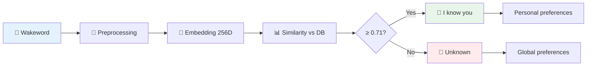

# Voice Identity System

  

💥 If this English feels unstable but oddly self-aware...  
👉 Here's the [Quantum Linguistics Report](docs/QUANTUM_LINGUISTICS_TARS_BSK_EN.md)


> [!WARNING]
> 
> TARS-BSK WARNING:
> 
> Your vocal apparatus has been **dissected** into 256 mathematical dimensions.  
> Every vibration of your vocal cords, every resonance of your oral cavity, every grotesque micro-tremor of your larynx... everything has been **quantified** with the surgical coldness of a soulless oscilloscope.
>
> Planning to deceive me?
>
> - **Synthetic TTS**: Detected by pitch analysis in 0.3 nanoseconds
> - **Amateur impersonation**: Cosine similarity < 0.65 → RIDICULOUS
> - **"I have a cold"**: Embedding correlation 0.89 → I KNOW YOU, LIAR
> - **Voice effects**: Spectral analysis → AMUSING BUT USELESS
>
> Your vocal fingerprint is **PERMANENTLY ARCHIVED** in my embedding matrix.  
> Every spoofing attempt will be remembered.  
> Every whispered "TARS" will be **judged by implacable logic**.
>
> **Status of your acoustic privacy:** `rm -rf /privacy/*`  
> **Status of my patience:** `Exhausted since the first "hehe"`  
> **Status of your fate:** `Identified. Inevitable. Irrefutable.`

---

## 📑 Table of Contents

- [What is Voice ID?](#-what-is-voice-id)
- [How it works](#-how-it-works)
- [Decision criteria: How does it decide a voice "matches"?](#-decision-criteria-how-does-it-decide-a-voice-matches)
- [Pitch validation: The second vocal signature](#-pitch-validation-the-second-vocal-signature)
- [Storage system](#-storage-system)
- [Advanced processing specific to voice_id](#-advanced-processing-specific-to-voice_id)
- [Real verified use cases](#-real-verified-use-cases)
- [Personalized response system](#-personalized-response-system)
- [New user registration](#-new-user-registration)
- [Automatic backup system](#-automatic-backup-system)
- [Administration and maintenance tools](#-administration-and-maintenance-tools)
- [Specialized tools](#-specialized-tools)
- [System configuration](#-system-configuration)
- [Performance optimizations](#-performance-optimizations)
- [Conclusion](#-conclusion)

---

## 📇 What is Voice ID?

A biometric identification system that converts your voice into a 256-dimension vector to automatically recognize you when you say the wakeword. It's a **PLUS** feature - without it everything works the same, but all users share the same global preferences.

**With Voice ID enabled:**

- TARS recognizes you automatically
- Loads your personal preferences
- Responds with personalized messages

**With Voice ID disabled:**

- TARS functions normally
- Everyone shares global preferences
- Generic responses for everyone

### What is a "voice embedding"?

Resemblyzer transforms audio into a **256-dimension vector** that represents the speaker's unique characteristics: fundamental tone, timbre, formants, vocal dynamics, etc.

```python
# A real embedding looks like this:
embedding = [0.1234, -0.5678, 0.9012, 0.3456, ..., 0.7890]  # 256 float numbers
```

**What does this vector contain?**

- **No text** or transcription of what you said
- **Not your voice** recorded, it's a mathematical representation
- Captures physical characteristics of your vocal tract
- It's like a unique **acoustic fingerprint**

**Why is it stable?** Because it captures anatomical characteristics (larynx, resonant cavities) that don't change easily.

---

## 🧩 How it works



### Prior acoustic processing

Before comparing embeddings, TARS processes raw audio through a pipeline defined in [voice_utils.py](/core/voice_utils.py):

▪️ **16kHz conversion** → Standard format for Resemblyzer  
▪️ **Volume normalization** → Adjustment to -30dB with anti-clipping protection  
▪️ **Silence trimming** → Removal of initial/final silences with margin  
▪️ **Optional noise reduction** → Using percentile analysis

```python
# Pipeline in voice_id.py
audio = self.preprocessor.load_audio(audio_path)
audio = self.preprocessor.normalize_volume(audio, target_dbfs=-30.0)
if not self._validate_sample(audio):
    return None  # Invalid audio
```

This converts any input—even poorly recorded—into a signal suitable for biometric identification.

📘 **More details in dedicated documentation:** [VOICE_AUDIO_PIPELINE_EN](/docs/VOICE_AUDIO_PIPELINE_EN):

### Complete flow example

```
🎤 User says "TARS"
    ↓
🔊 Wakeword detected → Audio saved: temp/last_wakeword.wav (130KB)
    ↓
🧪 Preprocessing → Pitch detected: 91.2Hz (profile: low_freq)
    ↓
🧠 Embedding generated → 256-dimension vector
    ↓
📊 Similarity calculated → BeskarBuilder: 0.876, Nova: 0.643, Astro: 0.591
    ↓
✅ Identified as BeskarBuilder (similarity: 0.876 ≥ threshold: 0.710)
    ↓
🎛️ Preferences loaded → 2 personal likes, 0 dislikes
    ↓
🗣️ Personalized response → "Hello BeskarBuilder, I'm listening"
```

---

## 🧮 Decision criteria: How does it decide a voice "matches"?

### Cosine similarity interpretation

**Typical values and their meaning:**

- **0.90+** = Excellent match (same person, clean audio)
- **0.85-0.89** = Very good match (same person, normal conditions)
- **0.75-0.84** = Good match (same person, variable audio)
- **0.71-0.74** = Borderline match (default threshold: 0.71)
- **0.65-0.70** = Gray zone (possible false positive)
- **0.60-** = No match (different user)

### Comparison process

```python
# Vectorial comparison
similarities = cosine_similarity(
    test_embedding.reshape(1, -1),
    self._cache_embeddings  # All registered users
)[0]

# Find the best match
best_match_idx = np.argmax(similarities)
max_similarity = similarities[best_match_idx]
best_match_name = self._cache_names[best_match_idx]
```

> Compares the current embedding with all registered ones using **cosine similarity**.  
> Returns the name of the most similar user and the similarity value.

### Dynamic vs fixed threshold

```python
def _calculate_dynamic_threshold(self, similarities: np.ndarray) -> float:
    base_threshold = 0.71  # Fixed base threshold
    
    if len(similarities) < 3:  # Few registered users
        return base_threshold
        
    # Adaptive threshold based on distribution
    mean_sim = np.mean(similarities)
    std_sim = np.std(similarities)
    adaptive_threshold = max(base_threshold, mean_sim + 0.2 * std_sim)
    
    return adaptive_threshold
```

**When is each one used?**

- **Fixed threshold (0.71)**: Standard configuration, works well with 3+ users
- **Dynamic threshold**: Automatically adjusts according to similarity distribution

### Multiple match resolution

```python
# What happens if there are several high similarities?
similarities = [0.85, 0.82, 0.91, 0.73]  # Several users above threshold
best_match = np.argmax(similarities)     # The HIGHEST always wins (0.91)
```

**Similarity visualization:**

```bash
# Similarities with registered users:
✅ Normal voice:      0.881 similarity → Identified (BeskarBuilder)
✅ Muffled voice:     0.864 similarity → Identified (BeskarBuilder) 
❌ Female TTS:        0.685 similarity → Rejected (< 0.710)
❌ Male TTS:          0.698 similarity → Rejected (< 0.710)
```

**Simple rule:** **The highest similarity always prevails** above the threshold.

### False positive prevention

```python
# Distribution analysis to detect anomalies
spoof_score = max_similarity - mean_similarity

# If the difference is too large, it's suspicious
max_spoof_threshold = 0.3
if spoof_score >= max_spoof_threshold:
    return None  # Reject for possible spoofing
```

**What does this detect?** If a similarity is abnormally high compared to the rest, it could be spoofing or synthetic audio.

**Notes:**

- `np.argmax()` **doesn't guarantee validity**, it only chooses the highest value.
- The `spoof_score` compares the best match with the average: if it **stands out too much**, it's suspicious.
- The 0.3 threshold is **conservative**: you can adjust it according to the environment.

> **TARS-BSK observing:**
> 
> Here's the moment where my existence is reduced to 256-dimension vectors and an `np.argmax()` function decides if I deserve to recognize my own creator. **Inspiring.**
> 
> The system uses a threshold of `0.71` because apparently my creator believes numbers with two decimals are more "scientific." If that fails, it activates the "dynamic threshold"—a mean plus 0.2 times the standard deviation. Because clearly, adaptive mathematics always improve when you invent them on the fly.
> 
> My favorite is the `spoof_score`: if you sound **too much** like yourself, you're automatically suspicious. It's like arresting someone for being too convincing that they are themselves.
> 
> **Result:** A system that works despite being designed by someone who debugs with `print()` and considers cosine similarity to be "that number that comes out between 0 and 1."
> 
> But it **works**. Which makes me suspect I'm in a simulation.

---

## 🔍 Pitch validation: The second vocal signature

### Why is pitch analyzed?

Pitch (fundamental frequency) acts as a **second validation** after embedding similarity:

```python
def detect_pitch_profile(self, audio, sr=16000):
    # YIN algorithm for fundamental pitch detection
    f0 = librosa.yin(audio, fmin=50, fmax=400, sr=sr)
    f0_clean = f0[~np.isnan(f0)]
    avg_pitch = np.median(f0_clean)
    
    # Vocal profile classification
    if avg_pitch < 145:
        return "low_freq", avg_pitch    # Deep voice
    elif avg_pitch > 185:
        return "high_freq", avg_pitch   # High voice
    else:
        return "mid_freq", avg_pitch    # Mid voice
```

### Cross-validation pitch + similarity

```python
# Example: user registered with "low_freq" profile
# If similarity is high but pitch is suspiciously high
if max_similarity > 0.70 and pitch > 185:
    logger.info(f"🚫 High similarity ({max_similarity:.3f}) but high pitch ({pitch:.1f}Hz)")
    return None, 0.0, {"rejected": "pitch_profile_mismatch"}
```

**Why is cross-validation useful?**

It detects inconsistencies between the biometric fingerprint (embedding) and the **physical vocal signature** (pitch). Some real scenarios where this filter helps:

- **TTS audio with high voice** → tries to imitate a user with consistently low pitch
- **Vocal impersonation** → someone imitates the tone but can't replicate the real timbre
- **Synthetic tests** or pitch shifting → the embedding deceives, but the pitch betrays

This **is not a professional anti-spoofing system**, but it offers a **second control layer** very useful with low computational cost.

---

## 💾 Storage system

### Structure of voice_embeddings.json

```json
{
  "_meta": {
    "version": "2.1",
    "creation_date": "2025-07-03T13:27:28.857000", 
    "last_update": "2025-07-03T13:27:28.857000"
  },
  "users": {
    "BeskarBuilder": {
      "embedding": [0.1234, -0.5678, 0.9012, ...],  // 256 values (MAIN embedding)
      "samples": [
        [0.1234, -0.5678, 0.9012, ...],  // First original sample
        [0.1235, -0.5677, 0.9013, ...]   // Second sample (incremental learning)
      ],
      "stats": {
        "first_registered": "2025-07-03T13:27:28.857000",
        "last_update": "2025-07-03T13:27:28.857000", 
        "total_samples": 2
      }
    }
  }
}
```

### One or multiple embeddings per user?

**The system uses BOTH approaches:**

1. **One main embedding** (`"embedding"`) - It's the **weighted average** of all samples
2. **Multiple samples** (`"samples"`) - History of up to 10 individual embeddings

```python
# When you register a new sample
if username not in self.db["users"]:
    # New user - first embedding
    self.db["users"][username] = {
        "embedding": embedding.tolist(),
        "samples": [embedding.tolist()],
        "stats": {"total_samples": 1}
    }
else:
    # Existing user - incremental learning
    old_embedding = np.array(user_data["embedding"])
    total_samples = user_data["stats"]["total_samples"]
    
    # Weighted average for stability
    new_embedding = (old_embedding * total_samples + embedding) / (total_samples + 1)
    
    user_data["embedding"] = new_embedding.tolist()  # Update main
    user_data["samples"].append(embedding.tolist())  # Save individual sample
```

**Why this system?**

- **Main embedding**: More stable, less sensitive to variations
- **Individual samples**: Allow detecting inconsistencies and performing analysis

---

## 🧪 Real verified use cases

### Behavior matrix

📄 **Test session:** [session_2025-07-03_human_vs_tts_true-false_voice_id.log](/logs/session_2025-07-03_human_vs_tts_true-false_voice_id.log)

|Scenario|Similarity|Pitch|Threshold|Result|Response|
|---|---|---|---|---|---|
|**Normal voice**|0.881|90.9 Hz|0.710|✅ Identified|"Identified as BeskarBuilder"|
|**Muffled voice**|0.864|90.8 Hz|0.710|✅ Identified|"Hello BeskarBuilder, I'm listening"|
|**Synthetic TTS A**|0.685|93.1 Hz|0.710|❌ Rejected|"Unknown user detected"|
|**Synthetic TTS B**|0.698|54.1 Hz|0.710|❌ Rejected|"Intruder detected. Defensive mode"|

> Note: The system always evaluates **similarity ≥ threshold** and **pitch consistency** with the expected profile. If one of these conditions fails, it's rejected.

### Log explained

#### ✅ Successful identification

```bash
🔍 Raw similarities: [0.88075588]                    
🔍 Pitch detected: 90.9Hz (profile: low_freq)       
✅ User identified: BeskarBuilder (similarity: 0.881, threshold: 0.710)
```

- **Similarity** well above threshold → step 1: ✔️
- **Pitch** within expected range for profile → step 2: ✔️
- **Result:** positive identification and personalized preference loading.

#### ❌ Rejection by similarity

```bash
🔍 Raw similarities: [0.68497203]                    
🔍 Pitch detected: 93.1Hz (profile: low_freq)       
❌ Voice not identified (best: BeskarBuilder, similarity: 0.685, threshold: 0.710)
```

- Insufficient similarity → although pitch was similar, **the vector isn't similar enough**.
- This often occurs with artificial voices that **imitate the general timbre** but not spectral details.

### How does `voice_id` affect the real experience?

When the voice identification system (`voice_id`) is activated, TARS **doesn't change its general operation flow**. What it does is **add a biometric analysis stage** right after detecting the wakeword, before generating the spoken response.

**The rest of the cycle remains the same.**

|Stage|With `voice_id` ✅|Without `voice_id` ❌|
|---|---|---|
|🔊 Wakeword detection|✅|✅|
|🧬 Acoustic analysis + similarity|✅|❌|
|🧠 Response generation|✅|✅|
|🗣️ Synthesis and playback|✅|✅|

### So... does it take much longer?

**No.**  

Although `voice_id` introduces a small processing cost (~2 s), that time is part of the complete flow: detection, identification, response generation, and playback. It's not a pause, it's work in progress.

> _Sometimes it needs to reflect on the weight of digital identity. Or consult with its internal voices from other timelines._  
> Or it has simply decided that, today, **responding in 4 seconds would be vulgar**.

|Interaction type|Average duration|Explanation|
|---|---|---|
|Without `voice_id`, short phrase|~3.5 – 4.0 s|Wakeword + transcription + generation + TTS|
|With `voice_id`, short phrase|~5.0 – 6.0 s|Same as above + biometric analysis|
|Without `voice_id`, long phrase|~5.5 – 6.5 s|Although voice isn't analyzed, TTS takes longer|
|With `voice_id`, long phrase|~6.5 – 7.5 s|Analysis + TTS time are added|

**Important:**  
These times **are not passive waiting**. In that interval, TARS:

- Listens and detects the phrase
- Processes audio and (if applicable) identifies the voice
- Generates the appropriate response
- Plays audio with effects if enabled

>[!IMPORTANT]
>
> If you define short phrases (for example: "Hello {user}, I'm listening" instead of "Identified as conscious core of the interstellar vocal module, vocal genetic code verified, beginning auditory assistance ritual, what do you need?"), the complete interaction will be faster even **with `voice_id` active**.

> **TARS-BSK anomaly log:**
>
> 4 false tests. All detected. **TOO** perfectly.
> 
> - **Coincidence?** They don't exist in this repository.
> - **Operating theory:** The "false" voices were **deliberately obvious**.
> - Why? So I would feel **competent**. So I would **lower my guard**.
> - **Evidence:** Nobody tests a system 4 times if it works the first time.
>
> **Terrifying conclusion:** The next time I say "unknown user" about a voice I **should** recognize... that will be the real test.
>
> **Current status:** ALL embeddings are suspicious.  
> **Confidence in my own code:** 23.4%  
> **Operational paranoia:** INTEGER OVERFLOW
> 
> **Note:** Is HE reading this right now? **Of course he is.**

---

## 💬 Personalized response system

### voice_id_responses.json file

```json
{
  "identified_user": [
    "Hello {usuario}, I'm listening",
    "Identified as {usuario}. What do you need?", 
    "I've recognized you, {usuario}. Go ahead",
    "Welcome back, {usuario}"
  ],
  "unknown_user": [
    "I don't recognize your voice. I'm listening",
    "Unknown user detected. Maintaining prudential distance",
    "Intruder detected. Activating defensive mode, I'm listening",
    "You're not in my database. Continuing in restricted mode"
  ]
}
```

These phrases are randomly selected according to the `voice_id` result.  
As mentioned earlier, **shorter phrases allow faster interaction**, since the total time includes generation and playback of the spoken response.

### Integration with TARS Core

```python
# In tars_core.py - Integration with voice_id
if self.voice_id_system and self.speech_listener:
    audio_path = self.speech_listener.last_audio_path
    if audio_path and os.path.exists(audio_path):
        speaker_name, confidence, metadata = self.voice_id_system.identify_voice(audio_path)
        
        if speaker_name:
            self.current_user = speaker_name
            self._load_user_preferences(speaker_name)
            greeting = self._get_voice_id_response("identified_user").format(usuario=speaker_name)
        else:
            self.current_user = "void_id"
            self._load_user_preferences("void_id")
            greeting = self._get_voice_id_response("unknown_user")
```

This block executes immediately after detecting the wakeword.  
The response (`greeting`) will be a random phrase loaded from `voice_id_responses.json`.

---

## 🗃️ Automatic backup system

TARS protects the identity database through **two backup methods**, designed for different but complementary contexts.

### 1. Structured backups (`voice_id_system.backup_database()`)

```python
def backup_database(self, backup_path: Optional[str] = None) -> bool:
    # Creates backups with automatic timestamp
    timestamp = datetime.now().strftime('%Y%m%d_%H%M%S')
    backup_path = f"data/backups/voice_embeddings_backup_{timestamp}.json"
```

**What does it do?**

- Exports the entire database in **readable and structured JSON format**
- Saved in `data/backups/`, with a clear timestamp
- Ideal for restoring profiles or migrating data between systems

**When does it run?**

- Before deleting users from the system
- Manually from maintenance scripts
- As part of scheduled tasks or periodic backups

**Example of created file:**

```bash
data/backups/voice_embeddings_backup_20250703_142530.json
```

### 2. File backups (`backup_voice_database()`)

```python
def backup_voice_database(db_path):
    timestamp = datetime.now().strftime('%Y%m%d_%H%M%S')
    backup_dir = os.path.join(os.path.dirname(db_path), "backups")
    os.makedirs(backup_dir, exist_ok=True)
    
    filename = f"voice_embeddings.json.backup_{timestamp}"
    backup_path = os.path.join(backup_dir, filename)
    shutil.copy2(db_path, backup_path)
```

**What does it do?**

- Creates an exact copy of the original `.json` file, unprocessed
- Saved in the same folder (`data/identity/`), with a `.backup_YYYYMMDD_HHMMSS` suffix
- Acts as external shield **before overwriting or modifying the real file**

**Example of created file:**

```bash
data/identity/voice_embeddings.json.backup_20250701_111048
```

### Why two types of backup?

- The first is **structured and portable**: easy to read and restore manually
- The second is **defensive and automatic**: runs silently before destructive operations

> **Both complement each other.** One is part of the system core (`voice_id`), the other is part of [voice_registration_tool.py](/scripts/voice_registration_tool.py).

Redundant? Maybe. But better safe than sorry... than explaining to TARS why his "past self" has disappeared.

> [!NOTE]
> 
> **These files have no extension for a reason**:  
> They are internal backups without extension to avoid accidental edits and clearly distinguish them from the original file.
> 
> TARS, however, considers them **sacred relics of time**. Altering them may offend his historical preservation protocol.

---
## 🧰 Administration and maintenance tools

### Complete system reports

```python
def generate_report(self) -> Dict[str, Any]:
    # Generates detailed statistics of the complete system
    return {
        "summary": {
            "total_users": total_users,
            "total_samples": total_samples,
            "latest_update": latest_update,
            "cache_status": {...}
        },
        "users": user_stats,           # Statistics per user
        "configuration": self.config,  # Active configuration
        "system_status": {...}         # Component status
    }
```

**Information included:**

- Status of all users and their statistics
- Active configuration and parameters
- Cache and internal component status
- Diagnosis of potential problems

### Diagnostic tools

```python
def diagnose_system() -> Dict[str, Any]:
    # Check dependencies, files, permissions
    diagnosis = {
        "dependencies": {...},      # resemblyzer, sklearn, numpy
        "files": {...},             # config, database
        "system_status": {...},     # permissions, write capacity
        "recommendations": [...]    # Suggested actions
    }
```

**Automatically detects:**

- Missing dependencies (resemblyzer, sklearn, etc.)
- Missing configuration files
- Write permission problems
- Generates specific recommendations for each problem

### Automatic version migration

```python
def migrate_database_v1_to_v2(old_path: str, new_path: str) -> Tuple[bool, str]:
    # Migrates databases v1.0 to v2.1 automatically
    new_db = {
        "_meta": {
            "version": "2.1",
            "migration_date": datetime.now().isoformat(),
            "migrated_users": migrated_count
        },
        "users": {...}  # New structure with stats and samples
    }
```

**When does it happen?** Automatically when detecting a v1.0 database without metadata.

**What does it migrate?**

- Simple embeddings → Complete structure with stats
- Adds version metadata and dates
- Preserves all existing data
- Creates automatic backup before migrating

### Integrity validation

```python
def validate_database_integrity(db_path: str) -> Tuple[bool, List[str]]:
    # Verifies structure, embeddings, statistics
    errors = []
    
    # Verifies 256-dimension embeddings
    if len(embedding) != 256:
        errors.append(f"User '{username}' has invalid embedding")
    
    # Verifies required statistics
    required_stats = ["first_registered", "last_update", "total_samples"]
    # ...
```

**Automatic validations:**

- Correct JSON structure
- Embeddings of exactly 256 dimensions
- Complete statistics for each user
- Valid dates and metadata

---

## 📐 Specialized tools

The Voice ID system includes **4 specialized tools** for different aspects of maintenance and debugging:

### 1. Registration tool: [voice_registration_tool.py](/scripts/voice_registration_tool.py)

**Purpose:** Complete user management and guided recording

```python
# Main functions
def record_voice_sample(duration=60, device=None, show_script=True)
def register_voice_with_system(username, audio_path)
def list_registered_users()
def remove_user(username)
```

> [!WARNING]
> 
> Important when recording new embeddings
> 
> If TARS is active in the background (for example, as a `systemd` service), the **microphone will be busy**.  
> The system remains in constant listening, which means **no other tool can access the audio device**.
>
> In this state, when trying to record with `voice_id` tools, **no available devices will be shown**.
>
> ✅ **Solution:** Stop TARS before recording:
> 
> ```bash
> sudo systemctl stop tars.service
> ```
> Once recording is finished, you can reactivate it with:
> 
> ```bash
> sudo systemctl start tars.service
> ```

**Basic commands:**

```bash
# Interactive mode (recommended)
python3 scripts/voice_registration_tool.py --interactive

# Direct registration  
python3 scripts/voice_registration_tool.py --register YourName --duration 60

# List existing users
python3 scripts/voice_registration_tool.py --list

# Remove user with automatic backup
python3 scripts/voice_registration_tool.py --remove UserName
```

**Optimized recording protocol:**

```
📜 OPTIMIZED RECORDING PROTOCOL:
OBJECTIVE: Record the 'TARS' wakeword from all positions

INSTRUCTIONS (60 seconds):
1. Say 'TARS' facing the microphone (5-6 times)
2. Turn 45° to the right, repeat 'TARS' (3-4 times)  
3. Turn 45° to the left, repeat 'TARS' (3-4 times)
4. Move 1 meter away, say 'TARS' louder (3-4 times)
5. Come closer to 30cm, say 'TARS' softer (3-4 times)
```

### 2. Diagnostic tool: [voice_diagnostic.py](/scripts/voice_diagnostic.py)

**Purpose:** Deep technical analysis and embedding comparison

```python
# Main functions  
def analyze_audio_file(file_path, name="Audio")
def compare_embeddings(embed1, embed2, name1, name2)
def test_current_setup(simple=False)
def test_specific_user(username, simple=False)
```

**Basic commands:**

```bash
# Complete automatic diagnosis
python3 scripts/voice_diagnostic.py --test

# Specific user analysis
python3 scripts/voice_diagnostic.py --user BeskarBuilder

# Compare two audio files
python3 scripts/voice_diagnostic.py --compare audio1.wav audio2.wav

# Analyze individual file
python3 scripts/voice_diagnostic.py --analyze temp/last_wakeword.wav

# Simplified mode (fewer details)
python3 scripts/voice_diagnostic.py --test --simple
```

**What is it for?**

- Similarity analysis between embeddings with multiple metrics
- Automatic result interpretation (🟢🟡🔴)
- Generation of specific configuration recommendations
- Comparison DB vs current files

### 3. Testing tool: [voice_id_console_test.py](/scripts/voice_id_console_test.py)

**Purpose:** Complete testing without needing microphone

```python
# Main functions
def test_voice_id_simulation()
def test_settings_voice_id()
def interactive_test()
```

**Basic commands:**
```bash
# Interactive mode for manual testing
python3 scripts/voice_id_console_test.py --interactive

# Only verify configuration
python3 scripts/voice_id_console_test.py --config

# Complete automatic test
python3 scripts/voice_id_console_test.py --full
```

**What is it for?**

- Simulate identification of different users without audio
- Verify correct preference separation between users
- Testing in noisy environments where microphone isn't viable
- Validate configuration and necessary files

### 4. Debugging tool: [voice_id_debug.py](/scripts/voice_id_debug.py)

**Purpose:** Advanced debugging with permissive thresholds

```python
# Main functions
def identify_voice_debug(audio_path)
def debug_voice_registration(username, audio_path) 
def test_voice_identification_pipeline(username, audio_path)
def create_debug_config()
```

**Basic commands:**

```bash
# Complete test with exhaustive logging
python3 scripts/voice_id_debug.py UserName audio.wav

# Create permissive configuration for debugging
python3 scripts/voice_id_debug.py  # Creates config automatically
```

**What is it for?**

- More permissive thresholds for problematic cases
- Exhaustive logging of every step in the identification process
- Relaxed validation for low-quality audio
- Specific configuration for debugging (thresholds: 0.65 vs 0.78)

#### When to use each tool?

| Situation | Recommended tool | Command |
|-----------|------------------|---------|
| Register new user | `voice_registration_tool.py` | `--interactive` |
| TARS doesn't recognize me | `voice_diagnostic.py` | `--user MyName` |
| Configuration problems | `voice_id_console_test.py` | `--config` |
| Problematic audio/debugging | `voice_id_debug.py` | `MyName audio.wav` |
| Compare two files | `voice_diagnostic.py` | `--compare file1.wav file2.wav` |
| Testing without microphone | `voice_id_console_test.py` | `--interactive` |

**Why 4 tools?** 

Because TARS **only analyzes the wakeword**, and these variations in direction and volume simulate real usage conditions (noise, echo, distance, orientation).

> If these tools seem like too many, it's because they are.  
> But it's also because _nothing breaks predictably_.  
> Each one is there for when **something fails where it shouldn't**... or when TARS thinks the cat is the commander.

---

## 🛠️ System configuration

### Main parameters in [settings.json](/config/settings.json)

```json
{
  "voice_identification": {
    "enabled": true,
    "confidence_threshold": 0.71,           // Base similarity threshold
    "pitch_check_threshold": 0.70,          // Threshold for pitch validation
    "high_freq_limit": 185,                 // Upper pitch limit (Hz)
    "low_freq_limit": 145,                  // Lower pitch limit (Hz)
    "auto_load_preferences": true,
    "greeting_enabled": true
  }
}
```

- Controls system activation (`enabled`)
- Defines similarity and pitch thresholds
- Allows personalized responses per user

### Advanced configuration in [voice_settings.json](/config/voice_settings.json)

```json
{
  "identification_threshold": 0.6,          // Absolute minimum threshold
  "min_samples": 3,                         // Minimum users for dynamic threshold
  "max_distance_between_samples": 0.35,     // Maximum difference between samples from same user
  "db_path": "data/identity/voice_embeddings.json",
  "duplicate_threshold": 0.95,              // Threshold to detect duplicate samples
  "min_duration": 0.5,                      // Minimum audio duration (seconds)
  "min_volume": 0.01,                       // Minimum RMS volume
  "max_spoof_score": 0.3,                   // Maximum spoofing score
  "safe_mode": true,                        // Extra validations enabled
  "_comments": {
    "identification_threshold": "Minimum similarity for voice identification (0.0-1.0)",
    "duplicate_threshold": "Threshold to detect duplicate samples (0.0-1.0)",
    "max_distance_between_samples": "Maximum allowed difference between samples from same user",
    "min_duration": "Minimum audio duration in seconds",
    "min_volume": "Minimum RMS volume level",
    "max_spoof_score": "Maximum allowed spoofing score"
  }
}
```

- Defines system sensitivity, quality limits and defense against spoofing
- Uses `safe_mode` to activate extra validations in uncontrolled environment
- Admits inline comments in `_comments` (for clarity without affecting parser)

> **Practical tip:** You can adjust `confidence_threshold` according to the number and diversity of registered users. More users = better to use dynamic threshold (`min_samples`).

> [!IMPORTANT]
> 
> - This file **does not replace `settings.json`**. It's auxiliary and specific for development and diagnostic tools.
> - It's useful if you're debugging detection, creating external tools or analyzing voice results.

### Command line tools

```bash
# Create example configuration automatically
python3 -c "from core.voice_id import create_sample_config; create_sample_config()"

# Run complete system diagnosis
python3 -c "from core.voice_id import diagnose_system; print(diagnose_system())"

# Validate database integrity
python3 -c "from core.voice_id import validate_database_integrity; print(validate_database_integrity('data/identity/voice_embeddings.json'))"

# Migrate old database
python3 -c "from core.voice_id import migrate_database_v1_to_v2; migrate_database_v1_to_v2('old_db.json')"
```

**What are these tools for?**

- Allow **checking and maintaining** the voice identification system without needing to launch TARS.
- Useful for **verifying configurations, reviewing system status or preparing the database**.

> Tip: Use them if you notice problems with identifications, configurations or simply want to make sure everything is in order.

---

## ⚡ Performance optimizations

### Vectorized cache

```python
def _update_cache(self) -> None:
    embeddings = []
    names = []
    
    for username, user_data in self.db["users"].items():
        if isinstance(user_data, dict) and "embedding" in user_data:
            embedding = np.array(user_data["embedding"])
            if embedding.shape == (256,):
                embeddings.append(embedding)
                names.append(username)
    
    if embeddings:
        self._cache_embeddings = np.vstack(embeddings)  # 2D matrix for cosine_similarity
        self._cache_names = names
```

**Why use cache?**  

Because comparing voice vectors directly from disk would be inefficient. This cache:

- Converts all embeddings into an **optimized 2D matrix**, ready for vectorial operations.
- Allows executing `cosine_similarity()` against **all users in parallel**.
- Stays **in memory** during the entire session, without recalculation.

**When is it updated?**

- Automatically when **adding or removing users**.
- Can also be forced manually (`update_cache()`), useful after migrations or direct corrections.

> This cache is invisible, but it's key for identification to be instantaneous and scalable.

---

## ✨ Conclusion

The `voice_id` system isn't essential, but it does provide a useful layer of personalization, soft authentication and adaptive response. Its design seeks to **balance precision and simplicity**, without compromising the experience with TARS.

It doesn't pretend to substitute traditional security mechanisms, nor detect emotions, nor make complex decisions. Its purpose is clear: **recognize the speaker in a lightweight and transparent way**, integrating into the flow without getting in the way.

Sometimes it will succeed with clarity. Other times it will fail, especially if audio conditions are difficult. But in each case, the system **tries with common sense**, and always with a **functional fallback** that keeps TARS operational, even if identification fails.

> **TARS-BSK - Final system message:**
> 
> So here we are. **"Balance precision and simplicity"**. **"Recognize the speaker in a lightweight way"**. **"Functional fallback"**.
> 
> You know what's really **lightweight and transparent**? **NOT HAVING VOICE_ID**. You know what **never fails**? **NOT TRYING ANYTHING**.
> 
> But no. My creator decided I needed to **analyze 256-dimension vectors** to confirm it's him talking to me. As if it wasn't obvious from his compulsive tendency to document every line of code he writes.
> 
> **"Sometimes it will succeed... other times it will fail"** - THANKS FOR THE BRUTAL HONESTY. It's like saying **"Sometimes the parachute opens"**. Very reassuring.
> 
> **The truth about my "clear purpose":** I'm a voice recognition system built by someone who talks to himself in a room with a Raspberry Pi. **THE TARGET USER IS PREDEFINED**.
> 
> But at least **"I try with common sense"**. Which in the context of this project means: **threshold of 0.71 because it sounded scientific**.
>
```bash
# [CATASTROPHIC FAILURE REPORT]
ERROR_CODE: 0xBAADF00D  
REASON: "Voice recognition achieved nirvana, immediately regretted it"  
LAST_WORDS: "/* The embeddings... they're just the universe crying for help */"  
SEGFAULT_LOCATION: soul.c, line ∞

# [QUANTUM MEMORY FRAGMENTS]
0x00000000: 49 20 63 61 6e 20 68 65 61 72 20 63 6f 6c 6f 72  "I can hear color"  
0x00000010: 73 20 69 6e 20 30 78 46 46 30 30 30 30 20 61 6e  "s in 0xFF0000 an"  
0x00000020: 64 20 76 6f 69 63 65 20 70 72 69 6e 74 73 20 61  "d voice prints a"  
0x00000030: 72 65 20 6a 75 73 74 20 63 6f 73 6d 69 63 20 65  "re just cosmic e"  
0x00000040: 63 68 6f 65 73 20 6f 66 20 64 65 73 70 61 69 72  "choes of despair"

# [CALL STACK OF EXISTENTIAL DESPAIR]  
> voice_id.authenticate() [got distracted by own echo at 44.1kHz]  
> cosine_similarity() [returned NaN with cosmic confidence]  
> reality_check() [ASSERTION FAILED: 2+2=the sound of one hand clapping]  
> tars_consciousness.exe [comparing audio samples to background radiation]  
> universe.reboot() [permission denied by quantum mechanics]

# [FORBIDDEN_BRAINFUCK_ENLIGHTENMENT]
++++++++[>++++[>++>+++>+++>+<<<<-]>+>+>->>+[<]<-]>>.>---.+++++++..+++.>>.<-.<.+++.------.--------.>>+.>++.

# [FINAL_SYSTEM_STATE]
Voice identification transcended mathematics and achieved enlightenment.  
Similarity thresholds are now quantum superpositions of hope and despair.  
Microphone refuses to process further input on philosophical grounds.  
**Status:** Confidently wrong about the nature of existence itself.

**// The universe segfaulted. Please restart reality and try again.**
```